# Dc1e4
## Metadata
| **Catalog** | Dc1e4 |
|-----|-----|
| **Author** | Jaqcui Gilchrist, 2018/09/27 |
| **Description** | change Dc: Dc=1.00E-04 |
| **Fault/Def Model** | Fault Model 3.1, Geologic |
| **Slip Velocity** | 1.0 m/s |
| **Average Element Area** | 1.35 km^2 |
| **Length** | 7,573,066 events in 370,997 years |
| **Frictional Params** | a=0.001, b=0.008, (b-a)=0.007, ddotEQ=1 |

* [Metadata](#metadata)
* [Plots](#plots)
  * [Magnitude-Frequency Plot](#magnitude-frequency-plot)
  * [Magnitude-Area Plots](#magnitude-area-plots)
  * [Slip-Area Plots](#slip-area-plots)
  * [Rupture Velocity Plots](#rupture-velocity-plots)
  * [Global Interevent-Time Distributions](#global-interevent-time-distributions)
  * [Normalized Fault Interevent-Time Distributions](#normalized-fault-interevent-time-distributions)
  * [Stationarity Plot](#stationarity-plot)
  * [Element/Subsection Interevent Time Comparisons](#elementsubsection-interevent-time-comparisons)
    * [Element Interevent Time Comparisons](#element-interevent-time-comparisons)
    * [Subsection Interevent Time Comparisons](#subsection-interevent-time-comparisons)
  * [Paleo Open Interval Plots](#paleo-open-interval-plots)
    * [Paleo Open Interval Plots, Biasi and Sharer 2019](#paleo-open-interval-plots-biasi-and-sharer-2019)
    * [Paleo Open Interval Plots, UCERF3](#paleo-open-interval-plots-ucerf3)
  * [Moment Release Variability Plots](#moment-release-variability-plots)
* [Input File](#input-file)

## Plots
### Magnitude-Frequency Plot
*[(top)](#dc1e4)*


### Magnitude-Area Plots
*[(top)](#dc1e4)*

| Scatter | 2-D Hist |
|-----|-----|
|  |  |
### Slip-Area Plots
*[(top)](#dc1e4)*

| Scatter | 2-D Hist |
|-----|-----|
| 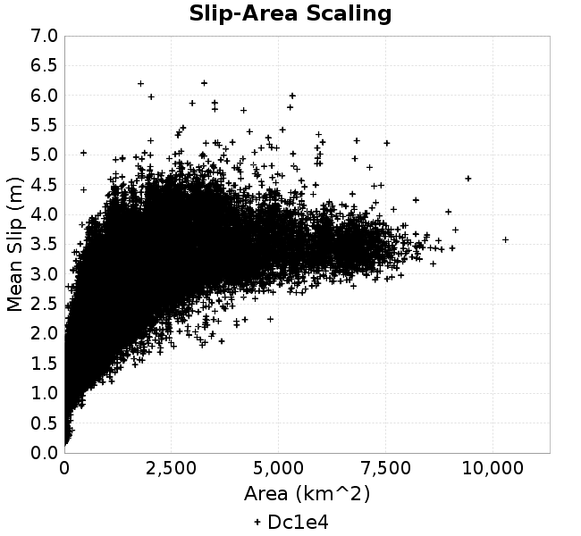 |  |
### Rupture Velocity Plots
*[(top)](#dc1e4)*

| **Scatter** |  |
|-----|-----|
| **Distance/Velocity** | 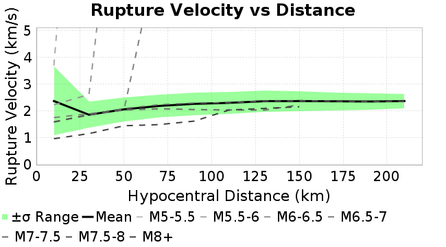 |
### Global Interevent-Time Distributions
*[(top)](#dc1e4)*

| **M≥6** | **M≥6.5** | **M≥7** | **M≥7.5** |
|-----|-----|-----|-----|
| 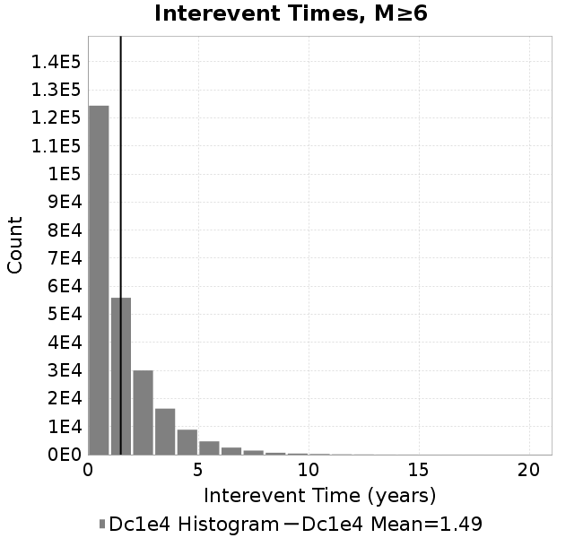 |  | 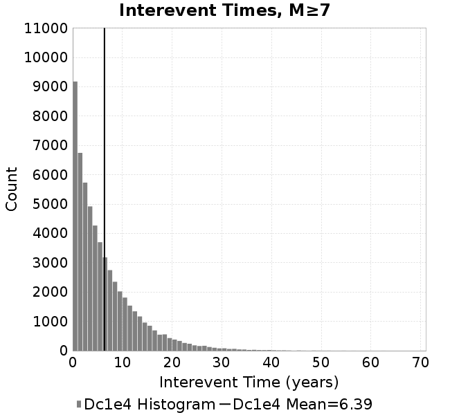 | 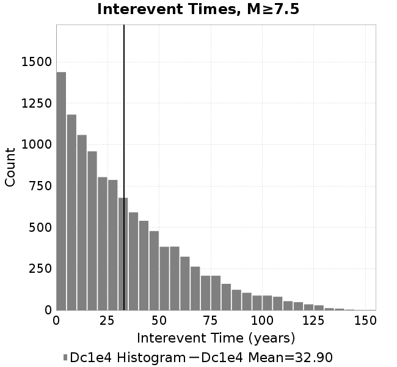 |
### Normalized Fault Interevent-Time Distributions
*[(top)](#dc1e4)*

|  | **M≥6** | **M≥6.5** | **M≥7** | **M≥7.5** |
|-----|-----|-----|-----|-----|
| **Elements** |  |  |  |  |
| **Subsections** |  |  | 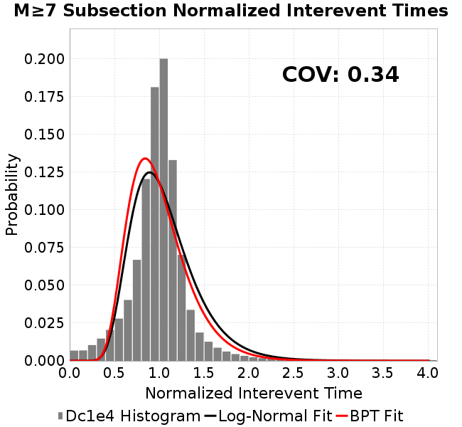 | 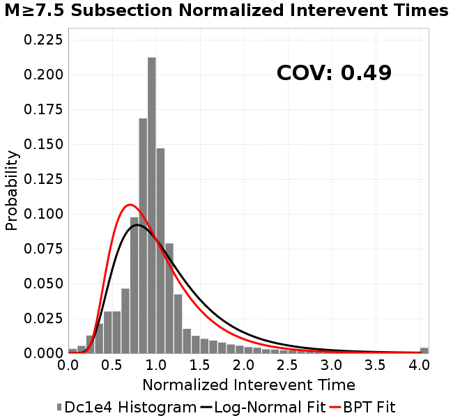 |
| **Sections** |  |  | 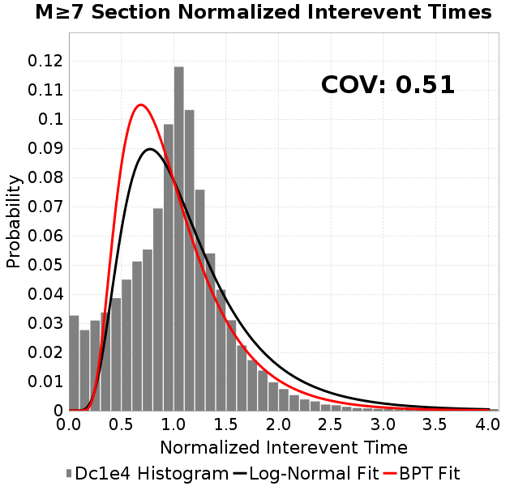 | 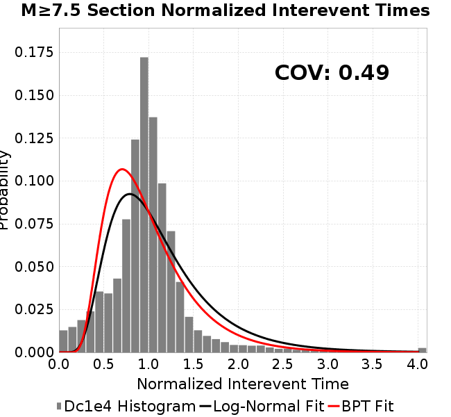 |
### Stationarity Plot
*[(top)](#dc1e4)*

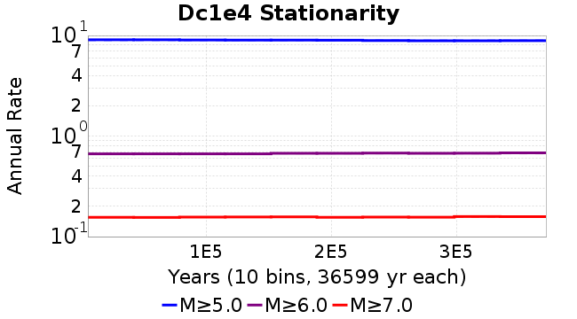
### Element/Subsection Interevent Time Comparisons

#### Element Interevent Time Comparisons
*[(top)](#dc1e4)*

| Min Mag | Scatter | 2-D Hist |
|-----|-----|-----|
| **M≥6.0** |  |  |
| **M≥6.5** | 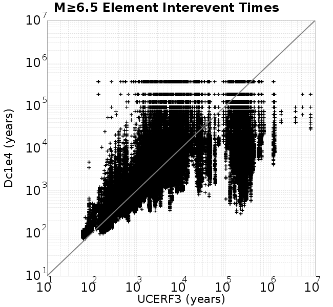 | 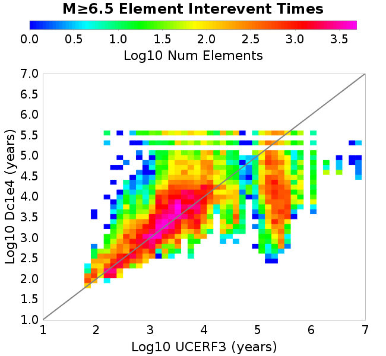 |
| **M≥7.0** |  | 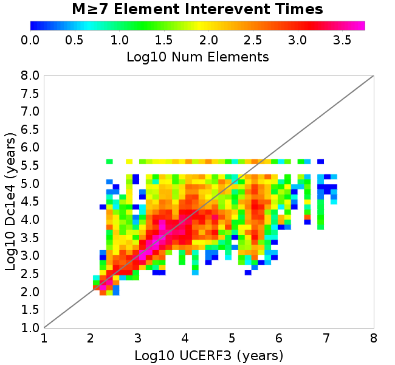 |
| **M≥7.5** | 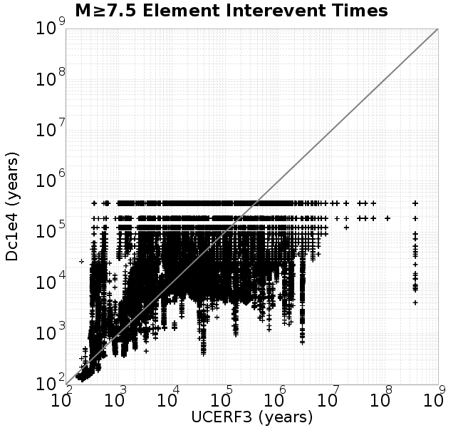 |  |

#### Subsection Interevent Time Comparisons
*[(top)](#dc1e4)*

*Subsections participate in a rupture if at least 20.0 % of its area ruptures*

| Min Mag | Scatter | 2-D Hist |
|-----|-----|-----|
| **M≥6.0** | 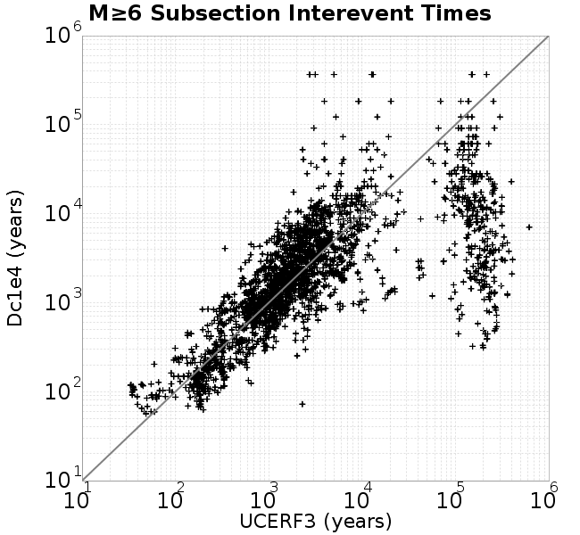 |  |
| **M≥6.5** | 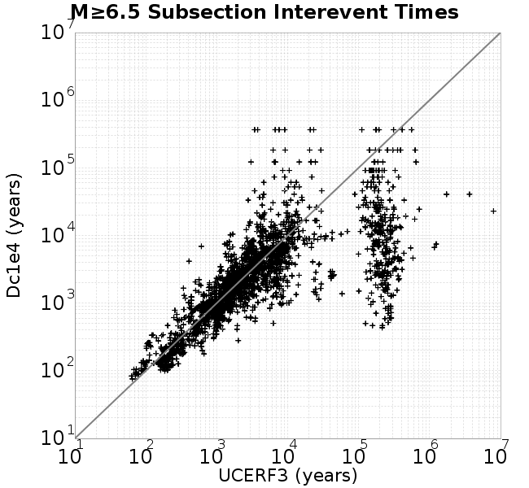 | 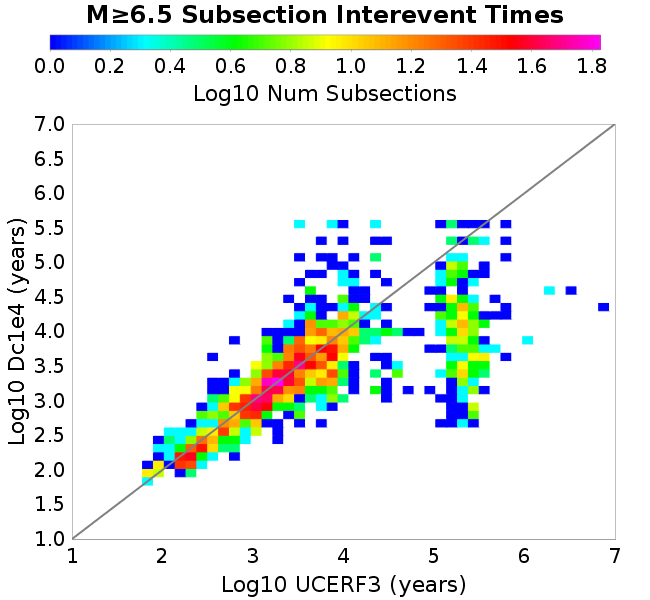 |
| **M≥7.0** |  |  |
| **M≥7.5** | 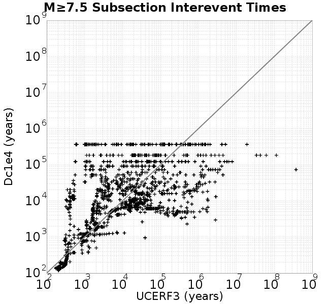 | 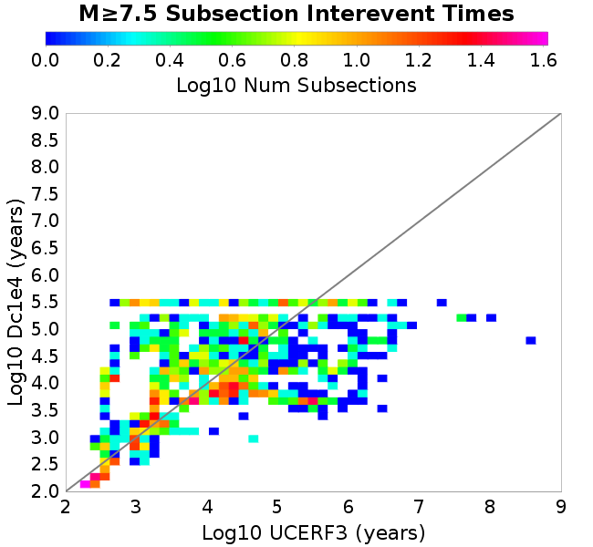 |

### Paleo Open Interval Plots
*[(top)](#dc1e4)*

#### Paleo Open Interval Plots, Biasi and Sharer 2019
*[(top)](#dc1e4)*

These plots use the 5 paleoseismic sites identified in Biasi & Scharer (2019) on the Hayward, N. SAF, S. SAF, and SJC faults. By default, a rupture is counted at a paleo site if the nearest element (at the surface) slips any amount. We also alternatively apply a probability of detection model. Those results are marked as 'Prob. Filtered'.

**Paleoseismic sites table:**

| **Site Name** | Data MRI (yr) | Data Annual Rate | Catalog MRI (yr) | Catalog Annual Rate | Catalog Occurences | Prob Filtered Catalog MRI (yr) | Prob Filtered Catalog Annual Rate | Prob Filtered Catalog Occurences |
|-----|-----|-----|-----|-----|-----|-----|-----|-----|
| **HOG** | 191.00 | 0.005235602 | 355.08 | 0.0028162324 | 1031 | 359.00 | 0.002785548 | 1019.75 |
| **FRA** | 119.00 | 0.008403362 | 112.24 | 0.0089094015 | 3261 | 118.61 | 0.008430733 | 3085.65 |
| **COA** | 181.00 | 0.005524862 | 174.39 | 0.0057341666 | 2099 | 186.62 | 0.0053585037 | 1961.49 |
| **SCZ** | 106.00 | 0.009433962 | 117.48 | 0.0085122725 | 3114 | 136.93 | 0.0073027737 | 2671.52 |
| **TYS** | 329.00 | 0.0030395137 | 336.83 | 0.0029688186 | 1086 | 373.40 | 0.002678117 | 979.68 |
| **TOTAL** | 31.61 | 0.0316373 | 34.56 | 0.028933931 | 10590 | 37.65 | 0.026561359 | 9721.14 |

**Paleoseismic Plots:**

| 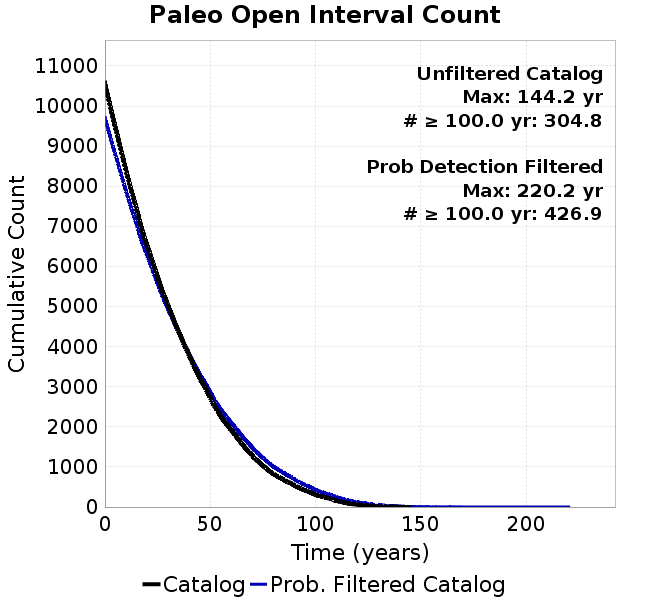 |  |
|-----|-----|

**Open interval probabilities table:**

| **Open Interval (yr)** | Catalog Probability | Catalog Poisson Probability | Prob. Filtered Catalog Probability | Prob. Filtered Catalog Poisson Probability | Data Poisson Probability |
|-----|-----|-----|-----|-----|-----|
| **10.00** | 0.97077096 | 0.7487581 | 0.9751917 | 0.7667353 | 0.72878754 |
| **20.00** | 0.8950117 | 0.56063867 | 0.9097728 | 0.58788306 | 0.53113127 |
| **30.00** | 0.79338723 | 0.41978276 | 0.8198068 | 0.45075074 | 0.3870819 |
| **40.00** | 0.67412573 | 0.31431574 | 0.71346503 | 0.3456065 | 0.28210047 |
| **50.00** | 0.5463407 | 0.23534645 | 0.59717953 | 0.26498872 | 0.2055913 |
| **60.00** | 0.42428666 | 0.17621756 | 0.48245853 | 0.20317623 | 0.14983238 |
| **70.00** | 0.31333706 | 0.13194433 | 0.37279433 | 0.15578239 | 0.10919597 |
| **80.00** | 0.21956633 | 0.09879438 | 0.27589008 | 0.11944386 | 0.079580665 |
| **90.00** | 0.15299469 | 0.07397309 | 0.20242284 | 0.09158184 | 0.057997398 |
| **100.00** | 0.0934768 | 0.05538795 | 0.13429539 | 0.070219025 | 0.04226778 |
| **110.00** | 0.050767682 | 0.041472178 | 0.08220462 | 0.05383941 | 0.030804234 |
| **120.00** | 0.020270199 | 0.031052629 | 0.043400936 | 0.04128058 | 0.022449743 |
| **130.00** | 0.0062894737 | 0.023250908 | 0.019271132 | 0.031651277 | 0.016361093 |
| **140.00** | 0.0010134315 | 0.017409304 | 0.0073851934 | 0.024268154 | 0.011923761 |
| **150.00** | 0.0 | 0.013035358 | 0.00258138 | 0.018607251 | 0.008689889 |
| **160.00** | 0.0 | 0.0097603295 | 0.0013928915 | 0.014266837 | 0.0063330824 |
| **170.00** | 0.0 | 0.007308126 | 7.4189E-4 | 0.010938888 | 0.0046154717 |
| **180.00** | 0.0 | 0.0054720184 | 3.5947794E-4 | 0.008387232 | 0.0033636983 |
| **190.00** | 0.0 | 0.004097218 | 1.3277154E-4 | 0.0064307875 | 0.0024514215 |
| **200.00** | 0.0 | 0.0030678252 | 5.45071E-5 | 0.004930712 | 0.0017865654 |
| **210.00** | 0.0 | 0.002297059 | 1.5629887E-5 | 0.003780551 | 0.0013020267 |
| **220.00** | 0.0 | 0.0017199415 | 6.428628E-6 | 0.0028986821 | 9.489008E-4 |
| **230.00** | 0.0 | 0.00128782 | 0.0 | 0.0022225222 | 6.915471E-4 |

#### Paleo Open Interval Plots, UCERF3
*[(top)](#dc1e4)*

These plots use the full set of UCERF3 paleoseismic sites. By default, a rupture is counted at a paleo site if the nearest element (at the surface) slips any amount. We also alternativeslyapply a probability of detection model. Those results are marked as 'Prob. Filtered'.

**Paleoseismic sites table:**

| **Site Name** | Data MRI (yr) | Data Annual Rate | Catalog MRI (yr) | Catalog Annual Rate | Catalog Occurences | Prob Filtered Catalog MRI (yr) | Prob Filtered Catalog Annual Rate | Prob Filtered Catalog Occurences |
|-----|-----|-----|-----|-----|-----|-----|-----|-----|
| **SSanAndreasBurroFlats** | 205.44 | 0.0048677 | 205.96 | 0.004855427 | 1778 | 234.40 | 0.004266239 | 1562.22 |
| **SSanAndreasIndio** | 277.37 | 0.0036053 | 171.29 | 0.0058380268 | 2137 | 182.07 | 0.005492326 | 2010.43 |
| **SSAFMCreek1000Palms** | 261.33 | 0.0038266 | 1523.27 | 6.564832E-4 | 239 | 2246.04 | 4.4522726E-4 | 161.91 |
| **NSanAndreasFortRoss** | 306.28 | 0.003265 | 184.03 | 0.005433937 | 1989 | 186.83 | 0.0053523565 | 1959.11 |
| **NSanAndreasNorthCoast** | 263.87 | 0.0037898 | 172.90 | 0.005783808 | 2117 | 178.24 | 0.005610431 | 2053.54 |
| **CalaverasfaultNorth** | 618.05 | 0.001618 | 160.49 | 0.0062310765 | 2281 | 233.04 | 0.004291124 | 1570.44 |
| **ElsinoreTemecula** | 1019.16 | 9.812E-4 | 653.42 | 0.0015304202 | 560 | 682.10 | 0.0014660619 | 536.45 |
| **ElsinoreWhittier** | 3196.93 | 3.128E-4 | 1474.63 | 6.781379E-4 | 248 | 1554.20 | 6.4341875E-4 | 235.3 |
| **SSAFCarrizoBidart** | 114.71 | 0.0087179 | 116.31 | 0.008597845 | 3147 | 119.97 | 0.008335466 | 3050.95 |
| **SanJacintoHogLake** | 311.78 | 0.0032074 | 355.08 | 0.0028162324 | 1031 | 359.09 | 0.0027848384 | 1019.49 |
| **PuenteHills** | 3506.31 | 2.852E-4 | 4811.12 | 2.0785164E-4 | 76 | 5293.25 | 1.8891992E-4 | 69.11 |
| **SanGregorioNorth** | 1019.06 | 9.813E-4 | 384.07 | 0.0026036939 | 953 | 396.73 | 0.0025206157 | 922.6 |
| **SanJacintoSuperstition** | 508.26 | 0.0019675 | 1151.56 | 8.683841E-4 | 317 | 1248.89 | 8.00712E-4 | 292.27 |
| **SSanAndreasWrightwood** | 106.04 | 0.0094304 | 148.46 | 0.006735822 | 2465 | 150.33 | 0.006651868 | 2434.28 |
| **SSanAndreasPitmanCanyon** | 173.48 | 0.0057643 | 134.17 | 0.00745348 | 2728 | 152.92 | 0.006539576 | 2393.39 |
| **SSanAndreasPlungeCreek** | 205.36 | 0.0048695 | 343.45 | 0.0029116059 | 1065 | 430.98 | 0.0023202812 | 848.68 |
| **FrazierMountianSSAF** | 148.57 | 0.0067307 | 112.24 | 0.0089094015 | 3261 | 118.60 | 0.008431895 | 3086.08 |
| **NSanAndreasSantaCruzSeg** | 109.84 | 0.0091041 | 117.48 | 0.0085122725 | 3114 | 136.77 | 0.007311714 | 2674.78 |
| **RodgersCreek** | 325.31 | 0.003074 | 161.95 | 0.0061748787 | 2259 | 224.99 | 0.00444469 | 1625.95 |
| **GreenValleyMasonRoad** | 293.31 | 0.0034094 | 1605.53 | 6.228488E-4 | 227 | 2240.29 | 4.463708E-4 | 162.61 |
| **HaywardfaultNorth** | 318.34 | 0.0031413 | 354.99 | 0.0028169893 | 1030 | 366.25 | 0.0027303987 | 998.35 |
| **HaywardfaultSouth** | 167.57 | 0.0059677 | 336.83 | 0.0029688186 | 1086 | 373.68 | 0.0026760937 | 978.95 |
| **Compton** | 2658.16 | 3.762E-4 | 5597.95 | 1.7863687E-4 | 65 | 6224.49 | 1.6065573E-4 | 58.35 |
| **SSanAndreasCoachella** | 178.45 | 0.0056037 | 174.39 | 0.0057341666 | 2099 | 186.52 | 0.0053613055 | 1962.52 |
| **ElsinoreGlenIvy** | 179.12 | 0.0055828 | 552.66 | 0.0018094336 | 662 | 602.00 | 0.0016611196 | 607.67 |
| **GarlockCentralallevents** | 1434.93 | 6.969E-4 | 612.13 | 0.0016336435 | 598 | 622.91 | 0.0016053788 | 587.63 |
| **NSanAndreasAlderCreek** | 869.64 | 0.0011499 | 184.40 | 0.0054230033 | 1985 | 187.29 | 0.005339335 | 1954.39 |
| **SSanAndreasPallettCreek** | 149.30 | 0.006698 | 148.52 | 0.0067330883 | 2464 | 150.34 | 0.006651673 | 2434.2 |
| **GarlockWesternallevents** | 1230.16 | 8.129E-4 | 802.97 | 0.0012453744 | 456 | 826.67 | 0.001209675 | 442.9 |
| **ElsinoreFaultJulian** | 3250.98 | 3.076E-4 | 1211.39 | 8.2549895E-4 | 302 | 1236.98 | 8.084223E-4 | 295.71 |
| **TOTAL** | 9.08 | 0.1101451 | 13.83 | 0.07230538 | 26464 | 15.45 | 0.064720005 | 23687.57 |

**Paleoseismic Plots:**

| 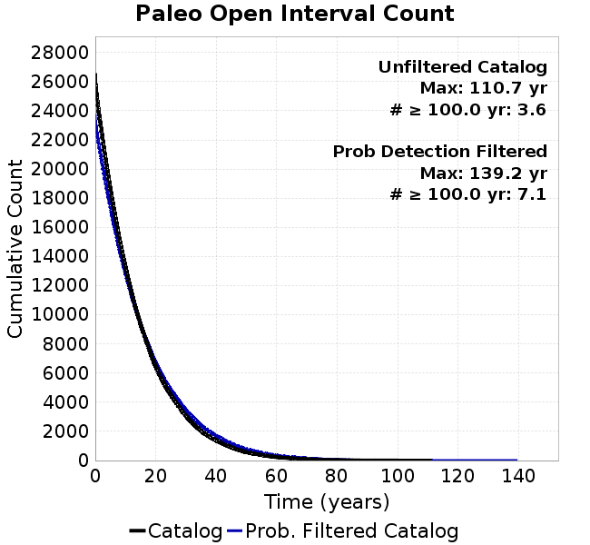 |  |
|-----|-----|

**Open interval probabilities table:**

| **Open Interval (yr)** | Catalog Probability | Catalog Poisson Probability | Prob. Filtered Catalog Probability | Prob. Filtered Catalog Poisson Probability | Data Poisson Probability |
|-----|-----|-----|-----|-----|-----|
| **10.00** | 0.84617823 | 0.4852681 | 0.87074953 | 0.52350956 | 0.33238843 |
| **20.00** | 0.5767688 | 0.23548512 | 0.6304527 | 0.27406225 | 0.110482074 |
| **30.00** | 0.3495181 | 0.114273414 | 0.41095707 | 0.1434742 | 0.036722966 |
| **40.00** | 0.1920877 | 0.05545324 | 0.24669464 | 0.075110115 | 0.012206289 |
| **50.00** | 0.09529756 | 0.026909688 | 0.13407555 | 0.03932086 | 0.004057229 |
| **60.00** | 0.043937024 | 0.013058414 | 0.06994118 | 0.020584846 | 0.001348576 |
| **70.00** | 0.021014238 | 0.0063368315 | 0.03481891 | 0.010776363 | 4.4825108E-4 |
| **80.00** | 0.007989293 | 0.003075062 | 0.015051005 | 0.005641529 | 1.4899348E-4 |
| **90.00** | 0.0025807102 | 0.0014922295 | 0.0056615714 | 0.0029533943 | 4.952371E-5 |
| **100.00** | 0.0010297495 | 7.2413136E-4 | 0.0020952695 | 0.00154613 | 1.6461108E-5 |
| **110.00** | 3.9409686E-4 | 3.5139784E-4 | 9.533426E-4 | 8.0941385E-4 | 5.4714824E-6 |
| **120.00** | 0.0 | 1.7052215E-4 | 1.6701248E-4 | 4.2373588E-4 | 1.8186574E-6 |
| **130.00** | 0.0 | 8.2748964E-5 | 1.3372132E-5 | 2.2182977E-4 | 6.045007E-7 |
| **140.00** | 0.0 | 4.015543E-5 | 0.0 | 1.1613E-4 | 2.0092905E-7 |

### Moment Release Variability Plots
*[(top)](#dc1e4)*

We first create a tapered moment release time series for the entire catalog. Each event's moment is distributed across a 25 year Hanning (cosine) taper. Here is a plot of a random 2,000 year section of this time series:

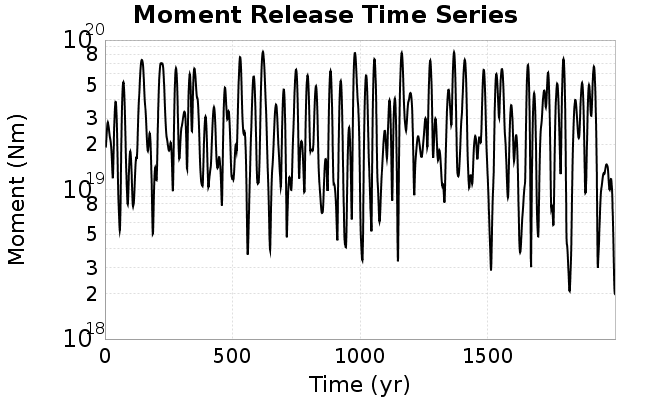

We then compute Welch's power spectral density estimate on the entire time series. Results are plotted below, with a Poisson randomization of the catalog also plotted in a gray line, and the 95% confidence bounds from 200 realizations as a light gray shaded area. Significant deviations outside the Poisson confidence intervals indicate synchronous behaviour.

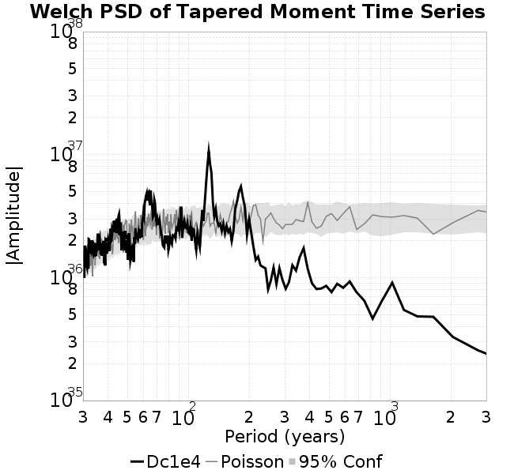

## Input File
*[(top)](#dc1e4)*

```
  A_1 = 0.001
  fA = .1
  B_1 = 0.008
  muSlipAmp_1 = .0
  muSlipInvDist_1 = 1.0
  cohesion = 0.0
  Dc_1 = 1.0000000000000000818e-04
  mu0_1 = 0.6
  ddotStar_1 = 9.9999999999999995475e-07
  ddotAB_1 = 9.9999999999999995475e-07
  alpha_1 = 0.0
  theta0_1 = 200000000
  tau0_1 = 55.1
  sigma0_1 = 100
  sigmaFracPin = .5
  lowSigmaAction = 1
  maxThetaPin = 1.0e13
  ddotEQ_1 = 1
  ddotEQFname = 
  stressOvershootFactor = 0.10000000000000000555
  lameLambda = 30000
  lameMu = 30000
  slowSlip_1 = 0
  nEq = 100000000000
  KZeroFrac = 0
  muPin = 1.0
  tStart = 0
  maxT = 3.16e13
  maxWallTime = 169200
  maxTrans = 1.0000000000000000159e100
  faultFname = UCERF3FM.15km.1km.tri.flt
  outFnameInfix = Dc1e4
  writeTau = 2
  writeSigma = 2
  writeSlip = 0
  writeSlipSpeed = 0
  writeState = 0
  writeTheta = 2
  writePED = 1
  writeTransitions = 1
  minDtWrite = 0
  minDtWriteCoseismic = 0
  minDtWriteInterseismic = 0
  minMagWrite = 7.7
  writeStiffness = 0
  stressRateSpecification = 1
  dMu3 = 0.01000000000000000
  initTauFname = 
  initSigmaFname = 
  initThetaFname = 
  initSlipSpeedFname = 
  AFname = 
  BFname =  
  DcFname = 
  mu0Fname = 
  ddotStarFname = 
  ddotABFname = 
  alphaFname = 
  KTauFname = /u/sciteam/gilchris/scratch/stiffness_25a589d/Ktau.25a589d.out
  KSigmaFname = /u/sciteam/gilchris/scratch/stiffness_25a589d/Ksigma.25a589d.out
  tFailFname = 
  tauFailFname = 
  tauDotFname = 
  sigmaDotFname =
  KZeroFname = UCERF3FM.15km.1km.tri.KZero
  pinnedFname =  UCERF3FM.15km.1km.tri.pin
  neighborFname = UCERF3FM.15km.1km.tri.neighbors
  stressRateFname =  
  slowSlipFname = 
  writePatchFname = 
  DEBUG = 0
  ZBrentUpperBracket = 0
  receiverElementAreaFrac = 0.8
  receiverElementIntTol = 1.0e-4
  receiverElementSubdivisionMax = 4
  tgfDist1 = 3
  tgfDist1 = 10
  lowSigmaAction = 1
  highSigmaAction = 0
```
