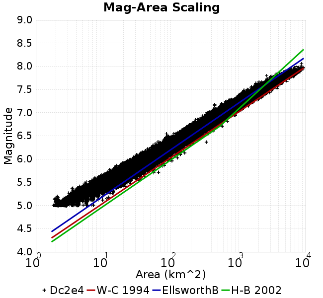
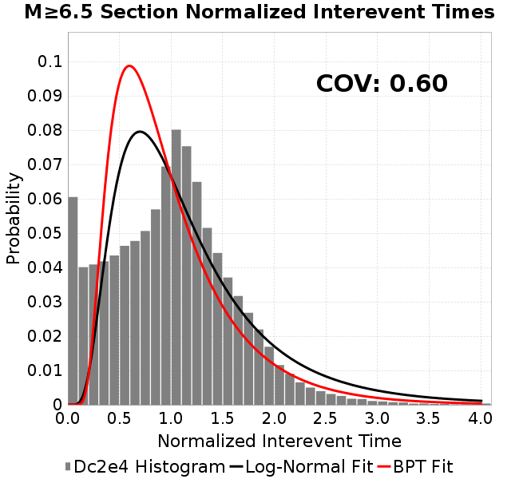
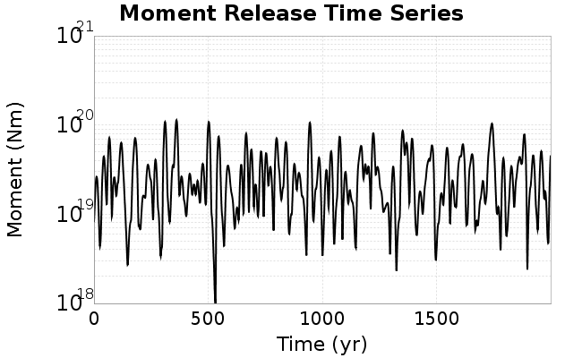

# Dc2e4
## Metadata
| **Catalog** | Dc2e4 |
|-----|-----|
| **Author** | Jaqcui Gilchrist, 2018/09/27 |
| **Description** | change Dc: Dc=2.00E-04 |
| **Fault/Def Model** | Fault Model 3.1, Geologic |
| **Slip Velocity** | 1.0 m/s |
| **Average Element Area** | 1.35 km^2 |
| **Length** | 7,076,632 events in 342,059 years |
| **Frictional Params** | a=0.001, b=0.008, (b-a)=0.007, ddotEQ=1 |

* [Metadata](#metadata)
* [Plots](#plots)
  * [Magnitude-Frequency Plot](#magnitude-frequency-plot)
  * [Magnitude-Area Plots](#magnitude-area-plots)
  * [Slip-Area Plots](#slip-area-plots)
  * [Rupture Velocity Plots](#rupture-velocity-plots)
  * [Global Interevent-Time Distributions](#global-interevent-time-distributions)
  * [Normalized Fault Interevent-Time Distributions](#normalized-fault-interevent-time-distributions)
  * [Stationarity Plot](#stationarity-plot)
  * [Element/Subsection Interevent Time Comparisons](#elementsubsection-interevent-time-comparisons)
    * [Element Interevent Time Comparisons](#element-interevent-time-comparisons)
    * [Subsection Interevent Time Comparisons](#subsection-interevent-time-comparisons)
  * [Paleo Open Interval Plots](#paleo-open-interval-plots)
    * [Paleo Open Interval Plots, Biasi and Sharer 2019](#paleo-open-interval-plots-biasi-and-sharer-2019)
    * [Paleo Open Interval Plots, UCERF3](#paleo-open-interval-plots-ucerf3)
  * [Moment Release Variability Plots](#moment-release-variability-plots)
* [Input File](#input-file)

## Plots
### Magnitude-Frequency Plot
*[(top)](#dc2e4)*


### Magnitude-Area Plots
*[(top)](#dc2e4)*

| Scatter | 2-D Hist |
|-----|-----|
|  |  |
### Slip-Area Plots
*[(top)](#dc2e4)*

| Scatter | 2-D Hist |
|-----|-----|
|  |  |
### Rupture Velocity Plots
*[(top)](#dc2e4)*

| **Scatter** |  |
|-----|-----|
| **Distance/Velocity** |  |
### Global Interevent-Time Distributions
*[(top)](#dc2e4)*

| **M≥6** | **M≥6.5** | **M≥7** | **M≥7.5** |
|-----|-----|-----|-----|
|  |  |  |  |
### Normalized Fault Interevent-Time Distributions
*[(top)](#dc2e4)*

|  | **M≥6** | **M≥6.5** | **M≥7** | **M≥7.5** |
|-----|-----|-----|-----|-----|
| **Elements** |  |  |  |  |
| **Subsections** |  |  |  |  |
| **Sections** |  |  |  |  |
### Stationarity Plot
*[(top)](#dc2e4)*


### Element/Subsection Interevent Time Comparisons

#### Element Interevent Time Comparisons
*[(top)](#dc2e4)*

| Min Mag | Scatter | 2-D Hist |
|-----|-----|-----|
| **M≥6.0** |  |  |
| **M≥6.5** |  |  |
| **M≥7.0** |  |  |
| **M≥7.5** |  |  |

#### Subsection Interevent Time Comparisons
*[(top)](#dc2e4)*

*Subsections participate in a rupture if at least 20.0 % of its area ruptures*

| Min Mag | Scatter | 2-D Hist |
|-----|-----|-----|
| **M≥6.0** |  |  |
| **M≥6.5** |  |  |
| **M≥7.0** |  |  |
| **M≥7.5** |  |  |

### Paleo Open Interval Plots
*[(top)](#dc2e4)*

#### Paleo Open Interval Plots, Biasi and Sharer 2019
*[(top)](#dc2e4)*

These plots use the 5 paleoseismic sites identified in Biasi & Scharer (2019) on the Hayward, N. SAF, S. SAF, and SJC faults. By default, a rupture is counted at a paleo site if the nearest element (at the surface) slips any amount. We also alternatively apply a probability of detection model. Those results are marked as 'Prob. Filtered'.

**Paleoseismic sites table:**

| **Site Name** | Data MRI (yr) | Data Annual Rate | Catalog MRI (yr) | Catalog Annual Rate | Catalog Occurences | Prob Filtered Catalog MRI (yr) | Prob Filtered Catalog Annual Rate | Prob Filtered Catalog Occurences |
|-----|-----|-----|-----|-----|-----|-----|-----|-----|
| **HOG** | 191.00 | 0.005235602 | 352.23 | 0.0028390326 | 956 | 356.78 | 0.0028028255 | 943.79 |
| **FRA** | 119.00 | 0.008403362 | 109.58 | 0.009125803 | 3076 | 116.69 | 0.0085697165 | 2888.61 |
| **COA** | 181.00 | 0.005524862 | 173.24 | 0.0057724463 | 1945 | 185.65 | 0.00538637 | 1814.95 |
| **SCZ** | 106.00 | 0.009433962 | 114.99 | 0.008696055 | 2931 | 134.96 | 0.0074093696 | 2497.36 |
| **TYS** | 329.00 | 0.0030395137 | 332.87 | 0.0030041367 | 1012 | 369.11 | 0.0027092097 | 912.64 |
| **TOTAL** | 31.61 | 0.0316373 | 33.97 | 0.02943702 | 9920 | 37.20 | 0.026882777 | 9059.29 |

**Paleoseismic Plots:**

|  |  |
|-----|-----|

**Open interval probabilities table:**

| **Open Interval (yr)** | Catalog Probability | Catalog Poisson Probability | Prob. Filtered Catalog Probability | Prob. Filtered Catalog Poisson Probability | Data Poisson Probability |
|-----|-----|-----|-----|-----|-----|
| **10.00** | 0.9707219 | 0.74500066 | 0.9754677 | 0.7642749 | 0.72878754 |
| **20.00** | 0.89257693 | 0.55502594 | 0.9085332 | 0.5841161 | 0.53113127 |
| **30.00** | 0.78635985 | 0.4134947 | 0.8153998 | 0.44642526 | 0.3870819 |
| **40.00** | 0.6643443 | 0.30805382 | 0.70665365 | 0.3411916 | 0.28210047 |
| **50.00** | 0.5325506 | 0.2295003 | 0.5868132 | 0.26076418 | 0.2055913 |
| **60.00** | 0.40544575 | 0.17097786 | 0.46816748 | 0.1992955 | 0.14983238 |
| **70.00** | 0.28672627 | 0.12737861 | 0.3521922 | 0.15231654 | 0.10919597 |
| **80.00** | 0.19131814 | 0.09489715 | 0.25369477 | 0.11641171 | 0.079580665 |
| **90.00** | 0.1191373 | 0.07069844 | 0.17368475 | 0.08897054 | 0.057997398 |
| **100.00** | 0.07050177 | 0.052670382 | 0.116734944 | 0.06799795 | 0.04226778 |
| **110.00** | 0.03746981 | 0.03923947 | 0.07260067 | 0.051969126 | 0.030804234 |
| **120.00** | 0.016740302 | 0.02923343 | 0.041091442 | 0.0397187 | 0.022449743 |
| **130.00** | 0.006187203 | 0.021778924 | 0.018907068 | 0.030356003 | 0.016361093 |
| **140.00** | 0.0012930736 | 0.016225312 | 0.008030395 | 0.02320033 | 0.011923761 |
| **150.00** | 0.0 | 0.0120878685 | 0.0032428568 | 0.01773143 | 0.008689889 |
| **160.00** | 0.0 | 0.009005469 | 0.0013041849 | 0.013551686 | 0.0063330824 |
| **170.00** | 0.0 | 0.0067090807 | 5.982333E-4 | 0.010357213 | 0.0046154717 |
| **180.00** | 0.0 | 0.0049982695 | 2.2896598E-4 | 0.007915758 | 0.0033636983 |
| **190.00** | 0.0 | 0.0037237138 | 7.998704E-5 | 0.0060498146 | 0.0024514215 |
| **200.00** | 0.0 | 0.0027741692 | 3.413805E-5 | 0.0046237214 | 0.0017865654 |
| **210.00** | 0.0 | 0.0020667578 | 2.0002817E-5 | 0.003533794 | 0.0013020267 |
| **220.00** | 0.0 | 0.0015397359 | 0.0 | 0.00270079 | 9.489008E-4 |

#### Paleo Open Interval Plots, UCERF3
*[(top)](#dc2e4)*

These plots use the full set of UCERF3 paleoseismic sites. By default, a rupture is counted at a paleo site if the nearest element (at the surface) slips any amount. We also alternativeslyapply a probability of detection model. Those results are marked as 'Prob. Filtered'.

**Paleoseismic sites table:**

| **Site Name** | Data MRI (yr) | Data Annual Rate | Catalog MRI (yr) | Catalog Annual Rate | Catalog Occurences | Prob Filtered Catalog MRI (yr) | Prob Filtered Catalog Annual Rate | Prob Filtered Catalog Occurences |
|-----|-----|-----|-----|-----|-----|-----|-----|-----|
| **SSanAndreasBurroFlats** | 205.44 | 0.0048677 | 207.34 | 0.004822887 | 1625 | 234.91 | 0.004256867 | 1434.11 |
| **SSanAndreasIndio** | 277.37 | 0.0036053 | 171.04 | 0.0058466806 | 1970 | 181.71 | 0.005503198 | 1854.3 |
| **SSAFMCreek1000Palms** | 261.33 | 0.0038266 | 1578.63 | 6.3346163E-4 | 213 | 2289.46 | 4.3678368E-4 | 146.53 |
| **NSanAndreasFortRoss** | 306.28 | 0.003265 | 182.12 | 0.0054907496 | 1851 | 184.69 | 0.005414383 | 1825.24 |
| **NSanAndreasNorthCoast** | 263.87 | 0.0037898 | 173.41 | 0.0057667713 | 1944 | 178.23 | 0.0056108637 | 1891.47 |
| **CalaverasfaultNorth** | 618.05 | 0.001618 | 157.43 | 0.0063520656 | 2141 | 229.88 | 0.004350132 | 1465.64 |
| **ElsinoreTemecula** | 1019.16 | 9.812E-4 | 648.86 | 0.0015411705 | 519 | 677.49 | 0.0014760373 | 497.08 |
| **ElsinoreWhittier** | 3196.93 | 3.128E-4 | 1478.39 | 6.764112E-4 | 228 | 1557.55 | 6.420335E-4 | 216.39 |
| **SSAFCarrizoBidart** | 114.71 | 0.0087179 | 115.16 | 0.008683503 | 2927 | 118.86 | 0.008413209 | 2835.79 |
| **SanJacintoHogLake** | 311.78 | 0.0032074 | 352.23 | 0.0028390326 | 956 | 356.58 | 0.0028044546 | 944.34 |
| **PuenteHills** | 3506.31 | 2.852E-4 | 4704.44 | 2.1256533E-4 | 72 | 5136.88 | 1.9467082E-4 | 65.92 |
| **SanGregorioNorth** | 1019.06 | 9.813E-4 | 381.64 | 0.0026203003 | 883 | 395.19 | 0.0025304575 | 852.75 |
| **SanJacintoSuperstition** | 508.26 | 0.0019675 | 1154.72 | 8.660125E-4 | 292 | 1242.17 | 8.050411E-4 | 271.43 |
| **SSanAndreasWrightwood** | 106.04 | 0.0094304 | 149.43 | 0.0066922554 | 2256 | 151.23 | 0.0066123637 | 2229.08 |
| **SSanAndreasPitmanCanyon** | 173.48 | 0.0057643 | 135.38 | 0.007386707 | 2490 | 153.81 | 0.006501407 | 2191.66 |
| **SSanAndreasPlungeCreek** | 205.36 | 0.0048695 | 348.24 | 0.002871613 | 968 | 433.36 | 0.0023075757 | 777.42 |
| **FrazierMountianSSAF** | 148.57 | 0.0067307 | 109.58 | 0.009125803 | 3076 | 116.60 | 0.008576147 | 2890.79 |
| **NSanAndreasSantaCruzSeg** | 109.84 | 0.0091041 | 114.99 | 0.008696055 | 2931 | 135.05 | 0.0074046934 | 2495.77 |
| **RodgersCreek** | 325.31 | 0.003074 | 158.31 | 0.006316618 | 2129 | 221.83 | 0.0045078723 | 1519.28 |
| **GreenValleyMasonRoad** | 293.31 | 0.0034094 | 1639.05 | 6.101111E-4 | 206 | 2241.74 | 4.4608186E-4 | 150.47 |
| **HaywardfaultNorth** | 318.34 | 0.0031413 | 350.83 | 0.0028503486 | 961 | 361.59 | 0.0027655773 | 932.41 |
| **HaywardfaultSouth** | 167.57 | 0.0059677 | 332.87 | 0.0030041367 | 1012 | 369.01 | 0.0027099713 | 912.91 |
| **Compton** | 2658.16 | 3.762E-4 | 5566.92 | 1.7963267E-4 | 61 | 6194.50 | 1.6143352E-4 | 54.68 |
| **SSanAndreasCoachella** | 178.45 | 0.0056037 | 173.24 | 0.0057724463 | 1945 | 185.74 | 0.005383941 | 1814.15 |
| **ElsinoreGlenIvy** | 179.12 | 0.0055828 | 536.91 | 0.0018624956 | 627 | 588.10 | 0.0017003819 | 572.5 |
| **GarlockCentralallevents** | 1434.93 | 6.969E-4 | 599.18 | 0.0016689424 | 563 | 610.31 | 0.0016385042 | 552.7 |
| **NSanAndreasAlderCreek** | 869.64 | 0.0011499 | 182.34 | 0.00548415 | 1849 | 185.17 | 0.0054005357 | 1820.77 |
| **SSanAndreasPallettCreek** | 149.30 | 0.006698 | 149.43 | 0.0066922554 | 2256 | 151.17 | 0.0066151875 | 2230.02 |
| **GarlockWesternallevents** | 1230.16 | 8.129E-4 | 791.23 | 0.0012638525 | 426 | 816.47 | 0.001224782 | 412.83 |
| **ElsinoreFaultJulian** | 3250.98 | 3.076E-4 | 1227.81 | 8.144582E-4 | 274 | 1254.33 | 7.9723797E-4 | 268.08 |
| **TOTAL** | 9.08 | 0.1101451 | 13.64 | 0.073305786 | 24707 | 15.27 | 0.06549631 | 22074.88 |

**Paleoseismic Plots:**

|  |  |
|-----|-----|

**Open interval probabilities table:**

| **Open Interval (yr)** | Catalog Probability | Catalog Poisson Probability | Prob. Filtered Catalog Probability | Prob. Filtered Catalog Poisson Probability | Data Poisson Probability |
|-----|-----|-----|-----|-----|-----|
| **10.00** | 0.8421211 | 0.48043764 | 0.8678466 | 0.5194612 | 0.33238843 |
| **20.00** | 0.5764082 | 0.23082033 | 0.63006717 | 0.26983997 | 0.110482074 |
| **30.00** | 0.34160593 | 0.11089478 | 0.40401945 | 0.1401714 | 0.036722966 |
| **40.00** | 0.18255518 | 0.053278025 | 0.23592348 | 0.0728136 | 0.012206289 |
| **50.00** | 0.08311514 | 0.02559677 | 0.12312386 | 0.037823845 | 0.004057229 |
| **60.00** | 0.03733003 | 0.012297652 | 0.061531287 | 0.01964802 | 0.001348576 |
| **70.00** | 0.010418825 | 0.0059082545 | 0.02367897 | 0.010206385 | 4.4825108E-4 |
| **80.00** | 0.003310307 | 0.002838548 | 0.010119864 | 0.0053018206 | 1.4899348E-4 |
| **90.00** | 0.0010395662 | 0.0013637453 | 0.0038690944 | 0.0027540904 | 4.952371E-5 |
| **100.00** | 0.0 | 6.5519457E-4 | 0.0010694806 | 0.0014306431 | 1.6461108E-5 |
| **110.00** | 0.0 | 3.1478016E-4 | 4.4724686E-4 | 7.4316363E-4 | 5.4714824E-6 |
| **120.00** | 0.0 | 1.5123223E-4 | 1.4764356E-4 | 3.8604467E-4 | 1.8186574E-6 |
| **130.00** | 0.0 | 7.2657655E-5 | 1.2677704E-5 | 2.0053523E-4 | 6.045007E-7 |
| **140.00** | 0.0 | 3.4907473E-5 | 0.0 | 1.0417028E-4 | 2.0092905E-7 |

### Moment Release Variability Plots
*[(top)](#dc2e4)*

We first create a tapered moment release time series for the entire catalog. Each event's moment is distributed across a 25 year Hanning (cosine) taper. Here is a plot of a random 2,000 year section of this time series:



We then compute Welch's power spectral density estimate on the entire time series. Results are plotted below, with a Poisson randomization of the catalog also plotted in gray as a control. Significant deviations above the Poisson model indicate synchronization at that period.


## Input File
*[(top)](#dc2e4)*

```
  A_1 = 0.001
  fA = .1
  B_1 = 0.008
  muSlipAmp_1 = .0
  muSlipInvDist_1 = 1.0
  cohesion = 0.0
  Dc_1 = 2.0000000000000000818e-04
  mu0_1 = 0.6
  ddotStar_1 = 9.9999999999999995475e-07
  ddotAB_1 = 9.9999999999999995475e-07
  alpha_1 = 0.0
  theta0_1 = 200000000
  tau0_1 = 55.1
  sigma0_1 = 100
  sigmaFracPin = .5
  lowSigmaAction = 1
  maxThetaPin = 1.0e13
  ddotEQ_1 = 1
  ddotEQFname = 
  stressOvershootFactor = 0.10000000000000000555
  lameLambda = 30000
  lameMu = 30000
  slowSlip_1 = 0
  nEq = 100000000000
  KZeroFrac = 0
  muPin = 1.0
  tStart = 0
  maxT = 3.16e13
  maxWallTime = 169200
  maxTrans = 1.0000000000000000159e100
  faultFname = UCERF3FM.15km.1km.tri.flt
  outFnameInfix = Dc2e4
  writeTau = 2
  writeSigma = 2
  writeSlip = 0
  writeSlipSpeed = 0
  writeState = 0
  writeTheta = 2
  writePED = 1
  writeTransitions = 1
  minDtWrite = 0
  minDtWriteCoseismic = 0
  minDtWriteInterseismic = 0
  minMagWrite = 7.7
  writeStiffness = 0
  stressRateSpecification = 1
  dMu3 = 0.01000000000000000
  initTauFname = 
  initSigmaFname = 
  initThetaFname = 
  initSlipSpeedFname = 
  AFname = 
  BFname =  
  DcFname = 
  mu0Fname = 
  ddotStarFname = 
  ddotABFname = 
  alphaFname = 
  KTauFname = /u/sciteam/gilchris/scratch/stiffness_25a589d/Ktau.25a589d.out
  KSigmaFname = /u/sciteam/gilchris/scratch/stiffness_25a589d/Ksigma.25a589d.out
  tFailFname = 
  tauFailFname = 
  tauDotFname = 
  sigmaDotFname =
  KZeroFname = UCERF3FM.15km.1km.tri.KZero
  pinnedFname =  UCERF3FM.15km.1km.tri.pin
  neighborFname = UCERF3FM.15km.1km.tri.neighbors
  stressRateFname =  
  slowSlipFname = 
  writePatchFname = 
  DEBUG = 0
  ZBrentUpperBracket = 0
  receiverElementAreaFrac = 0.8
  receiverElementIntTol = 1.0e-4
  receiverElementSubdivisionMax = 4
  tgfDist1 = 3
  tgfDist1 = 10
  lowSigmaAction = 1
  highSigmaAction = 0
```
