# Dc2e5
## Metadata
| **Catalog** | Dc2e5 |
|-----|-----|
| **Author** | Jaqcui Gilchrist, 2018/09/27 |
| **Description** | change Dc: Dc=2.00E-05 |
| **Fault/Def Model** | Fault Model 3.1, Geologic |
| **Slip Velocity** | 1.0 m/s |
| **Average Element Area** | 1.35 km^2 |
| **Length** | 8,538,417 events in 428,879 years |
| **Frictional Params** | a=0.001, b=0.008, (b-a)=0.007, ddotEQ=1 |

* [Metadata](#metadata)
* [Plots](#plots)
  * [Magnitude-Frequency Plot](#magnitude-frequency-plot)
  * [Magnitude-Area Plots](#magnitude-area-plots)
  * [Slip-Area Plots](#slip-area-plots)
  * [Rupture Velocity Plots](#rupture-velocity-plots)
  * [Global Interevent-Time Distributions](#global-interevent-time-distributions)
  * [Normalized Fault Interevent-Time Distributions](#normalized-fault-interevent-time-distributions)
  * [Stationarity Plot](#stationarity-plot)
  * [Element/Subsection Interevent Time Comparisons](#elementsubsection-interevent-time-comparisons)
    * [Element Interevent Time Comparisons](#element-interevent-time-comparisons)
    * [Subsection Interevent Time Comparisons](#subsection-interevent-time-comparisons)
  * [Paleo Open Interval Plots](#paleo-open-interval-plots)
    * [Paleo Open Interval Plots, Biasi and Sharer 2019](#paleo-open-interval-plots-biasi-and-sharer-2019)
    * [Paleo Open Interval Plots, UCERF3](#paleo-open-interval-plots-ucerf3)
  * [Moment Release Variability Plots](#moment-release-variability-plots)
* [Input File](#input-file)

## Plots
### Magnitude-Frequency Plot
*[(top)](#dc2e5)*


### Magnitude-Area Plots
*[(top)](#dc2e5)*

| Scatter | 2-D Hist |
|-----|-----|
| 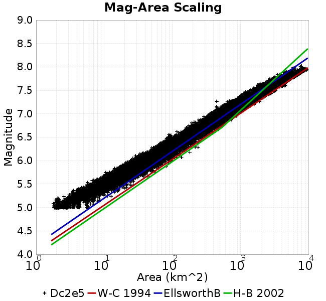 | 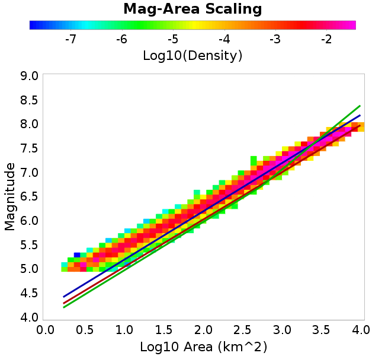 |
### Slip-Area Plots
*[(top)](#dc2e5)*

| Scatter | 2-D Hist |
|-----|-----|
| 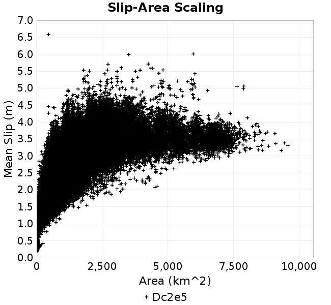 |  |
### Rupture Velocity Plots
*[(top)](#dc2e5)*

| **Scatter** |  |
|-----|-----|
| **Distance/Velocity** |  |
### Global Interevent-Time Distributions
*[(top)](#dc2e5)*

| **M≥6** | **M≥6.5** | **M≥7** | **M≥7.5** |
|-----|-----|-----|-----|
| 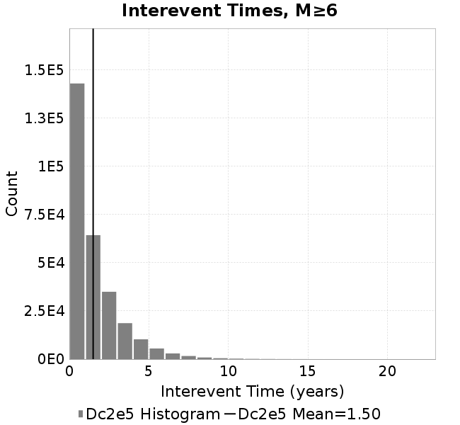 |  |  | 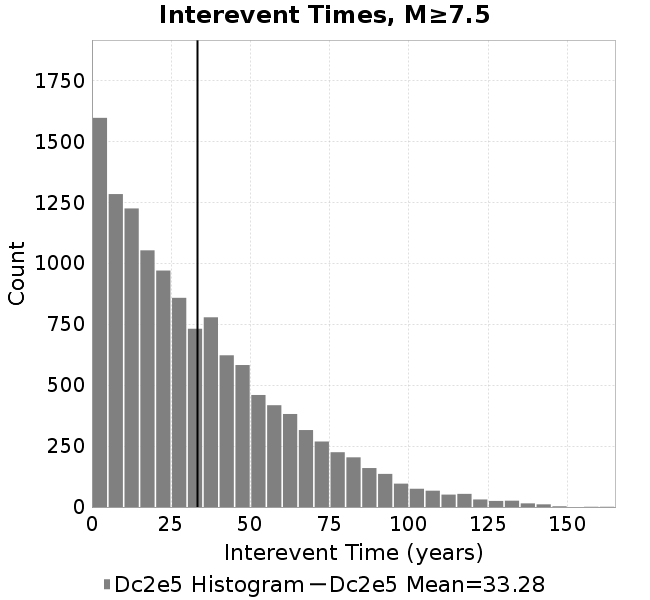 |
### Normalized Fault Interevent-Time Distributions
*[(top)](#dc2e5)*

|  | **M≥6** | **M≥6.5** | **M≥7** | **M≥7.5** |
|-----|-----|-----|-----|-----|
| **Elements** |  | 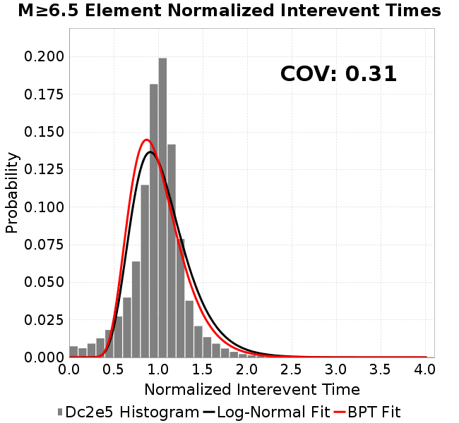 |  |  |
| **Subsections** |  | 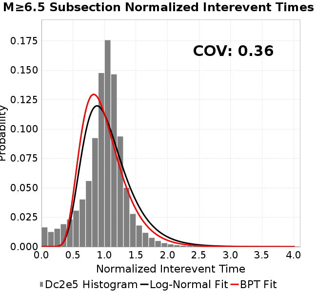 | 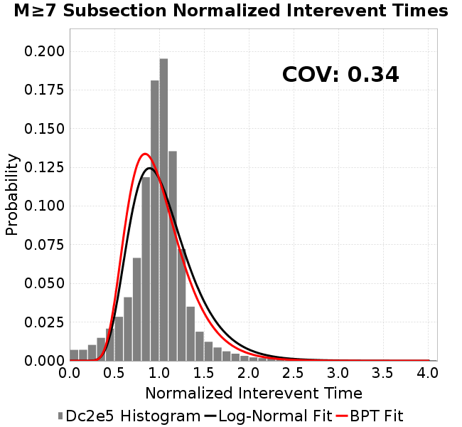 |  |
| **Sections** | 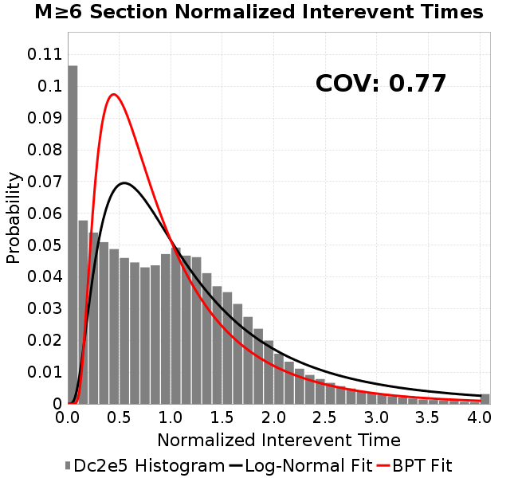 |  |  |  |
### Stationarity Plot
*[(top)](#dc2e5)*

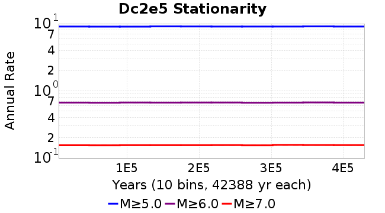
### Element/Subsection Interevent Time Comparisons

#### Element Interevent Time Comparisons
*[(top)](#dc2e5)*

| Min Mag | Scatter | 2-D Hist |
|-----|-----|-----|
| **M≥6.0** |  |  |
| **M≥6.5** | 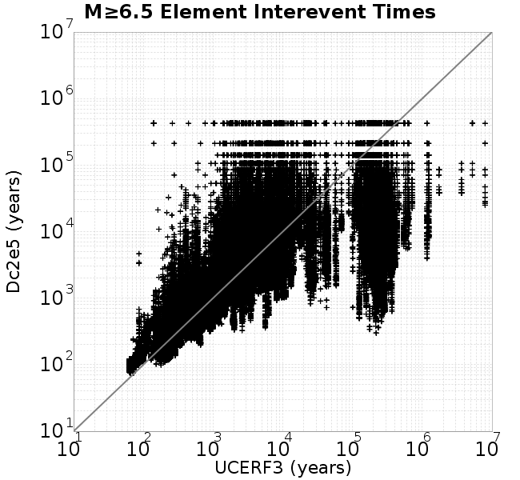 |  |
| **M≥7.0** | 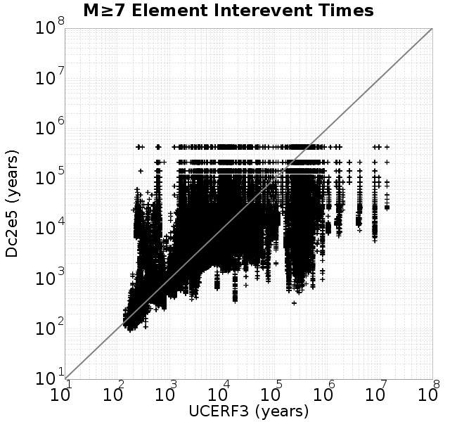 |  |
| **M≥7.5** |  | 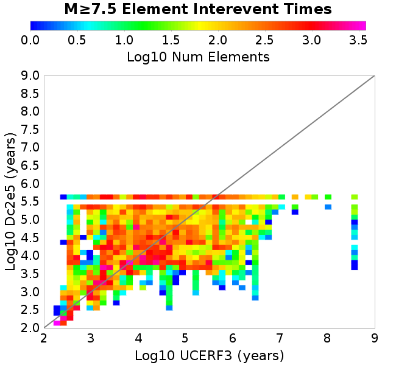 |

#### Subsection Interevent Time Comparisons
*[(top)](#dc2e5)*

*Subsections participate in a rupture if at least 20.0 % of its area ruptures*

| Min Mag | Scatter | 2-D Hist |
|-----|-----|-----|
| **M≥6.0** | 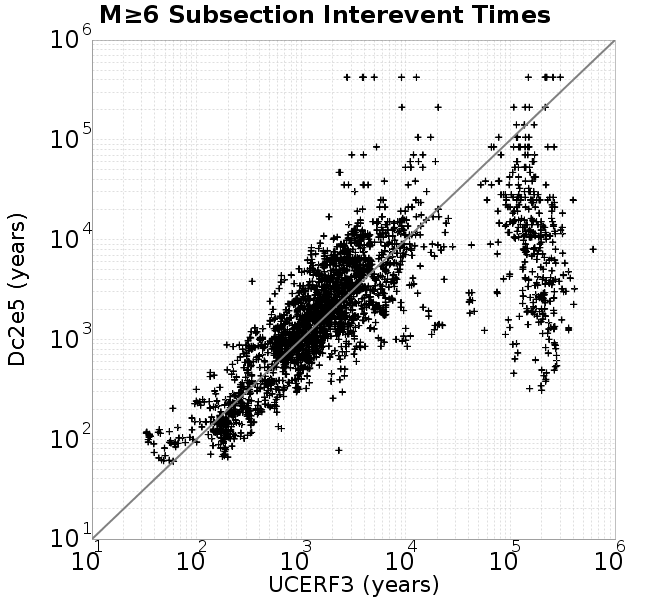 | 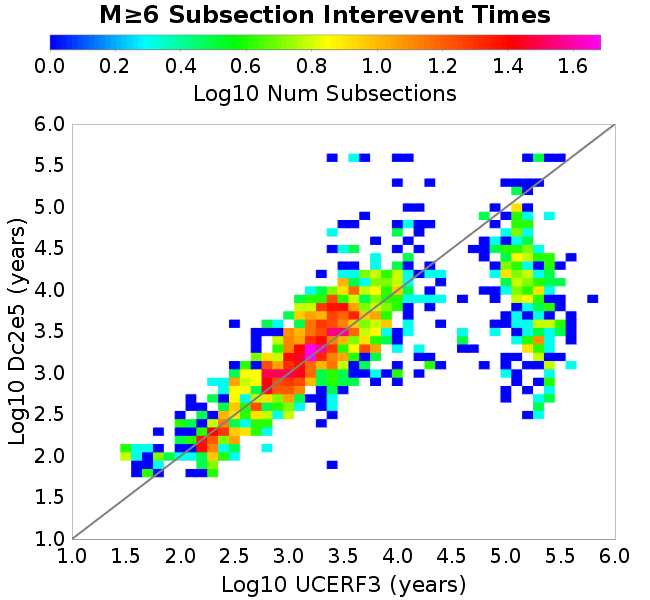 |
| **M≥6.5** | 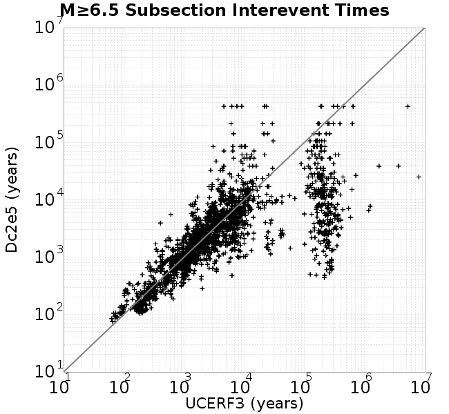 |  |
| **M≥7.0** | 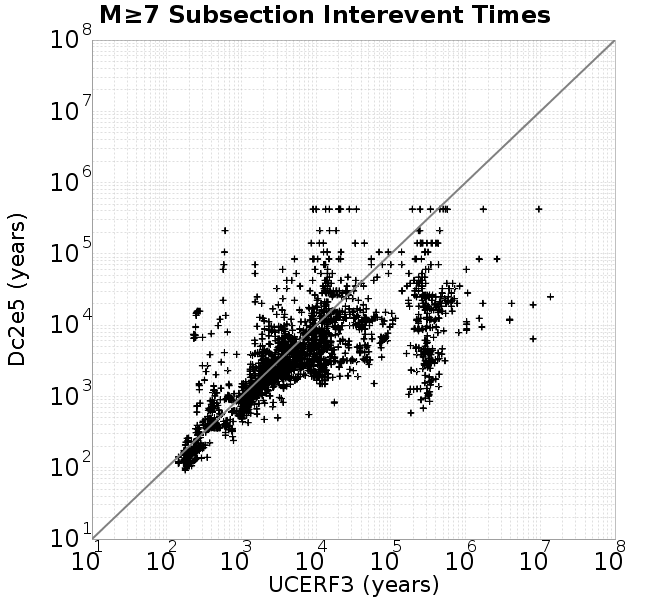 |  |
| **M≥7.5** |  |  |

### Paleo Open Interval Plots
*[(top)](#dc2e5)*

#### Paleo Open Interval Plots, Biasi and Sharer 2019
*[(top)](#dc2e5)*

These plots use the 5 paleoseismic sites identified in Biasi & Scharer (2019) on the Hayward, N. SAF, S. SAF, and SJC faults. By default, a rupture is counted at a paleo site if the nearest element (at the surface) slips any amount. We also alternatively apply a probability of detection model. Those results are marked as 'Prob. Filtered'.

**Paleoseismic sites table:**

| **Site Name** | Data MRI (yr) | Data Annual Rate | Catalog MRI (yr) | Catalog Annual Rate | Catalog Occurences | Prob Filtered Catalog MRI (yr) | Prob Filtered Catalog Annual Rate | Prob Filtered Catalog Occurences |
|-----|-----|-----|-----|-----|-----|-----|-----|-----|
| **HOG** | 191.00 | 0.005235602 | 361.21 | 0.0027685058 | 1174 | 365.20 | 0.0027382032 | 1161.14 |
| **FRA** | 119.00 | 0.008403362 | 116.86 | 0.008557481 | 3628 | 122.31 | 0.008175925 | 3466.26 |
| **COA** | 181.00 | 0.005524862 | 175.57 | 0.005695597 | 2414 | 187.42 | 0.005335744 | 2261.52 |
| **SCZ** | 106.00 | 0.009433962 | 118.79 | 0.008417982 | 3568 | 138.01 | 0.0072457143 | 3071.04 |
| **TYS** | 329.00 | 0.0030395137 | 341.91 | 0.0029247284 | 1238 | 377.99 | 0.0026455938 | 1119.87 |
| **TOTAL** | 31.61 | 0.0316373 | 35.26 | 0.028357897 | 12021 | 38.23 | 0.02615869 | 11088.72 |

**Paleoseismic Plots:**

| 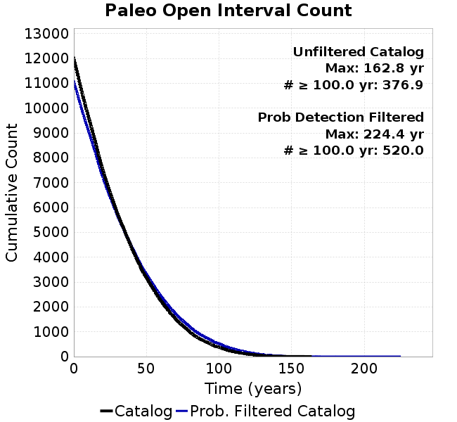 |  |
|-----|-----|

**Open interval probabilities table:**

| **Open Interval (yr)** | Catalog Probability | Catalog Poisson Probability | Prob. Filtered Catalog Probability | Prob. Filtered Catalog Poisson Probability | Data Poisson Probability |
|-----|-----|-----|-----|-----|-----|
| **10.00** | 0.9734504 | 0.75308365 | 0.9774576 | 0.769829 | 0.72878754 |
| **20.00** | 0.8969379 | 0.567135 | 0.9106479 | 0.59263664 | 0.53113127 |
| **30.00** | 0.7947592 | 0.4271001 | 0.82015055 | 0.45622885 | 0.3870819 |
| **40.00** | 0.67756706 | 0.3216421 | 0.71456033 | 0.3512182 | 0.28210047 |
| **50.00** | 0.55398214 | 0.2422234 | 0.60000914 | 0.27037793 | 0.2055913 |
| **60.00** | 0.43367338 | 0.18241449 | 0.48649877 | 0.20814478 | 0.14983238 |
| **70.00** | 0.3243893 | 0.13737336 | 0.37923497 | 0.16023588 | 0.10919597 |
| **80.00** | 0.22850855 | 0.103453636 | 0.2822293 | 0.12335423 | 0.079580665 |
| **90.00** | 0.15652838 | 0.07790924 | 0.20552398 | 0.09496166 | 0.057997398 |
| **100.00** | 0.10135372 | 0.058672175 | 0.14274983 | 0.07310423 | 0.04226778 |
| **110.00** | 0.057341844 | 0.044185057 | 0.09016678 | 0.05627776 | 0.030804234 |
| **120.00** | 0.031295184 | 0.033275045 | 0.054187484 | 0.04332425 | 0.022449743 |
| **130.00** | 0.012755237 | 0.025058892 | 0.026840484 | 0.033352263 | 0.016361093 |
| **140.00** | 0.0043870304 | 0.018871441 | 0.010982471 | 0.025675537 | 0.011923761 |
| **150.00** | 0.0010440275 | 0.014211774 | 0.003680009 | 0.019765774 | 0.008689889 |
| **160.00** | 4.8601287E-4 | 0.010702655 | 0.0017670197 | 0.015216265 | 0.0063330824 |
| **170.00** | 0.0 | 0.008059994 | 6.3477433E-4 | 0.011713921 | 0.0046154717 |
| **180.00** | 0.0 | 0.0060698497 | 3.2010235E-4 | 0.009017716 | 0.0033636983 |
| **190.00** | 0.0 | 0.004571105 | 1.5617925E-4 | 0.0069420994 | 0.0024514215 |
| **200.00** | 0.0 | 0.0034424243 | 8.029933E-5 | 0.0053442293 | 0.0017865654 |
| **210.00** | 0.0 | 0.0025924335 | 1.4626372E-5 | 0.0041141426 | 0.0013020267 |
| **220.00** | 0.0 | 0.0019523192 | 7.732373E-6 | 0.0031671862 | 9.489008E-4 |
| **230.00** | 0.0 | 0.0014702597 | 0.0 | 0.0024381916 | 6.915471E-4 |

#### Paleo Open Interval Plots, UCERF3
*[(top)](#dc2e5)*

These plots use the full set of UCERF3 paleoseismic sites. By default, a rupture is counted at a paleo site if the nearest element (at the surface) slips any amount. We also alternativeslyapply a probability of detection model. Those results are marked as 'Prob. Filtered'.

**Paleoseismic sites table:**

| **Site Name** | Data MRI (yr) | Data Annual Rate | Catalog MRI (yr) | Catalog Annual Rate | Catalog Occurences | Prob Filtered Catalog MRI (yr) | Prob Filtered Catalog Annual Rate | Prob Filtered Catalog Occurences |
|-----|-----|-----|-----|-----|-----|-----|-----|-----|
| **SSanAndreasBurroFlats** | 205.44 | 0.0048677 | 204.41 | 0.0048920163 | 2073 | 233.25 | 0.004287334 | 1816.7 |
| **SSanAndreasIndio** | 277.37 | 0.0036053 | 172.15 | 0.005808895 | 2462 | 182.59 | 0.0054768045 | 2321.28 |
| **SSAFMCreek1000Palms** | 261.33 | 0.0038266 | 1576.12 | 6.344678E-4 | 268 | 2285.79 | 4.3748642E-4 | 184.45 |
| **NSanAndreasFortRoss** | 306.28 | 0.003265 | 187.17 | 0.005342731 | 2265 | 189.74 | 0.00527041 | 2234.33 |
| **NSanAndreasNorthCoast** | 263.87 | 0.0037898 | 178.08 | 0.005615581 | 2381 | 182.67 | 0.0054744235 | 2321.15 |
| **CalaverasfaultNorth** | 618.05 | 0.001618 | 164.91 | 0.0060639265 | 2570 | 237.23 | 0.0042153215 | 1786.22 |
| **ElsinoreTemecula** | 1019.16 | 9.812E-4 | 677.36 | 0.0014763282 | 626 | 705.76 | 0.0014169149 | 600.78 |
| **ElsinoreWhittier** | 3196.93 | 3.128E-4 | 1531.20 | 6.5308326E-4 | 277 | 1615.27 | 6.190898E-4 | 262.57 |
| **SSAFCarrizoBidart** | 114.71 | 0.0087179 | 118.56 | 0.00843489 | 3576 | 122.25 | 0.008179749 | 3467.82 |
| **SanJacintoHogLake** | 311.78 | 0.0032074 | 361.21 | 0.0027685058 | 1174 | 365.37 | 0.0027369515 | 1160.61 |
| **PuenteHills** | 3506.31 | 2.852E-4 | 5257.43 | 1.9020686E-4 | 81 | 5695.92 | 1.7556423E-4 | 74.74 |
| **SanGregorioNorth** | 1019.06 | 9.813E-4 | 391.52 | 0.0025541538 | 1082 | 404.99 | 0.0024691892 | 1046 |
| **SanJacintoSuperstition** | 508.26 | 0.0019675 | 1200.31 | 8.3311985E-4 | 352 | 1293.90 | 7.7285996E-4 | 326.56 |
| **SSanAndreasWrightwood** | 106.04 | 0.0094304 | 150.30 | 0.006653459 | 2821 | 152.06 | 0.006576344 | 2788.29 |
| **SSanAndreasPitmanCanyon** | 173.48 | 0.0057643 | 139.02 | 0.007193415 | 3050 | 155.84 | 0.006416686 | 2720.55 |
| **SSanAndreasPlungeCreek** | 205.36 | 0.0048695 | 354.43 | 0.0028214091 | 1196 | 438.73 | 0.002279312 | 966.31 |
| **FrazierMountianSSAF** | 148.57 | 0.0067307 | 116.86 | 0.008557481 | 3628 | 122.20 | 0.008183235 | 3469.38 |
| **NSanAndreasSantaCruzSeg** | 109.84 | 0.0091041 | 118.79 | 0.008417982 | 3568 | 138.04 | 0.007244398 | 3070.46 |
| **RodgersCreek** | 325.31 | 0.003074 | 168.18 | 0.005946032 | 2521 | 230.15 | 0.0043449234 | 1842.18 |
| **GreenValleyMasonRoad** | 293.31 | 0.0034094 | 1734.44 | 5.765562E-4 | 243 | 2359.24 | 4.2386565E-4 | 178.56 |
| **HaywardfaultNorth** | 318.34 | 0.0031413 | 363.99 | 0.0027473131 | 1165 | 374.36 | 0.002671237 | 1132.73 |
| **HaywardfaultSouth** | 167.57 | 0.0059677 | 341.91 | 0.0029247284 | 1238 | 377.74 | 0.0026473426 | 1120.57 |
| **Compton** | 2658.16 | 3.762E-4 | 5923.87 | 1.6880859E-4 | 72 | 6545.72 | 1.5277162E-4 | 64.95 |
| **SSanAndreasCoachella** | 178.45 | 0.0056037 | 175.57 | 0.005695597 | 2414 | 187.43 | 0.0053353747 | 2261.35 |
| **ElsinoreGlenIvy** | 179.12 | 0.0055828 | 561.47 | 0.0017810424 | 755 | 609.55 | 0.0016405499 | 695.49 |
| **GarlockCentralallevents** | 1434.93 | 6.969E-4 | 630.63 | 0.0015857262 | 672 | 640.55 | 0.0015611491 | 661.56 |
| **NSanAndreasAlderCreek** | 869.64 | 0.0011499 | 186.59 | 0.00535925 | 2272 | 189.47 | 0.0052779606 | 2237.54 |
| **SSanAndreasPallettCreek** | 149.30 | 0.006698 | 150.24 | 0.0066558183 | 2822 | 151.97 | 0.006580453 | 2790.04 |
| **GarlockWesternallevents** | 1230.16 | 8.129E-4 | 819.82 | 0.0012197803 | 517 | 840.44 | 0.0011898525 | 504.26 |
| **ElsinoreFaultJulian** | 3250.98 | 3.076E-4 | 1232.87 | 8.1111345E-4 | 344 | 1259.95 | 7.936837E-4 | 336.61 |
| **TOTAL** | 9.08 | 0.1101451 | 14.20 | 0.070400745 | 29842 | 15.77 | 0.063402526 | 26875.58 |

**Paleoseismic Plots:**

| 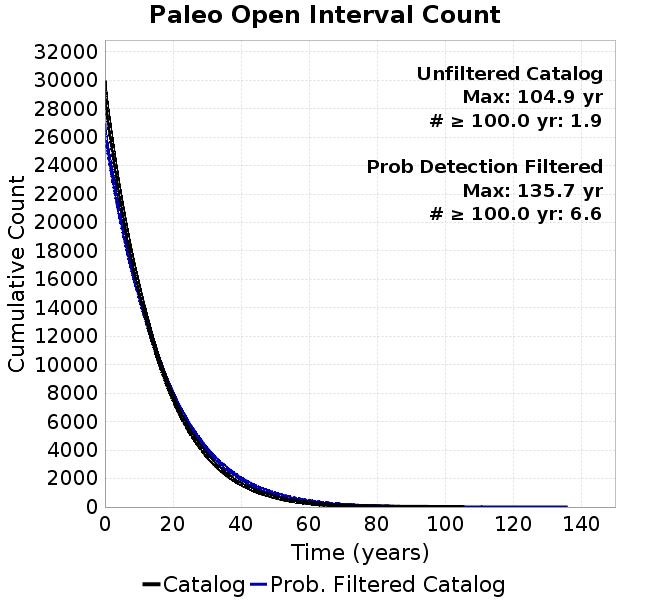 |  |
|-----|-----|

**Open interval probabilities table:**

| **Open Interval (yr)** | Catalog Probability | Catalog Poisson Probability | Prob. Filtered Catalog Probability | Prob. Filtered Catalog Poisson Probability | Data Poisson Probability |
|-----|-----|-----|-----|-----|-----|
| **10.00** | 0.855822 | 0.49459925 | 0.87827104 | 0.5304523 | 0.33238843 |
| **20.00** | 0.5909627 | 0.24462841 | 0.64005995 | 0.28137964 | 0.110482074 |
| **30.00** | 0.35798192 | 0.120993026 | 0.41563937 | 0.14925848 | 0.036722966 |
| **40.00** | 0.19765341 | 0.05984306 | 0.24859673 | 0.0791745 | 0.012206289 |
| **50.00** | 0.10047621 | 0.029598333 | 0.1376574 | 0.0419983 | 0.004057229 |
| **60.00** | 0.047451906 | 0.014639312 | 0.071351655 | 0.022278095 | 0.001348576 |
| **70.00** | 0.017335335 | 0.007240593 | 0.030895872 | 0.0118174665 | 4.4825108E-4 |
| **80.00** | 0.007732492 | 0.0035811919 | 0.013636938 | 0.0062686023 | 1.4899348E-4 |
| **90.00** | 0.0020320057 | 0.0017712548 | 0.005042735 | 0.0033251946 | 4.952371E-5 |
| **100.00** | 4.4771825E-4 | 8.7606127E-4 | 0.0016442379 | 0.0017638571 | 1.6461108E-5 |
| **110.00** | 0.0 | 4.3329922E-4 | 2.6066558E-4 | 9.356421E-4 | 5.4714824E-6 |
| **120.00** | 0.0 | 2.1430948E-4 | 1.0616375E-4 | 4.963135E-4 | 1.8186574E-6 |
| **130.00** | 0.0 | 1.0599731E-4 | 4.9924143E-5 | 2.6327063E-4 | 6.045007E-7 |
| **140.00** | 0.0 | 5.2426185E-5 | 0.0 | 1.3965252E-4 | 2.0092905E-7 |

### Moment Release Variability Plots
*[(top)](#dc2e5)*

We first create a tapered moment release time series for the entire catalog. Each event's moment is distributed across a 25 year Hanning (cosine) taper. Here is a plot of a random 2,000 year section of this time series:

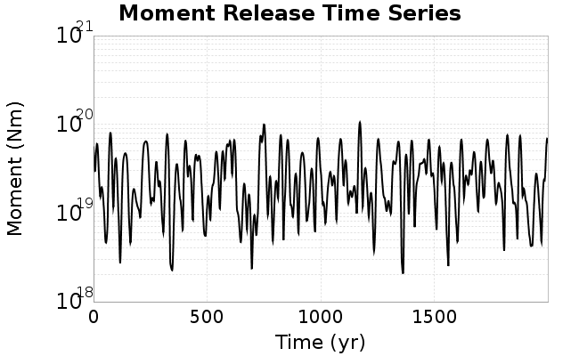

We then compute Welch's power spectral density estimate on the entire time series. Results are plotted below, with a Poisson randomization of the catalog also plotted in gray as a control. Significant deviations above the Poisson model indicate synchronization at that period.


## Input File
*[(top)](#dc2e5)*

```
  A_1 = 0.001
  fA = .1
  B_1 = 0.008
  muSlipAmp_1 = .0
  muSlipInvDist_1 = 1.0
  cohesion = 0.0
  Dc_1 = 2.0000000000000000818e-05
  mu0_1 = 0.6
  ddotStar_1 = 9.9999999999999995475e-07
  ddotAB_1 = 9.9999999999999995475e-07
  alpha_1 = 0.0
  theta0_1 = 200000000
  tau0_1 = 55.1
  sigma0_1 = 100
  sigmaFracPin = .5
  lowSigmaAction = 1
  maxThetaPin = 1.0e13
  ddotEQ_1 = 1
  ddotEQFname = 
  stressOvershootFactor = 0.10000000000000000555
  lameLambda = 30000
  lameMu = 30000
  slowSlip_1 = 0
  nEq = 100000000000
  KZeroFrac = 0
  muPin = 1.0
  tStart = 0
  maxT = 3.16e13
  maxWallTime = 169200
  maxTrans = 1.0000000000000000159e100
  faultFname = UCERF3FM.15km.1km.tri.flt
  outFnameInfix = Dc2e5
  writeTau = 2
  writeSigma = 2
  writeSlip = 0
  writeSlipSpeed = 0
  writeState = 0
  writeTheta = 2
  writePED = 1
  writeTransitions = 1
  minDtWrite = 0
  minDtWriteCoseismic = 0
  minDtWriteInterseismic = 0
  minMagWrite = 7.7
  writeStiffness = 0
  stressRateSpecification = 1
  dMu3 = 0.01000000000000000
  initTauFname = 
  initSigmaFname = 
  initThetaFname = 
  initSlipSpeedFname = 
  AFname = 
  BFname =  
  DcFname = 
  mu0Fname = 
  ddotStarFname = 
  ddotABFname = 
  alphaFname = 
  KTauFname = /u/sciteam/gilchris/scratch/stiffness_25a589d/Ktau.25a589d.out
  KSigmaFname = /u/sciteam/gilchris/scratch/stiffness_25a589d/Ksigma.25a589d.out
  tFailFname = 
  tauFailFname = 
  tauDotFname = 
  sigmaDotFname =
  KZeroFname = UCERF3FM.15km.1km.tri.KZero
  pinnedFname =  UCERF3FM.15km.1km.tri.pin
  neighborFname = UCERF3FM.15km.1km.tri.neighbors
  stressRateFname =  
  slowSlipFname = 
  writePatchFname = 
  DEBUG = 0
  ZBrentUpperBracket = 0
  receiverElementAreaFrac = 0.8
  receiverElementIntTol = 1.0e-4
  receiverElementSubdivisionMax = 4
  tgfDist1 = 3
  tgfDist1 = 10
  lowSigmaAction = 1
  highSigmaAction = 0
```
