# Dc5e5
## Metadata
| **Catalog** | Dc5e5 |
|-----|-----|
| **Author** | Jaqcui Gilchrist, 2018/09/27 |
| **Description** | change Dc: Dc=5.00E-05 |
| **Fault/Def Model** | Fault Model 3.1, Geologic |
| **Slip Velocity** | 1.0 m/s |
| **Average Element Area** | 1.35 km^2 |
| **Length** | 7,686,303 events in 381,346 years |
| **Frictional Params** | a=0.001, b=0.008, (b-a)=0.007, ddotEQ=1 |

* [Metadata](#metadata)
* [Plots](#plots)
  * [Magnitude-Frequency Plot](#magnitude-frequency-plot)
  * [Magnitude-Area Plots](#magnitude-area-plots)
  * [Slip-Area Plots](#slip-area-plots)
  * [Rupture Velocity Plots](#rupture-velocity-plots)
  * [Global Interevent-Time Distributions](#global-interevent-time-distributions)
  * [Normalized Fault Interevent-Time Distributions](#normalized-fault-interevent-time-distributions)
  * [Stationarity Plot](#stationarity-plot)
  * [Element/Subsection Interevent Time Comparisons](#elementsubsection-interevent-time-comparisons)
    * [Element Interevent Time Comparisons](#element-interevent-time-comparisons)
    * [Subsection Interevent Time Comparisons](#subsection-interevent-time-comparisons)
  * [Paleo Open Interval Plots](#paleo-open-interval-plots)
    * [Paleo Open Interval Plots, Biasi and Sharer 2019](#paleo-open-interval-plots-biasi-and-sharer-2019)
    * [Paleo Open Interval Plots, UCERF3](#paleo-open-interval-plots-ucerf3)
  * [Moment Release Variability Plots](#moment-release-variability-plots)
* [Input File](#input-file)

## Plots
### Magnitude-Frequency Plot
*[(top)](#dc5e5)*


### Magnitude-Area Plots
*[(top)](#dc5e5)*

| Scatter | 2-D Hist |
|-----|-----|
| 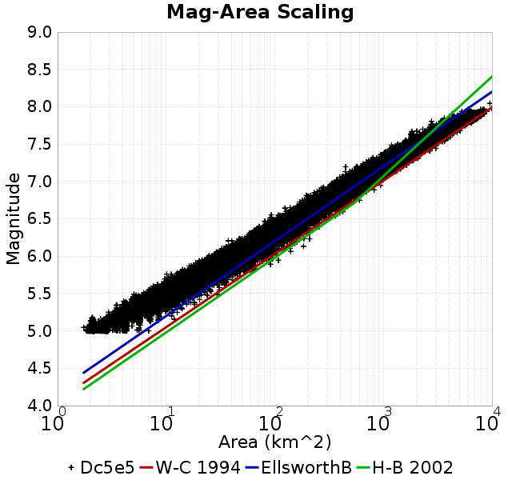 |  |
### Slip-Area Plots
*[(top)](#dc5e5)*

| Scatter | 2-D Hist |
|-----|-----|
| 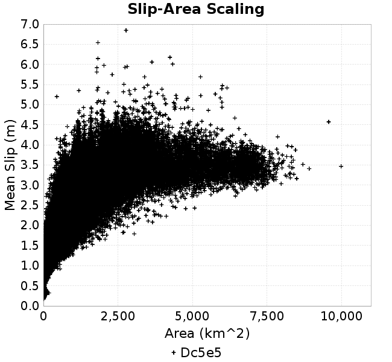 | 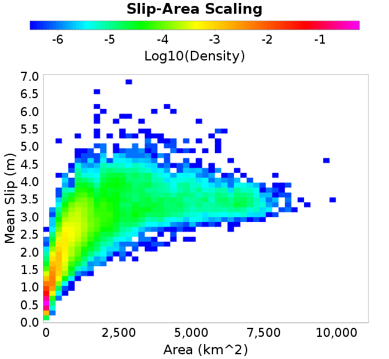 |
### Rupture Velocity Plots
*[(top)](#dc5e5)*

| **Scatter** |  |
|-----|-----|
| **Distance/Velocity** |  |
### Global Interevent-Time Distributions
*[(top)](#dc5e5)*

| **M≥6** | **M≥6.5** | **M≥7** | **M≥7.5** |
|-----|-----|-----|-----|
|  | 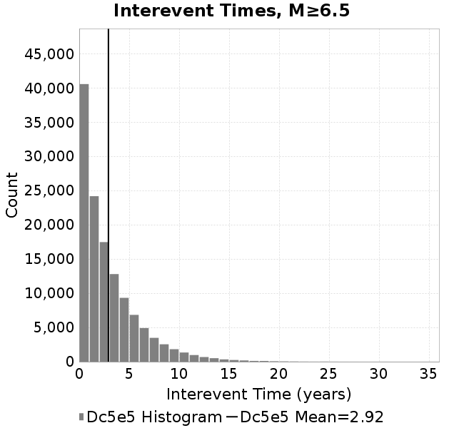 |  |  |
### Normalized Fault Interevent-Time Distributions
*[(top)](#dc5e5)*

|  | **M≥6** | **M≥6.5** | **M≥7** | **M≥7.5** |
|-----|-----|-----|-----|-----|
| **Elements** |  |  |  |  |
| **Subsections** |  | 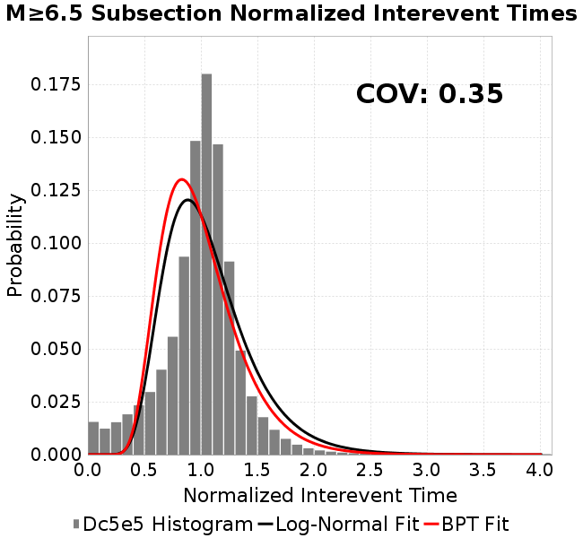 |  |  |
| **Sections** | 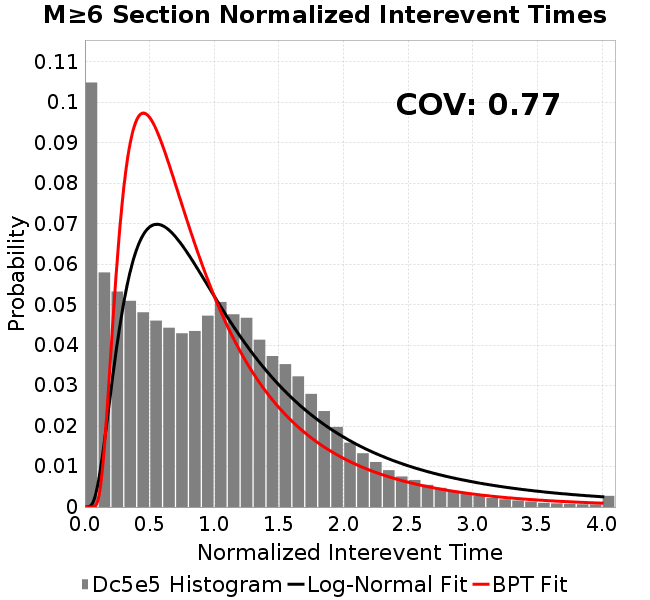 |  | 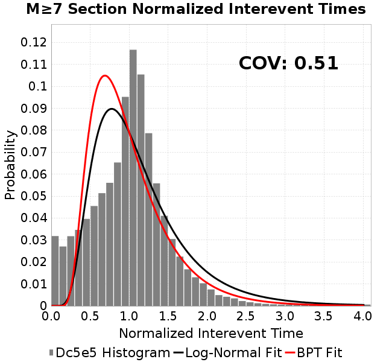 | 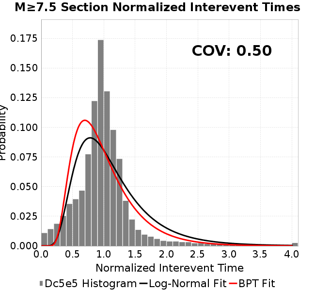 |
### Stationarity Plot
*[(top)](#dc5e5)*

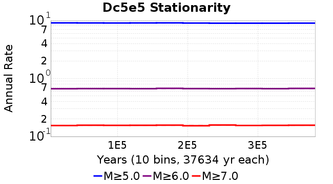
### Element/Subsection Interevent Time Comparisons

#### Element Interevent Time Comparisons
*[(top)](#dc5e5)*

| Min Mag | Scatter | 2-D Hist |
|-----|-----|-----|
| **M≥6.0** | 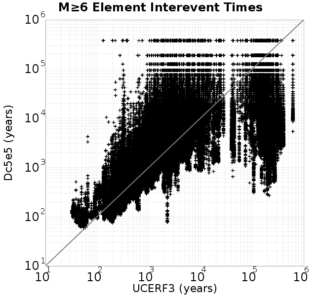 | 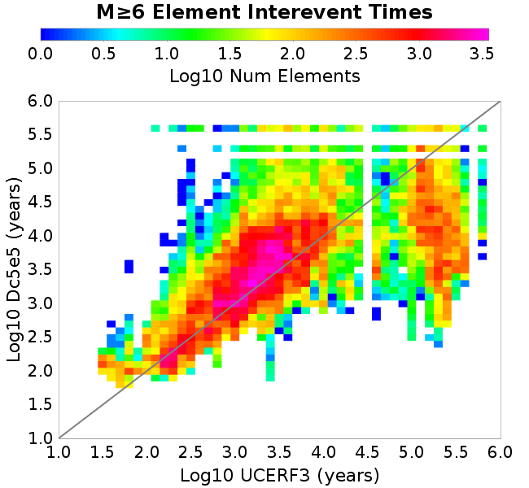 |
| **M≥6.5** | 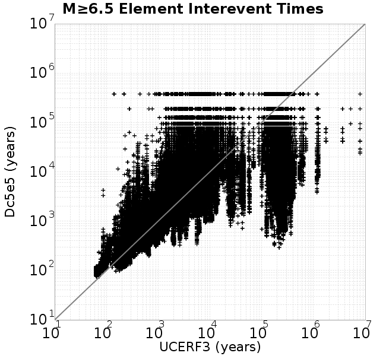 |  |
| **M≥7.0** | 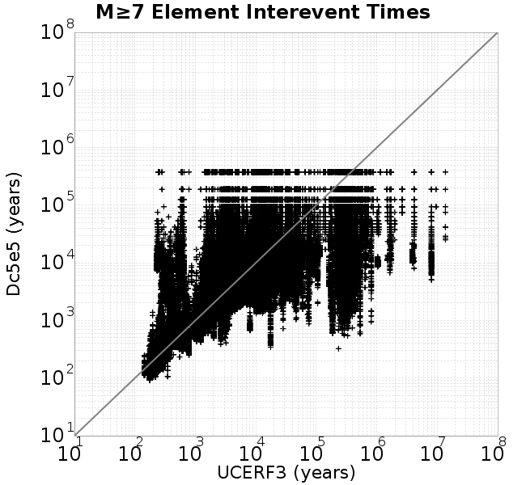 |  |
| **M≥7.5** |  |  |

#### Subsection Interevent Time Comparisons
*[(top)](#dc5e5)*

*Subsections participate in a rupture if at least 20.0 % of its area ruptures*

| Min Mag | Scatter | 2-D Hist |
|-----|-----|-----|
| **M≥6.0** | 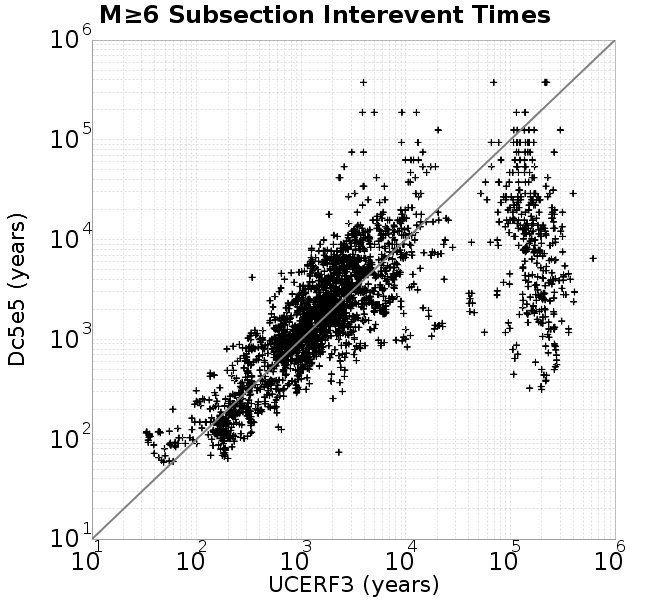 | 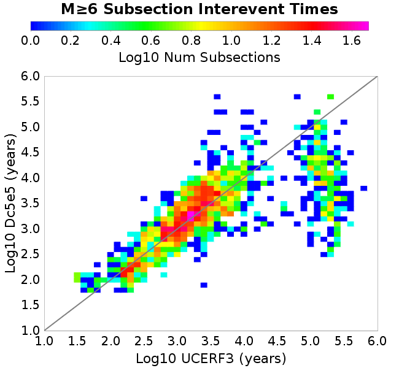 |
| **M≥6.5** | 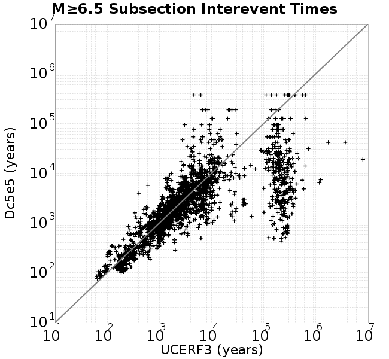 | 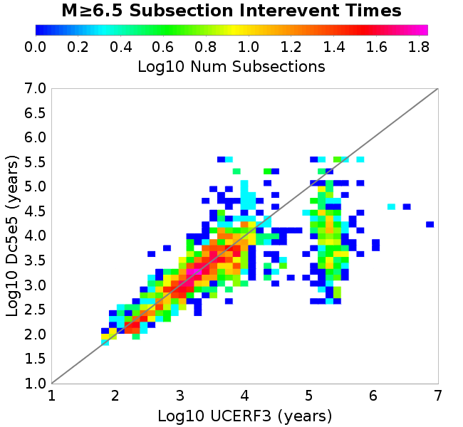 |
| **M≥7.0** | 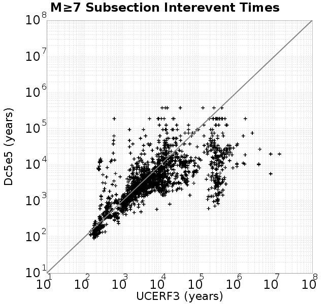 |  |
| **M≥7.5** | 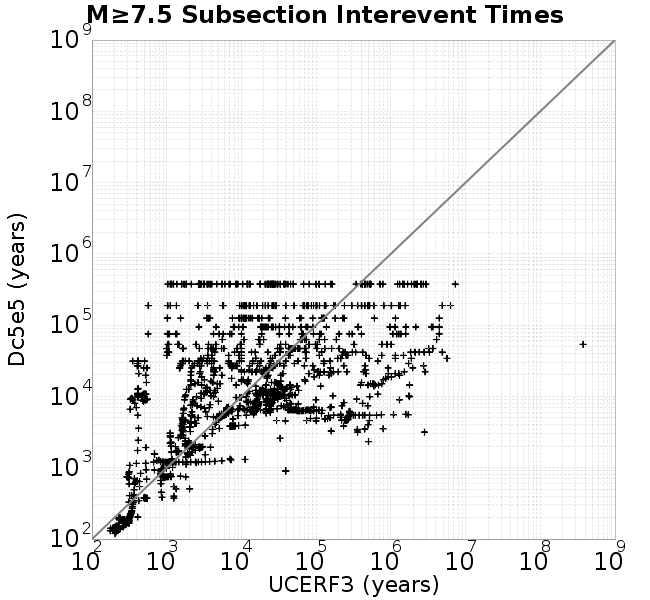 | 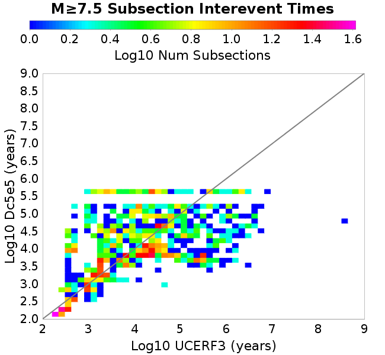 |

### Paleo Open Interval Plots
*[(top)](#dc5e5)*

#### Paleo Open Interval Plots, Biasi and Sharer 2019
*[(top)](#dc5e5)*

These plots use the 5 paleoseismic sites identified in Biasi & Scharer (2019) on the Hayward, N. SAF, S. SAF, and SJC faults. By default, a rupture is counted at a paleo site if the nearest element (at the surface) slips any amount. We also alternatively apply a probability of detection model. Those results are marked as 'Prob. Filtered'.

**Paleoseismic sites table:**

| **Site Name** | Data MRI (yr) | Data Annual Rate | Catalog MRI (yr) | Catalog Annual Rate | Catalog Occurences | Prob Filtered Catalog MRI (yr) | Prob Filtered Catalog Annual Rate | Prob Filtered Catalog Occurences |
|-----|-----|-----|-----|-----|-----|-----|-----|-----|
| **HOG** | 191.00 | 0.005235602 | 353.15 | 0.0028316425 | 1066 | 357.28 | 0.002798963 | 1053.7 |
| **FRA** | 119.00 | 0.008403362 | 114.79 | 0.0087115355 | 3279 | 120.53 | 0.00829669 | 3122.71 |
| **COA** | 181.00 | 0.005524862 | 173.56 | 0.0057617924 | 2169 | 186.30 | 0.0053676977 | 2020.58 |
| **SCZ** | 106.00 | 0.009433962 | 117.71 | 0.008495631 | 3197 | 136.84 | 0.0073075513 | 2749.89 |
| **TYS** | 329.00 | 0.0030395137 | 336.96 | 0.0029677462 | 1115 | 373.80 | 0.0026752036 | 1005.12 |
| **TOTAL** | 31.61 | 0.0316373 | 34.76 | 0.02876794 | 10826 | 37.82 | 0.026441216 | 9950.48 |

**Paleoseismic Plots:**

|  |  |
|-----|-----|

**Open interval probabilities table:**

| **Open Interval (yr)** | Catalog Probability | Catalog Poisson Probability | Prob. Filtered Catalog Probability | Prob. Filtered Catalog Poisson Probability | Data Poisson Probability |
|-----|-----|-----|-----|-----|-----|
| **10.00** | 0.97232074 | 0.750002 | 0.9764206 | 0.7676571 | 0.72878754 |
| **20.00** | 0.89652765 | 0.562503 | 0.9103953 | 0.5892974 | 0.53113127 |
| **30.00** | 0.78872526 | 0.42187837 | 0.81555915 | 0.4523783 | 0.3870819 |
| **40.00** | 0.66922224 | 0.31640962 | 0.7080809 | 0.3472714 | 0.28210047 |
| **50.00** | 0.5487209 | 0.23730786 | 0.59718347 | 0.26658535 | 0.2055913 |
| **60.00** | 0.42740452 | 0.17798136 | 0.48319647 | 0.20464614 | 0.14983238 |
| **70.00** | 0.3191232 | 0.13348638 | 0.3773666 | 0.15709805 | 0.10919597 |
| **80.00** | 0.22225146 | 0.10011505 | 0.27897748 | 0.12059744 | 0.079580665 |
| **90.00** | 0.15080538 | 0.07508649 | 0.20212615 | 0.09257747 | 0.057997398 |
| **100.00** | 0.098741315 | 0.05631502 | 0.14005566 | 0.07106775 | 0.04226778 |
| **110.00** | 0.056614187 | 0.042236377 | 0.089295514 | 0.054555662 | 0.030804234 |
| **120.00** | 0.028113075 | 0.031677365 | 0.050874077 | 0.04188004 | 0.022449743 |
| **130.00** | 0.011384186 | 0.02375809 | 0.02482981 | 0.03214951 | 0.016361093 |
| **140.00** | 0.002624414 | 0.017818615 | 0.0084073795 | 0.024679799 | 0.011923761 |
| **150.00** | 0.0 | 0.0133639965 | 0.002947286 | 0.018945623 | 0.008689889 |
| **160.00** | 0.0 | 0.010023024 | 0.0016558856 | 0.014543741 | 0.0063330824 |
| **170.00** | 0.0 | 0.007517288 | 8.626651E-4 | 0.011164606 | 0.0046154717 |
| **180.00** | 0.0 | 0.005637981 | 3.9991824E-4 | 0.008570588 | 0.0033636983 |
| **190.00** | 0.0 | 0.004228497 | 1.7992455E-4 | 0.006579273 | 0.0024514215 |
| **200.00** | 0.0 | 0.0031713813 | 4.6453697E-5 | 0.0050506257 | 0.0017865654 |
| **210.00** | 0.0 | 0.0023785422 | 0.0 | 0.0038771485 | 0.0013020267 |

#### Paleo Open Interval Plots, UCERF3
*[(top)](#dc5e5)*

These plots use the full set of UCERF3 paleoseismic sites. By default, a rupture is counted at a paleo site if the nearest element (at the surface) slips any amount. We also alternativeslyapply a probability of detection model. Those results are marked as 'Prob. Filtered'.

**Paleoseismic sites table:**

| **Site Name** | Data MRI (yr) | Data Annual Rate | Catalog MRI (yr) | Catalog Annual Rate | Catalog Occurences | Prob Filtered Catalog MRI (yr) | Prob Filtered Catalog Annual Rate | Prob Filtered Catalog Occurences |
|-----|-----|-----|-----|-----|-----|-----|-----|-----|
| **SSanAndreasBurroFlats** | 205.44 | 0.0048677 | 207.62 | 0.004816428 | 1813 | 235.52 | 0.0042459695 | 1598.14 |
| **SSanAndreasIndio** | 277.37 | 0.0036053 | 170.34 | 0.005870756 | 2210 | 181.63 | 0.0055057397 | 2072.53 |
| **SSAFMCreek1000Palms** | 261.33 | 0.0038266 | 1506.20 | 6.639216E-4 | 250 | 2230.20 | 4.4839093E-4 | 168.46 |
| **NSanAndreasFortRoss** | 306.28 | 0.003265 | 183.67 | 0.0054445686 | 2049 | 186.27 | 0.0053684567 | 2020.33 |
| **NSanAndreasNorthCoast** | 263.87 | 0.0037898 | 175.28 | 0.0057050996 | 2147 | 180.38 | 0.0055437884 | 2086.28 |
| **CalaverasfaultNorth** | 618.05 | 0.001618 | 159.25 | 0.006279384 | 2363 | 232.17 | 0.00430713 | 1620.56 |
| **ElsinoreTemecula** | 1019.16 | 9.812E-4 | 672.72 | 0.0014864934 | 560 | 697.32 | 0.0014340527 | 540.16 |
| **ElsinoreWhittier** | 3196.93 | 3.128E-4 | 1453.49 | 6.8800076E-4 | 259 | 1543.55 | 6.478567E-4 | 243.8 |
| **SSAFCarrizoBidart** | 114.71 | 0.0087179 | 117.93 | 0.008479293 | 3191 | 121.47 | 0.0082326 | 3098.17 |
| **SanJacintoHogLake** | 311.78 | 0.0032074 | 353.15 | 0.0028316425 | 1066 | 357.13 | 0.0028000777 | 1054.09 |
| **PuenteHills** | 3506.31 | 2.852E-4 | 4985.27 | 2.0059083E-4 | 76 | 5391.31 | 1.8548357E-4 | 70.27 |
| **SanGregorioNorth** | 1019.06 | 9.813E-4 | 393.83 | 0.0025391686 | 956 | 406.04 | 0.0024627883 | 927.24 |
| **SanJacintoSuperstition** | 508.26 | 0.0019675 | 1182.42 | 8.457198E-4 | 318 | 1271.87 | 7.862444E-4 | 295.65 |
| **SSanAndreasWrightwood** | 106.04 | 0.0094304 | 148.40 | 0.0067383656 | 2536 | 150.33 | 0.0066521685 | 2503.56 |
| **SSanAndreasPitmanCanyon** | 173.48 | 0.0057643 | 137.45 | 0.0072753085 | 2738 | 155.03 | 0.006450537 | 2427.63 |
| **SSanAndreasPlungeCreek** | 205.36 | 0.0048695 | 351.93 | 0.0028414435 | 1070 | 436.34 | 0.002291788 | 862.91 |
| **FrazierMountianSSAF** | 148.57 | 0.0067307 | 114.79 | 0.0087115355 | 3279 | 120.54 | 0.008296326 | 3122.42 |
| **NSanAndreasSantaCruzSeg** | 109.84 | 0.0091041 | 117.71 | 0.008495631 | 3197 | 136.91 | 0.0073040016 | 2748.6 |
| **RodgersCreek** | 325.31 | 0.003074 | 162.41 | 0.006157122 | 2317 | 224.45 | 0.0044552833 | 1676.37 |
| **GreenValleyMasonRoad** | 293.31 | 0.0034094 | 1678.64 | 5.9571856E-4 | 224 | 2283.52 | 4.3792027E-4 | 164.58 |
| **HaywardfaultNorth** | 318.34 | 0.0031413 | 357.98 | 0.0027934152 | 1051 | 369.52 | 0.0027061806 | 1018.12 |
| **HaywardfaultSouth** | 167.57 | 0.0059677 | 336.96 | 0.0029677462 | 1115 | 373.72 | 0.002675826 | 1005.35 |
| **Compton** | 2658.16 | 3.762E-4 | 5307.46 | 1.8841404E-4 | 71 | 6029.43 | 1.6585307E-4 | 62.55 |
| **SSanAndreasCoachella** | 178.45 | 0.0056037 | 173.56 | 0.0057617924 | 2169 | 186.05 | 0.005374843 | 2023.27 |
| **ElsinoreGlenIvy** | 179.12 | 0.0055828 | 562.82 | 0.0017767614 | 668 | 613.00 | 0.0016313199 | 613.34 |
| **GarlockCentralallevents** | 1434.93 | 6.969E-4 | 627.72 | 0.0015930672 | 599 | 637.42 | 0.0015688332 | 589.82 |
| **NSanAndreasAlderCreek** | 869.64 | 0.0011499 | 184.93 | 0.0054073497 | 2035 | 187.63 | 0.0053296685 | 2005.76 |
| **SSanAndreasPallettCreek** | 149.30 | 0.006698 | 148.52 | 0.0067330496 | 2534 | 150.26 | 0.0066551184 | 2504.66 |
| **GarlockWesternallevents** | 1230.16 | 8.129E-4 | 803.69 | 0.0012442563 | 468 | 826.20 | 0.0012103585 | 455.27 |
| **ElsinoreFaultJulian** | 3250.98 | 3.076E-4 | 1208.11 | 8.2773826E-4 | 311 | 1234.02 | 8.103615E-4 | 304.44 |
| **TOTAL** | 9.08 | 0.1101451 | 14.02 | 0.07132109 | 26842 | 15.63 | 0.06397189 | 24076.2 |

**Paleoseismic Plots:**

| 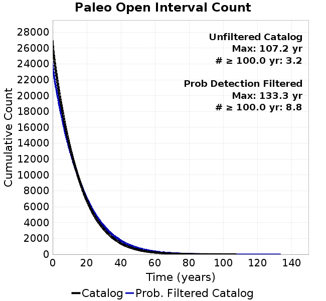 |  |
|-----|-----|

**Open interval probabilities table:**

| **Open Interval (yr)** | Catalog Probability | Catalog Poisson Probability | Prob. Filtered Catalog Probability | Prob. Filtered Catalog Poisson Probability | Data Poisson Probability |
|-----|-----|-----|-----|-----|-----|
| **10.00** | 0.85148704 | 0.4900681 | 0.8748085 | 0.52744067 | 0.33238843 |
| **20.00** | 0.58638406 | 0.24016675 | 0.63762206 | 0.27819365 | 0.110482074 |
| **30.00** | 0.3530621 | 0.117698066 | 0.41243482 | 0.14673065 | 0.036722966 |
| **40.00** | 0.18800081 | 0.057680067 | 0.24184127 | 0.07739171 | 0.012206289 |
| **50.00** | 0.09369448 | 0.028267162 | 0.13338336 | 0.040819533 | 0.004057229 |
| **60.00** | 0.04395756 | 0.013852835 | 0.06859326 | 0.021529883 | 0.001348576 |
| **70.00** | 0.019793747 | 0.0067888326 | 0.033787355 | 0.011355735 | 4.4825108E-4 |
| **80.00** | 0.008102145 | 0.0033269902 | 0.015279022 | 0.0059894766 | 1.4899348E-4 |
| **90.00** | 0.003473618 | 0.0016304519 | 0.0066463705 | 0.0031590937 | 4.952371E-5 |
| **100.00** | 8.842813E-4 | 7.9903245E-4 | 0.0024561856 | 0.0016662345 | 1.6461108E-5 |
| **110.00** | 0.0 | 3.915803E-4 | 3.5328692E-4 | 8.788398E-4 | 5.4714824E-6 |
| **120.00** | 0.0 | 1.9190102E-4 | 4.8281487E-5 | 4.6353586E-4 | 1.8186574E-6 |
| **130.00** | 0.0 | 9.4044575E-5 | 1.595399E-5 | 2.4448766E-4 | 6.045007E-7 |
| **140.00** | 0.0 | 4.6088247E-5 | 0.0 | 1.2895273E-4 | 2.0092905E-7 |

### Moment Release Variability Plots
*[(top)](#dc5e5)*

We first create a tapered moment release time series for the entire catalog. Each event's moment is distributed across a 25 year Hanning (cosine) taper. Here is a plot of a random 2,000 year section of this time series:

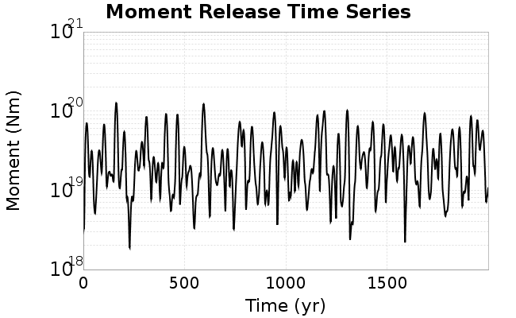

We then compute Welch's power spectral density estimate on the entire time series. Results are plotted below, with a Poisson randomization of the catalog also plotted in gray as a control. Significant deviations above the Poisson model indicate synchronization at that period.

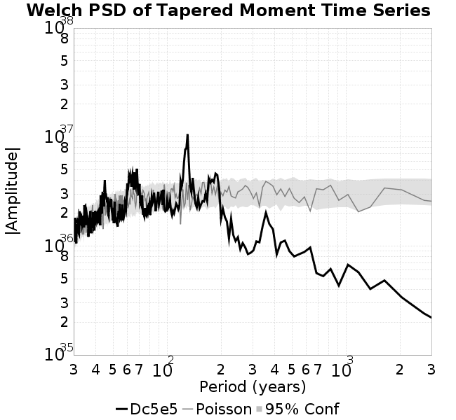

## Input File
*[(top)](#dc5e5)*

```
  A_1 = 0.001
  fA = .1
  B_1 = 0.008
  muSlipAmp_1 = .0
  muSlipInvDist_1 = 1.0
  cohesion = 0.0
  Dc_1 = 5.0000000000000000818e-05
  mu0_1 = 0.6
  ddotStar_1 = 9.9999999999999995475e-07
  ddotAB_1 = 9.9999999999999995475e-07
  alpha_1 = 0.0
  theta0_1 = 200000000
  tau0_1 = 55.1
  sigma0_1 = 100
  sigmaFracPin = .5
  lowSigmaAction = 1
  maxThetaPin = 1.0e13
  ddotEQ_1 = 1
  ddotEQFname = 
  stressOvershootFactor = 0.10000000000000000555
  lameLambda = 30000
  lameMu = 30000
  slowSlip_1 = 0
  nEq = 100000000000
  KZeroFrac = 0
  muPin = 1.0
  tStart = 0
  maxT = 3.16e13
  maxWallTime = 169200
  maxTrans = 1.0000000000000000159e100
  faultFname = UCERF3FM.15km.1km.tri.flt
  outFnameInfix = Dc5e5
  writeTau = 2
  writeSigma = 2
  writeSlip = 0
  writeSlipSpeed = 0
  writeState = 0
  writeTheta = 2
  writePED = 1
  writeTransitions = 1
  minDtWrite = 0
  minDtWriteCoseismic = 0
  minDtWriteInterseismic = 0
  minMagWrite = 7.7
  writeStiffness = 0
  stressRateSpecification = 1
  dMu3 = 0.01000000000000000
  initTauFname = 
  initSigmaFname = 
  initThetaFname = 
  initSlipSpeedFname = 
  AFname = 
  BFname =  
  DcFname = 
  mu0Fname = 
  ddotStarFname = 
  ddotABFname = 
  alphaFname = 
  KTauFname = /u/sciteam/gilchris/scratch/stiffness_25a589d/Ktau.25a589d.out
  KSigmaFname = /u/sciteam/gilchris/scratch/stiffness_25a589d/Ksigma.25a589d.out
  tFailFname = 
  tauFailFname = 
  tauDotFname = 
  sigmaDotFname =
  KZeroFname = UCERF3FM.15km.1km.tri.KZero
  pinnedFname =  UCERF3FM.15km.1km.tri.pin
  neighborFname = UCERF3FM.15km.1km.tri.neighbors
  stressRateFname =  
  slowSlipFname = 
  writePatchFname = 
  DEBUG = 0
  ZBrentUpperBracket = 0
  receiverElementAreaFrac = 0.8
  receiverElementIntTol = 1.0e-4
  receiverElementSubdivisionMax = 4
  tgfDist1 = 3
  tgfDist1 = 10
  lowSigmaAction = 1
  highSigmaAction = 0
```
