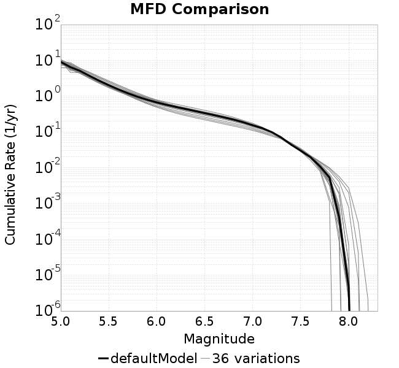
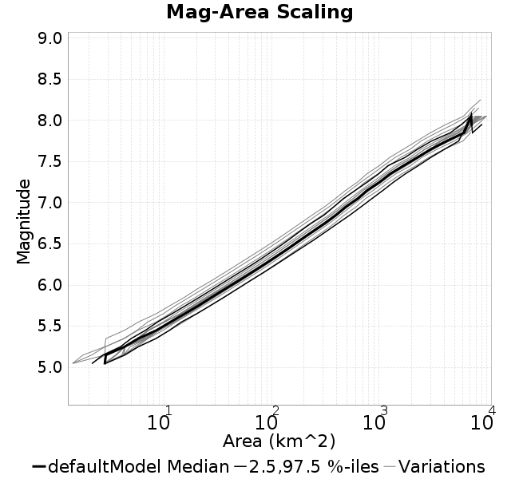
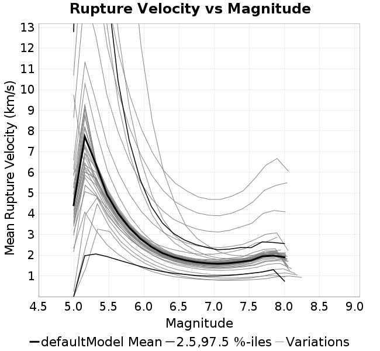
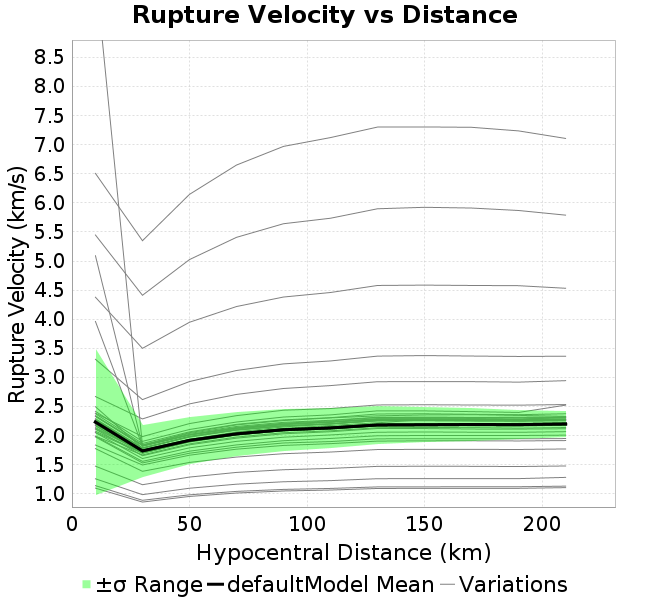

# RSQSim Catalogs Analysis

| Date | Name | Duration | Element Area | Description |
|-----|-----|-----|-----|-----|
| 2018/09/27 | [overS0_01](overS0_01#overs001) | 410,290 yrs | 1.35 km | stress overshoot: overshoot=0.01 |
| 2018/09/27 | [defaultModel](defaultModel#defaultmodel) | 217,822 yrs | 1.35 km | default model setup |
| 2018/09/27 | [aRed0_2](aRed0_2#ared02) | 436,877 yrs | 1.35 km | a reduction factor: fA=0.2 |
| 2018/09/27 | [ddot0_5](ddot0_5#ddot05) | 451,533 yrs | 1.35 km | change ddotEQ: ddotEQ=0.5 |
| 2018/09/27 | [aRed0_01](aRed0_01#ared001) | 460,052 yrs | 1.35 km | a reduction factor: fA=0.01 |
| 2018/09/27 | [Dc2e5](Dc2e5#dc2e5) | 428,879 yrs | 1.35 km | change Dc: Dc=2.00E-05 |
| 2018/09/27 | [sigma125](sigma125#sigma125) | 553,948 yrs | 1.35 km | vary tau/sigma: sigma0=125, tau0=68.75 |
| 2018/09/27 | [overS0_2](overS0_2#overs02) | 498,709 yrs | 1.35 km | stress overshoot: overshoot=0.2 |
| 2018/09/27 | [a0_0015b0_0085](a0_0015b0_0085#a00015b00085) | 438,695 yrs | 1.35 km | hold b-a constant, but change a and b: a=0.0015, b=0.0085 |
| 2018/09/27 | [ddot3](ddot3#ddot3) | 410,843 yrs | 1.35 km | change ddotEQ: ddotEQ=3 |
| 2018/09/27 | [a0_003b0_008](a0_003b0_008#a0003b0008) | 291,186 yrs | 1.35 km | change b-a: a=0.003 |
| 2018/09/27 | [a0_001b0_009](a0_001b0_009#a0001b0009) | 496,501 yrs | 1.35 km | change b-a: b=0.009 |
| 2018/09/27 | [mu0_8](mu0_8#mu08) | 458,737 yrs | 1.35 km | change mu0: mu0=0.8 |
| 2018/09/27 | [Dc1e4](Dc1e4#dc1e4) | 370,997 yrs | 1.35 km | change Dc: Dc=1.00E-04 |
| 2018/09/27 | [aRed0_001](aRed0_001#ared0001) | 455,887 yrs | 1.35 km | a reduction factor: fA=0.001 |
| 2018/09/27 | [sigma150](sigma150#sigma150) | 712,584 yrs | 1.35 km | vary tau/sigma: sigma0=150, tau0=82.5 |
| 2018/09/27 | [sigma175](sigma175#sigma175) | 838,066 yrs | 1.35 km | vary tau/sigma: sigma0=175, tau0=96.25 |
| 2018/09/27 | [mu0_5](mu0_5#mu05) | 429,329 yrs | 1.35 km | change mu0: mu0=0.5 |
| 2018/09/27 | [Dc5e5](Dc5e5#dc5e5) | 381,346 yrs | 1.35 km | change Dc: Dc=5.00E-05 |
| 2018/09/27 | [overS0_25](overS0_25#overs025) | 519,328 yrs | 1.35 km | stress overshoot: overshoot=0.25 |
| 2018/09/27 | [overS0_05](overS0_05#overs005) | 324,425 yrs | 1.35 km | stress overshoot: overshoot=0.05 |
| 2018/09/27 | [aRed0_005](aRed0_005#ared0005) | 455,556 yrs | 1.35 km | a reduction factor: fA=0.005 |
| 2018/09/27 | [aRed0_05](aRed0_05#ared005) | 451,945 yrs | 1.35 km | a reduction factor: fA=0.05 |
| 2018/09/27 | [ddot1_5](ddot1_5#ddot15) | 427,578 yrs | 1.35 km | change ddotEQ: ddotEQ=1.5 |
| 2018/09/27 | [overS0_15](overS0_15#overs015) | 464,004 yrs | 1.35 km | stress overshoot: overshoot=0.15 |
| 2018/09/27 | [a0_002b0_01](a0_002b0_01#a0002b001) | 514,620 yrs | 1.35 km | change b-a: a=0.002, b=0.01 |
| 2018/09/27 | [a0_002b0_008](a0_002b0_008#a0002b0008) | 362,155 yrs | 1.35 km | change b-a: a=0.002 |
| 2018/09/27 | [a0_003b0_01](a0_003b0_01#a0003b001) | 423,823 yrs | 1.35 km | hold b-a constant, but change a and b: a=0.003, b=0.01 |
| 2018/09/27 | [mu0_7](mu0_7#mu07) | 456,339 yrs | 1.35 km | change mu0: mu0=0.7 |
| 2018/09/27 | [Dc2e4](Dc2e4#dc2e4) | 342,059 yrs | 1.35 km | change Dc: Dc=2.00E-04 |
| 2018/09/27 | [ddot2_5](ddot2_5#ddot25) | 416,428 yrs | 1.35 km | change ddotEQ: ddotEQ=2.5 |
| 2018/09/27 | [mu0_4](mu0_4#mu04) | 384,803 yrs | 1.35 km | change mu0: mu0=0.4 |
| 2018/09/27 | [overS0_3](overS0_3#overs03) | 548,173 yrs | 1.35 km | stress overshoot: overshoot=0.3 |
| 2018/09/27 | [aRed0_15](aRed0_15#ared015) | 436,694 yrs | 1.35 km | a reduction factor: fA=0.15 |
| 2018/09/27 | [sigma200](sigma200#sigma200) | 927,617 yrs | 1.35 km | vary tau/sigma: sigma0=200, tau0=110 |
| 2018/09/27 | [ddot2](ddot2#ddot2) | 420,676 yrs | 1.35 km | change ddotEQ: ddotEQ=2 |
| 2018/09/27 | [a0_002b0_009](a0_002b0_009#a0002b0009) | 434,248 yrs | 1.35 km | hold b-a constant, but change a and b: a=0.002, b=0.009 |
## Multi-Catalog Plots

Baseline catalog: [defaultModel](defaultModel#defaultmodel)

### MFDs

### Magnitude-Area Plots

### Rupture Velocity vs Magnitude

### Rupture Velocity vs Distance

