# RSQSim Catalogs Analysis

| Date | Name | Duration | Element Area | Description |
|-----|-----|-----|-----|-----|
| 2018/09/27 | [overS0_01](overS0_01#overs0_01) | 410,290 yrs | 1.35 km | stress overshoot: overshoot=0.01 |
| 2018/09/27 | [defaultModel](defaultModel#defaultmodel) | 217,822 yrs | 1.35 km | default model setup |
| 2018/09/27 | [aRed0_2](aRed0_2#ared0_2) | 436,877 yrs | 1.35 km | a reduction factor: fA=0.2 |
| 2018/09/27 | [ddot0_5](ddot0_5#ddot0_5) | 451,533 yrs | 1.35 km | change ddotEQ: ddotEQ=0.5 |
| 2018/09/27 | [aRed0_01](aRed0_01#ared0_01) | 460,052 yrs | 1.35 km | a reduction factor: fA=0.01 |
| 2018/09/27 | [Dc2e5](Dc2e5#dc2e5) | 428,879 yrs | 1.35 km | change Dc: Dc=2.00E-05 |
| 2018/09/27 | [sigma125](sigma125#sigma125) | 553,948 yrs | 1.35 km | vary tau/sigma: sigma0=125, tau0=68.75 |
| 2018/09/27 | [overS0_2](overS0_2#overs0_2) | 498,709 yrs | 1.35 km | stress overshoot: overshoot=0.2 |
| 2018/09/27 | [a0_0015b0_0085](a0_0015b0_0085#a0_0015b0_0085) | 438,695 yrs | 1.35 km | hold b-a constant, but change a and b: a=0.0015, b=0.0085 |
| 2018/09/27 | [ddot3](ddot3#ddot3) | 410,843 yrs | 1.35 km | change ddotEQ: ddotEQ=3 |
| 2018/09/27 | [a0_003b0_008](a0_003b0_008#a0_003b0_008) | 291,186 yrs | 1.35 km | change b-a: a=0.003 |
| 2018/09/27 | [a0_001b0_009](a0_001b0_009#a0_001b0_009) | 496,501 yrs | 1.35 km | change b-a: b=0.009 |
| 2018/09/27 | [mu0_8](mu0_8#mu0_8) | 458,737 yrs | 1.35 km | change mu0: mu0=0.8 |
| 2018/09/27 | [Dc1e4](Dc1e4#dc1e4) | 370,997 yrs | 1.35 km | change Dc: Dc=1.00E-04 |
| 2018/09/27 | [aRed0_001](aRed0_001#ared0_001) | 455,887 yrs | 1.35 km | a reduction factor: fA=0.001 |
| 2018/09/27 | [sigma150](sigma150#sigma150) | 712,584 yrs | 1.35 km | vary tau/sigma: sigma0=150, tau0=82.5 |
| 2018/09/27 | [sigma175](sigma175#sigma175) | 838,066 yrs | 1.35 km | vary tau/sigma: sigma0=175, tau0=96.25 |
| 2018/09/27 | [mu0_5](mu0_5#mu0_5) | 429,329 yrs | 1.35 km | change mu0: mu0=0.5 |
| 2018/09/27 | [Dc5e5](Dc5e5#dc5e5) | 381,346 yrs | 1.35 km | change Dc: Dc=5.00E-05 |
| 2018/09/27 | [overS0_25](overS0_25#overs0_25) | 519,328 yrs | 1.35 km | stress overshoot: overshoot=0.25 |
| 2018/09/27 | [overS0_05](overS0_05#overs0_05) | 324,425 yrs | 1.35 km | stress overshoot: overshoot=0.05 |
| 2018/09/27 | [aRed0_005](aRed0_005#ared0_005) | 455,556 yrs | 1.35 km | a reduction factor: fA=0.005 |
| 2018/09/27 | [aRed0_05](aRed0_05#ared0_05) | 451,945 yrs | 1.35 km | a reduction factor: fA=0.05 |
| 2018/09/27 | [ddot1_5](ddot1_5#ddot1_5) | 427,578 yrs | 1.35 km | change ddotEQ: ddotEQ=1.5 |
| 2018/09/27 | [overS0_15](overS0_15#overs0_15) | 464,004 yrs | 1.35 km | stress overshoot: overshoot=0.15 |
| 2018/09/27 | [a0_002b0_01](a0_002b0_01#a0_002b0_01) | 514,620 yrs | 1.35 km | change b-a: a=0.002, b=0.01 |
| 2018/09/27 | [a0_002b0_008](a0_002b0_008#a0_002b0_008) | 362,155 yrs | 1.35 km | change b-a: a=0.002 |
| 2018/09/27 | [a0_003b0_01](a0_003b0_01#a0_003b0_01) | 423,823 yrs | 1.35 km | hold b-a constant, but change a and b: a=0.003, b=0.01 |
| 2018/09/27 | [mu0_7](mu0_7#mu0_7) | 456,339 yrs | 1.35 km | change mu0: mu0=0.7 |
| 2018/09/27 | [Dc2e4](Dc2e4#dc2e4) | 342,059 yrs | 1.35 km | change Dc: Dc=2.00E-04 |
| 2018/09/27 | [ddot2_5](ddot2_5#ddot2_5) | 416,428 yrs | 1.35 km | change ddotEQ: ddotEQ=2.5 |
| 2018/09/27 | [mu0_4](mu0_4#mu0_4) | 384,803 yrs | 1.35 km | change mu0: mu0=0.4 |
| 2018/09/27 | [overS0_3](overS0_3#overs0_3) | 548,173 yrs | 1.35 km | stress overshoot: overshoot=0.3 |
| 2018/09/27 | [aRed0_15](aRed0_15#ared0_15) | 436,694 yrs | 1.35 km | a reduction factor: fA=0.15 |
| 2018/09/27 | [sigma200](sigma200#sigma200) | 927,617 yrs | 1.35 km | vary tau/sigma: sigma0=200, tau0=110 |
| 2018/09/27 | [ddot2](ddot2#ddot2) | 420,676 yrs | 1.35 km | change ddotEQ: ddotEQ=2 |
| 2018/09/27 | [a0_002b0_009](a0_002b0_009#a0_002b0_009) | 434,248 yrs | 1.35 km | hold b-a constant, but change a and b: a=0.002, b=0.009 |
## Multi-Catalog Plots

* [Multi-Catalog Plots](#multi-catalog-plots)
  * [MFDs](#mfds)
    * [MFD Variations Table](#mfd-variations-table)
  * [Magnitude-Area Plots](#magnitude-area-plots)
    * [M-A Variations Table](#m-a-variations-table)
  * [Rupture Velocity vs Magnitude](#rupture-velocity-vs-magnitude)
    * [Rupture Velocity vs Magnitude Variations Table](#rupture-velocity-vs-magnitude-variations-table)
  * [Rupture Velocity vs Distance](#rupture-velocity-vs-distance)
    * [Rupture Velocity vs Distance Variations Table](#rupture-velocity-vs-distance-variations-table)
  * [M7 Element Interevent Time Comparisons](#m7-element-interevent-time-comparisons)
  * [M7 Subsection Interevent Time Comparisons](#m7-subsection-interevent-time-comparisons)
  * [Paleo Open Interval Plots](#paleo-open-interval-plots)
    * [Paleo Open Interval Plots, Biasi and Sharer 2019](#paleo-open-interval-plots-biasi-and-sharer-2019)
    * [Paleo Open Interval Plots, UCERF3](#paleo-open-interval-plots-ucerf3)
  * [Moment Release Variability Welch PSDs](#moment-release-variability-welch-psds)

Baseline catalog: [defaultModel](defaultModel#defaultmodel)

### MFDs
*[(top)](#multi-catalog-plots)*

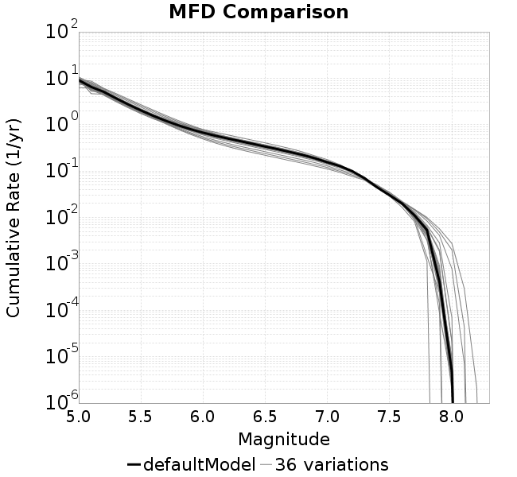

#### MFD Variations Table

**a reduction factor**

| 
**a reduction factor: fA=0.001**
 | 
**a reduction factor: fA=0.005**
 | 
**a reduction factor: fA=0.01**
 | 
**a reduction factor: fA=0.05**
 |
|-----|-----|-----|-----|
|  |  |  |  |
| 
**default model setup**
 | 
**a reduction factor: fA=0.15**
 | 
**a reduction factor: fA=0.2**
 |  |
|  |  |  |  |

**change Dc**

| 
**default model setup**
 | 
**change Dc: Dc=2.00E-05**
 | 
**change Dc: Dc=5.00E-05**
 |
|-----|-----|-----|
|  |  |  |
| 
**change Dc: Dc=1.00E-04**
 | 
**change Dc: Dc=2.00E-04**
 |  |
|  |  |  |

**change b-a**

| 
**default model setup**
 | 
**change b-a: b=0.009**
 | 
**change b-a: a=0.002**
 |
|-----|-----|-----|
|  |  |  |
| 
**change b-a: a=0.002, b=0.01**
 | 
**change b-a: a=0.003**
 |  |
|  | 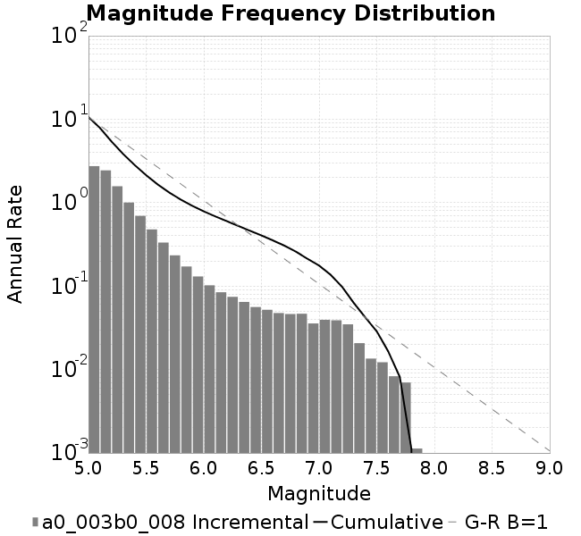 |  |

**stress overshoot**

| 
**stress overshoot: overshoot=0.01**
 | 
**stress overshoot: overshoot=0.05**
 | 
**default model setup**
 | 
**stress overshoot: overshoot=0.15**
 |
|-----|-----|-----|-----|
|  |  |  |  |
| 
**stress overshoot: overshoot=0.2**
 | 
**stress overshoot: overshoot=0.25**
 | 
**stress overshoot: overshoot=0.3**
 |  |
|  |  |  |  |

**vary tau/sigma**

| 
**default model setup**
 | 
**vary tau/sigma: sigma0=125, tau0=68.75**
 | 
**vary tau/sigma: sigma0=150, tau0=82.5**
 |
|-----|-----|-----|
|  | 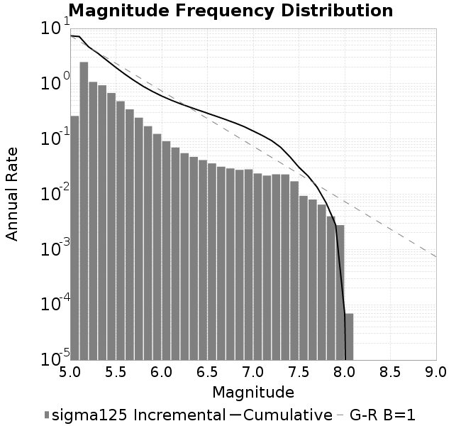 | 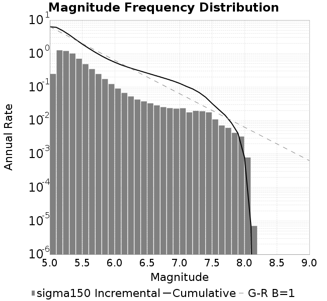 |
| 
**vary tau/sigma: sigma0=175, tau0=96.25**
 | 
**vary tau/sigma: sigma0=200, tau0=110**
 |  |
|  |  |  |

**change ddotEQ**

| 
**change ddotEQ: ddotEQ=0.5**
 | 
**default model setup**
 | 
**change ddotEQ: ddotEQ=1.5**
 |
|-----|-----|-----|
|  |  |  |
| 
**change ddotEQ: ddotEQ=2**
 | 
**change ddotEQ: ddotEQ=2.5**
 | 
**change ddotEQ: ddotEQ=3**
 |
|  |  |  |

**change mu0**

| 
**change mu0: mu0=0.4**
 | 
**change mu0: mu0=0.5**
 | 
**default model setup**
 |
|-----|-----|-----|
|  |  |  |
| 
**change mu0: mu0=0.7**
 | 
**change mu0: mu0=0.8**
 |  |
|  | 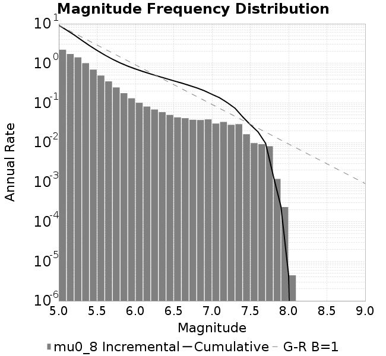 |  |

**hold b-a constant, but change a and b**

| 
**default model setup**
 | 
**hold b-a constant, but change a and b: a=0.0015, b=0.0085**
 | 
**hold b-a constant, but change a and b: a=0.002, b=0.009**
 | 
**hold b-a constant, but change a and b: a=0.003, b=0.01**
 |
|-----|-----|-----|-----|
|  | 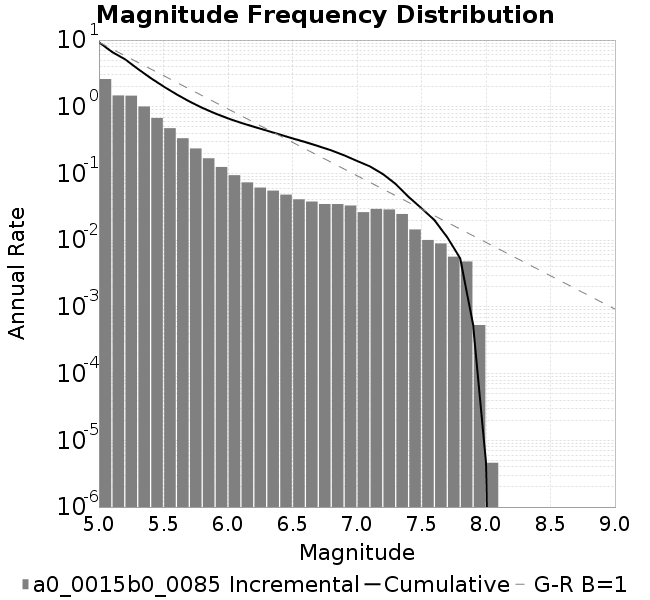 |  |  |

### Magnitude-Area Plots
*[(top)](#multi-catalog-plots)*

#### M-A Variations Table

**a reduction factor**

| 
**a reduction factor: fA=0.001**
 | 
**a reduction factor: fA=0.005**
 | 
**a reduction factor: fA=0.01**
 | 
**a reduction factor: fA=0.05**
 |
|-----|-----|-----|-----|
|  |  |  |  |
| 
**default model setup**
 | 
**a reduction factor: fA=0.15**
 | 
**a reduction factor: fA=0.2**
 |  |
|  |  |  |  |

**change Dc**

| 
**default model setup**
 | 
**change Dc: Dc=2.00E-05**
 | 
**change Dc: Dc=5.00E-05**
 |
|-----|-----|-----|
|  |  |  |
| 
**change Dc: Dc=1.00E-04**
 | 
**change Dc: Dc=2.00E-04**
 |  |
|  |  |  |

**change b-a**

| 
**default model setup**
 | 
**change b-a: b=0.009**
 | 
**change b-a: a=0.002**
 |
|-----|-----|-----|
|  |  |  |
| 
**change b-a: a=0.002, b=0.01**
 | 
**change b-a: a=0.003**
 |  |
|  |  |  |

**stress overshoot**

| 
**stress overshoot: overshoot=0.01**
 | 
**stress overshoot: overshoot=0.05**
 | 
**default model setup**
 | 
**stress overshoot: overshoot=0.15**
 |
|-----|-----|-----|-----|
|  |  |  |  |
| 
**stress overshoot: overshoot=0.2**
 | 
**stress overshoot: overshoot=0.25**
 | 
**stress overshoot: overshoot=0.3**
 |  |
|  |  |  |  |

**vary tau/sigma**

| 
**default model setup**
 | 
**vary tau/sigma: sigma0=125, tau0=68.75**
 | 
**vary tau/sigma: sigma0=150, tau0=82.5**
 |
|-----|-----|-----|
|  |  |  |
| 
**vary tau/sigma: sigma0=175, tau0=96.25**
 | 
**vary tau/sigma: sigma0=200, tau0=110**
 |  |
|  |  |  |

**change ddotEQ**

| 
**change ddotEQ: ddotEQ=0.5**
 | 
**default model setup**
 | 
**change ddotEQ: ddotEQ=1.5**
 |
|-----|-----|-----|
|  |  |  |
| 
**change ddotEQ: ddotEQ=2**
 | 
**change ddotEQ: ddotEQ=2.5**
 | 
**change ddotEQ: ddotEQ=3**
 |
|  |  |  |

**change mu0**

| 
**change mu0: mu0=0.4**
 | 
**change mu0: mu0=0.5**
 | 
**default model setup**
 |
|-----|-----|-----|
|  |  |  |
| 
**change mu0: mu0=0.7**
 | 
**change mu0: mu0=0.8**
 |  |
|  |  |  |

**hold b-a constant, but change a and b**

| 
**default model setup**
 | 
**hold b-a constant, but change a and b: a=0.0015, b=0.0085**
 | 
**hold b-a constant, but change a and b: a=0.002, b=0.009**
 | 
**hold b-a constant, but change a and b: a=0.003, b=0.01**
 |
|-----|-----|-----|-----|
|  |  |  |  |

### Rupture Velocity vs Magnitude
*[(top)](#multi-catalog-plots)*

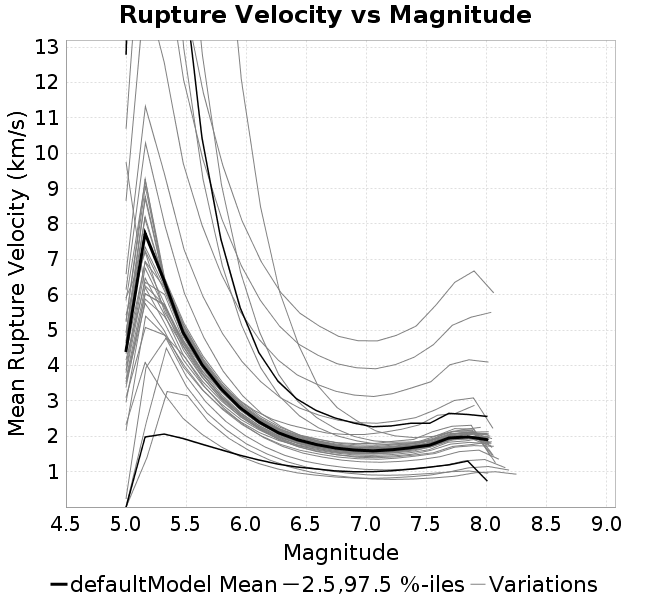

#### Rupture Velocity vs Magnitude Variations Table

**a reduction factor**

| 
**a reduction factor: fA=0.001**
 | 
**a reduction factor: fA=0.005**
 | 
**a reduction factor: fA=0.01**
 | 
**a reduction factor: fA=0.05**
 |
|-----|-----|-----|-----|
|  |  |  |  |
| 
**default model setup**
 | 
**a reduction factor: fA=0.15**
 | 
**a reduction factor: fA=0.2**
 |  |
|  |  |  |  |

**change Dc**

| 
**default model setup**
 | 
**change Dc: Dc=2.00E-05**
 | 
**change Dc: Dc=5.00E-05**
 |
|-----|-----|-----|
|  |  |  |
| 
**change Dc: Dc=1.00E-04**
 | 
**change Dc: Dc=2.00E-04**
 |  |
|  |  |  |

**change b-a**

| 
**default model setup**
 | 
**change b-a: b=0.009**
 | 
**change b-a: a=0.002**
 |
|-----|-----|-----|
|  |  |  |
| 
**change b-a: a=0.002, b=0.01**
 | 
**change b-a: a=0.003**
 |  |
|  | 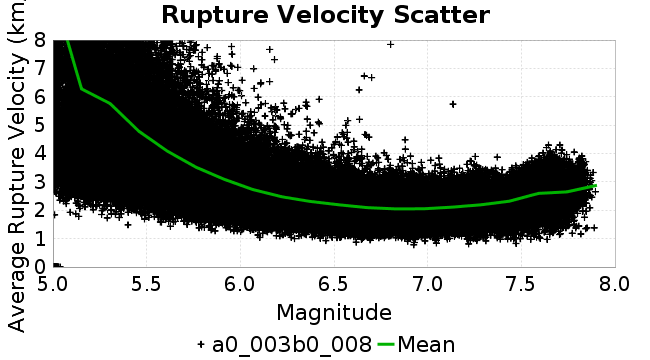 |  |

**stress overshoot**

| 
**stress overshoot: overshoot=0.01**
 | 
**stress overshoot: overshoot=0.05**
 | 
**default model setup**
 | 
**stress overshoot: overshoot=0.15**
 |
|-----|-----|-----|-----|
|  |  |  |  |
| 
**stress overshoot: overshoot=0.2**
 | 
**stress overshoot: overshoot=0.25**
 | 
**stress overshoot: overshoot=0.3**
 |  |
|  |  |  |  |

**vary tau/sigma**

| 
**default model setup**
 | 
**vary tau/sigma: sigma0=125, tau0=68.75**
 | 
**vary tau/sigma: sigma0=150, tau0=82.5**
 |
|-----|-----|-----|
|  |  |  |
| 
**vary tau/sigma: sigma0=175, tau0=96.25**
 | 
**vary tau/sigma: sigma0=200, tau0=110**
 |  |
|  |  |  |

**change ddotEQ**

| 
**change ddotEQ: ddotEQ=0.5**
 | 
**default model setup**
 | 
**change ddotEQ: ddotEQ=1.5**
 |
|-----|-----|-----|
|  |  |  |
| 
**change ddotEQ: ddotEQ=2**
 | 
**change ddotEQ: ddotEQ=2.5**
 | 
**change ddotEQ: ddotEQ=3**
 |
|  | 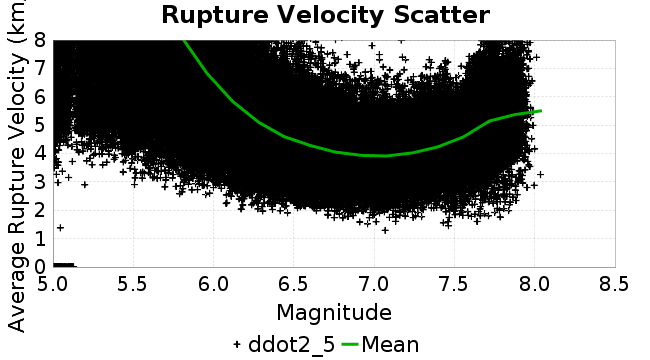 |  |

**change mu0**

| 
**change mu0: mu0=0.4**
 | 
**change mu0: mu0=0.5**
 | 
**default model setup**
 |
|-----|-----|-----|
|  |  |  |
| 
**change mu0: mu0=0.7**
 | 
**change mu0: mu0=0.8**
 |  |
|  |  |  |

**hold b-a constant, but change a and b**

| 
**default model setup**
 | 
**hold b-a constant, but change a and b: a=0.0015, b=0.0085**
 | 
**hold b-a constant, but change a and b: a=0.002, b=0.009**
 | 
**hold b-a constant, but change a and b: a=0.003, b=0.01**
 |
|-----|-----|-----|-----|
|  |  |  |  |

### Rupture Velocity vs Distance
*[(top)](#multi-catalog-plots)*

#### Rupture Velocity vs Distance Variations Table

**a reduction factor**

| 
**a reduction factor: fA=0.001**
 | 
**a reduction factor: fA=0.005**
 | 
**a reduction factor: fA=0.01**
 | 
**a reduction factor: fA=0.05**
 |
|-----|-----|-----|-----|
|  |  | 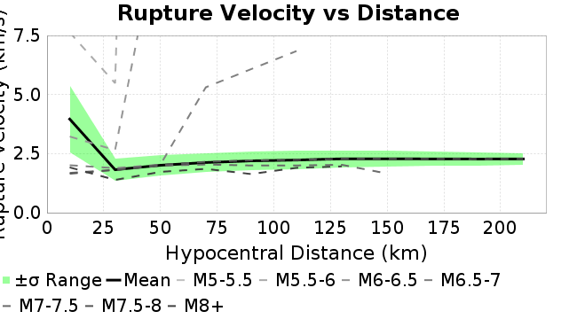 |  |
| 
**default model setup**
 | 
**a reduction factor: fA=0.15**
 | 
**a reduction factor: fA=0.2**
 |  |
| 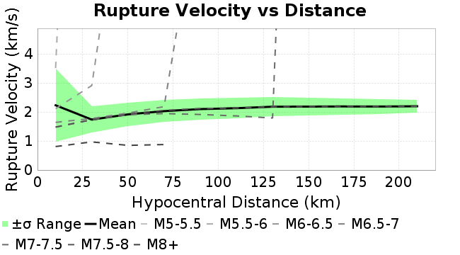 |  |  |  |

**change Dc**

| 
**default model setup**
 | 
**change Dc: Dc=2.00E-05**
 | 
**change Dc: Dc=5.00E-05**
 |
|-----|-----|-----|
|  |  |  |
| 
**change Dc: Dc=1.00E-04**
 | 
**change Dc: Dc=2.00E-04**
 |  |
|  |  |  |

**change b-a**

| 
**default model setup**
 | 
**change b-a: b=0.009**
 | 
**change b-a: a=0.002**
 |
|-----|-----|-----|
|  |  |  |
| 
**change b-a: a=0.002, b=0.01**
 | 
**change b-a: a=0.003**
 |  |
| 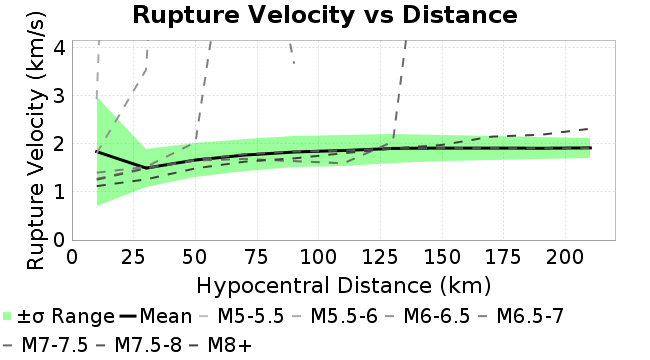 |  |  |

**stress overshoot**

| 
**stress overshoot: overshoot=0.01**
 | 
**stress overshoot: overshoot=0.05**
 | 
**default model setup**
 | 
**stress overshoot: overshoot=0.15**
 |
|-----|-----|-----|-----|
|  | 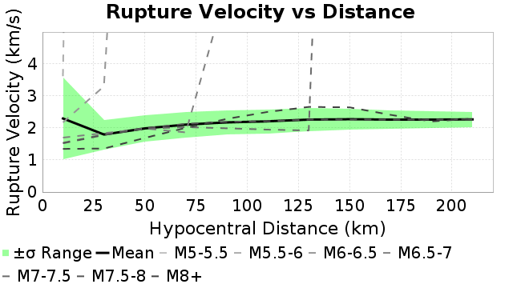 |  |  |
| 
**stress overshoot: overshoot=0.2**
 | 
**stress overshoot: overshoot=0.25**
 | 
**stress overshoot: overshoot=0.3**
 |  |
|  |  |  |  |

**vary tau/sigma**

| 
**default model setup**
 | 
**vary tau/sigma: sigma0=125, tau0=68.75**
 | 
**vary tau/sigma: sigma0=150, tau0=82.5**
 |
|-----|-----|-----|
|  |  |  |
| 
**vary tau/sigma: sigma0=175, tau0=96.25**
 | 
**vary tau/sigma: sigma0=200, tau0=110**
 |  |
|  |  |  |

**change ddotEQ**

| 
**change ddotEQ: ddotEQ=0.5**
 | 
**default model setup**
 | 
**change ddotEQ: ddotEQ=1.5**
 |
|-----|-----|-----|
|  |  |  |
| 
**change ddotEQ: ddotEQ=2**
 | 
**change ddotEQ: ddotEQ=2.5**
 | 
**change ddotEQ: ddotEQ=3**
 |
|  |  |  |

**change mu0**

| 
**change mu0: mu0=0.4**
 | 
**change mu0: mu0=0.5**
 | 
**default model setup**
 |
|-----|-----|-----|
|  |  |  |
| 
**change mu0: mu0=0.7**
 | 
**change mu0: mu0=0.8**
 |  |
|  |  |  |

**hold b-a constant, but change a and b**

| 
**default model setup**
 | 
**hold b-a constant, but change a and b: a=0.0015, b=0.0085**
 | 
**hold b-a constant, but change a and b: a=0.002, b=0.009**
 | 
**hold b-a constant, but change a and b: a=0.003, b=0.01**
 |
|-----|-----|-----|-----|
|  |  | 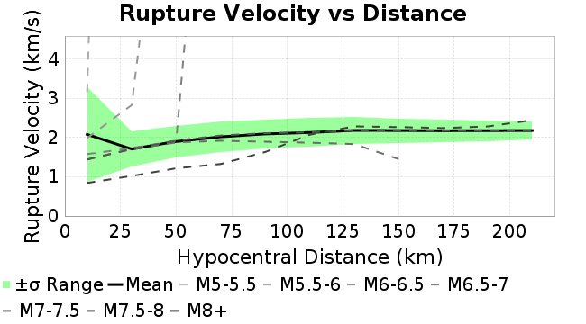 |  |

### M7 Element Interevent Time Comparisons
*[(top)](#multi-catalog-plots)*

**a reduction factor**

| 
**a reduction factor: fA=0.001**
 | 
**a reduction factor: fA=0.005**
 | 
**a reduction factor: fA=0.01**
 | 
**a reduction factor: fA=0.05**
 |
|-----|-----|-----|-----|
|  |  |  |  |
| 
**default model setup**
 | 
**a reduction factor: fA=0.15**
 | 
**a reduction factor: fA=0.2**
 |  |
|  |  |  |  |

**change Dc**

| 
**default model setup**
 | 
**change Dc: Dc=2.00E-05**
 | 
**change Dc: Dc=5.00E-05**
 |
|-----|-----|-----|
|  |  |  |
| 
**change Dc: Dc=1.00E-04**
 | 
**change Dc: Dc=2.00E-04**
 |  |
|  |  |  |

**change b-a**

| 
**default model setup**
 | 
**change b-a: b=0.009**
 | 
**change b-a: a=0.002**
 |
|-----|-----|-----|
|  |  |  |
| 
**change b-a: a=0.002, b=0.01**
 | 
**change b-a: a=0.003**
 |  |
|  |  |  |

**stress overshoot**

| 
**stress overshoot: overshoot=0.01**
 | 
**stress overshoot: overshoot=0.05**
 | 
**default model setup**
 | 
**stress overshoot: overshoot=0.15**
 |
|-----|-----|-----|-----|
|  |  |  |  |
| 
**stress overshoot: overshoot=0.2**
 | 
**stress overshoot: overshoot=0.25**
 | 
**stress overshoot: overshoot=0.3**
 |  |
|  |  |  |  |

**vary tau/sigma**

| 
**default model setup**
 | 
**vary tau/sigma: sigma0=125, tau0=68.75**
 | 
**vary tau/sigma: sigma0=150, tau0=82.5**
 |
|-----|-----|-----|
|  |  | 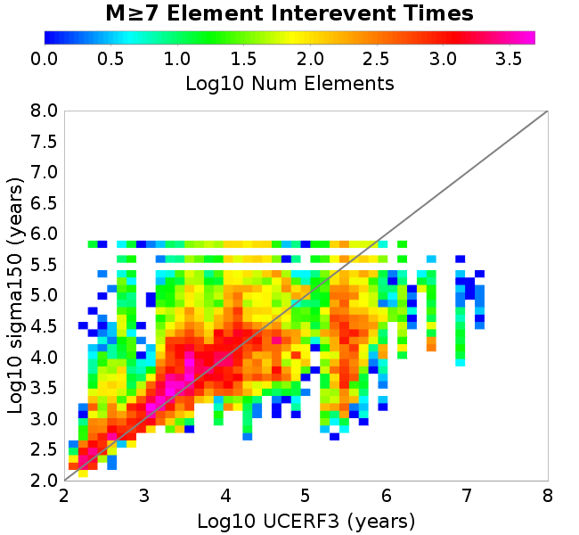 |
| 
**vary tau/sigma: sigma0=175, tau0=96.25**
 | 
**vary tau/sigma: sigma0=200, tau0=110**
 |  |
|  |  |  |

**change ddotEQ**

| 
**change ddotEQ: ddotEQ=0.5**
 | 
**default model setup**
 | 
**change ddotEQ: ddotEQ=1.5**
 |
|-----|-----|-----|
|  |  |  |
| 
**change ddotEQ: ddotEQ=2**
 | 
**change ddotEQ: ddotEQ=2.5**
 | 
**change ddotEQ: ddotEQ=3**
 |
|  |  |  |

**change mu0**

| 
**change mu0: mu0=0.4**
 | 
**change mu0: mu0=0.5**
 | 
**default model setup**
 |
|-----|-----|-----|
|  |  |  |
| 
**change mu0: mu0=0.7**
 | 
**change mu0: mu0=0.8**
 |  |
|  |  |  |

**hold b-a constant, but change a and b**

| 
**default model setup**
 | 
**hold b-a constant, but change a and b: a=0.0015, b=0.0085**
 | 
**hold b-a constant, but change a and b: a=0.002, b=0.009**
 | 
**hold b-a constant, but change a and b: a=0.003, b=0.01**
 |
|-----|-----|-----|-----|
|  |  |  |  |

### M7 Subsection Interevent Time Comparisons
*[(top)](#multi-catalog-plots)*

**a reduction factor**

| 
**a reduction factor: fA=0.001**
 | 
**a reduction factor: fA=0.005**
 | 
**a reduction factor: fA=0.01**
 | 
**a reduction factor: fA=0.05**
 |
|-----|-----|-----|-----|
|  |  |  |  |
| 
**default model setup**
 | 
**a reduction factor: fA=0.15**
 | 
**a reduction factor: fA=0.2**
 |  |
|  |  |  |  |

**change Dc**

| 
**default model setup**
 | 
**change Dc: Dc=2.00E-05**
 | 
**change Dc: Dc=5.00E-05**
 |
|-----|-----|-----|
|  |  |  |
| 
**change Dc: Dc=1.00E-04**
 | 
**change Dc: Dc=2.00E-04**
 |  |
|  |  |  |

**change b-a**

| 
**default model setup**
 | 
**change b-a: b=0.009**
 | 
**change b-a: a=0.002**
 |
|-----|-----|-----|
|  |  |  |
| 
**change b-a: a=0.002, b=0.01**
 | 
**change b-a: a=0.003**
 |  |
|  |  |  |

**stress overshoot**

| 
**stress overshoot: overshoot=0.01**
 | 
**stress overshoot: overshoot=0.05**
 | 
**default model setup**
 | 
**stress overshoot: overshoot=0.15**
 |
|-----|-----|-----|-----|
|  |  |  |  |
| 
**stress overshoot: overshoot=0.2**
 | 
**stress overshoot: overshoot=0.25**
 | 
**stress overshoot: overshoot=0.3**
 |  |
|  |  |  |  |

**vary tau/sigma**

| 
**default model setup**
 | 
**vary tau/sigma: sigma0=125, tau0=68.75**
 | 
**vary tau/sigma: sigma0=150, tau0=82.5**
 |
|-----|-----|-----|
|  |  |  |
| 
**vary tau/sigma: sigma0=175, tau0=96.25**
 | 
**vary tau/sigma: sigma0=200, tau0=110**
 |  |
|  |  |  |

**change ddotEQ**

| 
**change ddotEQ: ddotEQ=0.5**
 | 
**default model setup**
 | 
**change ddotEQ: ddotEQ=1.5**
 |
|-----|-----|-----|
|  |  |  |
| 
**change ddotEQ: ddotEQ=2**
 | 
**change ddotEQ: ddotEQ=2.5**
 | 
**change ddotEQ: ddotEQ=3**
 |
|  |  |  |

**change mu0**

| 
**change mu0: mu0=0.4**
 | 
**change mu0: mu0=0.5**
 | 
**default model setup**
 |
|-----|-----|-----|
|  |  |  |
| 
**change mu0: mu0=0.7**
 | 
**change mu0: mu0=0.8**
 |  |
|  |  |  |

**hold b-a constant, but change a and b**

| 
**default model setup**
 | 
**hold b-a constant, but change a and b: a=0.0015, b=0.0085**
 | 
**hold b-a constant, but change a and b: a=0.002, b=0.009**
 | 
**hold b-a constant, but change a and b: a=0.003, b=0.01**
 |
|-----|-----|-----|-----|
|  |  |  |  |

### Paleo Open Interval Plots
*[(top)](#multi-catalog-plots)*

#### Paleo Open Interval Plots, Biasi and Sharer 2019
*[(top)](#multi-catalog-plots)*

**a reduction factor**

| 
**a reduction factor: fA=0.001**
 | 
**a reduction factor: fA=0.005**
 | 
**a reduction factor: fA=0.01**
 | 
**a reduction factor: fA=0.05**
 |
|-----|-----|-----|-----|
|  |  |  |  |
| 
**default model setup**
 | 
**a reduction factor: fA=0.15**
 | 
**a reduction factor: fA=0.2**
 |  |
|  |  | 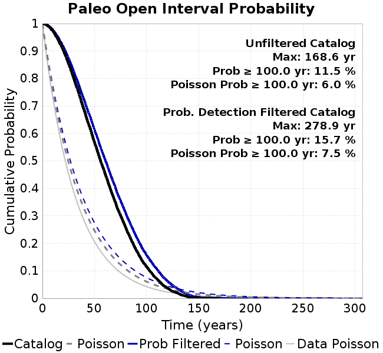 |  |

**change Dc**

| 
**default model setup**
 | 
**change Dc: Dc=2.00E-05**
 | 
**change Dc: Dc=5.00E-05**
 |
|-----|-----|-----|
|  |  |  |
| 
**change Dc: Dc=1.00E-04**
 | 
**change Dc: Dc=2.00E-04**
 |  |
|  |  |  |

**change b-a**

| 
**default model setup**
 | 
**change b-a: b=0.009**
 | 
**change b-a: a=0.002**
 |
|-----|-----|-----|
|  |  |  |
| 
**change b-a: a=0.002, b=0.01**
 | 
**change b-a: a=0.003**
 |  |
|  |  |  |

**stress overshoot**

| 
**stress overshoot: overshoot=0.01**
 | 
**stress overshoot: overshoot=0.05**
 | 
**default model setup**
 | 
**stress overshoot: overshoot=0.15**
 |
|-----|-----|-----|-----|
|  |  |  |  |
| 
**stress overshoot: overshoot=0.2**
 | 
**stress overshoot: overshoot=0.25**
 | 
**stress overshoot: overshoot=0.3**
 |  |
|  |  |  |  |

**vary tau/sigma**

| 
**default model setup**
 | 
**vary tau/sigma: sigma0=125, tau0=68.75**
 | 
**vary tau/sigma: sigma0=150, tau0=82.5**
 |
|-----|-----|-----|
|  |  |  |
| 
**vary tau/sigma: sigma0=175, tau0=96.25**
 | 
**vary tau/sigma: sigma0=200, tau0=110**
 |  |
|  |  |  |

**change ddotEQ**

| 
**change ddotEQ: ddotEQ=0.5**
 | 
**default model setup**
 | 
**change ddotEQ: ddotEQ=1.5**
 |
|-----|-----|-----|
|  |  |  |
| 
**change ddotEQ: ddotEQ=2**
 | 
**change ddotEQ: ddotEQ=2.5**
 | 
**change ddotEQ: ddotEQ=3**
 |
|  |  |  |

**change mu0**

| 
**change mu0: mu0=0.4**
 | 
**change mu0: mu0=0.5**
 | 
**default model setup**
 |
|-----|-----|-----|
|  |  |  |
| 
**change mu0: mu0=0.7**
 | 
**change mu0: mu0=0.8**
 |  |
|  |  |  |

**hold b-a constant, but change a and b**

| 
**default model setup**
 | 
**hold b-a constant, but change a and b: a=0.0015, b=0.0085**
 | 
**hold b-a constant, but change a and b: a=0.002, b=0.009**
 | 
**hold b-a constant, but change a and b: a=0.003, b=0.01**
 |
|-----|-----|-----|-----|
|  |  |  |  |

#### Paleo Open Interval Plots, UCERF3
*[(top)](#multi-catalog-plots)*

**a reduction factor**

| 
**a reduction factor: fA=0.001**
 | 
**a reduction factor: fA=0.005**
 | 
**a reduction factor: fA=0.01**
 | 
**a reduction factor: fA=0.05**
 |
|-----|-----|-----|-----|
|  |  |  |  |
| 
**default model setup**
 | 
**a reduction factor: fA=0.15**
 | 
**a reduction factor: fA=0.2**
 |  |
|  |  |  |  |

**change Dc**

| 
**default model setup**
 | 
**change Dc: Dc=2.00E-05**
 | 
**change Dc: Dc=5.00E-05**
 |
|-----|-----|-----|
|  |  |  |
| 
**change Dc: Dc=1.00E-04**
 | 
**change Dc: Dc=2.00E-04**
 |  |
|  |  |  |

**change b-a**

| 
**default model setup**
 | 
**change b-a: b=0.009**
 | 
**change b-a: a=0.002**
 |
|-----|-----|-----|
|  |  |  |
| 
**change b-a: a=0.002, b=0.01**
 | 
**change b-a: a=0.003**
 |  |
|  |  |  |

**stress overshoot**

| 
**stress overshoot: overshoot=0.01**
 | 
**stress overshoot: overshoot=0.05**
 | 
**default model setup**
 | 
**stress overshoot: overshoot=0.15**
 |
|-----|-----|-----|-----|
|  |  |  |  |
| 
**stress overshoot: overshoot=0.2**
 | 
**stress overshoot: overshoot=0.25**
 | 
**stress overshoot: overshoot=0.3**
 |  |
|  |  |  |  |

**vary tau/sigma**

| 
**default model setup**
 | 
**vary tau/sigma: sigma0=125, tau0=68.75**
 | 
**vary tau/sigma: sigma0=150, tau0=82.5**
 |
|-----|-----|-----|
|  |  |  |
| 
**vary tau/sigma: sigma0=175, tau0=96.25**
 | 
**vary tau/sigma: sigma0=200, tau0=110**
 |  |
|  |  |  |

**change ddotEQ**

| 
**change ddotEQ: ddotEQ=0.5**
 | 
**default model setup**
 | 
**change ddotEQ: ddotEQ=1.5**
 |
|-----|-----|-----|
|  |  |  |
| 
**change ddotEQ: ddotEQ=2**
 | 
**change ddotEQ: ddotEQ=2.5**
 | 
**change ddotEQ: ddotEQ=3**
 |
|  |  |  |

**change mu0**

| 
**change mu0: mu0=0.4**
 | 
**change mu0: mu0=0.5**
 | 
**default model setup**
 |
|-----|-----|-----|
|  |  |  |
| 
**change mu0: mu0=0.7**
 | 
**change mu0: mu0=0.8**
 |  |
|  |  |  |

**hold b-a constant, but change a and b**

| 
**default model setup**
 | 
**hold b-a constant, but change a and b: a=0.0015, b=0.0085**
 | 
**hold b-a constant, but change a and b: a=0.002, b=0.009**
 | 
**hold b-a constant, but change a and b: a=0.003, b=0.01**
 |
|-----|-----|-----|-----|
|  |  |  |  |

### Moment Release Variability Welch PSDs
*[(top)](#multi-catalog-plots)*

**a reduction factor**

| 
**a reduction factor: fA=0.001**
 | 
**a reduction factor: fA=0.005**
 | 
**a reduction factor: fA=0.01**
 | 
**a reduction factor: fA=0.05**
 |
|-----|-----|-----|-----|
|  | 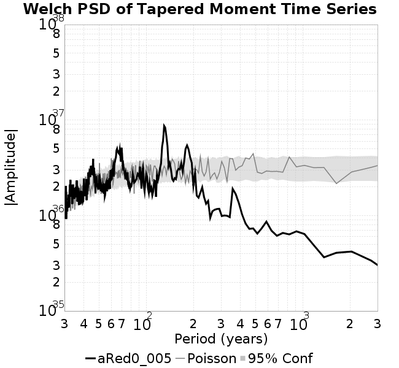 |  |  |
| 
**default model setup**
 | 
**a reduction factor: fA=0.15**
 | 
**a reduction factor: fA=0.2**
 |  |
|  |  |  |  |

**change Dc**

| 
**default model setup**
 | 
**change Dc: Dc=2.00E-05**
 | 
**change Dc: Dc=5.00E-05**
 |
|-----|-----|-----|
|  |  |  |
| 
**change Dc: Dc=1.00E-04**
 | 
**change Dc: Dc=2.00E-04**
 |  |
|  | 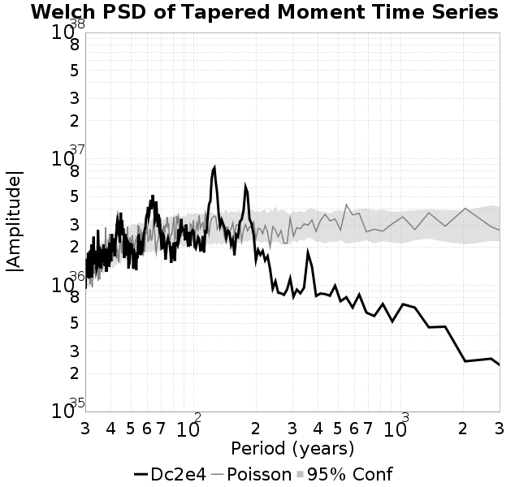 |  |

**change b-a**

| 
**default model setup**
 | 
**change b-a: b=0.009**
 | 
**change b-a: a=0.002**
 |
|-----|-----|-----|
|  |  |  |
| 
**change b-a: a=0.002, b=0.01**
 | 
**change b-a: a=0.003**
 |  |
|  |  |  |

**stress overshoot**

| 
**stress overshoot: overshoot=0.01**
 | 
**stress overshoot: overshoot=0.05**
 | 
**default model setup**
 | 
**stress overshoot: overshoot=0.15**
 |
|-----|-----|-----|-----|
|  |  |  |  |
| 
**stress overshoot: overshoot=0.2**
 | 
**stress overshoot: overshoot=0.25**
 | 
**stress overshoot: overshoot=0.3**
 |  |
|  |  |  |  |

**vary tau/sigma**

| 
**default model setup**
 | 
**vary tau/sigma: sigma0=125, tau0=68.75**
 | 
**vary tau/sigma: sigma0=150, tau0=82.5**
 |
|-----|-----|-----|
|  |  |  |
| 
**vary tau/sigma: sigma0=175, tau0=96.25**
 | 
**vary tau/sigma: sigma0=200, tau0=110**
 |  |
|  |  |  |

**change ddotEQ**

| 
**change ddotEQ: ddotEQ=0.5**
 | 
**default model setup**
 | 
**change ddotEQ: ddotEQ=1.5**
 |
|-----|-----|-----|
|  |  | 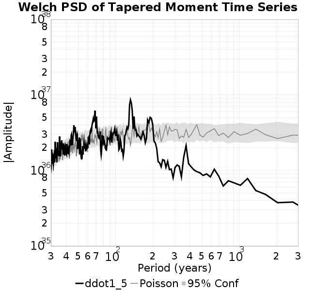 |
| 
**change ddotEQ: ddotEQ=2**
 | 
**change ddotEQ: ddotEQ=2.5**
 | 
**change ddotEQ: ddotEQ=3**
 |
|  |  |  |

**change mu0**

| 
**change mu0: mu0=0.4**
 | 
**change mu0: mu0=0.5**
 | 
**default model setup**
 |
|-----|-----|-----|
|  |  |  |
| 
**change mu0: mu0=0.7**
 | 
**change mu0: mu0=0.8**
 |  |
|  |  |  |

**hold b-a constant, but change a and b**

| 
**default model setup**
 | 
**hold b-a constant, but change a and b: a=0.0015, b=0.0085**
 | 
**hold b-a constant, but change a and b: a=0.002, b=0.009**
 | 
**hold b-a constant, but change a and b: a=0.003, b=0.01**
 |
|-----|-----|-----|-----|
|  |  |  | 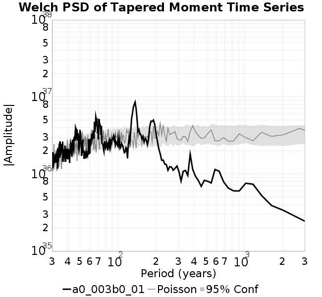 |

