# a0_0015b0_0085
## Metadata
| **Catalog** | a0_0015b0_0085 |
|-----|-----|
| **Author** | Jaqcui Gilchrist, 2018/09/27 |
| **Description** | hold b-a constant, but change a and b: a=0.0015, b=0.0085 |
| **Fault/Def Model** | Fault Model 3.1, Geologic |
| **Slip Velocity** | 1.0 m/s |
| **Average Element Area** | 1.35 km^2 |
| **Length** | 8,937,565 events in 438,695 years |
| **Frictional Params** | a=0.0015, b=0.0085, (b-a)=0.007, ddotEQ=1 |

* [Metadata](#metadata)
* [Plots](#plots)
  * [Magnitude-Frequency Plot](#magnitude-frequency-plot)
  * [Magnitude-Area Plots](#magnitude-area-plots)
  * [Slip-Area Plots](#slip-area-plots)
  * [Rupture Velocity Plots](#rupture-velocity-plots)
  * [Global Interevent-Time Distributions](#global-interevent-time-distributions)
  * [Normalized Fault Interevent-Time Distributions](#normalized-fault-interevent-time-distributions)
  * [Stationarity Plot](#stationarity-plot)
  * [Element/Subsection Interevent Time Comparisons](#elementsubsection-interevent-time-comparisons)
    * [Element Interevent Time Comparisons](#element-interevent-time-comparisons)
    * [Subsection Interevent Time Comparisons](#subsection-interevent-time-comparisons)
  * [Paleo Open Interval Plots](#paleo-open-interval-plots)
    * [Paleo Open Interval Plots, Biasi and Sharer 2019](#paleo-open-interval-plots-biasi-and-sharer-2019)
    * [Paleo Open Interval Plots, UCERF3](#paleo-open-interval-plots-ucerf3)
  * [Moment Release Variability Plots](#moment-release-variability-plots)
* [Input File](#input-file)

## Plots
### Magnitude-Frequency Plot
*[(top)](#a0_0015b0_0085)*


### Magnitude-Area Plots
*[(top)](#a0_0015b0_0085)*

| Scatter | 2-D Hist |
|-----|-----|
| 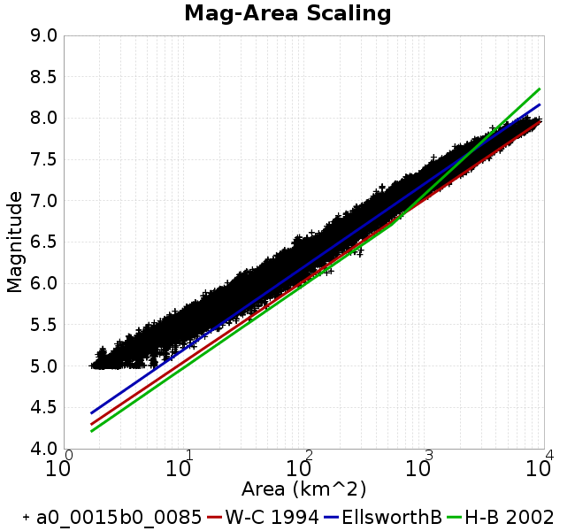 |  |
### Slip-Area Plots
*[(top)](#a0_0015b0_0085)*

| Scatter | 2-D Hist |
|-----|-----|
| 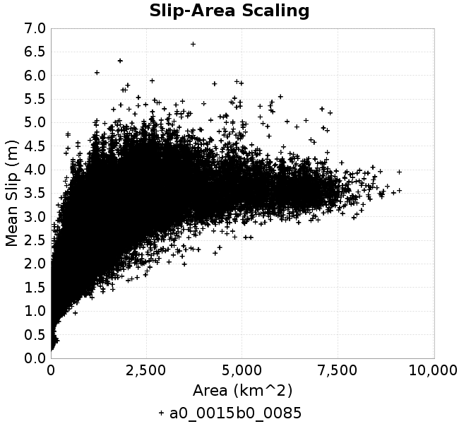 |  |
### Rupture Velocity Plots
*[(top)](#a0_0015b0_0085)*

| **Scatter** | 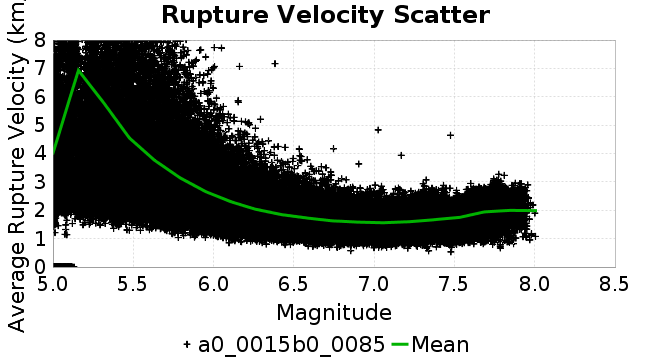 |
|-----|-----|
| **Distance/Velocity** | 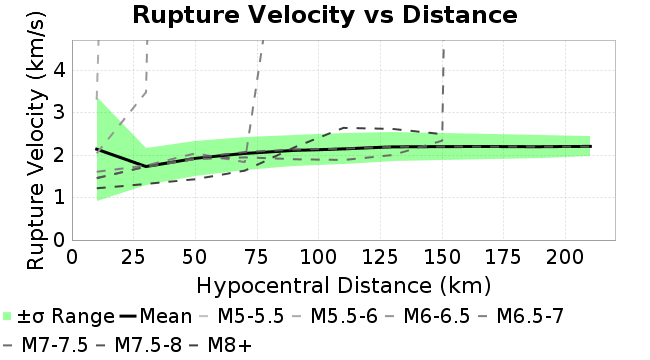 |
### Global Interevent-Time Distributions
*[(top)](#a0_0015b0_0085)*

| **M≥6** | **M≥6.5** | **M≥7** | **M≥7.5** |
|-----|-----|-----|-----|
|  | 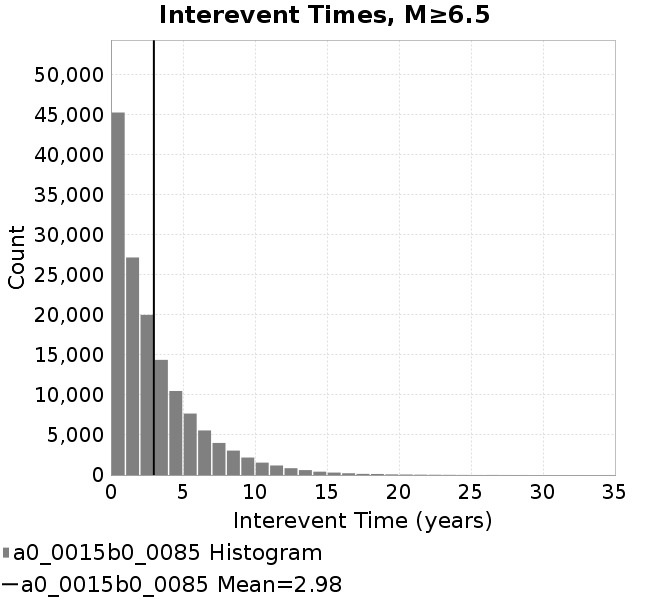 | 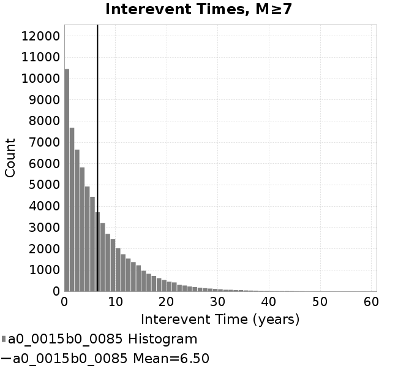 |  |
### Normalized Fault Interevent-Time Distributions
*[(top)](#a0_0015b0_0085)*

|  | **M≥6** | **M≥6.5** | **M≥7** | **M≥7.5** |
|-----|-----|-----|-----|-----|
| **Elements** |  | 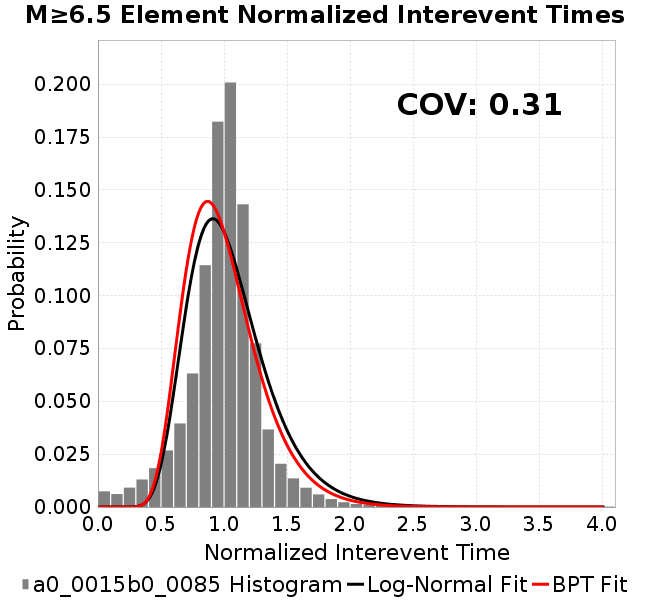 | 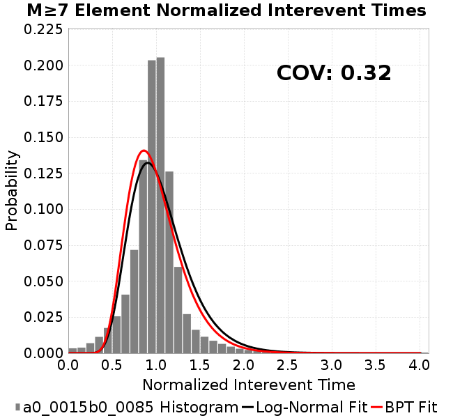 |  |
| **Subsections** |  |  | 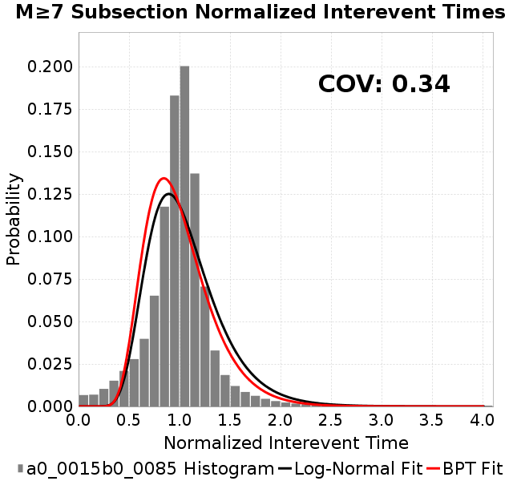 | 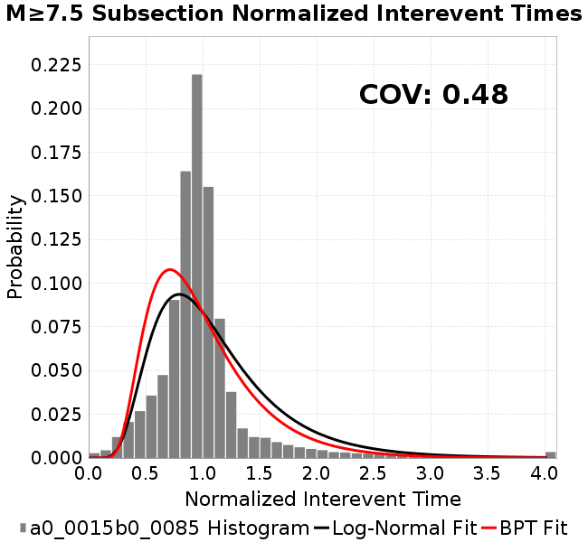 |
| **Sections** |  | 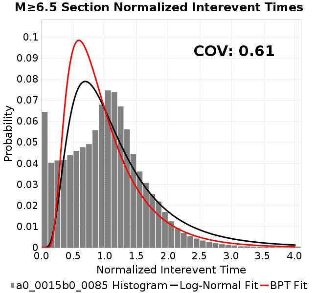 | 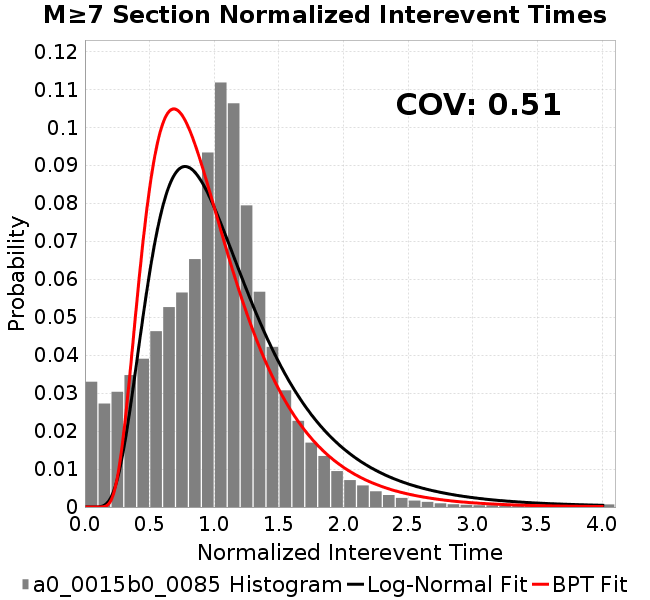 | 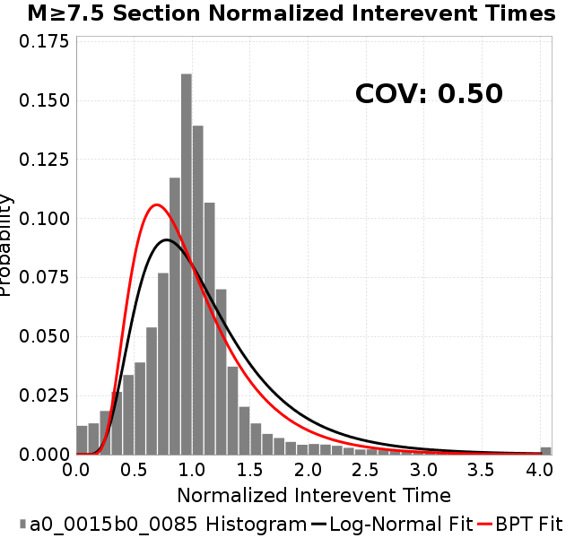 |
### Stationarity Plot
*[(top)](#a0_0015b0_0085)*

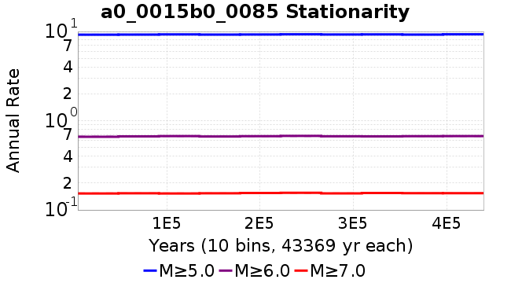
### Element/Subsection Interevent Time Comparisons

#### Element Interevent Time Comparisons
*[(top)](#a0_0015b0_0085)*

| Min Mag | Scatter | 2-D Hist |
|-----|-----|-----|
| **M≥6.0** | 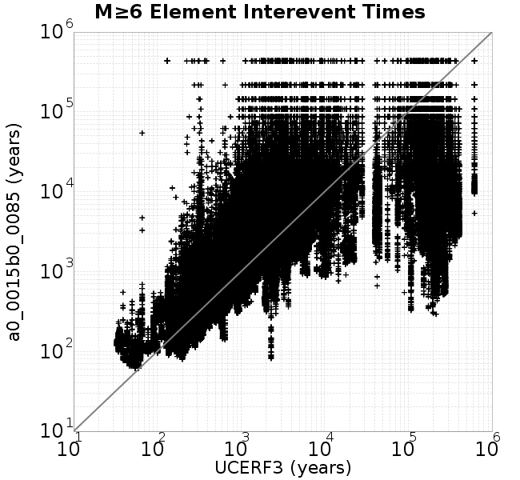 |  |
| **M≥6.5** | 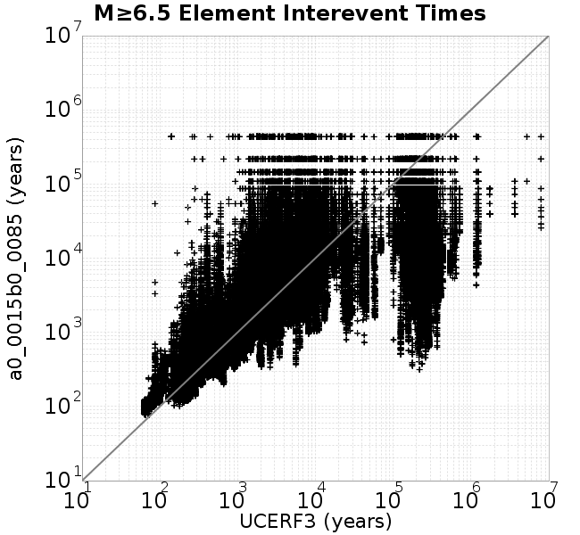 | 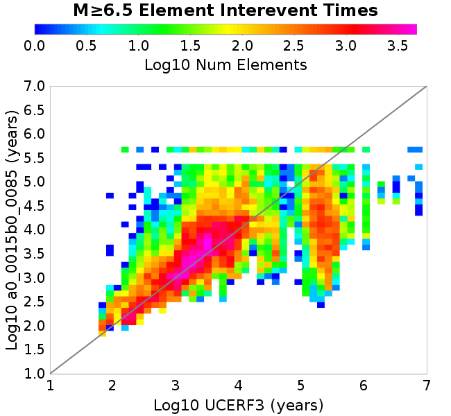 |
| **M≥7.0** |  |  |
| **M≥7.5** |  | 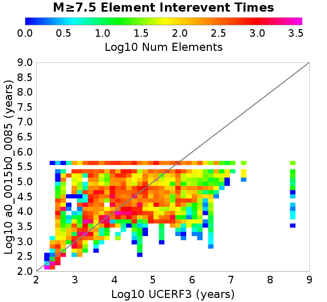 |

#### Subsection Interevent Time Comparisons
*[(top)](#a0_0015b0_0085)*

*Subsections participate in a rupture if at least 20.0 % of its area ruptures*

| Min Mag | Scatter | 2-D Hist |
|-----|-----|-----|
| **M≥6.0** |  |  |
| **M≥6.5** | 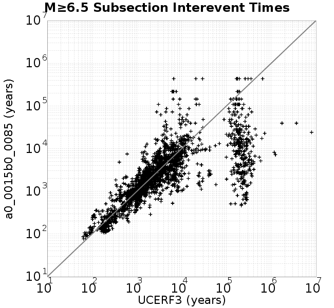 | 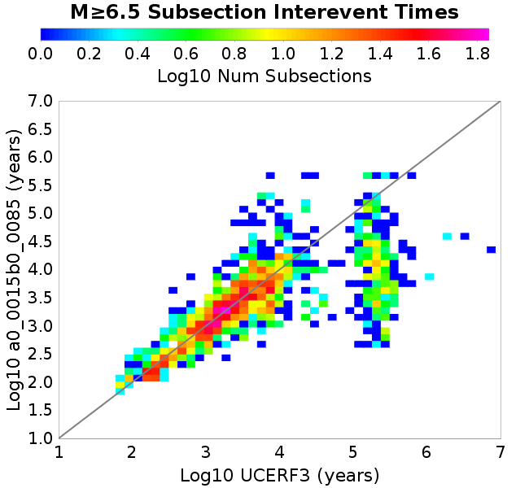 |
| **M≥7.0** | 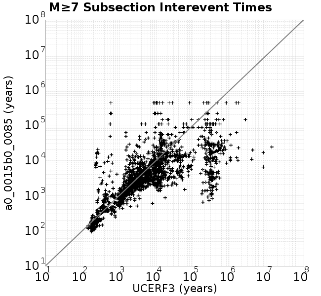 |  |
| **M≥7.5** |  | 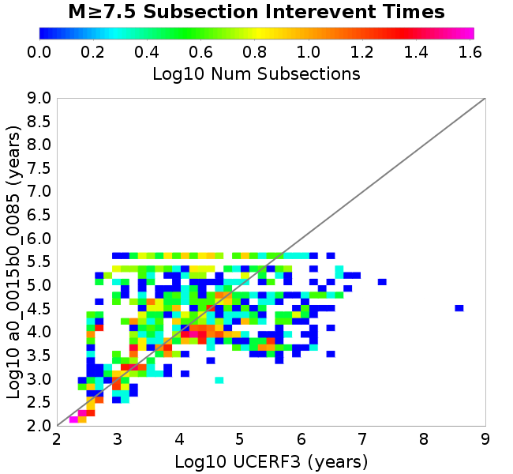 |

### Paleo Open Interval Plots
*[(top)](#a0_0015b0_0085)*

#### Paleo Open Interval Plots, Biasi and Sharer 2019
*[(top)](#a0_0015b0_0085)*

These plots use the 5 paleoseismic sites identified in Biasi & Scharer (2019) on the Hayward, N. SAF, S. SAF, and SJC faults. By default, a rupture is counted at a paleo site if the nearest element (at the surface) slips any amount. We also alternatively apply a probability of detection model. Those results are marked as 'Prob. Filtered'.

**Paleoseismic sites table:**

| **Site Name** | Data MRI (yr) | Data Annual Rate | Catalog MRI (yr) | Catalog Annual Rate | Catalog Occurences | Prob Filtered Catalog MRI (yr) | Prob Filtered Catalog Annual Rate | Prob Filtered Catalog Occurences |
|-----|-----|-----|-----|-----|-----|-----|-----|-----|
| **HOG** | 191.00 | 0.005235602 | 361.03 | 0.0027698353 | 1202 | 365.35 | 0.0027370653 | 1187.78 |
| **FRA** | 119.00 | 0.008403362 | 117.65 | 0.00849958 | 3686 | 123.25 | 0.008113282 | 3518.52 |
| **COA** | 181.00 | 0.005524862 | 177.79 | 0.0056244675 | 2439 | 190.00 | 0.0052631907 | 2282.21 |
| **SCZ** | 106.00 | 0.009433962 | 121.28 | 0.008245516 | 3576 | 140.13 | 0.0071360795 | 3094.87 |
| **TYS** | 329.00 | 0.0030395137 | 343.87 | 0.002908034 | 1262 | 381.93 | 0.0026182556 | 1136 |
| **TOTAL** | 31.61 | 0.0316373 | 35.65 | 0.028051805 | 12165 | 38.65 | 0.025876008 | 11221.45 |

**Paleoseismic Plots:**

| 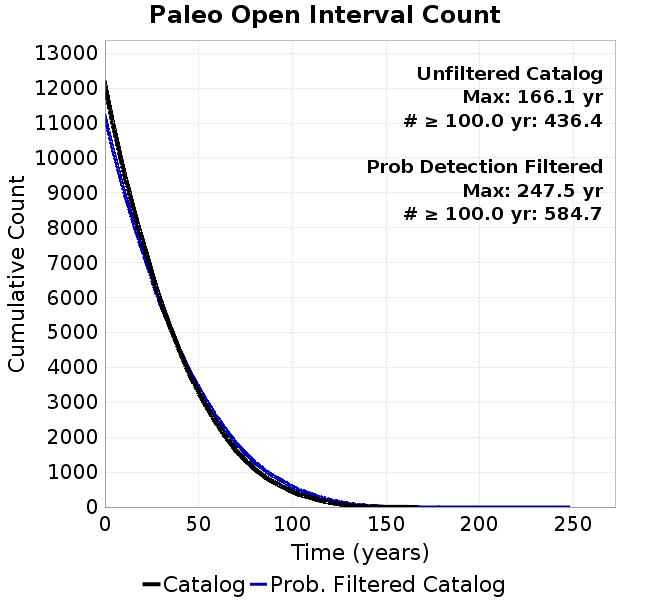 |  |
|-----|-----|

**Open interval probabilities table:**

| **Open Interval (yr)** | Catalog Probability | Catalog Poisson Probability | Prob. Filtered Catalog Probability | Prob. Filtered Catalog Poisson Probability | Data Poisson Probability |
|-----|-----|-----|-----|-----|-----|
| **10.00** | 0.9727108 | 0.7553923 | 0.97660464 | 0.77200824 | 0.72878754 |
| **20.00** | 0.90483564 | 0.57061756 | 0.9173384 | 0.5959967 | 0.53113127 |
| **30.00** | 0.80295175 | 0.4310401 | 0.8269406 | 0.46011436 | 0.3870819 |
| **40.00** | 0.6885584 | 0.32560438 | 0.7238045 | 0.35521206 | 0.28210047 |
| **50.00** | 0.56828946 | 0.24595904 | 0.613509 | 0.27422664 | 0.2055913 |
| **60.00** | 0.45303646 | 0.18579558 | 0.50377434 | 0.21170522 | 0.14983238 |
| **70.00** | 0.3399352 | 0.14034854 | 0.3948487 | 0.16343817 | 0.10919597 |
| **80.00** | 0.24778003 | 0.10601821 | 0.3004899 | 0.12617561 | 0.079580665 |
| **90.00** | 0.17523062 | 0.08008534 | 0.22350597 | 0.09740861 | 0.057997398 |
| **100.00** | 0.11585399 | 0.06049585 | 0.15808316 | 0.075200245 | 0.04226778 |
| **110.00** | 0.073833674 | 0.0456981 | 0.10651246 | 0.058055207 | 0.030804234 |
| **120.00** | 0.038158078 | 0.034519993 | 0.06230424 | 0.044819098 | 0.022449743 |
| **130.00** | 0.016277129 | 0.026076138 | 0.03231861 | 0.034600712 | 0.016361093 |
| **140.00** | 0.006276781 | 0.019697713 | 0.01434218 | 0.026712036 | 0.011923761 |
| **150.00** | 0.0018441776 | 0.014879501 | 0.0052574445 | 0.02062191 | 0.008689889 |
| **160.00** | 6.2398333E-4 | 0.011239861 | 0.0019600636 | 0.015920285 | 0.0063330824 |
| **170.00** | 0.0 | 0.008490505 | 6.4295187E-4 | 0.01229059 | 0.0046154717 |
| **180.00** | 0.0 | 0.006413662 | 3.5937596E-4 | 0.009488437 | 0.0033636983 |
| **190.00** | 0.0 | 0.004844831 | 1.889004E-4 | 0.0073251515 | 0.0024514215 |
| **200.00** | 0.0 | 0.0036597478 | 1.2179205E-4 | 0.0056550773 | 0.0017865654 |
| **210.00** | 0.0 | 0.0027645454 | 6.5923035E-5 | 0.004365766 | 0.0013020267 |
| **220.00** | 0.0 | 0.0020883163 | 4.869648E-5 | 0.0033704073 | 9.489008E-4 |
| **230.00** | 0.0 | 0.001577498 | 1.97555E-5 | 0.002601982 | 6.915471E-4 |
| **240.00** | 0.0 | 0.0011916299 | 1.3449286E-5 | 0.0020087515 | 5.039909E-4 |
| **250.00** | 0.0 | 9.0014806E-4 | 0.0 | 0.0015507728 | 3.673023E-4 |

#### Paleo Open Interval Plots, UCERF3
*[(top)](#a0_0015b0_0085)*

These plots use the full set of UCERF3 paleoseismic sites. By default, a rupture is counted at a paleo site if the nearest element (at the surface) slips any amount. We also alternativeslyapply a probability of detection model. Those results are marked as 'Prob. Filtered'.

**Paleoseismic sites table:**

| **Site Name** | Data MRI (yr) | Data Annual Rate | Catalog MRI (yr) | Catalog Annual Rate | Catalog Occurences | Prob Filtered Catalog MRI (yr) | Prob Filtered Catalog Annual Rate | Prob Filtered Catalog Occurences |
|-----|-----|-----|-----|-----|-----|-----|-----|-----|
| **SSanAndreasBurroFlats** | 205.44 | 0.0048677 | 210.68 | 0.0047464967 | 2058 | 238.96 | 0.004184854 | 1814.21 |
| **SSanAndreasIndio** | 277.37 | 0.0036053 | 173.87 | 0.0057513528 | 2494 | 184.80 | 0.0054113674 | 2346.49 |
| **SSAFMCreek1000Palms** | 261.33 | 0.0038266 | 1632.73 | 6.124726E-4 | 265 | 2366.99 | 4.2247758E-4 | 182.59 |
| **NSanAndreasFortRoss** | 306.28 | 0.003265 | 188.12 | 0.00531573 | 2305 | 190.67 | 0.005244601 | 2274.16 |
| **NSanAndreasNorthCoast** | 263.87 | 0.0037898 | 179.80 | 0.0055616708 | 2412 | 184.43 | 0.0054221586 | 2351.47 |
| **CalaverasfaultNorth** | 618.05 | 0.001618 | 167.66 | 0.005964374 | 2586 | 239.32 | 0.004178475 | 1811.57 |
| **ElsinoreTemecula** | 1019.16 | 9.812E-4 | 684.61 | 0.0014606926 | 633 | 711.76 | 0.0014049676 | 608.84 |
| **ElsinoreWhittier** | 3196.93 | 3.128E-4 | 1555.50 | 6.4288E-4 | 279 | 1641.68 | 6.0913386E-4 | 264.38 |
| **SSAFCarrizoBidart** | 114.71 | 0.0087179 | 122.37 | 0.008171693 | 3544 | 125.81 | 0.007948608 | 3447.12 |
| **SanJacintoHogLake** | 311.78 | 0.0032074 | 361.03 | 0.0027698353 | 1202 | 365.23 | 0.0027380353 | 1188.19 |
| **PuenteHills** | 3506.31 | 2.852E-4 | 5109.52 | 1.9571312E-4 | 85 | 5631.57 | 1.7757053E-4 | 77.09 |
| **SanGregorioNorth** | 1019.06 | 9.813E-4 | 396.13 | 0.002524421 | 1094 | 409.66 | 0.0024410475 | 1057.87 |
| **SanJacintoSuperstition** | 508.26 | 0.0019675 | 1219.18 | 8.20226E-4 | 356 | 1298.85 | 7.6991465E-4 | 334.04 |
| **SSanAndreasWrightwood** | 106.04 | 0.0094304 | 152.82 | 0.006543639 | 2838 | 154.64 | 0.006466583 | 2804.58 |
| **SSanAndreasPitmanCanyon** | 173.48 | 0.0057643 | 141.08 | 0.007088056 | 3073 | 158.03 | 0.0063279932 | 2743.48 |
| **SSanAndreasPlungeCreek** | 205.36 | 0.0048695 | 363.79 | 0.0027488335 | 1192 | 447.38 | 0.0022352492 | 969.35 |
| **FrazierMountianSSAF** | 148.57 | 0.0067307 | 117.65 | 0.00849958 | 3686 | 123.33 | 0.008108364 | 3516.33 |
| **NSanAndreasSantaCruzSeg** | 109.84 | 0.0091041 | 121.28 | 0.008245516 | 3576 | 140.07 | 0.0071391407 | 3096.22 |
| **RodgersCreek** | 325.31 | 0.003074 | 168.81 | 0.0059238016 | 2568 | 230.40 | 0.00434021 | 1881.44 |
| **GreenValleyMasonRoad** | 293.31 | 0.0034094 | 1688.37 | 5.9228897E-4 | 257 | 2302.89 | 4.342372E-4 | 188.13 |
| **HaywardfaultNorth** | 318.34 | 0.0031413 | 367.64 | 0.0027200722 | 1179 | 379.20 | 0.0026371384 | 1143.03 |
| **HaywardfaultSouth** | 167.57 | 0.0059677 | 343.87 | 0.002908034 | 1262 | 381.93 | 0.0026182497 | 1136.02 |
| **Compton** | 2658.16 | 3.762E-4 | 5800.00 | 1.7241393E-4 | 75 | 6488.75 | 1.5411292E-4 | 67.1 |
| **SSanAndreasCoachella** | 178.45 | 0.0056037 | 177.79 | 0.0056244675 | 2439 | 189.81 | 0.005268416 | 2284.5 |
| **ElsinoreGlenIvy** | 179.12 | 0.0055828 | 579.42 | 0.0017258646 | 748 | 627.34 | 0.0015940377 | 690.9 |
| **GarlockCentralallevents** | 1434.93 | 6.969E-4 | 644.98 | 0.0015504281 | 672 | 656.01 | 0.0015243614 | 660.66 |
| **NSanAndreasAlderCreek** | 869.64 | 0.0011499 | 188.37 | 0.0053088088 | 2302 | 191.14 | 0.005231842 | 2268.62 |
| **SSanAndreasPallettCreek** | 149.30 | 0.006698 | 152.82 | 0.006543639 | 2838 | 154.57 | 0.0064695855 | 2805.86 |
| **GarlockWesternallevents** | 1230.16 | 8.129E-4 | 823.42 | 0.0012144431 | 527 | 846.26 | 0.001181664 | 512.74 |
| **ElsinoreFaultJulian** | 3250.98 | 3.076E-4 | 1262.78 | 7.919063E-4 | 344 | 1291.96 | 7.740179E-4 | 336.17 |
| **TOTAL** | 9.08 | 0.1101451 | 14.37 | 0.06959047 | 30178 | 15.95 | 0.06268108 | 27181.81 |

**Paleoseismic Plots:**

| 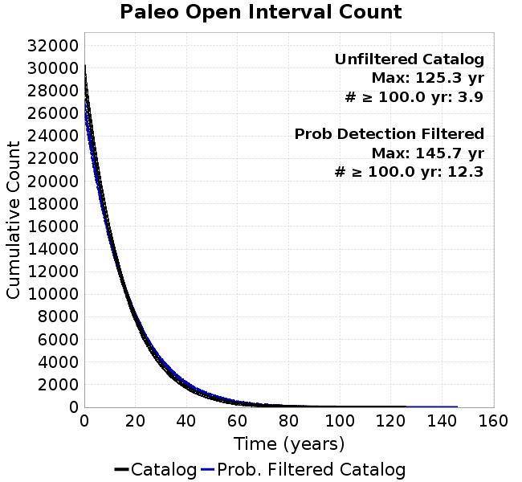 |  |
|-----|-----|

**Open interval probabilities table:**

| **Open Interval (yr)** | Catalog Probability | Catalog Poisson Probability | Prob. Filtered Catalog Probability | Prob. Filtered Catalog Poisson Probability | Data Poisson Probability |
|-----|-----|-----|-----|-----|-----|
| **10.00** | 0.856456 | 0.49862313 | 0.8780422 | 0.53429306 | 0.33238843 |
| **20.00** | 0.6013189 | 0.24862503 | 0.6495762 | 0.28546906 | 0.110482074 |
| **30.00** | 0.37178743 | 0.12397019 | 0.42915744 | 0.15252413 | 0.036722966 |
| **40.00** | 0.21329832 | 0.0618144 | 0.2635411 | 0.08149258 | 0.012206289 |
| **50.00** | 0.11429235 | 0.03082209 | 0.15248047 | 0.043540917 | 0.004057229 |
| **60.00** | 0.052909836 | 0.015368607 | 0.07863984 | 0.02326361 | 0.001348576 |
| **70.00** | 0.026054353 | 0.007663143 | 0.040728446 | 0.012429585 | 4.4825108E-4 |
| **80.00** | 0.01090018 | 0.0038210202 | 0.018754773 | 0.0066410406 | 1.4899348E-4 |
| **90.00** | 0.0037761093 | 0.0019052491 | 0.008020752 | 0.003548262 | 4.952371E-5 |
| **100.00** | 0.0010316205 | 9.5000124E-4 | 0.0031514596 | 0.0018958116 | 1.6461108E-5 |
| **110.00** | 8.0067693E-4 | 4.7369258E-4 | 0.0011572131 | 0.001012919 | 5.4714824E-6 |
| **120.00** | 6.2282634E-4 | 2.3619407E-4 | 8.5495884E-4 | 5.4119556E-4 | 1.8186574E-6 |
| **130.00** | 0.0 | 1.1777183E-4 | 2.689031E-4 | 2.89157E-4 | 6.045007E-7 |
| **140.00** | 0.0 | 5.8723756E-5 | 1.4900103E-4 | 1.5449458E-4 | 2.0092905E-7 |
| **150.00** | 0.0 | 2.9281024E-5 | 0.0 | 8.254538E-5 | 6.678649E-8 |

### Moment Release Variability Plots
*[(top)](#a0_0015b0_0085)*

We first create a tapered moment release time series for the entire catalog. Each event's moment is distributed across a 25 year Hanning (cosine) taper. Here is a plot of a random 2,000 year section of this time series:

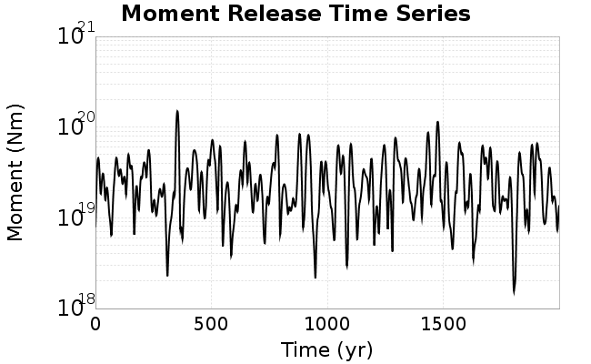

We then compute Welch's power spectral density estimate on the entire time series. Results are plotted below, with a Poisson randomization of the catalog also plotted in a gray line, and the 95% confidence bounds from 200 realizations as a light gray shaded area. Significant deviations outside the Poisson confidence intervals indicate synchronous behaviour.


## Input File
*[(top)](#a0_0015b0_0085)*

```
  A_1 = 0.0015
  fA = .1
  B_1 = 0.0085
  muSlipAmp_1 = .0
  muSlipInvDist_1 = 1.0
  cohesion = 0.0
  Dc_1 = 1.0000000000000000818e-05
  mu0_1 = 0.6
  ddotStar_1 = 9.9999999999999995475e-07
  ddotAB_1 = 9.9999999999999995475e-07
  alpha_1 = 0.0
  theta0_1 = 200000000
  tau0_1 = 55.1
  sigma0_1 = 100
  sigmaFracPin = .5
  lowSigmaAction = 1
  maxThetaPin = 1.0e13
  ddotEQ_1 = 1
  ddotEQFname = 
  stressOvershootFactor = 0.10000000000000000555
  lameLambda = 30000
  lameMu = 30000
  slowSlip_1 = 0
  nEq = 100000000000
  KZeroFrac = 0
  muPin = 1.0
  tStart = 0
  maxT = 3.16e13
  maxWallTime = 169200
  maxTrans = 1.0000000000000000159e100
  faultFname = UCERF3FM.15km.1km.tri.flt
  outFnameInfix = a0_0015b0_0085
  writeTau = 2
  writeSigma = 2
  writeSlip = 0
  writeSlipSpeed = 0
  writeState = 0
  writeTheta = 2
  writePED = 1
  writeTransitions = 1
  minDtWrite = 0
  minDtWriteCoseismic = 0
  minDtWriteInterseismic = 0
  minMagWrite = 7.7
  writeStiffness = 0
  stressRateSpecification = 1
  dMu3 = 0.01000000000000000
  initTauFname = 
  initSigmaFname = 
  initThetaFname = 
  initSlipSpeedFname = 
  AFname = 
  BFname =  
  DcFname = 
  mu0Fname = 
  ddotStarFname = 
  ddotABFname = 
  alphaFname = 
  KTauFname = /u/sciteam/gilchris/scratch/stiffness_25a589d/Ktau.25a589d.out
  KSigmaFname = /u/sciteam/gilchris/scratch/stiffness_25a589d/Ksigma.25a589d.out
  tFailFname = 
  tauFailFname = 
  tauDotFname = 
  sigmaDotFname =
  KZeroFname = UCERF3FM.15km.1km.tri.KZero
  pinnedFname =  UCERF3FM.15km.1km.tri.pin
  neighborFname = UCERF3FM.15km.1km.tri.neighbors
  stressRateFname =  
  slowSlipFname = 
  writePatchFname = 
  DEBUG = 0
  ZBrentUpperBracket = 0
  receiverElementAreaFrac = 0.8
  receiverElementIntTol = 1.0e-4
  receiverElementSubdivisionMax = 4
  tgfDist1 = 3
  tgfDist1 = 10
  lowSigmaAction = 1
  highSigmaAction = 0
```
