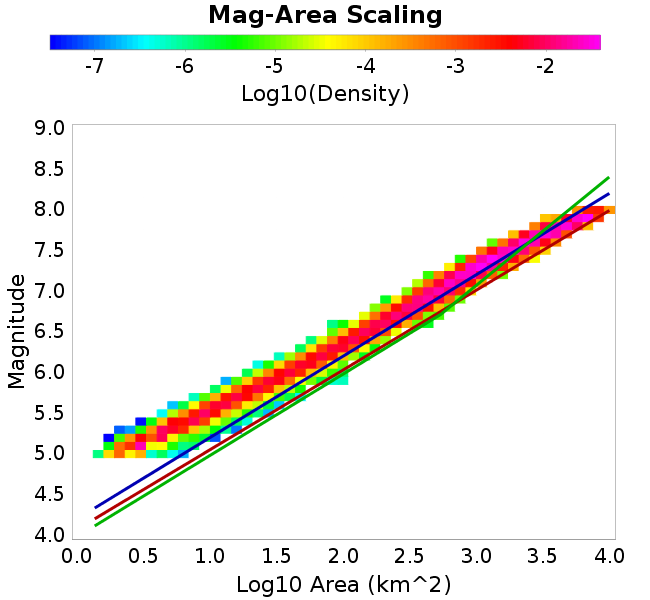
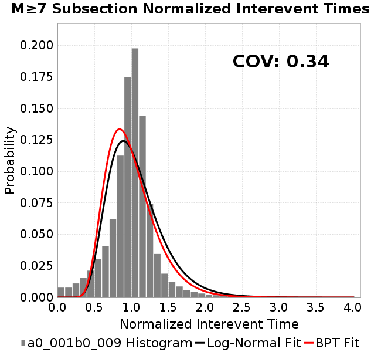
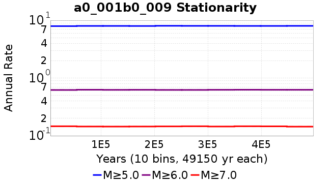

# a0_001b0_009
## Metadata
| **Catalog** | a0_001b0_009 |
|-----|-----|
| **Author** | Jaqcui Gilchrist, 2018/09/27 |
| **Description** | change b-a: b=0.009 |
| **Fault/Def Model** | Fault Model 3.1, Geologic |
| **Slip Velocity** | 1.0 m/s |
| **Average Element Area** | 1.35 km^2 |
| **Length** | 8,506,880 events in 496,501 years |
| **Frictional Params** | a=0.001, b=0.009, (b-a)=0.008, ddotEQ=1 |

* [Metadata](#metadata)
* [Plots](#plots)
  * [Magnitude-Frequency Plot](#magnitude-frequency-plot)
  * [Magnitude-Area Plots](#magnitude-area-plots)
  * [Slip-Area Plots](#slip-area-plots)
  * [Rupture Velocity Plots](#rupture-velocity-plots)
  * [Global Interevent-Time Distributions](#global-interevent-time-distributions)
  * [Normalized Fault Interevent-Time Distributions](#normalized-fault-interevent-time-distributions)
  * [Stationarity Plot](#stationarity-plot)
  * [Element/Subsection Interevent Time Comparisons](#elementsubsection-interevent-time-comparisons)
    * [Element Interevent Time Comparisons](#element-interevent-time-comparisons)
    * [Subsection Interevent Time Comparisons](#subsection-interevent-time-comparisons)
  * [Paleo Open Interval Plots](#paleo-open-interval-plots)
    * [Paleo Open Interval Plots, Biasi and Sharer 2019](#paleo-open-interval-plots-biasi-and-sharer-2019)
    * [Paleo Open Interval Plots, UCERF3](#paleo-open-interval-plots-ucerf3)
  * [Moment Release Variability Plots](#moment-release-variability-plots)
* [Input File](#input-file)

## Plots
### Magnitude-Frequency Plot
*[(top)](#a0_001b0_009)*


### Magnitude-Area Plots
*[(top)](#a0_001b0_009)*

| Scatter | 2-D Hist |
|-----|-----|
|  |  |
### Slip-Area Plots
*[(top)](#a0_001b0_009)*

| Scatter | 2-D Hist |
|-----|-----|
|  |  |
### Rupture Velocity Plots
*[(top)](#a0_001b0_009)*

| **Scatter** |  |
|-----|-----|
| **Distance/Velocity** |  |
### Global Interevent-Time Distributions
*[(top)](#a0_001b0_009)*

| **M≥6** | **M≥6.5** | **M≥7** | **M≥7.5** |
|-----|-----|-----|-----|
|  |  |  |  |
### Normalized Fault Interevent-Time Distributions
*[(top)](#a0_001b0_009)*

|  | **M≥6** | **M≥6.5** | **M≥7** | **M≥7.5** |
|-----|-----|-----|-----|-----|
| **Elements** |  |  |  |  |
| **Subsections** |  |  |  |  |
| **Sections** |  |  |  |  |
### Stationarity Plot
*[(top)](#a0_001b0_009)*


### Element/Subsection Interevent Time Comparisons

#### Element Interevent Time Comparisons
*[(top)](#a0_001b0_009)*

| Min Mag | Scatter | 2-D Hist |
|-----|-----|-----|
| **M≥6.0** |  |  |
| **M≥6.5** |  |  |
| **M≥7.0** |  |  |
| **M≥7.5** |  |  |

#### Subsection Interevent Time Comparisons
*[(top)](#a0_001b0_009)*

*Subsections participate in a rupture if at least 20.0 % of its area ruptures*

| Min Mag | Scatter | 2-D Hist |
|-----|-----|-----|
| **M≥6.0** |  |  |
| **M≥6.5** |  |  |
| **M≥7.0** |  |  |
| **M≥7.5** |  |  |

### Paleo Open Interval Plots
*[(top)](#a0_001b0_009)*

#### Paleo Open Interval Plots, Biasi and Sharer 2019
*[(top)](#a0_001b0_009)*

These plots use the 5 paleoseismic sites identified in Biasi & Scharer (2019) on the Hayward, N. SAF, S. SAF, and SJC faults. By default, a rupture is counted at a paleo site if the nearest element (at the surface) slips any amount. We also alternatively apply a probability of detection model. Those results are marked as 'Prob. Filtered'.

**Paleoseismic sites table:**

| **Site Name** | Data MRI (yr) | Data Annual Rate | Catalog MRI (yr) | Catalog Annual Rate | Catalog Occurences | Prob Filtered Catalog MRI (yr) | Prob Filtered Catalog Annual Rate | Prob Filtered Catalog Occurences |
|-----|-----|-----|-----|-----|-----|-----|-----|-----|
| **HOG** | 191.00 | 0.005235602 | 405.38 | 0.0024668335 | 1213 | 409.52 | 0.002441904 | 1200.71 |
| **FRA** | 119.00 | 0.008403362 | 134.40 | 0.007440657 | 3657 | 139.28 | 0.0071800295 | 3528.9 |
| **COA** | 181.00 | 0.005524862 | 202.70 | 0.0049334224 | 2425 | 213.88 | 0.0046755886 | 2298.29 |
| **SCZ** | 106.00 | 0.009433962 | 137.37 | 0.0072795325 | 3578 | 153.91 | 0.0064973664 | 3193.56 |
| **TYS** | 329.00 | 0.0030395137 | 392.94 | 0.0025449418 | 1251 | 425.90 | 0.00234796 | 1154.16 |
| **TOTAL** | 31.61 | 0.0316373 | 40.55 | 0.024658887 | 12120 | 43.20 | 0.023145784 | 11376.31 |

**Paleoseismic Plots:**

|  |  |
|-----|-----|

**Open interval probabilities table:**

| **Open Interval (yr)** | Catalog Probability | Catalog Poisson Probability | Prob. Filtered Catalog Probability | Prob. Filtered Catalog Poisson Probability | Data Poisson Probability |
|-----|-----|-----|-----|-----|-----|
| **10.00** | 0.9789892 | 0.7814619 | 0.9814267 | 0.79337615 | 0.72878754 |
| **20.00** | 0.9228317 | 0.6106827 | 0.9312804 | 0.62944573 | 0.53113127 |
| **30.00** | 0.8437139 | 0.4772253 | 0.85958844 | 0.4993872 | 0.3870819 |
| **40.00** | 0.7457243 | 0.3729334 | 0.76972604 | 0.3962019 | 0.28210047 |
| **50.00** | 0.6367385 | 0.29143324 | 0.66829234 | 0.31433713 | 0.2055913 |
| **60.00** | 0.5253528 | 0.22774398 | 0.5626904 | 0.24938759 | 0.14983238 |
| **70.00** | 0.4243094 | 0.17797324 | 0.4649714 | 0.19785817 | 0.10919597 |
| **80.00** | 0.33612797 | 0.13907932 | 0.37825602 | 0.15697594 | 0.079580665 |
| **90.00** | 0.25188404 | 0.10868519 | 0.29332617 | 0.12454097 | 0.057997398 |
| **100.00** | 0.17993876 | 0.08493333 | 0.21832499 | 0.098807834 | 0.04226778 |
| **110.00** | 0.12273782 | 0.06637216 | 0.15627965 | 0.07839178 | 0.030804234 |
| **120.00** | 0.08413282 | 0.05186732 | 0.111522146 | 0.06219417 | 0.022449743 |
| **130.00** | 0.052387096 | 0.040532336 | 0.073769145 | 0.04934337 | 0.016361093 |
| **140.00** | 0.02625873 | 0.03167448 | 0.041966345 | 0.039147854 | 0.011923761 |
| **150.00** | 0.011247247 | 0.024752397 | 0.020431224 | 0.031058973 | 0.008689889 |
| **160.00** | 0.004677782 | 0.019343056 | 0.009400903 | 0.024641449 | 0.0063330824 |
| **170.00** | 0.0019353586 | 0.015115862 | 0.004496258 | 0.019549936 | 0.0046154717 |
| **180.00** | 0.0 | 0.01181247 | 0.0012761547 | 0.015510454 | 0.0033636983 |
| **190.00** | 0.0 | 0.009230996 | 6.4157986E-4 | 0.012305624 | 0.0024514215 |
| **200.00** | 0.0 | 0.007213671 | 4.522958E-4 | 0.009762988 | 0.0017865654 |
| **210.00** | 0.0 | 0.0056372094 | 2.0318583E-4 | 0.0077457223 | 0.0013020267 |
| **220.00** | 0.0 | 0.0044052643 | 1.1816135E-4 | 0.006145271 | 9.489008E-4 |
| **230.00** | 0.0 | 0.0034425464 | 6.157684E-5 | 0.0048755114 | 6.915471E-4 |
| **240.00** | 0.0 | 0.0026902189 | 2.4980822E-5 | 0.0038681147 | 5.039909E-4 |
| **250.00** | 0.0 | 0.0021023036 | 2.1196132E-5 | 0.00306887 | 3.673023E-4 |
| **260.00** | 0.0 | 0.0016428703 | 1.2204581E-5 | 0.002434768 | 2.6768536E-4 |
| **270.00** | 0.0 | 0.0012838405 | 0.0 | 0.001931687 | 1.9508575E-4 |

#### Paleo Open Interval Plots, UCERF3
*[(top)](#a0_001b0_009)*

These plots use the full set of UCERF3 paleoseismic sites. By default, a rupture is counted at a paleo site if the nearest element (at the surface) slips any amount. We also alternativeslyapply a probability of detection model. Those results are marked as 'Prob. Filtered'.

**Paleoseismic sites table:**

| **Site Name** | Data MRI (yr) | Data Annual Rate | Catalog MRI (yr) | Catalog Annual Rate | Catalog Occurences | Prob Filtered Catalog MRI (yr) | Prob Filtered Catalog Annual Rate | Prob Filtered Catalog Occurences |
|-----|-----|-----|-----|-----|-----|-----|-----|-----|
| **SSanAndreasBurroFlats** | 205.44 | 0.0048677 | 233.74 | 0.004278325 | 2102 | 258.93 | 0.0038620974 | 1897.52 |
| **SSanAndreasIndio** | 277.37 | 0.0036053 | 198.52 | 0.0050372197 | 2476 | 207.86 | 0.004810859 | 2364.75 |
| **SSAFMCreek1000Palms** | 261.33 | 0.0038266 | 1752.43 | 5.70636E-4 | 280 | 2449.06 | 4.0831996E-4 | 200.03 |
| **NSanAndreasFortRoss** | 306.28 | 0.003265 | 216.45 | 0.004620089 | 2271 | 218.92 | 0.004567786 | 2245.29 |
| **NSanAndreasNorthCoast** | 263.87 | 0.0037898 | 204.99 | 0.0048781848 | 2397 | 209.24 | 0.0047791195 | 2348.33 |
| **CalaverasfaultNorth** | 618.05 | 0.001618 | 187.36 | 0.0053373235 | 2623 | 257.08 | 0.0038898673 | 1911.36 |
| **ElsinoreTemecula** | 1019.16 | 9.812E-4 | 792.70 | 0.0012615111 | 620 | 812.91 | 0.0012301417 | 604.57 |
| **ElsinoreWhittier** | 3196.93 | 3.128E-4 | 1733.83 | 5.7675736E-4 | 283 | 1809.52 | 5.526334E-4 | 271.16 |
| **SSAFCarrizoBidart** | 114.71 | 0.0087179 | 138.50 | 0.0072204135 | 3548 | 141.68 | 0.007057931 | 3468.16 |
| **SanJacintoHogLake** | 311.78 | 0.0032074 | 405.38 | 0.0024668335 | 1213 | 409.63 | 0.0024412507 | 1200.42 |
| **PuenteHills** | 3506.31 | 2.852E-4 | 5677.17 | 1.7614418E-4 | 86 | 6154.54 | 1.6248175E-4 | 79.24 |
| **SanGregorioNorth** | 1019.06 | 9.813E-4 | 446.44 | 0.0022399412 | 1101 | 460.95 | 0.002169452 | 1066.36 |
| **SanJacintoSuperstition** | 508.26 | 0.0019675 | 1378.03 | 7.2567357E-4 | 357 | 1451.08 | 6.8914297E-4 | 339.02 |
| **SSanAndreasWrightwood** | 106.04 | 0.0094304 | 173.67 | 0.0057579638 | 2831 | 175.57 | 0.005695603 | 2800.32 |
| **SSanAndreasPitmanCanyon** | 173.48 | 0.0057643 | 163.18 | 0.006128264 | 3013 | 177.93 | 0.005620129 | 2763.21 |
| **SSanAndreasPlungeCreek** | 205.36 | 0.0048695 | 405.52 | 0.0024659932 | 1212 | 483.86 | 0.0020667012 | 1015.49 |
| **FrazierMountianSSAF** | 148.57 | 0.0067307 | 134.40 | 0.007440657 | 3657 | 139.28 | 0.0071799573 | 3528.89 |
| **NSanAndreasSantaCruzSeg** | 109.84 | 0.0091041 | 137.37 | 0.0072795325 | 3578 | 153.94 | 0.0064959917 | 3192.79 |
| **RodgersCreek** | 325.31 | 0.003074 | 191.06 | 0.005233841 | 2572 | 249.27 | 0.0040116473 | 1971.33 |
| **GreenValleyMasonRoad** | 293.31 | 0.0034094 | 1979.95 | 5.0506403E-4 | 248 | 2540.96 | 3.935525E-4 | 193.14 |
| **HaywardfaultNorth** | 318.34 | 0.0031413 | 419.57 | 0.0023833648 | 1171 | 428.70 | 0.0023326604 | 1146.07 |
| **HaywardfaultSouth** | 167.57 | 0.0059677 | 392.94 | 0.0025449418 | 1251 | 426.53 | 0.0023445212 | 1152.48 |
| **Compton** | 2658.16 | 3.762E-4 | 6735.89 | 1.4845855E-4 | 72 | 7234.81 | 1.382206E-4 | 67 |
| **SSanAndreasCoachella** | 178.45 | 0.0056037 | 202.70 | 0.0049334224 | 2425 | 213.67 | 0.004680215 | 2300.56 |
| **ElsinoreGlenIvy** | 179.12 | 0.0055828 | 656.14 | 0.0015240741 | 748 | 699.97 | 0.0014286295 | 701.17 |
| **GarlockCentralallevents** | 1434.93 | 6.969E-4 | 734.42 | 0.0013616137 | 669 | 743.13 | 0.0013456637 | 661.14 |
| **NSanAndreasAlderCreek** | 869.64 | 0.0011499 | 216.26 | 0.00462416 | 2273 | 218.94 | 0.0045675547 | 2245.14 |
| **SSanAndreasPallettCreek** | 149.30 | 0.006698 | 173.24 | 0.005772206 | 2838 | 175.15 | 0.0057092384 | 2807.02 |
| **GarlockWesternallevents** | 1230.16 | 8.129E-4 | 951.86 | 0.0010505738 | 517 | 969.16 | 0.0010318162 | 507.73 |
| **ElsinoreFaultJulian** | 3250.98 | 3.076E-4 | 1410.00 | 7.092179E-4 | 349 | 1433.52 | 6.97582E-4 | 343.26 |
| **TOTAL** | 9.08 | 0.1101451 | 16.34 | 0.06119922 | 30080 | 17.85 | 0.05602859 | 27538.67 |

**Paleoseismic Plots:**

|  |  |
|-----|-----|

**Open interval probabilities table:**

| **Open Interval (yr)** | Catalog Probability | Catalog Poisson Probability | Prob. Filtered Catalog Probability | Prob. Filtered Catalog Poisson Probability | Data Poisson Probability |
|-----|-----|-----|-----|-----|-----|
| **10.00** | 0.8837686 | 0.54226947 | 0.8993159 | 0.57104576 | 0.33238843 |
| **20.00** | 0.6635172 | 0.29405618 | 0.7004177 | 0.3260933 | 0.110482074 |
| **30.00** | 0.4489469 | 0.1594577 | 0.49616358 | 0.1862142 | 0.036722966 |
| **40.00** | 0.27636227 | 0.08646905 | 0.32381773 | 0.10633683 | 0.012206289 |
| **50.00** | 0.15324786 | 0.046889525 | 0.1944323 | 0.0607232 | 0.004057229 |
| **60.00** | 0.081492096 | 0.025426758 | 0.11135438 | 0.03467573 | 0.001348576 |
| **70.00** | 0.03969687 | 0.013788154 | 0.05953503 | 0.019801429 | 4.4825108E-4 |
| **80.00** | 0.016695976 | 0.0074768956 | 0.02827676 | 0.011307522 | 1.4899348E-4 |
| **90.00** | 0.0074259895 | 0.0040544923 | 0.013973823 | 0.0064571127 | 4.952371E-5 |
| **100.00** | 0.0033221887 | 0.0021986275 | 0.006378844 | 0.003687307 | 1.6461108E-5 |
| **110.00** | 7.7942305E-4 | 0.0011922485 | 0.0022568796 | 0.0021056212 | 5.4714824E-6 |
| **120.00** | 0.0 | 6.4652E-4 | 8.102393E-4 | 0.001202406 | 1.8186574E-6 |
| **130.00** | 0.0 | 3.5058806E-4 | 2.3352886E-4 | 6.866289E-4 | 6.045007E-7 |
| **140.00** | 0.0 | 1.901132E-4 | 7.5866454E-5 | 3.9209655E-4 | 2.0092905E-7 |
| **150.00** | 0.0 | 1.0309259E-4 | 0.0 | 2.2390508E-4 | 6.678649E-8 |

### Moment Release Variability Plots
*[(top)](#a0_001b0_009)*

We first create a tapered moment release time series for the entire catalog. Each event's moment is distributed across a 25 year Hanning (cosine) taper. Here is a plot of a random 2,000 year section of this time series:


We then compute Welch's power spectral density estimate on the entire time series. Results are plotted below, with a Poisson randomization of the catalog also plotted in a gray line, and the 95% confidence bounds from 200 realizations as a light gray shaded area. Significant deviations outside the Poisson confidence intervals indicate synchronous behaviour.


## Input File
*[(top)](#a0_001b0_009)*

```
  A_1 = 0.001
  fA = .1
  B_1 = 0.009
  muSlipAmp_1 = .0
  muSlipInvDist_1 = 1.0
  cohesion = 0.0
  Dc_1 = 1.0000000000000000818e-05
  mu0_1 = 0.6
  ddotStar_1 = 9.9999999999999995475e-07
  ddotAB_1 = 9.9999999999999995475e-07
  alpha_1 = 0.0
  theta0_1 = 200000000
  tau0_1 = 55.1
  sigma0_1 = 100
  sigmaFracPin = .5
  lowSigmaAction = 1
  maxThetaPin = 1.0e13
  ddotEQ_1 = 1
  ddotEQFname = 
  stressOvershootFactor = 0.10000000000000000555
  lameLambda = 30000
  lameMu = 30000
  slowSlip_1 = 0
  nEq = 100000000000
  KZeroFrac = 0
  muPin = 1.0
  tStart = 0
  maxT = 3.16e13
  maxWallTime = 169200
  maxTrans = 1.0000000000000000159e100
  faultFname = UCERF3FM.15km.1km.tri.flt
  outFnameInfix = a0_001b0_009
  writeTau = 2
  writeSigma = 2
  writeSlip = 0
  writeSlipSpeed = 0
  writeState = 0
  writeTheta = 2
  writePED = 1
  writeTransitions = 1
  minDtWrite = 0
  minDtWriteCoseismic = 0
  minDtWriteInterseismic = 0
  minMagWrite = 7.7
  writeStiffness = 0
  stressRateSpecification = 1
  dMu3 = 0.01000000000000000
  initTauFname = 
  initSigmaFname = 
  initThetaFname = 
  initSlipSpeedFname = 
  AFname = 
  BFname =  
  DcFname = 
  mu0Fname = 
  ddotStarFname = 
  ddotABFname = 
  alphaFname = 
  KTauFname = /u/sciteam/gilchris/scratch/stiffness_25a589d/Ktau.25a589d.out
  KSigmaFname = /u/sciteam/gilchris/scratch/stiffness_25a589d/Ksigma.25a589d.out
  tFailFname = 
  tauFailFname = 
  tauDotFname = 
  sigmaDotFname =
  KZeroFname = UCERF3FM.15km.1km.tri.KZero
  pinnedFname =  UCERF3FM.15km.1km.tri.pin
  neighborFname = UCERF3FM.15km.1km.tri.neighbors
  stressRateFname =  
  slowSlipFname = 
  writePatchFname = 
  DEBUG = 0
  ZBrentUpperBracket = 0
  receiverElementAreaFrac = 0.8
  receiverElementIntTol = 1.0e-4
  receiverElementSubdivisionMax = 4
  tgfDist1 = 3
  tgfDist1 = 10
  lowSigmaAction = 1
  highSigmaAction = 0
```
