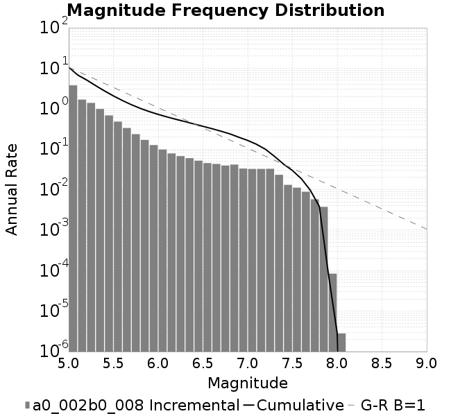
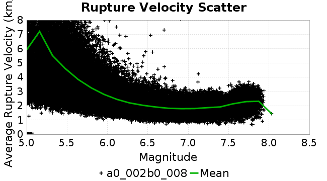
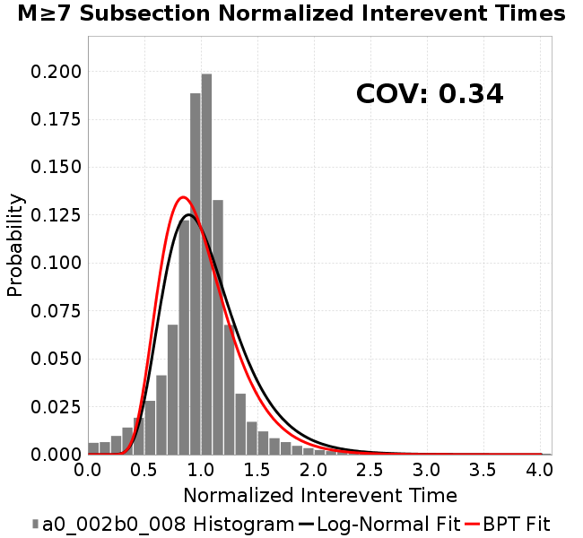
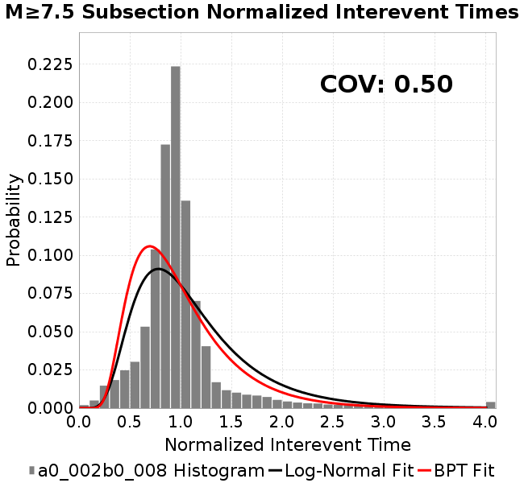
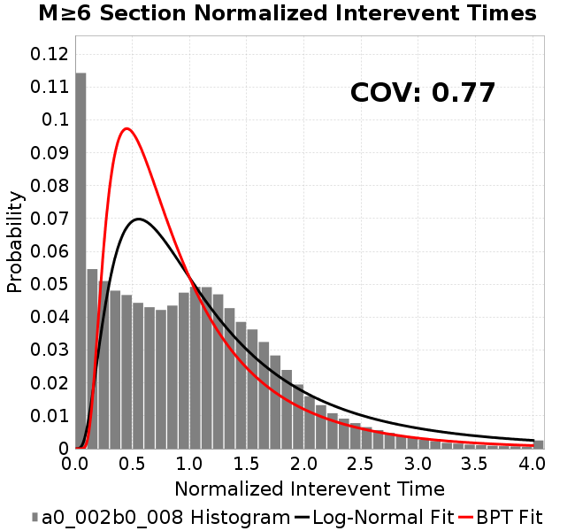
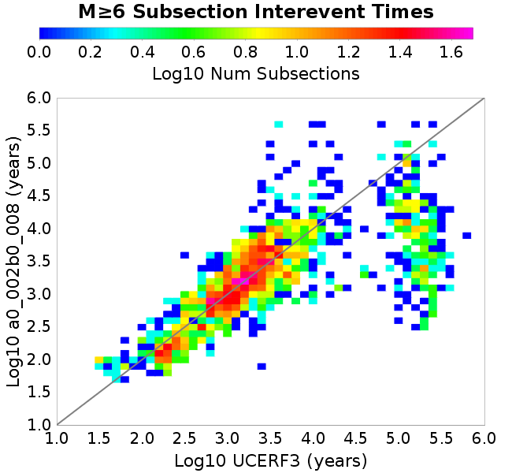
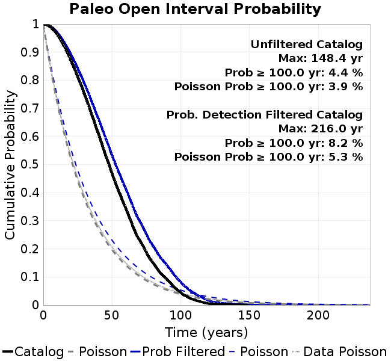

# a0_002b0_008
## Metadata
| **Catalog** | a0_002b0_008 |
|-----|-----|
| **Author** | Jaqcui Gilchrist, 2018/09/27 |
| **Description** | change b-a: a=0.002 |
| **Fault/Def Model** | Fault Model 3.1, Geologic |
| **Slip Velocity** | 1.0 m/s |
| **Average Element Area** | 1.35 km^2 |
| **Length** | 9,296,929 events in 362,155 years |
| **Frictional Params** | a=0.002, b=0.008, (b-a)=0.006, ddotEQ=1 |

* [Metadata](#metadata)
* [Plots](#plots)
  * [Magnitude-Frequency Plot](#magnitude-frequency-plot)
  * [Magnitude-Area Plots](#magnitude-area-plots)
  * [Slip-Area Plots](#slip-area-plots)
  * [Rupture Velocity Plots](#rupture-velocity-plots)
  * [Global Interevent-Time Distributions](#global-interevent-time-distributions)
  * [Normalized Fault Interevent-Time Distributions](#normalized-fault-interevent-time-distributions)
  * [Stationarity Plot](#stationarity-plot)
  * [Element/Subsection Interevent Time Comparisons](#elementsubsection-interevent-time-comparisons)
    * [Element Interevent Time Comparisons](#element-interevent-time-comparisons)
    * [Subsection Interevent Time Comparisons](#subsection-interevent-time-comparisons)
  * [Paleo Open Interval Plots](#paleo-open-interval-plots)
    * [Paleo Open Interval Plots, Biasi and Sharer 2019](#paleo-open-interval-plots-biasi-and-sharer-2019)
    * [Paleo Open Interval Plots, UCERF3](#paleo-open-interval-plots-ucerf3)
  * [Moment Release Variability Plots](#moment-release-variability-plots)
* [Input File](#input-file)

## Plots
### Magnitude-Frequency Plot
*[(top)](#a0_002b0_008)*


### Magnitude-Area Plots
*[(top)](#a0_002b0_008)*

| Scatter | 2-D Hist |
|-----|-----|
|  |  |
### Slip-Area Plots
*[(top)](#a0_002b0_008)*

| Scatter | 2-D Hist |
|-----|-----|
|  |  |
### Rupture Velocity Plots
*[(top)](#a0_002b0_008)*

| **Scatter** |  |
|-----|-----|
| **Distance/Velocity** |  |
### Global Interevent-Time Distributions
*[(top)](#a0_002b0_008)*

| **M≥6** | **M≥6.5** | **M≥7** | **M≥7.5** |
|-----|-----|-----|-----|
|  |  |  |  |
### Normalized Fault Interevent-Time Distributions
*[(top)](#a0_002b0_008)*

|  | **M≥6** | **M≥6.5** | **M≥7** | **M≥7.5** |
|-----|-----|-----|-----|-----|
| **Elements** |  |  |  |  |
| **Subsections** |  |  |  |  |
| **Sections** |  |  |  |  |
### Stationarity Plot
*[(top)](#a0_002b0_008)*


### Element/Subsection Interevent Time Comparisons

#### Element Interevent Time Comparisons
*[(top)](#a0_002b0_008)*

| Min Mag | Scatter | 2-D Hist |
|-----|-----|-----|
| **M≥6.0** |  |  |
| **M≥6.5** |  |  |
| **M≥7.0** |  |  |
| **M≥7.5** |  |  |

#### Subsection Interevent Time Comparisons
*[(top)](#a0_002b0_008)*

*Subsections participate in a rupture if at least 20.0 % of its area ruptures*

| Min Mag | Scatter | 2-D Hist |
|-----|-----|-----|
| **M≥6.0** |  |  |
| **M≥6.5** |  |  |
| **M≥7.0** |  |  |
| **M≥7.5** |  |  |

### Paleo Open Interval Plots
*[(top)](#a0_002b0_008)*

#### Paleo Open Interval Plots, Biasi and Sharer 2019
*[(top)](#a0_002b0_008)*

These plots use the 5 paleoseismic sites identified in Biasi & Scharer (2019) on the Hayward, N. SAF, S. SAF, and SJC faults. By default, a rupture is counted at a paleo site if the nearest element (at the surface) slips any amount. We also alternatively apply a probability of detection model. Those results are marked as 'Prob. Filtered'.

**Paleoseismic sites table:**

| **Site Name** | Data MRI (yr) | Data Annual Rate | Catalog MRI (yr) | Catalog Annual Rate | Catalog Occurences | Prob Filtered Catalog MRI (yr) | Prob Filtered Catalog Annual Rate | Prob Filtered Catalog Occurences |
|-----|-----|-----|-----|-----|-----|-----|-----|-----|
| **HOG** | 191.00 | 0.005235602 | 312.03 | 0.0032048034 | 1145 | 316.16 | 0.0031629223 | 1130.02 |
| **FRA** | 119.00 | 0.008403362 | 101.43 | 0.009858863 | 3521 | 107.84 | 0.009272808 | 3311.69 |
| **COA** | 181.00 | 0.005524862 | 152.57 | 0.006554238 | 2341 | 165.86 | 0.0060292124 | 2153.31 |
| **SCZ** | 106.00 | 0.009433962 | 104.33 | 0.009585226 | 3423 | 125.63 | 0.007959951 | 2842.53 |
| **TYS** | 329.00 | 0.0030395137 | 299.71 | 0.0033365043 | 1192 | 342.42 | 0.0029203715 | 1043.32 |
| **TOTAL** | 31.61 | 0.0316373 | 30.73 | 0.03254461 | 11622 | 34.07 | 0.029353172 | 10482.39 |

**Paleoseismic Plots:**

|  |  |
|-----|-----|

**Open interval probabilities table:**

| **Open Interval (yr)** | Catalog Probability | Catalog Poisson Probability | Prob. Filtered Catalog Probability | Prob. Filtered Catalog Poisson Probability | Data Poisson Probability |
|-----|-----|-----|-----|-----|-----|
| **10.00** | 0.9641596 | 0.7222051 | 0.9703689 | 0.74562556 | 0.72878754 |
| **20.00** | 0.8719697 | 0.5215802 | 0.89267486 | 0.5559575 | 0.53113127 |
| **30.00** | 0.7495509 | 0.37668788 | 0.78714806 | 0.41453615 | 0.3870819 |
| **40.00** | 0.6113558 | 0.2720459 | 0.66429335 | 0.30908874 | 0.28210047 |
| **50.00** | 0.4689844 | 0.19647296 | 0.5330047 | 0.23046447 | 0.2055913 |
| **60.00** | 0.34415513 | 0.14189377 | 0.4139053 | 0.1718402 | 0.14983238 |
| **70.00** | 0.23248243 | 0.1024764 | 0.30072075 | 0.12812845 | 0.10919597 |
| **80.00** | 0.14935598 | 0.07400899 | 0.20977116 | 0.09553585 | 0.079580665 |
| **90.00** | 0.09054239 | 0.053449664 | 0.14061327 | 0.07123397 | 0.057997398 |
| **100.00** | 0.04449628 | 0.038601622 | 0.08202188 | 0.053113874 | 0.04226778 |
| **110.00** | 0.019172506 | 0.027878288 | 0.04235531 | 0.039603062 | 0.030804234 |
| **120.00** | 0.0056700786 | 0.020133842 | 0.016473042 | 0.029529056 | 0.022449743 |
| **130.00** | 0.002213883 | 0.014540764 | 0.0066327113 | 0.02201762 | 0.016361093 |
| **140.00** | 0.0011625349 | 0.010501414 | 0.0035245153 | 0.0164169 | 0.011923761 |
| **150.00** | 0.0 | 0.0075841746 | 0.0013396468 | 0.012240861 | 0.008689889 |
| **160.00** | 0.0 | 0.0054773297 | 7.3747506E-4 | 0.009127099 | 0.0063330824 |
| **170.00** | 0.0 | 0.0039557554 | 3.4245112E-4 | 0.0068053985 | 0.0046154717 |
| **180.00** | 0.0 | 0.0028568667 | 1.5860879E-4 | 0.0050742794 | 0.0033636983 |
| **190.00** | 0.0 | 0.0020632436 | 7.848682E-5 | 0.0037835124 | 0.0024514215 |
| **200.00** | 0.0 | 0.0014900852 | 5.4209384E-5 | 0.0028210836 | 0.0017865654 |
| **210.00** | 0.0 | 0.0010761471 | 2.824705E-5 | 0.0021034721 | 0.0013020267 |
| **220.00** | 0.0 | 7.7719893E-4 | 0.0 | 0.0015684025 | 9.489008E-4 |

#### Paleo Open Interval Plots, UCERF3
*[(top)](#a0_002b0_008)*

These plots use the full set of UCERF3 paleoseismic sites. By default, a rupture is counted at a paleo site if the nearest element (at the surface) slips any amount. We also alternativeslyapply a probability of detection model. Those results are marked as 'Prob. Filtered'.

**Paleoseismic sites table:**

| **Site Name** | Data MRI (yr) | Data Annual Rate | Catalog MRI (yr) | Catalog Annual Rate | Catalog Occurences | Prob Filtered Catalog MRI (yr) | Prob Filtered Catalog Annual Rate | Prob Filtered Catalog Occurences |
|-----|-----|-----|-----|-----|-----|-----|-----|-----|
| **SSanAndreasBurroFlats** | 205.44 | 0.0048677 | 179.59 | 0.005568198 | 1989 | 211.81 | 0.004721245 | 1686.33 |
| **SSanAndreasIndio** | 277.37 | 0.0036053 | 149.13 | 0.00670549 | 2395 | 161.53 | 0.006190806 | 2211.09 |
| **SSAFMCreek1000Palms** | 261.33 | 0.0038266 | 1437.00 | 6.9589575E-4 | 248 | 2203.83 | 4.5375462E-4 | 161.55 |
| **NSanAndreasFortRoss** | 306.28 | 0.003265 | 163.24 | 0.006125814 | 2187 | 166.25 | 0.0060150637 | 2147.46 |
| **NSanAndreasNorthCoast** | 263.87 | 0.0037898 | 156.31 | 0.0063976366 | 2284 | 161.65 | 0.006186099 | 2208.47 |
| **CalaverasfaultNorth** | 618.05 | 0.001618 | 143.16 | 0.0069851773 | 2495 | 218.54 | 0.004575879 | 1634.1 |
| **ElsinoreTemecula** | 1019.16 | 9.812E-4 | 597.59 | 0.0016733906 | 598 | 629.73 | 0.0015879851 | 567.44 |
| **ElsinoreWhittier** | 3196.93 | 3.128E-4 | 1349.41 | 7.410672E-4 | 264 | 1439.13 | 6.94862E-4 | 247.37 |
| **SSAFCarrizoBidart** | 114.71 | 0.0087179 | 104.85 | 0.009537282 | 3406 | 109.16 | 0.009160635 | 3271.49 |
| **SanJacintoHogLake** | 311.78 | 0.0032074 | 312.03 | 0.0032048034 | 1145 | 315.96 | 0.0031649123 | 1130.74 |
| **PuenteHills** | 3506.31 | 2.852E-4 | 3989.21 | 2.5067636E-4 | 89 | 4588.23 | 2.179491E-4 | 77.35 |
| **SanGregorioNorth** | 1019.06 | 9.813E-4 | 341.14 | 0.0029313182 | 1047 | 356.24 | 0.0028070707 | 1002.62 |
| **SanJacintoSuperstition** | 508.26 | 0.0019675 | 1035.75 | 9.654886E-4 | 345 | 1145.86 | 8.7270944E-4 | 311.9 |
| **SSanAndreasWrightwood** | 106.04 | 0.0094304 | 132.38 | 0.007553794 | 2698 | 134.41 | 0.0074399416 | 2657.33 |
| **SSanAndreasPitmanCanyon** | 173.48 | 0.0057643 | 121.44 | 0.008234392 | 2941 | 139.71 | 0.007157659 | 2556.45 |
| **SSanAndreasPlungeCreek** | 205.36 | 0.0048695 | 313.29 | 0.0031919621 | 1139 | 406.30 | 0.0024612064 | 878.2 |
| **FrazierMountianSSAF** | 148.57 | 0.0067307 | 101.43 | 0.009858863 | 3521 | 107.83 | 0.009274026 | 3312.1 |
| **NSanAndreasSantaCruzSeg** | 109.84 | 0.0091041 | 104.33 | 0.009585226 | 3423 | 125.56 | 0.007964124 | 2844 |
| **RodgersCreek** | 325.31 | 0.003074 | 148.45 | 0.0067362334 | 2406 | 213.63 | 0.0046809227 | 1671.67 |
| **GreenValleyMasonRoad** | 293.31 | 0.0034094 | 1515.66 | 6.5977994E-4 | 235 | 2138.66 | 4.6758182E-4 | 166.2 |
| **HaywardfaultNorth** | 318.34 | 0.0031413 | 320.87 | 0.003116491 | 1113 | 333.35 | 0.0029998347 | 1071.31 |
| **HaywardfaultSouth** | 167.57 | 0.0059677 | 299.71 | 0.0033365043 | 1192 | 342.54 | 0.002919381 | 1043 |
| **Compton** | 2658.16 | 3.762E-4 | 5421.66 | 1.844452E-4 | 65 | 6104.30 | 1.6381904E-4 | 57.81 |
| **SSanAndreasCoachella** | 178.45 | 0.0056037 | 152.57 | 0.006554238 | 2341 | 165.92 | 0.0060271327 | 2152.6 |
| **ElsinoreGlenIvy** | 179.12 | 0.0055828 | 497.93 | 0.00200832 | 718 | 551.74 | 0.0018124478 | 647.98 |
| **GarlockCentralallevents** | 1434.93 | 6.969E-4 | 554.53 | 0.0018033168 | 644 | 566.88 | 0.0017640505 | 629.95 |
| **NSanAndreasAlderCreek** | 869.64 | 0.0011499 | 163.32 | 0.0061230115 | 2186 | 166.62 | 0.0060017947 | 2142.71 |
| **SSanAndreasPallettCreek** | 149.30 | 0.006698 | 132.43 | 0.007550993 | 2697 | 134.34 | 0.0074438546 | 2658.73 |
| **GarlockWesternallevents** | 1230.16 | 8.129E-4 | 716.44 | 0.0013957829 | 499 | 742.44 | 0.0013469134 | 481.49 |
| **ElsinoreFaultJulian** | 3250.98 | 3.076E-4 | 1074.26 | 9.308736E-4 | 333 | 1105.38 | 9.046689E-4 | 323.61 |
| **TOTAL** | 9.08 | 0.1101451 | 12.36 | 0.080884226 | 28887 | 14.04 | 0.071227394 | 25438.25 |

**Paleoseismic Plots:**

|  |  |
|-----|-----|

**Open interval probabilities table:**

| **Open Interval (yr)** | Catalog Probability | Catalog Poisson Probability | Prob. Filtered Catalog Probability | Prob. Filtered Catalog Poisson Probability | Data Poisson Probability |
|-----|-----|-----|-----|-----|-----|
| **10.00** | 0.81764716 | 0.4453734 | 0.84932536 | 0.4905275 | 0.33238843 |
| **20.00** | 0.5220223 | 0.19835745 | 0.58545107 | 0.24061725 | 0.110482074 |
| **30.00** | 0.28761426 | 0.08834313 | 0.3556779 | 0.11802938 | 0.036722966 |
| **40.00** | 0.13929911 | 0.039345678 | 0.19242331 | 0.057896655 | 0.012206289 |
| **50.00** | 0.059304427 | 0.017523518 | 0.09407788 | 0.028399901 | 0.004057229 |
| **60.00** | 0.023456888 | 0.007804508 | 0.04281283 | 0.013930934 | 0.001348576 |
| **70.00** | 0.008513944 | 0.00347592 | 0.018214827 | 0.0068335063 | 4.4825108E-4 |
| **80.00** | 0.002556026 | 0.0015480823 | 0.00622643 | 0.0033520227 | 1.4899348E-4 |
| **90.00** | 5.244445E-4 | 6.8947463E-4 | 0.0017394095 | 0.0016442593 | 4.952371E-5 |
| **100.00** | 3.0917485E-4 | 3.0707364E-4 | 6.4491556E-4 | 8.0655445E-4 | 1.6461108E-5 |
| **110.00** | 0.0 | 1.3676244E-4 | 5.229734E-5 | 3.9563715E-4 | 5.4714824E-6 |
| **120.00** | 0.0 | 6.0910344E-5 | 6.6252137E-6 | 1.940709E-4 | 1.8186574E-6 |
| **130.00** | 0.0 | 2.7127846E-5 | 0.0 | 9.5197116E-5 | 6.045007E-7 |

### Moment Release Variability Plots
*[(top)](#a0_002b0_008)*

We first create a tapered moment release time series for the entire catalog. Each event's moment is distributed across a 25 year Hanning (cosine) taper. Here is a plot of a random 2,000 year section of this time series:


We then compute Welch's power spectral density estimate on the entire time series. Results are plotted below, with a Poisson randomization of the catalog also plotted in gray as a control. Significant deviations above the Poisson model indicate synchronization at that period.


## Input File
*[(top)](#a0_002b0_008)*

```
  A_1 = 0.002
  fA = .1
  B_1 = 0.008
  muSlipAmp_1 = .0
  muSlipInvDist_1 = 1.0
  cohesion = 0.0
  Dc_1 = 1.0000000000000000818e-05
  mu0_1 = 0.6
  ddotStar_1 = 9.9999999999999995475e-07
  ddotAB_1 = 9.9999999999999995475e-07
  alpha_1 = 0.0
  theta0_1 = 200000000
  tau0_1 = 55.1
  sigma0_1 = 100
  sigmaFracPin = .5
  lowSigmaAction = 1
  maxThetaPin = 1.0e13
  ddotEQ_1 = 1
  ddotEQFname = 
  stressOvershootFactor = 0.10000000000000000555
  lameLambda = 30000
  lameMu = 30000
  slowSlip_1 = 0
  nEq = 100000000000
  KZeroFrac = 0
  muPin = 1.0
  tStart = 0
  maxT = 3.16e13
  maxWallTime = 169200
  maxTrans = 1.0000000000000000159e100
  faultFname = UCERF3FM.15km.1km.tri.flt
  outFnameInfix = a0_002b0_008
  writeTau = 2
  writeSigma = 2
  writeSlip = 0
  writeSlipSpeed = 0
  writeState = 0
  writeTheta = 2
  writePED = 1
  writeTransitions = 1
  minDtWrite = 0
  minDtWriteCoseismic = 0
  minDtWriteInterseismic = 0
  minMagWrite = 7.7
  writeStiffness = 0
  stressRateSpecification = 1
  dMu3 = 0.01000000000000000
  initTauFname = 
  initSigmaFname = 
  initThetaFname = 
  initSlipSpeedFname = 
  AFname = 
  BFname =  
  DcFname = 
  mu0Fname = 
  ddotStarFname = 
  ddotABFname = 
  alphaFname = 
  KTauFname = /u/sciteam/gilchris/scratch/stiffness_25a589d/Ktau.25a589d.out
  KSigmaFname = /u/sciteam/gilchris/scratch/stiffness_25a589d/Ksigma.25a589d.out
  tFailFname = 
  tauFailFname = 
  tauDotFname = 
  sigmaDotFname =
  KZeroFname = UCERF3FM.15km.1km.tri.KZero
  pinnedFname =  UCERF3FM.15km.1km.tri.pin
  neighborFname = UCERF3FM.15km.1km.tri.neighbors
  stressRateFname =  
  slowSlipFname = 
  writePatchFname = 
  DEBUG = 0
  ZBrentUpperBracket = 0
  receiverElementAreaFrac = 0.8
  receiverElementIntTol = 1.0e-4
  receiverElementSubdivisionMax = 4
  tgfDist1 = 3
  tgfDist1 = 10
  lowSigmaAction = 1
  highSigmaAction = 0
```
