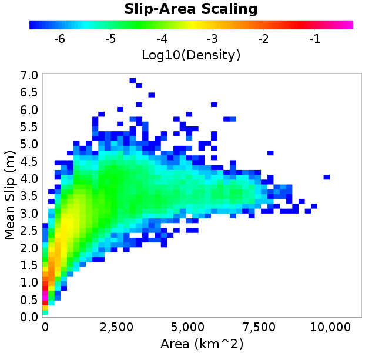
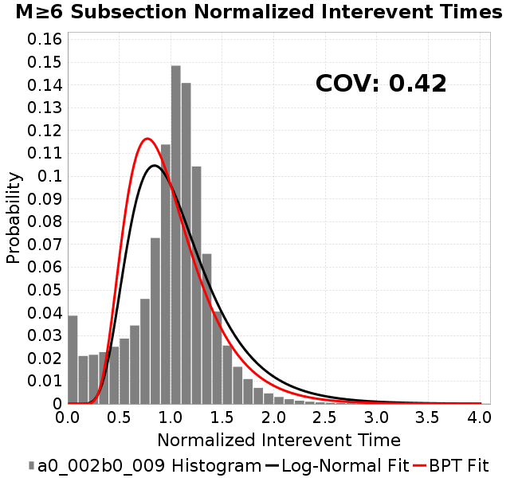

# a0_002b0_009
## Metadata
| **Catalog** | a0_002b0_009 |
|-----|-----|
| **Author** | Jaqcui Gilchrist, 2018/09/27 |
| **Description** | hold b-a constant, but change a and b: a=0.002, b=0.009 |
| **Fault/Def Model** | Fault Model 3.1, Geologic |
| **Slip Velocity** | 1.0 m/s |
| **Average Element Area** | 1.35 km^2 |
| **Length** | 9,285,521 events in 434,248 years |
| **Frictional Params** | a=0.002, b=0.009, (b-a)=0.007, ddotEQ=1 |

* [Metadata](#metadata)
* [Plots](#plots)
  * [Magnitude-Frequency Plot](#magnitude-frequency-plot)
  * [Magnitude-Area Plots](#magnitude-area-plots)
  * [Slip-Area Plots](#slip-area-plots)
  * [Rupture Velocity Plots](#rupture-velocity-plots)
  * [Global Interevent-Time Distributions](#global-interevent-time-distributions)
  * [Normalized Fault Interevent-Time Distributions](#normalized-fault-interevent-time-distributions)
  * [Stationarity Plot](#stationarity-plot)
  * [Element/Subsection Interevent Time Comparisons](#elementsubsection-interevent-time-comparisons)
    * [Element Interevent Time Comparisons](#element-interevent-time-comparisons)
    * [Subsection Interevent Time Comparisons](#subsection-interevent-time-comparisons)
  * [Paleo Open Interval Plots](#paleo-open-interval-plots)
    * [Paleo Open Interval Plots, Biasi and Sharer 2019](#paleo-open-interval-plots-biasi-and-sharer-2019)
    * [Paleo Open Interval Plots, UCERF3](#paleo-open-interval-plots-ucerf3)
  * [Moment Release Variability Plots](#moment-release-variability-plots)
* [Input File](#input-file)

## Plots
### Magnitude-Frequency Plot
*[(top)](#a0_002b0_009)*


### Magnitude-Area Plots
*[(top)](#a0_002b0_009)*

| Scatter | 2-D Hist |
|-----|-----|
|  |  |
### Slip-Area Plots
*[(top)](#a0_002b0_009)*

| Scatter | 2-D Hist |
|-----|-----|
|  |  |
### Rupture Velocity Plots
*[(top)](#a0_002b0_009)*

| **Scatter** |  |
|-----|-----|
| **Distance/Velocity** |  |
### Global Interevent-Time Distributions
*[(top)](#a0_002b0_009)*

| **M≥6** | **M≥6.5** | **M≥7** | **M≥7.5** |
|-----|-----|-----|-----|
|  |  |  |  |
### Normalized Fault Interevent-Time Distributions
*[(top)](#a0_002b0_009)*

|  | **M≥6** | **M≥6.5** | **M≥7** | **M≥7.5** |
|-----|-----|-----|-----|-----|
| **Elements** |  |  |  |  |
| **Subsections** |  |  |  |  |
| **Sections** |  |  |  |  |
### Stationarity Plot
*[(top)](#a0_002b0_009)*


### Element/Subsection Interevent Time Comparisons

#### Element Interevent Time Comparisons
*[(top)](#a0_002b0_009)*

| Min Mag | Scatter | 2-D Hist |
|-----|-----|-----|
| **M≥6.0** |  |  |
| **M≥6.5** |  |  |
| **M≥7.0** |  |  |
| **M≥7.5** |  |  |

#### Subsection Interevent Time Comparisons
*[(top)](#a0_002b0_009)*

*Subsections participate in a rupture if at least 20.0 % of its area ruptures*

| Min Mag | Scatter | 2-D Hist |
|-----|-----|-----|
| **M≥6.0** |  |  |
| **M≥6.5** |  |  |
| **M≥7.0** |  |  |
| **M≥7.5** |  |  |

### Paleo Open Interval Plots
*[(top)](#a0_002b0_009)*

#### Paleo Open Interval Plots, Biasi and Sharer 2019
*[(top)](#a0_002b0_009)*

These plots use the 5 paleoseismic sites identified in Biasi & Scharer (2019) on the Hayward, N. SAF, S. SAF, and SJC faults. By default, a rupture is counted at a paleo site if the nearest element (at the surface) slips any amount. We also alternatively apply a probability of detection model. Those results are marked as 'Prob. Filtered'.

**Paleoseismic sites table:**

| **Site Name** | Data MRI (yr) | Data Annual Rate | Catalog MRI (yr) | Catalog Annual Rate | Catalog Occurences | Prob Filtered Catalog MRI (yr) | Prob Filtered Catalog Annual Rate | Prob Filtered Catalog Occurences |
|-----|-----|-----|-----|-----|-----|-----|-----|-----|
| **HOG** | 191.00 | 0.005235602 | 362.22 | 0.002760723 | 1185 | 366.30 | 0.0027300168 | 1171.8 |
| **FRA** | 119.00 | 0.008403362 | 117.36 | 0.008520723 | 3657 | 122.98 | 0.008131078 | 3489.77 |
| **COA** | 181.00 | 0.005524862 | 177.90 | 0.005621096 | 2413 | 190.15 | 0.0052588712 | 2257.57 |
| **SCZ** | 106.00 | 0.009433962 | 121.30 | 0.008243762 | 3539 | 140.35 | 0.0071250997 | 3058.78 |
| **TYS** | 329.00 | 0.0030395137 | 345.27 | 0.0028963117 | 1244 | 384.14 | 0.0026032391 | 1118.16 |
| **TOTAL** | 31.61 | 0.0316373 | 35.66 | 0.028044647 | 12038 | 38.68 | 0.025852904 | 11097.27 |

**Paleoseismic Plots:**

|  |  |
|-----|-----|

**Open interval probabilities table:**

| **Open Interval (yr)** | Catalog Probability | Catalog Poisson Probability | Prob. Filtered Catalog Probability | Prob. Filtered Catalog Poisson Probability | Data Poisson Probability |
|-----|-----|-----|-----|-----|-----|
| **10.00** | 0.9737308 | 0.7554464 | 0.9774576 | 0.7721866 | 0.72878754 |
| **20.00** | 0.900995 | 0.5706992 | 0.91423965 | 0.5962722 | 0.53113127 |
| **30.00** | 0.8050055 | 0.43113267 | 0.828541 | 0.46043336 | 0.3870819 |
| **40.00** | 0.69039136 | 0.3256976 | 0.72511905 | 0.35554048 | 0.28210047 |
| **50.00** | 0.5711422 | 0.24604708 | 0.61577135 | 0.27454358 | 0.2055913 |
| **60.00** | 0.44760606 | 0.18587537 | 0.4994146 | 0.21199888 | 0.14983238 |
| **70.00** | 0.3420387 | 0.14041889 | 0.39514259 | 0.1637027 | 0.10919597 |
| **80.00** | 0.24948019 | 0.10607894 | 0.30130303 | 0.12640904 | 0.079580665 |
| **90.00** | 0.1716609 | 0.08013695 | 0.21809922 | 0.09761136 | 0.057997398 |
| **100.00** | 0.10919331 | 0.060539167 | 0.14909856 | 0.075374186 | 0.04226778 |
| **110.00** | 0.070612356 | 0.045734093 | 0.10260264 | 0.058202937 | 0.030804234 |
| **120.00** | 0.038273174 | 0.034549657 | 0.062096894 | 0.044943526 | 0.022449743 |
| **130.00** | 0.017178206 | 0.026100412 | 0.032251947 | 0.03470479 | 0.016361093 |
| **140.00** | 0.0067478875 | 0.019717462 | 0.013931222 | 0.026798574 | 0.011923761 |
| **150.00** | 0.0015193044 | 0.014895486 | 0.004606104 | 0.0206935 | 0.008689889 |
| **160.00** | 0.0 | 0.01125274 | 0.0017653744 | 0.015979243 | 0.0063330824 |
| **170.00** | 0.0 | 0.008500842 | 9.40611E-4 | 0.012338958 | 0.0046154717 |
| **180.00** | 0.0 | 0.00642193 | 4.6873264E-4 | 0.009527978 | 0.0033636983 |
| **190.00** | 0.0 | 0.004851424 | 2.531729E-4 | 0.007357377 | 0.0024514215 |
| **200.00** | 0.0 | 0.0036649907 | 1.2964148E-4 | 0.005681268 | 0.0017865654 |
| **210.00** | 0.0 | 0.002768704 | 7.975711E-5 | 0.004386999 | 0.0013020267 |
| **220.00** | 0.0 | 0.0020916073 | 3.3297027E-5 | 0.0033875818 | 9.489008E-4 |
| **230.00** | 0.0 | 0.0015800972 | 7.960649E-6 | 0.0026158453 | 6.915471E-4 |
| **240.00** | 0.0 | 0.0011936787 | 0.0 | 0.0020199206 | 5.039909E-4 |

#### Paleo Open Interval Plots, UCERF3
*[(top)](#a0_002b0_009)*

These plots use the full set of UCERF3 paleoseismic sites. By default, a rupture is counted at a paleo site if the nearest element (at the surface) slips any amount. We also alternativeslyapply a probability of detection model. Those results are marked as 'Prob. Filtered'.

**Paleoseismic sites table:**

| **Site Name** | Data MRI (yr) | Data Annual Rate | Catalog MRI (yr) | Catalog Annual Rate | Catalog Occurences | Prob Filtered Catalog MRI (yr) | Prob Filtered Catalog Annual Rate | Prob Filtered Catalog Occurences |
|-----|-----|-----|-----|-----|-----|-----|-----|-----|
| **SSanAndreasBurroFlats** | 205.44 | 0.0048677 | 207.09 | 0.004828881 | 2072 | 236.42 | 0.0042298282 | 1814.85 |
| **SSanAndreasIndio** | 277.37 | 0.0036053 | 174.22 | 0.00573995 | 2464 | 185.15 | 0.0054011107 | 2318.59 |
| **SSAFMCreek1000Palms** | 261.33 | 0.0038266 | 1601.11 | 6.2456855E-4 | 268 | 2335.77 | 4.2812395E-4 | 183.6 |
| **NSanAndreasFortRoss** | 306.28 | 0.003265 | 189.90 | 0.0052658343 | 2261 | 192.46 | 0.005195766 | 2230.92 |
| **NSanAndreasNorthCoast** | 263.87 | 0.0037898 | 181.86 | 0.005498836 | 2361 | 186.37 | 0.005365572 | 2303.76 |
| **CalaverasfaultNorth** | 618.05 | 0.001618 | 164.85 | 0.0060662343 | 2604 | 237.12 | 0.0042172596 | 1810.1 |
| **ElsinoreTemecula** | 1019.16 | 9.812E-4 | 695.25 | 0.0014383259 | 617 | 723.17 | 0.0013828034 | 593.2 |
| **ElsinoreWhittier** | 3196.93 | 3.128E-4 | 1511.93 | 6.6140527E-4 | 283 | 1604.43 | 6.2327355E-4 | 266.72 |
| **SSAFCarrizoBidart** | 114.71 | 0.0087179 | 121.65 | 0.008220074 | 3528 | 125.28 | 0.007982075 | 3425.87 |
| **SanJacintoHogLake** | 311.78 | 0.0032074 | 362.22 | 0.002760723 | 1185 | 366.49 | 0.002728617 | 1171.21 |
| **PuenteHills** | 3506.31 | 2.852E-4 | 4980.73 | 2.007738E-4 | 85 | 5453.49 | 1.8336892E-4 | 77.55 |
| **SanGregorioNorth** | 1019.06 | 9.813E-4 | 393.00 | 0.0025445572 | 1092 | 407.53 | 0.0024537912 | 1053.01 |
| **SanJacintoSuperstition** | 508.26 | 0.0019675 | 1188.89 | 8.4112305E-4 | 361 | 1273.52 | 7.8522577E-4 | 337.03 |
| **SSanAndreasWrightwood** | 106.04 | 0.0094304 | 153.57 | 0.0065117343 | 2795 | 155.53 | 0.0064294357 | 2759.66 |
| **SSanAndreasPitmanCanyon** | 173.48 | 0.0057643 | 141.94 | 0.007045445 | 3024 | 158.70 | 0.0063013453 | 2704.7 |
| **SSanAndreasPlungeCreek** | 205.36 | 0.0048695 | 359.26 | 0.0027834661 | 1194 | 442.18 | 0.0022615439 | 969.96 |
| **FrazierMountianSSAF** | 148.57 | 0.0067307 | 117.36 | 0.008520723 | 3657 | 122.88 | 0.008138004 | 3492.74 |
| **NSanAndreasSantaCruzSeg** | 109.84 | 0.0091041 | 121.30 | 0.008243762 | 3539 | 140.44 | 0.0071203294 | 3056.76 |
| **RodgersCreek** | 325.31 | 0.003074 | 168.94 | 0.005919219 | 2541 | 231.64 | 0.0043171044 | 1853.31 |
| **GreenValleyMasonRoad** | 293.31 | 0.0034094 | 1761.92 | 5.6756247E-4 | 243 | 2367.54 | 4.2238022E-4 | 180.76 |
| **HaywardfaultNorth** | 318.34 | 0.0031413 | 372.05 | 0.0026877823 | 1153 | 382.60 | 0.0026136816 | 1121.24 |
| **HaywardfaultSouth** | 167.57 | 0.0059677 | 345.27 | 0.0028963117 | 1244 | 384.47 | 0.0026009765 | 1117.19 |
| **Compton** | 2658.16 | 3.762E-4 | 5283.71 | 1.8926096E-4 | 80 | 5968.77 | 1.6753864E-4 | 70.87 |
| **SSanAndreasCoachella** | 178.45 | 0.0056037 | 177.90 | 0.005621096 | 2413 | 190.23 | 0.0052568405 | 2256.67 |
| **ElsinoreGlenIvy** | 179.12 | 0.0055828 | 566.26 | 0.0017659691 | 758 | 613.77 | 0.0016292854 | 699.4 |
| **GarlockCentralallevents** | 1434.93 | 6.969E-4 | 640.66 | 0.0015608963 | 670 | 650.44 | 0.0015374144 | 659.91 |
| **NSanAndreasAlderCreek** | 869.64 | 0.0011499 | 189.74 | 0.005270494 | 2263 | 192.55 | 0.005193585 | 2229.95 |
| **SSanAndreasPallettCreek** | 149.30 | 0.006698 | 154.01 | 0.0064930893 | 2787 | 155.75 | 0.0064205127 | 2755.85 |
| **GarlockWesternallevents** | 1230.16 | 8.129E-4 | 836.44 | 0.001195537 | 513 | 857.70 | 0.0011659103 | 500.26 |
| **ElsinoreFaultJulian** | 3250.98 | 3.076E-4 | 1263.24 | 7.9161697E-4 | 339 | 1289.37 | 7.75572E-4 | 332.04 |
| **TOTAL** | 9.08 | 0.1101451 | 14.29 | 0.06996699 | 30032 | 15.90 | 0.06288467 | 26992.06 |

**Paleoseismic Plots:**

|  |  |
|-----|-----|

**Open interval probabilities table:**

| **Open Interval (yr)** | Catalog Probability | Catalog Poisson Probability | Prob. Filtered Catalog Probability | Prob. Filtered Catalog Poisson Probability | Data Poisson Probability |
|-----|-----|-----|-----|-----|-----|
| **10.00** | 0.856458 | 0.49674928 | 0.8788454 | 0.53320634 | 0.33238843 |
| **20.00** | 0.59924155 | 0.24675985 | 0.64812386 | 0.28430903 | 0.110482074 |
| **30.00** | 0.3755991 | 0.12257778 | 0.43157396 | 0.15159538 | 0.036722966 |
| **40.00** | 0.21360558 | 0.060890425 | 0.2620335 | 0.080831625 | 0.012206289 |
| **50.00** | 0.11507953 | 0.030247275 | 0.15132453 | 0.04309994 | 0.004057229 |
| **60.00** | 0.056784973 | 0.015025312 | 0.08039326 | 0.022981161 | 0.001348576 |
| **70.00** | 0.027217679 | 0.007463813 | 0.041807905 | 0.012253702 | 4.4825108E-4 |
| **80.00** | 0.011290993 | 0.0037076438 | 0.018772287 | 0.0065337517 | 1.4899348E-4 |
| **90.00** | 0.0043462585 | 0.0018417693 | 0.008379537 | 0.0034838382 | 4.952371E-5 |
| **100.00** | 0.001494637 | 9.148976E-4 | 0.0028519935 | 0.0018576047 | 1.6461108E-5 |
| **110.00** | 6.380982E-4 | 4.5447474E-4 | 0.001076415 | 9.904867E-4 | 5.4714824E-6 |
| **120.00** | 0.0 | 2.2576E-4 | 2.2027911E-4 | 5.281338E-4 | 1.8186574E-6 |
| **130.00** | 0.0 | 1.1214612E-4 | 2.2161894E-5 | 2.816043E-4 | 6.045007E-7 |
| **140.00** | 0.0 | 5.5708504E-5 | 5.621299E-6 | 1.5015321E-4 | 2.0092905E-7 |
| **150.00** | 0.0 | 2.7673159E-5 | 0.0 | 8.006265E-5 | 6.678649E-8 |

### Moment Release Variability Plots
*[(top)](#a0_002b0_009)*

We first create a tapered moment release time series for the entire catalog. Each event's moment is distributed across a 25 year Hanning (cosine) taper. Here is a plot of a random 2,000 year section of this time series:


We then compute Welch's power spectral density estimate on the entire time series. Results are plotted below, with a Poisson randomization of the catalog also plotted in a gray line, and the 95% confidence bounds from 200 realizations as a light gray shaded area. Significant deviations outside the Poisson confidence intervals indicate synchronous behaviour.


## Input File
*[(top)](#a0_002b0_009)*

```
  A_1 = 0.002
  fA = .1
  B_1 = 0.009
  muSlipAmp_1 = .0
  muSlipInvDist_1 = 1.0
  cohesion = 0.0
  Dc_1 = 1.0000000000000000818e-05
  mu0_1 = 0.6
  ddotStar_1 = 9.9999999999999995475e-07
  ddotAB_1 = 9.9999999999999995475e-07
  alpha_1 = 0.0
  theta0_1 = 200000000
  tau0_1 = 55.1
  sigma0_1 = 100
  sigmaFracPin = .5
  lowSigmaAction = 1
  maxThetaPin = 1.0e13
  ddotEQ_1 = 1
  ddotEQFname = 
  stressOvershootFactor = 0.10000000000000000555
  lameLambda = 30000
  lameMu = 30000
  slowSlip_1 = 0
  nEq = 100000000000
  KZeroFrac = 0
  muPin = 1.0
  tStart = 0
  maxT = 3.16e13
  maxWallTime = 169200
  maxTrans = 1.0000000000000000159e100
  faultFname = UCERF3FM.15km.1km.tri.flt
  outFnameInfix = a0_002b0_009
  writeTau = 2
  writeSigma = 2
  writeSlip = 0
  writeSlipSpeed = 0
  writeState = 0
  writeTheta = 2
  writePED = 1
  writeTransitions = 1
  minDtWrite = 0
  minDtWriteCoseismic = 0
  minDtWriteInterseismic = 0
  minMagWrite = 7.7
  writeStiffness = 0
  stressRateSpecification = 1
  dMu3 = 0.01000000000000000
  initTauFname = 
  initSigmaFname = 
  initThetaFname = 
  initSlipSpeedFname = 
  AFname = 
  BFname =  
  DcFname = 
  mu0Fname = 
  ddotStarFname = 
  ddotABFname = 
  alphaFname = 
  KTauFname = /u/sciteam/gilchris/scratch/stiffness_25a589d/Ktau.25a589d.out
  KSigmaFname = /u/sciteam/gilchris/scratch/stiffness_25a589d/Ksigma.25a589d.out
  tFailFname = 
  tauFailFname = 
  tauDotFname = 
  sigmaDotFname =
  KZeroFname = UCERF3FM.15km.1km.tri.KZero
  pinnedFname =  UCERF3FM.15km.1km.tri.pin
  neighborFname = UCERF3FM.15km.1km.tri.neighbors
  stressRateFname =  
  slowSlipFname = 
  writePatchFname = 
  DEBUG = 0
  ZBrentUpperBracket = 0
  receiverElementAreaFrac = 0.8
  receiverElementIntTol = 1.0e-4
  receiverElementSubdivisionMax = 4
  tgfDist1 = 3
  tgfDist1 = 10
  lowSigmaAction = 1
  highSigmaAction = 0
```
