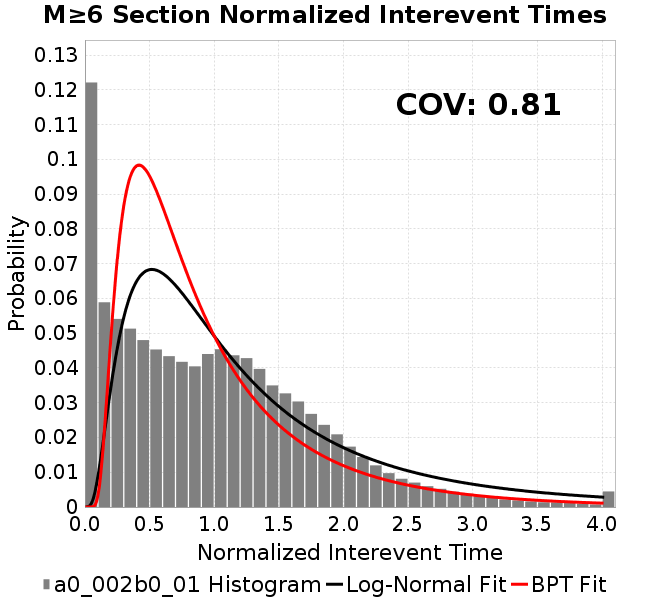
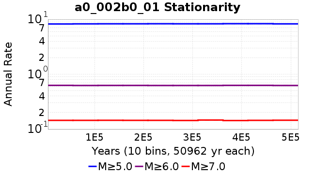
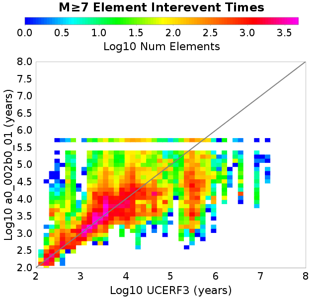
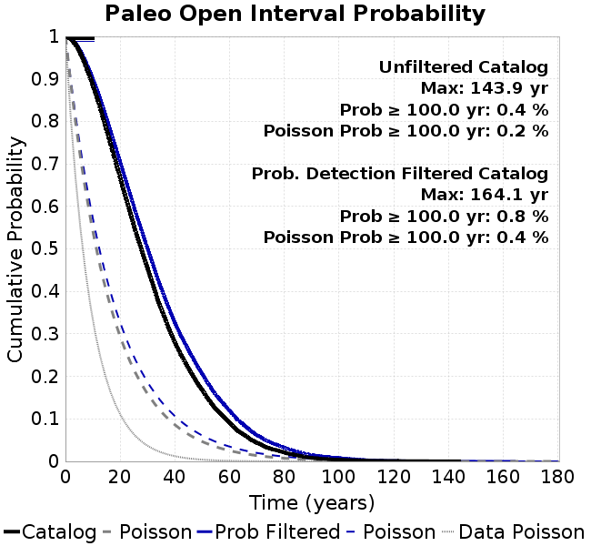
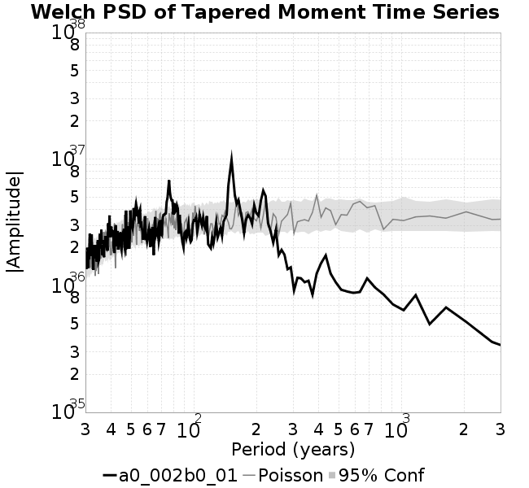

# a0_002b0_01
## Metadata
| **Catalog** | a0_002b0_01 |
|-----|-----|
| **Author** | Jaqcui Gilchrist, 2018/09/27 |
| **Description** | change b-a: a=0.002, b=0.01 |
| **Fault/Def Model** | Fault Model 3.1, Geologic |
| **Slip Velocity** | 1.0 m/s |
| **Average Element Area** | 1.35 km^2 |
| **Length** | 9,380,098 events in 514,620 years |
| **Frictional Params** | a=0.002, b=0.01, (b-a)=0.008, ddotEQ=1 |

* [Metadata](#metadata)
* [Plots](#plots)
  * [Magnitude-Frequency Plot](#magnitude-frequency-plot)
  * [Magnitude-Area Plots](#magnitude-area-plots)
  * [Slip-Area Plots](#slip-area-plots)
  * [Rupture Velocity Plots](#rupture-velocity-plots)
  * [Global Interevent-Time Distributions](#global-interevent-time-distributions)
  * [Normalized Fault Interevent-Time Distributions](#normalized-fault-interevent-time-distributions)
  * [Stationarity Plot](#stationarity-plot)
  * [Element/Subsection Interevent Time Comparisons](#elementsubsection-interevent-time-comparisons)
    * [Element Interevent Time Comparisons](#element-interevent-time-comparisons)
    * [Subsection Interevent Time Comparisons](#subsection-interevent-time-comparisons)
  * [Paleo Open Interval Plots](#paleo-open-interval-plots)
    * [Paleo Open Interval Plots, Biasi and Sharer 2019](#paleo-open-interval-plots-biasi-and-sharer-2019)
    * [Paleo Open Interval Plots, UCERF3](#paleo-open-interval-plots-ucerf3)
  * [Moment Release Variability Plots](#moment-release-variability-plots)
* [Input File](#input-file)

## Plots
### Magnitude-Frequency Plot
*[(top)](#a0_002b0_01)*


### Magnitude-Area Plots
*[(top)](#a0_002b0_01)*

| Scatter | 2-D Hist |
|-----|-----|
|  |  |
### Slip-Area Plots
*[(top)](#a0_002b0_01)*

| Scatter | 2-D Hist |
|-----|-----|
|  |  |
### Rupture Velocity Plots
*[(top)](#a0_002b0_01)*

| **Scatter** |  |
|-----|-----|
| **Distance/Velocity** |  |
### Global Interevent-Time Distributions
*[(top)](#a0_002b0_01)*

| **M≥6** | **M≥6.5** | **M≥7** | **M≥7.5** |
|-----|-----|-----|-----|
|  |  |  |  |
### Normalized Fault Interevent-Time Distributions
*[(top)](#a0_002b0_01)*

|  | **M≥6** | **M≥6.5** | **M≥7** | **M≥7.5** |
|-----|-----|-----|-----|-----|
| **Elements** |  |  |  |  |
| **Subsections** |  |  |  |  |
| **Sections** |  |  |  |  |
### Stationarity Plot
*[(top)](#a0_002b0_01)*


### Element/Subsection Interevent Time Comparisons

#### Element Interevent Time Comparisons
*[(top)](#a0_002b0_01)*

| Min Mag | Scatter | 2-D Hist |
|-----|-----|-----|
| **M≥6.0** |  |  |
| **M≥6.5** |  |  |
| **M≥7.0** |  |  |
| **M≥7.5** |  |  |

#### Subsection Interevent Time Comparisons
*[(top)](#a0_002b0_01)*

*Subsections participate in a rupture if at least 20.0 % of its area ruptures*

| Min Mag | Scatter | 2-D Hist |
|-----|-----|-----|
| **M≥6.0** |  |  |
| **M≥6.5** |  |  |
| **M≥7.0** |  |  |
| **M≥7.5** |  |  |

### Paleo Open Interval Plots
*[(top)](#a0_002b0_01)*

#### Paleo Open Interval Plots, Biasi and Sharer 2019
*[(top)](#a0_002b0_01)*

These plots use the 5 paleoseismic sites identified in Biasi & Scharer (2019) on the Hayward, N. SAF, S. SAF, and SJC faults. By default, a rupture is counted at a paleo site if the nearest element (at the surface) slips any amount. We also alternatively apply a probability of detection model. Those results are marked as 'Prob. Filtered'.

**Paleoseismic sites table:**

| **Site Name** | Data MRI (yr) | Data Annual Rate | Catalog MRI (yr) | Catalog Annual Rate | Catalog Occurences | Prob Filtered Catalog MRI (yr) | Prob Filtered Catalog Annual Rate | Prob Filtered Catalog Occurences |
|-----|-----|-----|-----|-----|-----|-----|-----|-----|
| **HOG** | 191.00 | 0.005235602 | 414.44 | 0.002412891 | 1230 | 418.91 | 0.0023871523 | 1216.86 |
| **FRA** | 119.00 | 0.008403362 | 135.66 | 0.007371224 | 3757 | 140.46 | 0.00711925 | 3628.53 |
| **COA** | 181.00 | 0.005524862 | 204.65 | 0.0048863254 | 2490 | 216.30 | 0.0046231593 | 2355.92 |
| **SCZ** | 106.00 | 0.009433962 | 138.79 | 0.0072051827 | 3672 | 155.54 | 0.006429171 | 3276.41 |
| **TYS** | 329.00 | 0.0030395137 | 392.92 | 0.002545074 | 1297 | 426.13 | 0.0023467003 | 1195.92 |
| **TOTAL** | 31.61 | 0.0316373 | 40.95 | 0.024419049 | 12445 | 43.67 | 0.022897173 | 11669.38 |

**Paleoseismic Plots:**

|  |  |
|-----|-----|

**Open interval probabilities table:**

| **Open Interval (yr)** | Catalog Probability | Catalog Poisson Probability | Prob. Filtered Catalog Probability | Prob. Filtered Catalog Poisson Probability | Data Poisson Probability |
|-----|-----|-----|-----|-----|-----|
| **10.00** | 0.97843885 | 0.7833384 | 0.98092604 | 0.795351 | 0.72878754 |
| **20.00** | 0.9247861 | 0.6136191 | 0.93307996 | 0.63258326 | 0.53113127 |
| **30.00** | 0.8482985 | 0.48067138 | 0.8637691 | 0.5031257 | 0.3870819 |
| **40.00** | 0.75016624 | 0.37652835 | 0.7735405 | 0.40016156 | 0.28210047 |
| **50.00** | 0.6460794 | 0.2949491 | 0.6782198 | 0.3182689 | 0.2055913 |
| **60.00** | 0.54307705 | 0.23104498 | 0.5808075 | 0.2531355 | 0.14983238 |
| **70.00** | 0.43337965 | 0.1809864 | 0.47569877 | 0.20133157 | 0.10919597 |
| **80.00** | 0.3436699 | 0.1417736 | 0.38762593 | 0.16012928 | 0.079580665 |
| **90.00** | 0.25725946 | 0.11105671 | 0.30008063 | 0.12735897 | 0.057997398 |
| **100.00** | 0.18426843 | 0.08699498 | 0.22503868 | 0.10129509 | 0.04226778 |
| **110.00** | 0.13100196 | 0.06814651 | 0.16552198 | 0.080565155 | 0.030804234 |
| **120.00** | 0.085218295 | 0.053381782 | 0.11448249 | 0.06407758 | 0.022449743 |
| **130.00** | 0.054421697 | 0.041816 | 0.07695245 | 0.05096417 | 0.016361093 |
| **140.00** | 0.034231044 | 0.03275608 | 0.05072736 | 0.040534403 | 0.011923761 |
| **150.00** | 0.013710451 | 0.025659095 | 0.024775786 | 0.03223908 | 0.008689889 |
| **160.00** | 0.006627487 | 0.020099755 | 0.012150754 | 0.025641384 | 0.0063330824 |
| **170.00** | 0.0016572512 | 0.01574491 | 0.004308258 | 0.0203939 | 0.0046154717 |
| **180.00** | 5.152415E-4 | 0.012333592 | 0.0018157272 | 0.016220309 | 0.0033636983 |
| **190.00** | 0.0 | 0.0096613765 | 8.284297E-4 | 0.01290084 | 0.0024514215 |
| **200.00** | 0.0 | 0.0075681275 | 4.9133564E-4 | 0.010260696 | 0.0017865654 |
| **210.00** | 0.0 | 0.005928405 | 2.806057E-4 | 0.008160855 | 0.0013020267 |
| **220.00** | 0.0 | 0.0046439474 | 1.0509038E-4 | 0.006490744 | 9.489008E-4 |
| **230.00** | 0.0 | 0.0036377823 | 4.9227277E-5 | 0.00516242 | 6.915471E-4 |
| **240.00** | 0.0 | 0.0028496147 | 2.6754426E-5 | 0.0041059363 | 5.039909E-4 |
| **250.00** | 0.0 | 0.0022322126 | 1.0271389E-5 | 0.0032656605 | 3.673023E-4 |
| **260.00** | 0.0 | 0.0017485778 | 8.612057E-6 | 0.0025973464 | 2.6768536E-4 |
| **270.00** | 0.0 | 0.0013697282 | 6.9527255E-6 | 0.002065802 | 1.9508575E-4 |
| **280.00** | 0.0 | 0.0010729607 | 0.0 | 0.0016430378 | 1.4217607E-4 |

#### Paleo Open Interval Plots, UCERF3
*[(top)](#a0_002b0_01)*

These plots use the full set of UCERF3 paleoseismic sites. By default, a rupture is counted at a paleo site if the nearest element (at the surface) slips any amount. We also alternativeslyapply a probability of detection model. Those results are marked as 'Prob. Filtered'.

**Paleoseismic sites table:**

| **Site Name** | Data MRI (yr) | Data Annual Rate | Catalog MRI (yr) | Catalog Annual Rate | Catalog Occurences | Prob Filtered Catalog MRI (yr) | Prob Filtered Catalog Annual Rate | Prob Filtered Catalog Occurences |
|-----|-----|-----|-----|-----|-----|-----|-----|-----|
| **SSanAndreasBurroFlats** | 205.44 | 0.0048677 | 234.39 | 0.0042663785 | 2174 | 260.96 | 0.0038320418 | 1952.7 |
| **SSanAndreasIndio** | 277.37 | 0.0036053 | 199.44 | 0.0050139315 | 2555 | 209.52 | 0.004772747 | 2432.08 |
| **SSAFMCreek1000Palms** | 261.33 | 0.0038266 | 1797.98 | 5.5617857E-4 | 283 | 2489.76 | 4.0164537E-4 | 204.14 |
| **NSanAndreasFortRoss** | 306.28 | 0.003265 | 217.45 | 0.0045986753 | 2343 | 220.09 | 0.0045436793 | 2314.98 |
| **NSanAndreasNorthCoast** | 263.87 | 0.0037898 | 208.98 | 0.004785214 | 2438 | 213.00 | 0.0046948837 | 2391.93 |
| **CalaverasfaultNorth** | 618.05 | 0.001618 | 186.02 | 0.0053757112 | 2740 | 256.14 | 0.0039041205 | 1989.43 |
| **ElsinoreTemecula** | 1019.16 | 9.812E-4 | 796.03 | 0.0012562332 | 640 | 817.83 | 0.0012227502 | 622.92 |
| **ElsinoreWhittier** | 3196.93 | 3.128E-4 | 1775.15 | 5.633333E-4 | 287 | 1845.22 | 5.4194115E-4 | 276.13 |
| **SSAFCarrizoBidart** | 114.71 | 0.0087179 | 139.87 | 0.007149459 | 3644 | 143.04 | 0.006991164 | 3563.33 |
| **SanJacintoHogLake** | 311.78 | 0.0032074 | 414.44 | 0.002412891 | 1230 | 418.91 | 0.0023871732 | 1216.87 |
| **PuenteHills** | 3506.31 | 2.852E-4 | 5586.72 | 1.7899604E-4 | 91 | 6083.46 | 1.6438002E-4 | 83.58 |
| **SanGregorioNorth** | 1019.06 | 9.813E-4 | 449.11 | 0.0022266419 | 1135 | 462.13 | 0.0021639059 | 1102.99 |
| **SanJacintoSuperstition** | 508.26 | 0.0019675 | 1326.75 | 7.537208E-4 | 384 | 1414.22 | 7.071045E-4 | 360.22 |
| **SSanAndreasWrightwood** | 106.04 | 0.0094304 | 174.87 | 0.0057184147 | 2914 | 176.74 | 0.0056580156 | 2883.22 |
| **SSanAndreasPitmanCanyon** | 173.48 | 0.0057643 | 161.21 | 0.006203211 | 3161 | 177.60 | 0.0056307227 | 2869.26 |
| **SSanAndreasPlungeCreek** | 205.36 | 0.0048695 | 406.13 | 0.002462252 | 1255 | 485.38 | 0.0020602397 | 1049.93 |
| **FrazierMountianSSAF** | 148.57 | 0.0067307 | 135.66 | 0.007371224 | 3757 | 140.41 | 0.0071219834 | 3629.92 |
| **NSanAndreasSantaCruzSeg** | 109.84 | 0.0091041 | 138.79 | 0.0072051827 | 3672 | 155.53 | 0.0064297444 | 3276.83 |
| **RodgersCreek** | 325.31 | 0.003074 | 189.90 | 0.0052660387 | 2683 | 249.77 | 0.004003675 | 2039.75 |
| **GreenValleyMasonRoad** | 293.31 | 0.0034094 | 1972.41 | 5.0699373E-4 | 259 | 2555.09 | 3.913754E-4 | 199.81 |
| **HaywardfaultNorth** | 318.34 | 0.0031413 | 422.45 | 0.0023671438 | 1207 | 432.34 | 0.00231297 | 1179.38 |
| **HaywardfaultSouth** | 167.57 | 0.0059677 | 392.92 | 0.002545074 | 1297 | 426.08 | 0.0023469597 | 1196.09 |
| **Compton** | 2658.16 | 3.762E-4 | 6794.65 | 1.4717452E-4 | 75 | 7405.17 | 1.3504089E-4 | 68.76 |
| **SSanAndreasCoachella** | 178.45 | 0.0056037 | 204.65 | 0.0048863254 | 2490 | 216.27 | 0.004623954 | 2356.32 |
| **ElsinoreGlenIvy** | 179.12 | 0.0055828 | 640.59 | 0.0015610628 | 795 | 684.25 | 0.0014614436 | 744.28 |
| **GarlockCentralallevents** | 1434.93 | 6.969E-4 | 725.09 | 0.0013791481 | 703 | 737.16 | 0.0013565553 | 691.5 |
| **NSanAndreasAlderCreek** | 869.64 | 0.0011499 | 217.92 | 0.0045888573 | 2338 | 220.63 | 0.004532419 | 2309.24 |
| **SSanAndreasPallettCreek** | 149.30 | 0.006698 | 174.57 | 0.0057282303 | 2919 | 176.38 | 0.0056696576 | 2889.14 |
| **GarlockWesternallevents** | 1230.16 | 8.129E-4 | 959.86 | 0.001041822 | 531 | 978.88 | 0.0010215766 | 520.68 |
| **ElsinoreFaultJulian** | 3250.98 | 3.076E-4 | 1435.18 | 6.9677475E-4 | 355 | 1457.25 | 6.8622344E-4 | 349.63 |
| **TOTAL** | 9.08 | 0.1101451 | 16.30 | 0.061335247 | 31258 | 17.86 | 0.055994328 | 28536 |

**Paleoseismic Plots:**

|  |  |
|-----|-----|

**Open interval probabilities table:**

| **Open Interval (yr)** | Catalog Probability | Catalog Poisson Probability | Prob. Filtered Catalog Probability | Prob. Filtered Catalog Poisson Probability | Data Poisson Probability |
|-----|-----|-----|-----|-----|-----|
| **10.00** | 0.8842162 | 0.54153234 | 0.89986235 | 0.57124144 | 0.33238843 |
| **20.00** | 0.66697055 | 0.2932573 | 0.7041522 | 0.3263168 | 0.110482074 |
| **30.00** | 0.45482007 | 0.15880832 | 0.50191736 | 0.18640569 | 0.036722966 |
| **40.00** | 0.27951387 | 0.08599984 | 0.3260076 | 0.106482655 | 0.012206289 |
| **50.00** | 0.16837479 | 0.046571698 | 0.20607698 | 0.060827307 | 0.004057229 |
| **60.00** | 0.09089209 | 0.025220081 | 0.11893077 | 0.03474708 | 0.001348576 |
| **70.00** | 0.04333023 | 0.01365749 | 0.061684467 | 0.019848973 | 4.4825108E-4 |
| **80.00** | 0.02126317 | 0.0073959725 | 0.032378193 | 0.011338556 | 1.4899348E-4 |
| **90.00** | 0.008228584 | 0.0040051583 | 0.015067464 | 0.0064770533 | 4.952371E-5 |
| **100.00** | 0.004151807 | 0.002168923 | 0.008443022 | 0.0036999614 | 1.6461108E-5 |
| **110.00** | 0.0017002766 | 0.001174542 | 0.003590798 | 0.0021135714 | 5.4714824E-6 |
| **120.00** | 0.00106002 | 6.3605246E-4 | 0.0018895947 | 0.0012073596 | 1.8186574E-6 |
| **130.00** | 4.5553647E-4 | 3.44443E-4 | 7.26111E-4 | 6.8969384E-4 | 6.045007E-7 |
| **140.00** | 3.3123462E-4 | 1.8652703E-4 | 5.56232E-4 | 3.9398173E-4 | 2.0092905E-7 |
| **150.00** | 0.0 | 1.01010424E-4 | 1.3294279E-4 | 2.250587E-4 | 6.678649E-8 |
| **160.00** | 0.0 | 5.4700413E-5 | 8.915772E-6 | 1.2856285E-4 | 2.2199057E-8 |
| **170.00** | 0.0 | 2.9622042E-5 | 0.0 | 7.344043E-5 | 7.37871E-9 |

### Moment Release Variability Plots
*[(top)](#a0_002b0_01)*

We first create a tapered moment release time series for the entire catalog. Each event's moment is distributed across a 25 year Hanning (cosine) taper. Here is a plot of a random 2,000 year section of this time series:


We then compute Welch's power spectral density estimate on the entire time series. Results are plotted below, with a Poisson randomization of the catalog also plotted in a gray line, and the 95% confidence bounds from 200 realizations as a light gray shaded area. Significant deviations outside the Poisson confidence intervals indicate synchronous behaviour.



## Input File
*[(top)](#a0_002b0_01)*

```
  A_1 = 0.002
  fA = .1
  B_1 = 0.01
  muSlipAmp_1 = .0
  muSlipInvDist_1 = 1.0
  cohesion = 0.0
  Dc_1 = 1.0000000000000000818e-05
  mu0_1 = 0.6
  ddotStar_1 = 9.9999999999999995475e-07
  ddotAB_1 = 9.9999999999999995475e-07
  alpha_1 = 0.0
  theta0_1 = 200000000
  tau0_1 = 55.1
  sigma0_1 = 100
  sigmaFracPin = .5
  lowSigmaAction = 1
  maxThetaPin = 1.0e13
  ddotEQ_1 = 1
  ddotEQFname = 
  stressOvershootFactor = 0.10000000000000000555
  lameLambda = 30000
  lameMu = 30000
  slowSlip_1 = 0
  nEq = 100000000000
  KZeroFrac = 0
  muPin = 1.0
  tStart = 0
  maxT = 3.16e13
  maxWallTime = 169200
  maxTrans = 1.0000000000000000159e100
  faultFname = UCERF3FM.15km.1km.tri.flt
  outFnameInfix = a0_002b0_01
  writeTau = 2
  writeSigma = 2
  writeSlip = 0
  writeSlipSpeed = 0
  writeState = 0
  writeTheta = 2
  writePED = 1
  writeTransitions = 1
  minDtWrite = 0
  minDtWriteCoseismic = 0
  minDtWriteInterseismic = 0
  minMagWrite = 7.7
  writeStiffness = 0
  stressRateSpecification = 1
  dMu3 = 0.01000000000000000
  initTauFname = 
  initSigmaFname = 
  initThetaFname = 
  initSlipSpeedFname = 
  AFname = 
  BFname =  
  DcFname = 
  mu0Fname = 
  ddotStarFname = 
  ddotABFname = 
  alphaFname = 
  KTauFname = /u/sciteam/gilchris/scratch/stiffness_25a589d/Ktau.25a589d.out
  KSigmaFname = /u/sciteam/gilchris/scratch/stiffness_25a589d/Ksigma.25a589d.out
  tFailFname = 
  tauFailFname = 
  tauDotFname = 
  sigmaDotFname =
  KZeroFname = UCERF3FM.15km.1km.tri.KZero
  pinnedFname =  UCERF3FM.15km.1km.tri.pin
  neighborFname = UCERF3FM.15km.1km.tri.neighbors
  stressRateFname =  
  slowSlipFname = 
  writePatchFname = 
  DEBUG = 0
  ZBrentUpperBracket = 0
  receiverElementAreaFrac = 0.8
  receiverElementIntTol = 1.0e-4
  receiverElementSubdivisionMax = 4
  tgfDist1 = 3
  tgfDist1 = 10
  lowSigmaAction = 1
  highSigmaAction = 0
```
