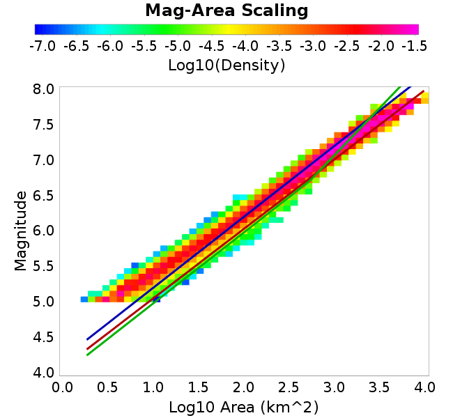
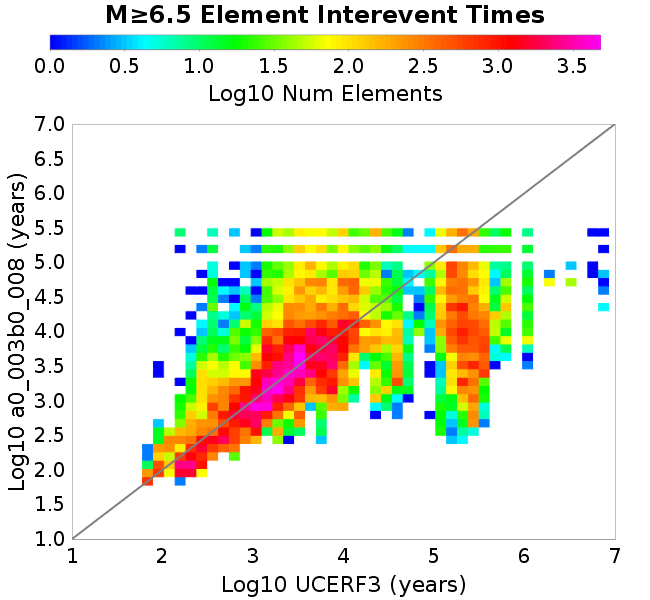

# a0_003b0_008
## Metadata
| **Catalog** | a0_003b0_008 |
|-----|-----|
| **Author** | Jaqcui Gilchrist, 2018/09/27 |
| **Description** | change b-a: a=0.003 |
| **Fault/Def Model** | Fault Model 3.1, Geologic |
| **Slip Velocity** | 1.0 m/s |
| **Average Element Area** | 1.35 km^2 |
| **Length** | 10,362,468 events in 291,186 years |
| **Frictional Params** | a=0.003, b=0.008, (b-a)=0.005, ddotEQ=1 |

* [Metadata](#metadata)
* [Plots](#plots)
  * [Magnitude-Frequency Plot](#magnitude-frequency-plot)
  * [Magnitude-Area Plots](#magnitude-area-plots)
  * [Slip-Area Plots](#slip-area-plots)
  * [Rupture Velocity Plots](#rupture-velocity-plots)
  * [Global Interevent-Time Distributions](#global-interevent-time-distributions)
  * [Normalized Fault Interevent-Time Distributions](#normalized-fault-interevent-time-distributions)
  * [Stationarity Plot](#stationarity-plot)
  * [Element/Subsection Interevent Time Comparisons](#elementsubsection-interevent-time-comparisons)
    * [Element Interevent Time Comparisons](#element-interevent-time-comparisons)
    * [Subsection Interevent Time Comparisons](#subsection-interevent-time-comparisons)
  * [Paleo Open Interval Plots](#paleo-open-interval-plots)
    * [Paleo Open Interval Plots, Biasi and Sharer 2019](#paleo-open-interval-plots-biasi-and-sharer-2019)
    * [Paleo Open Interval Plots, UCERF3](#paleo-open-interval-plots-ucerf3)
  * [Moment Release Variability Plots](#moment-release-variability-plots)
* [Input File](#input-file)

## Plots
### Magnitude-Frequency Plot
*[(top)](#a0_003b0_008)*


### Magnitude-Area Plots
*[(top)](#a0_003b0_008)*

| Scatter | 2-D Hist |
|-----|-----|
|  |  |
### Slip-Area Plots
*[(top)](#a0_003b0_008)*

| Scatter | 2-D Hist |
|-----|-----|
|  |  |
### Rupture Velocity Plots
*[(top)](#a0_003b0_008)*

| **Scatter** |  |
|-----|-----|
| **Distance/Velocity** |  |
### Global Interevent-Time Distributions
*[(top)](#a0_003b0_008)*

| **M≥6** | **M≥6.5** | **M≥7** | **M≥7.5** |
|-----|-----|-----|-----|
|  |  |  |  |
### Normalized Fault Interevent-Time Distributions
*[(top)](#a0_003b0_008)*

|  | **M≥6** | **M≥6.5** | **M≥7** | **M≥7.5** |
|-----|-----|-----|-----|-----|
| **Elements** |  |  |  |  |
| **Subsections** |  |  |  |  |
| **Sections** |  |  |  |  |
### Stationarity Plot
*[(top)](#a0_003b0_008)*


### Element/Subsection Interevent Time Comparisons

#### Element Interevent Time Comparisons
*[(top)](#a0_003b0_008)*

| Min Mag | Scatter | 2-D Hist |
|-----|-----|-----|
| **M≥6.0** |  |  |
| **M≥6.5** |  |  |
| **M≥7.0** |  |  |
| **M≥7.5** |  |  |

#### Subsection Interevent Time Comparisons
*[(top)](#a0_003b0_008)*

*Subsections participate in a rupture if at least 20.0 % of its area ruptures*

| Min Mag | Scatter | 2-D Hist |
|-----|-----|-----|
| **M≥6.0** |  |  |
| **M≥6.5** |  |  |
| **M≥7.0** |  |  |
| **M≥7.5** |  |  |

### Paleo Open Interval Plots
*[(top)](#a0_003b0_008)*

#### Paleo Open Interval Plots, Biasi and Sharer 2019
*[(top)](#a0_003b0_008)*

These plots use the 5 paleoseismic sites identified in Biasi & Scharer (2019) on the Hayward, N. SAF, S. SAF, and SJC faults. By default, a rupture is counted at a paleo site if the nearest element (at the surface) slips any amount. We also alternatively apply a probability of detection model. Those results are marked as 'Prob. Filtered'.

**Paleoseismic sites table:**

| **Site Name** | Data MRI (yr) | Data Annual Rate | Catalog MRI (yr) | Catalog Annual Rate | Catalog Occurences | Prob Filtered Catalog MRI (yr) | Prob Filtered Catalog Annual Rate | Prob Filtered Catalog Occurences |
|-----|-----|-----|-----|-----|-----|-----|-----|-----|
| **HOG** | 191.00 | 0.005235602 | 267.04 | 0.0037448131 | 1072 | 271.15 | 0.0036879906 | 1055.71 |
| **FRA** | 119.00 | 0.008403362 | 86.01 | 0.011626705 | 3327 | 93.39 | 0.010707306 | 3063.8 |
| **COA** | 181.00 | 0.005524862 | 126.08 | 0.007931185 | 2270 | 141.19 | 0.0070827166 | 2027.21 |
| **SCZ** | 106.00 | 0.009433962 | 89.03 | 0.011231678 | 3213 | 112.46 | 0.008891815 | 2543.7 |
| **TYS** | 329.00 | 0.0030395137 | 248.54 | 0.0040235003 | 1151 | 300.18 | 0.0033313504 | 952.92 |
| **TOTAL** | 31.61 | 0.0316373 | 25.94 | 0.038557623 | 11033 | 29.68 | 0.03369627 | 9642.01 |

**Paleoseismic Plots:**

|  |  |
|-----|-----|

**Open interval probabilities table:**

| **Open Interval (yr)** | Catalog Probability | Catalog Poisson Probability | Prob. Filtered Catalog Probability | Prob. Filtered Catalog Poisson Probability | Data Poisson Probability |
|-----|-----|-----|-----|-----|-----|
| **10.00** | 0.9513019 | 0.68005866 | 0.962144 | 0.71393543 | 0.72878754 |
| **20.00** | 0.8319956 | 0.46247977 | 0.8653695 | 0.5097038 | 0.53113127 |
| **30.00** | 0.6791095 | 0.31451336 | 0.73689675 | 0.36389562 | 0.3870819 |
| **40.00** | 0.5108042 | 0.21388754 | 0.59057623 | 0.259798 | 0.28210047 |
| **50.00** | 0.36044693 | 0.14545608 | 0.4482615 | 0.185479 | 0.2055913 |
| **60.00** | 0.2339619 | 0.098918654 | 0.32103646 | 0.13242003 | 0.14983238 |
| **70.00** | 0.13464282 | 0.06727049 | 0.21258521 | 0.09453935 | 0.10919597 |
| **80.00** | 0.06935323 | 0.045747876 | 0.12936226 | 0.067494996 | 0.079580665 |
| **90.00** | 0.027181828 | 0.03111124 | 0.06715797 | 0.04818707 | 0.057997398 |
| **100.00** | 0.0060370946 | 0.021157468 | 0.024815898 | 0.03440246 | 0.04226778 |
| **110.00** | 0.0012579578 | 0.014388319 | 0.008945352 | 0.024561135 | 0.030804234 |
| **120.00** | 0.0 | 0.009784901 | 0.0037922314 | 0.017535064 | 0.022449743 |
| **130.00** | 0.0 | 0.0066543063 | 0.0017528938 | 0.012518904 | 0.016361093 |
| **140.00** | 0.0 | 0.0045253187 | 8.685906E-4 | 0.0089376895 | 0.011923761 |
| **150.00** | 0.0 | 0.003077482 | 3.748669E-4 | 0.0063809333 | 0.008689889 |
| **160.00** | 0.0 | 0.0020928683 | 1.7654273E-4 | 0.0045555746 | 0.0063330824 |
| **170.00** | 0.0 | 0.0014232732 | 7.7983466E-5 | 0.003252386 | 0.0046154717 |
| **180.00** | 0.0 | 9.6790923E-4 | 3.4240275E-5 | 0.0023219937 | 0.0033636983 |
| **190.00** | 0.0 | 6.5823505E-4 | 1.2196373E-5 | 0.0016577537 | 0.0024514215 |
| **200.00** | 0.0 | 4.4763845E-4 | 9.173925E-6 | 0.0011835292 | 0.0017865654 |
| **210.00** | 0.0 | 3.044204E-4 | 0.0 | 8.449634E-4 | 0.0013020267 |

#### Paleo Open Interval Plots, UCERF3
*[(top)](#a0_003b0_008)*

These plots use the full set of UCERF3 paleoseismic sites. By default, a rupture is counted at a paleo site if the nearest element (at the surface) slips any amount. We also alternativeslyapply a probability of detection model. Those results are marked as 'Prob. Filtered'.

**Paleoseismic sites table:**

| **Site Name** | Data MRI (yr) | Data Annual Rate | Catalog MRI (yr) | Catalog Annual Rate | Catalog Occurences | Prob Filtered Catalog MRI (yr) | Prob Filtered Catalog Annual Rate | Prob Filtered Catalog Occurences |
|-----|-----|-----|-----|-----|-----|-----|-----|-----|
| **SSanAndreasBurroFlats** | 205.44 | 0.0048677 | 151.45 | 0.006602786 | 1889 | 188.36 | 0.0053090993 | 1518.68 |
| **SSanAndreasIndio** | 277.37 | 0.0036053 | 124.49 | 0.008032553 | 2299 | 138.42 | 0.0072245565 | 2067.8 |
| **SSAFMCreek1000Palms** | 261.33 | 0.0038266 | 1300.53 | 7.689196E-4 | 220 | 2135.53 | 4.6826765E-4 | 133.53 |
| **NSanAndreasFortRoss** | 306.28 | 0.003265 | 137.82 | 0.0072558224 | 2077 | 141.76 | 0.0070542316 | 2019.28 |
| **NSanAndreasNorthCoast** | 263.87 | 0.0037898 | 131.70 | 0.0075928997 | 2173 | 138.31 | 0.007230079 | 2069.13 |
| **CalaverasfaultNorth** | 618.05 | 0.001618 | 120.36 | 0.008308328 | 2377 | 197.15 | 0.005072294 | 1451.01 |
| **ElsinoreTemecula** | 1019.16 | 9.812E-4 | 506.63 | 0.0019738425 | 565 | 543.54 | 0.0018397843 | 526.58 |
| **ElsinoreWhittier** | 3196.93 | 3.128E-4 | 1107.41 | 9.030104E-4 | 259 | 1225.48 | 8.160098E-4 | 234.03 |
| **SSAFCarrizoBidart** | 114.71 | 0.0087179 | 88.97 | 0.011239936 | 3216 | 94.13 | 0.01062368 | 3039.62 |
| **SanJacintoHogLake** | 311.78 | 0.0032074 | 267.04 | 0.0037448131 | 1072 | 271.03 | 0.0036896716 | 1056.21 |
| **PuenteHills** | 3506.31 | 2.852E-4 | 3480.95 | 2.8727824E-4 | 82 | 4071.32 | 2.456204E-4 | 69.85 |
| **SanGregorioNorth** | 1019.06 | 9.813E-4 | 289.99 | 0.0034483657 | 987 | 306.80 | 0.0032594595 | 932.93 |
| **SanJacintoSuperstition** | 508.26 | 0.0019675 | 840.70 | 0.0011894878 | 340 | 969.22 | 0.0010317601 | 295 |
| **SSanAndreasWrightwood** | 106.04 | 0.0094304 | 112.32 | 0.008903261 | 2548 | 114.87 | 0.008705842 | 2491.48 |
| **SSanAndreasPitmanCanyon** | 173.48 | 0.0057643 | 106.19 | 0.009417113 | 2695 | 125.68 | 0.007956744 | 2277.14 |
| **SSanAndreasPlungeCreek** | 205.36 | 0.0048695 | 262.09 | 0.003815487 | 1092 | 361.78 | 0.0027641454 | 790.93 |
| **FrazierMountianSSAF** | 148.57 | 0.0067307 | 86.01 | 0.011626705 | 3327 | 93.46 | 0.010699754 | 3061.67 |
| **NSanAndreasSantaCruzSeg** | 109.84 | 0.0091041 | 89.03 | 0.011231678 | 3213 | 112.60 | 0.008881201 | 2540.74 |
| **RodgersCreek** | 325.31 | 0.003074 | 124.99 | 0.008000932 | 2289 | 193.43 | 0.0051699174 | 1478.84 |
| **GreenValleyMasonRoad** | 293.31 | 0.0034094 | 1367.68 | 7.311651E-4 | 209 | 2065.56 | 4.8412976E-4 | 138.04 |
| **HaywardfaultNorth** | 318.34 | 0.0031413 | 271.92 | 0.0036775675 | 1053 | 286.45 | 0.0034909674 | 999.53 |
| **HaywardfaultSouth** | 167.57 | 0.0059677 | 248.54 | 0.0040235003 | 1151 | 300.62 | 0.0033264852 | 951.54 |
| **Compton** | 2658.16 | 3.762E-4 | 4118.59 | 2.4280179E-4 | 68 | 4815.75 | 2.0765196E-4 | 58.26 |
| **SSanAndreasCoachella** | 178.45 | 0.0056037 | 126.08 | 0.007931185 | 2270 | 141.22 | 0.007081326 | 2026.83 |
| **ElsinoreGlenIvy** | 179.12 | 0.0055828 | 410.26 | 0.0024374886 | 697 | 472.06 | 0.0021183887 | 605.79 |
| **GarlockCentralallevents** | 1434.93 | 6.969E-4 | 464.55 | 0.0021526313 | 616 | 480.50 | 0.0020811846 | 595.55 |
| **NSanAndreasAlderCreek** | 869.64 | 0.0011499 | 137.82 | 0.0072558224 | 2077 | 142.03 | 0.007040566 | 2015.35 |
| **SSanAndreasPallettCreek** | 149.30 | 0.006698 | 112.36 | 0.008899766 | 2547 | 114.91 | 0.008702472 | 2490.55 |
| **GarlockWesternallevents** | 1230.16 | 8.129E-4 | 606.64 | 0.0016484273 | 472 | 633.87 | 0.0015776039 | 451.71 |
| **ElsinoreFaultJulian** | 3250.98 | 3.076E-4 | 924.09 | 0.0010821449 | 309 | 963.09 | 0.0010383256 | 296.51 |
| **TOTAL** | 9.08 | 0.1101451 | 10.40 | 0.09611176 | 27505 | 12.15 | 0.08232504 | 23559.68 |

**Paleoseismic Plots:**

|  |  |
|-----|-----|

**Open interval probabilities table:**

| **Open Interval (yr)** | Catalog Probability | Catalog Poisson Probability | Prob. Filtered Catalog Probability | Prob. Filtered Catalog Poisson Probability | Data Poisson Probability |
|-----|-----|-----|-----|-----|-----|
| **10.00** | 0.7670362 | 0.3824652 | 0.8125033 | 0.4390024 | 0.33238843 |
| **20.00** | 0.43447492 | 0.14627965 | 0.5156091 | 0.19272311 | 0.110482074 |
| **30.00** | 0.20127623 | 0.055946875 | 0.27713433 | 0.08460591 | 0.036722966 |
| **40.00** | 0.07891745 | 0.021397734 | 0.1272696 | 0.037142195 | 0.012206289 |
| **50.00** | 0.02665393 | 0.008183889 | 0.0524625 | 0.016305514 | 0.004057229 |
| **60.00** | 0.005449785 | 0.003130053 | 0.017312182 | 0.0071581593 | 0.001348576 |
| **70.00** | 0.0017198437 | 0.0011971364 | 0.0058708736 | 0.003142449 | 4.4825108E-4 |
| **80.00** | 6.787889E-4 | 4.5786303E-4 | 0.0018652353 | 0.0013795428 | 1.4899348E-4 |
| **90.00** | 0.0 | 1.7511669E-4 | 1.7708282E-4 | 6.0562254E-4 | 4.952371E-5 |
| **100.00** | 0.0 | 6.697604E-5 | 0.0 | 2.6586975E-4 | 1.6461108E-5 |

### Moment Release Variability Plots
*[(top)](#a0_003b0_008)*

We first create a tapered moment release time series for the entire catalog. Each event's moment is distributed across a 25 year Hanning (cosine) taper. Here is a plot of a random 2,000 year section of this time series:


We then compute Welch's power spectral density estimate on the entire time series. Results are plotted below, with a Poisson randomization of the catalog also plotted in gray as a control. Significant deviations above the Poisson model indicate synchronization at that period.


## Input File
*[(top)](#a0_003b0_008)*

```
  A_1 = 0.003
  fA = .1
  B_1 = 0.008
  muSlipAmp_1 = .0
  muSlipInvDist_1 = 1.0
  cohesion = 0.0
  Dc_1 = 1.0000000000000000818e-05
  mu0_1 = 0.6
  ddotStar_1 = 9.9999999999999995475e-07
  ddotAB_1 = 9.9999999999999995475e-07
  alpha_1 = 0.0
  theta0_1 = 200000000
  tau0_1 = 55.1
  sigma0_1 = 100
  sigmaFracPin = .5
  lowSigmaAction = 1
  maxThetaPin = 1.0e13
  ddotEQ_1 = 1
  ddotEQFname = 
  stressOvershootFactor = 0.10000000000000000555
  lameLambda = 30000
  lameMu = 30000
  slowSlip_1 = 0
  nEq = 100000000000
  KZeroFrac = 0
  muPin = 1.0
  tStart = 0
  maxT = 3.16e13
  maxWallTime = 169200
  maxTrans = 1.0000000000000000159e100
  faultFname = UCERF3FM.15km.1km.tri.flt
  outFnameInfix = a0_003b0_008
  writeTau = 2
  writeSigma = 2
  writeSlip = 0
  writeSlipSpeed = 0
  writeState = 0
  writeTheta = 2
  writePED = 1
  writeTransitions = 1
  minDtWrite = 0
  minDtWriteCoseismic = 0
  minDtWriteInterseismic = 0
  minMagWrite = 7.7
  writeStiffness = 0
  stressRateSpecification = 1
  dMu3 = 0.01000000000000000
  initTauFname = 
  initSigmaFname = 
  initThetaFname = 
  initSlipSpeedFname = 
  AFname = 
  BFname =  
  DcFname = 
  mu0Fname = 
  ddotStarFname = 
  ddotABFname = 
  alphaFname = 
  KTauFname = /u/sciteam/gilchris/scratch/stiffness_25a589d/Ktau.25a589d.out
  KSigmaFname = /u/sciteam/gilchris/scratch/stiffness_25a589d/Ksigma.25a589d.out
  tFailFname = 
  tauFailFname = 
  tauDotFname = 
  sigmaDotFname =
  KZeroFname = UCERF3FM.15km.1km.tri.KZero
  pinnedFname =  UCERF3FM.15km.1km.tri.pin
  neighborFname = UCERF3FM.15km.1km.tri.neighbors
  stressRateFname =  
  slowSlipFname = 
  writePatchFname = 
  DEBUG = 0
  ZBrentUpperBracket = 0
  receiverElementAreaFrac = 0.8
  receiverElementIntTol = 1.0e-4
  receiverElementSubdivisionMax = 4
  tgfDist1 = 3
  tgfDist1 = 10
  lowSigmaAction = 1
  highSigmaAction = 0
```
