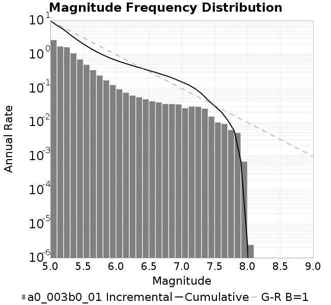
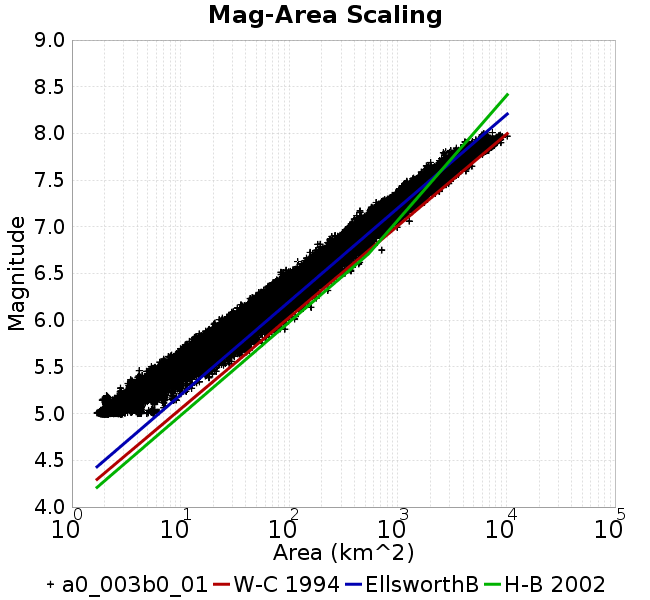
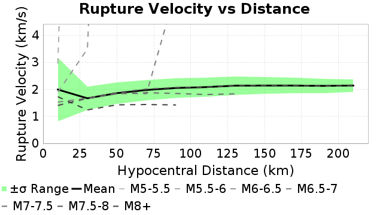
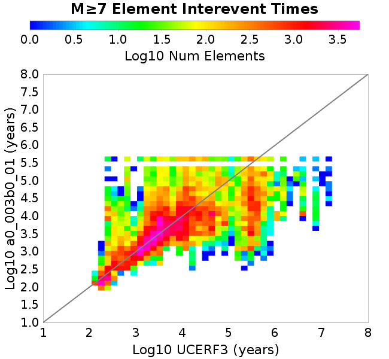
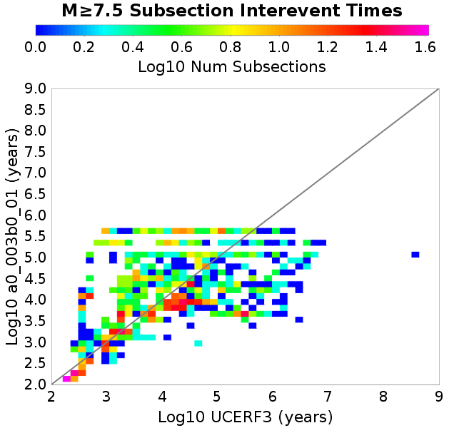

# a0_003b0_01
## Metadata
| **Catalog** | a0_003b0_01 |
|-----|-----|
| **Author** | Jaqcui Gilchrist, 2018/09/27 |
| **Description** | hold b-a constant, but change a and b: a=0.003, b=0.01 |
| **Fault/Def Model** | Fault Model 3.1, Geologic |
| **Slip Velocity** | 1.0 m/s |
| **Average Element Area** | 1.35 km^2 |
| **Length** | 9,824,003 events in 423,823 years |
| **Frictional Params** | a=0.003, b=0.01, (b-a)=0.007, ddotEQ=1 |

* [Metadata](#metadata)
* [Plots](#plots)
  * [Magnitude-Frequency Plot](#magnitude-frequency-plot)
  * [Magnitude-Area Plots](#magnitude-area-plots)
  * [Slip-Area Plots](#slip-area-plots)
  * [Rupture Velocity Plots](#rupture-velocity-plots)
  * [Global Interevent-Time Distributions](#global-interevent-time-distributions)
  * [Normalized Fault Interevent-Time Distributions](#normalized-fault-interevent-time-distributions)
  * [Stationarity Plot](#stationarity-plot)
  * [Element/Subsection Interevent Time Comparisons](#elementsubsection-interevent-time-comparisons)
    * [Element Interevent Time Comparisons](#element-interevent-time-comparisons)
    * [Subsection Interevent Time Comparisons](#subsection-interevent-time-comparisons)
  * [Paleo Open Interval Plots](#paleo-open-interval-plots)
    * [Paleo Open Interval Plots, Biasi and Sharer 2019](#paleo-open-interval-plots-biasi-and-sharer-2019)
    * [Paleo Open Interval Plots, UCERF3](#paleo-open-interval-plots-ucerf3)
  * [Moment Release Variability Plots](#moment-release-variability-plots)
* [Input File](#input-file)

## Plots
### Magnitude-Frequency Plot
*[(top)](#a0_003b0_01)*


### Magnitude-Area Plots
*[(top)](#a0_003b0_01)*

| Scatter | 2-D Hist |
|-----|-----|
|  |  |
### Slip-Area Plots
*[(top)](#a0_003b0_01)*

| Scatter | 2-D Hist |
|-----|-----|
|  |  |
### Rupture Velocity Plots
*[(top)](#a0_003b0_01)*

| **Scatter** |  |
|-----|-----|
| **Distance/Velocity** |  |
### Global Interevent-Time Distributions
*[(top)](#a0_003b0_01)*

| **M≥6** | **M≥6.5** | **M≥7** | **M≥7.5** |
|-----|-----|-----|-----|
|  |  |  |  |
### Normalized Fault Interevent-Time Distributions
*[(top)](#a0_003b0_01)*

|  | **M≥6** | **M≥6.5** | **M≥7** | **M≥7.5** |
|-----|-----|-----|-----|-----|
| **Elements** |  |  |  |  |
| **Subsections** |  |  |  |  |
| **Sections** |  |  |  |  |
### Stationarity Plot
*[(top)](#a0_003b0_01)*


### Element/Subsection Interevent Time Comparisons

#### Element Interevent Time Comparisons
*[(top)](#a0_003b0_01)*

| Min Mag | Scatter | 2-D Hist |
|-----|-----|-----|
| **M≥6.0** |  |  |
| **M≥6.5** |  |  |
| **M≥7.0** |  |  |
| **M≥7.5** |  |  |

#### Subsection Interevent Time Comparisons
*[(top)](#a0_003b0_01)*

*Subsections participate in a rupture if at least 20.0 % of its area ruptures*

| Min Mag | Scatter | 2-D Hist |
|-----|-----|-----|
| **M≥6.0** |  |  |
| **M≥6.5** |  |  |
| **M≥7.0** |  |  |
| **M≥7.5** |  |  |

### Paleo Open Interval Plots
*[(top)](#a0_003b0_01)*

#### Paleo Open Interval Plots, Biasi and Sharer 2019
*[(top)](#a0_003b0_01)*

These plots use the 5 paleoseismic sites identified in Biasi & Scharer (2019) on the Hayward, N. SAF, S. SAF, and SJC faults. By default, a rupture is counted at a paleo site if the nearest element (at the surface) slips any amount. We also alternatively apply a probability of detection model. Those results are marked as 'Prob. Filtered'.

**Paleoseismic sites table:**

| **Site Name** | Data MRI (yr) | Data Annual Rate | Catalog MRI (yr) | Catalog Annual Rate | Catalog Occurences | Prob Filtered Catalog MRI (yr) | Prob Filtered Catalog Annual Rate | Prob Filtered Catalog Occurences |
|-----|-----|-----|-----|-----|-----|-----|-----|-----|
| **HOG** | 191.00 | 0.005235602 | 367.67 | 0.0027198596 | 1140 | 371.94 | 0.002688578 | 1126.89 |
| **FRA** | 119.00 | 0.008403362 | 121.10 | 0.008257532 | 3459 | 126.31 | 0.007917078 | 3316.32 |
| **COA** | 181.00 | 0.005524862 | 177.12 | 0.0056459904 | 2365 | 190.28 | 0.0052555124 | 2201.47 |
| **SCZ** | 106.00 | 0.009433962 | 122.84 | 0.008140821 | 3409 | 141.86 | 0.0070489855 | 2951.64 |
| **TYS** | 329.00 | 0.0030395137 | 346.50 | 0.0028860273 | 1208 | 383.98 | 0.0026043332 | 1090.14 |
| **TOTAL** | 31.61 | 0.0316373 | 36.17 | 0.027649667 | 11580 | 39.21 | 0.025505567 | 10682.09 |

**Paleoseismic Plots:**

|  |  |
|-----|-----|

**Open interval probabilities table:**

| **Open Interval (yr)** | Catalog Probability | Catalog Poisson Probability | Prob. Filtered Catalog Probability | Prob. Filtered Catalog Poisson Probability | Data Poisson Probability |
|-----|-----|-----|-----|-----|-----|
| **10.00** | 0.97377604 | 0.75843614 | 0.97752154 | 0.7748734 | 0.72878754 |
| **20.00** | 0.9058843 | 0.57522535 | 0.91831684 | 0.60042876 | 0.53113127 |
| **30.00** | 0.8096018 | 0.43627173 | 0.8331244 | 0.46525624 | 0.3870819 |
| **40.00** | 0.6910714 | 0.33088425 | 0.7259891 | 0.36051467 | 0.28210047 |
| **50.00** | 0.5757843 | 0.25095457 | 0.6197773 | 0.2793532 | 0.2055913 |
| **60.00** | 0.46307266 | 0.19033301 | 0.5117848 | 0.21646336 | 0.14983238 |
| **70.00** | 0.3536137 | 0.14435543 | 0.40542346 | 0.1677317 | 0.10919597 |
| **80.00** | 0.25745985 | 0.109484375 | 0.30884215 | 0.12997082 | 0.079580665 |
| **90.00** | 0.17836446 | 0.08303691 | 0.22675633 | 0.10071093 | 0.057997398 |
| **100.00** | 0.1175748 | 0.06297819 | 0.15875313 | 0.078038216 | 0.04226778 |
| **110.00** | 0.07305293 | 0.04776494 | 0.105160184 | 0.060469735 | 0.030804234 |
| **120.00** | 0.03992303 | 0.036226653 | 0.063611515 | 0.04685639 | 0.022449743 |
| **130.00** | 0.015856583 | 0.027475605 | 0.03152 | 0.036307767 | 0.016361093 |
| **140.00** | 0.005122791 | 0.020838492 | 0.013067003 | 0.028133921 | 0.011923761 |
| **150.00** | 0.0011212347 | 0.015804665 | 0.004121632 | 0.021800226 | 0.008689889 |
| **160.00** | 7.128151E-4 | 0.011986828 | 0.0023038713 | 0.016892415 | 0.0063330824 |
| **170.00** | 5.4510764E-4 | 0.009091244 | 0.0015419662 | 0.013089483 | 0.0046154717 |
| **180.00** | 0.0 | 0.006895128 | 6.0588395E-4 | 0.010142691 | 0.0033636983 |
| **190.00** | 0.0 | 0.0052295146 | 2.777799E-4 | 0.007859302 | 0.0024514215 |
| **200.00** | 0.0 | 0.003966253 | 1.5978573E-4 | 0.0060899635 | 0.0017865654 |
| **210.00** | 0.0 | 0.0030081493 | 5.7853864E-5 | 0.0047189505 | 0.0013020267 |
| **220.00** | 0.0 | 0.002281489 | 4.181383E-5 | 0.003656589 | 9.489008E-4 |
| **230.00** | 0.0 | 0.0017303638 | 1.7298553E-5 | 0.0028333934 | 6.915471E-4 |
| **240.00** | 0.0 | 0.0013123705 | 1.4794804E-5 | 0.002195521 | 5.039909E-4 |
| **250.00** | 0.0 | 9.953493E-4 | 1.2291055E-5 | 0.0017012508 | 3.673023E-4 |
| **260.00** | 0.0 | 7.5490883E-4 | 0.0 | 0.0013182539 | 2.6768536E-4 |

#### Paleo Open Interval Plots, UCERF3
*[(top)](#a0_003b0_01)*

These plots use the full set of UCERF3 paleoseismic sites. By default, a rupture is counted at a paleo site if the nearest element (at the surface) slips any amount. We also alternativeslyapply a probability of detection model. Those results are marked as 'Prob. Filtered'.

**Paleoseismic sites table:**

| **Site Name** | Data MRI (yr) | Data Annual Rate | Catalog MRI (yr) | Catalog Annual Rate | Catalog Occurences | Prob Filtered Catalog MRI (yr) | Prob Filtered Catalog Annual Rate | Prob Filtered Catalog Occurences |
|-----|-----|-----|-----|-----|-----|-----|-----|-----|
| **SSanAndreasBurroFlats** | 205.44 | 0.0048677 | 208.60 | 0.004793956 | 2007 | 237.53 | 0.004210064 | 1762.61 |
| **SSanAndreasIndio** | 277.37 | 0.0036053 | 172.31 | 0.0058036195 | 2431 | 184.30 | 0.005425912 | 2272.84 |
| **SSAFMCreek1000Palms** | 261.33 | 0.0038266 | 1622.01 | 6.1652064E-4 | 258 | 2350.43 | 4.254548E-4 | 177.7 |
| **NSanAndreasFortRoss** | 306.28 | 0.003265 | 193.45 | 0.00516932 | 2165 | 195.97 | 0.0051027685 | 2137.14 |
| **NSanAndreasNorthCoast** | 263.87 | 0.0037898 | 184.09 | 0.005432086 | 2275 | 188.47 | 0.00530602 | 2222.17 |
| **CalaverasfaultNorth** | 618.05 | 0.001618 | 165.08 | 0.006057771 | 2538 | 238.14 | 0.0041992296 | 1759.15 |
| **ElsinoreTemecula** | 1019.16 | 9.812E-4 | 697.13 | 0.0014344488 | 601 | 724.80 | 0.0013796891 | 578.04 |
| **ElsinoreWhittier** | 3196.93 | 3.128E-4 | 1527.15 | 6.5481296E-4 | 275 | 1615.63 | 6.189544E-4 | 259.92 |
| **SSAFCarrizoBidart** | 114.71 | 0.0087179 | 123.89 | 0.008071848 | 3381 | 127.29 | 0.007855867 | 3290.55 |
| **SanJacintoHogLake** | 311.78 | 0.0032074 | 367.67 | 0.0027198596 | 1140 | 372.00 | 0.0026881716 | 1126.73 |
| **PuenteHills** | 3506.31 | 2.852E-4 | 5026.57 | 1.98943E-4 | 82 | 5450.09 | 1.8348335E-4 | 75.66 |
| **SanGregorioNorth** | 1019.06 | 9.813E-4 | 395.49 | 0.0025285366 | 1059 | 410.08 | 0.002438531 | 1021.31 |
| **SanJacintoSuperstition** | 508.26 | 0.0019675 | 1204.99 | 8.298841E-4 | 348 | 1295.71 | 7.7177875E-4 | 323.57 |
| **SSanAndreasWrightwood** | 106.04 | 0.0094304 | 154.86 | 0.0064576096 | 2705 | 156.66 | 0.006383094 | 2673.73 |
| **SSanAndreasPitmanCanyon** | 173.48 | 0.0057643 | 144.59 | 0.006916138 | 2897 | 162.37 | 0.006158599 | 2579.71 |
| **SSanAndreasPlungeCreek** | 205.36 | 0.0048695 | 353.42 | 0.0028295335 | 1185 | 440.50 | 0.0022701523 | 950.79 |
| **FrazierMountianSSAF** | 148.57 | 0.0067307 | 121.10 | 0.008257532 | 3459 | 126.33 | 0.007915962 | 3315.88 |
| **NSanAndreasSantaCruzSeg** | 109.84 | 0.0091041 | 122.84 | 0.008140821 | 3409 | 141.92 | 0.0070460523 | 2950.43 |
| **RodgersCreek** | 325.31 | 0.003074 | 169.87 | 0.0058867857 | 2466 | 233.10 | 0.004290029 | 1796.9 |
| **GreenValleyMasonRoad** | 293.31 | 0.0034094 | 1792.39 | 5.579147E-4 | 234 | 2368.93 | 4.221308E-4 | 176.86 |
| **HaywardfaultNorth** | 318.34 | 0.0031413 | 375.75 | 0.0026613222 | 1114 | 386.35 | 0.0025883452 | 1083.48 |
| **HaywardfaultSouth** | 167.57 | 0.0059677 | 346.50 | 0.0028860273 | 1208 | 383.36 | 0.0026085211 | 1091.83 |
| **Compton** | 2658.16 | 3.762E-4 | 6021.46 | 1.6607282E-4 | 69 | 6608.10 | 1.5132946E-4 | 62.79 |
| **SSanAndreasCoachella** | 178.45 | 0.0056037 | 177.12 | 0.0056459904 | 2365 | 190.36 | 0.0052530877 | 2200.49 |
| **ElsinoreGlenIvy** | 179.12 | 0.0055828 | 558.71 | 0.0017898381 | 750 | 610.25 | 0.0016386749 | 686.58 |
| **GarlockCentralallevents** | 1434.93 | 6.969E-4 | 659.15 | 0.0015171056 | 636 | 669.29 | 0.0014941221 | 626.38 |
| **NSanAndreasAlderCreek** | 869.64 | 0.0011499 | 193.81 | 0.005159765 | 2161 | 196.54 | 0.005088035 | 2130.93 |
| **SSanAndreasPallettCreek** | 149.30 | 0.006698 | 154.51 | 0.0064719385 | 2711 | 156.28 | 0.0063988226 | 2680.35 |
| **GarlockWesternallevents** | 1230.16 | 8.129E-4 | 841.77 | 0.0011879711 | 498 | 862.30 | 0.0011596939 | 486.14 |
| **ElsinoreFaultJulian** | 3250.98 | 3.076E-4 | 1266.38 | 7.896523E-4 | 331 | 1294.38 | 7.725694E-4 | 323.83 |
| **TOTAL** | 9.08 | 0.1101451 | 14.41 | 0.069383375 | 29059 | 16.06 | 0.062265817 | 26077.67 |

**Paleoseismic Plots:**

|  |  |
|-----|-----|

**Open interval probabilities table:**

| **Open Interval (yr)** | Catalog Probability | Catalog Poisson Probability | Prob. Filtered Catalog Probability | Prob. Filtered Catalog Poisson Probability | Data Poisson Probability |
|-----|-----|-----|-----|-----|-----|
| **10.00** | 0.8592502 | 0.49965683 | 0.8802889 | 0.53651637 | 0.33238843 |
| **20.00** | 0.60742927 | 0.24965695 | 0.65497243 | 0.28784984 | 0.110482074 |
| **30.00** | 0.38305417 | 0.1247428 | 0.4384308 | 0.15443616 | 0.036722966 |
| **40.00** | 0.22120807 | 0.062328592 | 0.2711201 | 0.08285753 | 0.012206289 |
| **50.00** | 0.11826586 | 0.031142907 | 0.15777273 | 0.04445442 | 0.004057229 |
| **60.00** | 0.054648645 | 0.015560766 | 0.08237009 | 0.023850525 | 0.001348576 |
| **70.00** | 0.023489555 | 0.007775043 | 0.040197413 | 0.012796197 | 4.4825108E-4 |
| **80.00** | 0.008119831 | 0.0038848533 | 0.017266102 | 0.0068653696 | 1.4899348E-4 |
| **90.00** | 0.0034901483 | 0.0019410935 | 0.0071756467 | 0.0036833833 | 4.952371E-5 |
| **100.00** | 8.222261E-4 | 9.698806E-4 | 0.0024898725 | 0.0019761955 | 1.6461108E-5 |
| **110.00** | 4.5571194E-4 | 4.8460747E-4 | 8.4753736E-4 | 0.0010602613 | 5.4714824E-6 |
| **120.00** | 0.0 | 2.4213744E-4 | 3.9407506E-4 | 5.688475E-4 | 1.8186574E-6 |
| **130.00** | 0.0 | 1.2098562E-4 | 1.2200042E-4 | 3.0519604E-4 | 6.045007E-7 |
| **140.00** | 0.0 | 6.0451293E-5 | 0.0 | 1.6374266E-4 | 2.0092905E-7 |

### Moment Release Variability Plots
*[(top)](#a0_003b0_01)*

We first create a tapered moment release time series for the entire catalog. Each event's moment is distributed across a 25 year Hanning (cosine) taper. Here is a plot of a random 2,000 year section of this time series:


We then compute Welch's power spectral density estimate on the entire time series. Results are plotted below, with a Poisson randomization of the catalog also plotted in a gray line, and the 95% confidence bounds from 200 realizations as a light gray shaded area. Significant deviations outside the Poisson confidence intervals indicate synchronous behaviour.


## Input File
*[(top)](#a0_003b0_01)*

```
  A_1 = 0.003
  fA = .1
  B_1 = 0.01
  muSlipAmp_1 = .0
  muSlipInvDist_1 = 1.0
  cohesion = 0.0
  Dc_1 = 1.0000000000000000818e-05
  mu0_1 = 0.6
  ddotStar_1 = 9.9999999999999995475e-07
  ddotAB_1 = 9.9999999999999995475e-07
  alpha_1 = 0.0
  theta0_1 = 200000000
  tau0_1 = 55.1
  sigma0_1 = 100
  sigmaFracPin = .5
  lowSigmaAction = 1
  maxThetaPin = 1.0e13
  ddotEQ_1 = 1
  ddotEQFname = 
  stressOvershootFactor = 0.10000000000000000555
  lameLambda = 30000
  lameMu = 30000
  slowSlip_1 = 0
  nEq = 100000000000
  KZeroFrac = 0
  muPin = 1.0
  tStart = 0
  maxT = 3.16e13
  maxWallTime = 169200
  maxTrans = 1.0000000000000000159e100
  faultFname = UCERF3FM.15km.1km.tri.flt
  outFnameInfix = a0_003b0_01
  writeTau = 2
  writeSigma = 2
  writeSlip = 0
  writeSlipSpeed = 0
  writeState = 0
  writeTheta = 2
  writePED = 1
  writeTransitions = 1
  minDtWrite = 0
  minDtWriteCoseismic = 0
  minDtWriteInterseismic = 0
  minMagWrite = 7.7
  writeStiffness = 0
  stressRateSpecification = 1
  dMu3 = 0.01000000000000000
  initTauFname = 
  initSigmaFname = 
  initThetaFname = 
  initSlipSpeedFname = 
  AFname = 
  BFname =  
  DcFname = 
  mu0Fname = 
  ddotStarFname = 
  ddotABFname = 
  alphaFname = 
  KTauFname = /u/sciteam/gilchris/scratch/stiffness_25a589d/Ktau.25a589d.out
  KSigmaFname = /u/sciteam/gilchris/scratch/stiffness_25a589d/Ksigma.25a589d.out
  tFailFname = 
  tauFailFname = 
  tauDotFname = 
  sigmaDotFname =
  KZeroFname = UCERF3FM.15km.1km.tri.KZero
  pinnedFname =  UCERF3FM.15km.1km.tri.pin
  neighborFname = UCERF3FM.15km.1km.tri.neighbors
  stressRateFname =  
  slowSlipFname = 
  writePatchFname = 
  DEBUG = 0
  ZBrentUpperBracket = 0
  receiverElementAreaFrac = 0.8
  receiverElementIntTol = 1.0e-4
  receiverElementSubdivisionMax = 4
  tgfDist1 = 3
  tgfDist1 = 10
  lowSigmaAction = 1
  highSigmaAction = 0
```
