# aRed0_005
## Metadata
| **Catalog** | aRed0_005 |
|-----|-----|
| **Author** | Jaqcui Gilchrist, 2018/09/27 |
| **Description** | a reduction factor: fA=0.005 |
| **Fault/Def Model** | Fault Model 3.1, Geologic |
| **Slip Velocity** | 1.0 m/s |
| **Average Element Area** | 1.35 km^2 |
| **Length** | 7,167,440 events in 455,556 years |
| **Frictional Params** | a=0.001, b=0.008, (b-a)=0.007, ddotEQ=1 |

* [Metadata](#metadata)
* [Plots](#plots)
  * [Magnitude-Frequency Plot](#magnitude-frequency-plot)
  * [Magnitude-Area Plots](#magnitude-area-plots)
  * [Slip-Area Plots](#slip-area-plots)
  * [Rupture Velocity Plots](#rupture-velocity-plots)
  * [Global Interevent-Time Distributions](#global-interevent-time-distributions)
  * [Normalized Fault Interevent-Time Distributions](#normalized-fault-interevent-time-distributions)
  * [Stationarity Plot](#stationarity-plot)
  * [Element/Subsection Interevent Time Comparisons](#elementsubsection-interevent-time-comparisons)
    * [Element Interevent Time Comparisons](#element-interevent-time-comparisons)
    * [Subsection Interevent Time Comparisons](#subsection-interevent-time-comparisons)
  * [Paleo Open Interval Plots](#paleo-open-interval-plots)
    * [Paleo Open Interval Plots, Biasi and Sharer 2019](#paleo-open-interval-plots-biasi-and-sharer-2019)
    * [Paleo Open Interval Plots, UCERF3](#paleo-open-interval-plots-ucerf3)
  * [Moment Release Variability Plots](#moment-release-variability-plots)
* [Input File](#input-file)

## Plots
### Magnitude-Frequency Plot
*[(top)](#ared0_005)*


### Magnitude-Area Plots
*[(top)](#ared0_005)*

| Scatter | 2-D Hist |
|-----|-----|
| 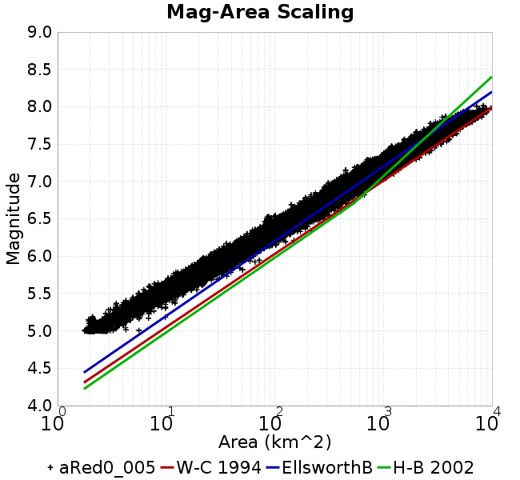 |  |
### Slip-Area Plots
*[(top)](#ared0_005)*

| Scatter | 2-D Hist |
|-----|-----|
| 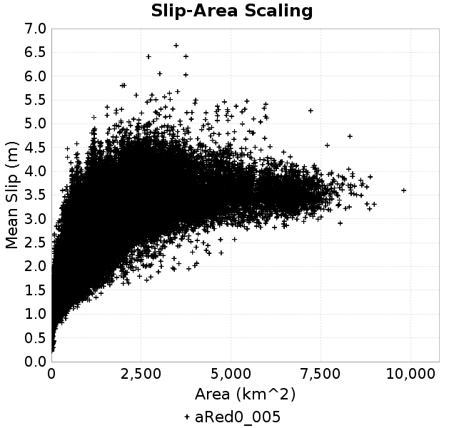 |  |
### Rupture Velocity Plots
*[(top)](#ared0_005)*

| **Scatter** |  |
|-----|-----|
| **Distance/Velocity** | 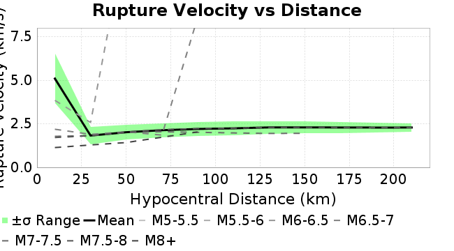 |
### Global Interevent-Time Distributions
*[(top)](#ared0_005)*

| **M≥6** | **M≥6.5** | **M≥7** | **M≥7.5** |
|-----|-----|-----|-----|
|  |  | 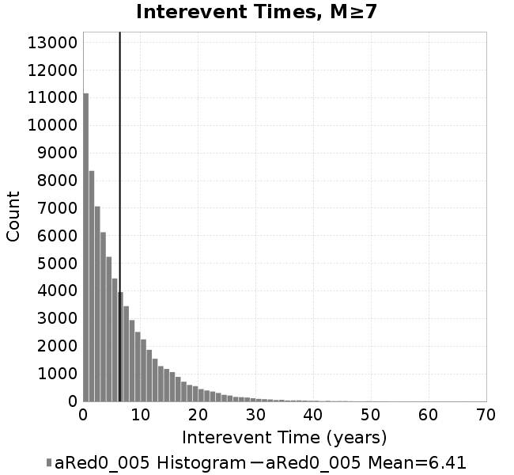 |  |
### Normalized Fault Interevent-Time Distributions
*[(top)](#ared0_005)*

|  | **M≥6** | **M≥6.5** | **M≥7** | **M≥7.5** |
|-----|-----|-----|-----|-----|
| **Elements** | 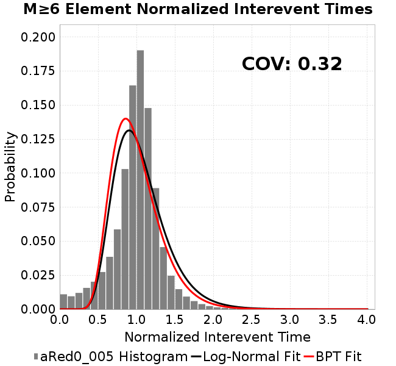 |  |  | 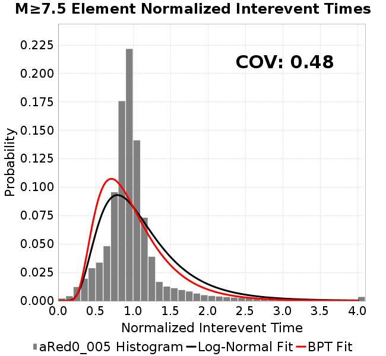 |
| **Subsections** | 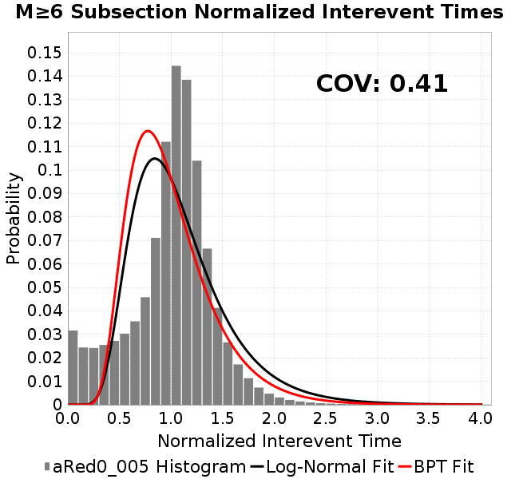 |  | 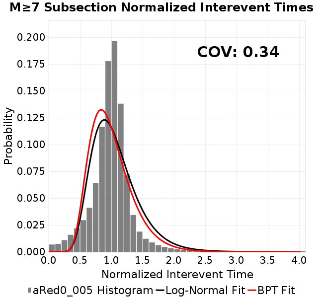 |  |
| **Sections** |  |  |  | 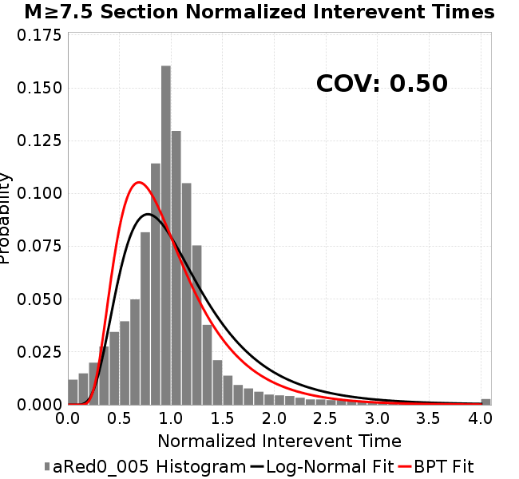 |
### Stationarity Plot
*[(top)](#ared0_005)*

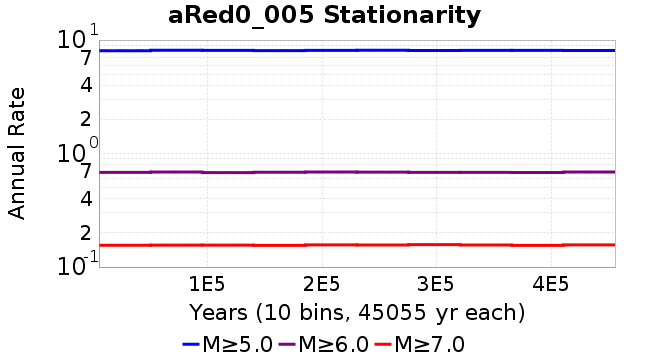
### Element/Subsection Interevent Time Comparisons

#### Element Interevent Time Comparisons
*[(top)](#ared0_005)*

| Min Mag | Scatter | 2-D Hist |
|-----|-----|-----|
| **M≥6.0** |  |  |
| **M≥6.5** | 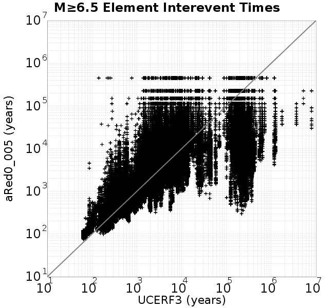 | 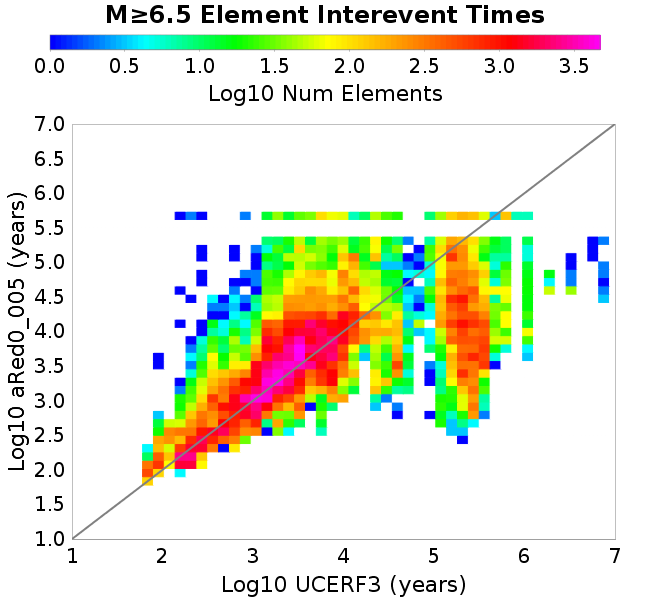 |
| **M≥7.0** | 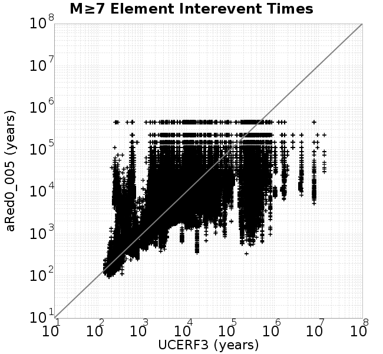 |  |
| **M≥7.5** |  | 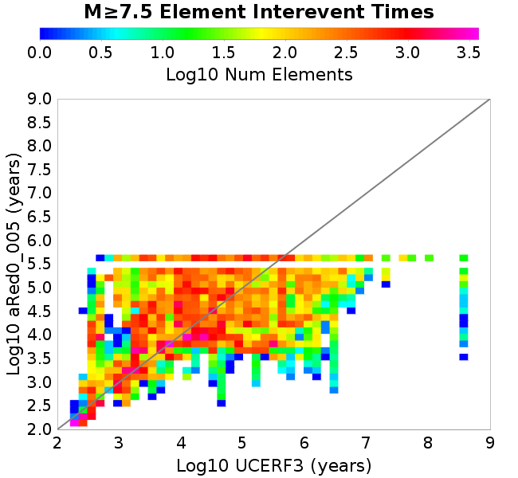 |

#### Subsection Interevent Time Comparisons
*[(top)](#ared0_005)*

*Subsections participate in a rupture if at least 20.0 % of its area ruptures*

| Min Mag | Scatter | 2-D Hist |
|-----|-----|-----|
| **M≥6.0** |  |  |
| **M≥6.5** | 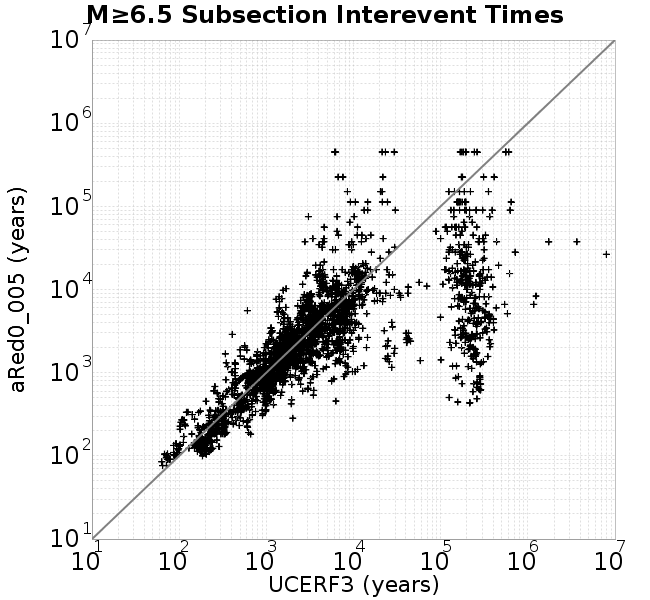 |  |
| **M≥7.0** |  |  |
| **M≥7.5** |  |  |

### Paleo Open Interval Plots
*[(top)](#ared0_005)*

#### Paleo Open Interval Plots, Biasi and Sharer 2019
*[(top)](#ared0_005)*

These plots use the 5 paleoseismic sites identified in Biasi & Scharer (2019) on the Hayward, N. SAF, S. SAF, and SJC faults. By default, a rupture is counted at a paleo site if the nearest element (at the surface) slips any amount. We also alternatively apply a probability of detection model. Those results are marked as 'Prob. Filtered'.

**Paleoseismic sites table:**

| **Site Name** | Data MRI (yr) | Data Annual Rate | Catalog MRI (yr) | Catalog Annual Rate | Catalog Occurences | Prob Filtered Catalog MRI (yr) | Prob Filtered Catalog Annual Rate | Prob Filtered Catalog Occurences |
|-----|-----|-----|-----|-----|-----|-----|-----|-----|
| **HOG** | 191.00 | 0.005235602 | 358.77 | 0.0027873362 | 1256 | 362.56 | 0.0027581519 | 1242.85 |
| **FRA** | 119.00 | 0.008403362 | 117.08 | 0.00854081 | 3848 | 122.48 | 0.008164325 | 3678.39 |
| **COA** | 181.00 | 0.005524862 | 175.66 | 0.005692897 | 2565 | 187.82 | 0.0053243367 | 2398.96 |
| **SCZ** | 106.00 | 0.009433962 | 119.69 | 0.00835518 | 3764 | 138.54 | 0.0072179055 | 3251.54 |
| **TYS** | 329.00 | 0.0030395137 | 344.82 | 0.002900046 | 1307 | 381.33 | 0.002622396 | 1181.76 |
| **TOTAL** | 31.61 | 0.0316373 | 35.36 | 0.028277777 | 12740 | 38.32 | 0.026098385 | 11758.19 |

**Paleoseismic Plots:**

|  | 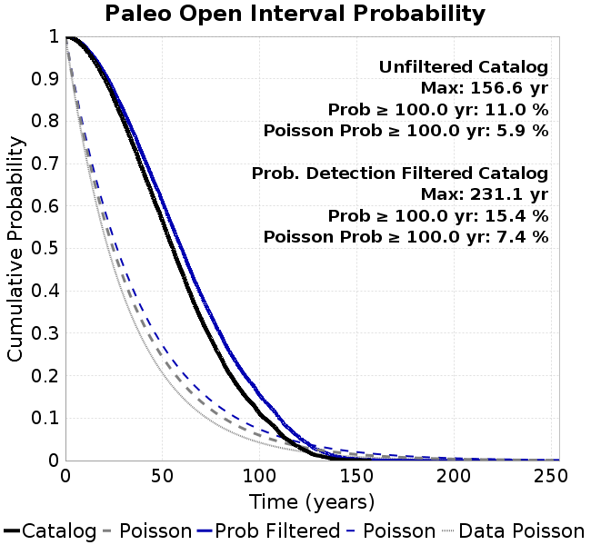 |
|-----|-----|

**Open interval probabilities table:**

| **Open Interval (yr)** | Catalog Probability | Catalog Poisson Probability | Prob. Filtered Catalog Probability | Prob. Filtered Catalog Poisson Probability | Data Poisson Probability |
|-----|-----|-----|-----|-----|-----|
| **10.00** | 0.97177994 | 0.75368726 | 0.9759167 | 0.77029335 | 0.72878754 |
| **20.00** | 0.9012036 | 0.5680445 | 0.9140394 | 0.59335184 | 0.53113127 |
| **30.00** | 0.79941595 | 0.42812788 | 0.8239707 | 0.457055 | 0.3870819 |
| **40.00** | 0.68189543 | 0.32267454 | 0.71837014 | 0.35206643 | 0.28210047 |
| **50.00** | 0.5638266 | 0.2431957 | 0.6094052 | 0.27119443 | 0.2055913 |
| **60.00** | 0.44368353 | 0.18329349 | 0.49704096 | 0.20889926 | 0.14983238 |
| **70.00** | 0.3327863 | 0.13814597 | 0.38863224 | 0.16091372 | 0.10919597 |
| **80.00** | 0.24293925 | 0.10411886 | 0.2960734 | 0.123950765 | 0.079580665 |
| **90.00** | 0.16706717 | 0.07847306 | 0.21657313 | 0.09547845 | 0.057997398 |
| **100.00** | 0.11049966 | 0.059144143 | 0.1537252 | 0.07354642 | 0.04226778 |
| **110.00** | 0.06644981 | 0.04457619 | 0.100405164 | 0.056652315 | 0.030804234 |
| **120.00** | 0.033193544 | 0.033596504 | 0.057014722 | 0.043638904 | 0.022449743 |
| **130.00** | 0.0114649795 | 0.025321258 | 0.025438596 | 0.033614755 | 0.016361093 |
| **140.00** | 0.0029893536 | 0.01908431 | 0.009878386 | 0.025893223 | 0.011923761 |
| **150.00** | 0.0010687646 | 0.014383601 | 0.0036623133 | 0.019945377 | 0.008689889 |
| **160.00** | 0.0 | 0.010840737 | 0.0015005433 | 0.015363792 | 0.0063330824 |
| **170.00** | 0.0 | 0.008170526 | 7.848603E-4 | 0.011834627 | 0.0046154717 |
| **180.00** | 0.0 | 0.006158021 | 4.4377643E-4 | 0.009116135 | 0.0033636983 |
| **190.00** | 0.0 | 0.004641222 | 2.2827483E-4 | 0.0070220977 | 0.0024514215 |
| **200.00** | 0.0 | 0.00349803 | 1.2624788E-4 | 0.0054090754 | 0.0017865654 |
| **210.00** | 0.0 | 0.0026364205 | 6.838323E-5 | 0.0041665747 | 0.0013020267 |
| **220.00** | 0.0 | 0.0019870366 | 1.6044703E-5 | 0.0032094847 | 9.489008E-4 |
| **230.00** | 0.0 | 0.0014976042 | 5.9815975E-6 | 0.002472245 | 6.915471E-4 |
| **240.00** | 0.0 | 0.0011287252 | 0.0 | 0.0019043537 | 5.039909E-4 |

#### Paleo Open Interval Plots, UCERF3
*[(top)](#ared0_005)*

These plots use the full set of UCERF3 paleoseismic sites. By default, a rupture is counted at a paleo site if the nearest element (at the surface) slips any amount. We also alternativeslyapply a probability of detection model. Those results are marked as 'Prob. Filtered'.

**Paleoseismic sites table:**

| **Site Name** | Data MRI (yr) | Data Annual Rate | Catalog MRI (yr) | Catalog Annual Rate | Catalog Occurences | Prob Filtered Catalog MRI (yr) | Prob Filtered Catalog Annual Rate | Prob Filtered Catalog Occurences |
|-----|-----|-----|-----|-----|-----|-----|-----|-----|
| **SSanAndreasBurroFlats** | 205.44 | 0.0048677 | 209.57 | 0.0047716475 | 2149 | 237.89 | 0.0042036413 | 1893.09 |
| **SSanAndreasIndio** | 277.37 | 0.0036053 | 172.50 | 0.005797252 | 2612 | 183.12 | 0.0054607997 | 2460.42 |
| **SSAFMCreek1000Palms** | 261.33 | 0.0038266 | 1587.85 | 6.29783E-4 | 283 | 2294.43 | 4.358385E-4 | 195.64 |
| **NSanAndreasFortRoss** | 306.28 | 0.003265 | 186.69 | 0.0053564487 | 2414 | 189.33 | 0.0052819154 | 2380.39 |
| **NSanAndreasNorthCoast** | 263.87 | 0.0037898 | 178.91 | 0.0055895303 | 2519 | 183.67 | 0.0054445923 | 2453.69 |
| **CalaverasfaultNorth** | 618.05 | 0.001618 | 166.17 | 0.0060180565 | 2710 | 238.10 | 0.0041998806 | 1891.15 |
| **ElsinoreTemecula** | 1019.16 | 9.812E-4 | 678.77 | 0.0014732623 | 663 | 707.54 | 0.0014133457 | 636.02 |
| **ElsinoreWhittier** | 3196.93 | 3.128E-4 | 1512.19 | 6.6129304E-4 | 297 | 1589.92 | 6.289612E-4 | 282.5 |
| **SSAFCarrizoBidart** | 114.71 | 0.0087179 | 120.69 | 0.008285496 | 3733 | 124.28 | 0.008046392 | 3625.25 |
| **SanJacintoHogLake** | 311.78 | 0.0032074 | 358.77 | 0.0027873362 | 1256 | 362.73 | 0.0027569057 | 1242.28 |
| **PuenteHills** | 3506.31 | 2.852E-4 | 4940.23 | 2.0241967E-4 | 91 | 5423.19 | 1.8439343E-4 | 82.83 |
| **SanGregorioNorth** | 1019.06 | 9.813E-4 | 389.00 | 0.0025706831 | 1158 | 403.28 | 0.0024796657 | 1116.94 |
| **SanJacintoSuperstition** | 508.26 | 0.0019675 | 1190.03 | 8.403134E-4 | 379 | 1272.05 | 7.861349E-4 | 354.53 |
| **SSanAndreasWrightwood** | 106.04 | 0.0094304 | 151.64 | 0.0065945885 | 2971 | 153.49 | 0.006515174 | 2935.18 |
| **SSanAndreasPitmanCanyon** | 173.48 | 0.0057643 | 141.35 | 0.0070748245 | 3187 | 156.89 | 0.0063738246 | 2871.14 |
| **SSanAndreasPlungeCreek** | 205.36 | 0.0048695 | 357.68 | 0.0027957682 | 1258 | 441.88 | 0.0022630705 | 1018.31 |
| **FrazierMountianSSAF** | 148.57 | 0.0067307 | 117.08 | 0.00854081 | 3848 | 122.51 | 0.008162461 | 3677.55 |
| **NSanAndreasSantaCruzSeg** | 109.84 | 0.0091041 | 119.69 | 0.00835518 | 3764 | 138.60 | 0.00721503 | 3250.33 |
| **RodgersCreek** | 325.31 | 0.003074 | 165.09 | 0.0060573705 | 2729 | 224.91 | 0.004446176 | 2002.85 |
| **GreenValleyMasonRoad** | 293.31 | 0.0034094 | 1679.85 | 5.952916E-4 | 268 | 2295.15 | 4.3570204E-4 | 195.77 |
| **HaywardfaultNorth** | 318.34 | 0.0031413 | 367.31 | 0.0027225167 | 1226 | 378.46 | 0.0026422874 | 1189.89 |
| **HaywardfaultSouth** | 167.57 | 0.0059677 | 344.82 | 0.002900046 | 1307 | 381.19 | 0.0026233497 | 1182.31 |
| **Compton** | 2658.16 | 3.762E-4 | 5700.27 | 1.7543038E-4 | 79 | 6407.08 | 1.560774E-4 | 70.33 |
| **SSanAndreasCoachella** | 178.45 | 0.0056037 | 175.66 | 0.005692897 | 2565 | 187.66 | 0.005328803 | 2400.96 |
| **ElsinoreGlenIvy** | 179.12 | 0.0055828 | 550.09 | 0.001817887 | 819 | 598.47 | 0.0016709216 | 752.71 |
| **GarlockCentralallevents** | 1434.93 | 6.969E-4 | 631.29 | 0.0015840492 | 714 | 641.89 | 0.0015578972 | 702.22 |
| **NSanAndreasAlderCreek** | 869.64 | 0.0011499 | 186.07 | 0.005374207 | 2422 | 189.04 | 0.00528998 | 2384.03 |
| **SSanAndreasPallettCreek** | 149.30 | 0.006698 | 151.64 | 0.0065945885 | 2971 | 153.42 | 0.0065178997 | 2936.44 |
| **GarlockWesternallevents** | 1230.16 | 8.129E-4 | 811.44 | 0.0012323769 | 555 | 832.03 | 0.0012018789 | 541.29 |
| **ElsinoreFaultJulian** | 3250.98 | 3.076E-4 | 1245.07 | 8.031665E-4 | 361 | 1273.63 | 7.851576E-4 | 352.87 |
| **TOTAL** | 9.08 | 0.1101451 | 14.19 | 0.07049267 | 31759 | 15.73 | 0.063571185 | 28640.76 |

**Paleoseismic Plots:**

|  |  |
|-----|-----|

**Open interval probabilities table:**

| **Open Interval (yr)** | Catalog Probability | Catalog Poisson Probability | Prob. Filtered Catalog Probability | Prob. Filtered Catalog Poisson Probability | Data Poisson Probability |
|-----|-----|-----|-----|-----|-----|
| **10.00** | 0.8499838 | 0.4941448 | 0.8732124 | 0.52955836 | 0.33238843 |
| **20.00** | 0.5905346 | 0.24417907 | 0.6395948 | 0.28043208 | 0.110482074 |
| **30.00** | 0.36054856 | 0.12065982 | 0.41747963 | 0.14850515 | 0.036722966 |
| **40.00** | 0.20217969 | 0.05962342 | 0.25279528 | 0.07864215 | 0.012206289 |
| **50.00** | 0.10661046 | 0.029462604 | 0.14382067 | 0.04164561 | 0.004057229 |
| **60.00** | 0.05042728 | 0.014558792 | 0.0748637 | 0.022053782 | 0.001348576 |
| **70.00** | 0.022079011 | 0.007194151 | 0.036740117 | 0.011678765 | 4.4825108E-4 |
| **80.00** | 0.009164593 | 0.0035549523 | 0.015820332 | 0.0061845877 | 1.4899348E-4 |
| **90.00** | 0.0043735486 | 0.0017566612 | 0.007409479 | 0.0032751004 | 4.952371E-5 |
| **100.00** | 0.0015080124 | 8.6804497E-4 | 0.0030077875 | 0.0017343569 | 1.6461108E-5 |
| **110.00** | 8.1362436E-4 | 4.289399E-4 | 0.0012440046 | 9.184432E-4 | 5.4714824E-6 |
| **120.00** | 0.0 | 2.1195842E-4 | 1.6484458E-4 | 4.863693E-4 | 1.8186574E-6 |
| **130.00** | 0.0 | 1.0473815E-4 | 4.0654446E-5 | 2.5756093E-4 | 6.045007E-7 |
| **140.00** | 0.0 | 5.175581E-5 | 0.0 | 1.3639356E-4 | 2.0092905E-7 |

### Moment Release Variability Plots
*[(top)](#ared0_005)*

We first create a tapered moment release time series for the entire catalog. Each event's moment is distributed across a 25 year Hanning (cosine) taper. Here is a plot of a random 2,000 year section of this time series:

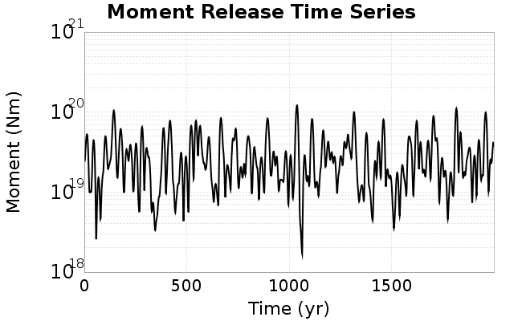

We then compute Welch's power spectral density estimate on the entire time series. Results are plotted below, with a Poisson randomization of the catalog also plotted in gray as a control. Significant deviations above the Poisson model indicate synchronization at that period.


## Input File
*[(top)](#ared0_005)*

```
  A_1 = 0.001
  fA = 0.005
  B_1 = 0.008
  muSlipAmp_1 = .0
  muSlipInvDist_1 = 1.0
  cohesion = 0.0
  Dc_1 = 1.0000000000000000818e-05
  mu0_1 = 0.6
  ddotStar_1 = 9.9999999999999995475e-07
  ddotAB_1 = 9.9999999999999995475e-07
  alpha_1 = 0.0
  theta0_1 = 200000000
  tau0_1 = 55.1
  sigma0_1 = 100
  sigmaFracPin = .5
  lowSigmaAction = 1
  maxThetaPin = 1.0e13
  ddotEQ_1 = 1
  ddotEQFname = 
  stressOvershootFactor = 0.10000000000000000555
  lameLambda = 30000
  lameMu = 30000
  slowSlip_1 = 0
  nEq = 100000000000
  KZeroFrac = 0
  muPin = 1.0
  tStart = 0
  maxT = 3.16e13
  maxWallTime = 169200
  maxTrans = 1.0000000000000000159e100
  faultFname = UCERF3FM.15km.1km.tri.flt
  outFnameInfix = aRed0_005
  writeTau = 2
  writeSigma = 2
  writeSlip = 0
  writeSlipSpeed = 0
  writeState = 0
  writeTheta = 2
  writePED = 1
  writeTransitions = 1
  minDtWrite = 0
  minDtWriteCoseismic = 0
  minDtWriteInterseismic = 0
  minMagWrite = 7.7
  writeStiffness = 0
  stressRateSpecification = 1
  dMu3 = 0.01000000000000000
  initTauFname = 
  initSigmaFname = 
  initThetaFname = 
  initSlipSpeedFname = 
  AFname = 
  BFname =  
  DcFname = 
  mu0Fname = 
  ddotStarFname = 
  ddotABFname = 
  alphaFname = 
  KTauFname = /u/sciteam/gilchris/scratch/stiffness_25a589d/Ktau.25a589d.out
  KSigmaFname = /u/sciteam/gilchris/scratch/stiffness_25a589d/Ksigma.25a589d.out
  tFailFname = 
  tauFailFname = 
  tauDotFname = 
  sigmaDotFname =
  KZeroFname = UCERF3FM.15km.1km.tri.KZero
  pinnedFname =  UCERF3FM.15km.1km.tri.pin
  neighborFname = UCERF3FM.15km.1km.tri.neighbors
  stressRateFname =  
  slowSlipFname = 
  writePatchFname = 
  DEBUG = 0
  ZBrentUpperBracket = 0
  receiverElementAreaFrac = 0.8
  receiverElementIntTol = 1.0e-4
  receiverElementSubdivisionMax = 4
  tgfDist1 = 3
  tgfDist1 = 10
  lowSigmaAction = 1
  highSigmaAction = 0
```
