# aRed0_05
## Metadata
| **Catalog** | aRed0_05 |
|-----|-----|
| **Author** | Jaqcui Gilchrist, 2018/09/27 |
| **Description** | a reduction factor: fA=0.05 |
| **Fault/Def Model** | Fault Model 3.1, Geologic |
| **Slip Velocity** | 1.0 m/s |
| **Average Element Area** | 1.35 km^2 |
| **Length** | 7,979,436 events in 451,945 years |
| **Frictional Params** | a=0.001, b=0.008, (b-a)=0.007, ddotEQ=1 |

* [Metadata](#metadata)
* [Plots](#plots)
  * [Magnitude-Frequency Plot](#magnitude-frequency-plot)
  * [Magnitude-Area Plots](#magnitude-area-plots)
  * [Slip-Area Plots](#slip-area-plots)
  * [Rupture Velocity Plots](#rupture-velocity-plots)
  * [Global Interevent-Time Distributions](#global-interevent-time-distributions)
  * [Normalized Fault Interevent-Time Distributions](#normalized-fault-interevent-time-distributions)
  * [Stationarity Plot](#stationarity-plot)
  * [Element/Subsection Interevent Time Comparisons](#elementsubsection-interevent-time-comparisons)
    * [Element Interevent Time Comparisons](#element-interevent-time-comparisons)
    * [Subsection Interevent Time Comparisons](#subsection-interevent-time-comparisons)
  * [Paleo Open Interval Plots](#paleo-open-interval-plots)
    * [Paleo Open Interval Plots, Biasi and Sharer 2019](#paleo-open-interval-plots-biasi-and-sharer-2019)
    * [Paleo Open Interval Plots, UCERF3](#paleo-open-interval-plots-ucerf3)
  * [Moment Release Variability Plots](#moment-release-variability-plots)
* [Input File](#input-file)

## Plots
### Magnitude-Frequency Plot
*[(top)](#ared0_05)*


### Magnitude-Area Plots
*[(top)](#ared0_05)*

| Scatter | 2-D Hist |
|-----|-----|
| 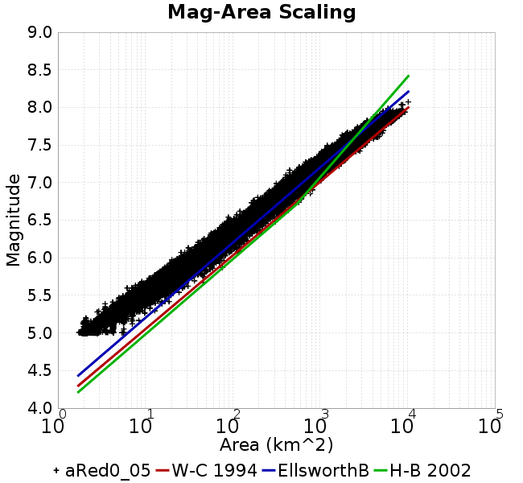 |  |
### Slip-Area Plots
*[(top)](#ared0_05)*

| Scatter | 2-D Hist |
|-----|-----|
|  | 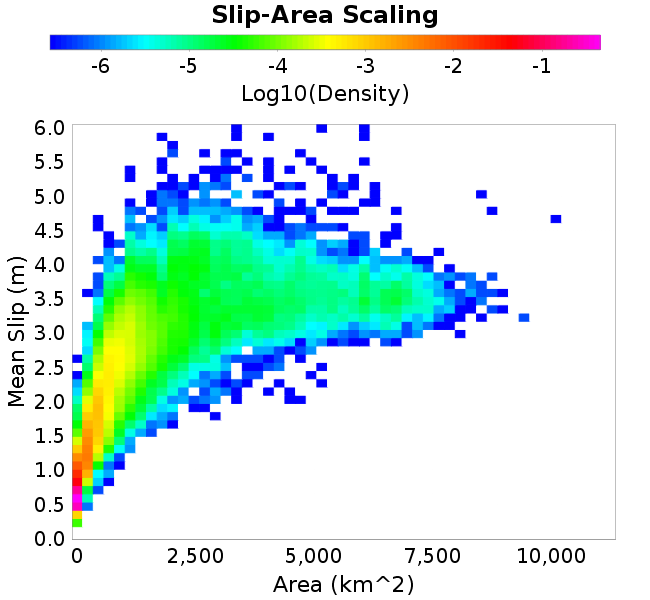 |
### Rupture Velocity Plots
*[(top)](#ared0_05)*

| **Scatter** | 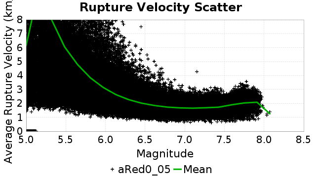 |
|-----|-----|
| **Distance/Velocity** | 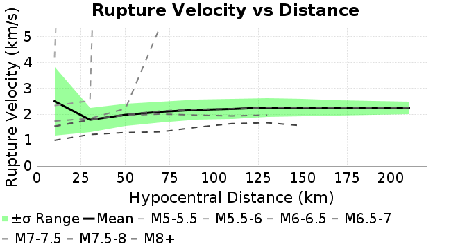 |
### Global Interevent-Time Distributions
*[(top)](#ared0_05)*

| **M≥6** | **M≥6.5** | **M≥7** | **M≥7.5** |
|-----|-----|-----|-----|
|  | 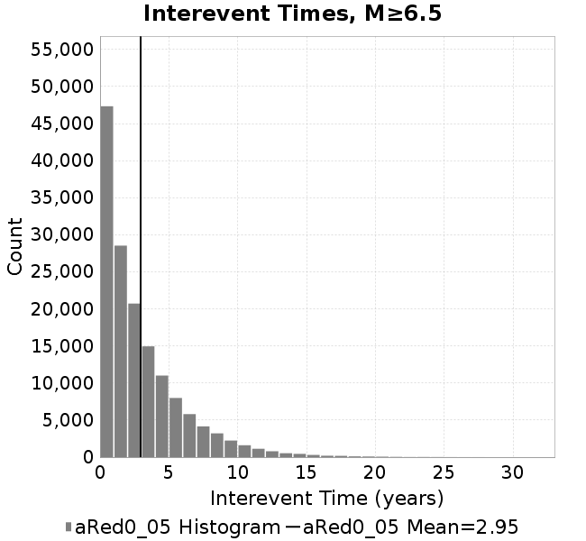 |  | 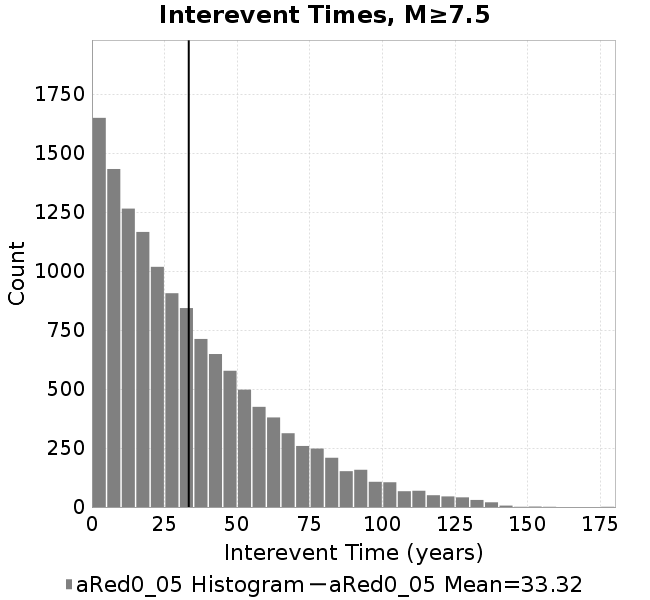 |
### Normalized Fault Interevent-Time Distributions
*[(top)](#ared0_05)*

|  | **M≥6** | **M≥6.5** | **M≥7** | **M≥7.5** |
|-----|-----|-----|-----|-----|
| **Elements** | 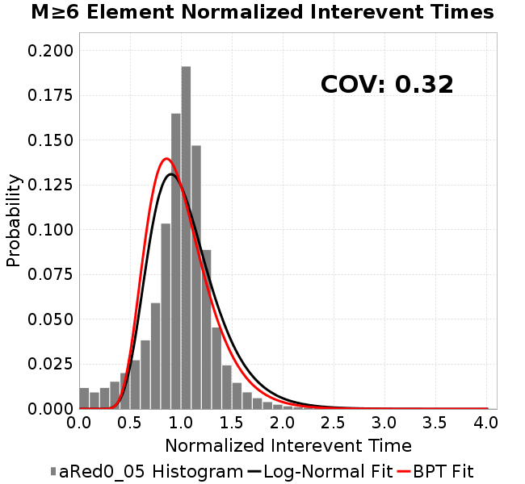 | 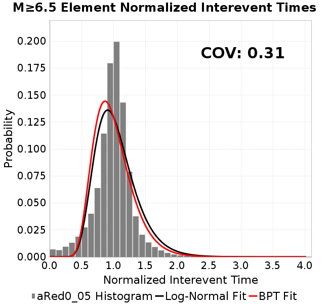 | 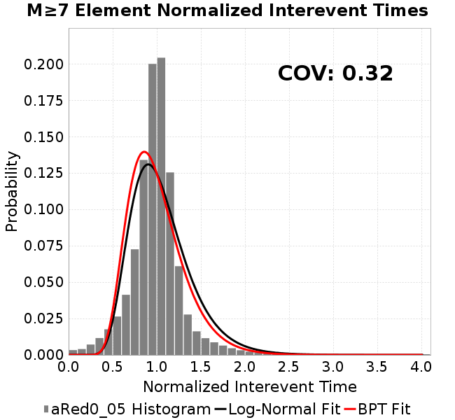 |  |
| **Subsections** |  |  | 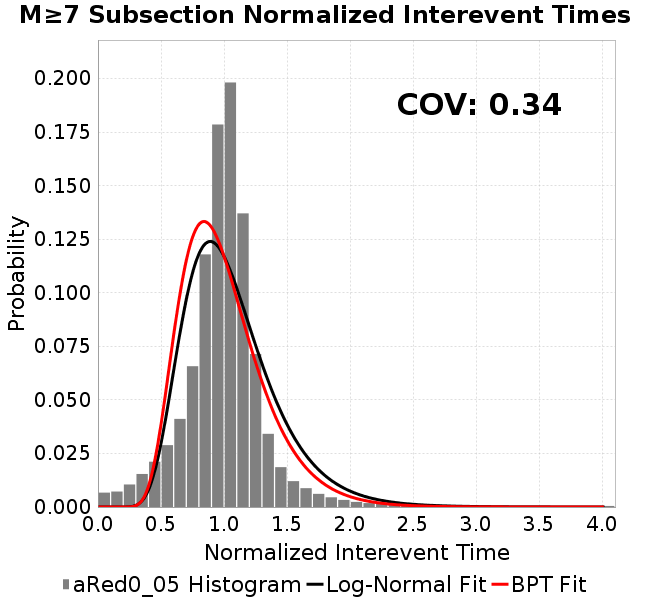 | 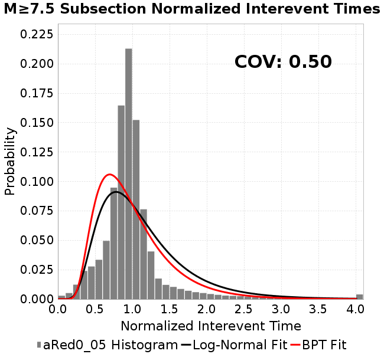 |
| **Sections** |  |  | 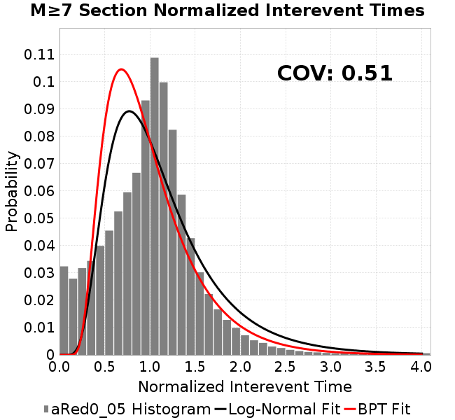 |  |
### Stationarity Plot
*[(top)](#ared0_05)*

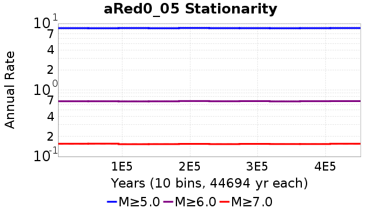
### Element/Subsection Interevent Time Comparisons

#### Element Interevent Time Comparisons
*[(top)](#ared0_05)*

| Min Mag | Scatter | 2-D Hist |
|-----|-----|-----|
| **M≥6.0** |  |  |
| **M≥6.5** | 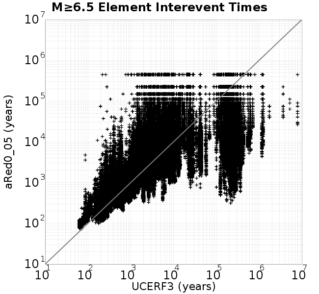 | 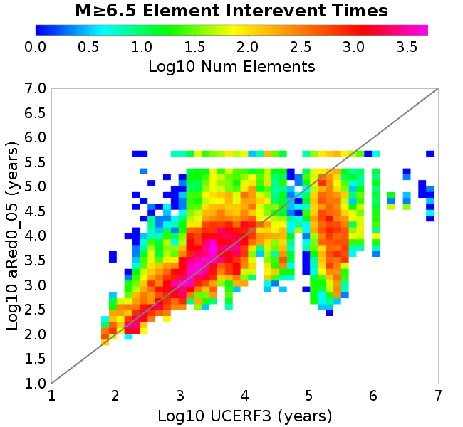 |
| **M≥7.0** |  |  |
| **M≥7.5** |  |  |

#### Subsection Interevent Time Comparisons
*[(top)](#ared0_05)*

*Subsections participate in a rupture if at least 20.0 % of its area ruptures*

| Min Mag | Scatter | 2-D Hist |
|-----|-----|-----|
| **M≥6.0** | 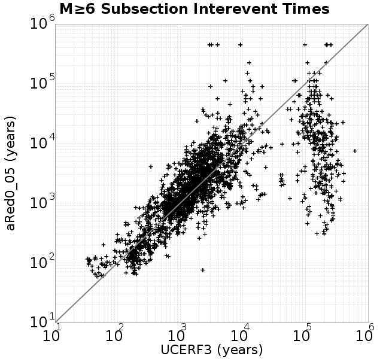 |  |
| **M≥6.5** | 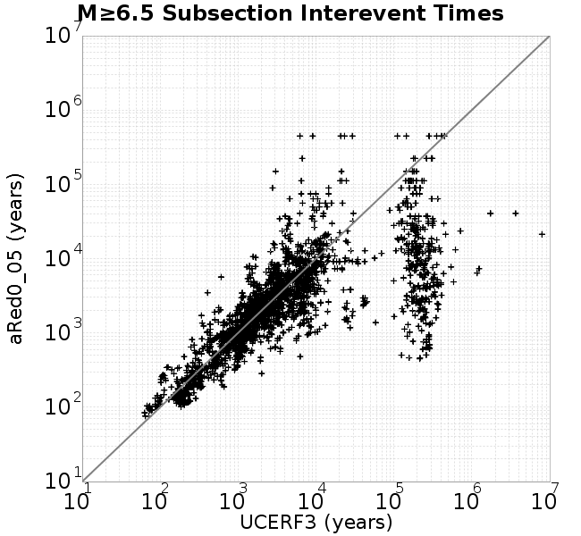 |  |
| **M≥7.0** | 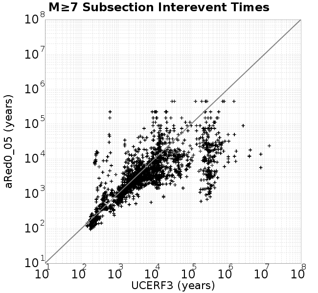 |  |
| **M≥7.5** |  |  |

### Paleo Open Interval Plots
*[(top)](#ared0_05)*

#### Paleo Open Interval Plots, Biasi and Sharer 2019
*[(top)](#ared0_05)*

These plots use the 5 paleoseismic sites identified in Biasi & Scharer (2019) on the Hayward, N. SAF, S. SAF, and SJC faults. By default, a rupture is counted at a paleo site if the nearest element (at the surface) slips any amount. We also alternatively apply a probability of detection model. Those results are marked as 'Prob. Filtered'.

**Paleoseismic sites table:**

| **Site Name** | Data MRI (yr) | Data Annual Rate | Catalog MRI (yr) | Catalog Annual Rate | Catalog Occurences | Prob Filtered Catalog MRI (yr) | Prob Filtered Catalog Annual Rate | Prob Filtered Catalog Occurences |
|-----|-----|-----|-----|-----|-----|-----|-----|-----|
| **HOG** | 191.00 | 0.005235602 | 357.84 | 0.002794578 | 1250 | 361.76 | 0.0027642394 | 1236.42 |
| **FRA** | 119.00 | 0.008403362 | 117.38 | 0.008519059 | 3807 | 122.70 | 0.0081499275 | 3642.06 |
| **COA** | 181.00 | 0.005524862 | 174.03 | 0.0057461327 | 2568 | 186.37 | 0.005365639 | 2397.92 |
| **SCZ** | 106.00 | 0.009433962 | 121.32 | 0.008242583 | 3684 | 140.05 | 0.00714008 | 3191.06 |
| **TYS** | 329.00 | 0.0030395137 | 348.83 | 0.0028667154 | 1281 | 383.06 | 0.0026105696 | 1166.51 |
| **TOTAL** | 31.61 | 0.0316373 | 35.51 | 0.02816019 | 12587 | 38.40 | 0.026038371 | 11638.64 |

**Paleoseismic Plots:**

| 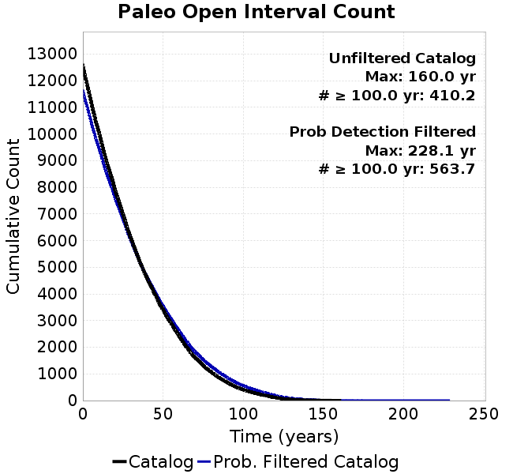 | 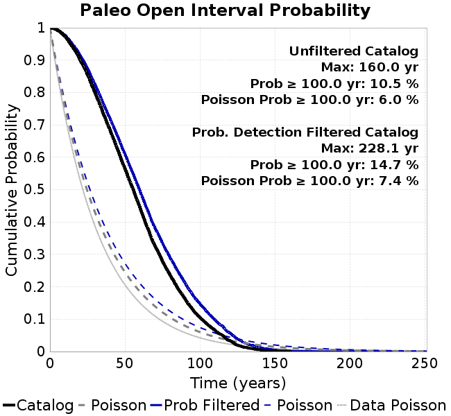 |
|-----|-----|

**Open interval probabilities table:**

| **Open Interval (yr)** | Catalog Probability | Catalog Poisson Probability | Prob. Filtered Catalog Probability | Prob. Filtered Catalog Poisson Probability | Data Poisson Probability |
|-----|-----|-----|-----|-----|-----|
| **10.00** | 0.97327346 | 0.754574 | 0.9770007 | 0.77075577 | 0.72878754 |
| **20.00** | 0.9018162 | 0.56938195 | 0.91492337 | 0.5940645 | 0.53113127 |
| **30.00** | 0.7998807 | 0.42964083 | 0.8246442 | 0.45787865 | 0.3870819 |
| **40.00** | 0.6848154 | 0.3241958 | 0.72008157 | 0.3529126 | 0.28210047 |
| **50.00** | 0.56460375 | 0.24462973 | 0.60932654 | 0.27200943 | 0.2055913 |
| **60.00** | 0.44421622 | 0.18459123 | 0.49555218 | 0.20965286 | 0.14983238 |
| **70.00** | 0.32617798 | 0.13928775 | 0.381485 | 0.16159114 | 0.10919597 |
| **80.00** | 0.23581633 | 0.10510291 | 0.28981853 | 0.12454731 | 0.079580665 |
| **90.00** | 0.16267467 | 0.07930793 | 0.2115017 | 0.09599556 | 0.057997398 |
| **100.00** | 0.10513416 | 0.0598437 | 0.14727253 | 0.07398914 | 0.04226778 |
| **110.00** | 0.06612729 | 0.0451565 | 0.09826465 | 0.057027552 | 0.030804234 |
| **120.00** | 0.033344354 | 0.034073923 | 0.057060916 | 0.043954317 | 0.022449743 |
| **130.00** | 0.01272741 | 0.025711298 | 0.026443878 | 0.033878043 | 0.016361093 |
| **140.00** | 0.005577287 | 0.019401077 | 0.012892244 | 0.026111698 | 0.011923761 |
| **150.00** | 0.001574335 | 0.014639548 | 0.004874509 | 0.020125743 | 0.008689889 |
| **160.00** | 3.5939369E-4 | 0.011046623 | 0.0016967413 | 0.015512032 | 0.0063330824 |
| **170.00** | 0.0 | 0.008335494 | 7.212063E-4 | 0.011955989 | 0.0046154717 |
| **180.00** | 0.0 | 0.0062897475 | 3.7462372E-4 | 0.009215148 | 0.0033636983 |
| **190.00** | 0.0 | 0.00474608 | 2.1045709E-4 | 0.0071026287 | 0.0024514215 |
| **200.00** | 0.0 | 0.0035812687 | 1.1167269E-4 | 0.005474392 | 0.0017865654 |
| **210.00** | 0.0 | 0.0027023323 | 4.866363E-5 | 0.0042194193 | 0.0013020267 |
| **220.00** | 0.0 | 0.0020391098 | 2.8258954E-5 | 0.0032521419 | 9.489008E-4 |
| **230.00** | 0.0 | 0.0015386592 | 0.0 | 0.0025066072 | 6.915471E-4 |

#### Paleo Open Interval Plots, UCERF3
*[(top)](#ared0_05)*

These plots use the full set of UCERF3 paleoseismic sites. By default, a rupture is counted at a paleo site if the nearest element (at the surface) slips any amount. We also alternativeslyapply a probability of detection model. Those results are marked as 'Prob. Filtered'.

**Paleoseismic sites table:**

| **Site Name** | Data MRI (yr) | Data Annual Rate | Catalog MRI (yr) | Catalog Annual Rate | Catalog Occurences | Prob Filtered Catalog MRI (yr) | Prob Filtered Catalog Annual Rate | Prob Filtered Catalog Occurences |
|-----|-----|-----|-----|-----|-----|-----|-----|-----|
| **SSanAndreasBurroFlats** | 205.44 | 0.0048677 | 211.75 | 0.004722485 | 2111 | 239.42 | 0.004176816 | 1867.01 |
| **SSanAndreasIndio** | 277.37 | 0.0036053 | 169.93 | 0.0058849175 | 2630 | 180.94 | 0.0055266838 | 2469.89 |
| **SSAFMCreek1000Palms** | 261.33 | 0.0038266 | 1602.56 | 6.239998E-4 | 279 | 2325.25 | 4.3006171E-4 | 191.95 |
| **NSanAndreasFortRoss** | 306.28 | 0.003265 | 186.79 | 0.005353514 | 2393 | 189.65 | 0.0052729016 | 2356.96 |
| **NSanAndreasNorthCoast** | 263.87 | 0.0037898 | 179.95 | 0.0055571804 | 2484 | 184.30 | 0.005425974 | 2425.36 |
| **CalaverasfaultNorth** | 618.05 | 0.001618 | 163.71 | 0.0061083026 | 2730 | 236.24 | 0.0042329403 | 1891.77 |
| **ElsinoreTemecula** | 1019.16 | 9.812E-4 | 687.48 | 0.001454584 | 650 | 714.61 | 0.0013993665 | 625.13 |
| **ElsinoreWhittier** | 3196.93 | 3.128E-4 | 1535.39 | 6.512997E-4 | 291 | 1606.96 | 6.222911E-4 | 277.94 |
| **SSAFCarrizoBidart** | 114.71 | 0.0087179 | 119.92 | 0.008338589 | 3727 | 123.58 | 0.00809221 | 3616.85 |
| **SanJacintoHogLake** | 311.78 | 0.0032074 | 357.84 | 0.002794578 | 1250 | 361.73 | 0.002764459 | 1236.51 |
| **PuenteHills** | 3506.31 | 2.852E-4 | 4700.10 | 2.127613E-4 | 95 | 5222.95 | 1.914626E-4 | 85.41 |
| **SanGregorioNorth** | 1019.06 | 9.813E-4 | 388.62 | 0.0025732089 | 1150 | 402.38 | 0.0024852084 | 1110.66 |
| **SanJacintoSuperstition** | 508.26 | 0.0019675 | 1181.67 | 8.4626285E-4 | 379 | 1272.86 | 7.856348E-4 | 351.74 |
| **SSanAndreasWrightwood** | 106.04 | 0.0094304 | 151.81 | 0.006587386 | 2944 | 153.53 | 0.0065132743 | 2910.87 |
| **SSanAndreasPitmanCanyon** | 173.48 | 0.0057643 | 141.83 | 0.007050719 | 3151 | 157.78 | 0.006337893 | 2832.45 |
| **SSanAndreasPlungeCreek** | 205.36 | 0.0048695 | 356.53 | 0.002804784 | 1254 | 441.64 | 0.0022643008 | 1012.3 |
| **FrazierMountianSSAF** | 148.57 | 0.0067307 | 117.38 | 0.008519059 | 3807 | 122.65 | 0.008153327 | 3643.58 |
| **NSanAndreasSantaCruzSeg** | 109.84 | 0.0091041 | 121.32 | 0.008242583 | 3684 | 139.77 | 0.0071546696 | 3197.59 |
| **RodgersCreek** | 325.31 | 0.003074 | 167.60 | 0.0059665455 | 2666 | 227.91 | 0.004387767 | 1960.5 |
| **GreenValleyMasonRoad** | 293.31 | 0.0034094 | 1686.61 | 5.929036E-4 | 264 | 2310.23 | 4.3285685E-4 | 192.38 |
| **HaywardfaultNorth** | 318.34 | 0.0031413 | 370.58 | 0.0026984725 | 1206 | 380.43 | 0.0026286214 | 1174.78 |
| **HaywardfaultSouth** | 167.57 | 0.0059677 | 348.83 | 0.0028667154 | 1281 | 383.20 | 0.002609605 | 1166.1 |
| **Compton** | 2658.16 | 3.762E-4 | 6261.24 | 1.5971265E-4 | 71 | 6818.27 | 1.4666481E-4 | 65.14 |
| **SSanAndreasCoachella** | 178.45 | 0.0056037 | 174.03 | 0.0057461327 | 2568 | 186.20 | 0.0053707096 | 2400.18 |
| **ElsinoreGlenIvy** | 179.12 | 0.0055828 | 576.55 | 0.0017344543 | 775 | 621.30 | 0.0016095174 | 719.08 |
| **GarlockCentralallevents** | 1434.93 | 6.969E-4 | 629.55 | 0.0015884392 | 710 | 640.87 | 0.0015603895 | 697.48 |
| **NSanAndreasAlderCreek** | 869.64 | 0.0011499 | 187.97 | 0.0053199427 | 2378 | 190.72 | 0.0052433745 | 2343.74 |
| **SSanAndreasPallettCreek** | 149.30 | 0.006698 | 151.55 | 0.006598578 | 2949 | 153.29 | 0.0065235025 | 2915.45 |
| **GarlockWesternallevents** | 1230.16 | 8.129E-4 | 823.64 | 0.0012141255 | 543 | 844.26 | 0.0011844676 | 529.75 |
| **ElsinoreFaultJulian** | 3250.98 | 3.076E-4 | 1250.08 | 7.9994573E-4 | 357 | 1276.41 | 7.8345E-4 | 349.64 |
| **TOTAL** | 9.08 | 0.1101451 | 14.33 | 0.069796376 | 31196 | 15.88 | 0.062978916 | 28148.94 |

**Paleoseismic Plots:**

| 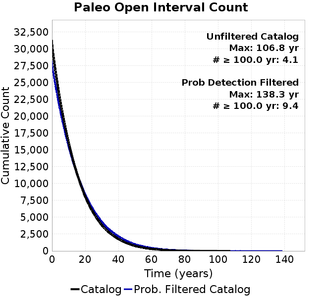 |  |
|-----|-----|

**Open interval probabilities table:**

| **Open Interval (yr)** | Catalog Probability | Catalog Poisson Probability | Prob. Filtered Catalog Probability | Prob. Filtered Catalog Poisson Probability | Data Poisson Probability |
|-----|-----|-----|-----|-----|-----|
| **10.00** | 0.8546094 | 0.49759752 | 0.8767139 | 0.5327041 | 0.33238843 |
| **20.00** | 0.5940037 | 0.24760328 | 0.64400786 | 0.28377366 | 0.110482074 |
| **30.00** | 0.3620588 | 0.12320678 | 0.42057917 | 0.1511674 | 0.036722966 |
| **40.00** | 0.2048813 | 0.06130739 | 0.2558231 | 0.080527484 | 0.012206289 |
| **50.00** | 0.1018702 | 0.030506404 | 0.13902268 | 0.04289732 | 0.004057229 |
| **60.00** | 0.04676914 | 0.015179911 | 0.07124806 | 0.022851579 | 0.001348576 |
| **70.00** | 0.019595003 | 0.0075534857 | 0.033335224 | 0.012173129 | 4.4825108E-4 |
| **80.00** | 0.0065186825 | 0.0037585958 | 0.014050208 | 0.006484676 | 1.4899348E-4 |
| **90.00** | 0.002661053 | 0.0018702679 | 0.006197165 | 0.0034544135 | 4.952371E-5 |
| **100.00** | 9.6440583E-4 | 9.306407E-4 | 0.0022271103 | 0.0018401801 | 1.6461108E-5 |
| **110.00** | 0.0 | 4.630845E-4 | 3.875179E-4 | 9.802715E-4 | 5.4714824E-6 |
| **120.00** | 0.0 | 2.304297E-4 | 5.448068E-5 | 5.2219466E-4 | 1.8186574E-6 |
| **130.00** | 0.0 | 1.1466124E-4 | 2.5504247E-5 | 2.7817523E-4 | 6.045007E-7 |
| **140.00** | 0.0 | 5.705515E-5 | 0.0 | 1.4818508E-4 | 2.0092905E-7 |

### Moment Release Variability Plots
*[(top)](#ared0_05)*

We first create a tapered moment release time series for the entire catalog. Each event's moment is distributed across a 25 year Hanning (cosine) taper. Here is a plot of a random 2,000 year section of this time series:


We then compute Welch's power spectral density estimate on the entire time series. Results are plotted below, with a Poisson randomization of the catalog also plotted in a gray line, and the 95% confidence bounds from 200 realizations as a light gray shaded area. Significant deviations outside the Poisson confidence intervals indicate synchronous behaviour.


## Input File
*[(top)](#ared0_05)*

```
  A_1 = 0.001
  fA = 0.05
  B_1 = 0.008
  muSlipAmp_1 = .0
  muSlipInvDist_1 = 1.0
  cohesion = 0.0
  Dc_1 = 1.0000000000000000818e-05
  mu0_1 = 0.6
  ddotStar_1 = 9.9999999999999995475e-07
  ddotAB_1 = 9.9999999999999995475e-07
  alpha_1 = 0.0
  theta0_1 = 200000000
  tau0_1 = 55.1
  sigma0_1 = 100
  sigmaFracPin = .5
  lowSigmaAction = 1
  maxThetaPin = 1.0e13
  ddotEQ_1 = 1
  ddotEQFname = 
  stressOvershootFactor = 0.10000000000000000555
  lameLambda = 30000
  lameMu = 30000
  slowSlip_1 = 0
  nEq = 100000000000
  KZeroFrac = 0
  muPin = 1.0
  tStart = 0
  maxT = 3.16e13
  maxWallTime = 169200
  maxTrans = 1.0000000000000000159e100
  faultFname = UCERF3FM.15km.1km.tri.flt
  outFnameInfix = aRed0_05
  writeTau = 2
  writeSigma = 2
  writeSlip = 0
  writeSlipSpeed = 0
  writeState = 0
  writeTheta = 2
  writePED = 1
  writeTransitions = 1
  minDtWrite = 0
  minDtWriteCoseismic = 0
  minDtWriteInterseismic = 0
  minMagWrite = 7.7
  writeStiffness = 0
  stressRateSpecification = 1
  dMu3 = 0.01000000000000000
  initTauFname = 
  initSigmaFname = 
  initThetaFname = 
  initSlipSpeedFname = 
  AFname = 
  BFname =  
  DcFname = 
  mu0Fname = 
  ddotStarFname = 
  ddotABFname = 
  alphaFname = 
  KTauFname = /u/sciteam/gilchris/scratch/stiffness_25a589d/Ktau.25a589d.out
  KSigmaFname = /u/sciteam/gilchris/scratch/stiffness_25a589d/Ksigma.25a589d.out
  tFailFname = 
  tauFailFname = 
  tauDotFname = 
  sigmaDotFname =
  KZeroFname = UCERF3FM.15km.1km.tri.KZero
  pinnedFname =  UCERF3FM.15km.1km.tri.pin
  neighborFname = UCERF3FM.15km.1km.tri.neighbors
  stressRateFname =  
  slowSlipFname = 
  writePatchFname = 
  DEBUG = 0
  ZBrentUpperBracket = 0
  receiverElementAreaFrac = 0.8
  receiverElementIntTol = 1.0e-4
  receiverElementSubdivisionMax = 4
  tgfDist1 = 3
  tgfDist1 = 10
  lowSigmaAction = 1
  highSigmaAction = 0
```
