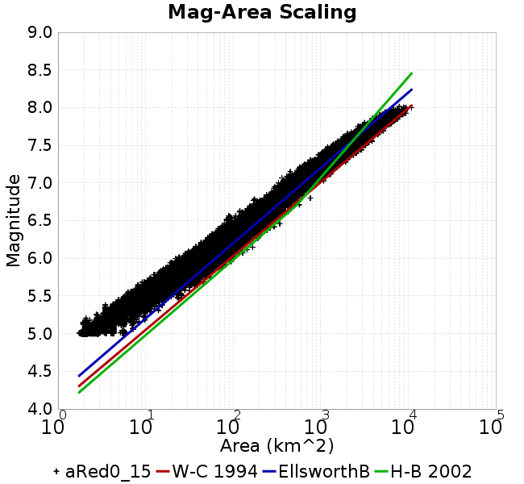
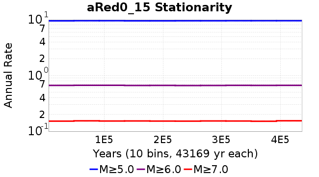

# aRed0_15
## Metadata
| **Catalog** | aRed0_15 |
|-----|-----|
| **Author** | Jaqcui Gilchrist, 2018/09/27 |
| **Description** | a reduction factor: fA=0.15 |
| **Fault/Def Model** | Fault Model 3.1, Geologic |
| **Slip Velocity** | 1.0 m/s |
| **Average Element Area** | 1.35 km^2 |
| **Length** | 9,426,679 events in 436,694 years |
| **Frictional Params** | a=0.001, b=0.008, (b-a)=0.007, ddotEQ=1 |

* [Metadata](#metadata)
* [Plots](#plots)
  * [Magnitude-Frequency Plot](#magnitude-frequency-plot)
  * [Magnitude-Area Plots](#magnitude-area-plots)
  * [Slip-Area Plots](#slip-area-plots)
  * [Rupture Velocity Plots](#rupture-velocity-plots)
  * [Global Interevent-Time Distributions](#global-interevent-time-distributions)
  * [Normalized Fault Interevent-Time Distributions](#normalized-fault-interevent-time-distributions)
  * [Stationarity Plot](#stationarity-plot)
  * [Element/Subsection Interevent Time Comparisons](#elementsubsection-interevent-time-comparisons)
    * [Element Interevent Time Comparisons](#element-interevent-time-comparisons)
    * [Subsection Interevent Time Comparisons](#subsection-interevent-time-comparisons)
  * [Paleo Open Interval Plots](#paleo-open-interval-plots)
    * [Paleo Open Interval Plots, Biasi and Sharer 2019](#paleo-open-interval-plots-biasi-and-sharer-2019)
    * [Paleo Open Interval Plots, UCERF3](#paleo-open-interval-plots-ucerf3)
  * [Moment Release Variability Plots](#moment-release-variability-plots)
* [Input File](#input-file)

## Plots
### Magnitude-Frequency Plot
*[(top)](#ared0_15)*


### Magnitude-Area Plots
*[(top)](#ared0_15)*

| Scatter | 2-D Hist |
|-----|-----|
|  |  |
### Slip-Area Plots
*[(top)](#ared0_15)*

| Scatter | 2-D Hist |
|-----|-----|
|  |  |
### Rupture Velocity Plots
*[(top)](#ared0_15)*

| **Scatter** |  |
|-----|-----|
| **Distance/Velocity** |  |
### Global Interevent-Time Distributions
*[(top)](#ared0_15)*

| **M≥6** | **M≥6.5** | **M≥7** | **M≥7.5** |
|-----|-----|-----|-----|
|  |  |  |  |
### Normalized Fault Interevent-Time Distributions
*[(top)](#ared0_15)*

|  | **M≥6** | **M≥6.5** | **M≥7** | **M≥7.5** |
|-----|-----|-----|-----|-----|
| **Elements** |  |  |  |  |
| **Subsections** |  |  |  |  |
| **Sections** |  |  |  |  |
### Stationarity Plot
*[(top)](#ared0_15)*


### Element/Subsection Interevent Time Comparisons

#### Element Interevent Time Comparisons
*[(top)](#ared0_15)*

| Min Mag | Scatter | 2-D Hist |
|-----|-----|-----|
| **M≥6.0** |  |  |
| **M≥6.5** |  |  |
| **M≥7.0** |  |  |
| **M≥7.5** |  |  |

#### Subsection Interevent Time Comparisons
*[(top)](#ared0_15)*

*Subsections participate in a rupture if at least 20.0 % of its area ruptures*

| Min Mag | Scatter | 2-D Hist |
|-----|-----|-----|
| **M≥6.0** |  |  |
| **M≥6.5** |  |  |
| **M≥7.0** |  |  |
| **M≥7.5** |  |  |

### Paleo Open Interval Plots
*[(top)](#ared0_15)*

#### Paleo Open Interval Plots, Biasi and Sharer 2019
*[(top)](#ared0_15)*

These plots use the 5 paleoseismic sites identified in Biasi & Scharer (2019) on the Hayward, N. SAF, S. SAF, and SJC faults. By default, a rupture is counted at a paleo site if the nearest element (at the surface) slips any amount. We also alternatively apply a probability of detection model. Those results are marked as 'Prob. Filtered'.

**Paleoseismic sites table:**

| **Site Name** | Data MRI (yr) | Data Annual Rate | Catalog MRI (yr) | Catalog Annual Rate | Catalog Occurences | Prob Filtered Catalog MRI (yr) | Prob Filtered Catalog Annual Rate | Prob Filtered Catalog Occurences |
|-----|-----|-----|-----|-----|-----|-----|-----|-----|
| **HOG** | 191.00 | 0.005235602 | 356.38 | 0.0028060263 | 1211 | 360.71 | 0.0027723308 | 1196.43 |
| **FRA** | 119.00 | 0.008403362 | 117.15 | 0.008536303 | 3685 | 122.92 | 0.008135185 | 3511.66 |
| **COA** | 181.00 | 0.005524862 | 178.03 | 0.0056170737 | 2425 | 190.61 | 0.0052462686 | 2264.91 |
| **SCZ** | 106.00 | 0.009433962 | 121.54 | 0.008227864 | 3551 | 140.33 | 0.0071259653 | 3075.47 |
| **TYS** | 329.00 | 0.0030395137 | 347.10 | 0.0028810396 | 1242 | 383.22 | 0.0026094653 | 1124.94 |
| **TOTAL** | 31.61 | 0.0316373 | 35.63 | 0.028067386 | 12114 | 38.62 | 0.02589401 | 11175.9 |

**Paleoseismic Plots:**

|  |  |
|-----|-----|

**Open interval probabilities table:**

| **Open Interval (yr)** | Catalog Probability | Catalog Poisson Probability | Prob. Filtered Catalog Probability | Prob. Filtered Catalog Poisson Probability | Data Poisson Probability |
|-----|-----|-----|-----|-----|-----|
| **10.00** | 0.9731985 | 0.75527465 | 0.9770698 | 0.77186924 | 0.72878754 |
| **20.00** | 0.90249234 | 0.57043976 | 0.91548187 | 0.59578216 | 0.53113127 |
| **30.00** | 0.8038057 | 0.43083867 | 0.82818973 | 0.45986593 | 0.3870819 |
| **40.00** | 0.69003713 | 0.3254015 | 0.72509 | 0.35495636 | 0.28210047 |
| **50.00** | 0.56692237 | 0.24576752 | 0.6116977 | 0.2739799 | 0.2055913 |
| **60.00** | 0.45168215 | 0.18562196 | 0.5032035 | 0.21147667 | 0.14983238 |
| **70.00** | 0.33986086 | 0.14019556 | 0.39389956 | 0.16323234 | 0.10919597 |
| **80.00** | 0.24180512 | 0.105886154 | 0.2935829 | 0.12599403 | 0.079580665 |
| **90.00** | 0.17084222 | 0.079973124 | 0.21818355 | 0.097250916 | 0.057997398 |
| **100.00** | 0.10544658 | 0.06040167 | 0.14703497 | 0.075064994 | 0.04226778 |
| **110.00** | 0.06325661 | 0.04561985 | 0.09683228 | 0.05794036 | 0.030804234 |
| **120.00** | 0.029768545 | 0.034455515 | 0.05329593 | 0.044722382 | 0.022449743 |
| **130.00** | 0.013490557 | 0.026023377 | 0.028201291 | 0.034519833 | 0.016361093 |
| **140.00** | 0.0031910155 | 0.019654796 | 0.010013985 | 0.026644798 | 0.011923761 |
| **150.00** | 7.303753E-4 | 0.014844769 | 0.0037254028 | 0.0205663 | 0.008689889 |
| **160.00** | 5.167553E-4 | 0.011211877 | 0.0021159702 | 0.015874494 | 0.0063330824 |
| **170.00** | 0.0 | 0.008468046 | 0.001150888 | 0.012253034 | 0.0046154717 |
| **180.00** | 0.0 | 0.0063957004 | 5.8471295E-4 | 0.009457741 | 0.0033636983 |
| **190.00** | 0.0 | 0.0048305104 | 2.7912098E-4 | 0.007300139 | 0.0024514215 |
| **200.00** | 0.0 | 0.003648362 | 1.2877356E-4 | 0.005634753 | 0.0017865654 |
| **210.00** | 0.0 | 0.002755515 | 5.6464753E-5 | 0.0043492927 | 0.0013020267 |
| **220.00** | 0.0 | 0.0020811707 | 2.309973E-5 | 0.0033570852 | 9.489008E-4 |
| **230.00** | 0.0 | 0.0015718554 | 1.1479796E-5 | 0.002591231 | 6.915471E-4 |
| **240.00** | 0.0 | 0.0011871825 | 6.798377E-6 | 0.0020000914 | 5.039909E-4 |
| **250.00** | 0.0 | 8.966488E-4 | 0.0 | 0.0015438091 | 3.673023E-4 |

#### Paleo Open Interval Plots, UCERF3
*[(top)](#ared0_15)*

These plots use the full set of UCERF3 paleoseismic sites. By default, a rupture is counted at a paleo site if the nearest element (at the surface) slips any amount. We also alternativeslyapply a probability of detection model. Those results are marked as 'Prob. Filtered'.

**Paleoseismic sites table:**

| **Site Name** | Data MRI (yr) | Data Annual Rate | Catalog MRI (yr) | Catalog Annual Rate | Catalog Occurences | Prob Filtered Catalog MRI (yr) | Prob Filtered Catalog Annual Rate | Prob Filtered Catalog Occurences |
|-----|-----|-----|-----|-----|-----|-----|-----|-----|
| **SSanAndreasBurroFlats** | 205.44 | 0.0048677 | 205.56 | 0.004864817 | 2101 | 234.44 | 0.0042654513 | 1841.99 |
| **SSanAndreasIndio** | 277.37 | 0.0036053 | 172.96 | 0.0057816003 | 2496 | 184.63 | 0.005416216 | 2338.26 |
| **SSAFMCreek1000Palms** | 261.33 | 0.0038266 | 1602.22 | 6.2413554E-4 | 270 | 2344.25 | 4.2657624E-4 | 184.22 |
| **NSanAndreasFortRoss** | 306.28 | 0.003265 | 188.79 | 0.0052967668 | 2286 | 191.44 | 0.005223651 | 2254.44 |
| **NSanAndreasNorthCoast** | 263.87 | 0.0037898 | 180.65 | 0.005535527 | 2389 | 185.56 | 0.0053891423 | 2325.83 |
| **CalaverasfaultNorth** | 618.05 | 0.001618 | 163.29 | 0.0061240084 | 2644 | 235.86 | 0.004239823 | 1830.37 |
| **ElsinoreTemecula** | 1019.16 | 9.812E-4 | 691.03 | 0.0014471132 | 625 | 719.75 | 0.0013893695 | 600.04 |
| **ElsinoreWhittier** | 3196.93 | 3.128E-4 | 1543.23 | 6.479913E-4 | 279 | 1621.56 | 6.166893E-4 | 265.48 |
| **SSAFCarrizoBidart** | 114.71 | 0.0087179 | 121.77 | 0.008211906 | 3545 | 125.30 | 0.007980702 | 3445.22 |
| **SanJacintoHogLake** | 311.78 | 0.0032074 | 356.38 | 0.0028060263 | 1211 | 360.74 | 0.0027720525 | 1196.34 |
| **PuenteHills** | 3506.31 | 2.852E-4 | 4944.94 | 2.022269E-4 | 87 | 5395.16 | 1.853513E-4 | 79.68 |
| **SanGregorioNorth** | 1019.06 | 9.813E-4 | 392.53 | 0.002547572 | 1100 | 407.31 | 0.0024551062 | 1060.08 |
| **SanJacintoSuperstition** | 508.26 | 0.0019675 | 1245.78 | 8.027071E-4 | 347 | 1326.34 | 7.539518E-4 | 325.93 |
| **SSanAndreasWrightwood** | 106.04 | 0.0094304 | 153.55 | 0.006512354 | 2811 | 155.30 | 0.0064391904 | 2779.41 |
| **SSanAndreasPitmanCanyon** | 173.48 | 0.0057643 | 143.78 | 0.0069550085 | 3002 | 159.35 | 0.0062753437 | 2708.67 |
| **SSanAndreasPlungeCreek** | 205.36 | 0.0048695 | 356.50 | 0.0028050393 | 1210 | 441.20 | 0.002266525 | 977.64 |
| **FrazierMountianSSAF** | 148.57 | 0.0067307 | 117.15 | 0.008536303 | 3685 | 122.93 | 0.008134953 | 3511.64 |
| **NSanAndreasSantaCruzSeg** | 109.84 | 0.0091041 | 121.54 | 0.008227864 | 3551 | 140.42 | 0.0071216114 | 3073.58 |
| **RodgersCreek** | 325.31 | 0.003074 | 170.02 | 0.0058817314 | 2540 | 232.68 | 0.0042977193 | 1855.83 |
| **GreenValleyMasonRoad** | 293.31 | 0.0034094 | 1694.80 | 5.900393E-4 | 255 | 2301.62 | 4.3447662E-4 | 187.67 |
| **HaywardfaultNorth** | 318.34 | 0.0031413 | 368.47 | 0.0027139583 | 1172 | 379.29 | 0.002636531 | 1138.55 |
| **HaywardfaultSouth** | 167.57 | 0.0059677 | 347.10 | 0.0028810396 | 1242 | 383.92 | 0.0026047393 | 1122.86 |
| **Compton** | 2658.16 | 3.762E-4 | 5926.93 | 1.6872151E-4 | 72 | 6605.83 | 1.5138135E-4 | 64.62 |
| **SSanAndreasCoachella** | 178.45 | 0.0056037 | 178.03 | 0.0056170737 | 2425 | 190.59 | 0.0052468944 | 2265.18 |
| **ElsinoreGlenIvy** | 179.12 | 0.0055828 | 585.87 | 0.0017068515 | 737 | 632.40 | 0.0015812691 | 682.81 |
| **GarlockCentralallevents** | 1434.93 | 6.969E-4 | 645.05 | 0.001550261 | 670 | 655.14 | 0.001526393 | 659.7 |
| **NSanAndreasAlderCreek** | 869.64 | 0.0011499 | 189.21 | 0.0052851764 | 2281 | 192.03 | 0.0052075284 | 2247.47 |
| **SSanAndreasPallettCreek** | 149.30 | 0.006698 | 153.55 | 0.006512354 | 2811 | 155.20 | 0.006443494 | 2781.27 |
| **GarlockWesternallevents** | 1230.16 | 8.129E-4 | 812.01 | 0.0012315111 | 532 | 835.21 | 0.0011973078 | 517.24 |
| **ElsinoreFaultJulian** | 3250.98 | 3.076E-4 | 1229.75 | 8.131726E-4 | 351 | 1260.61 | 7.9326675E-4 | 342.36 |
| **TOTAL** | 9.08 | 0.1101451 | 14.36 | 0.06963073 | 30060 | 15.96 | 0.06263965 | 27042.01 |

**Paleoseismic Plots:**

|  |  |
|-----|-----|

**Open interval probabilities table:**

| **Open Interval (yr)** | Catalog Probability | Catalog Poisson Probability | Prob. Filtered Catalog Probability | Prob. Filtered Catalog Poisson Probability | Data Poisson Probability |
|-----|-----|-----|-----|-----|-----|
| **10.00** | 0.8555506 | 0.49842247 | 0.87744576 | 0.5345144 | 0.33238843 |
| **20.00** | 0.5996481 | 0.24842495 | 0.6477987 | 0.2857057 | 0.110482074 |
| **30.00** | 0.37250248 | 0.12382057 | 0.42898035 | 0.15271382 | 0.036722966 |
| **40.00** | 0.20890796 | 0.06171496 | 0.2609718 | 0.08162774 | 0.012206289 |
| **50.00** | 0.10545358 | 0.03076012 | 0.14336559 | 0.043631203 | 0.004057229 |
| **60.00** | 0.050712716 | 0.015331535 | 0.07580617 | 0.02332151 | 0.001348576 |
| **70.00** | 0.021149796 | 0.0076415814 | 0.035861578 | 0.012465684 | 4.4825108E-4 |
| **80.00** | 0.009828084 | 0.0038087359 | 0.016913133 | 0.0066630878 | 1.4899348E-4 |
| **90.00** | 0.0039813183 | 0.0018983595 | 0.007044863 | 0.0035615165 | 4.952371E-5 |
| **100.00** | 0.0018438546 | 9.46185E-4 | 0.0026692173 | 0.001903682 | 1.6461108E-5 |
| **110.00** | 4.622053E-4 | 4.7159987E-4 | 8.8220794E-4 | 0.0010175456 | 5.4714824E-6 |
| **120.00** | 2.9470914E-4 | 2.3505597E-4 | 5.1940285E-4 | 5.438928E-4 | 1.8186574E-6 |
| **130.00** | 0.0 | 1.1715717E-4 | 1.7907818E-4 | 2.9071854E-4 | 6.045007E-7 |
| **140.00** | 0.0 | 5.839377E-5 | 1.7480756E-5 | 1.5539327E-4 | 2.0092905E-7 |
| **150.00** | 0.0 | 2.9104765E-5 | 0.0 | 8.305994E-5 | 6.678649E-8 |

### Moment Release Variability Plots
*[(top)](#ared0_15)*

We first create a tapered moment release time series for the entire catalog. Each event's moment is distributed across a 25 year Hanning (cosine) taper. Here is a plot of a random 2,000 year section of this time series:


We then compute Welch's power spectral density estimate on the entire time series. Results are plotted below, with a Poisson randomization of the catalog also plotted in gray as a control. Significant deviations above the Poisson model indicate synchronization at that period.


## Input File
*[(top)](#ared0_15)*

```
  A_1 = 0.001
  fA = 0.15
  B_1 = 0.008
  muSlipAmp_1 = .0
  muSlipInvDist_1 = 1.0
  cohesion = 0.0
  Dc_1 = 1.0000000000000000818e-05
  mu0_1 = 0.6
  ddotStar_1 = 9.9999999999999995475e-07
  ddotAB_1 = 9.9999999999999995475e-07
  alpha_1 = 0.0
  theta0_1 = 200000000
  tau0_1 = 55.1
  sigma0_1 = 100
  sigmaFracPin = .5
  lowSigmaAction = 1
  maxThetaPin = 1.0e13
  ddotEQ_1 = 1
  ddotEQFname = 
  stressOvershootFactor = 0.10000000000000000555
  lameLambda = 30000
  lameMu = 30000
  slowSlip_1 = 0
  nEq = 100000000000
  KZeroFrac = 0
  muPin = 1.0
  tStart = 0
  maxT = 3.16e13
  maxWallTime = 169200
  maxTrans = 1.0000000000000000159e100
  faultFname = UCERF3FM.15km.1km.tri.flt
  outFnameInfix = aRed0_15
  writeTau = 2
  writeSigma = 2
  writeSlip = 0
  writeSlipSpeed = 0
  writeState = 0
  writeTheta = 2
  writePED = 1
  writeTransitions = 1
  minDtWrite = 0
  minDtWriteCoseismic = 0
  minDtWriteInterseismic = 0
  minMagWrite = 7.7
  writeStiffness = 0
  stressRateSpecification = 1
  dMu3 = 0.01000000000000000
  initTauFname = 
  initSigmaFname = 
  initThetaFname = 
  initSlipSpeedFname = 
  AFname = 
  BFname =  
  DcFname = 
  mu0Fname = 
  ddotStarFname = 
  ddotABFname = 
  alphaFname = 
  KTauFname = /u/sciteam/gilchris/scratch/stiffness_25a589d/Ktau.25a589d.out
  KSigmaFname = /u/sciteam/gilchris/scratch/stiffness_25a589d/Ksigma.25a589d.out
  tFailFname = 
  tauFailFname = 
  tauDotFname = 
  sigmaDotFname =
  KZeroFname = UCERF3FM.15km.1km.tri.KZero
  pinnedFname =  UCERF3FM.15km.1km.tri.pin
  neighborFname = UCERF3FM.15km.1km.tri.neighbors
  stressRateFname =  
  slowSlipFname = 
  writePatchFname = 
  DEBUG = 0
  ZBrentUpperBracket = 0
  receiverElementAreaFrac = 0.8
  receiverElementIntTol = 1.0e-4
  receiverElementSubdivisionMax = 4
  tgfDist1 = 3
  tgfDist1 = 10
  lowSigmaAction = 1
  highSigmaAction = 0
```
