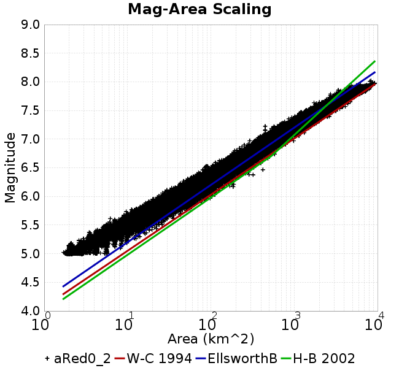
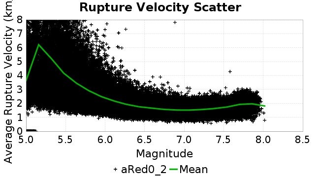
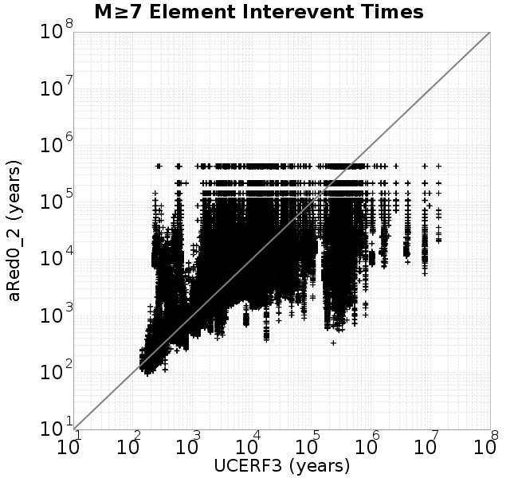
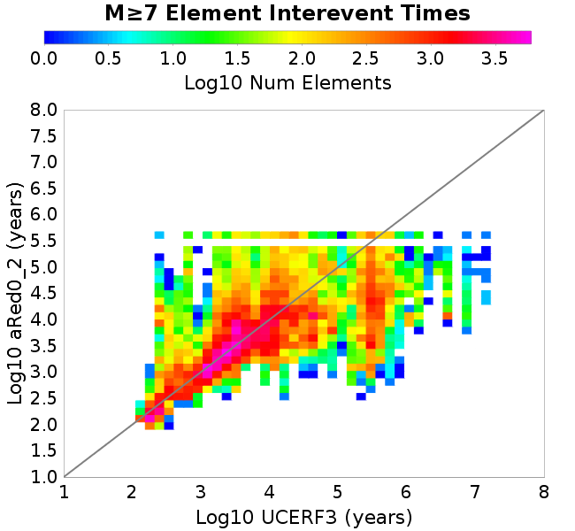
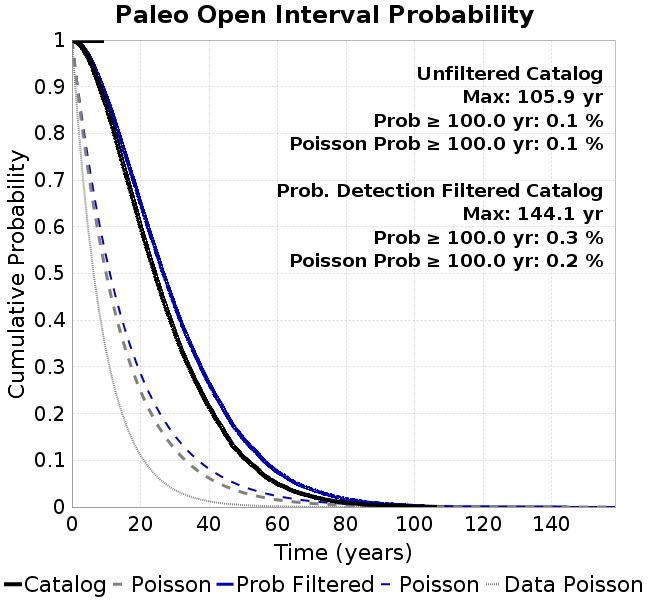
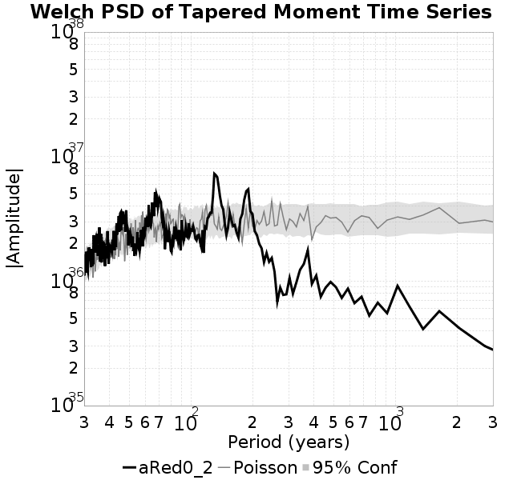

# aRed0_2
## Metadata
| **Catalog** | aRed0_2 |
|-----|-----|
| **Author** | Jaqcui Gilchrist, 2018/09/27 |
| **Description** | a reduction factor: fA=0.2 |
| **Fault/Def Model** | Fault Model 3.1, Geologic |
| **Slip Velocity** | 1.0 m/s |
| **Average Element Area** | 1.35 km^2 |
| **Length** | 10,274,769 events in 436,877 years |
| **Frictional Params** | a=0.001, b=0.008, (b-a)=0.007, ddotEQ=1 |

* [Metadata](#metadata)
* [Plots](#plots)
  * [Magnitude-Frequency Plot](#magnitude-frequency-plot)
  * [Magnitude-Area Plots](#magnitude-area-plots)
  * [Slip-Area Plots](#slip-area-plots)
  * [Rupture Velocity Plots](#rupture-velocity-plots)
  * [Global Interevent-Time Distributions](#global-interevent-time-distributions)
  * [Normalized Fault Interevent-Time Distributions](#normalized-fault-interevent-time-distributions)
  * [Stationarity Plot](#stationarity-plot)
  * [Element/Subsection Interevent Time Comparisons](#elementsubsection-interevent-time-comparisons)
    * [Element Interevent Time Comparisons](#element-interevent-time-comparisons)
    * [Subsection Interevent Time Comparisons](#subsection-interevent-time-comparisons)
  * [Paleo Open Interval Plots](#paleo-open-interval-plots)
    * [Paleo Open Interval Plots, Biasi and Sharer 2019](#paleo-open-interval-plots-biasi-and-sharer-2019)
    * [Paleo Open Interval Plots, UCERF3](#paleo-open-interval-plots-ucerf3)
  * [Moment Release Variability Plots](#moment-release-variability-plots)
* [Input File](#input-file)

## Plots
### Magnitude-Frequency Plot
*[(top)](#ared0_2)*


### Magnitude-Area Plots
*[(top)](#ared0_2)*

| Scatter | 2-D Hist |
|-----|-----|
|  |  |
### Slip-Area Plots
*[(top)](#ared0_2)*

| Scatter | 2-D Hist |
|-----|-----|
|  |  |
### Rupture Velocity Plots
*[(top)](#ared0_2)*

| **Scatter** |  |
|-----|-----|
| **Distance/Velocity** |  |
### Global Interevent-Time Distributions
*[(top)](#ared0_2)*

| **M≥6** | **M≥6.5** | **M≥7** | **M≥7.5** |
|-----|-----|-----|-----|
|  |  |  |  |
### Normalized Fault Interevent-Time Distributions
*[(top)](#ared0_2)*

|  | **M≥6** | **M≥6.5** | **M≥7** | **M≥7.5** |
|-----|-----|-----|-----|-----|
| **Elements** |  |  |  |  |
| **Subsections** |  |  |  |  |
| **Sections** |  |  |  |  |
### Stationarity Plot
*[(top)](#ared0_2)*


### Element/Subsection Interevent Time Comparisons

#### Element Interevent Time Comparisons
*[(top)](#ared0_2)*

| Min Mag | Scatter | 2-D Hist |
|-----|-----|-----|
| **M≥6.0** |  |  |
| **M≥6.5** |  |  |
| **M≥7.0** |  |  |
| **M≥7.5** |  |  |

#### Subsection Interevent Time Comparisons
*[(top)](#ared0_2)*

*Subsections participate in a rupture if at least 20.0 % of its area ruptures*

| Min Mag | Scatter | 2-D Hist |
|-----|-----|-----|
| **M≥6.0** |  |  |
| **M≥6.5** |  |  |
| **M≥7.0** |  |  |
| **M≥7.5** |  |  |

### Paleo Open Interval Plots
*[(top)](#ared0_2)*

#### Paleo Open Interval Plots, Biasi and Sharer 2019
*[(top)](#ared0_2)*

These plots use the 5 paleoseismic sites identified in Biasi & Scharer (2019) on the Hayward, N. SAF, S. SAF, and SJC faults. By default, a rupture is counted at a paleo site if the nearest element (at the surface) slips any amount. We also alternatively apply a probability of detection model. Those results are marked as 'Prob. Filtered'.

**Paleoseismic sites table:**

| **Site Name** | Data MRI (yr) | Data Annual Rate | Catalog MRI (yr) | Catalog Annual Rate | Catalog Occurences | Prob Filtered Catalog MRI (yr) | Prob Filtered Catalog Annual Rate | Prob Filtered Catalog Occurences |
|-----|-----|-----|-----|-----|-----|-----|-----|-----|
| **HOG** | 191.00 | 0.005235602 | 356.35 | 0.002806199 | 1212 | 360.77 | 0.002771835 | 1197.16 |
| **FRA** | 119.00 | 0.008403362 | 116.97 | 0.008549414 | 3693 | 122.69 | 0.008150598 | 3520.69 |
| **COA** | 181.00 | 0.005524862 | 177.92 | 0.005620648 | 2428 | 190.30 | 0.005254933 | 2270.02 |
| **SCZ** | 106.00 | 0.009433962 | 121.83 | 0.008208198 | 3544 | 140.86 | 0.0070991023 | 3065.09 |
| **TYS** | 329.00 | 0.0030395137 | 346.44 | 0.002886484 | 1246 | 383.38 | 0.002608399 | 1125.9 |
| **TOTAL** | 31.61 | 0.0316373 | 35.62 | 0.02807042 | 12123 | 38.63 | 0.025889462 | 11181.09 |

**Paleoseismic Plots:**

|  |  |
|-----|-----|

**Open interval probabilities table:**

| **Open Interval (yr)** | Catalog Probability | Catalog Poisson Probability | Prob. Filtered Catalog Probability | Prob. Filtered Catalog Poisson Probability | Data Poisson Probability |
|-----|-----|-----|-----|-----|-----|
| **10.00** | 0.9728936 | 0.7552517 | 0.97672766 | 0.77190435 | 0.72878754 |
| **20.00** | 0.90339875 | 0.5704051 | 0.9157659 | 0.59583634 | 0.53113127 |
| **30.00** | 0.80171084 | 0.43079945 | 0.8265146 | 0.45992866 | 0.3870819 |
| **40.00** | 0.6859874 | 0.32536203 | 0.7221212 | 0.35502094 | 0.28210047 |
| **50.00** | 0.56671715 | 0.24573022 | 0.6123405 | 0.27404222 | 0.2055913 |
| **60.00** | 0.45493713 | 0.18558817 | 0.5056746 | 0.21153438 | 0.14983238 |
| **70.00** | 0.34822237 | 0.14016578 | 0.4024236 | 0.16328432 | 0.10919597 |
| **80.00** | 0.25679162 | 0.10586044 | 0.30939922 | 0.12603988 | 0.079580665 |
| **90.00** | 0.17464423 | 0.07995128 | 0.22407882 | 0.097290725 | 0.057997398 |
| **100.00** | 0.11477655 | 0.060383342 | 0.15715918 | 0.07509914 | 0.04226778 |
| **110.00** | 0.06979435 | 0.04560462 | 0.10516191 | 0.05796935 | 0.030804234 |
| **120.00** | 0.03720313 | 0.03444297 | 0.062174506 | 0.044746794 | 0.022449743 |
| **130.00** | 0.017978609 | 0.02601311 | 0.033957 | 0.034540247 | 0.016361093 |
| **140.00** | 0.0040594805 | 0.019646445 | 0.012243322 | 0.026661767 | 0.011923761 |
| **150.00** | 0.0012731489 | 0.014838011 | 0.004374512 | 0.020580335 | 0.008689889 |
| **160.00** | 5.56728E-4 | 0.011206433 | 0.0022327756 | 0.01588605 | 0.0063330824 |
| **170.00** | 0.0 | 0.008463678 | 0.0011071316 | 0.012262511 | 0.0046154717 |
| **180.00** | 0.0 | 0.006392207 | 4.9387245E-4 | 0.009465486 | 0.0033636983 |
| **190.00** | 0.0 | 0.0048277252 | 1.971841E-4 | 0.0073064496 | 0.0024514215 |
| **200.00** | 0.0 | 0.003646148 | 1.32066E-4 | 0.0056398804 | 0.0017865654 |
| **210.00** | 0.0 | 0.0027537593 | 7.182609E-5 | 0.0043534483 | 0.0013020267 |
| **220.00** | 0.0 | 0.0020797814 | 5.5403245E-5 | 0.0033604458 | 9.489008E-4 |
| **230.00** | 0.0 | 0.0015707585 | 2.1943613E-5 | 0.0025939427 | 6.915471E-4 |
| **240.00** | 0.0 | 0.001186318 | 1.7098484E-5 | 0.0020022758 | 5.039909E-4 |
| **250.00** | 0.0 | 8.959687E-4 | 1.4296855E-5 | 0.0015455653 | 3.673023E-4 |
| **260.00** | 0.0 | 6.7668187E-4 | 1.1532742E-5 | 0.0011930286 | 2.6768536E-4 |
| **270.00** | 0.0 | 5.110651E-4 | 8.846783E-6 | 9.20904E-4 | 1.9508575E-4 |
| **280.00** | 0.0 | 3.8598283E-4 | 0.0 | 7.108498E-4 | 1.4217607E-4 |

#### Paleo Open Interval Plots, UCERF3
*[(top)](#ared0_2)*

These plots use the full set of UCERF3 paleoseismic sites. By default, a rupture is counted at a paleo site if the nearest element (at the surface) slips any amount. We also alternativeslyapply a probability of detection model. Those results are marked as 'Prob. Filtered'.

**Paleoseismic sites table:**

| **Site Name** | Data MRI (yr) | Data Annual Rate | Catalog MRI (yr) | Catalog Annual Rate | Catalog Occurences | Prob Filtered Catalog MRI (yr) | Prob Filtered Catalog Annual Rate | Prob Filtered Catalog Occurences |
|-----|-----|-----|-----|-----|-----|-----|-----|-----|
| **SSanAndreasBurroFlats** | 205.44 | 0.0048677 | 204.94 | 0.0048794905 | 2108 | 234.45 | 0.0042652553 | 1842.7 |
| **SSanAndreasIndio** | 277.37 | 0.0036053 | 174.46 | 0.0057318103 | 2476 | 185.53 | 0.005389967 | 2328.38 |
| **SSAFMCreek1000Palms** | 261.33 | 0.0038266 | 1604.68 | 6.231768E-4 | 269 | 2323.98 | 4.302954E-4 | 185.59 |
| **NSanAndreasFortRoss** | 306.28 | 0.003265 | 191.60 | 0.005219117 | 2254 | 194.21 | 0.0051491866 | 2223.8 |
| **NSanAndreasNorthCoast** | 263.87 | 0.0037898 | 182.53 | 0.005478567 | 2366 | 187.23 | 0.0053409627 | 2306.59 |
| **CalaverasfaultNorth** | 618.05 | 0.001618 | 164.44 | 0.0060811643 | 2627 | 237.22 | 0.0042154607 | 1820.75 |
| **ElsinoreTemecula** | 1019.16 | 9.812E-4 | 688.64 | 0.0014521345 | 627 | 717.28 | 0.0013941651 | 601.97 |
| **ElsinoreWhittier** | 3196.93 | 3.128E-4 | 1518.88 | 6.583807E-4 | 284 | 1600.79 | 6.246916E-4 | 269.44 |
| **SSAFCarrizoBidart** | 114.71 | 0.0087179 | 120.70 | 0.008284678 | 3578 | 124.50 | 0.008032292 | 3469.03 |
| **SanJacintoHogLake** | 311.78 | 0.0032074 | 356.35 | 0.002806199 | 1212 | 360.93 | 0.00277063 | 1196.63 |
| **PuenteHills** | 3506.31 | 2.852E-4 | 4988.54 | 2.0045943E-4 | 87 | 5460.27 | 1.8314116E-4 | 79.5 |
| **SanGregorioNorth** | 1019.06 | 9.813E-4 | 389.09 | 0.0025700748 | 1110 | 404.45 | 0.0024725005 | 1067.85 |
| **SanJacintoSuperstition** | 508.26 | 0.0019675 | 1205.81 | 8.2931604E-4 | 358 | 1288.16 | 7.7630056E-4 | 335.17 |
| **SSanAndreasWrightwood** | 106.04 | 0.0094304 | 152.95 | 0.0065381294 | 2824 | 154.91 | 0.006455517 | 2788.33 |
| **SSanAndreasPitmanCanyon** | 173.48 | 0.0057643 | 142.55 | 0.0070152297 | 3030 | 159.26 | 0.0062789107 | 2711.97 |
| **SSanAndreasPlungeCreek** | 205.36 | 0.0048695 | 361.65 | 0.0027651219 | 1195 | 445.09 | 0.0022467277 | 971.03 |
| **FrazierMountianSSAF** | 148.57 | 0.0067307 | 116.97 | 0.008549414 | 3693 | 122.74 | 0.008147615 | 3519.43 |
| **NSanAndreasSantaCruzSeg** | 109.84 | 0.0091041 | 121.83 | 0.008208198 | 3544 | 140.96 | 0.0070943194 | 3063.06 |
| **RodgersCreek** | 325.31 | 0.003074 | 171.42 | 0.005833671 | 2519 | 235.10 | 0.004253427 | 1836.72 |
| **GreenValleyMasonRoad** | 293.31 | 0.0034094 | 1734.27 | 5.7661295E-4 | 249 | 2339.58 | 4.2742657E-4 | 184.44 |
| **HaywardfaultNorth** | 318.34 | 0.0031413 | 370.85 | 0.0026965132 | 1164 | 381.67 | 0.0026200456 | 1130.91 |
| **HaywardfaultSouth** | 167.57 | 0.0059677 | 346.44 | 0.002886484 | 1246 | 383.66 | 0.002606473 | 1125.14 |
| **Compton** | 2658.16 | 3.762E-4 | 6217.60 | 1.6083373E-4 | 70 | 6846.13 | 1.4606792E-4 | 63.62 |
| **SSanAndreasCoachella** | 178.45 | 0.0056037 | 177.92 | 0.005620648 | 2428 | 190.19 | 0.0052578817 | 2271.33 |
| **ElsinoreGlenIvy** | 179.12 | 0.0055828 | 587.17 | 0.001703098 | 735 | 631.29 | 0.0015840633 | 683.67 |
| **GarlockCentralallevents** | 1434.93 | 6.969E-4 | 638.02 | 0.0015673613 | 676 | 648.41 | 0.0015422343 | 665.16 |
| **NSanAndreasAlderCreek** | 869.64 | 0.0011499 | 192.29 | 0.005200585 | 2246 | 194.89 | 0.005131187 | 2216.03 |
| **SSanAndreasPallettCreek** | 149.30 | 0.006698 | 153.11 | 0.0065311813 | 2821 | 154.85 | 0.006457856 | 2789.34 |
| **GarlockWesternallevents** | 1230.16 | 8.129E-4 | 821.39 | 0.0012174479 | 526 | 845.05 | 0.0011833555 | 511.25 |
| **ElsinoreFaultJulian** | 3250.98 | 3.076E-4 | 1251.34 | 7.9914567E-4 | 345 | 1277.42 | 7.8282994E-4 | 337.94 |
| **TOTAL** | 9.08 | 0.1101451 | 14.35 | 0.069678895 | 30093 | 15.96 | 0.06265306 | 27058.72 |

**Paleoseismic Plots:**

|  |  |
|-----|-----|

**Open interval probabilities table:**

| **Open Interval (yr)** | Catalog Probability | Catalog Poisson Probability | Prob. Filtered Catalog Probability | Prob. Filtered Catalog Poisson Probability | Data Poisson Probability |
|-----|-----|-----|-----|-----|-----|
| **10.00** | 0.85747856 | 0.49818242 | 0.8792981 | 0.5344428 | 0.33238843 |
| **20.00** | 0.6008069 | 0.24818571 | 0.65002155 | 0.2856291 | 0.110482074 |
| **30.00** | 0.3744741 | 0.12364176 | 0.4317691 | 0.15265241 | 0.036722966 |
| **40.00** | 0.21448453 | 0.061596148 | 0.26437065 | 0.081583984 | 0.012206289 |
| **50.00** | 0.1068879 | 0.030686118 | 0.14623703 | 0.04360197 | 0.004057229 |
| **60.00** | 0.04933779 | 0.015287285 | 0.07501405 | 0.02330276 | 0.001348576 |
| **70.00** | 0.022380808 | 0.0076158564 | 0.037437044 | 0.012453992 | 4.4825108E-4 |
| **80.00** | 0.008920722 | 0.0037940857 | 0.017026188 | 0.0066559464 | 1.4899348E-4 |
| **90.00** | 0.00397865 | 0.0018901468 | 0.0076759914 | 0.0035572224 | 4.952371E-5 |
| **100.00** | 0.0013546816 | 9.4163785E-4 | 0.0029055716 | 0.0019011319 | 1.6461108E-5 |
| **110.00** | 0.0 | 4.691074E-4 | 5.5701437E-4 | 0.0010160463 | 5.4714824E-6 |
| **120.00** | 0.0 | 2.3370107E-4 | 2.4226296E-4 | 5.430186E-4 | 1.8186574E-6 |
| **130.00** | 0.0 | 1.1642576E-4 | 2.6205376E-5 | 2.9021237E-4 | 6.045007E-7 |
| **140.00** | 0.0 | 5.8001267E-5 | 9.113743E-6 | 1.5510191E-4 | 2.0092905E-7 |
| **150.00** | 0.0 | 2.889521E-5 | 0.0 | 8.28931E-5 | 6.678649E-8 |

### Moment Release Variability Plots
*[(top)](#ared0_2)*

We first create a tapered moment release time series for the entire catalog. Each event's moment is distributed across a 25 year Hanning (cosine) taper. Here is a plot of a random 2,000 year section of this time series:


We then compute Welch's power spectral density estimate on the entire time series. Results are plotted below, with a Poisson randomization of the catalog also plotted in gray as a control. Significant deviations above the Poisson model indicate synchronization at that period.



## Input File
*[(top)](#ared0_2)*

```
  A_1 = 0.001
  fA = 0.2
  B_1 = 0.008
  muSlipAmp_1 = .0
  muSlipInvDist_1 = 1.0
  cohesion = 0.0
  Dc_1 = 1.0000000000000000818e-05
  mu0_1 = 0.6
  ddotStar_1 = 9.9999999999999995475e-07
  ddotAB_1 = 9.9999999999999995475e-07
  alpha_1 = 0.0
  theta0_1 = 200000000
  tau0_1 = 55.1
  sigma0_1 = 100
  sigmaFracPin = .5
  lowSigmaAction = 1
  maxThetaPin = 1.0e13
  ddotEQ_1 = 1
  ddotEQFname = 
  stressOvershootFactor = 0.10000000000000000555
  lameLambda = 30000
  lameMu = 30000
  slowSlip_1 = 0
  nEq = 100000000000
  KZeroFrac = 0
  muPin = 1.0
  tStart = 0
  maxT = 3.16e13
  maxWallTime = 169200
  maxTrans = 1.0000000000000000159e100
  faultFname = UCERF3FM.15km.1km.tri.flt
  outFnameInfix = aRed0_2
  writeTau = 2
  writeSigma = 2
  writeSlip = 0
  writeSlipSpeed = 0
  writeState = 0
  writeTheta = 2
  writePED = 1
  writeTransitions = 1
  minDtWrite = 0
  minDtWriteCoseismic = 0
  minDtWriteInterseismic = 0
  minMagWrite = 7.7
  writeStiffness = 0
  stressRateSpecification = 1
  dMu3 = 0.01000000000000000
  initTauFname = 
  initSigmaFname = 
  initThetaFname = 
  initSlipSpeedFname = 
  AFname = 
  BFname =  
  DcFname = 
  mu0Fname = 
  ddotStarFname = 
  ddotABFname = 
  alphaFname = 
  KTauFname = /u/sciteam/gilchris/scratch/stiffness_25a589d/Ktau.25a589d.out
  KSigmaFname = /u/sciteam/gilchris/scratch/stiffness_25a589d/Ksigma.25a589d.out
  tFailFname = 
  tauFailFname = 
  tauDotFname = 
  sigmaDotFname =
  KZeroFname = UCERF3FM.15km.1km.tri.KZero
  pinnedFname =  UCERF3FM.15km.1km.tri.pin
  neighborFname = UCERF3FM.15km.1km.tri.neighbors
  stressRateFname =  
  slowSlipFname = 
  writePatchFname = 
  DEBUG = 0
  ZBrentUpperBracket = 0
  receiverElementAreaFrac = 0.8
  receiverElementIntTol = 1.0e-4
  receiverElementSubdivisionMax = 4
  tgfDist1 = 3
  tgfDist1 = 10
  lowSigmaAction = 1
  highSigmaAction = 0
```
