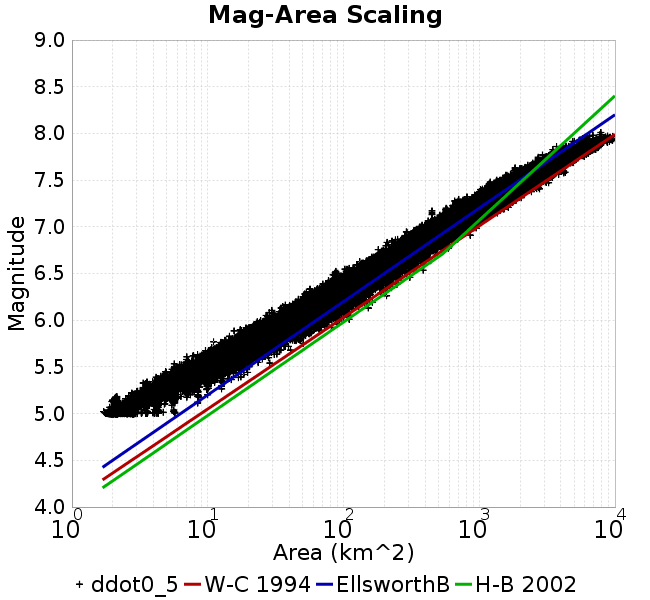
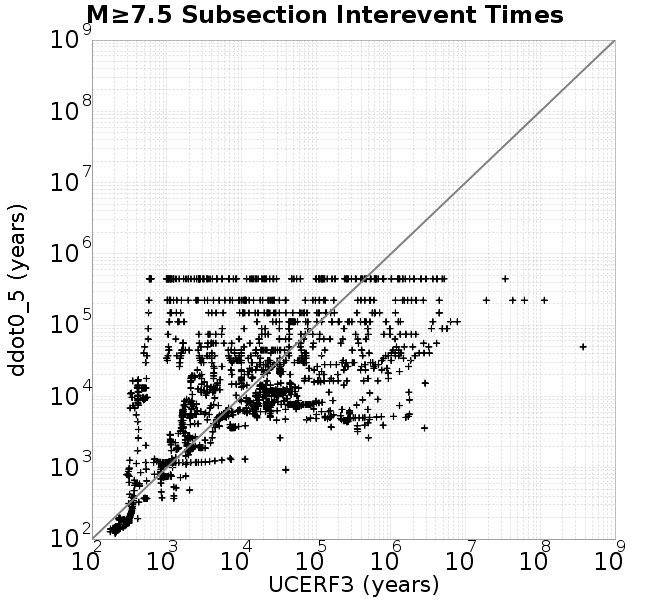

# ddot0_5
## Metadata
| **Catalog** | ddot0_5 |
|-----|-----|
| **Author** | Jaqcui Gilchrist, 2018/09/27 |
| **Description** | change ddotEQ: ddotEQ=0.5 |
| **Fault/Def Model** | Fault Model 3.1, Geologic |
| **Slip Velocity** | 0.5 m/s |
| **Average Element Area** | 1.35 km^2 |
| **Length** | 9,082,223 events in 451,533 years |
| **Frictional Params** | a=0.001, b=0.008, (b-a)=0.007, ddotEQ=0.5 |

* [Metadata](#metadata)
* [Plots](#plots)
  * [Magnitude-Frequency Plot](#magnitude-frequency-plot)
  * [Magnitude-Area Plots](#magnitude-area-plots)
  * [Slip-Area Plots](#slip-area-plots)
  * [Rupture Velocity Plots](#rupture-velocity-plots)
  * [Global Interevent-Time Distributions](#global-interevent-time-distributions)
  * [Normalized Fault Interevent-Time Distributions](#normalized-fault-interevent-time-distributions)
  * [Stationarity Plot](#stationarity-plot)
  * [Element/Subsection Interevent Time Comparisons](#elementsubsection-interevent-time-comparisons)
    * [Element Interevent Time Comparisons](#element-interevent-time-comparisons)
    * [Subsection Interevent Time Comparisons](#subsection-interevent-time-comparisons)
  * [Paleo Open Interval Plots](#paleo-open-interval-plots)
    * [Paleo Open Interval Plots, Biasi and Sharer 2019](#paleo-open-interval-plots-biasi-and-sharer-2019)
    * [Paleo Open Interval Plots, UCERF3](#paleo-open-interval-plots-ucerf3)
  * [Moment Release Variability Plots](#moment-release-variability-plots)
* [Input File](#input-file)

## Plots
### Magnitude-Frequency Plot
*[(top)](#ddot0_5)*


### Magnitude-Area Plots
*[(top)](#ddot0_5)*

| Scatter | 2-D Hist |
|-----|-----|
|  |  |
### Slip-Area Plots
*[(top)](#ddot0_5)*

| Scatter | 2-D Hist |
|-----|-----|
|  |  |
### Rupture Velocity Plots
*[(top)](#ddot0_5)*

| **Scatter** |  |
|-----|-----|
| **Distance/Velocity** |  |
### Global Interevent-Time Distributions
*[(top)](#ddot0_5)*

| **M≥6** | **M≥6.5** | **M≥7** | **M≥7.5** |
|-----|-----|-----|-----|
|  |  |  |  |
### Normalized Fault Interevent-Time Distributions
*[(top)](#ddot0_5)*

|  | **M≥6** | **M≥6.5** | **M≥7** | **M≥7.5** |
|-----|-----|-----|-----|-----|
| **Elements** |  |  |  |  |
| **Subsections** |  |  |  |  |
| **Sections** |  |  |  |  |
### Stationarity Plot
*[(top)](#ddot0_5)*


### Element/Subsection Interevent Time Comparisons

#### Element Interevent Time Comparisons
*[(top)](#ddot0_5)*

| Min Mag | Scatter | 2-D Hist |
|-----|-----|-----|
| **M≥6.0** |  |  |
| **M≥6.5** |  |  |
| **M≥7.0** |  |  |
| **M≥7.5** |  |  |

#### Subsection Interevent Time Comparisons
*[(top)](#ddot0_5)*

*Subsections participate in a rupture if at least 20.0 % of its area ruptures*

| Min Mag | Scatter | 2-D Hist |
|-----|-----|-----|
| **M≥6.0** |  |  |
| **M≥6.5** |  |  |
| **M≥7.0** |  |  |
| **M≥7.5** |  |  |

### Paleo Open Interval Plots
*[(top)](#ddot0_5)*

#### Paleo Open Interval Plots, Biasi and Sharer 2019
*[(top)](#ddot0_5)*

These plots use the 5 paleoseismic sites identified in Biasi & Scharer (2019) on the Hayward, N. SAF, S. SAF, and SJC faults. By default, a rupture is counted at a paleo site if the nearest element (at the surface) slips any amount. We also alternatively apply a probability of detection model. Those results are marked as 'Prob. Filtered'.

**Paleoseismic sites table:**

| **Site Name** | Data MRI (yr) | Data Annual Rate | Catalog MRI (yr) | Catalog Annual Rate | Catalog Occurences | Prob Filtered Catalog MRI (yr) | Prob Filtered Catalog Annual Rate | Prob Filtered Catalog Occurences |
|-----|-----|-----|-----|-----|-----|-----|-----|-----|
| **HOG** | 191.00 | 0.005235602 | 345.97 | 0.002890429 | 1291 | 350.09 | 0.002856414 | 1275.8 |
| **FRA** | 119.00 | 0.008403362 | 114.34 | 0.008746157 | 3906 | 120.02 | 0.008331999 | 3721.02 |
| **COA** | 181.00 | 0.005524862 | 171.86 | 0.005818711 | 2599 | 184.48 | 0.005420756 | 2421.05 |
| **SCZ** | 106.00 | 0.009433962 | 119.41 | 0.008374625 | 3739 | 138.54 | 0.007218307 | 3222.82 |
| **TYS** | 329.00 | 0.0030395137 | 332.56 | 0.0030069475 | 1343 | 371.09 | 0.0026947735 | 1203.42 |
| **TOTAL** | 31.61 | 0.0316373 | 34.68 | 0.028833324 | 12875 | 37.68 | 0.026537767 | 11849.86 |

**Paleoseismic Plots:**

|  |  |
|-----|-----|

**Open interval probabilities table:**

| **Open Interval (yr)** | Catalog Probability | Catalog Poisson Probability | Prob. Filtered Catalog Probability | Prob. Filtered Catalog Poisson Probability | Data Poisson Probability |
|-----|-----|-----|-----|-----|-----|
| **10.00** | 0.97253424 | 0.7495118 | 0.9765843 | 0.7669163 | 0.72878754 |
| **20.00** | 0.8957992 | 0.56176794 | 0.90992916 | 0.5881605 | 0.53113127 |
| **30.00** | 0.79296356 | 0.42105168 | 0.81924397 | 0.4510699 | 0.3870819 |
| **40.00** | 0.6708147 | 0.3155832 | 0.708654 | 0.3459328 | 0.28210047 |
| **50.00** | 0.5393456 | 0.23653331 | 0.5886361 | 0.2653015 | 0.2055913 |
| **60.00** | 0.4226154 | 0.17728451 | 0.47741514 | 0.20346403 | 0.14983238 |
| **70.00** | 0.31417406 | 0.13287683 | 0.37050924 | 0.15603988 | 0.10919597 |
| **80.00** | 0.2266621 | 0.099592745 | 0.28089476 | 0.11966952 | 0.079580665 |
| **90.00** | 0.15010194 | 0.07464594 | 0.19800438 | 0.0917765 | 0.057997398 |
| **100.00** | 0.09484902 | 0.055948008 | 0.13402972 | 0.07038489 | 0.04226778 |
| **110.00** | 0.051529817 | 0.041933693 | 0.08245529 | 0.053979315 | 0.030804234 |
| **120.00** | 0.02534578 | 0.031429797 | 0.045994703 | 0.041397616 | 0.022449743 |
| **130.00** | 0.007484233 | 0.023557002 | 0.019363169 | 0.031748503 | 0.016361093 |
| **140.00** | 0.0014678707 | 0.01765625 | 0.00746228 | 0.024348443 | 0.011923761 |
| **150.00** | 4.133216E-4 | 0.013233568 | 0.0028846425 | 0.018673217 | 0.008689889 |
| **160.00** | 0.0 | 0.009918715 | 0.0011686226 | 0.014320794 | 0.0063330824 |
| **170.00** | 0.0 | 0.007434194 | 5.9917616E-4 | 0.01098285 | 0.0046154717 |
| **180.00** | 0.0 | 0.005572016 | 2.8497685E-4 | 0.008422926 | 0.0033636983 |
| **190.00** | 0.0 | 0.0041762916 | 1.680803E-4 | 0.0064596785 | 0.0024514215 |
| **200.00** | 0.0 | 0.0031301796 | 8.639959E-5 | 0.0049540326 | 0.0017865654 |
| **210.00** | 0.0 | 0.0023461066 | 4.0546634E-5 | 0.003799328 | 0.0013020267 |
| **220.00** | 0.0 | 0.0017584345 | 1.3095721E-5 | 0.0029137665 | 9.489008E-4 |
| **230.00** | 0.0 | 0.0013179674 | 0.0 | 0.002234615 | 6.915471E-4 |

#### Paleo Open Interval Plots, UCERF3
*[(top)](#ddot0_5)*

These plots use the full set of UCERF3 paleoseismic sites. By default, a rupture is counted at a paleo site if the nearest element (at the surface) slips any amount. We also alternativeslyapply a probability of detection model. Those results are marked as 'Prob. Filtered'.

**Paleoseismic sites table:**

| **Site Name** | Data MRI (yr) | Data Annual Rate | Catalog MRI (yr) | Catalog Annual Rate | Catalog Occurences | Prob Filtered Catalog MRI (yr) | Prob Filtered Catalog Annual Rate | Prob Filtered Catalog Occurences |
|-----|-----|-----|-----|-----|-----|-----|-----|-----|
| **SSanAndreasBurroFlats** | 205.44 | 0.0048677 | 202.94 | 0.0049276026 | 2201 | 232.50 | 0.004300987 | 1921.15 |
| **SSanAndreasIndio** | 277.37 | 0.0036053 | 168.93 | 0.0059194975 | 2644 | 179.92 | 0.005558 | 2482.47 |
| **SSAFMCreek1000Palms** | 261.33 | 0.0038266 | 1524.16 | 6.560978E-4 | 292 | 2268.14 | 4.4089076E-4 | 195.92 |
| **NSanAndreasFortRoss** | 306.28 | 0.003265 | 183.85 | 0.005439106 | 2428 | 186.48 | 0.00536253 | 2393.82 |
| **NSanAndreasNorthCoast** | 263.87 | 0.0037898 | 174.39 | 0.0057341596 | 2560 | 179.41 | 0.005573717 | 2488.35 |
| **CalaverasfaultNorth** | 618.05 | 0.001618 | 163.09 | 0.0061315917 | 2738 | 235.43 | 0.0042475527 | 1896.44 |
| **ElsinoreTemecula** | 1019.16 | 9.812E-4 | 665.29 | 0.0015031116 | 671 | 693.72 | 0.0014415106 | 643.49 |
| **ElsinoreWhittier** | 3196.93 | 3.128E-4 | 1498.84 | 6.671828E-4 | 298 | 1574.36 | 6.351792E-4 | 283.69 |
| **SSAFCarrizoBidart** | 114.71 | 0.0087179 | 117.64 | 0.008500265 | 3796 | 121.40 | 0.00823708 | 3678.46 |
| **SanJacintoHogLake** | 311.78 | 0.0032074 | 345.97 | 0.002890429 | 1291 | 350.10 | 0.0028563477 | 1275.78 |
| **PuenteHills** | 3506.31 | 2.852E-4 | 4954.04 | 2.018555E-4 | 90 | 5401.40 | 1.8513703E-4 | 82.15 |
| **SanGregorioNorth** | 1019.06 | 9.813E-4 | 386.78 | 0.002585424 | 1154 | 400.61 | 0.0024961866 | 1114.13 |
| **SanJacintoSuperstition** | 508.26 | 0.0019675 | 1158.28 | 8.6335256E-4 | 386 | 1258.25 | 7.9475535E-4 | 355.38 |
| **SSanAndreasWrightwood** | 106.04 | 0.0094304 | 147.95 | 0.0067589 | 3018 | 149.69 | 0.0066803806 | 2982.93 |
| **SSanAndreasPitmanCanyon** | 173.48 | 0.0057643 | 138.45 | 0.007222636 | 3225 | 154.45 | 0.006474549 | 2891.01 |
| **SSanAndreasPlungeCreek** | 205.36 | 0.0048695 | 345.60 | 0.0028934975 | 1292 | 431.97 | 0.0023149645 | 1033.51 |
| **FrazierMountianSSAF** | 148.57 | 0.0067307 | 114.34 | 0.008746157 | 3906 | 120.02 | 0.008331712 | 3720.91 |
| **NSanAndreasSantaCruzSeg** | 109.84 | 0.0091041 | 119.41 | 0.008374625 | 3739 | 138.52 | 0.007219224 | 3223.23 |
| **RodgersCreek** | 325.31 | 0.003074 | 165.06 | 0.0060583283 | 2705 | 227.12 | 0.0044028666 | 1965.65 |
| **GreenValleyMasonRoad** | 293.31 | 0.0034094 | 1657.82 | 6.032001E-4 | 270 | 2280.65 | 4.3847127E-4 | 196.08 |
| **HaywardfaultNorth** | 318.34 | 0.0031413 | 360.29 | 0.0027755664 | 1240 | 371.08 | 0.0026948596 | 1203.89 |
| **HaywardfaultSouth** | 167.57 | 0.0059677 | 332.56 | 0.0030069475 | 1343 | 371.15 | 0.00269432 | 1203.27 |
| **Compton** | 2658.16 | 3.762E-4 | 5673.74 | 1.7625048E-4 | 78 | 6250.99 | 1.5997476E-4 | 70.51 |
| **SSanAndreasCoachella** | 178.45 | 0.0056037 | 171.86 | 0.005818711 | 2599 | 184.27 | 0.0054266807 | 2423.76 |
| **ElsinoreGlenIvy** | 179.12 | 0.0055828 | 562.46 | 0.0017779017 | 794 | 608.76 | 0.0016426777 | 733.62 |
| **GarlockCentralallevents** | 1434.93 | 6.969E-4 | 623.94 | 0.0016027129 | 715 | 635.79 | 0.0015728516 | 701.66 |
| **NSanAndreasAlderCreek** | 869.64 | 0.0011499 | 184.27 | 0.00542676 | 2423 | 187.10 | 0.005344826 | 2386.4 |
| **SSanAndreasPallettCreek** | 149.30 | 0.006698 | 147.86 | 0.0067633805 | 3020 | 149.57 | 0.0066858893 | 2985.4 |
| **GarlockWesternallevents** | 1230.16 | 8.129E-4 | 808.72 | 0.0012365239 | 552 | 829.14 | 0.0012060661 | 538.37 |
| **ElsinoreFaultJulian** | 3250.98 | 3.076E-4 | 1205.90 | 8.2925806E-4 | 370 | 1233.41 | 8.1076287E-4 | 361.73 |
| **TOTAL** | 9.08 | 0.1101451 | 13.95 | 0.07167345 | 32003 | 15.52 | 0.06442505 | 28766.58 |

**Paleoseismic Plots:**

|  |  |
|-----|-----|

**Open interval probabilities table:**

| **Open Interval (yr)** | Catalog Probability | Catalog Poisson Probability | Prob. Filtered Catalog Probability | Prob. Filtered Catalog Poisson Probability | Data Poisson Probability |
|-----|-----|-----|-----|-----|-----|
| **10.00** | 0.84895974 | 0.4883443 | 0.87256426 | 0.5250559 | 0.33238843 |
| **20.00** | 0.5796975 | 0.23848018 | 0.63049674 | 0.2756837 | 0.110482074 |
| **30.00** | 0.3571714 | 0.11646044 | 0.41487673 | 0.14474936 | 0.036722966 |
| **40.00** | 0.19311184 | 0.056872796 | 0.24518125 | 0.0760015 | 0.012206289 |
| **50.00** | 0.093012676 | 0.027773507 | 0.13283716 | 0.039905038 | 0.004057229 |
| **60.00** | 0.041764334 | 0.013563035 | 0.067142434 | 0.020952374 | 0.001348576 |
| **70.00** | 0.016647128 | 0.006623431 | 0.030990198 | 0.011001168 | 4.4825108E-4 |
| **80.00** | 0.005945894 | 0.003234515 | 0.013249765 | 0.005776228 | 1.4899348E-4 |
| **90.00** | 0.002333275 | 0.001579557 | 0.0058125826 | 0.0030328427 | 4.952371E-5 |
| **100.00** | 0.0012434997 | 7.713677E-4 | 0.0024507695 | 0.0015924119 | 1.6461108E-5 |
| **110.00** | 5.898455E-4 | 3.7669303E-4 | 8.736155E-4 | 8.3610526E-4 | 5.4714824E-6 |
| **120.00** | 2.7316695E-4 | 1.8395591E-4 | 3.8245737E-4 | 4.39002E-4 | 1.8186574E-6 |
| **130.00** | 0.0 | 8.9833826E-5 | 1.4087593E-4 | 2.3050059E-4 | 6.045007E-7 |
| **140.00** | 0.0 | 4.3869837E-5 | 0.0 | 1.21025696E-4 | 2.0092905E-7 |

### Moment Release Variability Plots
*[(top)](#ddot0_5)*

We first create a tapered moment release time series for the entire catalog. Each event's moment is distributed across a 25 year Hanning (cosine) taper. Here is a plot of a random 2,000 year section of this time series:


We then compute Welch's power spectral density estimate on the entire time series. Results are plotted below, with a Poisson randomization of the catalog also plotted in a gray line, and the 95% confidence bounds from 200 realizations as a light gray shaded area. Significant deviations outside the Poisson confidence intervals indicate synchronous behaviour.


## Input File
*[(top)](#ddot0_5)*

```
  A_1 = 0.001
  fA = .1
  B_1 = 0.008
  muSlipAmp_1 = .0
  muSlipInvDist_1 = 1.0
  cohesion = 0.0
  Dc_1 = 1.0000000000000000818e-05
  mu0_1 = 0.6
  ddotStar_1 = 9.9999999999999995475e-07
  ddotAB_1 = 9.9999999999999995475e-07
  alpha_1 = 0.0
  theta0_1 = 200000000
  tau0_1 = 55.1
  sigma0_1 = 100
  sigmaFracPin = .5
  lowSigmaAction = 1
  maxThetaPin = 1.0e13
  ddotEQ_1 = 0.5
  ddotEQFname = 
  stressOvershootFactor = 0.10000000000000000555
  lameLambda = 30000
  lameMu = 30000
  slowSlip_1 = 0
  nEq = 100000000000
  KZeroFrac = 0
  muPin = 1.0
  tStart = 0
  maxT = 3.16e13
  maxWallTime = 169200
  maxTrans = 1.0000000000000000159e100
  faultFname = UCERF3FM.15km.1km.tri.flt
  outFnameInfix = ddot0_5
  writeTau = 2
  writeSigma = 2
  writeSlip = 0
  writeSlipSpeed = 0
  writeState = 0
  writeTheta = 2
  writePED = 1
  writeTransitions = 1
  minDtWrite = 0
  minDtWriteCoseismic = 0
  minDtWriteInterseismic = 0
  minMagWrite = 7.7
  writeStiffness = 0
  stressRateSpecification = 1
  dMu3 = 0.01000000000000000
  initTauFname = 
  initSigmaFname = 
  initThetaFname = 
  initSlipSpeedFname = 
  AFname = 
  BFname =  
  DcFname = 
  mu0Fname = 
  ddotStarFname = 
  ddotABFname = 
  alphaFname = 
  KTauFname = /u/sciteam/gilchris/scratch/stiffness_25a589d/Ktau.25a589d.out
  KSigmaFname = /u/sciteam/gilchris/scratch/stiffness_25a589d/Ksigma.25a589d.out
  tFailFname = 
  tauFailFname = 
  tauDotFname = 
  sigmaDotFname =
  KZeroFname = UCERF3FM.15km.1km.tri.KZero
  pinnedFname =  UCERF3FM.15km.1km.tri.pin
  neighborFname = UCERF3FM.15km.1km.tri.neighbors
  stressRateFname =  
  slowSlipFname = 
  writePatchFname = 
  DEBUG = 0
  ZBrentUpperBracket = 0
  receiverElementAreaFrac = 0.8
  receiverElementIntTol = 1.0e-4
  receiverElementSubdivisionMax = 4
  tgfDist1 = 3
  tgfDist1 = 10
  lowSigmaAction = 1
  highSigmaAction = 0
```
