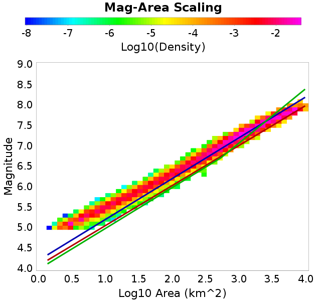
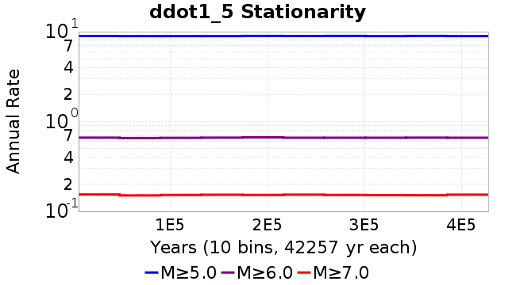

# ddot1_5
## Metadata
| **Catalog** | ddot1_5 |
|-----|-----|
| **Author** | Jaqcui Gilchrist, 2018/09/27 |
| **Description** | change ddotEQ: ddotEQ=1.5 |
| **Fault/Def Model** | Fault Model 3.1, Geologic |
| **Slip Velocity** | 1.5 m/s |
| **Average Element Area** | 1.35 km^2 |
| **Length** | 8,317,927 events in 427,578 years |
| **Frictional Params** | a=0.001, b=0.008, (b-a)=0.007, ddotEQ=1.5 |

* [Metadata](#metadata)
* [Plots](#plots)
  * [Magnitude-Frequency Plot](#magnitude-frequency-plot)
  * [Magnitude-Area Plots](#magnitude-area-plots)
  * [Slip-Area Plots](#slip-area-plots)
  * [Rupture Velocity Plots](#rupture-velocity-plots)
  * [Global Interevent-Time Distributions](#global-interevent-time-distributions)
  * [Normalized Fault Interevent-Time Distributions](#normalized-fault-interevent-time-distributions)
  * [Stationarity Plot](#stationarity-plot)
  * [Element/Subsection Interevent Time Comparisons](#elementsubsection-interevent-time-comparisons)
    * [Element Interevent Time Comparisons](#element-interevent-time-comparisons)
    * [Subsection Interevent Time Comparisons](#subsection-interevent-time-comparisons)
  * [Paleo Open Interval Plots](#paleo-open-interval-plots)
    * [Paleo Open Interval Plots, Biasi and Sharer 2019](#paleo-open-interval-plots-biasi-and-sharer-2019)
    * [Paleo Open Interval Plots, UCERF3](#paleo-open-interval-plots-ucerf3)
  * [Moment Release Variability Plots](#moment-release-variability-plots)
* [Input File](#input-file)

## Plots
### Magnitude-Frequency Plot
*[(top)](#ddot1_5)*


### Magnitude-Area Plots
*[(top)](#ddot1_5)*

| Scatter | 2-D Hist |
|-----|-----|
|  |  |
### Slip-Area Plots
*[(top)](#ddot1_5)*

| Scatter | 2-D Hist |
|-----|-----|
|  |  |
### Rupture Velocity Plots
*[(top)](#ddot1_5)*

| **Scatter** |  |
|-----|-----|
| **Distance/Velocity** |  |
### Global Interevent-Time Distributions
*[(top)](#ddot1_5)*

| **M≥6** | **M≥6.5** | **M≥7** | **M≥7.5** |
|-----|-----|-----|-----|
|  |  |  |  |
### Normalized Fault Interevent-Time Distributions
*[(top)](#ddot1_5)*

|  | **M≥6** | **M≥6.5** | **M≥7** | **M≥7.5** |
|-----|-----|-----|-----|-----|
| **Elements** |  |  |  |  |
| **Subsections** |  |  |  |  |
| **Sections** |  |  |  |  |
### Stationarity Plot
*[(top)](#ddot1_5)*


### Element/Subsection Interevent Time Comparisons

#### Element Interevent Time Comparisons
*[(top)](#ddot1_5)*

| Min Mag | Scatter | 2-D Hist |
|-----|-----|-----|
| **M≥6.0** |  |  |
| **M≥6.5** |  |  |
| **M≥7.0** |  |  |
| **M≥7.5** |  |  |

#### Subsection Interevent Time Comparisons
*[(top)](#ddot1_5)*

*Subsections participate in a rupture if at least 20.0 % of its area ruptures*

| Min Mag | Scatter | 2-D Hist |
|-----|-----|-----|
| **M≥6.0** |  |  |
| **M≥6.5** |  |  |
| **M≥7.0** |  |  |
| **M≥7.5** |  |  |

### Paleo Open Interval Plots
*[(top)](#ddot1_5)*

#### Paleo Open Interval Plots, Biasi and Sharer 2019
*[(top)](#ddot1_5)*

These plots use the 5 paleoseismic sites identified in Biasi & Scharer (2019) on the Hayward, N. SAF, S. SAF, and SJC faults. By default, a rupture is counted at a paleo site if the nearest element (at the surface) slips any amount. We also alternatively apply a probability of detection model. Those results are marked as 'Prob. Filtered'.

**Paleoseismic sites table:**

| **Site Name** | Data MRI (yr) | Data Annual Rate | Catalog MRI (yr) | Catalog Annual Rate | Catalog Occurences | Prob Filtered Catalog MRI (yr) | Prob Filtered Catalog Annual Rate | Prob Filtered Catalog Occurences |
|-----|-----|-----|-----|-----|-----|-----|-----|-----|
| **HOG** | 191.00 | 0.005235602 | 363.30 | 0.0027525336 | 1164 | 367.55 | 0.0027207017 | 1150.53 |
| **FRA** | 119.00 | 0.008403362 | 117.89 | 0.008482478 | 3585 | 123.44 | 0.008101029 | 3423.81 |
| **COA** | 181.00 | 0.005524862 | 179.44 | 0.0055728005 | 2355 | 191.82 | 0.005213226 | 2203.08 |
| **SCZ** | 106.00 | 0.009433962 | 123.12 | 0.008122387 | 3432 | 141.74 | 0.007055416 | 2981.25 |
| **TYS** | 329.00 | 0.0030395137 | 346.04 | 0.00288988 | 1221 | 383.11 | 0.0026101863 | 1102.81 |
| **TOTAL** | 31.61 | 0.0316373 | 35.95 | 0.027820202 | 11757 | 38.91 | 0.025698405 | 10860.36 |

**Paleoseismic Plots:**

|  |  |
|-----|-----|

**Open interval probabilities table:**

| **Open Interval (yr)** | Catalog Probability | Catalog Poisson Probability | Prob. Filtered Catalog Probability | Prob. Filtered Catalog Poisson Probability | Data Poisson Probability |
|-----|-----|-----|-----|-----|-----|
| **10.00** | 0.97335076 | 0.75714386 | 0.9771711 | 0.7733806 | 0.72878754 |
| **20.00** | 0.9046456 | 0.5732668 | 0.9170494 | 0.5981175 | 0.53113127 |
| **30.00** | 0.80650103 | 0.43404543 | 0.82980865 | 0.46257243 | 0.3870819 |
| **40.00** | 0.69354576 | 0.32863483 | 0.72799474 | 0.35774451 | 0.28210047 |
| **50.00** | 0.57109624 | 0.24882384 | 0.61546713 | 0.27667263 | 0.2055913 |
| **60.00** | 0.4490359 | 0.18839544 | 0.50128573 | 0.21397324 | 0.14983238 |
| **70.00** | 0.3403565 | 0.14264244 | 0.39456487 | 0.16548274 | 0.10919597 |
| **80.00** | 0.25045443 | 0.10800085 | 0.3039659 | 0.12798114 | 0.079580665 |
| **90.00** | 0.168443 | 0.08177218 | 0.21807666 | 0.09897812 | 0.057997398 |
| **100.00** | 0.1098522 | 0.0619133 | 0.15265615 | 0.07654775 | 0.04226778 |
| **110.00** | 0.06669993 | 0.046877276 | 0.10042765 | 0.059200544 | 0.030804234 |
| **120.00** | 0.03506914 | 0.03549284 | 0.060078617 | 0.045784548 | 0.022449743 |
| **130.00** | 0.013132246 | 0.026873186 | 0.029170152 | 0.03540888 | 0.016361093 |
| **140.00** | 0.0013655784 | 0.020346867 | 0.008865825 | 0.027384538 | 0.011923761 |
| **150.00** | 7.2633696E-4 | 0.015405505 | 0.0039022327 | 0.021178668 | 0.008689889 |
| **160.00** | 0.0 | 0.011664184 | 0.0013951096 | 0.01637917 | 0.0063330824 |
| **170.00** | 0.0 | 0.008831465 | 9.470634E-4 | 0.012667332 | 0.0046154717 |
| **180.00** | 0.0 | 0.0066866893 | 5.3362927E-4 | 0.009796668 | 0.0033636983 |
| **190.00** | 0.0 | 0.0050627855 | 3.0369894E-4 | 0.0075765527 | 0.0024514215 |
| **200.00** | 0.0 | 0.003833257 | 1.8597208E-4 | 0.0058595585 | 0.0017865654 |
| **210.00** | 0.0 | 0.0029023269 | 6.948779E-5 | 0.0045316685 | 0.0013020267 |
| **220.00** | 0.0 | 0.002197479 | 3.0937284E-5 | 0.0035047042 | 9.489008E-4 |
| **230.00** | 0.0 | 0.0016638077 | 1.8577923E-5 | 0.0027104702 | 6.915471E-4 |
| **240.00** | 0.0 | 0.0012597417 | 8.518383E-6 | 0.0020962248 | 5.039909E-4 |
| **250.00** | 0.0 | 9.538057E-4 | 0.0 | 0.0016211795 | 3.673023E-4 |

#### Paleo Open Interval Plots, UCERF3
*[(top)](#ddot1_5)*

These plots use the full set of UCERF3 paleoseismic sites. By default, a rupture is counted at a paleo site if the nearest element (at the surface) slips any amount. We also alternativeslyapply a probability of detection model. Those results are marked as 'Prob. Filtered'.

**Paleoseismic sites table:**

| **Site Name** | Data MRI (yr) | Data Annual Rate | Catalog MRI (yr) | Catalog Annual Rate | Catalog Occurences | Prob Filtered Catalog MRI (yr) | Prob Filtered Catalog Annual Rate | Prob Filtered Catalog Occurences |
|-----|-----|-----|-----|-----|-----|-----|-----|-----|
| **SSanAndreasBurroFlats** | 205.44 | 0.0048677 | 208.33 | 0.0048000147 | 2028 | 236.98 | 0.0042197197 | 1782.68 |
| **SSanAndreasIndio** | 277.37 | 0.0036053 | 175.86 | 0.0056864345 | 2403 | 186.64 | 0.005357942 | 2264.18 |
| **SSAFMCreek1000Palms** | 261.33 | 0.0038266 | 1606.22 | 6.225804E-4 | 263 | 2316.38 | 4.3170826E-4 | 182.09 |
| **NSanAndreasFortRoss** | 306.28 | 0.003265 | 191.41 | 0.0052244877 | 2208 | 193.79 | 0.005160215 | 2180.83 |
| **NSanAndreasNorthCoast** | 263.87 | 0.0037898 | 182.01 | 0.0054943524 | 2322 | 186.61 | 0.0053588017 | 2264.68 |
| **CalaverasfaultNorth** | 618.05 | 0.001618 | 166.37 | 0.0060107997 | 2540 | 238.75 | 0.0041885055 | 1769.49 |
| **ElsinoreTemecula** | 1019.16 | 9.812E-4 | 697.35 | 0.0014339959 | 606 | 724.88 | 0.0013795374 | 582.95 |
| **ElsinoreWhittier** | 3196.93 | 3.128E-4 | 1552.16 | 6.4426276E-4 | 272 | 1632.56 | 6.125359E-4 | 258.6 |
| **SSAFCarrizoBidart** | 114.71 | 0.0087179 | 124.60 | 0.008025693 | 3392 | 127.94 | 0.007815874 | 3303.3 |
| **SanJacintoHogLake** | 311.78 | 0.0032074 | 363.30 | 0.0027525336 | 1164 | 367.71 | 0.0027195183 | 1150.04 |
| **PuenteHills** | 3506.31 | 2.852E-4 | 5300.95 | 1.8864548E-4 | 79 | 5709.10 | 1.7515899E-4 | 73.31 |
| **SanGregorioNorth** | 1019.06 | 9.813E-4 | 396.69 | 0.002520871 | 1065 | 411.12 | 0.002432386 | 1027.59 |
| **SanJacintoSuperstition** | 508.26 | 0.0019675 | 1259.42 | 7.9401553E-4 | 336 | 1337.08 | 7.478994E-4 | 316.35 |
| **SSanAndreasWrightwood** | 106.04 | 0.0094304 | 154.83 | 0.0064588953 | 2730 | 156.59 | 0.0063862596 | 2699.31 |
| **SSanAndreasPitmanCanyon** | 173.48 | 0.0057643 | 145.71 | 0.0068631377 | 2900 | 161.92 | 0.006175998 | 2609.68 |
| **SSanAndreasPlungeCreek** | 205.36 | 0.0048695 | 367.52 | 0.0027209546 | 1150 | 449.63 | 0.0022240693 | 939.99 |
| **FrazierMountianSSAF** | 148.57 | 0.0067307 | 117.89 | 0.008482478 | 3585 | 123.54 | 0.008094573 | 3421.08 |
| **NSanAndreasSantaCruzSeg** | 109.84 | 0.0091041 | 123.12 | 0.008122387 | 3432 | 142.06 | 0.007039524 | 2974.46 |
| **RodgersCreek** | 325.31 | 0.003074 | 171.81 | 0.0058202907 | 2460 | 232.50 | 0.0043010702 | 1817.73 |
| **GreenValleyMasonRoad** | 293.31 | 0.0034094 | 1747.56 | 5.7222776E-4 | 242 | 2336.25 | 4.2803623E-4 | 180.8 |
| **HaywardfaultNorth** | 318.34 | 0.0031413 | 374.25 | 0.0026720387 | 1130 | 384.42 | 0.0026013267 | 1100.02 |
| **HaywardfaultSouth** | 167.57 | 0.0059677 | 346.04 | 0.00288988 | 1221 | 383.22 | 0.0026094639 | 1102.45 |
| **Compton** | 2658.16 | 3.762E-4 | 6011.98 | 1.6633453E-4 | 69 | 6642.24 | 1.5055163E-4 | 62.54 |
| **SSanAndreasCoachella** | 178.45 | 0.0056037 | 179.44 | 0.0055728005 | 2355 | 191.75 | 0.0052150204 | 2203.84 |
| **ElsinoreGlenIvy** | 179.12 | 0.0055828 | 582.73 | 0.0017160546 | 725 | 627.32 | 0.0015940816 | 673.46 |
| **GarlockCentralallevents** | 1434.93 | 6.969E-4 | 641.19 | 0.0015596092 | 659 | 652.37 | 0.0015328838 | 647.69 |
| **NSanAndreasAlderCreek** | 869.64 | 0.0011499 | 190.89 | 0.0052386913 | 2214 | 193.91 | 0.0051571624 | 2179.55 |
| **SSanAndreasPallettCreek** | 149.30 | 0.006698 | 154.60 | 0.0064683626 | 2734 | 156.32 | 0.006397068 | 2703.86 |
| **GarlockWesternallevents** | 1230.16 | 8.129E-4 | 829.98 | 0.0012048457 | 509 | 850.85 | 0.0011752978 | 496.53 |
| **ElsinoreFaultJulian** | 3250.98 | 3.076E-4 | 1265.08 | 7.9046434E-4 | 334 | 1290.56 | 7.748598E-4 | 327.36 |
| **TOTAL** | 9.08 | 0.1101451 | 14.59 | 0.06855557 | 28971 | 16.17 | 0.061857596 | 26140.55 |

**Paleoseismic Plots:**

|  |  |
|-----|-----|

**Open interval probabilities table:**

| **Open Interval (yr)** | Catalog Probability | Catalog Poisson Probability | Prob. Filtered Catalog Probability | Prob. Filtered Catalog Poisson Probability | Data Poisson Probability |
|-----|-----|-----|-----|-----|-----|
| **10.00** | 0.860123 | 0.50381017 | 0.8810504 | 0.538711 | 0.33238843 |
| **20.00** | 0.6086442 | 0.25382468 | 0.6562218 | 0.2902096 | 0.110482074 |
| **30.00** | 0.38172144 | 0.12787946 | 0.4376757 | 0.15633911 | 0.036722966 |
| **40.00** | 0.2111226 | 0.06442697 | 0.26330683 | 0.0842216 | 0.012206289 |
| **50.00** | 0.1085852 | 0.03245896 | 0.14958498 | 0.045371108 | 0.004057229 |
| **60.00** | 0.049531534 | 0.016353155 | 0.07681187 | 0.024441916 | 0.001348576 |
| **70.00** | 0.023906616 | 0.008238886 | 0.039204735 | 0.01316713 | 4.4825108E-4 |
| **80.00** | 0.00777736 | 0.0041508344 | 0.016480867 | 0.007093278 | 1.4899348E-4 |
| **90.00** | 0.003049115 | 0.0020912327 | 0.006801457 | 0.0038212272 | 4.952371E-5 |
| **100.00** | 4.2968933E-4 | 0.0010535843 | 0.0017593605 | 0.0020585372 | 1.6461108E-5 |
| **110.00** | 0.0 | 5.308065E-4 | 6.506497E-4 | 0.0011089568 | 5.4714824E-6 |
| **120.00** | 0.0 | 2.674257E-4 | 1.8823435E-4 | 5.974072E-4 | 1.8186574E-6 |
| **130.00** | 0.0 | 1.3473179E-4 | 1.04428786E-4 | 3.2182987E-4 | 6.045007E-7 |
| **140.00** | 0.0 | 6.787924E-5 | 3.4843802E-6 | 1.7337331E-4 | 2.0092905E-7 |
| **150.00** | 0.0 | 3.4198252E-5 | 0.0 | 9.3398114E-5 | 6.678649E-8 |

### Moment Release Variability Plots
*[(top)](#ddot1_5)*

We first create a tapered moment release time series for the entire catalog. Each event's moment is distributed across a 25 year Hanning (cosine) taper. Here is a plot of a random 2,000 year section of this time series:


We then compute Welch's power spectral density estimate on the entire time series. Results are plotted below, with a Poisson randomization of the catalog also plotted in gray as a control. Significant deviations above the Poisson model indicate synchronization at that period.


## Input File
*[(top)](#ddot1_5)*

```
  A_1 = 0.001
  fA = .1
  B_1 = 0.008
  muSlipAmp_1 = .0
  muSlipInvDist_1 = 1.0
  cohesion = 0.0
  Dc_1 = 1.0000000000000000818e-05
  mu0_1 = 0.6
  ddotStar_1 = 9.9999999999999995475e-07
  ddotAB_1 = 9.9999999999999995475e-07
  alpha_1 = 0.0
  theta0_1 = 200000000
  tau0_1 = 55.1
  sigma0_1 = 100
  sigmaFracPin = .5
  lowSigmaAction = 1
  maxThetaPin = 1.0e13
  ddotEQ_1 = 1.5
  ddotEQFname = 
  stressOvershootFactor = 0.10000000000000000555
  lameLambda = 30000
  lameMu = 30000
  slowSlip_1 = 0
  nEq = 100000000000
  KZeroFrac = 0
  muPin = 1.0
  tStart = 0
  maxT = 3.16e13
  maxWallTime = 169200
  maxTrans = 1.0000000000000000159e100
  faultFname = UCERF3FM.15km.1km.tri.flt
  outFnameInfix = ddot1_5
  writeTau = 2
  writeSigma = 2
  writeSlip = 0
  writeSlipSpeed = 0
  writeState = 0
  writeTheta = 2
  writePED = 1
  writeTransitions = 1
  minDtWrite = 0
  minDtWriteCoseismic = 0
  minDtWriteInterseismic = 0
  minMagWrite = 7.7
  writeStiffness = 0
  stressRateSpecification = 1
  dMu3 = 0.01000000000000000
  initTauFname = 
  initSigmaFname = 
  initThetaFname = 
  initSlipSpeedFname = 
  AFname = 
  BFname =  
  DcFname = 
  mu0Fname = 
  ddotStarFname = 
  ddotABFname = 
  alphaFname = 
  KTauFname = /u/sciteam/gilchris/scratch/stiffness_25a589d/Ktau.25a589d.out
  KSigmaFname = /u/sciteam/gilchris/scratch/stiffness_25a589d/Ksigma.25a589d.out
  tFailFname = 
  tauFailFname = 
  tauDotFname = 
  sigmaDotFname =
  KZeroFname = UCERF3FM.15km.1km.tri.KZero
  pinnedFname =  UCERF3FM.15km.1km.tri.pin
  neighborFname = UCERF3FM.15km.1km.tri.neighbors
  stressRateFname =  
  slowSlipFname = 
  writePatchFname = 
  DEBUG = 0
  ZBrentUpperBracket = 0
  receiverElementAreaFrac = 0.8
  receiverElementIntTol = 1.0e-4
  receiverElementSubdivisionMax = 4
  tgfDist1 = 3
  tgfDist1 = 10
  lowSigmaAction = 1
  highSigmaAction = 0
```
