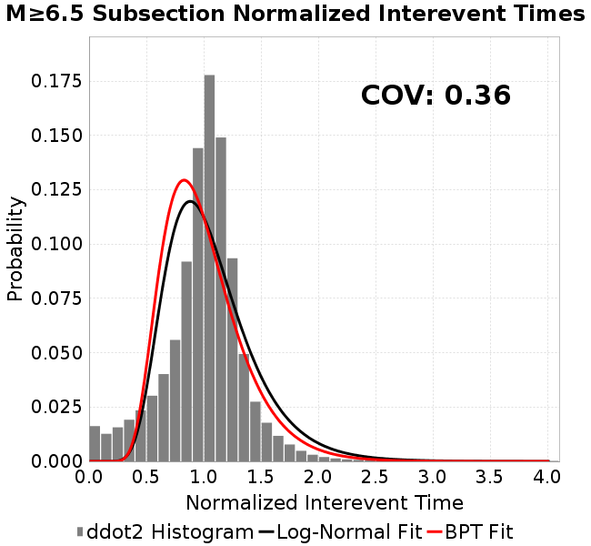
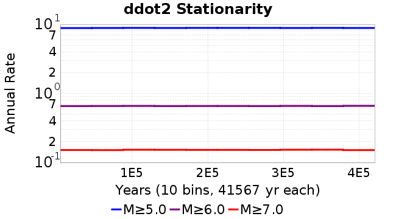
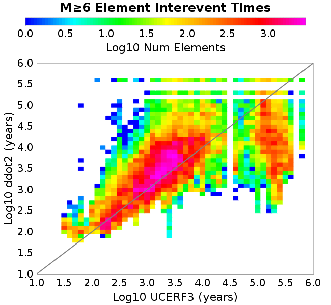

# ddot2
## Metadata
| **Catalog** | ddot2 |
|-----|-----|
| **Author** | Jaqcui Gilchrist, 2018/09/27 |
| **Description** | change ddotEQ: ddotEQ=2 |
| **Fault/Def Model** | Fault Model 3.1, Geologic |
| **Slip Velocity** | 2.0 m/s |
| **Average Element Area** | 1.35 km^2 |
| **Length** | 8,114,986 events in 420,676 years |
| **Frictional Params** | a=0.001, b=0.008, (b-a)=0.007, ddotEQ=2 |

* [Metadata](#metadata)
* [Plots](#plots)
  * [Magnitude-Frequency Plot](#magnitude-frequency-plot)
  * [Magnitude-Area Plots](#magnitude-area-plots)
  * [Slip-Area Plots](#slip-area-plots)
  * [Rupture Velocity Plots](#rupture-velocity-plots)
  * [Global Interevent-Time Distributions](#global-interevent-time-distributions)
  * [Normalized Fault Interevent-Time Distributions](#normalized-fault-interevent-time-distributions)
  * [Stationarity Plot](#stationarity-plot)
  * [Element/Subsection Interevent Time Comparisons](#elementsubsection-interevent-time-comparisons)
    * [Element Interevent Time Comparisons](#element-interevent-time-comparisons)
    * [Subsection Interevent Time Comparisons](#subsection-interevent-time-comparisons)
  * [Paleo Open Interval Plots](#paleo-open-interval-plots)
    * [Paleo Open Interval Plots, Biasi and Sharer 2019](#paleo-open-interval-plots-biasi-and-sharer-2019)
    * [Paleo Open Interval Plots, UCERF3](#paleo-open-interval-plots-ucerf3)
  * [Moment Release Variability Plots](#moment-release-variability-plots)
* [Input File](#input-file)

## Plots
### Magnitude-Frequency Plot
*[(top)](#ddot2)*


### Magnitude-Area Plots
*[(top)](#ddot2)*

| Scatter | 2-D Hist |
|-----|-----|
|  |  |
### Slip-Area Plots
*[(top)](#ddot2)*

| Scatter | 2-D Hist |
|-----|-----|
|  |  |
### Rupture Velocity Plots
*[(top)](#ddot2)*

| **Scatter** |  |
|-----|-----|
| **Distance/Velocity** |  |
### Global Interevent-Time Distributions
*[(top)](#ddot2)*

| **M≥6** | **M≥6.5** | **M≥7** | **M≥7.5** |
|-----|-----|-----|-----|
|  |  |  |  |
### Normalized Fault Interevent-Time Distributions
*[(top)](#ddot2)*

|  | **M≥6** | **M≥6.5** | **M≥7** | **M≥7.5** |
|-----|-----|-----|-----|-----|
| **Elements** |  |  |  |  |
| **Subsections** |  |  |  |  |
| **Sections** |  |  |  |  |
### Stationarity Plot
*[(top)](#ddot2)*


### Element/Subsection Interevent Time Comparisons

#### Element Interevent Time Comparisons
*[(top)](#ddot2)*

| Min Mag | Scatter | 2-D Hist |
|-----|-----|-----|
| **M≥6.0** |  |  |
| **M≥6.5** |  |  |
| **M≥7.0** |  |  |
| **M≥7.5** |  |  |

#### Subsection Interevent Time Comparisons
*[(top)](#ddot2)*

*Subsections participate in a rupture if at least 20.0 % of its area ruptures*

| Min Mag | Scatter | 2-D Hist |
|-----|-----|-----|
| **M≥6.0** |  |  |
| **M≥6.5** |  |  |
| **M≥7.0** |  |  |
| **M≥7.5** |  |  |

### Paleo Open Interval Plots
*[(top)](#ddot2)*

#### Paleo Open Interval Plots, Biasi and Sharer 2019
*[(top)](#ddot2)*

These plots use the 5 paleoseismic sites identified in Biasi & Scharer (2019) on the Hayward, N. SAF, S. SAF, and SJC faults. By default, a rupture is counted at a paleo site if the nearest element (at the surface) slips any amount. We also alternatively apply a probability of detection model. Those results are marked as 'Prob. Filtered'.

**Paleoseismic sites table:**

| **Site Name** | Data MRI (yr) | Data Annual Rate | Catalog MRI (yr) | Catalog Annual Rate | Catalog Occurences | Prob Filtered Catalog MRI (yr) | Prob Filtered Catalog Annual Rate | Prob Filtered Catalog Occurences |
|-----|-----|-----|-----|-----|-----|-----|-----|-----|
| **HOG** | 191.00 | 0.005235602 | 368.44 | 0.0027141636 | 1128 | 372.49 | 0.0026846163 | 1115.68 |
| **FRA** | 119.00 | 0.008403362 | 120.43 | 0.008303836 | 3452 | 125.67 | 0.007957136 | 3307.88 |
| **COA** | 181.00 | 0.005524862 | 182.95 | 0.005465893 | 2271 | 195.04 | 0.0051272134 | 2130.33 |
| **SCZ** | 106.00 | 0.009433962 | 123.65 | 0.008087594 | 3362 | 142.41 | 0.0070220013 | 2918.71 |
| **TYS** | 329.00 | 0.0030395137 | 349.73 | 0.0028593855 | 1188 | 386.02 | 0.0025905594 | 1076.36 |
| **TOTAL** | 31.61 | 0.0316373 | 36.46 | 0.027428856 | 11401 | 39.40 | 0.025379114 | 10548.98 |

**Paleoseismic Plots:**

|  |  |
|-----|-----|

**Open interval probabilities table:**

| **Open Interval (yr)** | Catalog Probability | Catalog Poisson Probability | Prob. Filtered Catalog Probability | Prob. Filtered Catalog Poisson Probability | Data Poisson Probability |
|-----|-----|-----|-----|-----|-----|
| **10.00** | 0.97342664 | 0.7601127 | 0.977147 | 0.7758538 | 0.72878754 |
| **20.00** | 0.90764886 | 0.5777713 | 0.91970646 | 0.60194916 | 0.53113127 |
| **30.00** | 0.8107939 | 0.43917134 | 0.832757 | 0.46702456 | 0.3870819 |
| **40.00** | 0.6898311 | 0.33381972 | 0.72390205 | 0.3623428 | 0.28210047 |
| **50.00** | 0.5692332 | 0.2537406 | 0.6135365 | 0.28112507 | 0.2055913 |
| **60.00** | 0.45816672 | 0.19287147 | 0.50735164 | 0.21811196 | 0.14983238 |
| **70.00** | 0.35267356 | 0.14660405 | 0.4034509 | 0.169223 | 0.10919597 |
| **80.00** | 0.2572569 | 0.1114356 | 0.30801627 | 0.13129231 | 0.079580665 |
| **90.00** | 0.17800695 | 0.08470362 | 0.22612613 | 0.101863645 | 0.057997398 |
| **100.00** | 0.118401475 | 0.0643843 | 0.15901838 | 0.079031296 | 0.04226778 |
| **110.00** | 0.07431947 | 0.04893932 | 0.107220195 | 0.061316736 | 0.030804234 |
| **120.00** | 0.03944413 | 0.0371994 | 0.064841785 | 0.047572825 | 0.022449743 |
| **130.00** | 0.015111679 | 0.028275738 | 0.031756505 | 0.036909558 | 0.016361093 |
| **140.00** | 0.0051958514 | 0.021492748 | 0.013269199 | 0.028636424 | 0.011923761 |
| **150.00** | 9.801685E-4 | 0.01633691 | 0.004647811 | 0.02221768 | 0.008689889 |
| **160.00** | 5.8794254E-4 | 0.012417893 | 0.0021291713 | 0.01723767 | 0.0063330824 |
| **170.00** | 0.0 | 0.009438998 | 9.832627E-4 | 0.013373913 | 0.0046154717 |
| **180.00** | 0.0 | 0.0071747024 | 4.911364E-4 | 0.010376202 | 0.0033636983 |
| **190.00** | 0.0 | 0.0054535824 | 3.3655035E-4 | 0.008050417 | 0.0024514215 |
| **200.00** | 0.0 | 0.0041453373 | 1.6306204E-4 | 0.0062459465 | 0.0017865654 |
| **210.00** | 0.0 | 0.0031509236 | 8.860861E-5 | 0.0048459414 | 0.0013020267 |
| **220.00** | 0.0 | 0.0023950571 | 6.0983486E-5 | 0.0037597422 | 9.489008E-4 |
| **230.00** | 0.0 | 0.0018205134 | 2.1354726E-5 | 0.0029170103 | 6.915471E-4 |
| **240.00** | 0.0 | 0.0013837954 | 1.422123E-5 | 0.0022631737 | 5.039909E-4 |
| **250.00** | 0.0 | 0.0010518405 | 1.00860125E-5 | 0.0017558921 | 3.673023E-4 |
| **260.00** | 0.0 | 7.9951726E-4 | 0.0 | 0.0013623156 | 2.6768536E-4 |

#### Paleo Open Interval Plots, UCERF3
*[(top)](#ddot2)*

These plots use the full set of UCERF3 paleoseismic sites. By default, a rupture is counted at a paleo site if the nearest element (at the surface) slips any amount. We also alternativeslyapply a probability of detection model. Those results are marked as 'Prob. Filtered'.

**Paleoseismic sites table:**

| **Site Name** | Data MRI (yr) | Data Annual Rate | Catalog MRI (yr) | Catalog Annual Rate | Catalog Occurences | Prob Filtered Catalog MRI (yr) | Prob Filtered Catalog Annual Rate | Prob Filtered Catalog Occurences |
|-----|-----|-----|-----|-----|-----|-----|-----|-----|
| **SSanAndreasBurroFlats** | 205.44 | 0.0048677 | 211.54 | 0.004727305 | 1966 | 239.64 | 0.004172855 | 1735.52 |
| **SSanAndreasIndio** | 277.37 | 0.0036053 | 179.09 | 0.005583879 | 2320 | 189.80 | 0.0052688047 | 2189.13 |
| **SSAFMCreek1000Palms** | 261.33 | 0.0038266 | 1599.42 | 6.252278E-4 | 260 | 2312.72 | 4.3239107E-4 | 179.33 |
| **NSanAndreasFortRoss** | 306.28 | 0.003265 | 193.83 | 0.0051590875 | 2144 | 196.40 | 0.005091537 | 2115.91 |
| **NSanAndreasNorthCoast** | 263.87 | 0.0037898 | 184.93 | 0.0054073995 | 2248 | 189.43 | 0.0052791014 | 2194.67 |
| **CalaverasfaultNorth** | 618.05 | 0.001618 | 170.81 | 0.005854384 | 2434 | 242.12 | 0.0041302238 | 1716.97 |
| **ElsinoreTemecula** | 1019.16 | 9.812E-4 | 711.31 | 0.0014058613 | 584 | 738.08 | 0.0013548713 | 562.75 |
| **ElsinoreWhittier** | 3196.93 | 3.128E-4 | 1520.98 | 6.5747125E-4 | 273 | 1622.07 | 6.1649753E-4 | 256.01 |
| **SSAFCarrizoBidart** | 114.71 | 0.0087179 | 124.91 | 0.008005465 | 3328 | 128.34 | 0.0077915057 | 3238.98 |
| **SanJacintoHogLake** | 311.78 | 0.0032074 | 368.44 | 0.0027141636 | 1128 | 372.76 | 0.0026826642 | 1114.89 |
| **PuenteHills** | 3506.31 | 2.852E-4 | 5175.78 | 1.9320758E-4 | 80 | 5632.98 | 1.7752594E-4 | 73.57 |
| **SanGregorioNorth** | 1019.06 | 9.813E-4 | 408.93 | 0.0024454058 | 1017 | 421.26 | 0.0023738027 | 987.21 |
| **SanJacintoSuperstition** | 508.26 | 0.0019675 | 1251.64 | 7.989494E-4 | 332 | 1332.49 | 7.5047393E-4 | 311.49 |
| **SSanAndreasWrightwood** | 106.04 | 0.0094304 | 156.47 | 0.0063908976 | 2657 | 158.23 | 0.0063197203 | 2627.41 |
| **SSanAndreasPitmanCanyon** | 173.48 | 0.0057643 | 146.85 | 0.0068095783 | 2831 | 162.64 | 0.0061483853 | 2555.93 |
| **SSanAndreasPlungeCreek** | 205.36 | 0.0048695 | 363.39 | 0.0027518347 | 1144 | 447.72 | 0.002233529 | 928.59 |
| **FrazierMountianSSAF** | 148.57 | 0.0067307 | 120.43 | 0.008303836 | 3452 | 125.54 | 0.007965426 | 3311.36 |
| **NSanAndreasSantaCruzSeg** | 109.84 | 0.0091041 | 123.65 | 0.008087594 | 3362 | 142.42 | 0.0070215836 | 2918.49 |
| **RodgersCreek** | 325.31 | 0.003074 | 171.31 | 0.0058374247 | 2426 | 232.52 | 0.0043007038 | 1787.25 |
| **GreenValleyMasonRoad** | 293.31 | 0.0034094 | 1761.71 | 5.6763133E-4 | 235 | 2359.99 | 4.237315E-4 | 175.33 |
| **HaywardfaultNorth** | 318.34 | 0.0031413 | 378.83 | 0.0026396855 | 1097 | 388.95 | 0.0025710014 | 1068.4 |
| **HaywardfaultSouth** | 167.57 | 0.0059677 | 349.73 | 0.0028593855 | 1188 | 386.94 | 0.0025843666 | 1073.77 |
| **Compton** | 2658.16 | 3.762E-4 | 6344.35 | 1.5762052E-4 | 66 | 6988.26 | 1.4309709E-4 | 59.8 |
| **SSanAndreasCoachella** | 178.45 | 0.0056037 | 182.95 | 0.005465893 | 2271 | 194.85 | 0.0051320437 | 2132.31 |
| **ElsinoreGlenIvy** | 179.12 | 0.0055828 | 585.00 | 0.0017094018 | 709 | 634.23 | 0.0015767271 | 654.03 |
| **GarlockCentralallevents** | 1434.93 | 6.969E-4 | 653.45 | 0.0015303454 | 636 | 664.44 | 0.0015050165 | 625.47 |
| **NSanAndreasAlderCreek** | 869.64 | 0.0011499 | 193.20 | 0.0051759393 | 2151 | 196.13 | 0.0050987126 | 2118.9 |
| **SSanAndreasPallettCreek** | 149.30 | 0.006698 | 156.41 | 0.0063933036 | 2658 | 158.08 | 0.006325852 | 2629.95 |
| **GarlockWesternallevents** | 1230.16 | 8.129E-4 | 830.77 | 0.0012037077 | 500 | 855.40 | 0.0011690463 | 485.61 |
| **ElsinoreFaultJulian** | 3250.98 | 3.076E-4 | 1279.17 | 7.817582E-4 | 325 | 1308.24 | 7.643852E-4 | 317.79 |
| **TOTAL** | 9.08 | 0.1101451 | 14.73 | 0.06788314 | 28218 | 16.31 | 0.06132616 | 25492.43 |

**Paleoseismic Plots:**

|  |  |
|-----|-----|

**Open interval probabilities table:**

| **Open Interval (yr)** | Catalog Probability | Catalog Poisson Probability | Prob. Filtered Catalog Probability | Prob. Filtered Catalog Poisson Probability | Data Poisson Probability |
|-----|-----|-----|-----|-----|-----|
| **10.00** | 0.8624874 | 0.50720936 | 0.88312393 | 0.5415816 | 0.33238843 |
| **20.00** | 0.6109846 | 0.25726137 | 0.6567922 | 0.29331058 | 0.110482074 |
| **30.00** | 0.38461402 | 0.13048537 | 0.4389261 | 0.1588516 | 0.036722966 |
| **40.00** | 0.21915475 | 0.0661834 | 0.2697083 | 0.086031094 | 0.012206289 |
| **50.00** | 0.11393453 | 0.033568844 | 0.15281667 | 0.046592854 | 0.004057229 |
| **60.00** | 0.05373806 | 0.017026434 | 0.0797397 | 0.02523383 | 0.001348576 |
| **70.00** | 0.024777567 | 0.008635966 | 0.040415216 | 0.013666176 | 4.4825108E-4 |
| **80.00** | 0.011236912 | 0.0043802434 | 0.01961164 | 0.007401349 | 1.4899348E-4 |
| **90.00** | 0.004572907 | 0.0022217005 | 0.0091783 | 0.0040084342 | 4.952371E-5 |
| **100.00** | 9.398935E-4 | 0.0011268674 | 0.0028089555 | 0.002170894 | 1.6461108E-5 |
| **110.00** | 3.623841E-4 | 5.7155767E-4 | 0.0011867373 | 0.0011757162 | 5.4714824E-6 |
| **120.00** | 0.0 | 2.898994E-4 | 2.1538686E-4 | 6.367462E-4 | 1.8186574E-6 |
| **130.00** | 0.0 | 1.4703971E-4 | 1.0189613E-4 | 3.4484998E-4 | 6.045007E-7 |
| **140.00** | 0.0 | 7.457992E-5 | 1.9672074E-5 | 1.8676439E-4 | 2.0092905E-7 |
| **150.00** | 0.0 | 3.7827635E-5 | 6.502815E-6 | 1.0114814E-4 | 6.678649E-8 |
| **160.00** | 0.0 | 1.9186531E-5 | 0.0 | 5.477997E-5 | 2.2199057E-8 |

### Moment Release Variability Plots
*[(top)](#ddot2)*

We first create a tapered moment release time series for the entire catalog. Each event's moment is distributed across a 25 year Hanning (cosine) taper. Here is a plot of a random 2,000 year section of this time series:


We then compute Welch's power spectral density estimate on the entire time series. Results are plotted below, with a Poisson randomization of the catalog also plotted in gray as a control. Significant deviations above the Poisson model indicate synchronization at that period.


## Input File
*[(top)](#ddot2)*

```
  A_1 = 0.001
  fA = .1
  B_1 = 0.008
  muSlipAmp_1 = .0
  muSlipInvDist_1 = 1.0
  cohesion = 0.0
  Dc_1 = 1.0000000000000000818e-05
  mu0_1 = 0.6
  ddotStar_1 = 9.9999999999999995475e-07
  ddotAB_1 = 9.9999999999999995475e-07
  alpha_1 = 0.0
  theta0_1 = 200000000
  tau0_1 = 55.1
  sigma0_1 = 100
  sigmaFracPin = .5
  lowSigmaAction = 1
  maxThetaPin = 1.0e13
  ddotEQ_1 = 2
  ddotEQFname = 
  stressOvershootFactor = 0.10000000000000000555
  lameLambda = 30000
  lameMu = 30000
  slowSlip_1 = 0
  nEq = 100000000000
  KZeroFrac = 0
  muPin = 1.0
  tStart = 0
  maxT = 3.16e13
  maxWallTime = 169200
  maxTrans = 1.0000000000000000159e100
  faultFname = UCERF3FM.15km.1km.tri.flt
  outFnameInfix = ddot2
  writeTau = 2
  writeSigma = 2
  writeSlip = 0
  writeSlipSpeed = 0
  writeState = 0
  writeTheta = 2
  writePED = 1
  writeTransitions = 1
  minDtWrite = 0
  minDtWriteCoseismic = 0
  minDtWriteInterseismic = 0
  minMagWrite = 7.7
  writeStiffness = 0
  stressRateSpecification = 1
  dMu3 = 0.01000000000000000
  initTauFname = 
  initSigmaFname = 
  initThetaFname = 
  initSlipSpeedFname = 
  AFname = 
  BFname =  
  DcFname = 
  mu0Fname = 
  ddotStarFname = 
  ddotABFname = 
  alphaFname = 
  KTauFname = /u/sciteam/gilchris/scratch/stiffness_25a589d/Ktau.25a589d.out
  KSigmaFname = /u/sciteam/gilchris/scratch/stiffness_25a589d/Ksigma.25a589d.out
  tFailFname = 
  tauFailFname = 
  tauDotFname = 
  sigmaDotFname =
  KZeroFname = UCERF3FM.15km.1km.tri.KZero
  pinnedFname =  UCERF3FM.15km.1km.tri.pin
  neighborFname = UCERF3FM.15km.1km.tri.neighbors
  stressRateFname =  
  slowSlipFname = 
  writePatchFname = 
  DEBUG = 0
  ZBrentUpperBracket = 0
  receiverElementAreaFrac = 0.8
  receiverElementIntTol = 1.0e-4
  receiverElementSubdivisionMax = 4
  tgfDist1 = 3
  tgfDist1 = 10
  lowSigmaAction = 1
  highSigmaAction = 0
```
