# ddot2_5
## Metadata
| **Catalog** | ddot2_5 |
|-----|-----|
| **Author** | Jaqcui Gilchrist, 2018/09/27 |
| **Description** | change ddotEQ: ddotEQ=2.5 |
| **Fault/Def Model** | Fault Model 3.1, Geologic |
| **Slip Velocity** | 2.5 m/s |
| **Average Element Area** | 1.35 km^2 |
| **Length** | 7,983,447 events in 416,428 years |
| **Frictional Params** | a=0.001, b=0.008, (b-a)=0.007, ddotEQ=2.5 |

* [Metadata](#metadata)
* [Plots](#plots)
  * [Magnitude-Frequency Plot](#magnitude-frequency-plot)
  * [Magnitude-Area Plots](#magnitude-area-plots)
  * [Slip-Area Plots](#slip-area-plots)
  * [Rupture Velocity Plots](#rupture-velocity-plots)
  * [Global Interevent-Time Distributions](#global-interevent-time-distributions)
  * [Normalized Fault Interevent-Time Distributions](#normalized-fault-interevent-time-distributions)
  * [Stationarity Plot](#stationarity-plot)
  * [Element/Subsection Interevent Time Comparisons](#elementsubsection-interevent-time-comparisons)
    * [Element Interevent Time Comparisons](#element-interevent-time-comparisons)
    * [Subsection Interevent Time Comparisons](#subsection-interevent-time-comparisons)
  * [Paleo Open Interval Plots](#paleo-open-interval-plots)
    * [Paleo Open Interval Plots, Biasi and Sharer 2019](#paleo-open-interval-plots-biasi-and-sharer-2019)
    * [Paleo Open Interval Plots, UCERF3](#paleo-open-interval-plots-ucerf3)
  * [Moment Release Variability Plots](#moment-release-variability-plots)
* [Input File](#input-file)

## Plots
### Magnitude-Frequency Plot
*[(top)](#ddot2_5)*


### Magnitude-Area Plots
*[(top)](#ddot2_5)*

| Scatter | 2-D Hist |
|-----|-----|
|  | 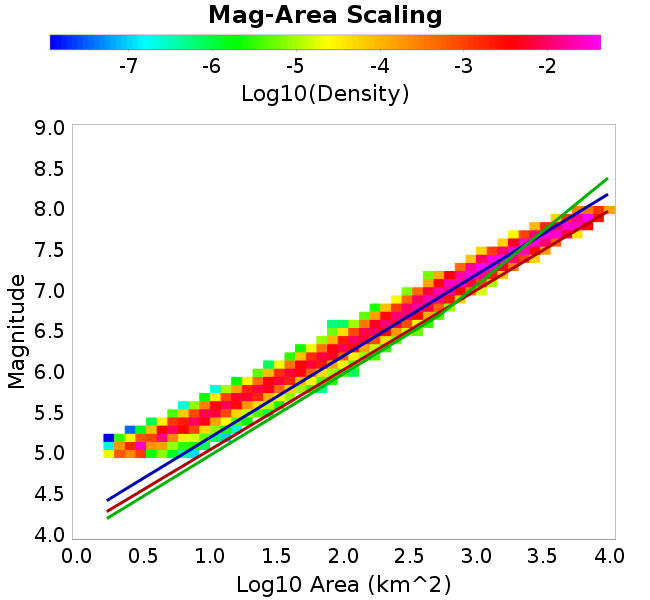 |
### Slip-Area Plots
*[(top)](#ddot2_5)*

| Scatter | 2-D Hist |
|-----|-----|
|  | 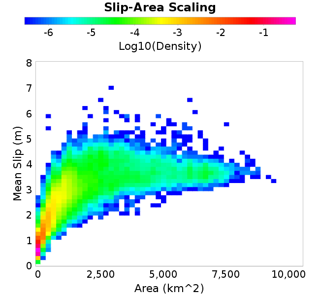 |
### Rupture Velocity Plots
*[(top)](#ddot2_5)*

| **Scatter** |  |
|-----|-----|
| **Distance/Velocity** | 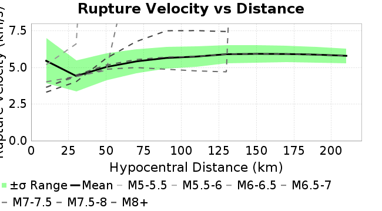 |
### Global Interevent-Time Distributions
*[(top)](#ddot2_5)*

| **M≥6** | **M≥6.5** | **M≥7** | **M≥7.5** |
|-----|-----|-----|-----|
|  | 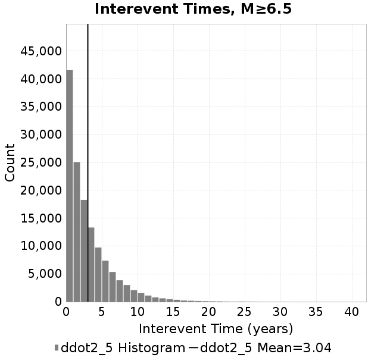 |  |  |
### Normalized Fault Interevent-Time Distributions
*[(top)](#ddot2_5)*

|  | **M≥6** | **M≥6.5** | **M≥7** | **M≥7.5** |
|-----|-----|-----|-----|-----|
| **Elements** |  |  | 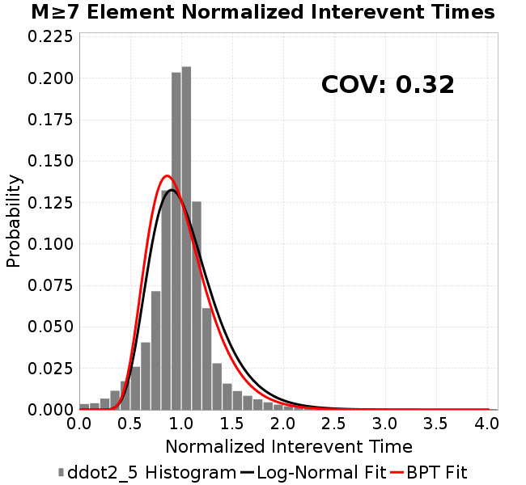 |  |
| **Subsections** |  |  | 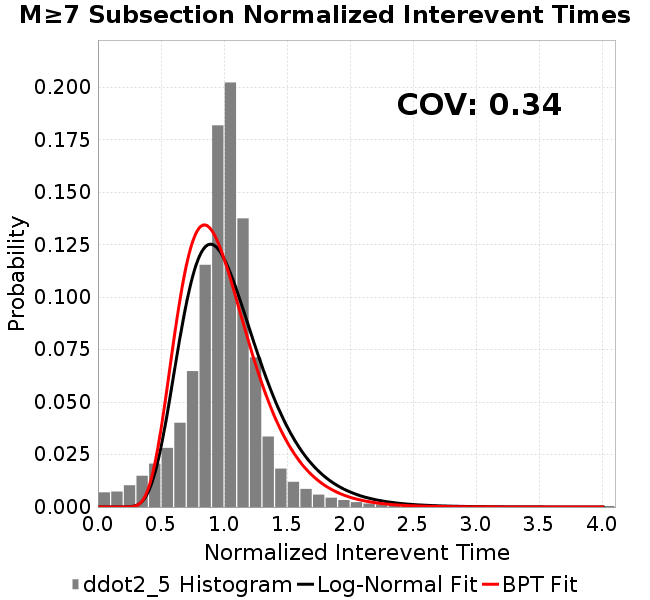 | 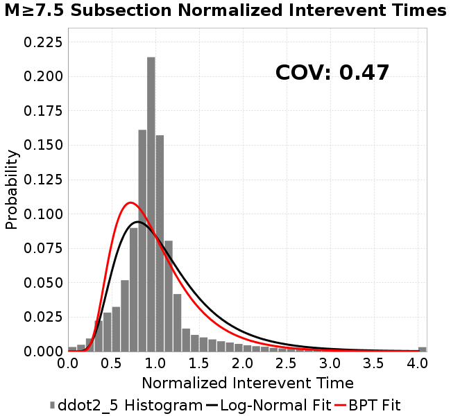 |
| **Sections** | 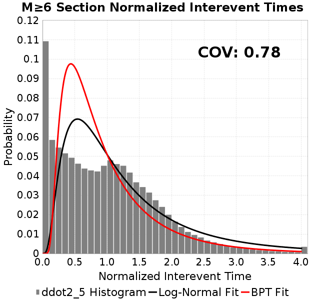 | 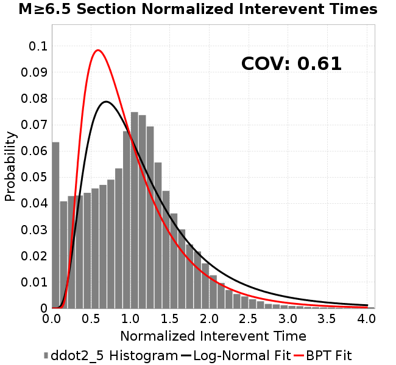 | 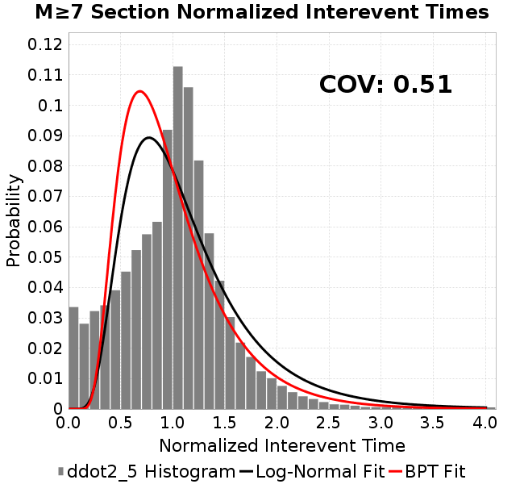 | 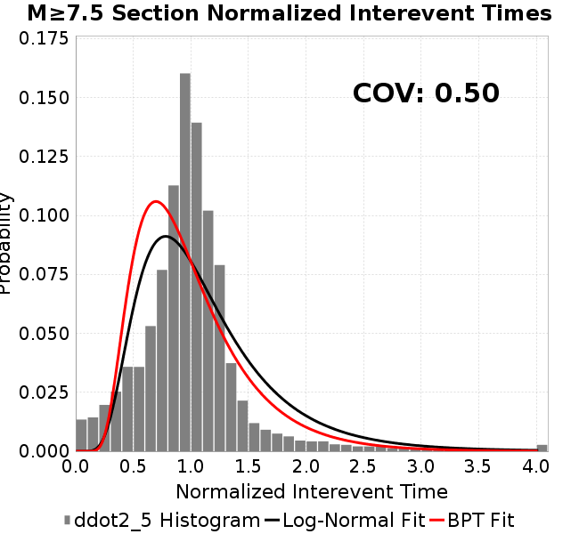 |
### Stationarity Plot
*[(top)](#ddot2_5)*

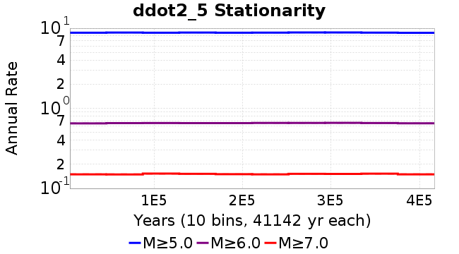
### Element/Subsection Interevent Time Comparisons

#### Element Interevent Time Comparisons
*[(top)](#ddot2_5)*

| Min Mag | Scatter | 2-D Hist |
|-----|-----|-----|
| **M≥6.0** | 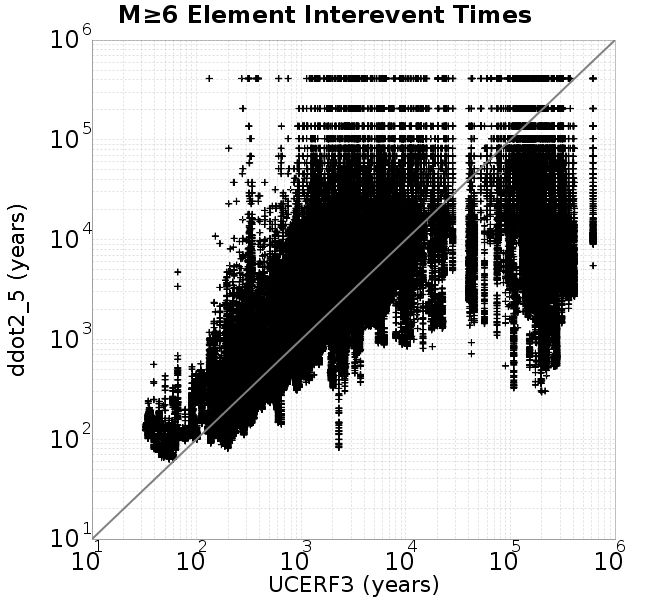 |  |
| **M≥6.5** |  | 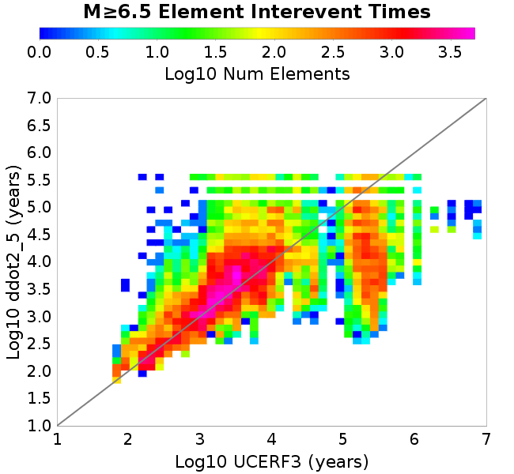 |
| **M≥7.0** | 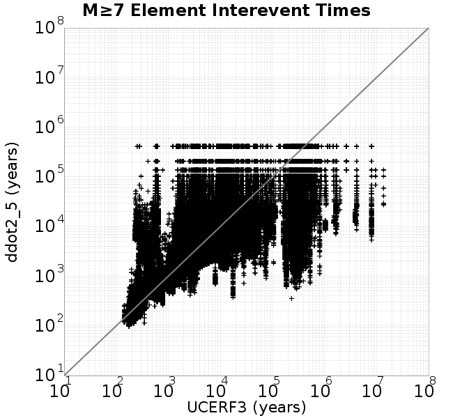 |  |
| **M≥7.5** | 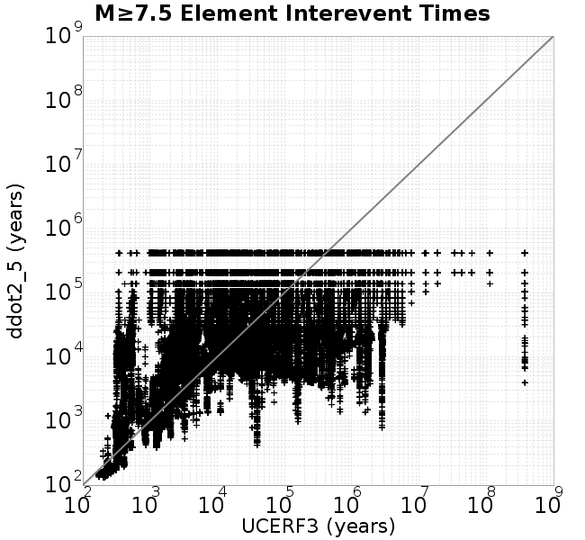 | 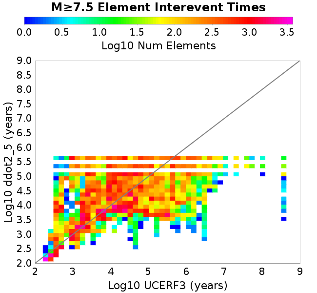 |

#### Subsection Interevent Time Comparisons
*[(top)](#ddot2_5)*

*Subsections participate in a rupture if at least 20.0 % of its area ruptures*

| Min Mag | Scatter | 2-D Hist |
|-----|-----|-----|
| **M≥6.0** |  |  |
| **M≥6.5** | 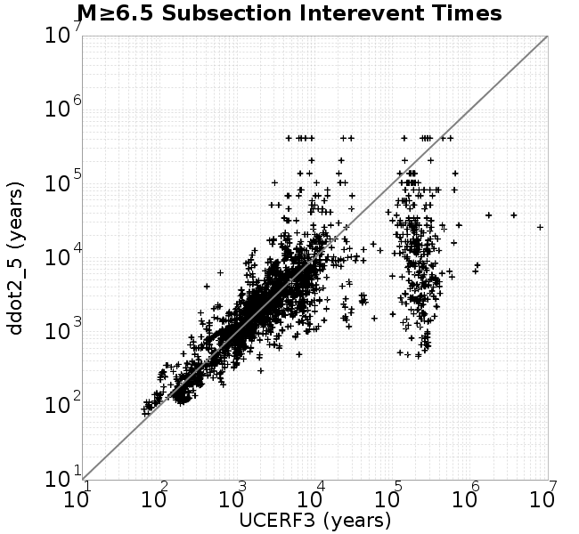 | 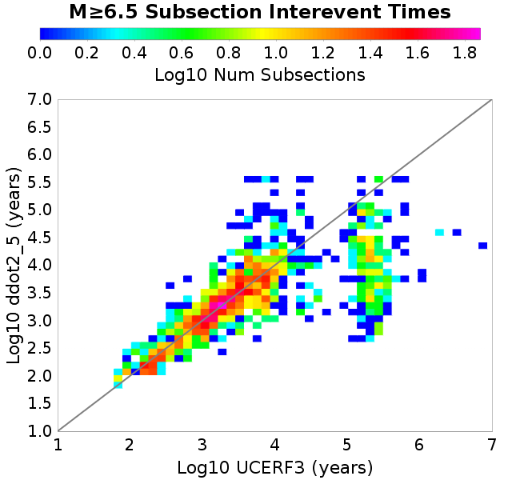 |
| **M≥7.0** |  |  |
| **M≥7.5** | 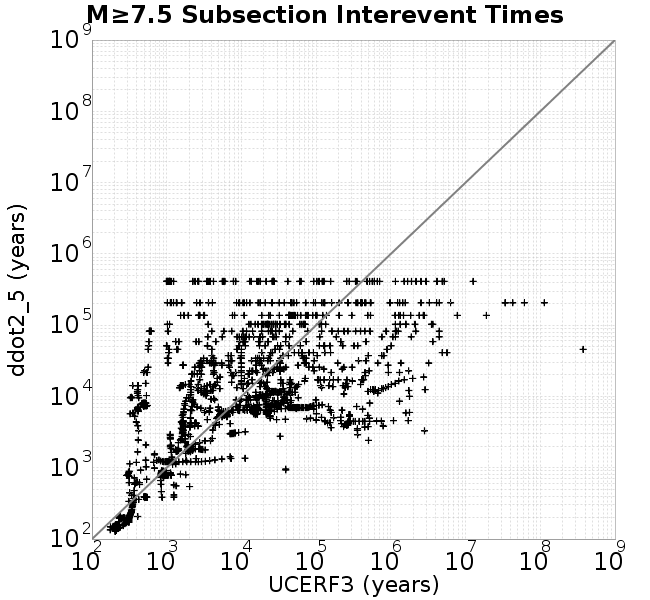 | 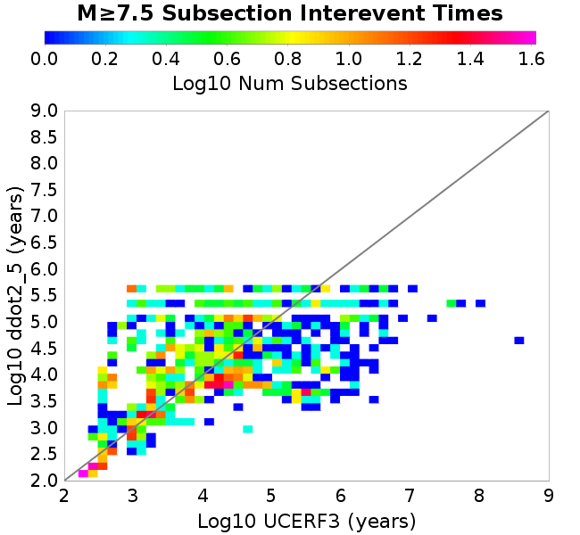 |

### Paleo Open Interval Plots
*[(top)](#ddot2_5)*

#### Paleo Open Interval Plots, Biasi and Sharer 2019
*[(top)](#ddot2_5)*

These plots use the 5 paleoseismic sites identified in Biasi & Scharer (2019) on the Hayward, N. SAF, S. SAF, and SJC faults. By default, a rupture is counted at a paleo site if the nearest element (at the surface) slips any amount. We also alternatively apply a probability of detection model. Those results are marked as 'Prob. Filtered'.

**Paleoseismic sites table:**

| **Site Name** | Data MRI (yr) | Data Annual Rate | Catalog MRI (yr) | Catalog Annual Rate | Catalog Occurences | Prob Filtered Catalog MRI (yr) | Prob Filtered Catalog Annual Rate | Prob Filtered Catalog Occurences |
|-----|-----|-----|-----|-----|-----|-----|-----|-----|
| **HOG** | 191.00 | 0.005235602 | 370.87 | 0.0026963286 | 1110 | 375.13 | 0.0026657167 | 1097.4 |
| **FRA** | 119.00 | 0.008403362 | 122.56 | 0.008159556 | 3358 | 127.69 | 0.007831767 | 3223.12 |
| **COA** | 181.00 | 0.005524862 | 185.46 | 0.005392044 | 2218 | 197.51 | 0.005062997 | 2082.66 |
| **SCZ** | 106.00 | 0.009433962 | 123.99 | 0.008065169 | 3318 | 142.37 | 0.0070238956 | 2889.42 |
| **TYS** | 329.00 | 0.0030395137 | 356.27 | 0.0028068728 | 1154 | 391.56 | 0.0025539193 | 1050 |
| **TOTAL** | 31.61 | 0.0316373 | 36.88 | 0.02711831 | 11158 | 39.79 | 0.02513221 | 10340.88 |

**Paleoseismic Plots:**

| 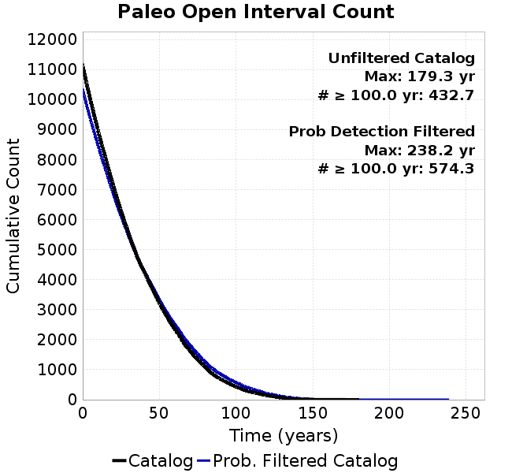 |  |
|-----|-----|

**Open interval probabilities table:**

| **Open Interval (yr)** | Catalog Probability | Catalog Poisson Probability | Prob. Filtered Catalog Probability | Prob. Filtered Catalog Poisson Probability | Data Poisson Probability |
|-----|-----|-----|-----|-----|-----|
| **10.00** | 0.9744803 | 0.76247686 | 0.977925 | 0.77777183 | 0.72878754 |
| **20.00** | 0.9075326 | 0.58137095 | 0.9194941 | 0.604929 | 0.53113127 |
| **30.00** | 0.8116563 | 0.44328192 | 0.8345835 | 0.4704967 | 0.3870819 |
| **40.00** | 0.7049552 | 0.33799222 | 0.73773 | 0.36593908 | 0.28210047 |
| **50.00** | 0.59008133 | 0.25771123 | 0.6315979 | 0.2846171 | 0.2055913 |
| **60.00** | 0.47609162 | 0.19649886 | 0.52271897 | 0.22136715 | 0.14983238 |
| **70.00** | 0.36114463 | 0.14982584 | 0.4129482 | 0.17217313 | 0.10919597 |
| **80.00** | 0.2620573 | 0.11423873 | 0.31251132 | 0.1339114 | 0.079580665 |
| **90.00** | 0.1800514 | 0.087104395 | 0.22782597 | 0.104152516 | 0.057997398 |
| **100.00** | 0.12199613 | 0.06641509 | 0.16470808 | 0.081006885 | 0.04226778 |
| **110.00** | 0.07738196 | 0.050639965 | 0.111580566 | 0.06300487 | 0.030804234 |
| **120.00** | 0.045835376 | 0.038611803 | 0.06903504 | 0.049003415 | 0.022449743 |
| **130.00** | 0.02135351 | 0.029440606 | 0.03752345 | 0.038113475 | 0.016361093 |
| **140.00** | 0.007857791 | 0.022447782 | 0.01687298 | 0.029643584 | 0.011923761 |
| **150.00** | 0.0025957501 | 0.017115913 | 0.006633457 | 0.023055945 | 0.008689889 |
| **160.00** | 0.0010362937 | 0.013050488 | 0.0028848802 | 0.017932264 | 0.0063330824 |
| **170.00** | 6.7642477E-4 | 0.009950696 | 0.0014706724 | 0.013947209 | 0.0046154717 |
| **180.00** | 0.0 | 0.0075871754 | 5.472641E-4 | 0.010847745 | 0.0033636983 |
| **190.00** | 0.0 | 0.0057850457 | 3.2673535E-4 | 0.008437071 | 0.0024514215 |
| **200.00** | 0.0 | 0.0044109635 | 1.8869033E-4 | 0.0065621156 | 0.0017865654 |
| **210.00** | 0.0 | 0.0033632577 | 7.525372E-5 | 0.005103829 | 0.0013020267 |
| **220.00** | 0.0 | 0.0025644063 | 4.1695806E-5 | 0.003969614 | 9.489008E-4 |
| **230.00** | 0.0 | 0.0019553003 | 2.36234E-5 | 0.0030874538 | 6.915471E-4 |
| **240.00** | 0.0 | 0.0014908713 | 0.0 | 0.0024013345 | 5.039909E-4 |

#### Paleo Open Interval Plots, UCERF3
*[(top)](#ddot2_5)*

These plots use the full set of UCERF3 paleoseismic sites. By default, a rupture is counted at a paleo site if the nearest element (at the surface) slips any amount. We also alternativeslyapply a probability of detection model. Those results are marked as 'Prob. Filtered'.

**Paleoseismic sites table:**

| **Site Name** | Data MRI (yr) | Data Annual Rate | Catalog MRI (yr) | Catalog Annual Rate | Catalog Occurences | Prob Filtered Catalog MRI (yr) | Prob Filtered Catalog Annual Rate | Prob Filtered Catalog Occurences |
|-----|-----|-----|-----|-----|-----|-----|-----|-----|
| **SSanAndreasBurroFlats** | 205.44 | 0.0048677 | 215.92 | 0.0046314425 | 1905 | 243.29 | 0.0041103796 | 1690.64 |
| **SSanAndreasIndio** | 277.37 | 0.0036053 | 179.86 | 0.005559861 | 2287 | 190.80 | 0.0052411184 | 2155.92 |
| **SSAFMCreek1000Palms** | 261.33 | 0.0038266 | 1644.75 | 6.079937E-4 | 250 | 2342.22 | 4.2694624E-4 | 175.33 |
| **NSanAndreasFortRoss** | 306.28 | 0.003265 | 196.25 | 0.0050956705 | 2097 | 198.58 | 0.0050358004 | 2072.35 |
| **NSanAndreasNorthCoast** | 263.87 | 0.0037898 | 186.59 | 0.005359439 | 2205 | 190.95 | 0.005236875 | 2154.55 |
| **CalaverasfaultNorth** | 618.05 | 0.001618 | 170.43 | 0.0058675334 | 2414 | 241.27 | 0.0041448125 | 1705.01 |
| **ElsinoreTemecula** | 1019.16 | 9.812E-4 | 701.75 | 0.0014250056 | 586 | 728.27 | 0.0013731191 | 564.62 |
| **ElsinoreWhittier** | 3196.93 | 3.128E-4 | 1577.03 | 6.341032E-4 | 261 | 1654.32 | 6.044789E-4 | 248.8 |
| **SSAFCarrizoBidart** | 114.71 | 0.0087179 | 125.89 | 0.007943223 | 3268 | 129.31 | 0.007733088 | 3181.55 |
| **SanJacintoHogLake** | 311.78 | 0.0032074 | 370.87 | 0.0026963286 | 1110 | 375.06 | 0.0026662236 | 1097.59 |
| **PuenteHills** | 3506.31 | 2.852E-4 | 4952.38 | 2.0192332E-4 | 83 | 5445.59 | 1.8363488E-4 | 75.49 |
| **SanGregorioNorth** | 1019.06 | 9.813E-4 | 404.77 | 0.0024705648 | 1016 | 418.80 | 0.0023877826 | 981.99 |
| **SanJacintoSuperstition** | 508.26 | 0.0019675 | 1253.33 | 7.978723E-4 | 328 | 1333.68 | 7.4980664E-4 | 308.23 |
| **SSanAndreasWrightwood** | 106.04 | 0.0094304 | 157.09 | 0.0063657663 | 2620 | 158.87 | 0.006294384 | 2590.59 |
| **SSanAndreasPitmanCanyon** | 173.48 | 0.0057643 | 147.57 | 0.0067765396 | 2789 | 163.34 | 0.0061222776 | 2519.73 |
| **SSanAndreasPlungeCreek** | 205.36 | 0.0048695 | 365.35 | 0.0027370886 | 1125 | 448.54 | 0.0022294738 | 916.17 |
| **FrazierMountianSSAF** | 148.57 | 0.0067307 | 122.56 | 0.008159556 | 3358 | 127.71 | 0.007830358 | 3222.55 |
| **NSanAndreasSantaCruzSeg** | 109.84 | 0.0091041 | 123.99 | 0.008065169 | 3318 | 142.65 | 0.007010357 | 2883.81 |
| **RodgersCreek** | 325.31 | 0.003074 | 173.68 | 0.005757835 | 2369 | 234.60 | 0.00426256 | 1753.76 |
| **GreenValleyMasonRoad** | 293.31 | 0.0034094 | 1787.13 | 5.595563E-4 | 230 | 2377.28 | 4.2064945E-4 | 172.75 |
| **HaywardfaultNorth** | 318.34 | 0.0031413 | 381.47 | 0.0026214262 | 1079 | 391.67 | 0.0025531703 | 1050.88 |
| **HaywardfaultSouth** | 167.57 | 0.0059677 | 356.27 | 0.0028068728 | 1154 | 391.29 | 0.0025556525 | 1050.6 |
| **Compton** | 2658.16 | 3.762E-4 | 6247.61 | 1.6006116E-4 | 66 | 6838.75 | 1.4622555E-4 | 60.28 |
| **SSanAndreasCoachella** | 178.45 | 0.0056037 | 185.46 | 0.005392044 | 2218 | 197.43 | 0.005065175 | 2083.58 |
| **ElsinoreGlenIvy** | 179.12 | 0.0055828 | 588.93 | 0.0016979876 | 698 | 636.30 | 0.0015715881 | 646.06 |
| **GarlockCentralallevents** | 1434.93 | 6.969E-4 | 660.43 | 0.0015141743 | 623 | 671.77 | 0.0014886156 | 612.47 |
| **NSanAndreasAlderCreek** | 869.64 | 0.0011499 | 196.34 | 0.0050932392 | 2096 | 198.93 | 0.0050269268 | 2068.7 |
| **SSanAndreasPallettCreek** | 149.30 | 0.006698 | 156.55 | 0.0063876417 | 2629 | 158.42 | 0.0063123317 | 2598 |
| **GarlockWesternallevents** | 1230.16 | 8.129E-4 | 841.38 | 0.001188527 | 489 | 864.63 | 0.0011565621 | 475.82 |
| **ElsinoreFaultJulian** | 3250.98 | 3.076E-4 | 1274.41 | 7.8467757E-4 | 322 | 1301.73 | 7.6820666E-4 | 315.24 |
| **TOTAL** | 9.08 | 0.1101451 | 14.88 | 0.06720635 | 27651 | 16.46 | 0.060737506 | 24989.59 |

**Paleoseismic Plots:**

|  |  |
|-----|-----|

**Open interval probabilities table:**

| **Open Interval (yr)** | Catalog Probability | Catalog Poisson Probability | Prob. Filtered Catalog Probability | Prob. Filtered Catalog Poisson Probability | Data Poisson Probability |
|-----|-----|-----|-----|-----|-----|
| **10.00** | 0.8634792 | 0.51065373 | 0.88373035 | 0.544779 | 0.33238843 |
| **20.00** | 0.6166304 | 0.26076725 | 0.66291726 | 0.29678416 | 0.110482074 |
| **30.00** | 0.39264545 | 0.13316177 | 0.44818848 | 0.16168179 | 0.036722966 |
| **40.00** | 0.2241975 | 0.06799955 | 0.2758873 | 0.088080846 | 0.012206289 |
| **50.00** | 0.11802377 | 0.034724224 | 0.1577398 | 0.047984596 | 0.004057229 |
| **60.00** | 0.060060818 | 0.017732056 | 0.0871017 | 0.026140999 | 0.001348576 |
| **70.00** | 0.026501445 | 0.00905494 | 0.042891573 | 0.014241068 | 4.4825108E-4 |
| **80.00** | 0.011052874 | 0.0046239393 | 0.019940395 | 0.007758235 | 1.4899348E-4 |
| **90.00** | 0.0047416072 | 0.0023612317 | 0.009772949 | 0.0042265235 | 4.952371E-5 |
| **100.00** | 9.164104E-4 | 0.0012057718 | 0.0033320382 | 0.0023025214 | 1.6461108E-5 |
| **110.00** | 0.0 | 6.157319E-4 | 0.0010900871 | 0.0012543653 | 5.4714824E-6 |
| **120.00** | 0.0 | 3.144258E-4 | 2.3633229E-4 | 6.833519E-4 | 1.8186574E-6 |
| **130.00** | 0.0 | 1.605627E-4 | 3.059048E-5 | 3.7227577E-4 | 6.045007E-7 |
| **140.00** | 0.0 | 8.1991944E-5 | 6.0299662E-6 | 2.0280802E-4 | 2.0092905E-7 |
| **150.00** | 0.0 | 4.1869494E-5 | 0.0 | 1.10485555E-4 | 6.678649E-8 |

### Moment Release Variability Plots
*[(top)](#ddot2_5)*

We first create a tapered moment release time series for the entire catalog. Each event's moment is distributed across a 25 year Hanning (cosine) taper. Here is a plot of a random 2,000 year section of this time series:


We then compute Welch's power spectral density estimate on the entire time series. Results are plotted below, with a Poisson randomization of the catalog also plotted in a gray line, and the 95% confidence bounds from 200 realizations as a light gray shaded area. Significant deviations outside the Poisson confidence intervals indicate synchronous behaviour.

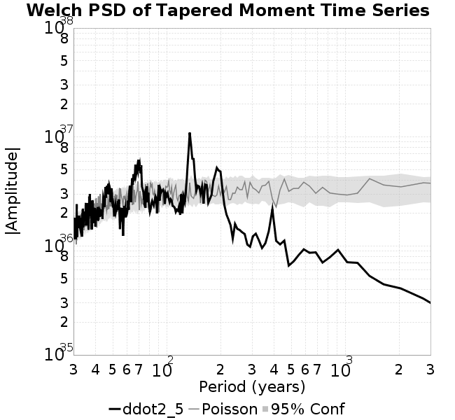

## Input File
*[(top)](#ddot2_5)*

```
  A_1 = 0.001
  fA = .1
  B_1 = 0.008
  muSlipAmp_1 = .0
  muSlipInvDist_1 = 1.0
  cohesion = 0.0
  Dc_1 = 1.0000000000000000818e-05
  mu0_1 = 0.6
  ddotStar_1 = 9.9999999999999995475e-07
  ddotAB_1 = 9.9999999999999995475e-07
  alpha_1 = 0.0
  theta0_1 = 200000000
  tau0_1 = 55.1
  sigma0_1 = 100
  sigmaFracPin = .5
  lowSigmaAction = 1
  maxThetaPin = 1.0e13
  ddotEQ_1 = 2.5
  ddotEQFname = 
  stressOvershootFactor = 0.10000000000000000555
  lameLambda = 30000
  lameMu = 30000
  slowSlip_1 = 0
  nEq = 100000000000
  KZeroFrac = 0
  muPin = 1.0
  tStart = 0
  maxT = 3.16e13
  maxWallTime = 169200
  maxTrans = 1.0000000000000000159e100
  faultFname = UCERF3FM.15km.1km.tri.flt
  outFnameInfix = ddot2_5
  writeTau = 2
  writeSigma = 2
  writeSlip = 0
  writeSlipSpeed = 0
  writeState = 0
  writeTheta = 2
  writePED = 1
  writeTransitions = 1
  minDtWrite = 0
  minDtWriteCoseismic = 0
  minDtWriteInterseismic = 0
  minMagWrite = 7.7
  writeStiffness = 0
  stressRateSpecification = 1
  dMu3 = 0.01000000000000000
  initTauFname = 
  initSigmaFname = 
  initThetaFname = 
  initSlipSpeedFname = 
  AFname = 
  BFname =  
  DcFname = 
  mu0Fname = 
  ddotStarFname = 
  ddotABFname = 
  alphaFname = 
  KTauFname = /u/sciteam/gilchris/scratch/stiffness_25a589d/Ktau.25a589d.out
  KSigmaFname = /u/sciteam/gilchris/scratch/stiffness_25a589d/Ksigma.25a589d.out
  tFailFname = 
  tauFailFname = 
  tauDotFname = 
  sigmaDotFname =
  KZeroFname = UCERF3FM.15km.1km.tri.KZero
  pinnedFname =  UCERF3FM.15km.1km.tri.pin
  neighborFname = UCERF3FM.15km.1km.tri.neighbors
  stressRateFname =  
  slowSlipFname = 
  writePatchFname = 
  DEBUG = 0
  ZBrentUpperBracket = 0
  receiverElementAreaFrac = 0.8
  receiverElementIntTol = 1.0e-4
  receiverElementSubdivisionMax = 4
  tgfDist1 = 3
  tgfDist1 = 10
  lowSigmaAction = 1
  highSigmaAction = 0
```
