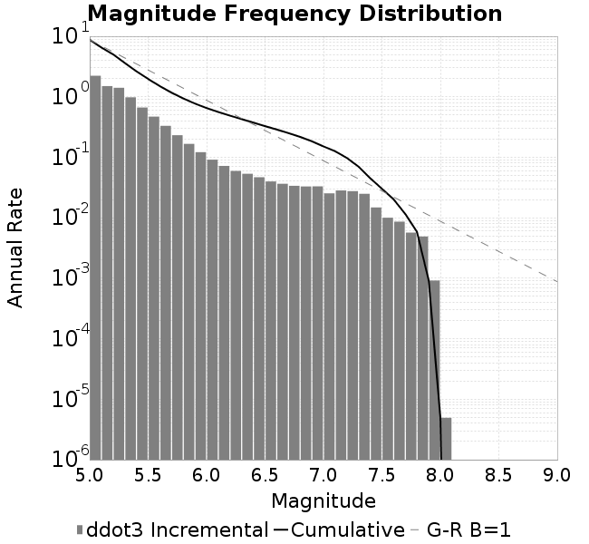
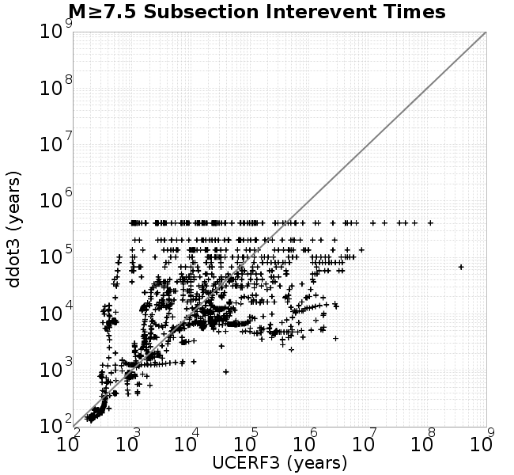

# ddot3
## Metadata
| **Catalog** | ddot3 |
|-----|-----|
| **Author** | Jaqcui Gilchrist, 2018/09/27 |
| **Description** | change ddotEQ: ddotEQ=3 |
| **Fault/Def Model** | Fault Model 3.1, Geologic |
| **Slip Velocity** | 3.0 m/s |
| **Average Element Area** | 1.35 km^2 |
| **Length** | 7,825,410 events in 410,843 years |
| **Frictional Params** | a=0.001, b=0.008, (b-a)=0.007, ddotEQ=3 |

* [Metadata](#metadata)
* [Plots](#plots)
  * [Magnitude-Frequency Plot](#magnitude-frequency-plot)
  * [Magnitude-Area Plots](#magnitude-area-plots)
  * [Slip-Area Plots](#slip-area-plots)
  * [Rupture Velocity Plots](#rupture-velocity-plots)
  * [Global Interevent-Time Distributions](#global-interevent-time-distributions)
  * [Normalized Fault Interevent-Time Distributions](#normalized-fault-interevent-time-distributions)
  * [Stationarity Plot](#stationarity-plot)
  * [Element/Subsection Interevent Time Comparisons](#elementsubsection-interevent-time-comparisons)
    * [Element Interevent Time Comparisons](#element-interevent-time-comparisons)
    * [Subsection Interevent Time Comparisons](#subsection-interevent-time-comparisons)
  * [Paleo Open Interval Plots](#paleo-open-interval-plots)
    * [Paleo Open Interval Plots, Biasi and Sharer 2019](#paleo-open-interval-plots-biasi-and-sharer-2019)
    * [Paleo Open Interval Plots, UCERF3](#paleo-open-interval-plots-ucerf3)
  * [Moment Release Variability Plots](#moment-release-variability-plots)
* [Input File](#input-file)

## Plots
### Magnitude-Frequency Plot
*[(top)](#ddot3)*


### Magnitude-Area Plots
*[(top)](#ddot3)*

| Scatter | 2-D Hist |
|-----|-----|
|  |  |
### Slip-Area Plots
*[(top)](#ddot3)*

| Scatter | 2-D Hist |
|-----|-----|
|  |  |
### Rupture Velocity Plots
*[(top)](#ddot3)*

| **Scatter** |  |
|-----|-----|
| **Distance/Velocity** |  |
### Global Interevent-Time Distributions
*[(top)](#ddot3)*

| **M≥6** | **M≥6.5** | **M≥7** | **M≥7.5** |
|-----|-----|-----|-----|
|  |  |  |  |
### Normalized Fault Interevent-Time Distributions
*[(top)](#ddot3)*

|  | **M≥6** | **M≥6.5** | **M≥7** | **M≥7.5** |
|-----|-----|-----|-----|-----|
| **Elements** |  |  |  |  |
| **Subsections** |  |  |  |  |
| **Sections** |  |  |  |  |
### Stationarity Plot
*[(top)](#ddot3)*


### Element/Subsection Interevent Time Comparisons

#### Element Interevent Time Comparisons
*[(top)](#ddot3)*

| Min Mag | Scatter | 2-D Hist |
|-----|-----|-----|
| **M≥6.0** |  |  |
| **M≥6.5** |  |  |
| **M≥7.0** |  |  |
| **M≥7.5** |  |  |

#### Subsection Interevent Time Comparisons
*[(top)](#ddot3)*

*Subsections participate in a rupture if at least 20.0 % of its area ruptures*

| Min Mag | Scatter | 2-D Hist |
|-----|-----|-----|
| **M≥6.0** |  |  |
| **M≥6.5** |  |  |
| **M≥7.0** |  |  |
| **M≥7.5** |  |  |

### Paleo Open Interval Plots
*[(top)](#ddot3)*

#### Paleo Open Interval Plots, Biasi and Sharer 2019
*[(top)](#ddot3)*

These plots use the 5 paleoseismic sites identified in Biasi & Scharer (2019) on the Hayward, N. SAF, S. SAF, and SJC faults. By default, a rupture is counted at a paleo site if the nearest element (at the surface) slips any amount. We also alternatively apply a probability of detection model. Those results are marked as 'Prob. Filtered'.

**Paleoseismic sites table:**

| **Site Name** | Data MRI (yr) | Data Annual Rate | Catalog MRI (yr) | Catalog Annual Rate | Catalog Occurences | Prob Filtered Catalog MRI (yr) | Prob Filtered Catalog Annual Rate | Prob Filtered Catalog Occurences |
|-----|-----|-----|-----|-----|-----|-----|-----|-----|
| **HOG** | 191.00 | 0.005235602 | 373.71 | 0.002675863 | 1086 | 377.87 | 0.0026464171 | 1074.04 |
| **FRA** | 119.00 | 0.008403362 | 123.83 | 0.008075327 | 3278 | 128.81 | 0.0077631166 | 3151.27 |
| **COA** | 181.00 | 0.005524862 | 183.50 | 0.0054496387 | 2211 | 196.27 | 0.005095079 | 2067.17 |
| **SCZ** | 106.00 | 0.009433962 | 123.80 | 0.008077739 | 3279 | 142.51 | 0.007017174 | 2848.49 |
| **TYS** | 329.00 | 0.0030395137 | 352.51 | 0.0028368202 | 1151 | 388.20 | 0.0025760108 | 1045.13 |
| **TOTAL** | 31.61 | 0.0316373 | 36.88 | 0.027116084 | 11005 | 39.84 | 0.025103066 | 10188.08 |

**Paleoseismic Plots:**

|  |  |
|-----|-----|

**Open interval probabilities table:**

| **Open Interval (yr)** | Catalog Probability | Catalog Poisson Probability | Prob. Filtered Catalog Probability | Prob. Filtered Catalog Poisson Probability | Data Poisson Probability |
|-----|-----|-----|-----|-----|-----|
| **10.00** | 0.9749232 | 0.76249385 | 0.9784208 | 0.7779985 | 0.72878754 |
| **20.00** | 0.90797573 | 0.5813969 | 0.9195534 | 0.6052817 | 0.53113127 |
| **30.00** | 0.808664 | 0.44331154 | 0.83182055 | 0.47090825 | 0.3870819 |
| **40.00** | 0.6974708 | 0.33802232 | 0.7309256 | 0.36636594 | 0.28210047 |
| **50.00** | 0.58432746 | 0.25773993 | 0.62566376 | 0.28503215 | 0.2055913 |
| **60.00** | 0.47229508 | 0.19652511 | 0.5197232 | 0.2217546 | 0.14983238 |
| **70.00** | 0.35777062 | 0.14984919 | 0.40939862 | 0.17252475 | 0.10919597 |
| **80.00** | 0.26345497 | 0.11425909 | 0.3143102 | 0.134224 | 0.079580665 |
| **90.00** | 0.18981135 | 0.08712185 | 0.23741342 | 0.10442607 | 0.057997398 |
| **100.00** | 0.12642018 | 0.066429876 | 0.16751716 | 0.08124333 | 0.04226778 |
| **110.00** | 0.08235712 | 0.05065237 | 0.11653446 | 0.06320719 | 0.030804234 |
| **120.00** | 0.04630898 | 0.03862212 | 0.07324483 | 0.0491751 | 0.022449743 |
| **130.00** | 0.021980088 | 0.02944913 | 0.041836392 | 0.038258154 | 0.016361093 |
| **140.00** | 0.007016901 | 0.02245478 | 0.01664257 | 0.029764788 | 0.011923761 |
| **150.00** | 0.0012707914 | 0.017121632 | 0.0051316866 | 0.023156961 | 0.008689889 |
| **160.00** | 0.0 | 0.013055138 | 0.0017852915 | 0.018016081 | 0.0063330824 |
| **170.00** | 0.0 | 0.009954463 | 7.476972E-4 | 0.014016484 | 0.0046154717 |
| **180.00** | 0.0 | 0.0075902166 | 4.6850956E-4 | 0.010904804 | 0.0033636983 |
| **190.00** | 0.0 | 0.0057874937 | 2.7931973E-4 | 0.008483921 | 0.0024514215 |
| **200.00** | 0.0 | 0.004412928 | 1.5943109E-4 | 0.006600478 | 0.0017865654 |
| **210.00** | 0.0 | 0.0033648305 | 6.252568E-5 | 0.0051351623 | 0.0013020267 |
| **220.00** | 0.0 | 0.0025656626 | 3.43826E-5 | 0.003995149 | 9.489008E-4 |
| **230.00** | 0.0 | 0.001956302 | 1.2199046E-5 | 0.0031082197 | 6.915471E-4 |
| **240.00** | 0.0 | 0.0014916682 | 1.0700385E-5 | 0.0024181905 | 5.039909E-4 |
| **250.00** | 0.0 | 0.0011373878 | 9.201725E-6 | 0.0018813486 | 3.673023E-4 |
| **260.00** | 0.0 | 8.672512E-4 | 7.7030645E-6 | 0.0014636863 | 2.6768536E-4 |
| **270.00** | 0.0 | 6.612737E-4 | 0.0 | 0.0011387458 | 1.9508575E-4 |

#### Paleo Open Interval Plots, UCERF3
*[(top)](#ddot3)*

These plots use the full set of UCERF3 paleoseismic sites. By default, a rupture is counted at a paleo site if the nearest element (at the surface) slips any amount. We also alternativeslyapply a probability of detection model. Those results are marked as 'Prob. Filtered'.

**Paleoseismic sites table:**

| **Site Name** | Data MRI (yr) | Data Annual Rate | Catalog MRI (yr) | Catalog Annual Rate | Catalog Occurences | Prob Filtered Catalog MRI (yr) | Prob Filtered Catalog Annual Rate | Prob Filtered Catalog Occurences |
|-----|-----|-----|-----|-----|-----|-----|-----|-----|
| **SSanAndreasBurroFlats** | 205.44 | 0.0048677 | 216.12 | 0.004627039 | 1878 | 243.80 | 0.004101707 | 1664.68 |
| **SSanAndreasIndio** | 277.37 | 0.0036053 | 180.08 | 0.0055532064 | 2253 | 190.93 | 0.0052374564 | 2124.94 |
| **SSAFMCreek1000Palms** | 261.33 | 0.0038266 | 1588.51 | 6.295188E-4 | 256 | 2308.29 | 4.332202E-4 | 175.96 |
| **NSanAndreasFortRoss** | 306.28 | 0.003265 | 196.45 | 0.005090328 | 2066 | 198.92 | 0.005027072 | 2040.33 |
| **NSanAndreasNorthCoast** | 263.87 | 0.0037898 | 186.60 | 0.005359018 | 2175 | 191.22 | 0.005229534 | 2122.45 |
| **CalaverasfaultNorth** | 618.05 | 0.001618 | 170.47 | 0.005866206 | 2380 | 242.24 | 0.004128157 | 1674.83 |
| **ElsinoreTemecula** | 1019.16 | 9.812E-4 | 704.89 | 0.0014186655 | 575 | 730.93 | 0.0013681224 | 554.55 |
| **ElsinoreWhittier** | 3196.93 | 3.128E-4 | 1574.60 | 6.3508097E-4 | 258 | 1653.80 | 6.046665E-4 | 245.61 |
| **SSAFCarrizoBidart** | 114.71 | 0.0087179 | 126.18 | 0.007925011 | 3217 | 129.48 | 0.007723286 | 3135.12 |
| **SanJacintoHogLake** | 311.78 | 0.0032074 | 373.71 | 0.002675863 | 1086 | 378.09 | 0.0026448641 | 1073.42 |
| **PuenteHills** | 3506.31 | 2.852E-4 | 4920.94 | 2.0321306E-4 | 83 | 5381.15 | 1.8583404E-4 | 75.75 |
| **SanGregorioNorth** | 1019.06 | 9.813E-4 | 409.73 | 0.0024406447 | 990 | 423.78 | 0.0023597055 | 957.19 |
| **SanJacintoSuperstition** | 508.26 | 0.0019675 | 1267.18 | 7.891549E-4 | 320 | 1349.26 | 7.4114645E-4 | 300.33 |
| **SSanAndreasWrightwood** | 106.04 | 0.0094304 | 156.98 | 0.0063700704 | 2586 | 158.91 | 0.006292884 | 2554.66 |
| **SSanAndreasPitmanCanyon** | 173.48 | 0.0057643 | 146.93 | 0.006805967 | 2762 | 162.89 | 0.0061392696 | 2491.47 |
| **SSanAndreasPlungeCreek** | 205.36 | 0.0048695 | 371.91 | 0.0026888018 | 1092 | 454.71 | 0.002199215 | 892.75 |
| **FrazierMountianSSAF** | 148.57 | 0.0067307 | 123.83 | 0.008075327 | 3278 | 128.86 | 0.007760277 | 3150.13 |
| **NSanAndreasSantaCruzSeg** | 109.84 | 0.0091041 | 123.80 | 0.008077739 | 3279 | 142.41 | 0.007021817 | 2850.37 |
| **RodgersCreek** | 325.31 | 0.003074 | 175.98 | 0.005682404 | 2305 | 236.90 | 0.004221216 | 1712.31 |
| **GreenValleyMasonRoad** | 293.31 | 0.0034094 | 1763.05 | 5.672005E-4 | 230 | 2369.50 | 4.2203048E-4 | 170.86 |
| **HaywardfaultNorth** | 318.34 | 0.0031413 | 379.77 | 0.0026331441 | 1068 | 390.20 | 0.0025628174 | 1039.45 |
| **HaywardfaultSouth** | 167.57 | 0.0059677 | 352.51 | 0.0028368202 | 1151 | 387.70 | 0.0025792976 | 1046.47 |
| **Compton** | 2658.16 | 3.762E-4 | 6151.98 | 1.6254933E-4 | 65 | 6844.13 | 1.4611067E-4 | 58.49 |
| **SSanAndreasCoachella** | 178.45 | 0.0056037 | 183.50 | 0.0054496387 | 2211 | 196.30 | 0.0050942865 | 2066.83 |
| **ElsinoreGlenIvy** | 179.12 | 0.0055828 | 574.31 | 0.0017412105 | 706 | 623.15 | 0.001604745 | 650.29 |
| **GarlockCentralallevents** | 1434.93 | 6.969E-4 | 663.56 | 0.0015070257 | 611 | 673.55 | 0.0014846608 | 601.91 |
| **NSanAndreasAlderCreek** | 869.64 | 0.0011499 | 196.45 | 0.005090328 | 2066 | 199.28 | 0.0050181067 | 2036.64 |
| **SSanAndreasPallettCreek** | 149.30 | 0.006698 | 157.17 | 0.0063626776 | 2583 | 158.89 | 0.006293775 | 2555.03 |
| **GarlockWesternallevents** | 1230.16 | 8.129E-4 | 842.64 | 0.0011867459 | 482 | 865.80 | 0.0011549955 | 469.1 |
| **ElsinoreFaultJulian** | 3250.98 | 3.076E-4 | 1294.67 | 7.723978E-4 | 314 | 1318.35 | 7.585229E-4 | 308.35 |
| **TOTAL** | 9.08 | 0.1101451 | 14.85 | 0.06734175 | 27330 | 16.43 | 0.06085579 | 24697.53 |

**Paleoseismic Plots:**

|  |  |
|-----|-----|

**Open interval probabilities table:**

| **Open Interval (yr)** | Catalog Probability | Catalog Poisson Probability | Prob. Filtered Catalog Probability | Prob. Filtered Catalog Poisson Probability | Data Poisson Probability |
|-----|-----|-----|-----|-----|-----|
| **10.00** | 0.8623787 | 0.5099628 | 0.88298017 | 0.544135 | 0.33238843 |
| **20.00** | 0.6190422 | 0.26006204 | 0.66449237 | 0.2960829 | 0.110482074 |
| **30.00** | 0.3882465 | 0.13262196 | 0.44377482 | 0.16110907 | 0.036722966 |
| **40.00** | 0.21946439 | 0.067632265 | 0.2724009 | 0.08766508 | 0.012206289 |
| **50.00** | 0.119322546 | 0.034489937 | 0.15863492 | 0.047701642 | 0.004057229 |
| **60.00** | 0.0549405 | 0.017588586 | 0.08163241 | 0.025956133 | 0.001348576 |
| **70.00** | 0.023786847 | 0.008969524 | 0.039829087 | 0.01412364 | 4.4825108E-4 |
| **80.00** | 0.008753981 | 0.0045741233 | 0.016976764 | 0.007685167 | 1.4899348E-4 |
| **90.00** | 0.0033497133 | 0.0023326327 | 0.007450061 | 0.0041817683 | 4.952371E-5 |
| **100.00** | 0.0012842783 | 0.0011895559 | 0.0030016124 | 0.0022754464 | 1.6461108E-5 |
| **110.00** | 0.0 | 6.0662924E-4 | 6.659746E-4 | 0.00123815 | 5.4714824E-6 |
| **120.00** | 0.0 | 3.0935832E-4 | 2.2148911E-4 | 6.737208E-4 | 1.8186574E-6 |
| **130.00** | 0.0 | 1.5776123E-4 | 3.95147E-5 | 3.6659508E-4 | 6.045007E-7 |
| **140.00** | 0.0 | 8.045236E-5 | 0.0 | 1.9947722E-4 | 2.0092905E-7 |

### Moment Release Variability Plots
*[(top)](#ddot3)*

We first create a tapered moment release time series for the entire catalog. Each event's moment is distributed across a 25 year Hanning (cosine) taper. Here is a plot of a random 2,000 year section of this time series:


We then compute Welch's power spectral density estimate on the entire time series. Results are plotted below, with a Poisson randomization of the catalog also plotted in gray as a control. Significant deviations above the Poisson model indicate synchronization at that period.


## Input File
*[(top)](#ddot3)*

```
  A_1 = 0.001
  fA = .1
  B_1 = 0.008
  muSlipAmp_1 = .0
  muSlipInvDist_1 = 1.0
  cohesion = 0.0
  Dc_1 = 1.0000000000000000818e-05
  mu0_1 = 0.6
  ddotStar_1 = 9.9999999999999995475e-07
  ddotAB_1 = 9.9999999999999995475e-07
  alpha_1 = 0.0
  theta0_1 = 200000000
  tau0_1 = 55.1
  sigma0_1 = 100
  sigmaFracPin = .5
  lowSigmaAction = 1
  maxThetaPin = 1.0e13
  ddotEQ_1 = 3
  ddotEQFname = 
  stressOvershootFactor = 0.10000000000000000555
  lameLambda = 30000
  lameMu = 30000
  slowSlip_1 = 0
  nEq = 100000000000
  KZeroFrac = 0
  muPin = 1.0
  tStart = 0
  maxT = 3.16e13
  maxWallTime = 169200
  maxTrans = 1.0000000000000000159e100
  faultFname = UCERF3FM.15km.1km.tri.flt
  outFnameInfix = ddot3
  writeTau = 2
  writeSigma = 2
  writeSlip = 0
  writeSlipSpeed = 0
  writeState = 0
  writeTheta = 2
  writePED = 1
  writeTransitions = 1
  minDtWrite = 0
  minDtWriteCoseismic = 0
  minDtWriteInterseismic = 0
  minMagWrite = 7.7
  writeStiffness = 0
  stressRateSpecification = 1
  dMu3 = 0.01000000000000000
  initTauFname = 
  initSigmaFname = 
  initThetaFname = 
  initSlipSpeedFname = 
  AFname = 
  BFname =  
  DcFname = 
  mu0Fname = 
  ddotStarFname = 
  ddotABFname = 
  alphaFname = 
  KTauFname = /u/sciteam/gilchris/scratch/stiffness_25a589d/Ktau.25a589d.out
  KSigmaFname = /u/sciteam/gilchris/scratch/stiffness_25a589d/Ksigma.25a589d.out
  tFailFname = 
  tauFailFname = 
  tauDotFname = 
  sigmaDotFname =
  KZeroFname = UCERF3FM.15km.1km.tri.KZero
  pinnedFname =  UCERF3FM.15km.1km.tri.pin
  neighborFname = UCERF3FM.15km.1km.tri.neighbors
  stressRateFname =  
  slowSlipFname = 
  writePatchFname = 
  DEBUG = 0
  ZBrentUpperBracket = 0
  receiverElementAreaFrac = 0.8
  receiverElementIntTol = 1.0e-4
  receiverElementSubdivisionMax = 4
  tgfDist1 = 3
  tgfDist1 = 10
  lowSigmaAction = 1
  highSigmaAction = 0
```
