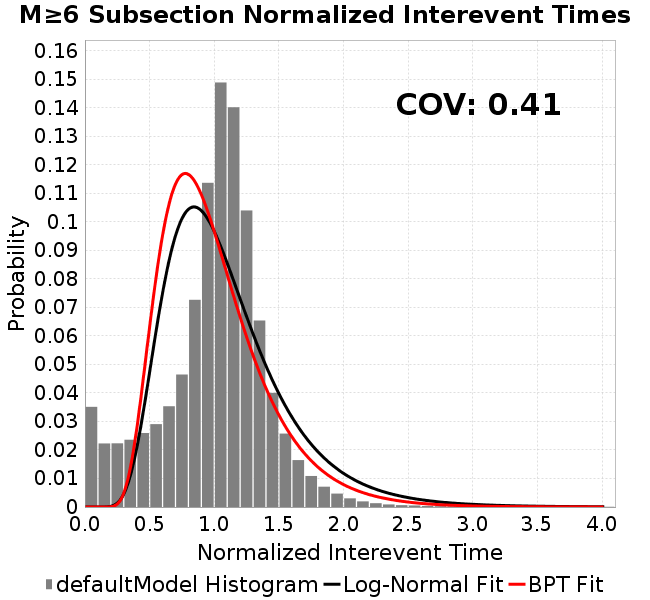
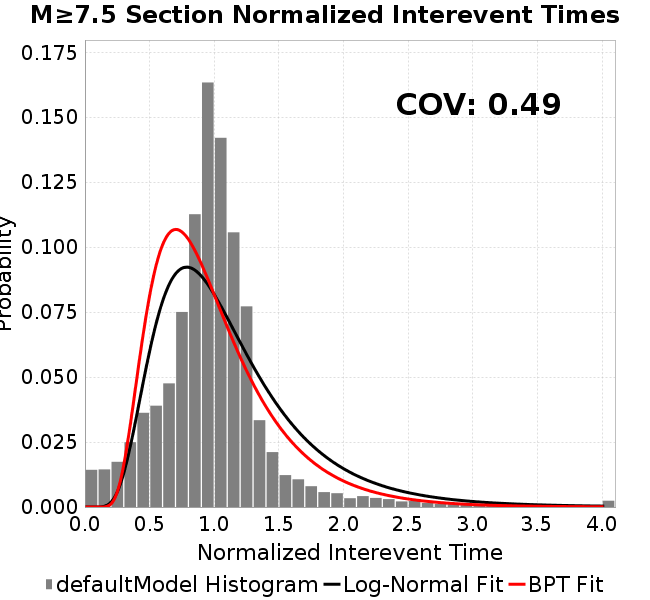

# defaultModel
## Metadata
| **Catalog** | defaultModel |
|-----|-----|
| **Author** | Jaqcui Gilchrist, 2018/09/27 |
| **Description** | default model setup |
| **Fault/Def Model** | Fault Model 3.1, Geologic |
| **Slip Velocity** | 1.0 m/s |
| **Average Element Area** | 1.35 km^2 |
| **Length** | 4,286,777 events in 217,822 years |
| **Frictional Params** | a=0.001, b=0.008, (b-a)=0.007, ddotEQ=1 |

* [Metadata](#metadata)
* [Plots](#plots)
  * [Magnitude-Frequency Plot](#magnitude-frequency-plot)
  * [Magnitude-Area Plots](#magnitude-area-plots)
  * [Slip-Area Plots](#slip-area-plots)
  * [Rupture Velocity Plots](#rupture-velocity-plots)
  * [Global Interevent-Time Distributions](#global-interevent-time-distributions)
  * [Normalized Fault Interevent-Time Distributions](#normalized-fault-interevent-time-distributions)
  * [Stationarity Plot](#stationarity-plot)
  * [Element/Subsection Interevent Time Comparisons](#elementsubsection-interevent-time-comparisons)
    * [Element Interevent Time Comparisons](#element-interevent-time-comparisons)
    * [Subsection Interevent Time Comparisons](#subsection-interevent-time-comparisons)
  * [Paleo Open Interval Plots](#paleo-open-interval-plots)
    * [Paleo Open Interval Plots, Biasi and Sharer 2019](#paleo-open-interval-plots-biasi-and-sharer-2019)
    * [Paleo Open Interval Plots, UCERF3](#paleo-open-interval-plots-ucerf3)
  * [Moment Release Variability Plots](#moment-release-variability-plots)
* [Input File](#input-file)

## Plots
### Magnitude-Frequency Plot
*[(top)](#defaultmodel)*


### Magnitude-Area Plots
*[(top)](#defaultmodel)*

| Scatter | 2-D Hist |
|-----|-----|
|  |  |
### Slip-Area Plots
*[(top)](#defaultmodel)*

| Scatter | 2-D Hist |
|-----|-----|
|  |  |
### Rupture Velocity Plots
*[(top)](#defaultmodel)*

| **Scatter** |  |
|-----|-----|
| **Distance/Velocity** |  |
### Global Interevent-Time Distributions
*[(top)](#defaultmodel)*

| **M≥6** | **M≥6.5** | **M≥7** | **M≥7.5** |
|-----|-----|-----|-----|
|  |  |  |  |
### Normalized Fault Interevent-Time Distributions
*[(top)](#defaultmodel)*

|  | **M≥6** | **M≥6.5** | **M≥7** | **M≥7.5** |
|-----|-----|-----|-----|-----|
| **Elements** |  |  |  |  |
| **Subsections** |  |  |  |  |
| **Sections** |  |  |  |  |
### Stationarity Plot
*[(top)](#defaultmodel)*


### Element/Subsection Interevent Time Comparisons

#### Element Interevent Time Comparisons
*[(top)](#defaultmodel)*

| Min Mag | Scatter | 2-D Hist |
|-----|-----|-----|
| **M≥6.0** |  |  |
| **M≥6.5** |  |  |
| **M≥7.0** |  |  |
| **M≥7.5** |  |  |

#### Subsection Interevent Time Comparisons
*[(top)](#defaultmodel)*

*Subsections participate in a rupture if at least 20.0 % of its area ruptures*

| Min Mag | Scatter | 2-D Hist |
|-----|-----|-----|
| **M≥6.0** |  |  |
| **M≥6.5** |  |  |
| **M≥7.0** |  |  |
| **M≥7.5** |  |  |

### Paleo Open Interval Plots
*[(top)](#defaultmodel)*

#### Paleo Open Interval Plots, Biasi and Sharer 2019
*[(top)](#defaultmodel)*

These plots use the 5 paleoseismic sites identified in Biasi & Scharer (2019) on the Hayward, N. SAF, S. SAF, and SJC faults. By default, a rupture is counted at a paleo site if the nearest element (at the surface) slips any amount. We also alternatively apply a probability of detection model. Those results are marked as 'Prob. Filtered'.

**Paleoseismic sites table:**

| **Site Name** | Data MRI (yr) | Data Annual Rate | Catalog MRI (yr) | Catalog Annual Rate | Catalog Occurences | Prob Filtered Catalog MRI (yr) | Prob Filtered Catalog Annual Rate | Prob Filtered Catalog Occurences |
|-----|-----|-----|-----|-----|-----|-----|-----|-----|
| **HOG** | 191.00 | 0.005235602 | 362.15 | 0.0027612569 | 587 | 366.34 | 0.0027297281 | 580.29 |
| **FRA** | 119.00 | 0.008403362 | 116.85 | 0.008557817 | 1821 | 122.69 | 0.008150386 | 1734.32 |
| **COA** | 181.00 | 0.005524862 | 177.17 | 0.005644158 | 1200 | 189.18 | 0.0052858987 | 1123.85 |
| **SCZ** | 106.00 | 0.009433962 | 121.69 | 0.008217789 | 1749 | 140.93 | 0.0070959036 | 1510.24 |
| **TYS** | 329.00 | 0.0030395137 | 342.27 | 0.0029216355 | 622 | 378.69 | 0.0026406494 | 562.02 |
| **TOTAL** | 31.61 | 0.0316373 | 35.60 | 0.028093033 | 5978 | 38.62 | 0.025894733 | 5510.04 |

**Paleoseismic Plots:**

|  |  |
|-----|-----|

**Open interval probabilities table:**

| **Open Interval (yr)** | Catalog Probability | Catalog Poisson Probability | Prob. Filtered Catalog Probability | Prob. Filtered Catalog Poisson Probability | Data Poisson Probability |
|-----|-----|-----|-----|-----|-----|
| **10.00** | 0.97306824 | 0.75508094 | 0.97679126 | 0.7718637 | 0.72878754 |
| **20.00** | 0.9024355 | 0.5701472 | 0.9157654 | 0.5957735 | 0.53113127 |
| **30.00** | 0.8032468 | 0.4305073 | 0.82720107 | 0.45985594 | 0.3870819 |
| **40.00** | 0.69199157 | 0.32506788 | 0.7270609 | 0.3549461 | 0.28210047 |
| **50.00** | 0.57502234 | 0.24545255 | 0.619996 | 0.27397 | 0.2055913 |
| **60.00** | 0.44184345 | 0.18533655 | 0.49596894 | 0.21146749 | 0.14983238 |
| **70.00** | 0.33267698 | 0.13994409 | 0.39031956 | 0.16322407 | 0.10919597 |
| **80.00** | 0.239003 | 0.10566912 | 0.29561856 | 0.12598673 | 0.079580665 |
| **90.00** | 0.16409175 | 0.07978874 | 0.21691653 | 0.09724458 | 0.057997398 |
| **100.00** | 0.10833292 | 0.060246956 | 0.15202077 | 0.075059555 | 0.04226778 |
| **110.00** | 0.060100626 | 0.04549133 | 0.09487833 | 0.05793575 | 0.030804234 |
| **120.00** | 0.028122246 | 0.034349635 | 0.05147165 | 0.044718497 | 0.022449743 |
| **130.00** | 0.007225123 | 0.025936756 | 0.022886988 | 0.034516584 | 0.016361093 |
| **140.00** | 0.0024562324 | 0.01958435 | 0.008644073 | 0.026642097 | 0.011923761 |
| **150.00** | 0.0019163892 | 0.01478777 | 0.0047121 | 0.020564066 | 0.008689889 |
| **160.00** | 0.0014897686 | 0.0111659635 | 0.002670454 | 0.015872655 | 0.0063330824 |
| **170.00** | 0.0 | 0.008431206 | 0.0010589715 | 0.012251527 | 0.0046154717 |
| **180.00** | 0.0 | 0.006366243 | 3.6329217E-4 | 0.009456509 | 0.0033636983 |
| **190.00** | 0.0 | 0.004807029 | 2.2472088E-4 | 0.0072991354 | 0.0024514215 |
| **200.00** | 0.0 | 0.0036296959 | 1.3601866E-4 | 0.005633937 | 0.0017865654 |
| **210.00** | 0.0 | 0.0027407142 | 7.530856E-5 | 0.0043486315 | 0.0013020267 |
| **220.00** | 0.0 | 0.0020694612 | 3.6670408E-5 | 0.0033565508 | 9.489008E-4 |
| **230.00** | 0.0 | 0.0015626106 | 2.6213478E-5 | 0.0025907997 | 6.915471E-4 |
| **240.00** | 0.0 | 0.0011798975 | 1.1921689E-5 | 0.001999744 | 5.039909E-4 |
| **250.00** | 0.0 | 8.9091813E-4 | 0.0 | 0.0015435298 | 3.673023E-4 |

#### Paleo Open Interval Plots, UCERF3
*[(top)](#defaultmodel)*

These plots use the full set of UCERF3 paleoseismic sites. By default, a rupture is counted at a paleo site if the nearest element (at the surface) slips any amount. We also alternativeslyapply a probability of detection model. Those results are marked as 'Prob. Filtered'.

**Paleoseismic sites table:**

| **Site Name** | Data MRI (yr) | Data Annual Rate | Catalog MRI (yr) | Catalog Annual Rate | Catalog Occurences | Prob Filtered Catalog MRI (yr) | Prob Filtered Catalog Annual Rate | Prob Filtered Catalog Occurences |
|-----|-----|-----|-----|-----|-----|-----|-----|-----|
| **SSanAndreasBurroFlats** | 205.44 | 0.0048677 | 203.08 | 0.0049241763 | 1048 | 232.51 | 0.0043008556 | 915.33 |
| **SSanAndreasIndio** | 277.37 | 0.0036053 | 173.13 | 0.005775965 | 1228 | 184.12 | 0.005431163 | 1154.73 |
| **SSAFMCreek1000Palms** | 261.33 | 0.0038266 | 1641.54 | 6.0918275E-4 | 130 | 2352.83 | 4.2502081E-4 | 90.53 |
| **NSanAndreasFortRoss** | 306.28 | 0.003265 | 187.53 | 0.0053323796 | 1135 | 190.03 | 0.0052623516 | 1120.1 |
| **NSanAndreasNorthCoast** | 263.87 | 0.0037898 | 178.41 | 0.005605112 | 1193 | 183.40 | 0.0054525384 | 1160.48 |
| **CalaverasfaultNorth** | 618.05 | 0.001618 | 164.28 | 0.006087072 | 1294 | 236.26 | 0.004232621 | 899.61 |
| **ElsinoreTemecula** | 1019.16 | 9.812E-4 | 688.58 | 0.0014522576 | 309 | 713.12 | 0.0014022792 | 298.35 |
| **ElsinoreWhittier** | 3196.93 | 3.128E-4 | 1545.42 | 6.470715E-4 | 137 | 1630.77 | 6.13206E-4 | 129.75 |
| **SSAFCarrizoBidart** | 114.71 | 0.0087179 | 118.96 | 0.008406445 | 1789 | 123.03 | 0.008127819 | 1729.72 |
| **SanJacintoHogLake** | 311.78 | 0.0032074 | 362.15 | 0.0027612569 | 587 | 366.08 | 0.002731608 | 580.67 |
| **PuenteHills** | 3506.31 | 2.852E-4 | 4785.97 | 2.089439E-4 | 44 | 5241.97 | 1.9076787E-4 | 39.98 |
| **SanGregorioNorth** | 1019.06 | 9.813E-4 | 388.85 | 0.0025717001 | 548 | 402.20 | 0.0024863305 | 529.82 |
| **SanJacintoSuperstition** | 508.26 | 0.0019675 | 1215.29 | 8.228469E-4 | 174 | 1304.23 | 7.667341E-4 | 162.11 |
| **SSanAndreasWrightwood** | 106.04 | 0.0094304 | 151.95 | 0.006580937 | 1401 | 153.77 | 0.0065033785 | 1384.47 |
| **SSanAndreasPitmanCanyon** | 173.48 | 0.0057643 | 141.54 | 0.007065106 | 1504 | 157.68 | 0.006342125 | 1349.78 |
| **SSanAndreasPlungeCreek** | 205.36 | 0.0048695 | 357.56 | 0.002796764 | 595 | 443.22 | 0.0022562156 | 479.79 |
| **FrazierMountianSSAF** | 148.57 | 0.0067307 | 116.85 | 0.008557817 | 1821 | 122.72 | 0.008148834 | 1734.01 |
| **NSanAndreasSantaCruzSeg** | 109.84 | 0.0091041 | 121.69 | 0.008217789 | 1749 | 140.94 | 0.007095438 | 1510.13 |
| **RodgersCreek** | 325.31 | 0.003074 | 170.83 | 0.00585391 | 1246 | 232.89 | 0.0042939396 | 913.87 |
| **GreenValleyMasonRoad** | 293.31 | 0.0034094 | 1804.06 | 5.543042E-4 | 118 | 2413.21 | 4.1438636E-4 | 88.16 |
| **HaywardfaultNorth** | 318.34 | 0.0031413 | 369.28 | 0.0027079575 | 577 | 379.51 | 0.0026349952 | 561.41 |
| **HaywardfaultSouth** | 167.57 | 0.0059677 | 342.27 | 0.0029216355 | 622 | 378.42 | 0.0026425775 | 562.46 |
| **Compton** | 2658.16 | 3.762E-4 | 5716.58 | 1.7492978E-4 | 37 | 6336.54 | 1.5781488E-4 | 33.19 |
| **SSanAndreasCoachella** | 178.45 | 0.0056037 | 177.17 | 0.005644158 | 1200 | 189.27 | 0.00528333 | 1123.3 |
| **ElsinoreGlenIvy** | 179.12 | 0.0055828 | 575.91 | 0.0017363911 | 369 | 619.62 | 0.0016139051 | 342.94 |
| **GarlockCentralallevents** | 1434.93 | 6.969E-4 | 633.82 | 0.0015777468 | 336 | 646.61 | 0.0015465261 | 329.36 |
| **NSanAndreasAlderCreek** | 869.64 | 0.0011499 | 189.20 | 0.005285357 | 1125 | 191.66 | 0.0052176444 | 1110.6 |
| **SSanAndreasPallettCreek** | 149.30 | 0.006698 | 151.63 | 0.0065950393 | 1404 | 153.39 | 0.0065191276 | 1387.84 |
| **GarlockWesternallevents** | 1230.16 | 8.129E-4 | 819.02 | 0.0012209788 | 260 | 839.94 | 0.0011905634 | 253.5 |
| **ElsinoreFaultJulian** | 3250.98 | 3.076E-4 | 1234.24 | 8.102161E-4 | 172 | 1263.66 | 7.91354E-4 | 168 |
| **TOTAL** | 9.08 | 0.1101451 | 14.28 | 0.07004978 | 14907 | 15.85 | 0.063082345 | 13424.39 |

**Paleoseismic Plots:**

|  |  |
|-----|-----|

**Open interval probabilities table:**

| **Open Interval (yr)** | Catalog Probability | Catalog Poisson Probability | Prob. Filtered Catalog Probability | Prob. Filtered Catalog Poisson Probability | Data Poisson Probability |
|-----|-----|-----|-----|-----|-----|
| **10.00** | 0.85553825 | 0.4963382 | 0.87702346 | 0.5321534 | 0.33238843 |
| **20.00** | 0.59984887 | 0.2463516 | 0.6478334 | 0.28318724 | 0.110482074 |
| **30.00** | 0.36814225 | 0.122273706 | 0.42831334 | 0.15069906 | 0.036722966 |
| **40.00** | 0.20782027 | 0.060689107 | 0.263636 | 0.08019502 | 0.012206289 |
| **50.00** | 0.10574536 | 0.030122321 | 0.1466637 | 0.042676054 | 0.004057229 |
| **60.00** | 0.04707195 | 0.014950858 | 0.0750323 | 0.022710208 | 0.001348576 |
| **70.00** | 0.021366786 | 0.007420682 | 0.037040308 | 0.012085314 | 4.4825108E-4 |
| **80.00** | 0.008026846 | 0.003683168 | 0.017091248 | 0.006431241 | 1.4899348E-4 |
| **90.00** | 0.003328839 | 0.0018280968 | 0.007500795 | 0.003422407 | 4.952371E-5 |
| **100.00** | 0.0018184572 | 9.073543E-4 | 0.0035702283 | 0.0018212455 | 1.6461108E-5 |
| **110.00** | 8.1818097E-4 | 4.5035456E-4 | 9.299823E-4 | 9.69182E-4 | 5.4714824E-6 |
| **120.00** | 0.0 | 2.2352817E-4 | 1.918652E-4 | 5.157535E-4 | 1.8186574E-6 |
| **130.00** | 0.0 | 1.1094557E-4 | 9.5714364E-5 | 2.7445998E-4 | 6.045007E-7 |
| **140.00** | 0.0 | 5.506652E-5 | 0.0 | 1.4605482E-4 | 2.0092905E-7 |

### Moment Release Variability Plots
*[(top)](#defaultmodel)*

We first create a tapered moment release time series for the entire catalog. Each event's moment is distributed across a 25 year Hanning (cosine) taper. Here is a plot of a random 2,000 year section of this time series:


We then compute Welch's power spectral density estimate on the entire time series. Results are plotted below, with a Poisson randomization of the catalog also plotted in a gray line, and the 95% confidence bounds from 200 realizations as a light gray shaded area. Significant deviations outside the Poisson confidence intervals indicate synchronous behaviour.


## Input File
*[(top)](#defaultmodel)*

```
  A_1 = 0.001
  fA = .1
  B_1 = 0.008
  muSlipAmp_1 = .0
  muSlipInvDist_1 = 1.0
  cohesion = 0.0
  Dc_1 = 1.0000000000000000818e-05
  mu0_1 = 0.6
  ddotStar_1 = 9.9999999999999995475e-07
  ddotAB_1 = 9.9999999999999995475e-07
  alpha_1 = 0.0
  theta0_1 = 200000000
  tau0_1 = 55.1
  sigma0_1 = 100
  sigmaFracPin = .5
  lowSigmaAction = 1
  maxThetaPin = 1.0e13
  ddotEQ_1 = 1
  ddotEQFname = 
  stressOvershootFactor = 0.10000000000000000555
  lameLambda = 30000
  lameMu = 30000
  slowSlip_1 = 0
  nEq = 100000000000
  KZeroFrac = 0
  muPin = 1.0
  tStart = 0
  maxT = 3.16e13
  maxWallTime = 82800
  maxTrans = 1.0000000000000000159e100
  faultFname = UCERF3FM.15km.1km.tri.flt
  outFnameInfix = defaultModel
  writeTau = 2
  writeSigma = 2
  writeSlip = 0
  writeSlipSpeed = 0
  writeState = 0
  writeTheta = 2
  writePED = 1
  writeTransitions = 1
  minDtWrite = 0
  minDtWriteCoseismic = 0
  minDtWriteInterseismic = 0
  minMagWrite = 7.7
  writeStiffness = 0
  stressRateSpecification = 1
  dMu3 = 0.01000000000000000
  initTauFname = 
  initSigmaFname = 
  initThetaFname = 
  initSlipSpeedFname = 
  AFname = 
  BFname =  
  DcFname = 
  mu0Fname = 
  ddotStarFname = 
  ddotABFname = 
  alphaFname = 
  KTauFname = /u/sciteam/gilchris/scratch/stiffness_25a589d/Ktau.25a589d.out
  KSigmaFname = /u/sciteam/gilchris/scratch/stiffness_25a589d/Ksigma.25a589d.out
  tFailFname = 
  tauFailFname = 
  tauDotFname = 
  sigmaDotFname =
  KZeroFname = UCERF3FM.15km.1km.tri.KZero
  pinnedFname =  UCERF3FM.15km.1km.tri.pin
  neighborFname = UCERF3FM.15km.1km.tri.neighbors
  stressRateFname =  
  slowSlipFname = 
  writePatchFname = 
  DEBUG = 0
  ZBrentUpperBracket = 0
  receiverElementAreaFrac = 0.8
  receiverElementIntTol = 1.0e-4
  receiverElementSubdivisionMax = 4
  tgfDist1 = 3
  tgfDist1 = 10
  lowSigmaAction = 1
  highSigmaAction = 0
```
