# mu0_4
## Metadata
| **Catalog** | mu0_4 |
|-----|-----|
| **Author** | Jaqcui Gilchrist, 2018/09/27 |
| **Description** | change mu0: mu0=0.4 |
| **Fault/Def Model** | Fault Model 3.1, Geologic |
| **Slip Velocity** | 1.0 m/s |
| **Average Element Area** | 1.35 km^2 |
| **Length** | 7,684,499 events in 384,803 years |
| **Frictional Params** | a=0.001, b=0.008, (b-a)=0.007, ddotEQ=1 |

* [Metadata](#metadata)
* [Plots](#plots)
  * [Magnitude-Frequency Plot](#magnitude-frequency-plot)
  * [Magnitude-Area Plots](#magnitude-area-plots)
  * [Slip-Area Plots](#slip-area-plots)
  * [Rupture Velocity Plots](#rupture-velocity-plots)
  * [Global Interevent-Time Distributions](#global-interevent-time-distributions)
  * [Normalized Fault Interevent-Time Distributions](#normalized-fault-interevent-time-distributions)
  * [Stationarity Plot](#stationarity-plot)
  * [Element/Subsection Interevent Time Comparisons](#elementsubsection-interevent-time-comparisons)
    * [Element Interevent Time Comparisons](#element-interevent-time-comparisons)
    * [Subsection Interevent Time Comparisons](#subsection-interevent-time-comparisons)
  * [Paleo Open Interval Plots](#paleo-open-interval-plots)
    * [Paleo Open Interval Plots, Biasi and Sharer 2019](#paleo-open-interval-plots-biasi-and-sharer-2019)
    * [Paleo Open Interval Plots, UCERF3](#paleo-open-interval-plots-ucerf3)
  * [Moment Release Variability Plots](#moment-release-variability-plots)
* [Input File](#input-file)

## Plots
### Magnitude-Frequency Plot
*[(top)](#mu0_4)*


### Magnitude-Area Plots
*[(top)](#mu0_4)*

| Scatter | 2-D Hist |
|-----|-----|
| 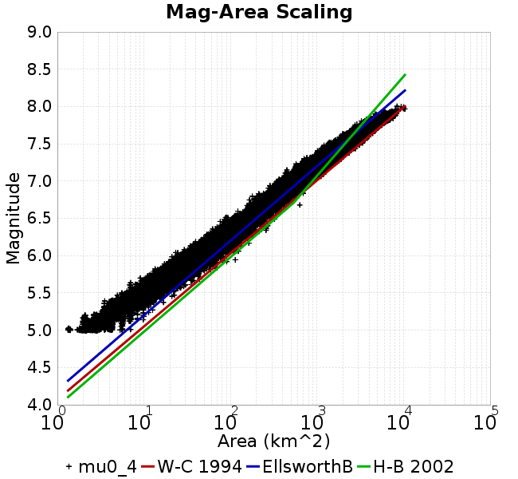 |  |
### Slip-Area Plots
*[(top)](#mu0_4)*

| Scatter | 2-D Hist |
|-----|-----|
| 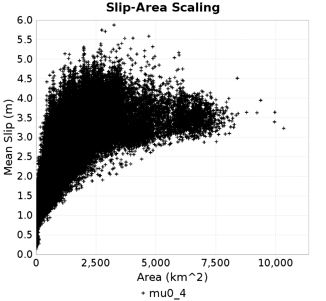 | 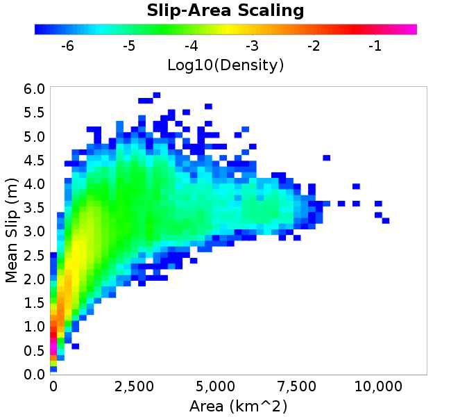 |
### Rupture Velocity Plots
*[(top)](#mu0_4)*

| **Scatter** |  |
|-----|-----|
| **Distance/Velocity** |  |
### Global Interevent-Time Distributions
*[(top)](#mu0_4)*

| **M≥6** | **M≥6.5** | **M≥7** | **M≥7.5** |
|-----|-----|-----|-----|
| 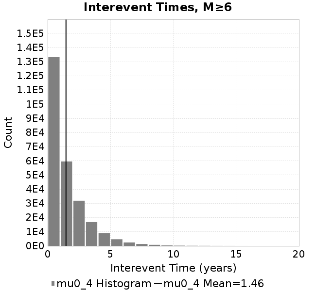 | 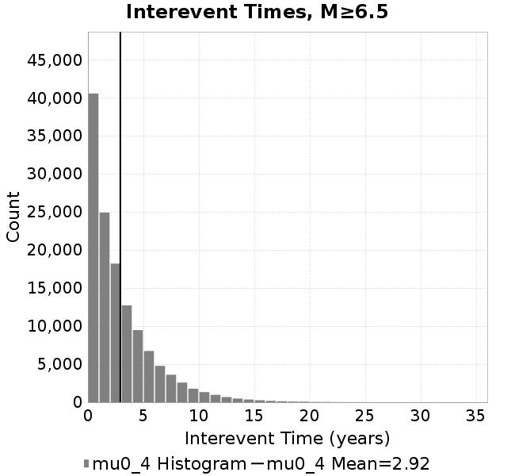 |  |  |
### Normalized Fault Interevent-Time Distributions
*[(top)](#mu0_4)*

|  | **M≥6** | **M≥6.5** | **M≥7** | **M≥7.5** |
|-----|-----|-----|-----|-----|
| **Elements** |  |  |  |  |
| **Subsections** | 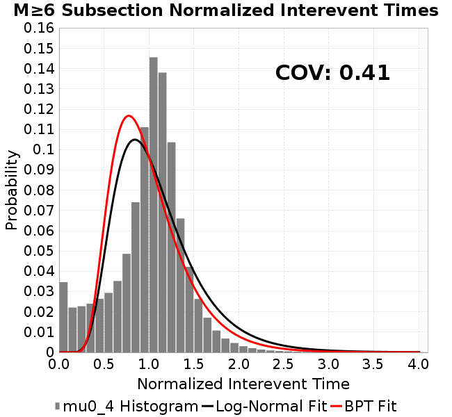 | 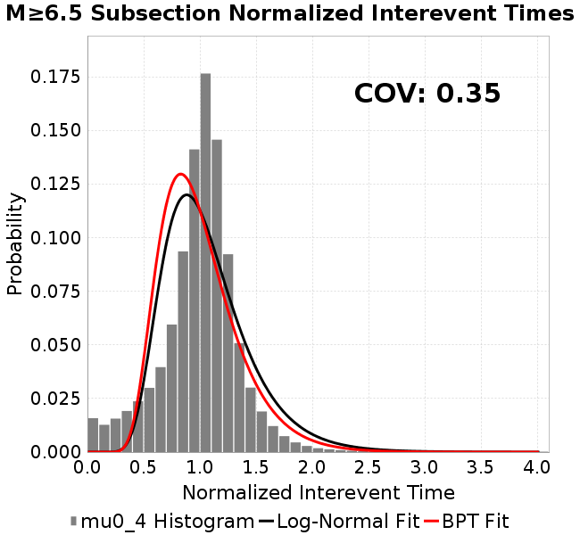 | 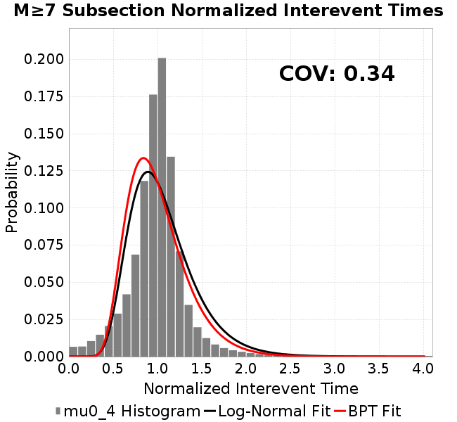 | 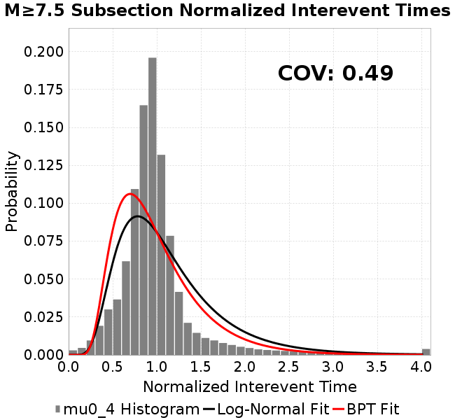 |
| **Sections** |  |  | 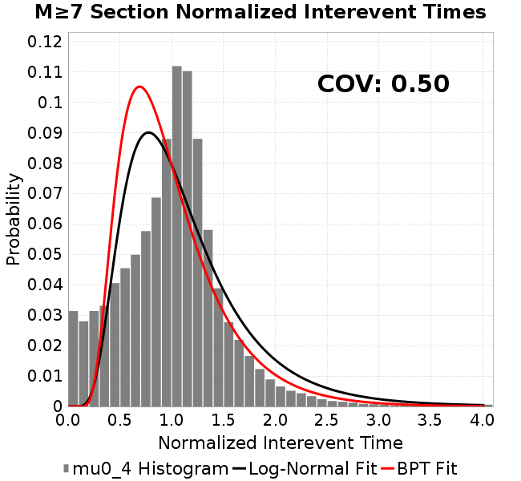 |  |
### Stationarity Plot
*[(top)](#mu0_4)*


### Element/Subsection Interevent Time Comparisons

#### Element Interevent Time Comparisons
*[(top)](#mu0_4)*

| Min Mag | Scatter | 2-D Hist |
|-----|-----|-----|
| **M≥6.0** | 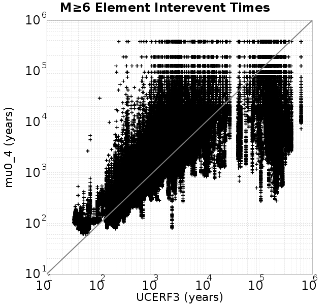 | 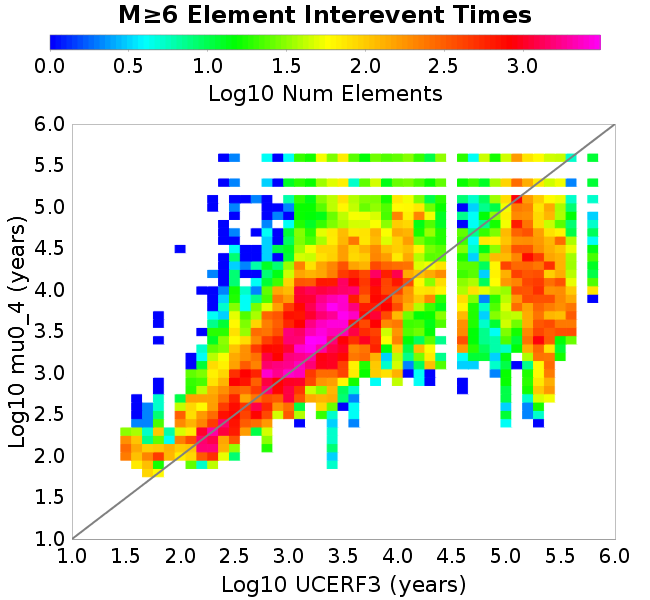 |
| **M≥6.5** | 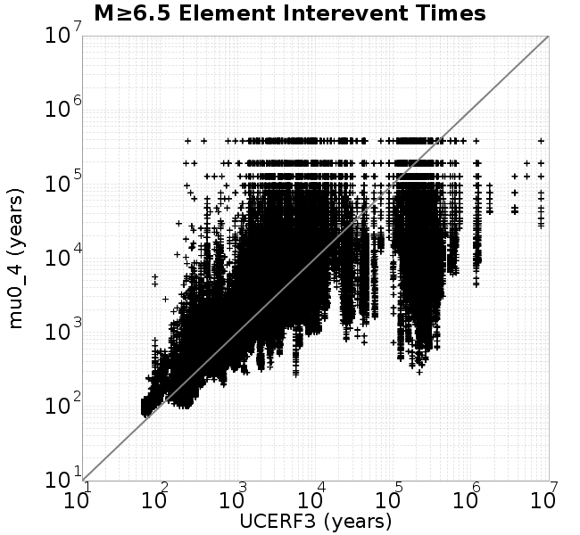 | 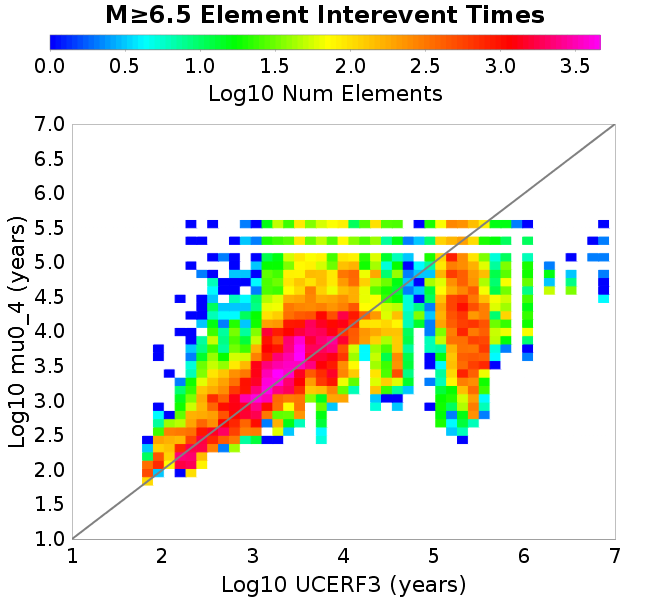 |
| **M≥7.0** |  |  |
| **M≥7.5** | 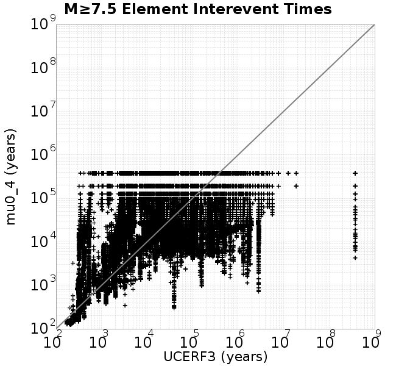 |  |

#### Subsection Interevent Time Comparisons
*[(top)](#mu0_4)*

*Subsections participate in a rupture if at least 20.0 % of its area ruptures*

| Min Mag | Scatter | 2-D Hist |
|-----|-----|-----|
| **M≥6.0** |  |  |
| **M≥6.5** |  | 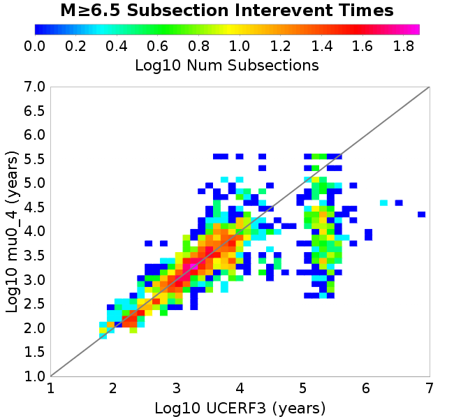 |
| **M≥7.0** | 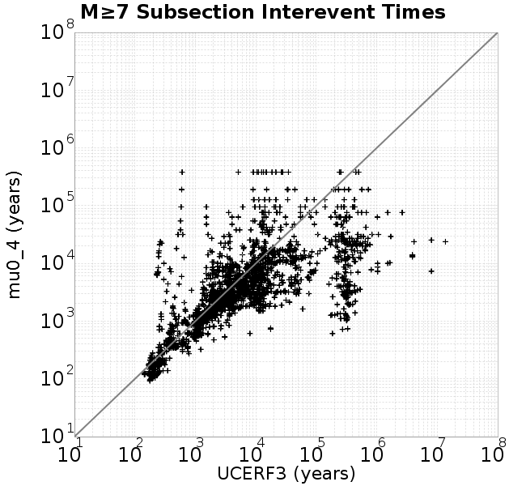 |  |
| **M≥7.5** | 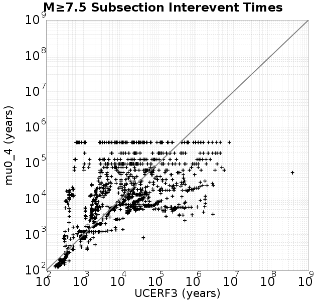 |  |

### Paleo Open Interval Plots
*[(top)](#mu0_4)*

#### Paleo Open Interval Plots, Biasi and Sharer 2019
*[(top)](#mu0_4)*

These plots use the 5 paleoseismic sites identified in Biasi & Scharer (2019) on the Hayward, N. SAF, S. SAF, and SJC faults. By default, a rupture is counted at a paleo site if the nearest element (at the surface) slips any amount. We also alternatively apply a probability of detection model. Those results are marked as 'Prob. Filtered'.

**Paleoseismic sites table:**

| **Site Name** | Data MRI (yr) | Data Annual Rate | Catalog MRI (yr) | Catalog Annual Rate | Catalog Occurences | Prob Filtered Catalog MRI (yr) | Prob Filtered Catalog Annual Rate | Prob Filtered Catalog Occurences |
|-----|-----|-----|-----|-----|-----|-----|-----|-----|
| **HOG** | 191.00 | 0.005235602 | 345.40 | 0.0028951569 | 1099 | 349.82 | 0.0028586395 | 1085.12 |
| **FRA** | 119.00 | 0.008403362 | 115.75 | 0.008639278 | 3282 | 120.98 | 0.008265936 | 3140.17 |
| **COA** | 181.00 | 0.005524862 | 178.48 | 0.0056028655 | 2128 | 190.21 | 0.0052573504 | 1996.81 |
| **SCZ** | 106.00 | 0.009433962 | 108.38 | 0.00922646 | 3505 | 130.08 | 0.007687813 | 2920.47 |
| **TYS** | 329.00 | 0.0030395137 | 318.33 | 0.0031413783 | 1192 | 356.26 | 0.0028069264 | 1064.94 |
| **TOTAL** | 31.61 | 0.0316373 | 33.89 | 0.029503927 | 11206 | 37.23 | 0.026863322 | 10203.12 |

**Paleoseismic Plots:**

|  | 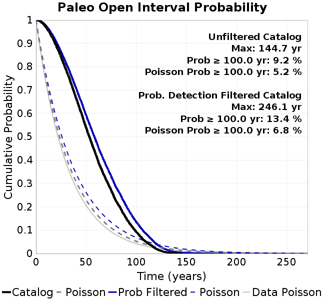 |
|-----|-----|

**Open interval probabilities table:**

| **Open Interval (yr)** | Catalog Probability | Catalog Poisson Probability | Prob. Filtered Catalog Probability | Prob. Filtered Catalog Poisson Probability | Data Poisson Probability |
|-----|-----|-----|-----|-----|-----|
| **10.00** | 0.9694035 | 0.74450237 | 0.9745061 | 0.76442355 | 0.72878754 |
| **20.00** | 0.89079446 | 0.55428374 | 0.90735495 | 0.58434343 | 0.53113127 |
| **30.00** | 0.7864434 | 0.41266555 | 0.81511635 | 0.44668588 | 0.3870819 |
| **40.00** | 0.66517705 | 0.30723047 | 0.707465 | 0.34145722 | 0.28210047 |
| **50.00** | 0.53887534 | 0.22873381 | 0.5916948 | 0.26101795 | 0.2055913 |
| **60.00** | 0.42069703 | 0.17029285 | 0.48016518 | 0.19952828 | 0.14983238 |
| **70.00** | 0.31450424 | 0.12678343 | 0.37541685 | 0.15252411 | 0.10919597 |
| **80.00** | 0.22241856 | 0.09439056 | 0.28168097 | 0.11659303 | 0.079580665 |
| **90.00** | 0.15158857 | 0.070273995 | 0.2043696 | 0.08912646 | 0.057997398 |
| **100.00** | 0.09179845 | 0.052319158 | 0.13434014 | 0.06813037 | 0.04226778 |
| **110.00** | 0.04896526 | 0.038951736 | 0.08310048 | 0.05208046 | 0.030804234 |
| **120.00** | 0.01944135 | 0.028999658 | 0.04118418 | 0.039811533 | 0.022449743 |
| **130.00** | 0.005554118 | 0.021590313 | 0.016893208 | 0.030432872 | 0.016361093 |
| **140.00** | 0.0011987898 | 0.016074039 | 0.006039766 | 0.023263605 | 0.011923761 |
| **150.00** | 0.0 | 0.01196716 | 0.0027867681 | 0.017783249 | 0.008689889 |
| **160.00** | 0.0 | 0.008909578 | 0.0015689931 | 0.0135939345 | 0.0063330824 |
| **170.00** | 0.0 | 0.006633202 | 8.37334E-4 | 0.010391524 | 0.0046154717 |
| **180.00** | 0.0 | 0.004938435 | 5.88877E-4 | 0.007943526 | 0.0033636983 |
| **190.00** | 0.0 | 0.0036766762 | 1.7129294E-4 | 0.0060722185 | 0.0024514215 |
| **200.00** | 0.0 | 0.0027372942 | 7.530984E-5 | 0.004641747 | 0.0017865654 |
| **210.00** | 0.0 | 0.002037922 | 3.288421E-5 | 0.003548261 | 0.0013020267 |
| **220.00** | 0.0 | 0.0015172376 | 1.250079E-5 | 0.0027123743 | 9.489008E-4 |
| **230.00** | 0.0 | 0.001129587 | 1.0099088E-5 | 0.0020734027 | 6.915471E-4 |
| **240.00** | 0.0 | 8.4098015E-4 | 7.85358E-6 | 0.001584958 | 5.039909E-4 |
| **250.00** | 0.0 | 6.261117E-4 | 0.0 | 0.0012115793 | 3.673023E-4 |

#### Paleo Open Interval Plots, UCERF3
*[(top)](#mu0_4)*

These plots use the full set of UCERF3 paleoseismic sites. By default, a rupture is counted at a paleo site if the nearest element (at the surface) slips any amount. We also alternativeslyapply a probability of detection model. Those results are marked as 'Prob. Filtered'.

**Paleoseismic sites table:**

| **Site Name** | Data MRI (yr) | Data Annual Rate | Catalog MRI (yr) | Catalog Annual Rate | Catalog Occurences | Prob Filtered Catalog MRI (yr) | Prob Filtered Catalog Annual Rate | Prob Filtered Catalog Occurences |
|-----|-----|-----|-----|-----|-----|-----|-----|-----|
| **SSanAndreasBurroFlats** | 205.44 | 0.0048677 | 157.23 | 0.0063601136 | 2416 | 193.60 | 0.005165173 | 1962.1 |
| **SSanAndreasIndio** | 277.37 | 0.0036053 | 174.38 | 0.0057345736 | 2178 | 185.37 | 0.0053945296 | 2048.91 |
| **SSAFMCreek1000Palms** | 261.33 | 0.0038266 | 1531.18 | 6.5309263E-4 | 248 | 2237.76 | 4.4687456E-4 | 169.48 |
| **NSanAndreasFortRoss** | 306.28 | 0.003265 | 188.85 | 0.005295229 | 2011 | 191.77 | 0.0052145887 | 1980.38 |
| **NSanAndreasNorthCoast** | 263.87 | 0.0037898 | 176.55 | 0.005664051 | 2151 | 181.64 | 0.005505283 | 2090.71 |
| **CalaverasfaultNorth** | 618.05 | 0.001618 | 153.49 | 0.0065151695 | 2475 | 226.74 | 0.0044103027 | 1675 |
| **ElsinoreTemecula** | 1019.16 | 9.812E-4 | 686.53 | 0.0014565962 | 553 | 713.83 | 0.0014008982 | 531.86 |
| **ElsinoreWhittier** | 3196.93 | 3.128E-4 | 1416.13 | 7.061512E-4 | 268 | 1498.33 | 6.6740817E-4 | 253.22 |
| **SSAFCarrizoBidart** | 114.71 | 0.0087179 | 119.95 | 0.008336469 | 3167 | 123.07 | 0.008125667 | 3086.89 |
| **SanJacintoHogLake** | 311.78 | 0.0032074 | 345.40 | 0.0028951569 | 1099 | 350.00 | 0.0028571358 | 1084.57 |
| **PuenteHills** | 3506.31 | 2.852E-4 | 4430.01 | 2.2573303E-4 | 86 | 4968.39 | 2.0127241E-4 | 76.75 |
| **SanGregorioNorth** | 1019.06 | 9.813E-4 | 380.54 | 0.0026278119 | 998 | 400.26 | 0.0024983478 | 948.83 |
| **SanJacintoSuperstition** | 508.26 | 0.0019675 | 1239.56 | 8.067405E-4 | 307 | 1328.19 | 7.529029E-4 | 286.49 |
| **SSanAndreasWrightwood** | 106.04 | 0.0094304 | 153.12 | 0.00653103 | 2481 | 154.90 | 0.0064557483 | 2452.37 |
| **SSanAndreasPitmanCanyon** | 173.48 | 0.0057643 | 152.99 | 0.006536297 | 2483 | 164.64 | 0.006073873 | 2307.27 |
| **SSanAndreasPlungeCreek** | 205.36 | 0.0048695 | 353.70 | 0.0028272183 | 1074 | 438.39 | 0.0022810488 | 866.56 |
| **FrazierMountianSSAF** | 148.57 | 0.0067307 | 115.75 | 0.008639278 | 3282 | 121.01 | 0.008264037 | 3139.45 |
| **NSanAndreasSantaCruzSeg** | 109.84 | 0.0091041 | 108.38 | 0.00922646 | 3505 | 130.14 | 0.007684249 | 2918.95 |
| **RodgersCreek** | 325.31 | 0.003074 | 191.62 | 0.0052187517 | 1981 | 246.08 | 0.0040637264 | 1542.66 |
| **GreenValleyMasonRoad** | 293.31 | 0.0034094 | 1638.46 | 6.1032875E-4 | 232 | 2254.76 | 4.4350594E-4 | 168.26 |
| **HaywardfaultNorth** | 318.34 | 0.0031413 | 358.15 | 0.0027920997 | 1061 | 369.45 | 0.0027067296 | 1028.54 |
| **HaywardfaultSouth** | 167.57 | 0.0059677 | 318.33 | 0.0031413783 | 1192 | 356.71 | 0.002803381 | 1063.7 |
| **Compton** | 2658.16 | 3.762E-4 | 5537.51 | 1.8058643E-4 | 69 | 6078.54 | 1.6451305E-4 | 62.81 |
| **SSanAndreasCoachella** | 178.45 | 0.0056037 | 178.48 | 0.0056028655 | 2128 | 190.22 | 0.005256952 | 1996.67 |
| **ElsinoreGlenIvy** | 179.12 | 0.0055828 | 557.30 | 0.0017943576 | 681 | 596.34 | 0.0016768951 | 636.45 |
| **GarlockCentralallevents** | 1434.93 | 6.969E-4 | 629.40 | 0.0015888033 | 603 | 639.73 | 0.0015631524 | 593.23 |
| **NSanAndreasAlderCreek** | 869.64 | 0.0011499 | 189.70 | 0.005271519 | 2002 | 193.01 | 0.0051811757 | 1967.66 |
| **SSanAndreasPallettCreek** | 149.30 | 0.006698 | 152.93 | 0.0065389303 | 2484 | 154.68 | 0.006464844 | 2455.84 |
| **GarlockWesternallevents** | 1230.16 | 8.129E-4 | 807.81 | 0.001237911 | 470 | 832.34 | 0.0012014325 | 456.17 |
| **ElsinoreFaultJulian** | 3250.98 | 3.076E-4 | 1314.56 | 7.6070946E-4 | 288 | 1335.69 | 7.4867473E-4 | 283.44 |
| **TOTAL** | 9.08 | 0.1101451 | 13.71 | 0.07293171 | 27699 | 15.32 | 0.06528041 | 24793.12 |

**Paleoseismic Plots:**

|  |  |
|-----|-----|

**Open interval probabilities table:**

| **Open Interval (yr)** | Catalog Probability | Catalog Poisson Probability | Prob. Filtered Catalog Probability | Prob. Filtered Catalog Poisson Probability | Data Poisson Probability |
|-----|-----|-----|-----|-----|-----|
| **10.00** | 0.84410733 | 0.4822382 | 0.86944944 | 0.520584 | 0.33238843 |
| **20.00** | 0.57778734 | 0.23255369 | 0.63056064 | 0.27100766 | 0.110482074 |
| **30.00** | 0.34195575 | 0.11214628 | 0.40437287 | 0.14108224 | 0.036722966 |
| **40.00** | 0.18295833 | 0.05408122 | 0.23721276 | 0.073445156 | 0.012206289 |
| **50.00** | 0.088519745 | 0.026080031 | 0.12714943 | 0.038234368 | 0.004057229 |
| **60.00** | 0.039688755 | 0.012576788 | 0.064857274 | 0.0199042 | 0.001348576 |
| **70.00** | 0.014575169 | 0.0060650078 | 0.02880767 | 0.010361807 | 4.4825108E-4 |
| **80.00** | 0.004963007 | 0.0029247785 | 0.012018465 | 0.0053941905 | 1.4899348E-4 |
| **90.00** | 0.0016676101 | 0.00141044 | 0.004654378 | 0.0028081292 | 4.952371E-5 |
| **100.00** | 4.2574148E-4 | 6.8016804E-4 | 0.0013739759 | 0.001461867 | 1.6461108E-5 |
| **110.00** | 0.0 | 3.2800302E-4 | 3.573125E-4 | 7.6102454E-4 | 5.4714824E-6 |
| **120.00** | 0.0 | 1.581756E-4 | 1.8390399E-4 | 3.9617717E-4 | 1.8186574E-6 |
| **130.00** | 0.0 | 7.627832E-5 | 2.920694E-5 | 2.0624348E-4 | 6.045007E-7 |
| **140.00** | 0.0 | 3.678432E-5 | 1.30607805E-5 | 1.0736705E-4 | 2.0092905E-7 |
| **150.00** | 0.0 | 1.7738805E-5 | 0.0 | 5.5893564E-5 | 6.678649E-8 |

### Moment Release Variability Plots
*[(top)](#mu0_4)*

We first create a tapered moment release time series for the entire catalog. Each event's moment is distributed across a 25 year Hanning (cosine) taper. Here is a plot of a random 2,000 year section of this time series:

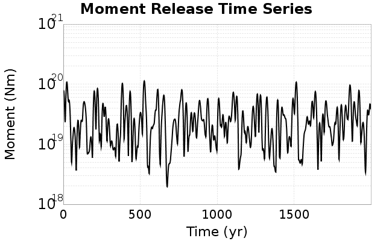

We then compute Welch's power spectral density estimate on the entire time series. Results are plotted below, with a Poisson randomization of the catalog also plotted in gray as a control. Significant deviations above the Poisson model indicate synchronization at that period.

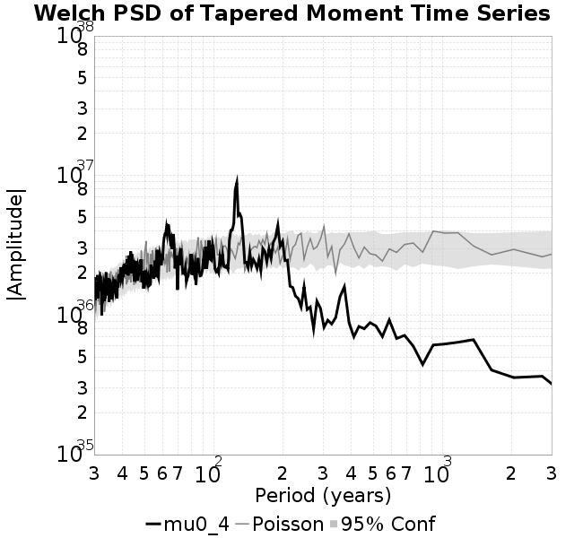

## Input File
*[(top)](#mu0_4)*

```
  A_1 = 0.001
  fA = .1
  B_1 = 0.008
  muSlipAmp_1 = .0
  muSlipInvDist_1 = 1.0
  cohesion = 0.0
  Dc_1 = 1.0000000000000000818e-05
  mu0_1 = 0.4
  ddotStar_1 = 9.9999999999999995475e-07
  ddotAB_1 = 9.9999999999999995475e-07
  alpha_1 = 0.0
  theta0_1 = 200000000
  tau0_1 = 55.1
  sigma0_1 = 100
  sigmaFracPin = .5
  lowSigmaAction = 1
  maxThetaPin = 1.0e13
  ddotEQ_1 = 1
  ddotEQFname = 
  stressOvershootFactor = 0.10000000000000000555
  lameLambda = 30000
  lameMu = 30000
  slowSlip_1 = 0
  nEq = 100000000000
  KZeroFrac = 0
  muPin = 1.0
  tStart = 0
  maxT = 3.16e13
  maxWallTime = 169200
  maxTrans = 1.0000000000000000159e100
  faultFname = UCERF3FM.15km.1km.tri.flt
  outFnameInfix = mu0_4
  writeTau = 2
  writeSigma = 2
  writeSlip = 0
  writeSlipSpeed = 0
  writeState = 0
  writeTheta = 2
  writePED = 1
  writeTransitions = 1
  minDtWrite = 0
  minDtWriteCoseismic = 0
  minDtWriteInterseismic = 0
  minMagWrite = 7.7
  writeStiffness = 0
  stressRateSpecification = 1
  dMu3 = 0.01000000000000000
  initTauFname = 
  initSigmaFname = 
  initThetaFname = 
  initSlipSpeedFname = 
  AFname = 
  BFname =  
  DcFname = 
  mu0Fname = 
  ddotStarFname = 
  ddotABFname = 
  alphaFname = 
  KTauFname = /u/sciteam/gilchris/scratch/stiffness_25a589d/Ktau.25a589d.out
  KSigmaFname = /u/sciteam/gilchris/scratch/stiffness_25a589d/Ksigma.25a589d.out
  tFailFname = 
  tauFailFname = 
  tauDotFname = 
  sigmaDotFname =
  KZeroFname = UCERF3FM.15km.1km.tri.KZero
  pinnedFname =  UCERF3FM.15km.1km.tri.pin
  neighborFname = UCERF3FM.15km.1km.tri.neighbors
  stressRateFname =  
  slowSlipFname = 
  writePatchFname = 
  DEBUG = 0
  ZBrentUpperBracket = 0
  receiverElementAreaFrac = 0.8
  receiverElementIntTol = 1.0e-4
  receiverElementSubdivisionMax = 4
  tgfDist1 = 3
  tgfDist1 = 10
  lowSigmaAction = 1
  highSigmaAction = 0
```
