# mu0_5
## Metadata
| **Catalog** | mu0_5 |
|-----|-----|
| **Author** | Jaqcui Gilchrist, 2018/09/27 |
| **Description** | change mu0: mu0=0.5 |
| **Fault/Def Model** | Fault Model 3.1, Geologic |
| **Slip Velocity** | 1.0 m/s |
| **Average Element Area** | 1.35 km^2 |
| **Length** | 8,721,567 events in 429,329 years |
| **Frictional Params** | a=0.001, b=0.008, (b-a)=0.007, ddotEQ=1 |

* [Metadata](#metadata)
* [Plots](#plots)
  * [Magnitude-Frequency Plot](#magnitude-frequency-plot)
  * [Magnitude-Area Plots](#magnitude-area-plots)
  * [Slip-Area Plots](#slip-area-plots)
  * [Rupture Velocity Plots](#rupture-velocity-plots)
  * [Global Interevent-Time Distributions](#global-interevent-time-distributions)
  * [Normalized Fault Interevent-Time Distributions](#normalized-fault-interevent-time-distributions)
  * [Stationarity Plot](#stationarity-plot)
  * [Element/Subsection Interevent Time Comparisons](#elementsubsection-interevent-time-comparisons)
    * [Element Interevent Time Comparisons](#element-interevent-time-comparisons)
    * [Subsection Interevent Time Comparisons](#subsection-interevent-time-comparisons)
  * [Paleo Open Interval Plots](#paleo-open-interval-plots)
    * [Paleo Open Interval Plots, Biasi and Sharer 2019](#paleo-open-interval-plots-biasi-and-sharer-2019)
    * [Paleo Open Interval Plots, UCERF3](#paleo-open-interval-plots-ucerf3)
  * [Moment Release Variability Plots](#moment-release-variability-plots)
* [Input File](#input-file)

## Plots
### Magnitude-Frequency Plot
*[(top)](#mu0_5)*


### Magnitude-Area Plots
*[(top)](#mu0_5)*

| Scatter | 2-D Hist |
|-----|-----|
| 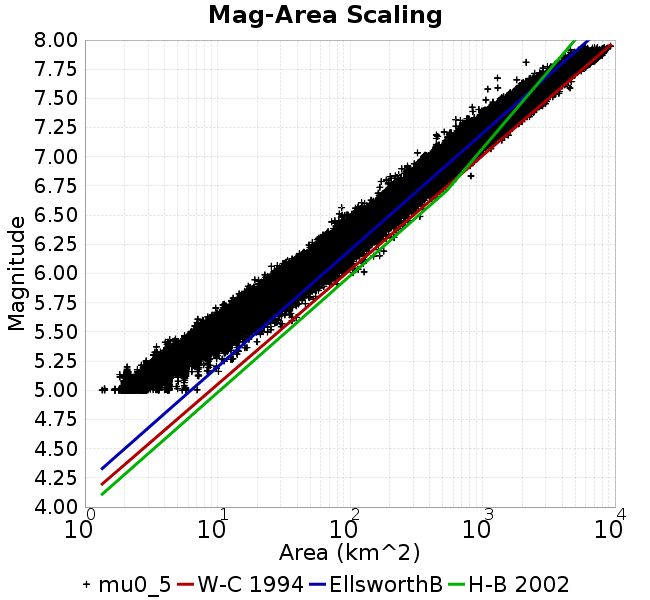 |  |
### Slip-Area Plots
*[(top)](#mu0_5)*

| Scatter | 2-D Hist |
|-----|-----|
| 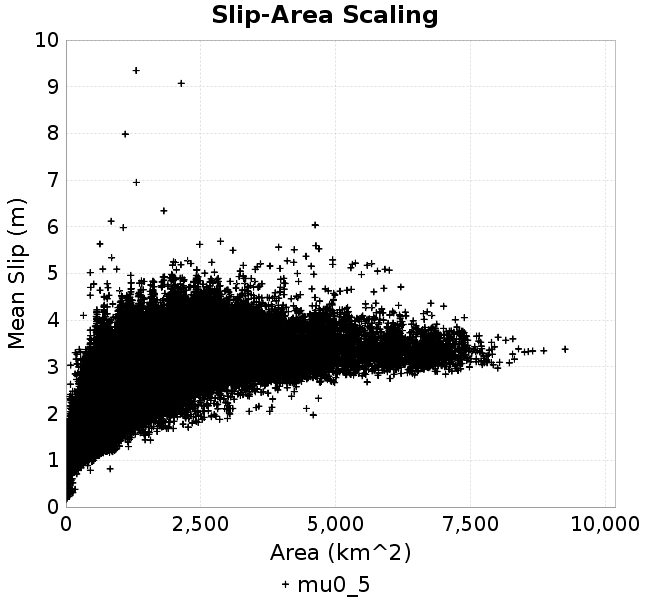 | 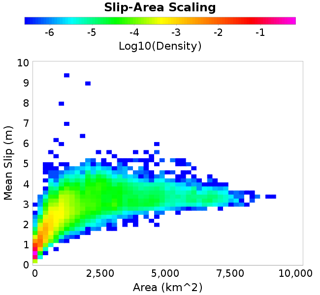 |
### Rupture Velocity Plots
*[(top)](#mu0_5)*

| **Scatter** | 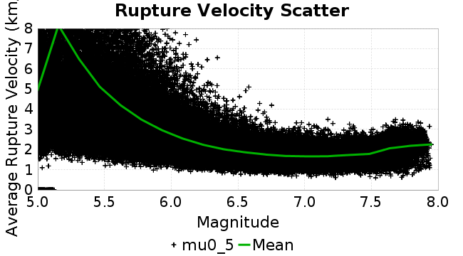 |
|-----|-----|
| **Distance/Velocity** |  |
### Global Interevent-Time Distributions
*[(top)](#mu0_5)*

| **M≥6** | **M≥6.5** | **M≥7** | **M≥7.5** |
|-----|-----|-----|-----|
| 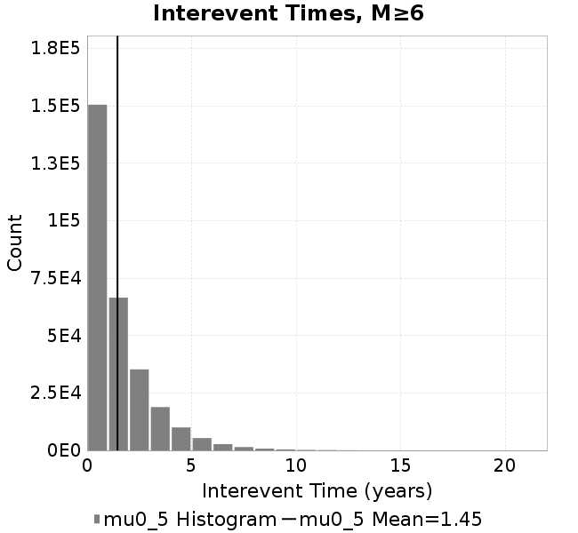 | 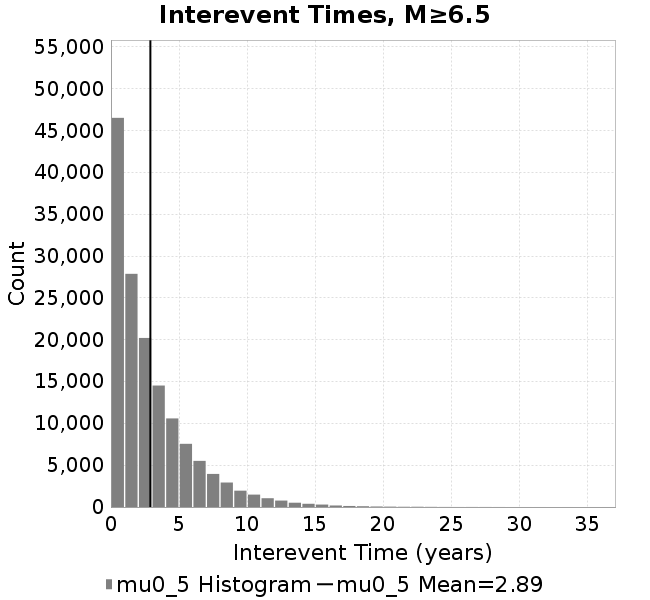 | 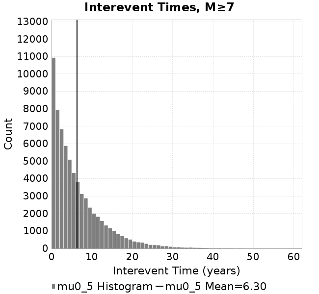 |  |
### Normalized Fault Interevent-Time Distributions
*[(top)](#mu0_5)*

|  | **M≥6** | **M≥6.5** | **M≥7** | **M≥7.5** |
|-----|-----|-----|-----|-----|
| **Elements** |  | 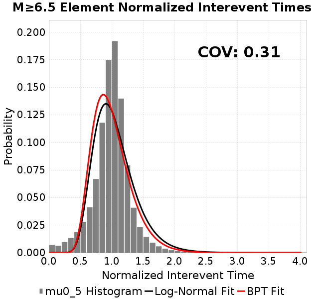 | 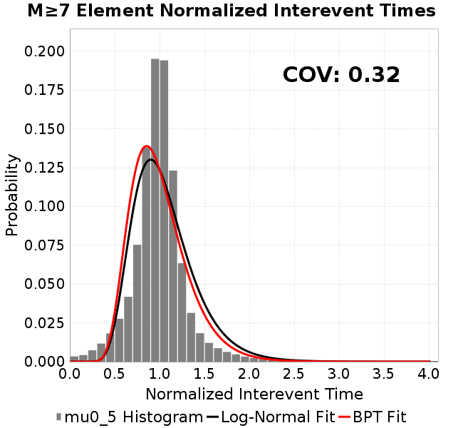 |  |
| **Subsections** |  |  | 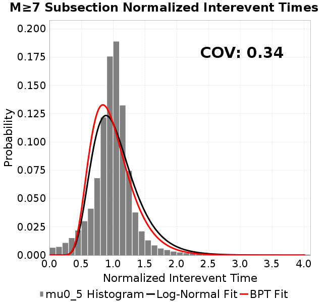 |  |
| **Sections** | 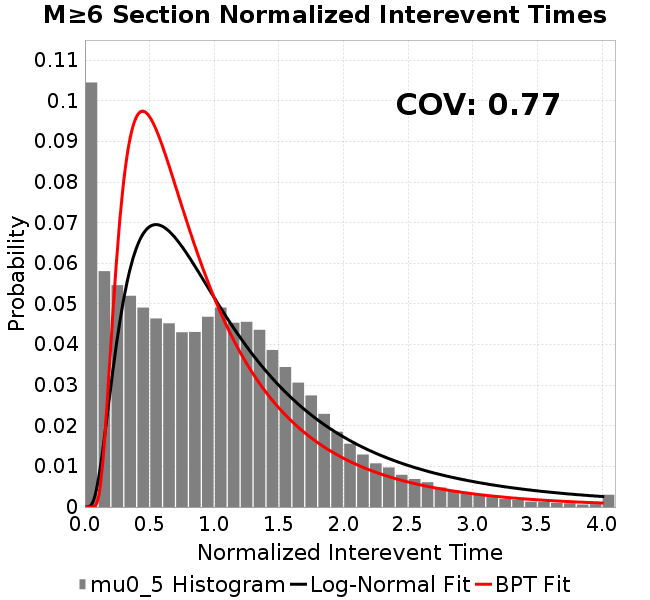 | 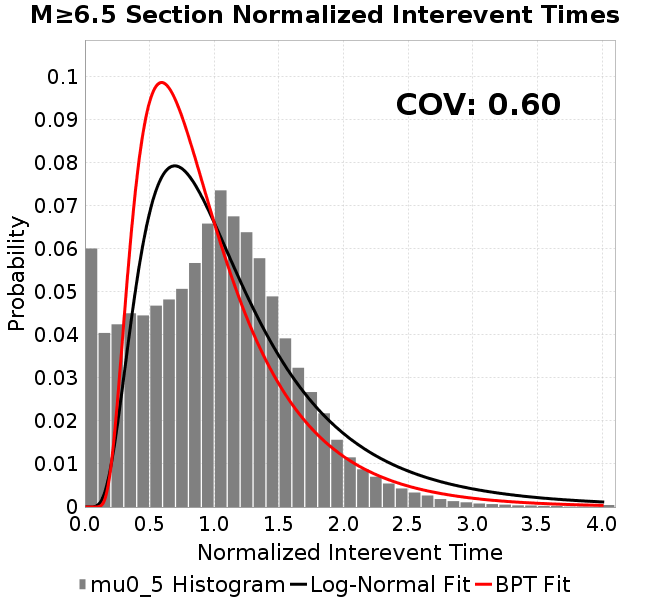 |  |  |
### Stationarity Plot
*[(top)](#mu0_5)*


### Element/Subsection Interevent Time Comparisons

#### Element Interevent Time Comparisons
*[(top)](#mu0_5)*

| Min Mag | Scatter | 2-D Hist |
|-----|-----|-----|
| **M≥6.0** |  |  |
| **M≥6.5** |  |  |
| **M≥7.0** | 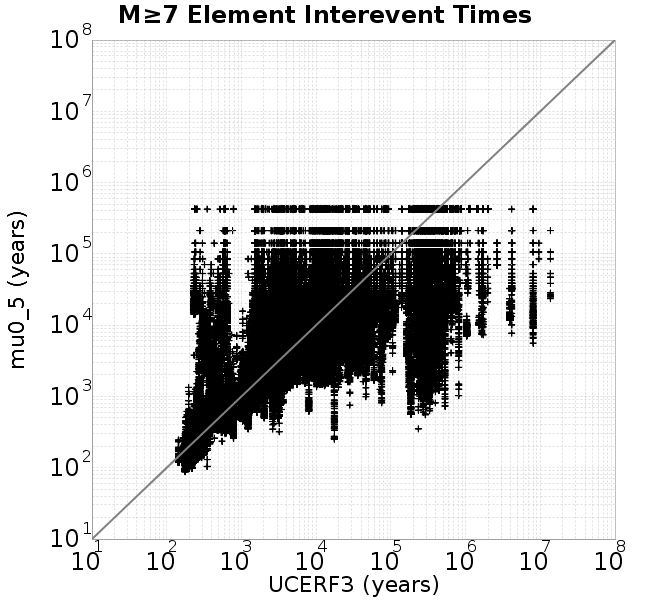 |  |
| **M≥7.5** |  |  |

#### Subsection Interevent Time Comparisons
*[(top)](#mu0_5)*

*Subsections participate in a rupture if at least 20.0 % of its area ruptures*

| Min Mag | Scatter | 2-D Hist |
|-----|-----|-----|
| **M≥6.0** |  |  |
| **M≥6.5** |  | 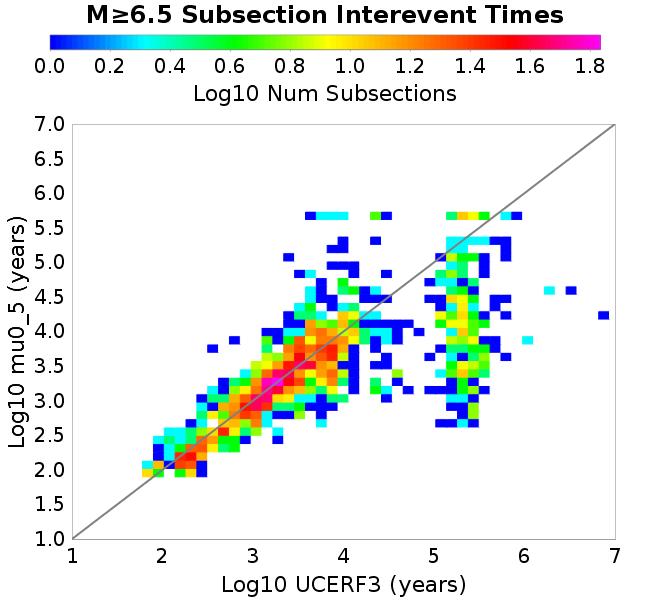 |
| **M≥7.0** | 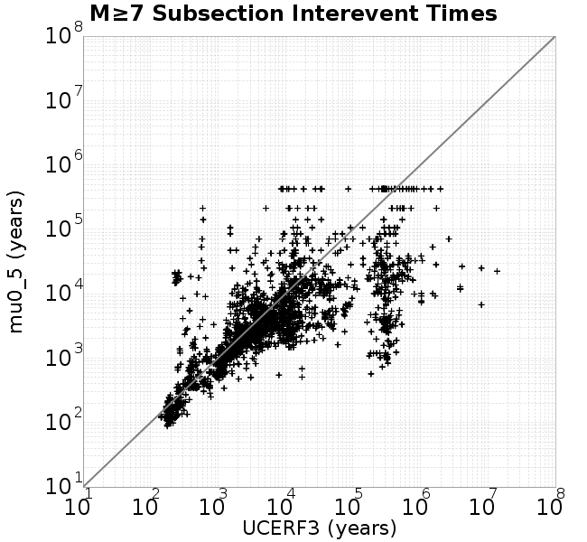 |  |
| **M≥7.5** |  |  |

### Paleo Open Interval Plots
*[(top)](#mu0_5)*

#### Paleo Open Interval Plots, Biasi and Sharer 2019
*[(top)](#mu0_5)*

These plots use the 5 paleoseismic sites identified in Biasi & Scharer (2019) on the Hayward, N. SAF, S. SAF, and SJC faults. By default, a rupture is counted at a paleo site if the nearest element (at the surface) slips any amount. We also alternatively apply a probability of detection model. Those results are marked as 'Prob. Filtered'.

**Paleoseismic sites table:**

| **Site Name** | Data MRI (yr) | Data Annual Rate | Catalog MRI (yr) | Catalog Annual Rate | Catalog Occurences | Prob Filtered Catalog MRI (yr) | Prob Filtered Catalog Annual Rate | Prob Filtered Catalog Occurences |
|-----|-----|-----|-----|-----|-----|-----|-----|-----|
| **HOG** | 191.00 | 0.005235602 | 344.55 | 0.002902349 | 1231 | 348.62 | 0.002868418 | 1216.61 |
| **FRA** | 119.00 | 0.008403362 | 113.88 | 0.008781277 | 3727 | 117.91 | 0.008480706 | 3599.36 |
| **COA** | 181.00 | 0.005524862 | 172.29 | 0.0058040675 | 2463 | 185.06 | 0.0054036197 | 2292.8 |
| **SCZ** | 106.00 | 0.009433962 | 109.51 | 0.009131829 | 3875 | 129.13 | 0.0077441707 | 3286.25 |
| **TYS** | 329.00 | 0.0030395137 | 338.51 | 0.0029541387 | 1254 | 373.62 | 0.00267654 | 1136.02 |
| **TOTAL** | 31.61 | 0.0316373 | 33.81 | 0.029574942 | 12550 | 36.78 | 0.027189994 | 11537.92 |

**Paleoseismic Plots:**

|  | 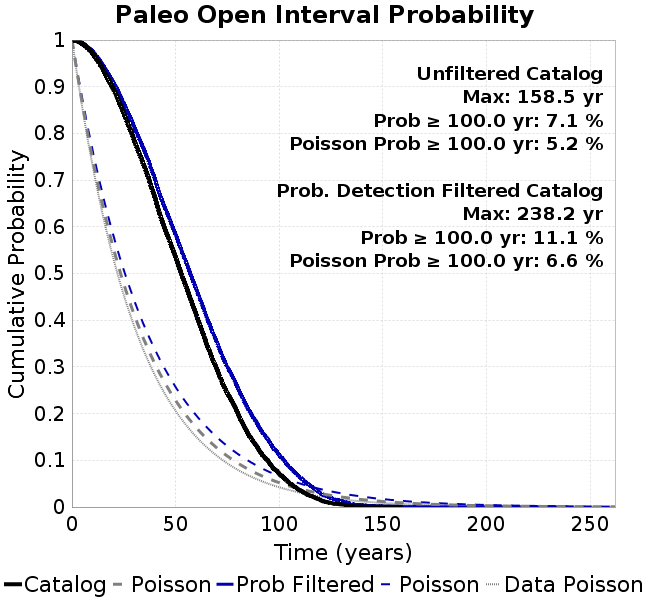 |
|-----|-----|

**Open interval probabilities table:**

| **Open Interval (yr)** | Catalog Probability | Catalog Poisson Probability | Prob. Filtered Catalog Probability | Prob. Filtered Catalog Poisson Probability | Data Poisson Probability |
|-----|-----|-----|-----|-----|-----|
| **10.00** | 0.9706516 | 0.74397385 | 0.9750448 | 0.76193047 | 0.72878754 |
| **20.00** | 0.89372367 | 0.5534971 | 0.90869486 | 0.5805381 | 0.53113127 |
| **30.00** | 0.78463644 | 0.41178733 | 0.8134104 | 0.44232967 | 0.3870819 |
| **40.00** | 0.66299486 | 0.306359 | 0.70265096 | 0.33702445 | 0.28210047 |
| **50.00** | 0.5353913 | 0.22792307 | 0.5833351 | 0.2567892 | 0.2055913 |
| **60.00** | 0.41173965 | 0.16956879 | 0.46613136 | 0.19565554 | 0.14983238 |
| **70.00** | 0.29385436 | 0.12615475 | 0.3510266 | 0.14907591 | 0.10919597 |
| **80.00** | 0.20116617 | 0.09385583 | 0.25548217 | 0.11358549 | 0.079580665 |
| **90.00** | 0.12355048 | 0.06982628 | 0.17304285 | 0.086544245 | 0.057997398 |
| **100.00** | 0.07116691 | 0.051948924 | 0.11119327 | 0.0659407 | 0.04226778 |
| **110.00** | 0.035665967 | 0.03864864 | 0.06336403 | 0.05024223 | 0.030804234 |
| **120.00** | 0.014585055 | 0.028753577 | 0.029683674 | 0.038281087 | 0.022449743 |
| **130.00** | 0.00555947 | 0.021391908 | 0.012633058 | 0.029167527 | 0.016361093 |
| **140.00** | 0.0011554359 | 0.01591502 | 0.004266761 | 0.022223629 | 0.011923761 |
| **150.00** | 5.729525E-4 | 0.011840358 | 0.0019479977 | 0.01693286 | 0.008689889 |
| **160.00** | 0.0 | 0.008808916 | 9.3024987E-4 | 0.012901663 | 0.0063330824 |
| **170.00** | 0.0 | 0.0065536033 | 5.565132E-4 | 0.00983017 | 0.0046154717 |
| **180.00** | 0.0 | 0.0048757093 | 2.9299574E-4 | 0.0074899066 | 0.0033636983 |
| **190.00** | 0.0 | 0.0036274001 | 1.1173055E-4 | 0.005706788 | 0.0024514215 |
| **200.00** | 0.0 | 0.0026986906 | 5.3434524E-5 | 0.004348176 | 0.0017865654 |
| **210.00** | 0.0 | 0.0020077552 | 2.682679E-5 | 0.0033130078 | 0.0013020267 |
| **220.00** | 0.0 | 0.0014937173 | 1.4191607E-5 | 0.0025242816 | 9.489008E-4 |
| **230.00** | 0.0 | 0.0011112866 | 9.221447E-6 | 0.0019233272 | 6.915471E-4 |
| **240.00** | 0.0 | 8.2676817E-4 | 0.0 | 0.0014654417 | 5.039909E-4 |

#### Paleo Open Interval Plots, UCERF3
*[(top)](#mu0_5)*

These plots use the full set of UCERF3 paleoseismic sites. By default, a rupture is counted at a paleo site if the nearest element (at the surface) slips any amount. We also alternativeslyapply a probability of detection model. Those results are marked as 'Prob. Filtered'.

**Paleoseismic sites table:**

| **Site Name** | Data MRI (yr) | Data Annual Rate | Catalog MRI (yr) | Catalog Annual Rate | Catalog Occurences | Prob Filtered Catalog MRI (yr) | Prob Filtered Catalog Annual Rate | Prob Filtered Catalog Occurences |
|-----|-----|-----|-----|-----|-----|-----|-----|-----|
| **SSanAndreasBurroFlats** | 205.44 | 0.0048677 | 180.32 | 0.005545581 | 2353 | 213.00 | 0.004694828 | 1991.94 |
| **SSanAndreasIndio** | 277.37 | 0.0036053 | 167.20 | 0.005980877 | 2538 | 178.96 | 0.005587984 | 2371.17 |
| **SSAFMCreek1000Palms** | 261.33 | 0.0038266 | 1574.33 | 6.3518883E-4 | 270 | 2279.49 | 4.3869414E-4 | 186.02 |
| **NSanAndreasFortRoss** | 306.28 | 0.003265 | 180.86 | 0.0055292407 | 2346 | 183.84 | 0.0054396098 | 2307.96 |
| **NSanAndreasNorthCoast** | 263.87 | 0.0037898 | 170.08 | 0.005879533 | 2495 | 174.50 | 0.0057305596 | 2431.68 |
| **CalaverasfaultNorth** | 618.05 | 0.001618 | 159.14 | 0.006283784 | 2665 | 232.17 | 0.0043071774 | 1826.66 |
| **ElsinoreTemecula** | 1019.16 | 9.812E-4 | 675.29 | 0.0014808545 | 628 | 700.52 | 0.0014275116 | 605.36 |
| **ElsinoreWhittier** | 3196.93 | 3.128E-4 | 1346.12 | 7.4287853E-4 | 315 | 1431.87 | 6.983864E-4 | 295.78 |
| **SSAFCarrizoBidart** | 114.71 | 0.0087179 | 109.36 | 0.009144217 | 3881 | 114.23 | 0.008754128 | 3715.26 |
| **SanJacintoHogLake** | 311.78 | 0.0032074 | 344.55 | 0.002902349 | 1231 | 348.63 | 0.0028683466 | 1216.59 |
| **PuenteHills** | 3506.31 | 2.852E-4 | 4760.16 | 2.1007686E-4 | 90 | 5253.92 | 1.9033409E-4 | 81.5 |
| **SanGregorioNorth** | 1019.06 | 9.813E-4 | 399.73 | 0.0025017196 | 1061 | 414.60 | 0.002411942 | 1022.8 |
| **SanJacintoSuperstition** | 508.26 | 0.0019675 | 1237.54 | 8.080544E-4 | 343 | 1327.22 | 7.5345265E-4 | 319.79 |
| **SSanAndreasWrightwood** | 106.04 | 0.0094304 | 143.67 | 0.0069605904 | 2953 | 145.51 | 0.0068723 | 2915.52 |
| **SSanAndreasPitmanCanyon** | 173.48 | 0.0057643 | 138.41 | 0.007224678 | 3065 | 150.14 | 0.006660232 | 2825.49 |
| **SSanAndreasPlungeCreek** | 205.36 | 0.0048695 | 339.46 | 0.0029458548 | 1250 | 425.57 | 0.0023498146 | 997.05 |
| **FrazierMountianSSAF** | 148.57 | 0.0067307 | 113.88 | 0.008781277 | 3727 | 117.92 | 0.008479971 | 3599.01 |
| **NSanAndreasSantaCruzSeg** | 109.84 | 0.0091041 | 109.51 | 0.009131829 | 3875 | 129.10 | 0.0077459877 | 3287 |
| **RodgersCreek** | 325.31 | 0.003074 | 169.11 | 0.0059134075 | 2509 | 227.68 | 0.0043922234 | 1863.65 |
| **GreenValleyMasonRoad** | 293.31 | 0.0034094 | 1617.06 | 6.1840453E-4 | 262 | 2209.51 | 4.525884E-4 | 191.36 |
| **HaywardfaultNorth** | 318.34 | 0.0031413 | 344.14 | 0.002905774 | 1233 | 356.46 | 0.0028053913 | 1190.39 |
| **HaywardfaultSouth** | 167.57 | 0.0059677 | 338.51 | 0.0029541387 | 1254 | 373.14 | 0.0026799422 | 1137.52 |
| **Compton** | 2658.16 | 3.762E-4 | 5746.30 | 1.7402499E-4 | 74 | 6279.20 | 1.5925588E-4 | 67.59 |
| **SSanAndreasCoachella** | 178.45 | 0.0056037 | 172.29 | 0.0058040675 | 2463 | 184.83 | 0.005410391 | 2295.68 |
| **ElsinoreGlenIvy** | 179.12 | 0.0055828 | 544.81 | 0.0018355062 | 779 | 582.53 | 0.0017166628 | 728.53 |
| **GarlockCentralallevents** | 1434.93 | 6.969E-4 | 607.20 | 0.0016469161 | 699 | 620.18 | 0.001612441 | 684.38 |
| **NSanAndreasAlderCreek** | 869.64 | 0.0011499 | 184.39 | 0.0054233973 | 2301 | 187.24 | 0.0053406083 | 2265.88 |
| **SSanAndreasPallettCreek** | 149.30 | 0.006698 | 143.08 | 0.0069888853 | 2965 | 144.99 | 0.006897031 | 2926.02 |
| **GarlockWesternallevents** | 1230.16 | 8.129E-4 | 794.42 | 0.0012587755 | 534 | 819.37 | 0.0012204443 | 517.74 |
| **ElsinoreFaultJulian** | 3250.98 | 3.076E-4 | 1270.31 | 7.872121E-4 | 334 | 1295.99 | 7.716101E-4 | 327.25 |
| **TOTAL** | 9.08 | 0.1101451 | 13.29 | 0.07525596 | 31933 | 14.76 | 0.067753874 | 28749.69 |

**Paleoseismic Plots:**

|  |  |
|-----|-----|

**Open interval probabilities table:**

| **Open Interval (yr)** | Catalog Probability | Catalog Poisson Probability | Prob. Filtered Catalog Probability | Prob. Filtered Catalog Poisson Probability | Data Poisson Probability |
|-----|-----|-----|-----|-----|-----|
| **10.00** | 0.836968 | 0.471159 | 0.86199844 | 0.5078654 | 0.33238843 |
| **20.00** | 0.55213094 | 0.22199082 | 0.6054808 | 0.2579273 | 0.110482074 |
| **30.00** | 0.31813172 | 0.10459298 | 0.37591538 | 0.13099235 | 0.036722966 |
| **40.00** | 0.15932706 | 0.049279924 | 0.20826982 | 0.06652649 | 0.012206289 |
| **50.00** | 0.07142534 | 0.02321868 | 0.1043822 | 0.033786505 | 0.004057229 |
| **60.00** | 0.030398222 | 0.010939691 | 0.048973568 | 0.017158998 | 0.001348576 |
| **70.00** | 0.012846125 | 0.005154334 | 0.022174804 | 0.008714462 | 4.4825108E-4 |
| **80.00** | 0.0042381394 | 0.002428511 | 0.008607343 | 0.004425774 | 1.4899348E-4 |
| **90.00** | 0.001295788 | 0.0011442149 | 0.0027861558 | 0.0022476974 | 4.952371E-5 |
| **100.00** | 3.525681E-4 | 5.3910713E-4 | 9.1015047E-4 | 0.0011415279 | 1.6461108E-5 |
| **110.00** | 0.0 | 2.540052E-4 | 6.438096E-5 | 5.7974254E-4 | 5.4714824E-6 |
| **120.00** | 0.0 | 1.19676835E-4 | 1.4084081E-5 | 2.944312E-4 | 1.8186574E-6 |
| **130.00** | 0.0 | 5.6386823E-5 | 4.7520107E-6 | 1.4953142E-4 | 6.045007E-7 |
| **140.00** | 0.0 | 2.6567159E-5 | 0.0 | 7.594184E-5 | 2.0092905E-7 |

### Moment Release Variability Plots
*[(top)](#mu0_5)*

We first create a tapered moment release time series for the entire catalog. Each event's moment is distributed across a 25 year Hanning (cosine) taper. Here is a plot of a random 2,000 year section of this time series:

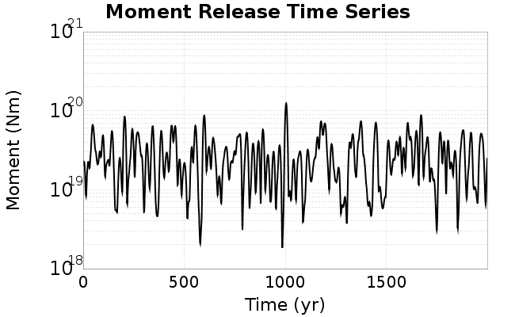

We then compute Welch's power spectral density estimate on the entire time series. Results are plotted below, with a Poisson randomization of the catalog also plotted in a gray line, and the 95% confidence bounds from 200 realizations as a light gray shaded area. Significant deviations outside the Poisson confidence intervals indicate synchronous behaviour.


## Input File
*[(top)](#mu0_5)*

```
  A_1 = 0.001
  fA = .1
  B_1 = 0.008
  muSlipAmp_1 = .0
  muSlipInvDist_1 = 1.0
  cohesion = 0.0
  Dc_1 = 1.0000000000000000818e-05
  mu0_1 = 0.5
  ddotStar_1 = 9.9999999999999995475e-07
  ddotAB_1 = 9.9999999999999995475e-07
  alpha_1 = 0.0
  theta0_1 = 200000000
  tau0_1 = 55.1
  sigma0_1 = 100
  sigmaFracPin = .5
  lowSigmaAction = 1
  maxThetaPin = 1.0e13
  ddotEQ_1 = 1
  ddotEQFname = 
  stressOvershootFactor = 0.10000000000000000555
  lameLambda = 30000
  lameMu = 30000
  slowSlip_1 = 0
  nEq = 100000000000
  KZeroFrac = 0
  muPin = 1.0
  tStart = 0
  maxT = 3.16e13
  maxWallTime = 169200
  maxTrans = 1.0000000000000000159e100
  faultFname = UCERF3FM.15km.1km.tri.flt
  outFnameInfix = mu0_5
  writeTau = 2
  writeSigma = 2
  writeSlip = 0
  writeSlipSpeed = 0
  writeState = 0
  writeTheta = 2
  writePED = 1
  writeTransitions = 1
  minDtWrite = 0
  minDtWriteCoseismic = 0
  minDtWriteInterseismic = 0
  minMagWrite = 7.7
  writeStiffness = 0
  stressRateSpecification = 1
  dMu3 = 0.01000000000000000
  initTauFname = 
  initSigmaFname = 
  initThetaFname = 
  initSlipSpeedFname = 
  AFname = 
  BFname =  
  DcFname = 
  mu0Fname = 
  ddotStarFname = 
  ddotABFname = 
  alphaFname = 
  KTauFname = /u/sciteam/gilchris/scratch/stiffness_25a589d/Ktau.25a589d.out
  KSigmaFname = /u/sciteam/gilchris/scratch/stiffness_25a589d/Ksigma.25a589d.out
  tFailFname = 
  tauFailFname = 
  tauDotFname = 
  sigmaDotFname =
  KZeroFname = UCERF3FM.15km.1km.tri.KZero
  pinnedFname =  UCERF3FM.15km.1km.tri.pin
  neighborFname = UCERF3FM.15km.1km.tri.neighbors
  stressRateFname =  
  slowSlipFname = 
  writePatchFname = 
  DEBUG = 0
  ZBrentUpperBracket = 0
  receiverElementAreaFrac = 0.8
  receiverElementIntTol = 1.0e-4
  receiverElementSubdivisionMax = 4
  tgfDist1 = 3
  tgfDist1 = 10
  lowSigmaAction = 1
  highSigmaAction = 0
```
