# mu0_7
## Metadata
| **Catalog** | mu0_7 |
|-----|-----|
| **Author** | Jaqcui Gilchrist, 2018/09/27 |
| **Description** | change mu0: mu0=0.7 |
| **Fault/Def Model** | Fault Model 3.1, Geologic |
| **Slip Velocity** | 1.0 m/s |
| **Average Element Area** | 1.35 km^2 |
| **Length** | 9,196,649 events in 456,339 years |
| **Frictional Params** | a=0.001, b=0.008, (b-a)=0.007, ddotEQ=1 |

* [Metadata](#metadata)
* [Plots](#plots)
  * [Magnitude-Frequency Plot](#magnitude-frequency-plot)
  * [Magnitude-Area Plots](#magnitude-area-plots)
  * [Slip-Area Plots](#slip-area-plots)
  * [Rupture Velocity Plots](#rupture-velocity-plots)
  * [Global Interevent-Time Distributions](#global-interevent-time-distributions)
  * [Normalized Fault Interevent-Time Distributions](#normalized-fault-interevent-time-distributions)
  * [Stationarity Plot](#stationarity-plot)
  * [Element/Subsection Interevent Time Comparisons](#elementsubsection-interevent-time-comparisons)
    * [Element Interevent Time Comparisons](#element-interevent-time-comparisons)
    * [Subsection Interevent Time Comparisons](#subsection-interevent-time-comparisons)
  * [Paleo Open Interval Plots](#paleo-open-interval-plots)
    * [Paleo Open Interval Plots, Biasi and Sharer 2019](#paleo-open-interval-plots-biasi-and-sharer-2019)
    * [Paleo Open Interval Plots, UCERF3](#paleo-open-interval-plots-ucerf3)
  * [Moment Release Variability Plots](#moment-release-variability-plots)
* [Input File](#input-file)

## Plots
### Magnitude-Frequency Plot
*[(top)](#mu0_7)*

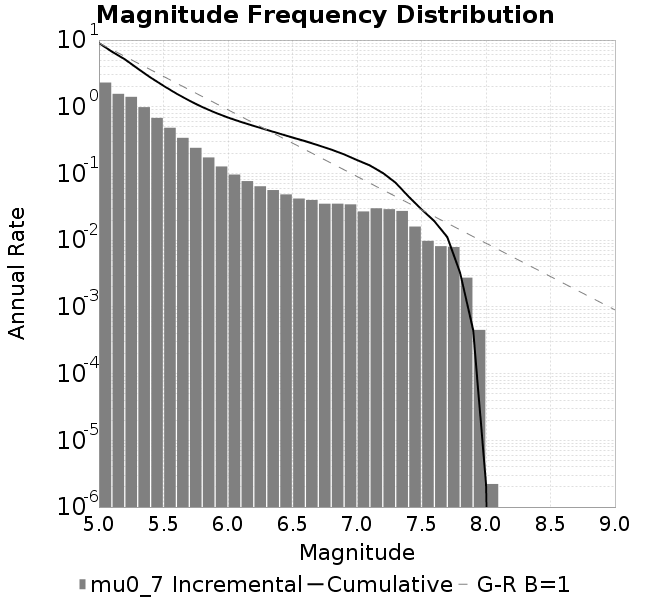
### Magnitude-Area Plots
*[(top)](#mu0_7)*

| Scatter | 2-D Hist |
|-----|-----|
| 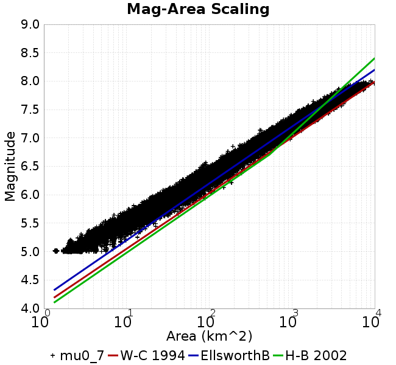 |  |
### Slip-Area Plots
*[(top)](#mu0_7)*

| Scatter | 2-D Hist |
|-----|-----|
| 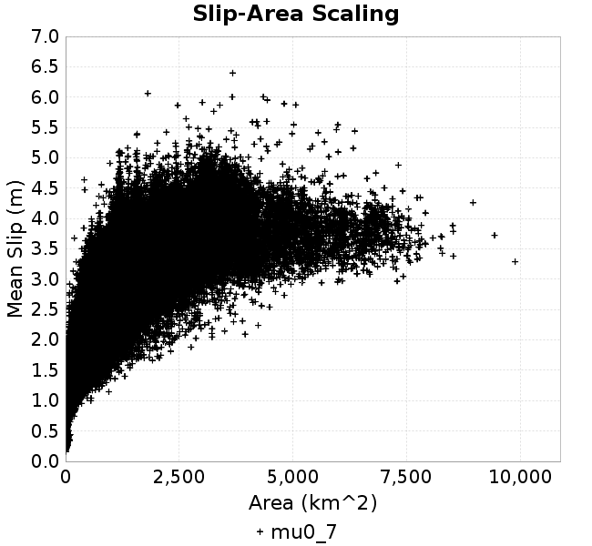 |  |
### Rupture Velocity Plots
*[(top)](#mu0_7)*

| **Scatter** |  |
|-----|-----|
| **Distance/Velocity** |  |
### Global Interevent-Time Distributions
*[(top)](#mu0_7)*

| **M≥6** | **M≥6.5** | **M≥7** | **M≥7.5** |
|-----|-----|-----|-----|
|  |  |  | 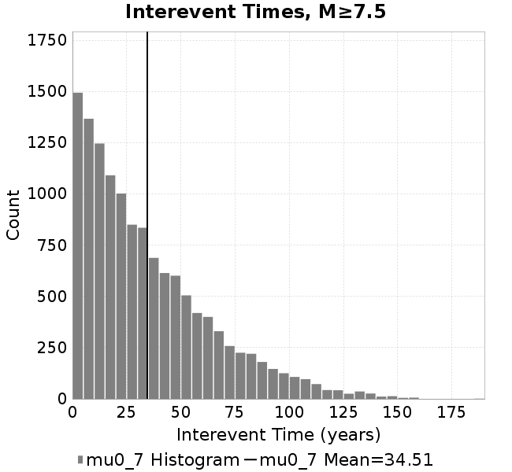 |
### Normalized Fault Interevent-Time Distributions
*[(top)](#mu0_7)*

|  | **M≥6** | **M≥6.5** | **M≥7** | **M≥7.5** |
|-----|-----|-----|-----|-----|
| **Elements** |  |  |  |  |
| **Subsections** |  | 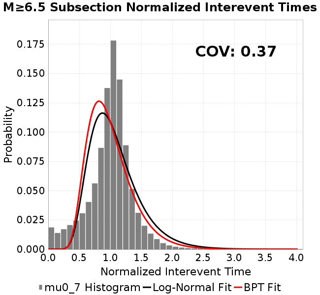 |  | 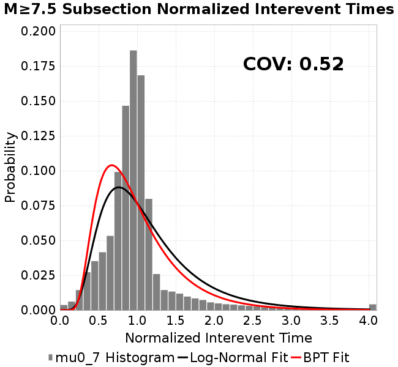 |
| **Sections** | 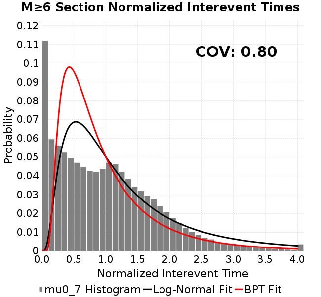 | 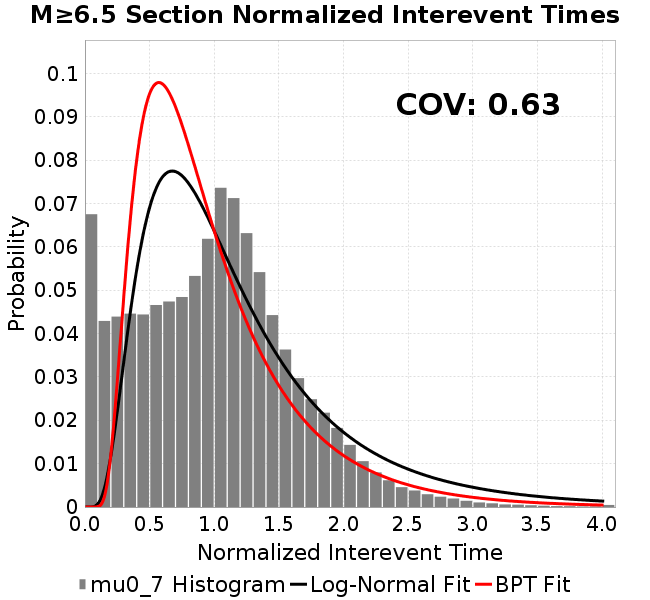 |  | 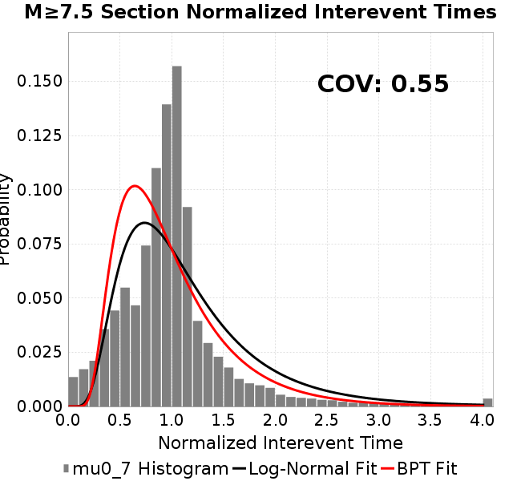 |
### Stationarity Plot
*[(top)](#mu0_7)*


### Element/Subsection Interevent Time Comparisons

#### Element Interevent Time Comparisons
*[(top)](#mu0_7)*

| Min Mag | Scatter | 2-D Hist |
|-----|-----|-----|
| **M≥6.0** | 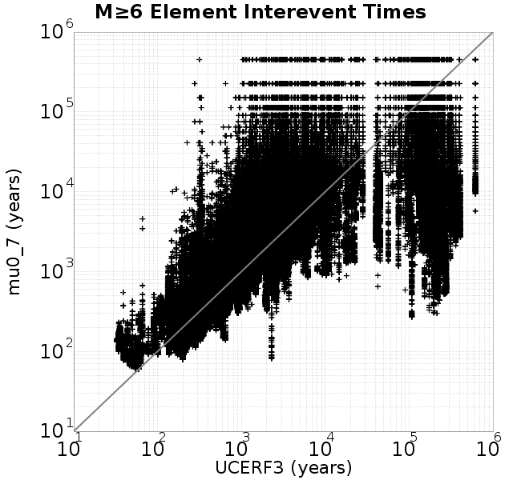 | 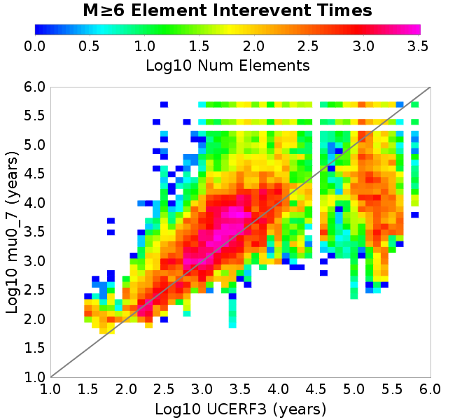 |
| **M≥6.5** | 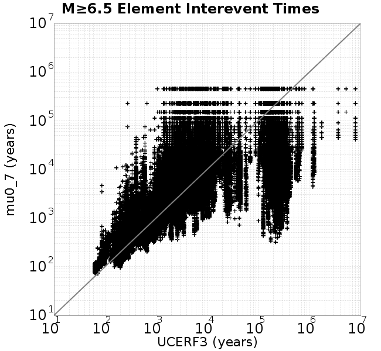 |  |
| **M≥7.0** |  |  |
| **M≥7.5** |  | 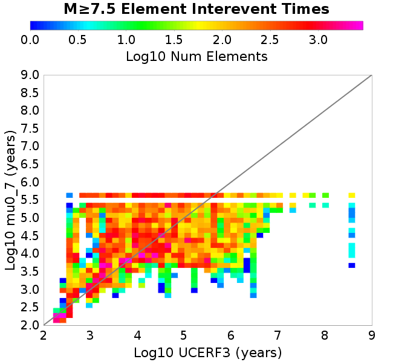 |

#### Subsection Interevent Time Comparisons
*[(top)](#mu0_7)*

*Subsections participate in a rupture if at least 20.0 % of its area ruptures*

| Min Mag | Scatter | 2-D Hist |
|-----|-----|-----|
| **M≥6.0** | 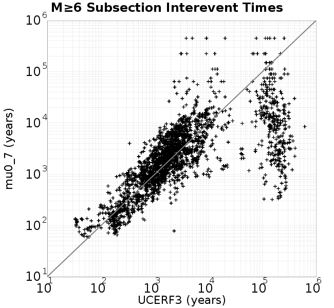 |  |
| **M≥6.5** | 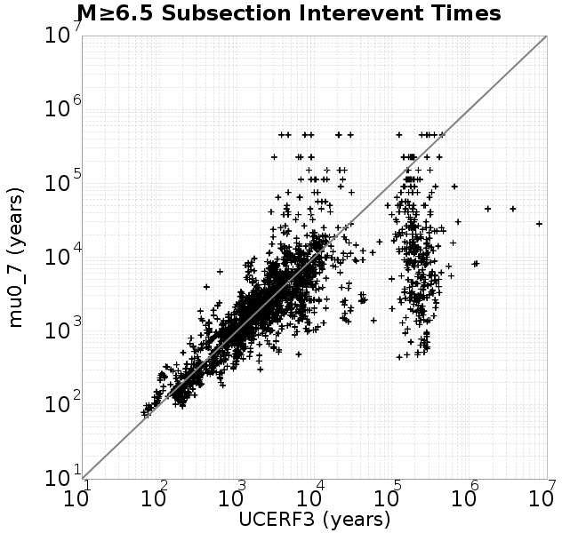 | 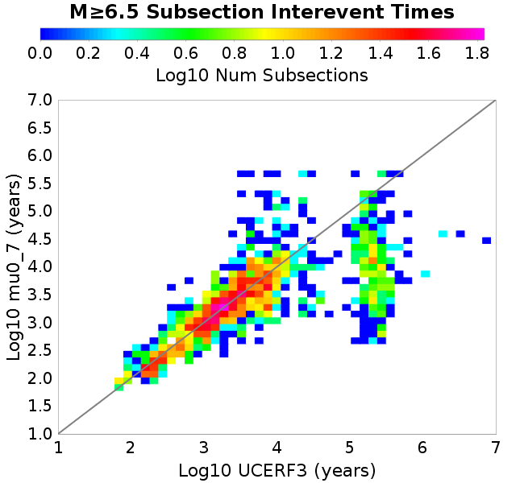 |
| **M≥7.0** |  |  |
| **M≥7.5** | 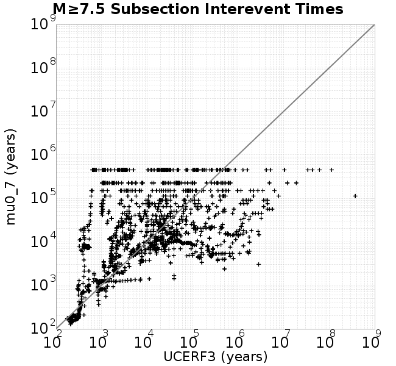 |  |

### Paleo Open Interval Plots
*[(top)](#mu0_7)*

#### Paleo Open Interval Plots, Biasi and Sharer 2019
*[(top)](#mu0_7)*

These plots use the 5 paleoseismic sites identified in Biasi & Scharer (2019) on the Hayward, N. SAF, S. SAF, and SJC faults. By default, a rupture is counted at a paleo site if the nearest element (at the surface) slips any amount. We also alternatively apply a probability of detection model. Those results are marked as 'Prob. Filtered'.

**Paleoseismic sites table:**

| **Site Name** | Data MRI (yr) | Data Annual Rate | Catalog MRI (yr) | Catalog Annual Rate | Catalog Occurences | Prob Filtered Catalog MRI (yr) | Prob Filtered Catalog Annual Rate | Prob Filtered Catalog Occurences |
|-----|-----|-----|-----|-----|-----|-----|-----|-----|
| **HOG** | 191.00 | 0.005235602 | 333.78 | 0.0029959604 | 1352 | 339.73 | 0.0029434764 | 1328.31 |
| **FRA** | 119.00 | 0.008403362 | 101.76 | 0.009827112 | 4435 | 109.90 | 0.009099442 | 4106.65 |
| **COA** | 181.00 | 0.005524862 | 176.34 | 0.005670951 | 2560 | 188.47 | 0.0053059626 | 2395.3 |
| **SCZ** | 106.00 | 0.009433962 | 129.24 | 0.0077376594 | 3493 | 147.43 | 0.0067830035 | 3062 |
| **TYS** | 329.00 | 0.0030395137 | 349.22 | 0.0028635333 | 1293 | 389.35 | 0.0025683676 | 1159.74 |
| **TOTAL** | 31.61 | 0.0316373 | 34.37 | 0.029095992 | 13132 | 37.46 | 0.02669255 | 12047.04 |

**Paleoseismic Plots:**

|  |  |
|-----|-----|

**Open interval probabilities table:**

| **Open Interval (yr)** | Catalog Probability | Catalog Poisson Probability | Prob. Filtered Catalog Probability | Prob. Filtered Catalog Poisson Probability | Data Poisson Probability |
|-----|-----|-----|-----|-----|-----|
| **10.00** | 0.97000766 | 0.74754566 | 0.97462654 | 0.7657301 | 0.72878754 |
| **20.00** | 0.89570844 | 0.5588245 | 0.9106633 | 0.5863426 | 0.53113127 |
| **30.00** | 0.79184264 | 0.4177468 | 0.8181408 | 0.44898018 | 0.3870819 |
| **40.00** | 0.66695654 | 0.3122848 | 0.7062182 | 0.34379765 | 0.28210047 |
| **50.00** | 0.53468895 | 0.23344715 | 0.58521813 | 0.2632562 | 0.2055913 |
| **60.00** | 0.4221432 | 0.1745124 | 0.47774538 | 0.2015832 | 0.14983238 |
| **70.00** | 0.3184917 | 0.13045599 | 0.3761892 | 0.15435833 | 0.10919597 |
| **80.00** | 0.23074588 | 0.097521804 | 0.28762746 | 0.118196815 | 0.079580665 |
| **90.00** | 0.1583484 | 0.072901994 | 0.20878904 | 0.09050686 | 0.057997398 |
| **100.00** | 0.10339113 | 0.05449757 | 0.14628257 | 0.069303825 | 0.04226778 |
| **110.00** | 0.061188 | 0.04073942 | 0.09495114 | 0.053068027 | 0.030804234 |
| **120.00** | 0.033073865 | 0.030454576 | 0.05822962 | 0.040635787 | 0.022449743 |
| **130.00** | 0.017662505 | 0.022766186 | 0.034835584 | 0.031116046 | 0.016361093 |
| **140.00** | 0.0073342593 | 0.017018763 | 0.018360674 | 0.023826493 | 0.011923761 |
| **150.00** | 0.004655092 | 0.012722302 | 0.0105902245 | 0.018244663 | 0.008689889 |
| **160.00** | 0.0021469416 | 0.009510501 | 0.0052042915 | 0.013970488 | 0.0063330824 |
| **170.00** | 9.738501E-4 | 0.007109534 | 0.0026108657 | 0.010697623 | 0.0046154717 |
| **180.00** | 0.0 | 0.0053147012 | 9.294631E-4 | 0.0081914915 | 0.0033636983 |
| **190.00** | 0.0 | 0.0039729816 | 3.1597613E-4 | 0.006272472 | 0.0024514215 |
| **200.00** | 0.0 | 0.0029699851 | 1.3748635E-4 | 0.0048030205 | 0.0017865654 |
| **210.00** | 0.0 | 0.0022201994 | 7.6993616E-5 | 0.0036778175 | 0.0013020267 |
| **220.00** | 0.0 | 0.0016597004 | 3.3834E-5 | 0.0028162156 | 9.489008E-4 |
| **230.00** | 0.0 | 0.0012407019 | 1.5793843E-5 | 0.0021564611 | 6.915471E-4 |
| **240.00** | 0.0 | 9.274813E-4 | 0.0 | 0.0016512672 | 5.039909E-4 |

#### Paleo Open Interval Plots, UCERF3
*[(top)](#mu0_7)*

These plots use the full set of UCERF3 paleoseismic sites. By default, a rupture is counted at a paleo site if the nearest element (at the surface) slips any amount. We also alternativeslyapply a probability of detection model. Those results are marked as 'Prob. Filtered'.

**Paleoseismic sites table:**

| **Site Name** | Data MRI (yr) | Data Annual Rate | Catalog MRI (yr) | Catalog Annual Rate | Catalog Occurences | Prob Filtered Catalog MRI (yr) | Prob Filtered Catalog Annual Rate | Prob Filtered Catalog Occurences |
|-----|-----|-----|-----|-----|-----|-----|-----|-----|
| **SSanAndreasBurroFlats** | 205.44 | 0.0048677 | 224.50 | 0.004454378 | 2011 | 250.27 | 0.0039957445 | 1803.9 |
| **SSanAndreasIndio** | 277.37 | 0.0036053 | 173.42 | 0.0057662423 | 2603 | 184.15 | 0.0054304875 | 2451.44 |
| **SSAFMCreek1000Palms** | 261.33 | 0.0038266 | 1571.23 | 6.364453E-4 | 286 | 2281.55 | 4.382979E-4 | 196.72 |
| **NSanAndreasFortRoss** | 306.28 | 0.003265 | 197.74 | 0.005057244 | 2282 | 200.53 | 0.00498682 | 2250.16 |
| **NSanAndreasNorthCoast** | 263.87 | 0.0037898 | 191.41 | 0.0052242917 | 2357 | 195.78 | 0.005107843 | 2304.47 |
| **CalaverasfaultNorth** | 618.05 | 0.001618 | 174.99 | 0.0057146875 | 2578 | 247.05 | 0.0040477877 | 1826.02 |
| **ElsinoreTemecula** | 1019.16 | 9.812E-4 | 727.67 | 0.0013742436 | 620 | 751.35 | 0.0013309368 | 600.46 |
| **ElsinoreWhittier** | 3196.93 | 3.128E-4 | 1600.40 | 6.248445E-4 | 282 | 1686.51 | 5.929412E-4 | 267.59 |
| **SSAFCarrizoBidart** | 114.71 | 0.0087179 | 123.27 | 0.008112129 | 3662 | 126.84 | 0.007883696 | 3558.88 |
| **SanJacintoHogLake** | 311.78 | 0.0032074 | 333.78 | 0.0029959604 | 1352 | 339.64 | 0.00294427 | 1328.68 |
| **PuenteHills** | 3506.31 | 2.852E-4 | 5127.25 | 1.9503625E-4 | 87 | 5599.33 | 1.785927E-4 | 79.69 |
| **SanGregorioNorth** | 1019.06 | 9.813E-4 | 389.78 | 0.002565533 | 1158 | 401.44 | 0.0024910201 | 1124.36 |
| **SanJacintoSuperstition** | 508.26 | 0.0019675 | 1097.16 | 9.114424E-4 | 412 | 1203.70 | 8.3077303E-4 | 375.51 |
| **SSanAndreasWrightwood** | 106.04 | 0.0094304 | 174.68 | 0.005724725 | 2584 | 176.75 | 0.0056577707 | 2553.77 |
| **SSanAndreasPitmanCanyon** | 173.48 | 0.0057643 | 164.31 | 0.006085983 | 2747 | 176.64 | 0.0056613637 | 2555.27 |
| **SSanAndreasPlungeCreek** | 205.36 | 0.0048695 | 366.93 | 0.0027253435 | 1230 | 448.56 | 0.0022293557 | 1005.99 |
| **FrazierMountianSSAF** | 148.57 | 0.0067307 | 101.76 | 0.009827112 | 4435 | 109.92 | 0.009097406 | 4105.71 |
| **NSanAndreasSantaCruzSeg** | 109.84 | 0.0091041 | 129.24 | 0.0077376594 | 3493 | 147.38 | 0.006785089 | 3062.94 |
| **RodgersCreek** | 325.31 | 0.003074 | 167.06 | 0.0059860363 | 2701 | 230.84 | 0.004332064 | 1954.56 |
| **GreenValleyMasonRoad** | 293.31 | 0.0034094 | 1861.72 | 5.371373E-4 | 243 | 2464.21 | 4.0580952E-4 | 183.19 |
| **HaywardfaultNorth** | 318.34 | 0.0031413 | 377.60 | 0.0026483296 | 1196 | 387.99 | 0.0025773856 | 1163.95 |
| **HaywardfaultSouth** | 167.57 | 0.0059677 | 349.22 | 0.0028635333 | 1293 | 389.91 | 0.0025647206 | 1158.03 |
| **Compton** | 2658.16 | 3.762E-4 | 6684.44 | 1.4960114E-4 | 66 | 7271.32 | 1.3752659E-4 | 60.57 |
| **SSanAndreasCoachella** | 178.45 | 0.0056037 | 176.34 | 0.005670951 | 2560 | 188.39 | 0.0053080227 | 2396.18 |
| **ElsinoreGlenIvy** | 179.12 | 0.0055828 | 680.41 | 0.001469708 | 663 | 722.23 | 0.0013846045 | 624.66 |
| **GarlockCentralallevents** | 1434.93 | 6.969E-4 | 720.78 | 0.0013873797 | 626 | 730.24 | 0.0013694149 | 617.89 |
| **NSanAndreasAlderCreek** | 869.64 | 0.0011499 | 198.17 | 0.0050461586 | 2277 | 200.90 | 0.004977593 | 2246.03 |
| **SSanAndreasPallettCreek** | 149.30 | 0.006698 | 175.70 | 0.0056914804 | 2569 | 177.55 | 0.0056320615 | 2542.18 |
| **GarlockWesternallevents** | 1230.16 | 8.129E-4 | 843.07 | 0.0011861344 | 536 | 866.04 | 0.0011546857 | 521.76 |
| **ElsinoreFaultJulian** | 3250.98 | 3.076E-4 | 1149.49 | 8.6995086E-4 | 393 | 1186.38 | 8.429017E-4 | 380.76 |
| **TOTAL** | 9.08 | 0.1101451 | 14.29 | 0.06997521 | 31583 | 15.78 | 0.0633541 | 28594.66 |

**Paleoseismic Plots:**

|  |  |
|-----|-----|

**Open interval probabilities table:**

| **Open Interval (yr)** | Catalog Probability | Catalog Poisson Probability | Prob. Filtered Catalog Probability | Prob. Filtered Catalog Poisson Probability | Data Poisson Probability |
|-----|-----|-----|-----|-----|-----|
| **10.00** | 0.8537873 | 0.4967084 | 0.87505037 | 0.53070927 | 0.33238843 |
| **20.00** | 0.59969455 | 0.24671924 | 0.6461159 | 0.28165233 | 0.110482074 |
| **30.00** | 0.3714332 | 0.12254752 | 0.42469338 | 0.1494755 | 0.036722966 |
| **40.00** | 0.20544767 | 0.060870383 | 0.25393915 | 0.07932803 | 0.012206289 |
| **50.00** | 0.09741635 | 0.03023483 | 0.13494162 | 0.04210012 | 0.004057229 |
| **60.00** | 0.043670334 | 0.015017894 | 0.0690273 | 0.022342924 | 0.001348576 |
| **70.00** | 0.01718224 | 0.0074595143 | 0.032011304 | 0.011857596 | 4.4825108E-4 |
| **80.00** | 0.0065634777 | 0.0037052035 | 0.013493735 | 0.006292936 | 1.4899348E-4 |
| **90.00** | 0.0015751807 | 0.0018404056 | 0.0039880355 | 0.0033397195 | 4.952371E-5 |
| **100.00** | 3.9803464E-4 | 9.1414497E-4 | 0.0011501294 | 0.00177242 | 1.6461108E-5 |
| **110.00** | 0.0 | 4.540635E-4 | 4.2798684E-4 | 9.4063976E-4 | 5.4714824E-6 |
| **120.00** | 0.0 | 2.2553715E-4 | 1.1728607E-4 | 4.9920625E-4 | 1.8186574E-6 |
| **130.00** | 0.0 | 1.12026195E-4 | 6.68726E-5 | 2.6493336E-4 | 6.045007E-7 |
| **140.00** | 0.0 | 5.5644356E-5 | 1.5615307E-5 | 1.4060258E-4 | 2.0092905E-7 |
| **150.00** | 0.0 | 2.7639018E-5 | 0.0 | 7.461909E-5 | 6.678649E-8 |

### Moment Release Variability Plots
*[(top)](#mu0_7)*

We first create a tapered moment release time series for the entire catalog. Each event's moment is distributed across a 25 year Hanning (cosine) taper. Here is a plot of a random 2,000 year section of this time series:


We then compute Welch's power spectral density estimate on the entire time series. Results are plotted below, with a Poisson randomization of the catalog also plotted in gray as a control. Significant deviations above the Poisson model indicate synchronization at that period.

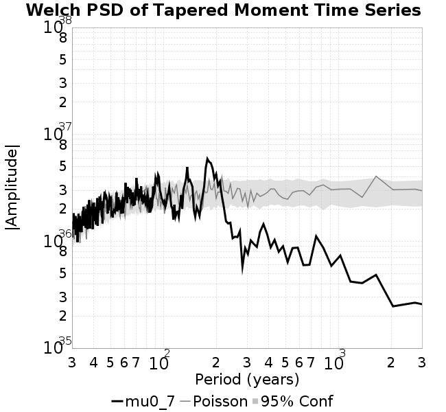

## Input File
*[(top)](#mu0_7)*

```
  A_1 = 0.001
  fA = .1
  B_1 = 0.008
  muSlipAmp_1 = .0
  muSlipInvDist_1 = 1.0
  cohesion = 0.0
  Dc_1 = 1.0000000000000000818e-05
  mu0_1 = 0.7
  ddotStar_1 = 9.9999999999999995475e-07
  ddotAB_1 = 9.9999999999999995475e-07
  alpha_1 = 0.0
  theta0_1 = 200000000
  tau0_1 = 55.1
  sigma0_1 = 100
  sigmaFracPin = .5
  lowSigmaAction = 1
  maxThetaPin = 1.0e13
  ddotEQ_1 = 1
  ddotEQFname = 
  stressOvershootFactor = 0.10000000000000000555
  lameLambda = 30000
  lameMu = 30000
  slowSlip_1 = 0
  nEq = 100000000000
  KZeroFrac = 0
  muPin = 1.0
  tStart = 0
  maxT = 3.16e13
  maxWallTime = 169200
  maxTrans = 1.0000000000000000159e100
  faultFname = UCERF3FM.15km.1km.tri.flt
  outFnameInfix = mu0_7
  writeTau = 2
  writeSigma = 2
  writeSlip = 0
  writeSlipSpeed = 0
  writeState = 0
  writeTheta = 2
  writePED = 1
  writeTransitions = 1
  minDtWrite = 0
  minDtWriteCoseismic = 0
  minDtWriteInterseismic = 0
  minMagWrite = 7.7
  writeStiffness = 0
  stressRateSpecification = 1
  dMu3 = 0.01000000000000000
  initTauFname = 
  initSigmaFname = 
  initThetaFname = 
  initSlipSpeedFname = 
  AFname = 
  BFname =  
  DcFname = 
  mu0Fname = 
  ddotStarFname = 
  ddotABFname = 
  alphaFname = 
  KTauFname = /u/sciteam/gilchris/scratch/stiffness_25a589d/Ktau.25a589d.out
  KSigmaFname = /u/sciteam/gilchris/scratch/stiffness_25a589d/Ksigma.25a589d.out
  tFailFname = 
  tauFailFname = 
  tauDotFname = 
  sigmaDotFname =
  KZeroFname = UCERF3FM.15km.1km.tri.KZero
  pinnedFname =  UCERF3FM.15km.1km.tri.pin
  neighborFname = UCERF3FM.15km.1km.tri.neighbors
  stressRateFname =  
  slowSlipFname = 
  writePatchFname = 
  DEBUG = 0
  ZBrentUpperBracket = 0
  receiverElementAreaFrac = 0.8
  receiverElementIntTol = 1.0e-4
  receiverElementSubdivisionMax = 4
  tgfDist1 = 3
  tgfDist1 = 10
  lowSigmaAction = 1
  highSigmaAction = 0
```
