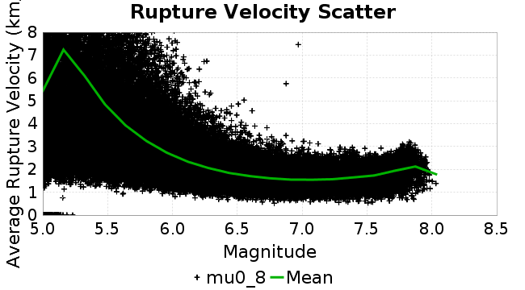
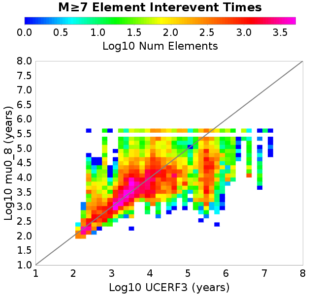
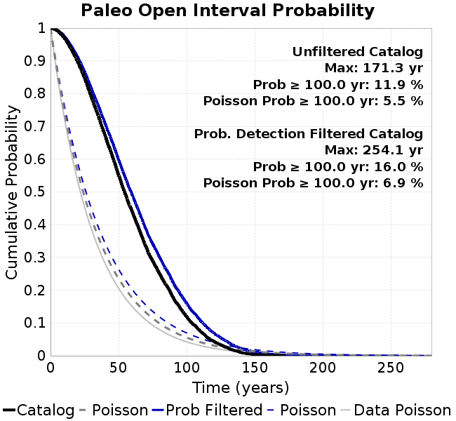

# mu0_8
## Metadata
| **Catalog** | mu0_8 |
|-----|-----|
| **Author** | Jaqcui Gilchrist, 2018/09/27 |
| **Description** | change mu0: mu0=0.8 |
| **Fault/Def Model** | Fault Model 3.1, Geologic |
| **Slip Velocity** | 1.0 m/s |
| **Average Element Area** | 1.35 km^2 |
| **Length** | 9,666,484 events in 458,737 years |
| **Frictional Params** | a=0.001, b=0.008, (b-a)=0.007, ddotEQ=1 |

* [Metadata](#metadata)
* [Plots](#plots)
  * [Magnitude-Frequency Plot](#magnitude-frequency-plot)
  * [Magnitude-Area Plots](#magnitude-area-plots)
  * [Slip-Area Plots](#slip-area-plots)
  * [Rupture Velocity Plots](#rupture-velocity-plots)
  * [Global Interevent-Time Distributions](#global-interevent-time-distributions)
  * [Normalized Fault Interevent-Time Distributions](#normalized-fault-interevent-time-distributions)
  * [Stationarity Plot](#stationarity-plot)
  * [Element/Subsection Interevent Time Comparisons](#elementsubsection-interevent-time-comparisons)
    * [Element Interevent Time Comparisons](#element-interevent-time-comparisons)
    * [Subsection Interevent Time Comparisons](#subsection-interevent-time-comparisons)
  * [Paleo Open Interval Plots](#paleo-open-interval-plots)
    * [Paleo Open Interval Plots, Biasi and Sharer 2019](#paleo-open-interval-plots-biasi-and-sharer-2019)
    * [Paleo Open Interval Plots, UCERF3](#paleo-open-interval-plots-ucerf3)
  * [Moment Release Variability Plots](#moment-release-variability-plots)
* [Input File](#input-file)

## Plots
### Magnitude-Frequency Plot
*[(top)](#mu0_8)*


### Magnitude-Area Plots
*[(top)](#mu0_8)*

| Scatter | 2-D Hist |
|-----|-----|
|  |  |
### Slip-Area Plots
*[(top)](#mu0_8)*

| Scatter | 2-D Hist |
|-----|-----|
|  |  |
### Rupture Velocity Plots
*[(top)](#mu0_8)*

| **Scatter** |  |
|-----|-----|
| **Distance/Velocity** |  |
### Global Interevent-Time Distributions
*[(top)](#mu0_8)*

| **M≥6** | **M≥6.5** | **M≥7** | **M≥7.5** |
|-----|-----|-----|-----|
|  |  |  |  |
### Normalized Fault Interevent-Time Distributions
*[(top)](#mu0_8)*

|  | **M≥6** | **M≥6.5** | **M≥7** | **M≥7.5** |
|-----|-----|-----|-----|-----|
| **Elements** |  |  |  |  |
| **Subsections** |  |  |  |  |
| **Sections** |  |  |  |  |
### Stationarity Plot
*[(top)](#mu0_8)*


### Element/Subsection Interevent Time Comparisons

#### Element Interevent Time Comparisons
*[(top)](#mu0_8)*

| Min Mag | Scatter | 2-D Hist |
|-----|-----|-----|
| **M≥6.0** |  |  |
| **M≥6.5** |  |  |
| **M≥7.0** |  |  |
| **M≥7.5** |  |  |

#### Subsection Interevent Time Comparisons
*[(top)](#mu0_8)*

*Subsections participate in a rupture if at least 20.0 % of its area ruptures*

| Min Mag | Scatter | 2-D Hist |
|-----|-----|-----|
| **M≥6.0** |  |  |
| **M≥6.5** |  |  |
| **M≥7.0** |  |  |
| **M≥7.5** |  |  |

### Paleo Open Interval Plots
*[(top)](#mu0_8)*

#### Paleo Open Interval Plots, Biasi and Sharer 2019
*[(top)](#mu0_8)*

These plots use the 5 paleoseismic sites identified in Biasi & Scharer (2019) on the Hayward, N. SAF, S. SAF, and SJC faults. By default, a rupture is counted at a paleo site if the nearest element (at the surface) slips any amount. We also alternatively apply a probability of detection model. Those results are marked as 'Prob. Filtered'.

**Paleoseismic sites table:**

| **Site Name** | Data MRI (yr) | Data Annual Rate | Catalog MRI (yr) | Catalog Annual Rate | Catalog Occurences | Prob Filtered Catalog MRI (yr) | Prob Filtered Catalog Annual Rate | Prob Filtered Catalog Occurences |
|-----|-----|-----|-----|-----|-----|-----|-----|-----|
| **HOG** | 191.00 | 0.005235602 | 310.22 | 0.0032234879 | 1462 | 318.30 | 0.003141657 | 1424.9 |
| **FRA** | 119.00 | 0.008403362 | 98.88 | 0.010113355 | 4588 | 106.93 | 0.009351801 | 4242.41 |
| **COA** | 181.00 | 0.005524862 | 176.55 | 0.005663989 | 2570 | 188.69 | 0.0052996282 | 2404.55 |
| **SCZ** | 106.00 | 0.009433962 | 140.92 | 0.0070964536 | 3220 | 157.49 | 0.006349569 | 2881.01 |
| **TYS** | 329.00 | 0.0030395137 | 349.78 | 0.002858973 | 1297 | 391.72 | 0.0025528397 | 1158.16 |
| **TOTAL** | 31.61 | 0.0316373 | 34.54 | 0.028949238 | 13134 | 37.48 | 0.026681207 | 12104.76 |

**Paleoseismic Plots:**

|  |  |
|-----|-----|

**Open interval probabilities table:**

| **Open Interval (yr)** | Catalog Probability | Catalog Poisson Probability | Prob. Filtered Catalog Probability | Prob. Filtered Catalog Poisson Probability | Data Poisson Probability |
|-----|-----|-----|-----|-----|-----|
| **10.00** | 0.9710233 | 0.7486435 | 0.975132 | 0.765817 | 0.72878754 |
| **20.00** | 0.89729625 | 0.56046706 | 0.910677 | 0.5864757 | 0.53113127 |
| **30.00** | 0.7901156 | 0.41959003 | 0.8158024 | 0.449133 | 0.3870819 |
| **40.00** | 0.6724516 | 0.31412333 | 0.7093729 | 0.34395367 | 0.28210047 |
| **50.00** | 0.5506578 | 0.23516639 | 0.59733486 | 0.26340556 | 0.2055913 |
| **60.00** | 0.43928775 | 0.17605579 | 0.49056306 | 0.20172046 | 0.14983238 |
| **70.00** | 0.33356696 | 0.13180302 | 0.3865181 | 0.15448095 | 0.10919597 |
| **80.00** | 0.25050595 | 0.09867347 | 0.30102816 | 0.11830413 | 0.079580665 |
| **90.00** | 0.17840593 | 0.073871255 | 0.22397436 | 0.09059931 | 0.057997398 |
| **100.00** | 0.11929731 | 0.05530323 | 0.15988125 | 0.069382496 | 0.04226778 |
| **110.00** | 0.07431924 | 0.041402403 | 0.10714736 | 0.053134292 | 0.030804234 |
| **120.00** | 0.04372944 | 0.03099564 | 0.06960335 | 0.04069114 | 0.022449743 |
| **130.00** | 0.024611041 | 0.023204684 | 0.042703245 | 0.031161968 | 0.016361093 |
| **140.00** | 0.009434404 | 0.017372036 | 0.021877578 | 0.023864364 | 0.011923761 |
| **150.00** | 0.0039466186 | 0.013005462 | 0.011754208 | 0.018275736 | 0.008689889 |
| **160.00** | 0.0018259516 | 0.009736454 | 0.0059045698 | 0.013995868 | 0.0063330824 |
| **170.00** | 8.04754E-4 | 0.007289133 | 0.0028636733 | 0.010718274 | 0.0046154717 |
| **180.00** | 0.0 | 0.005456962 | 0.0010878684 | 0.008208236 | 0.0033636983 |
| **190.00** | 0.0 | 0.004085319 | 2.137837E-4 | 0.0062860064 | 0.0024514215 |
| **200.00** | 0.0 | 0.0030584475 | 8.754236E-5 | 0.0048139305 | 0.0017865654 |
| **210.00** | 0.0 | 0.0022896868 | 6.183262E-5 | 0.0036865897 | 0.0013020267 |
| **220.00** | 0.0 | 0.0017141592 | 4.374449E-5 | 0.002823253 | 9.489008E-4 |
| **230.00** | 0.0 | 0.001283294 | 2.1331914E-5 | 0.002162095 | 6.915471E-4 |
| **240.00** | 0.0 | 9.607297E-4 | 1.840435E-5 | 0.0016557691 | 5.039909E-4 |
| **250.00** | 0.0 | 7.1924407E-4 | 9.9081335E-6 | 0.001268016 | 3.673023E-4 |
| **260.00** | 0.0 | 5.3845736E-4 | 0.0 | 9.710682E-4 | 2.6768536E-4 |

#### Paleo Open Interval Plots, UCERF3
*[(top)](#mu0_8)*

These plots use the full set of UCERF3 paleoseismic sites. By default, a rupture is counted at a paleo site if the nearest element (at the surface) slips any amount. We also alternativeslyapply a probability of detection model. Those results are marked as 'Prob. Filtered'.

**Paleoseismic sites table:**

| **Site Name** | Data MRI (yr) | Data Annual Rate | Catalog MRI (yr) | Catalog Annual Rate | Catalog Occurences | Prob Filtered Catalog MRI (yr) | Prob Filtered Catalog Annual Rate | Prob Filtered Catalog Occurences |
|-----|-----|-----|-----|-----|-----|-----|-----|-----|
| **SSanAndreasBurroFlats** | 205.44 | 0.0048677 | 234.61 | 0.0042624236 | 1933 | 259.83 | 0.0038486472 | 1745.39 |
| **SSanAndreasIndio** | 277.37 | 0.0036053 | 173.51 | 0.0057632024 | 2615 | 184.24 | 0.0054276926 | 2462.66 |
| **SSAFMCreek1000Palms** | 261.33 | 0.0038266 | 1452.35 | 6.885415E-4 | 312 | 2195.52 | 4.5547215E-4 | 206.12 |
| **NSanAndreasFortRoss** | 306.28 | 0.003265 | 205.09 | 0.0048759286 | 2212 | 207.73 | 0.004813941 | 2183.87 |
| **NSanAndreasNorthCoast** | 263.87 | 0.0037898 | 203.80 | 0.004906803 | 2226 | 207.29 | 0.004824152 | 2188.49 |
| **CalaverasfaultNorth** | 618.05 | 0.001618 | 160.84 | 0.006217338 | 2821 | 233.55 | 0.0042817374 | 1942.56 |
| **ElsinoreTemecula** | 1019.16 | 9.812E-4 | 818.45 | 0.0012218251 | 555 | 840.63 | 0.0011895882 | 540.33 |
| **ElsinoreWhittier** | 3196.93 | 3.128E-4 | 1727.07 | 5.790163E-4 | 259 | 1809.67 | 5.525872E-4 | 247.12 |
| **SSAFCarrizoBidart** | 114.71 | 0.0087179 | 129.76 | 0.007706745 | 3496 | 133.16 | 0.0075095673 | 3406.58 |
| **SanJacintoHogLake** | 311.78 | 0.0032074 | 310.22 | 0.0032234879 | 1462 | 318.08 | 0.003143866 | 1425.9 |
| **PuenteHills** | 3506.31 | 2.852E-4 | 5151.76 | 1.9410836E-4 | 85 | 5650.25 | 1.7698342E-4 | 77.2 |
| **SanGregorioNorth** | 1019.06 | 9.813E-4 | 389.96 | 0.002564355 | 1163 | 400.98 | 0.0024939156 | 1131.07 |
| **SanJacintoSuperstition** | 508.26 | 0.0019675 | 1073.13 | 9.3185646E-4 | 422 | 1168.03 | 8.56146E-4 | 387.61 |
| **SSanAndreasWrightwood** | 106.04 | 0.0094304 | 170.25 | 0.005873637 | 2665 | 173.03 | 0.0057793157 | 2622.18 |
| **SSanAndreasPitmanCanyon** | 173.48 | 0.0057643 | 170.85 | 0.0058530592 | 2655 | 184.33 | 0.005425145 | 2460.86 |
| **SSanAndreasPlungeCreek** | 205.36 | 0.0048695 | 392.62 | 0.0025470008 | 1156 | 469.66 | 0.0021292039 | 966.4 |
| **FrazierMountianSSAF** | 148.57 | 0.0067307 | 98.88 | 0.010113355 | 4588 | 106.97 | 0.009348755 | 4241.06 |
| **NSanAndreasSantaCruzSeg** | 109.84 | 0.0091041 | 140.92 | 0.0070964536 | 3220 | 157.48 | 0.0063501974 | 2881.27 |
| **RodgersCreek** | 325.31 | 0.003074 | 168.02 | 0.0059516863 | 2700 | 232.31 | 0.004304503 | 1952.62 |
| **GreenValleyMasonRoad** | 293.31 | 0.0034094 | 1947.15 | 5.135722E-4 | 233 | 2520.69 | 3.9671626E-4 | 179.69 |
| **HaywardfaultNorth** | 318.34 | 0.0031413 | 368.93 | 0.0027105322 | 1229 | 381.56 | 0.0026207988 | 1188.31 |
| **HaywardfaultSouth** | 167.57 | 0.0059677 | 349.78 | 0.002858973 | 1297 | 392.36 | 0.0025486627 | 1156.25 |
| **Compton** | 2658.16 | 3.762E-4 | 6979.81 | 1.4327046E-4 | 63 | 7528.93 | 1.3282099E-4 | 58.27 |
| **SSanAndreasCoachella** | 178.45 | 0.0056037 | 176.55 | 0.005663989 | 2570 | 188.51 | 0.0053048218 | 2406.93 |
| **ElsinoreGlenIvy** | 179.12 | 0.0055828 | 758.91 | 0.0013176752 | 598 | 782.98 | 0.0012771661 | 579.58 |
| **GarlockCentralallevents** | 1434.93 | 6.969E-4 | 725.23 | 0.0013788652 | 625 | 736.93 | 0.0013569901 | 615.07 |
| **NSanAndreasAlderCreek** | 869.64 | 0.0011499 | 199.14 | 0.0050214785 | 2278 | 202.92 | 0.004928128 | 2235.67 |
| **SSanAndreasPallettCreek** | 149.30 | 0.006698 | 173.84 | 0.0057523716 | 2610 | 175.74 | 0.0056901663 | 2581.78 |
| **GarlockWesternallevents** | 1230.16 | 8.129E-4 | 867.22 | 0.0011531097 | 523 | 894.26 | 0.0011182443 | 507.17 |
| **ElsinoreFaultJulian** | 3250.98 | 3.076E-4 | 1209.13 | 8.270418E-4 | 376 | 1240.58 | 8.060761E-4 | 366.46 |
| **TOTAL** | 9.08 | 0.1101451 | 13.88 | 0.07202992 | 32683 | 15.34 | 0.0652024 | 29585 |

**Paleoseismic Plots:**

|  |  |
|-----|-----|

**Open interval probabilities table:**

| **Open Interval (yr)** | Catalog Probability | Catalog Poisson Probability | Prob. Filtered Catalog Probability | Prob. Filtered Catalog Poisson Probability | Data Poisson Probability |
|-----|-----|-----|-----|-----|-----|
| **10.00** | 0.85064626 | 0.48660666 | 0.8722884 | 0.5209902 | 0.33238843 |
| **20.00** | 0.58826315 | 0.23678604 | 0.6354202 | 0.2714308 | 0.110482074 |
| **30.00** | 0.35745183 | 0.11522166 | 0.41230097 | 0.14141278 | 0.036722966 |
| **40.00** | 0.19472265 | 0.056067623 | 0.24489054 | 0.07367468 | 0.012206289 |
| **50.00** | 0.099083 | 0.027282879 | 0.13652264 | 0.038383786 | 0.004057229 |
| **60.00** | 0.04522053 | 0.01327603 | 0.07031915 | 0.019997576 | 0.001348576 |
| **70.00** | 0.016993804 | 0.0064602047 | 0.03172482 | 0.010418541 | 4.4825108E-4 |
| **80.00** | 0.0058890833 | 0.0031435785 | 0.013241562 | 0.005427958 | 1.4899348E-4 |
| **90.00** | 0.002044124 | 0.0015296863 | 0.005049762 | 0.0028279128 | 4.952371E-5 |
| **100.00** | 4.2496395E-4 | 7.443555E-4 | 0.0015626891 | 0.001473315 | 1.6461108E-5 |
| **110.00** | 3.0002516E-4 | 3.6220835E-4 | 7.022337E-4 | 7.675826E-4 | 5.4714824E-6 |
| **120.00** | 0.0 | 1.7625299E-4 | 1.5698354E-4 | 3.9990305E-4 | 1.8186574E-6 |
| **130.00** | 0.0 | 8.5765874E-5 | 7.1482E-5 | 2.0834556E-4 | 6.045007E-7 |
| **140.00** | 0.0 | 4.1734245E-5 | 6.8046506E-6 | 1.08546E-4 | 2.0092905E-7 |
| **150.00** | 0.0 | 2.0308162E-5 | 3.8579587E-6 | 5.6551402E-5 | 6.678649E-8 |
| **160.00** | 0.0 | 9.8820865E-6 | 0.0 | 2.9462726E-5 | 2.2199057E-8 |

### Moment Release Variability Plots
*[(top)](#mu0_8)*

We first create a tapered moment release time series for the entire catalog. Each event's moment is distributed across a 25 year Hanning (cosine) taper. Here is a plot of a random 2,000 year section of this time series:


We then compute Welch's power spectral density estimate on the entire time series. Results are plotted below, with a Poisson randomization of the catalog also plotted in gray as a control. Significant deviations above the Poisson model indicate synchronization at that period.


## Input File
*[(top)](#mu0_8)*

```
  A_1 = 0.001
  fA = .1
  B_1 = 0.008
  muSlipAmp_1 = .0
  muSlipInvDist_1 = 1.0
  cohesion = 0.0
  Dc_1 = 1.0000000000000000818e-05
  mu0_1 = 0.8
  ddotStar_1 = 9.9999999999999995475e-07
  ddotAB_1 = 9.9999999999999995475e-07
  alpha_1 = 0.0
  theta0_1 = 200000000
  tau0_1 = 55.1
  sigma0_1 = 100
  sigmaFracPin = .5
  lowSigmaAction = 1
  maxThetaPin = 1.0e13
  ddotEQ_1 = 1
  ddotEQFname = 
  stressOvershootFactor = 0.10000000000000000555
  lameLambda = 30000
  lameMu = 30000
  slowSlip_1 = 0
  nEq = 100000000000
  KZeroFrac = 0
  muPin = 1.0
  tStart = 0
  maxT = 3.16e13
  maxWallTime = 169200
  maxTrans = 1.0000000000000000159e100
  faultFname = UCERF3FM.15km.1km.tri.flt
  outFnameInfix = mu0_8
  writeTau = 2
  writeSigma = 2
  writeSlip = 0
  writeSlipSpeed = 0
  writeState = 0
  writeTheta = 2
  writePED = 1
  writeTransitions = 1
  minDtWrite = 0
  minDtWriteCoseismic = 0
  minDtWriteInterseismic = 0
  minMagWrite = 7.7
  writeStiffness = 0
  stressRateSpecification = 1
  dMu3 = 0.01000000000000000
  initTauFname = 
  initSigmaFname = 
  initThetaFname = 
  initSlipSpeedFname = 
  AFname = 
  BFname =  
  DcFname = 
  mu0Fname = 
  ddotStarFname = 
  ddotABFname = 
  alphaFname = 
  KTauFname = /u/sciteam/gilchris/scratch/stiffness_25a589d/Ktau.25a589d.out
  KSigmaFname = /u/sciteam/gilchris/scratch/stiffness_25a589d/Ksigma.25a589d.out
  tFailFname = 
  tauFailFname = 
  tauDotFname = 
  sigmaDotFname =
  KZeroFname = UCERF3FM.15km.1km.tri.KZero
  pinnedFname =  UCERF3FM.15km.1km.tri.pin
  neighborFname = UCERF3FM.15km.1km.tri.neighbors
  stressRateFname =  
  slowSlipFname = 
  writePatchFname = 
  DEBUG = 0
  ZBrentUpperBracket = 0
  receiverElementAreaFrac = 0.8
  receiverElementIntTol = 1.0e-4
  receiverElementSubdivisionMax = 4
  tgfDist1 = 3
  tgfDist1 = 10
  lowSigmaAction = 1
  highSigmaAction = 0
```
