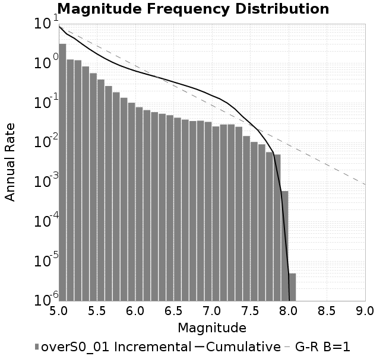
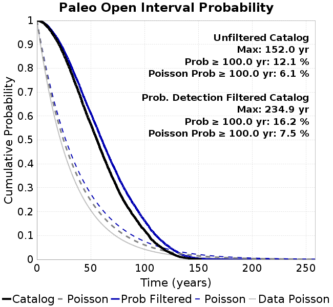
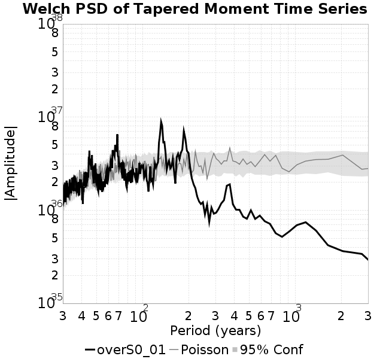

# overS0_01
## Metadata
| **Catalog** | overS0_01 |
|-----|-----|
| **Author** | Jaqcui Gilchrist, 2018/09/27 |
| **Description** | stress overshoot: overshoot=0.01 |
| **Fault/Def Model** | Fault Model 3.1, Geologic |
| **Slip Velocity** | 1.0 m/s |
| **Average Element Area** | 1.35 km^2 |
| **Length** | 8,236,175 events in 410,290 years |
| **Frictional Params** | a=0.001, b=0.008, (b-a)=0.007, ddotEQ=1 |

* [Metadata](#metadata)
* [Plots](#plots)
  * [Magnitude-Frequency Plot](#magnitude-frequency-plot)
  * [Magnitude-Area Plots](#magnitude-area-plots)
  * [Slip-Area Plots](#slip-area-plots)
  * [Rupture Velocity Plots](#rupture-velocity-plots)
  * [Global Interevent-Time Distributions](#global-interevent-time-distributions)
  * [Normalized Fault Interevent-Time Distributions](#normalized-fault-interevent-time-distributions)
  * [Stationarity Plot](#stationarity-plot)
  * [Element/Subsection Interevent Time Comparisons](#elementsubsection-interevent-time-comparisons)
    * [Element Interevent Time Comparisons](#element-interevent-time-comparisons)
    * [Subsection Interevent Time Comparisons](#subsection-interevent-time-comparisons)
  * [Paleo Open Interval Plots](#paleo-open-interval-plots)
    * [Paleo Open Interval Plots, Biasi and Sharer 2019](#paleo-open-interval-plots-biasi-and-sharer-2019)
    * [Paleo Open Interval Plots, UCERF3](#paleo-open-interval-plots-ucerf3)
  * [Moment Release Variability Plots](#moment-release-variability-plots)
* [Input File](#input-file)

## Plots
### Magnitude-Frequency Plot
*[(top)](#overs0_01)*


### Magnitude-Area Plots
*[(top)](#overs0_01)*

| Scatter | 2-D Hist |
|-----|-----|
|  |  |
### Slip-Area Plots
*[(top)](#overs0_01)*

| Scatter | 2-D Hist |
|-----|-----|
|  |  |
### Rupture Velocity Plots
*[(top)](#overs0_01)*

| **Scatter** |  |
|-----|-----|
| **Distance/Velocity** |  |
### Global Interevent-Time Distributions
*[(top)](#overs0_01)*

| **M≥6** | **M≥6.5** | **M≥7** | **M≥7.5** |
|-----|-----|-----|-----|
|  |  |  |  |
### Normalized Fault Interevent-Time Distributions
*[(top)](#overs0_01)*

|  | **M≥6** | **M≥6.5** | **M≥7** | **M≥7.5** |
|-----|-----|-----|-----|-----|
| **Elements** |  |  |  |  |
| **Subsections** |  |  |  |  |
| **Sections** |  |  |  |  |
### Stationarity Plot
*[(top)](#overs0_01)*


### Element/Subsection Interevent Time Comparisons

#### Element Interevent Time Comparisons
*[(top)](#overs0_01)*

| Min Mag | Scatter | 2-D Hist |
|-----|-----|-----|
| **M≥6.0** |  |  |
| **M≥6.5** |  |  |
| **M≥7.0** |  |  |
| **M≥7.5** |  |  |

#### Subsection Interevent Time Comparisons
*[(top)](#overs0_01)*

*Subsections participate in a rupture if at least 20.0 % of its area ruptures*

| Min Mag | Scatter | 2-D Hist |
|-----|-----|-----|
| **M≥6.0** |  |  |
| **M≥6.5** |  |  |
| **M≥7.0** |  |  |
| **M≥7.5** |  |  |

### Paleo Open Interval Plots
*[(top)](#overs0_01)*

#### Paleo Open Interval Plots, Biasi and Sharer 2019
*[(top)](#overs0_01)*

These plots use the 5 paleoseismic sites identified in Biasi & Scharer (2019) on the Hayward, N. SAF, S. SAF, and SJC faults. By default, a rupture is counted at a paleo site if the nearest element (at the surface) slips any amount. We also alternatively apply a probability of detection model. Those results are marked as 'Prob. Filtered'.

**Paleoseismic sites table:**

| **Site Name** | Data MRI (yr) | Data Annual Rate | Catalog MRI (yr) | Catalog Annual Rate | Catalog Occurences | Prob Filtered Catalog MRI (yr) | Prob Filtered Catalog Annual Rate | Prob Filtered Catalog Occurences |
|-----|-----|-----|-----|-----|-----|-----|-----|-----|
| **HOG** | 191.00 | 0.005235602 | 355.83 | 0.0028103231 | 1139 | 360.04 | 0.0027775022 | 1125.7 |
| **FRA** | 119.00 | 0.008403362 | 117.75 | 0.008492679 | 3442 | 123.35 | 0.008106976 | 3285.69 |
| **COA** | 181.00 | 0.005524862 | 178.08 | 0.005615337 | 2276 | 191.30 | 0.005227524 | 2118.87 |
| **SCZ** | 106.00 | 0.009433962 | 120.84 | 0.008275075 | 3354 | 139.87 | 0.0071495557 | 2897.73 |
| **TYS** | 329.00 | 0.0030395137 | 353.34 | 0.002830128 | 1147 | 385.98 | 0.0025907978 | 1049.96 |
| **TOTAL** | 31.61 | 0.0316373 | 35.68 | 0.028024623 | 11358 | 38.69 | 0.02584753 | 10475.66 |

**Paleoseismic Plots:**

|  |  |
|-----|-----|

**Open interval probabilities table:**

| **Open Interval (yr)** | Catalog Probability | Catalog Poisson Probability | Prob. Filtered Catalog Probability | Prob. Filtered Catalog Poisson Probability | Data Poisson Probability |
|-----|-----|-----|-----|-----|-----|
| **10.00** | 0.97303164 | 0.75559765 | 0.9768647 | 0.7722281 | 0.72878754 |
| **20.00** | 0.9041033 | 0.57092786 | 0.9166563 | 0.59633625 | 0.53113127 |
| **30.00** | 0.8041531 | 0.43139175 | 0.82804906 | 0.4605076 | 0.3870819 |
| **40.00** | 0.6866869 | 0.3259586 | 0.722467 | 0.35561693 | 0.28210047 |
| **50.00** | 0.5670882 | 0.24629356 | 0.61242557 | 0.27461737 | 0.2055913 |
| **60.00** | 0.45119035 | 0.18609883 | 0.5036765 | 0.21206725 | 0.14983238 |
| **70.00** | 0.34390604 | 0.14061585 | 0.39904532 | 0.1637643 | 0.10919597 |
| **80.00** | 0.25063807 | 0.106249005 | 0.3052909 | 0.12646338 | 0.079580665 |
| **90.00** | 0.18105884 | 0.0802815 | 0.22973995 | 0.09765858 | 0.057997398 |
| **100.00** | 0.121464625 | 0.060660515 | 0.16247724 | 0.0754147 | 0.04226778 |
| **110.00** | 0.06859316 | 0.045834944 | 0.1033963 | 0.05823735 | 0.030804234 |
| **120.00** | 0.035545267 | 0.034632776 | 0.061196037 | 0.04497252 | 0.022449743 |
| **130.00** | 0.014823568 | 0.026168445 | 0.031004261 | 0.034729045 | 0.016361093 |
| **140.00** | 0.005404655 | 0.019772816 | 0.013269388 | 0.026818743 | 0.011923761 |
| **150.00** | 8.1949227E-4 | 0.014940294 | 0.0039442466 | 0.020710187 | 0.008689889 |
| **160.00** | 0.0 | 0.0112888515 | 0.0014991075 | 0.015992988 | 0.0063330824 |
| **170.00** | 0.0 | 0.00852983 | 6.9919025E-4 | 0.012350235 | 0.0046154717 |
| **180.00** | 0.0 | 0.0064451196 | 3.317486E-4 | 0.009537199 | 0.0033636983 |
| **190.00** | 0.0 | 0.0048699174 | 1.7744506E-4 | 0.007364893 | 0.0024514215 |
| **200.00** | 0.0 | 0.003679698 | 1.178861E-4 | 0.0056873774 | 0.0017865654 |
| **210.00** | 0.0 | 0.0027803713 | 5.615652E-5 | 0.0043919524 | 0.0013020267 |
| **220.00** | 0.0 | 0.002100842 | 2.1398431E-5 | 0.0033915893 | 9.489008E-4 |
| **230.00** | 0.0 | 0.0015873914 | 7.9315905E-6 | 0.0026190805 | 6.915471E-4 |
| **240.00** | 0.0 | 0.0011994293 | 0.0 | 0.0020225276 | 5.039909E-4 |

#### Paleo Open Interval Plots, UCERF3
*[(top)](#overs0_01)*

These plots use the full set of UCERF3 paleoseismic sites. By default, a rupture is counted at a paleo site if the nearest element (at the surface) slips any amount. We also alternativeslyapply a probability of detection model. Those results are marked as 'Prob. Filtered'.

**Paleoseismic sites table:**

| **Site Name** | Data MRI (yr) | Data Annual Rate | Catalog MRI (yr) | Catalog Annual Rate | Catalog Occurences | Prob Filtered Catalog MRI (yr) | Prob Filtered Catalog Annual Rate | Prob Filtered Catalog Occurences |
|-----|-----|-----|-----|-----|-----|-----|-----|-----|
| **SSanAndreasBurroFlats** | 205.44 | 0.0048677 | 212.86 | 0.0046978598 | 1903 | 239.92 | 0.0041679763 | 1688.42 |
| **SSanAndreasIndio** | 277.37 | 0.0036053 | 173.29 | 0.0057708384 | 2339 | 184.90 | 0.005408235 | 2192.07 |
| **SSAFMCreek1000Palms** | 261.33 | 0.0038266 | 1544.34 | 6.475274E-4 | 262 | 2265.10 | 4.414819E-4 | 178.38 |
| **NSanAndreasFortRoss** | 306.28 | 0.003265 | 192.39 | 0.005197841 | 2107 | 194.82 | 0.0051329746 | 2080.7 |
| **NSanAndreasNorthCoast** | 263.87 | 0.0037898 | 181.65 | 0.005505145 | 2232 | 186.35 | 0.0053662495 | 2175.66 |
| **CalaverasfaultNorth** | 618.05 | 0.001618 | 164.62 | 0.006074768 | 2461 | 237.49 | 0.004210773 | 1705.81 |
| **ElsinoreTemecula** | 1019.16 | 9.812E-4 | 701.10 | 0.0014263219 | 577 | 727.45 | 0.0013746641 | 556.08 |
| **ElsinoreWhittier** | 3196.93 | 3.128E-4 | 1543.11 | 6.4804207E-4 | 263 | 1617.61 | 6.181963E-4 | 250.7 |
| **SSAFCarrizoBidart** | 114.71 | 0.0087179 | 121.71 | 0.008216541 | 3330 | 125.16 | 0.00798997 | 3238.13 |
| **SanJacintoHogLake** | 311.78 | 0.0032074 | 355.83 | 0.0028103231 | 1139 | 359.78 | 0.0027795013 | 1126.49 |
| **PuenteHills** | 3506.31 | 2.852E-4 | 5305.66 | 1.88478E-4 | 77 | 5700.56 | 1.7542136E-4 | 71.72 |
| **SanGregorioNorth** | 1019.06 | 9.813E-4 | 401.91 | 0.002488131 | 1008 | 415.01 | 0.0024095627 | 976.16 |
| **SanJacintoSuperstition** | 508.26 | 0.0019675 | 1226.30 | 8.154604E-4 | 330 | 1315.58 | 7.6012034E-4 | 307.47 |
| **SSanAndreasWrightwood** | 106.04 | 0.0094304 | 153.47 | 0.006515743 | 2641 | 155.28 | 0.0064400374 | 2610.29 |
| **SSanAndreasPitmanCanyon** | 173.48 | 0.0057643 | 142.89 | 0.006998496 | 2837 | 159.77 | 0.006259188 | 2537.36 |
| **SSanAndreasPlungeCreek** | 205.36 | 0.0048695 | 360.73 | 0.0027721652 | 1124 | 444.64 | 0.002249023 | 911.83 |
| **FrazierMountianSSAF** | 148.57 | 0.0067307 | 117.75 | 0.008492679 | 3442 | 123.39 | 0.008104667 | 3284.73 |
| **NSanAndreasSantaCruzSeg** | 109.84 | 0.0091041 | 120.84 | 0.008275075 | 3354 | 139.94 | 0.00714601 | 2896.38 |
| **RodgersCreek** | 325.31 | 0.003074 | 174.50 | 0.005730584 | 2322 | 235.02 | 0.004255027 | 1724.13 |
| **GreenValleyMasonRoad** | 293.31 | 0.0034094 | 1746.81 | 5.724706E-4 | 232 | 2333.21 | 4.2859482E-4 | 173.48 |
| **HaywardfaultNorth** | 318.34 | 0.0031413 | 371.08 | 0.002694834 | 1092 | 382.11 | 0.0026170176 | 1060.41 |
| **HaywardfaultSouth** | 167.57 | 0.0059677 | 353.34 | 0.002830128 | 1147 | 386.17 | 0.0025895599 | 1049.4 |
| **Compton** | 2658.16 | 3.762E-4 | 6109.55 | 1.6367827E-4 | 67 | 6720.34 | 1.48802E-4 | 60.96 |
| **SSanAndreasCoachella** | 178.45 | 0.0056037 | 178.08 | 0.005615337 | 2276 | 191.19 | 0.005230461 | 2120.06 |
| **ElsinoreGlenIvy** | 179.12 | 0.0055828 | 562.45 | 0.0017779499 | 719 | 614.60 | 0.001627066 | 658.02 |
| **GarlockCentralallevents** | 1434.93 | 6.969E-4 | 644.17 | 0.0015523876 | 629 | 655.92 | 0.0015245789 | 617.73 |
| **NSanAndreasAlderCreek** | 869.64 | 0.0011499 | 191.93 | 0.0052101817 | 2112 | 194.50 | 0.0051415185 | 2084.17 |
| **SSanAndreasPallettCreek** | 149.30 | 0.006698 | 153.59 | 0.006510807 | 2639 | 155.27 | 0.006440314 | 2610.42 |
| **GarlockWesternallevents** | 1230.16 | 8.129E-4 | 819.59 | 0.0012201286 | 494 | 846.58 | 0.0011812235 | 478.27 |
| **ElsinoreFaultJulian** | 3250.98 | 3.076E-4 | 1235.39 | 8.0946373E-4 | 327 | 1261.00 | 7.930238E-4 | 320.35 |
| **TOTAL** | 9.08 | 0.1101451 | 14.42 | 0.069335185 | 28100 | 15.99 | 0.062537126 | 25344.83 |

**Paleoseismic Plots:**

|  |  |
|-----|-----|

**Open interval probabilities table:**

| **Open Interval (yr)** | Catalog Probability | Catalog Poisson Probability | Prob. Filtered Catalog Probability | Prob. Filtered Catalog Poisson Probability | Data Poisson Probability |
|-----|-----|-----|-----|-----|-----|
| **10.00** | 0.85498196 | 0.49989766 | 0.8769288 | 0.53506273 | 0.33238843 |
| **20.00** | 0.6010848 | 0.24989767 | 0.6492906 | 0.2862921 | 0.110482074 |
| **30.00** | 0.37750113 | 0.12492327 | 0.43296048 | 0.15318424 | 0.036722966 |
| **40.00** | 0.21726224 | 0.062448848 | 0.2670703 | 0.081963174 | 0.012206289 |
| **50.00** | 0.111255944 | 0.031218033 | 0.14996347 | 0.04385544 | 0.004057229 |
| **60.00** | 0.054976743 | 0.015605821 | 0.08123046 | 0.023465412 | 0.001348576 |
| **70.00** | 0.022391966 | 0.007801314 | 0.038666938 | 0.012555467 | 4.4825108E-4 |
| **80.00** | 0.010905704 | 0.0038998586 | 0.01866765 | 0.006717962 | 1.4899348E-4 |
| **90.00** | 0.0044164676 | 0.0019495302 | 0.0084570795 | 0.0035945312 | 4.952371E-5 |
| **100.00** | 0.0021453998 | 9.7456557E-4 | 0.0038040434 | 0.0019232997 | 1.6461108E-5 |
| **110.00** | 0.0016188538 | 4.8718305E-4 | 0.0020906872 | 0.001029086 | 5.4714824E-6 |
| **120.00** | 6.019956E-4 | 2.4354167E-4 | 6.9201953E-4 | 5.5062555E-4 | 1.8186574E-6 |
| **130.00** | 0.0 | 1.21745914E-4 | 5.9581E-5 | 2.946192E-4 | 6.045007E-7 |
| **140.00** | 0.0 | 6.0860497E-5 | 2.0030877E-5 | 1.5763975E-4 | 2.0092905E-7 |
| **150.00** | 0.0 | 3.042402E-5 | 0.0 | 8.434716E-5 | 6.678649E-8 |

### Moment Release Variability Plots
*[(top)](#overs0_01)*

We first create a tapered moment release time series for the entire catalog. Each event's moment is distributed across a 25 year Hanning (cosine) taper. Here is a plot of a random 2,000 year section of this time series:


We then compute Welch's power spectral density estimate on the entire time series. Results are plotted below, with a Poisson randomization of the catalog also plotted in a gray line, and the 95% confidence bounds from 200 realizations as a light gray shaded area. Significant deviations outside the Poisson confidence intervals indicate synchronous behaviour.



## Input File
*[(top)](#overs0_01)*

```
  A_1 = 0.001
  fA = .1
  B_1 = 0.008
  muSlipAmp_1 = .0
  muSlipInvDist_1 = 1.0
  cohesion = 0.0
  Dc_1 = 1.0000000000000000818e-05
  mu0_1 = 0.6
  ddotStar_1 = 9.9999999999999995475e-07
  ddotAB_1 = 9.9999999999999995475e-07
  alpha_1 = 0.0
  theta0_1 = 200000000
  tau0_1 = 55.1
  sigma0_1 = 100
  sigmaFracPin = .5
  lowSigmaAction = 1
  maxThetaPin = 1.0e13
  ddotEQ_1 = 1
  ddotEQFname = 
  stressOvershootFactor = 0.01
  lameLambda = 30000
  lameMu = 30000
  slowSlip_1 = 0
  nEq = 100000000000
  KZeroFrac = 0
  muPin = 1.0
  tStart = 0
  maxT = 3.16e13
  maxWallTime = 169200
  maxTrans = 1.0000000000000000159e100
  faultFname = UCERF3FM.15km.1km.tri.flt
  outFnameInfix = overS0_01
  writeTau = 2
  writeSigma = 2
  writeSlip = 0
  writeSlipSpeed = 0
  writeState = 0
  writeTheta = 2
  writePED = 1
  writeTransitions = 1
  minDtWrite = 0
  minDtWriteCoseismic = 0
  minDtWriteInterseismic = 0
  minMagWrite = 7.7
  writeStiffness = 0
  stressRateSpecification = 1
  dMu3 = 0.01000000000000000
  initTauFname = 
  initSigmaFname = 
  initThetaFname = 
  initSlipSpeedFname = 
  AFname = 
  BFname =  
  DcFname = 
  mu0Fname = 
  ddotStarFname = 
  ddotABFname = 
  alphaFname = 
  KTauFname = /u/sciteam/gilchris/scratch/stiffness_25a589d/Ktau.25a589d.out
  KSigmaFname = /u/sciteam/gilchris/scratch/stiffness_25a589d/Ksigma.25a589d.out
  tFailFname = 
  tauFailFname = 
  tauDotFname = 
  sigmaDotFname =
  KZeroFname = UCERF3FM.15km.1km.tri.KZero
  pinnedFname =  UCERF3FM.15km.1km.tri.pin
  neighborFname = UCERF3FM.15km.1km.tri.neighbors
  stressRateFname =  
  slowSlipFname = 
  writePatchFname = 
  DEBUG = 0
  ZBrentUpperBracket = 0
  receiverElementAreaFrac = 0.8
  receiverElementIntTol = 1.0e-4
  receiverElementSubdivisionMax = 4
  tgfDist1 = 3
  tgfDist1 = 10
  lowSigmaAction = 1
  highSigmaAction = 0
```
