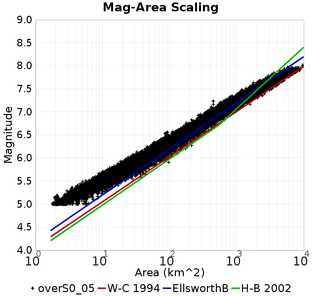
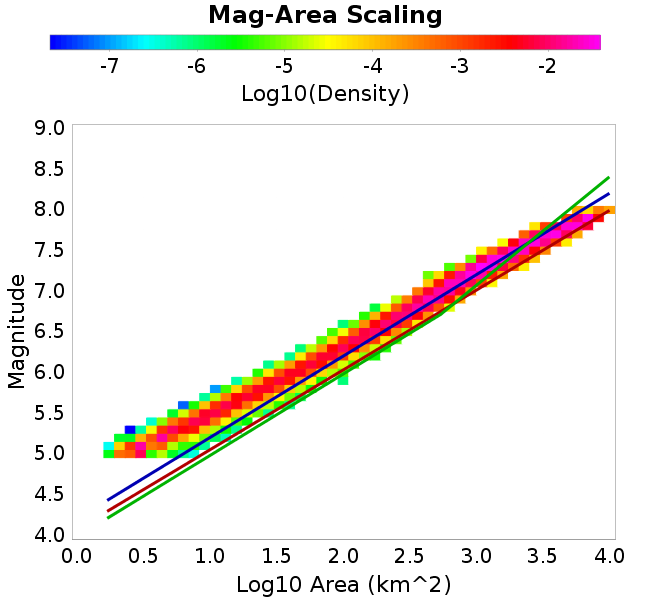

# overS0_05
## Metadata
| **Catalog** | overS0_05 |
|-----|-----|
| **Author** | Jaqcui Gilchrist, 2018/09/27 |
| **Description** | stress overshoot: overshoot=0.05 |
| **Fault/Def Model** | Fault Model 3.1, Geologic |
| **Slip Velocity** | 1.0 m/s |
| **Average Element Area** | 1.35 km^2 |
| **Length** | 6,463,999 events in 324,425 years |
| **Frictional Params** | a=0.001, b=0.008, (b-a)=0.007, ddotEQ=1 |

* [Metadata](#metadata)
* [Plots](#plots)
  * [Magnitude-Frequency Plot](#magnitude-frequency-plot)
  * [Magnitude-Area Plots](#magnitude-area-plots)
  * [Slip-Area Plots](#slip-area-plots)
  * [Rupture Velocity Plots](#rupture-velocity-plots)
  * [Global Interevent-Time Distributions](#global-interevent-time-distributions)
  * [Normalized Fault Interevent-Time Distributions](#normalized-fault-interevent-time-distributions)
  * [Stationarity Plot](#stationarity-plot)
  * [Element/Subsection Interevent Time Comparisons](#elementsubsection-interevent-time-comparisons)
    * [Element Interevent Time Comparisons](#element-interevent-time-comparisons)
    * [Subsection Interevent Time Comparisons](#subsection-interevent-time-comparisons)
  * [Paleo Open Interval Plots](#paleo-open-interval-plots)
    * [Paleo Open Interval Plots, Biasi and Sharer 2019](#paleo-open-interval-plots-biasi-and-sharer-2019)
    * [Paleo Open Interval Plots, UCERF3](#paleo-open-interval-plots-ucerf3)
  * [Moment Release Variability Plots](#moment-release-variability-plots)
* [Input File](#input-file)

## Plots
### Magnitude-Frequency Plot
*[(top)](#overs0_05)*


### Magnitude-Area Plots
*[(top)](#overs0_05)*

| Scatter | 2-D Hist |
|-----|-----|
|  |  |
### Slip-Area Plots
*[(top)](#overs0_05)*

| Scatter | 2-D Hist |
|-----|-----|
|  |  |
### Rupture Velocity Plots
*[(top)](#overs0_05)*

| **Scatter** |  |
|-----|-----|
| **Distance/Velocity** |  |
### Global Interevent-Time Distributions
*[(top)](#overs0_05)*

| **M≥6** | **M≥6.5** | **M≥7** | **M≥7.5** |
|-----|-----|-----|-----|
|  |  |  |  |
### Normalized Fault Interevent-Time Distributions
*[(top)](#overs0_05)*

|  | **M≥6** | **M≥6.5** | **M≥7** | **M≥7.5** |
|-----|-----|-----|-----|-----|
| **Elements** |  |  |  |  |
| **Subsections** |  |  |  |  |
| **Sections** |  |  |  |  |
### Stationarity Plot
*[(top)](#overs0_05)*


### Element/Subsection Interevent Time Comparisons

#### Element Interevent Time Comparisons
*[(top)](#overs0_05)*

| Min Mag | Scatter | 2-D Hist |
|-----|-----|-----|
| **M≥6.0** |  |  |
| **M≥6.5** |  |  |
| **M≥7.0** |  |  |
| **M≥7.5** |  |  |

#### Subsection Interevent Time Comparisons
*[(top)](#overs0_05)*

*Subsections participate in a rupture if at least 20.0 % of its area ruptures*

| Min Mag | Scatter | 2-D Hist |
|-----|-----|-----|
| **M≥6.0** |  |  |
| **M≥6.5** |  |  |
| **M≥7.0** |  |  |
| **M≥7.5** |  |  |

### Paleo Open Interval Plots
*[(top)](#overs0_05)*

#### Paleo Open Interval Plots, Biasi and Sharer 2019
*[(top)](#overs0_05)*

These plots use the 5 paleoseismic sites identified in Biasi & Scharer (2019) on the Hayward, N. SAF, S. SAF, and SJC faults. By default, a rupture is counted at a paleo site if the nearest element (at the surface) slips any amount. We also alternatively apply a probability of detection model. Those results are marked as 'Prob. Filtered'.

**Paleoseismic sites table:**

| **Site Name** | Data MRI (yr) | Data Annual Rate | Catalog MRI (yr) | Catalog Annual Rate | Catalog Occurences | Prob Filtered Catalog MRI (yr) | Prob Filtered Catalog Annual Rate | Prob Filtered Catalog Occurences |
|-----|-----|-----|-----|-----|-----|-----|-----|-----|
| **HOG** | 191.00 | 0.005235602 | 354.70 | 0.002819295 | 901 | 359.10 | 0.0027847113 | 889.95 |
| **FRA** | 119.00 | 0.008403362 | 116.49 | 0.008584775 | 2742 | 122.06 | 0.008192623 | 2616.77 |
| **COA** | 181.00 | 0.005524862 | 179.58 | 0.0055685914 | 1779 | 191.37 | 0.0052256095 | 1669.46 |
| **SCZ** | 106.00 | 0.009433962 | 119.65 | 0.008357437 | 2669 | 139.09 | 0.007189712 | 2295.9 |
| **TYS** | 329.00 | 0.0030395137 | 342.27 | 0.0029216462 | 933 | 378.51 | 0.0026419077 | 843.64 |
| **TOTAL** | 31.61 | 0.0316373 | 35.39 | 0.028254926 | 9024 | 38.41 | 0.026032552 | 8314.18 |

**Paleoseismic Plots:**

|  |  |
|-----|-----|

**Open interval probabilities table:**

| **Open Interval (yr)** | Catalog Probability | Catalog Poisson Probability | Prob. Filtered Catalog Probability | Prob. Filtered Catalog Poisson Probability | Data Poisson Probability |
|-----|-----|-----|-----|-----|-----|
| **10.00** | 0.97312605 | 0.7538595 | 0.97682303 | 0.77080065 | 0.72878754 |
| **20.00** | 0.9020834 | 0.5683041 | 0.91581976 | 0.5941336 | 0.53113127 |
| **30.00** | 0.80150944 | 0.4284215 | 0.8270086 | 0.45795858 | 0.3870819 |
| **40.00** | 0.6846213 | 0.32296962 | 0.7215305 | 0.35299477 | 0.28210047 |
| **50.00** | 0.55353594 | 0.24347371 | 0.6017921 | 0.2720886 | 0.2055913 |
| **60.00** | 0.43722764 | 0.18354496 | 0.491938 | 0.20972605 | 0.14983238 |
| **70.00** | 0.3306799 | 0.13836712 | 0.3871468 | 0.16165698 | 0.10919597 |
| **80.00** | 0.23995042 | 0.104309365 | 0.29410988 | 0.1246053 | 0.079580665 |
| **90.00** | 0.1675643 | 0.078634605 | 0.21618317 | 0.096045844 | 0.057997398 |
| **100.00** | 0.101176985 | 0.059279446 | 0.14453916 | 0.074032195 | 0.04226778 |
| **110.00** | 0.06315237 | 0.044688374 | 0.0973177 | 0.057064064 | 0.030804234 |
| **120.00** | 0.032752767 | 0.033688754 | 0.057633303 | 0.043985017 | 0.022449743 |
| **130.00** | 0.014266802 | 0.02539659 | 0.029134488 | 0.03390368 | 0.016361093 |
| **140.00** | 0.0027112924 | 0.019145459 | 0.010385788 | 0.026132977 | 0.011923761 |
| **150.00** | 8.9231716E-4 | 0.014432986 | 0.003957846 | 0.020143315 | 0.008689889 |
| **160.00** | 0.0 | 0.010880444 | 0.0015006054 | 0.01552648 | 0.0063330824 |
| **170.00** | 0.0 | 0.0082023265 | 7.0523174E-4 | 0.011967821 | 0.0046154717 |
| **180.00** | 0.0 | 0.0061834017 | 3.5074636E-4 | 0.009224804 | 0.0033636983 |
| **190.00** | 0.0 | 0.004661416 | 1.9281368E-4 | 0.007110485 | 0.0024514215 |
| **200.00** | 0.0 | 0.0035140528 | 1.0523663E-4 | 0.0054807663 | 0.0017865654 |
| **210.00** | 0.0 | 0.0026491021 | 4.937532E-5 | 0.004224578 | 0.0013020267 |
| **220.00** | 0.0 | 0.0019970508 | 2.8081904E-5 | 0.0032563074 | 9.489008E-4 |
| **230.00** | 0.0 | 0.0015054957 | 1.1936914E-5 | 0.002509964 | 6.915471E-4 |
| **240.00** | 0.0 | 0.0011349323 | 0.0 | 0.0019346818 | 5.039909E-4 |

#### Paleo Open Interval Plots, UCERF3
*[(top)](#overs0_05)*

These plots use the full set of UCERF3 paleoseismic sites. By default, a rupture is counted at a paleo site if the nearest element (at the surface) slips any amount. We also alternativeslyapply a probability of detection model. Those results are marked as 'Prob. Filtered'.

**Paleoseismic sites table:**

| **Site Name** | Data MRI (yr) | Data Annual Rate | Catalog MRI (yr) | Catalog Annual Rate | Catalog Occurences | Prob Filtered Catalog MRI (yr) | Prob Filtered Catalog Annual Rate | Prob Filtered Catalog Occurences |
|-----|-----|-----|-----|-----|-----|-----|-----|-----|
| **SSanAndreasBurroFlats** | 205.44 | 0.0048677 | 209.70 | 0.004768654 | 1522 | 237.40 | 0.004212264 | 1344.35 |
| **SSanAndreasIndio** | 277.37 | 0.0036053 | 175.63 | 0.0056938687 | 1819 | 186.31 | 0.0053672893 | 1714.72 |
| **SSAFMCreek1000Palms** | 261.33 | 0.0038266 | 1476.31 | 6.7736366E-4 | 215 | 2214.18 | 4.5163493E-4 | 143.14 |
| **NSanAndreasFortRoss** | 306.28 | 0.003265 | 189.38 | 0.0052803666 | 1686 | 191.81 | 0.005213401 | 1664.62 |
| **NSanAndreasNorthCoast** | 263.87 | 0.0037898 | 180.87 | 0.00552874 | 1765 | 185.54 | 0.0053896527 | 1720.57 |
| **CalaverasfaultNorth** | 618.05 | 0.001618 | 163.47 | 0.006117397 | 1954 | 235.19 | 0.0042518564 | 1357.77 |
| **ElsinoreTemecula** | 1019.16 | 9.812E-4 | 689.39 | 0.0014505569 | 463 | 715.32 | 0.0013979791 | 446.21 |
| **ElsinoreWhittier** | 3196.93 | 3.128E-4 | 1532.41 | 6.525664E-4 | 209 | 1611.93 | 6.203737E-4 | 198.69 |
| **SSAFCarrizoBidart** | 114.71 | 0.0087179 | 120.71 | 0.008284104 | 2646 | 124.50 | 0.0080321105 | 2565.52 |
| **SanJacintoHogLake** | 311.78 | 0.0032074 | 354.70 | 0.002819295 | 901 | 358.99 | 0.0027855572 | 890.22 |
| **PuenteHills** | 3506.31 | 2.852E-4 | 5110.68 | 1.956687E-4 | 62 | 5550.00 | 1.8018008E-4 | 57.1 |
| **SanGregorioNorth** | 1019.06 | 9.813E-4 | 392.40 | 0.002548412 | 814 | 406.73 | 0.0024586078 | 785.3 |
| **SanJacintoSuperstition** | 508.26 | 0.0019675 | 1223.42 | 8.1737956E-4 | 261 | 1313.43 | 7.61365E-4 | 243.1 |
| **SSanAndreasWrightwood** | 106.04 | 0.0094304 | 153.02 | 0.0065350244 | 2087 | 154.87 | 0.006456828 | 2062.03 |
| **SSanAndreasPitmanCanyon** | 173.48 | 0.0057643 | 143.66 | 0.0069610854 | 2223 | 159.67 | 0.0062628286 | 1999.99 |
| **SSanAndreasPlungeCreek** | 205.36 | 0.0048695 | 361.50 | 0.0027662246 | 882 | 446.58 | 0.0022392487 | 713.94 |
| **FrazierMountianSSAF** | 148.57 | 0.0067307 | 116.49 | 0.008584775 | 2742 | 122.10 | 0.008189683 | 2615.83 |
| **NSanAndreasSantaCruzSeg** | 109.84 | 0.0091041 | 119.65 | 0.008357437 | 2669 | 139.07 | 0.0071906 | 2296.21 |
| **RodgersCreek** | 325.31 | 0.003074 | 170.18 | 0.005875962 | 1877 | 231.38 | 0.0043218965 | 1380.56 |
| **GreenValleyMasonRoad** | 293.31 | 0.0034094 | 1837.35 | 5.4426084E-4 | 174 | 2447.20 | 4.086303E-4 | 130.45 |
| **HaywardfaultNorth** | 318.34 | 0.0031413 | 372.06 | 0.0026877264 | 859 | 383.51 | 0.0026074736 | 833.36 |
| **HaywardfaultSouth** | 167.57 | 0.0059677 | 342.27 | 0.0029216462 | 933 | 378.83 | 0.0026397249 | 843.01 |
| **Compton** | 2658.16 | 3.762E-4 | 5995.22 | 1.6679955E-4 | 53 | 6542.32 | 1.52851E-4 | 48.58 |
| **SSanAndreasCoachella** | 178.45 | 0.0056037 | 179.58 | 0.0055685914 | 1779 | 191.54 | 0.005220956 | 1667.98 |
| **ElsinoreGlenIvy** | 179.12 | 0.0055828 | 579.69 | 0.0017250458 | 551 | 631.50 | 0.0015835307 | 505.74 |
| **GarlockCentralallevents** | 1434.93 | 6.969E-4 | 647.99 | 0.0015432376 | 493 | 660.17 | 0.0015147576 | 483.9 |
| **NSanAndreasAlderCreek** | 869.64 | 0.0011499 | 189.72 | 0.0052709654 | 1683 | 192.54 | 0.0051937476 | 1658.33 |
| **SSanAndreasPallettCreek** | 149.30 | 0.006698 | 153.24 | 0.006525626 | 2084 | 154.99 | 0.0064520347 | 2060.47 |
| **GarlockWesternallevents** | 1230.16 | 8.129E-4 | 821.08 | 0.0012179109 | 389 | 845.31 | 0.0011830034 | 377.76 |
| **ElsinoreFaultJulian** | 3250.98 | 3.076E-4 | 1234.49 | 8.100513E-4 | 259 | 1258.93 | 7.9432374E-4 | 253.96 |
| **TOTAL** | 9.08 | 0.1101451 | 14.30 | 0.06995132 | 22341 | 15.87 | 0.06301959 | 20127.03 |

**Paleoseismic Plots:**

|  |  |
|-----|-----|

**Open interval probabilities table:**

| **Open Interval (yr)** | Catalog Probability | Catalog Poisson Probability | Prob. Filtered Catalog Probability | Prob. Filtered Catalog Poisson Probability | Data Poisson Probability |
|-----|-----|-----|-----|-----|-----|
| **10.00** | 0.85405135 | 0.4968271 | 0.87580526 | 0.53248745 | 0.33238843 |
| **20.00** | 0.60188556 | 0.24683717 | 0.64996564 | 0.2835429 | 0.110482074 |
| **30.00** | 0.37000018 | 0.122635394 | 0.42891085 | 0.15098305 | 0.036722966 |
| **40.00** | 0.20476927 | 0.06092859 | 0.25703448 | 0.080396585 | 0.012206289 |
| **50.00** | 0.10737071 | 0.030270975 | 0.14544848 | 0.04281017 | 0.004057229 |
| **60.00** | 0.052721605 | 0.01503944 | 0.07826739 | 0.022795882 | 0.001348576 |
| **70.00** | 0.022845736 | 0.0074720015 | 0.038364593 | 0.012138521 | 4.4825108E-4 |
| **80.00** | 0.010099615 | 0.003712293 | 0.01904741 | 0.0064636106 | 1.4899348E-4 |
| **90.00** | 0.0040241233 | 0.0018443677 | 0.00852156 | 0.0034417917 | 4.952371E-5 |
| **100.00** | 0.0012463186 | 9.163319E-4 | 0.0029641176 | 0.0018327109 | 1.6461108E-5 |
| **110.00** | 0.0 | 4.552585E-4 | 0.0012566162 | 9.758956E-4 | 5.4714824E-6 |
| **120.00** | 0.0 | 2.2618477E-4 | 5.383288E-4 | 5.196522E-4 | 1.8186574E-6 |
| **130.00** | 0.0 | 1.1237472E-4 | 2.303705E-4 | 2.7670828E-4 | 6.045007E-7 |
| **140.00** | 0.0 | 5.583081E-5 | 0.0 | 1.473437E-4 | 2.0092905E-7 |

### Moment Release Variability Plots
*[(top)](#overs0_05)*

We first create a tapered moment release time series for the entire catalog. Each event's moment is distributed across a 25 year Hanning (cosine) taper. Here is a plot of a random 2,000 year section of this time series:


We then compute Welch's power spectral density estimate on the entire time series. Results are plotted below, with a Poisson randomization of the catalog also plotted in gray as a control. Significant deviations above the Poisson model indicate synchronization at that period.


## Input File
*[(top)](#overs0_05)*

```
  A_1 = 0.001
  fA = .1
  B_1 = 0.008
  muSlipAmp_1 = .0
  muSlipInvDist_1 = 1.0
  cohesion = 0.0
  Dc_1 = 1.0000000000000000818e-05
  mu0_1 = 0.6
  ddotStar_1 = 9.9999999999999995475e-07
  ddotAB_1 = 9.9999999999999995475e-07
  alpha_1 = 0.0
  theta0_1 = 200000000
  tau0_1 = 55.1
  sigma0_1 = 100
  sigmaFracPin = .5
  lowSigmaAction = 1
  maxThetaPin = 1.0e13
  ddotEQ_1 = 1
  ddotEQFname = 
  stressOvershootFactor = 0.05
  lameLambda = 30000
  lameMu = 30000
  slowSlip_1 = 0
  nEq = 100000000000
  KZeroFrac = 0
  muPin = 1.0
  tStart = 0
  maxT = 3.16e13
  maxWallTime = 169200
  maxTrans = 1.0000000000000000159e100
  faultFname = UCERF3FM.15km.1km.tri.flt
  outFnameInfix = overS0_05
  writeTau = 2
  writeSigma = 2
  writeSlip = 0
  writeSlipSpeed = 0
  writeState = 0
  writeTheta = 2
  writePED = 1
  writeTransitions = 1
  minDtWrite = 0
  minDtWriteCoseismic = 0
  minDtWriteInterseismic = 0
  minMagWrite = 7.7
  writeStiffness = 0
  stressRateSpecification = 1
  dMu3 = 0.01000000000000000
  initTauFname = 
  initSigmaFname = 
  initThetaFname = 
  initSlipSpeedFname = 
  AFname = 
  BFname =  
  DcFname = 
  mu0Fname = 
  ddotStarFname = 
  ddotABFname = 
  alphaFname = 
  KTauFname = /u/sciteam/gilchris/scratch/stiffness_25a589d/Ktau.25a589d.out
  KSigmaFname = /u/sciteam/gilchris/scratch/stiffness_25a589d/Ksigma.25a589d.out
  tFailFname = 
  tauFailFname = 
  tauDotFname = 
  sigmaDotFname =
  KZeroFname = UCERF3FM.15km.1km.tri.KZero
  pinnedFname =  UCERF3FM.15km.1km.tri.pin
  neighborFname = UCERF3FM.15km.1km.tri.neighbors
  stressRateFname =  
  slowSlipFname = 
  writePatchFname = 
  DEBUG = 0
  ZBrentUpperBracket = 0
  receiverElementAreaFrac = 0.8
  receiverElementIntTol = 1.0e-4
  receiverElementSubdivisionMax = 4
  tgfDist1 = 3
  tgfDist1 = 10
  lowSigmaAction = 1
  highSigmaAction = 0
```
