# overS0_15
## Metadata
| **Catalog** | overS0_15 |
|-----|-----|
| **Author** | Jaqcui Gilchrist, 2018/09/27 |
| **Description** | stress overshoot: overshoot=0.15 |
| **Fault/Def Model** | Fault Model 3.1, Geologic |
| **Slip Velocity** | 1.0 m/s |
| **Average Element Area** | 1.35 km^2 |
| **Length** | 9,007,537 events in 464,004 years |
| **Frictional Params** | a=0.001, b=0.008, (b-a)=0.007, ddotEQ=1 |

* [Metadata](#metadata)
* [Plots](#plots)
  * [Magnitude-Frequency Plot](#magnitude-frequency-plot)
  * [Magnitude-Area Plots](#magnitude-area-plots)
  * [Slip-Area Plots](#slip-area-plots)
  * [Rupture Velocity Plots](#rupture-velocity-plots)
  * [Global Interevent-Time Distributions](#global-interevent-time-distributions)
  * [Normalized Fault Interevent-Time Distributions](#normalized-fault-interevent-time-distributions)
  * [Stationarity Plot](#stationarity-plot)
  * [Element/Subsection Interevent Time Comparisons](#elementsubsection-interevent-time-comparisons)
    * [Element Interevent Time Comparisons](#element-interevent-time-comparisons)
    * [Subsection Interevent Time Comparisons](#subsection-interevent-time-comparisons)
  * [Paleo Open Interval Plots](#paleo-open-interval-plots)
    * [Paleo Open Interval Plots, Biasi and Sharer 2019](#paleo-open-interval-plots-biasi-and-sharer-2019)
    * [Paleo Open Interval Plots, UCERF3](#paleo-open-interval-plots-ucerf3)
  * [Moment Release Variability Plots](#moment-release-variability-plots)
* [Input File](#input-file)

## Plots
### Magnitude-Frequency Plot
*[(top)](#overs0_15)*


### Magnitude-Area Plots
*[(top)](#overs0_15)*

| Scatter | 2-D Hist |
|-----|-----|
|  |  |
### Slip-Area Plots
*[(top)](#overs0_15)*

| Scatter | 2-D Hist |
|-----|-----|
|  |  |
### Rupture Velocity Plots
*[(top)](#overs0_15)*

| **Scatter** |  |
|-----|-----|
| **Distance/Velocity** |  |
### Global Interevent-Time Distributions
*[(top)](#overs0_15)*

| **M≥6** | **M≥6.5** | **M≥7** | **M≥7.5** |
|-----|-----|-----|-----|
|  | 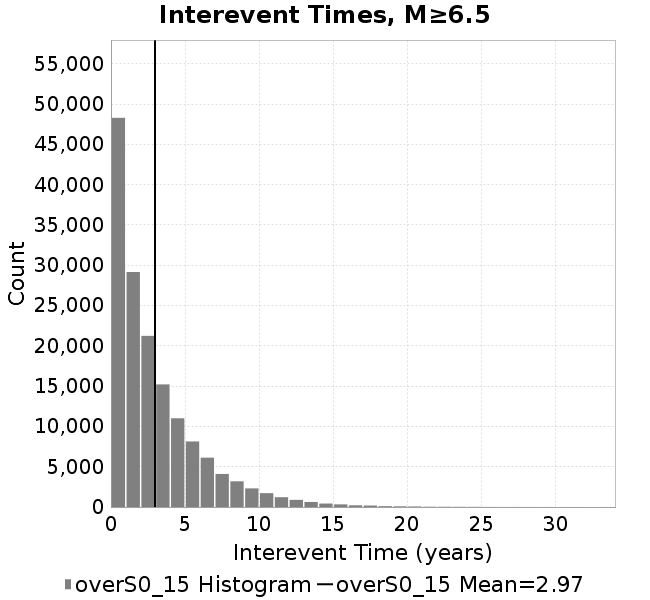 |  | 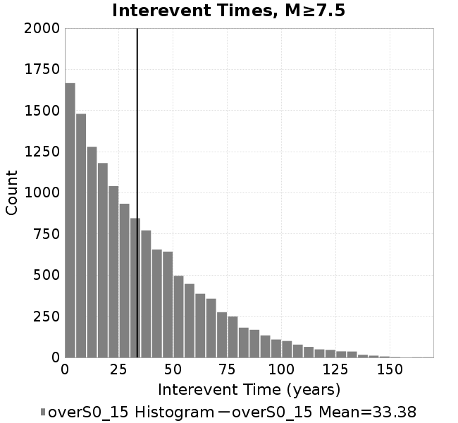 |
### Normalized Fault Interevent-Time Distributions
*[(top)](#overs0_15)*

|  | **M≥6** | **M≥6.5** | **M≥7** | **M≥7.5** |
|-----|-----|-----|-----|-----|
| **Elements** |  | 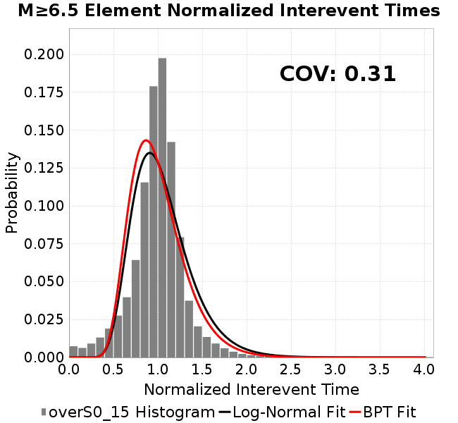 | 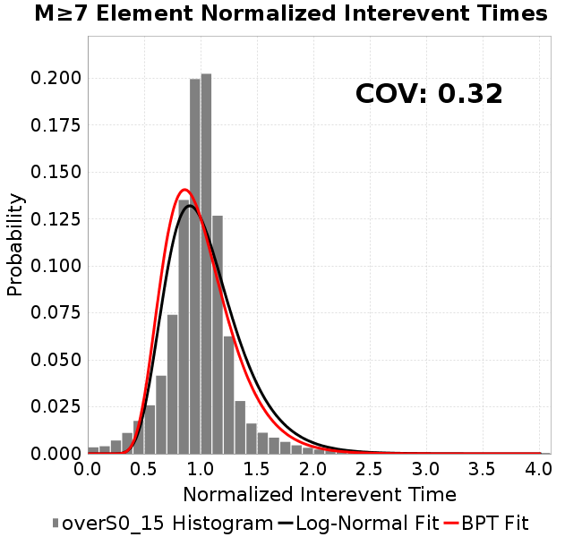 | 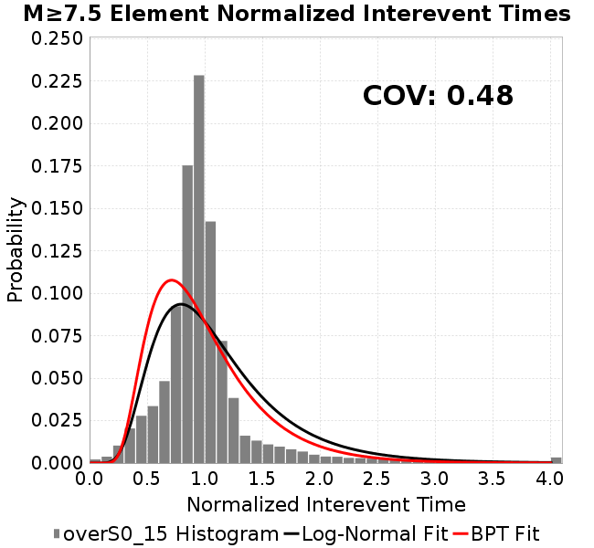 |
| **Subsections** | 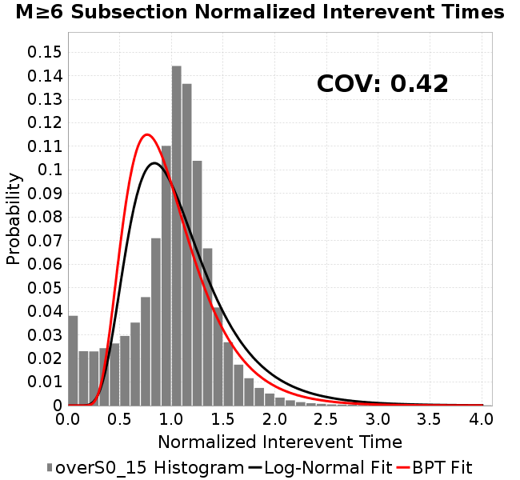 | 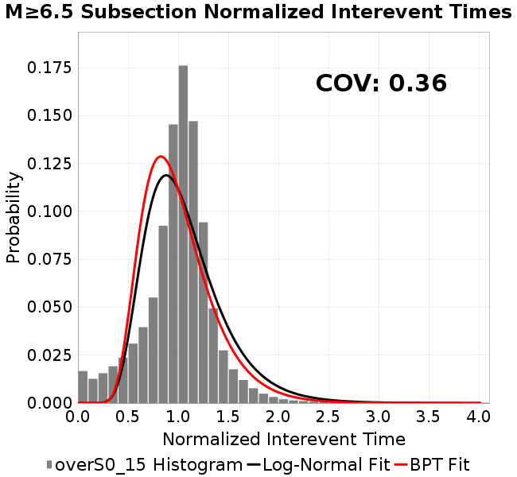 |  | 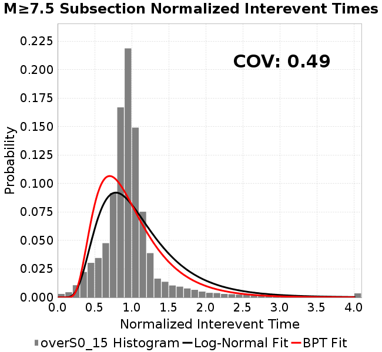 |
| **Sections** | 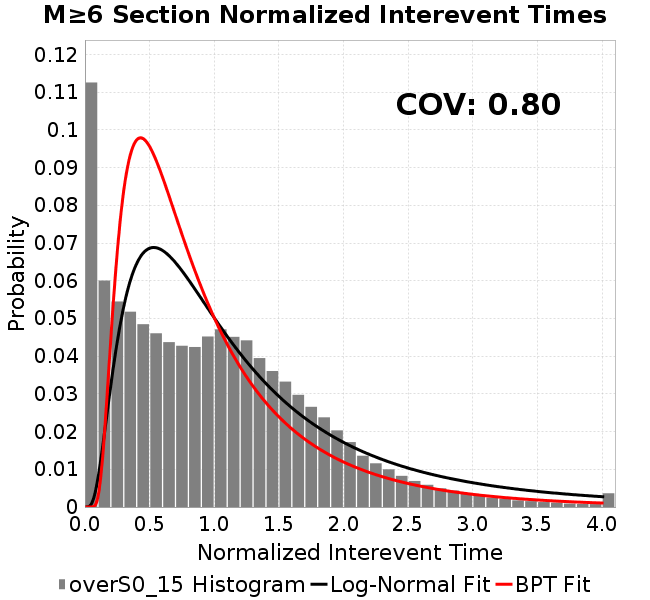 |  |  | 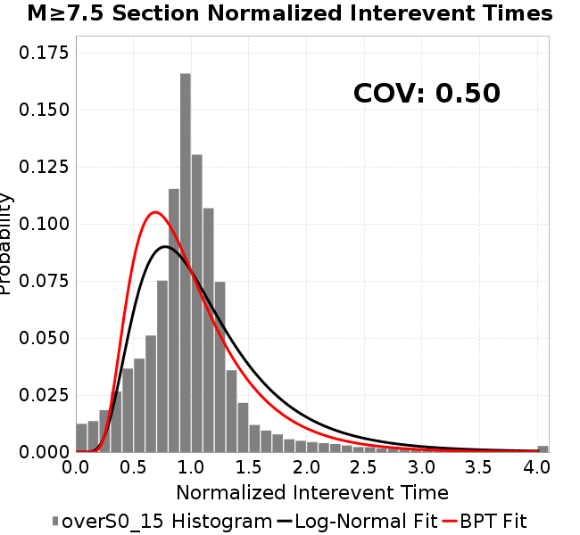 |
### Stationarity Plot
*[(top)](#overs0_15)*


### Element/Subsection Interevent Time Comparisons

#### Element Interevent Time Comparisons
*[(top)](#overs0_15)*

| Min Mag | Scatter | 2-D Hist |
|-----|-----|-----|
| **M≥6.0** | 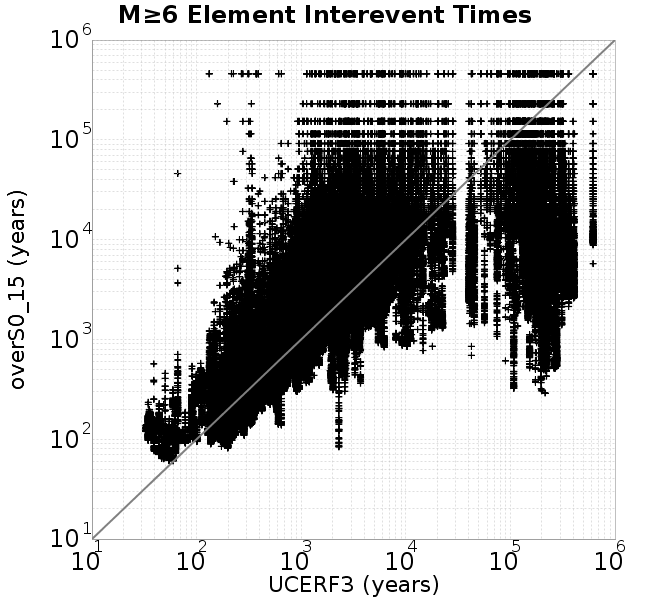 |  |
| **M≥6.5** | 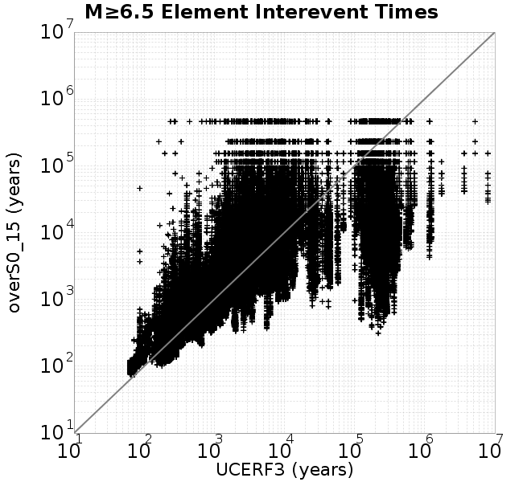 |  |
| **M≥7.0** |  | 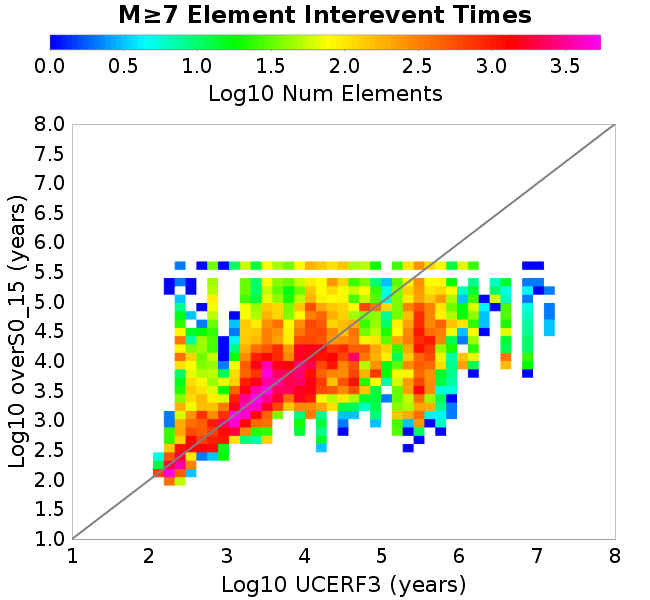 |
| **M≥7.5** |  | 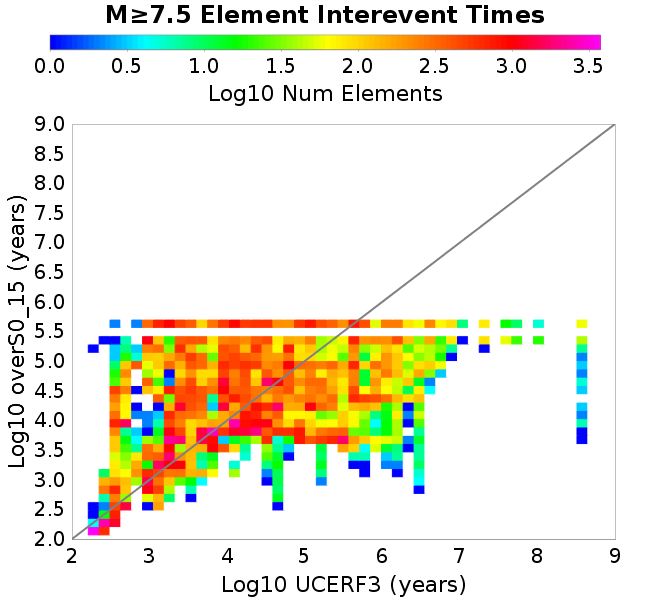 |

#### Subsection Interevent Time Comparisons
*[(top)](#overs0_15)*

*Subsections participate in a rupture if at least 20.0 % of its area ruptures*

| Min Mag | Scatter | 2-D Hist |
|-----|-----|-----|
| **M≥6.0** | 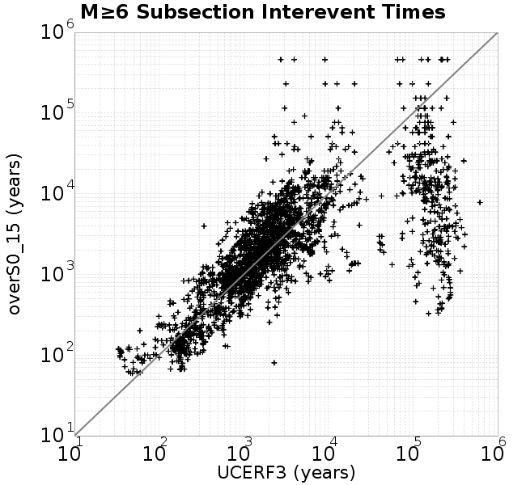 |  |
| **M≥6.5** |  |  |
| **M≥7.0** |  |  |
| **M≥7.5** |  | 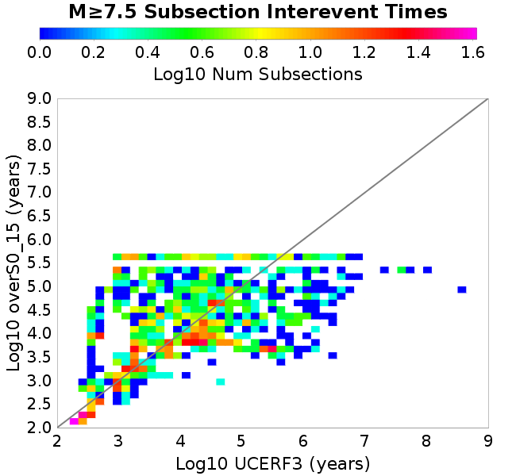 |

### Paleo Open Interval Plots
*[(top)](#overs0_15)*

#### Paleo Open Interval Plots, Biasi and Sharer 2019
*[(top)](#overs0_15)*

These plots use the 5 paleoseismic sites identified in Biasi & Scharer (2019) on the Hayward, N. SAF, S. SAF, and SJC faults. By default, a rupture is counted at a paleo site if the nearest element (at the surface) slips any amount. We also alternatively apply a probability of detection model. Those results are marked as 'Prob. Filtered'.

**Paleoseismic sites table:**

| **Site Name** | Data MRI (yr) | Data Annual Rate | Catalog MRI (yr) | Catalog Annual Rate | Catalog Occurences | Prob Filtered Catalog MRI (yr) | Prob Filtered Catalog Annual Rate | Prob Filtered Catalog Occurences |
|-----|-----|-----|-----|-----|-----|-----|-----|-----|
| **HOG** | 191.00 | 0.005235602 | 354.45 | 0.0028212327 | 1295 | 358.41 | 0.0027901249 | 1280.69 |
| **FRA** | 119.00 | 0.008403362 | 117.60 | 0.008503162 | 3903 | 122.80 | 0.008143122 | 3737.76 |
| **COA** | 181.00 | 0.005524862 | 174.06 | 0.0057450146 | 2637 | 186.23 | 0.0053697918 | 2464.67 |
| **SCZ** | 106.00 | 0.009433962 | 119.89 | 0.008341112 | 3828 | 138.64 | 0.007213088 | 3310.22 |
| **TYS** | 329.00 | 0.0030395137 | 334.50 | 0.0029895725 | 1372 | 374.27 | 0.002671903 | 1226.15 |
| **TOTAL** | 31.61 | 0.0316373 | 35.22 | 0.028394325 | 13033 | 38.20 | 0.026177589 | 12015.11 |

**Paleoseismic Plots:**

| 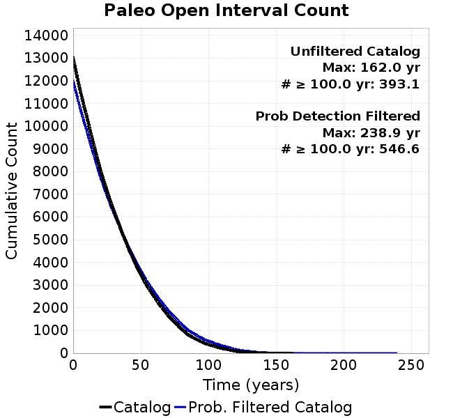 |  |
|-----|-----|

**Open interval probabilities table:**

| **Open Interval (yr)** | Catalog Probability | Catalog Poisson Probability | Prob. Filtered Catalog Probability | Prob. Filtered Catalog Poisson Probability | Data Poisson Probability |
|-----|-----|-----|-----|-----|-----|
| **10.00** | 0.97359604 | 0.75280935 | 0.9774419 | 0.7696835 | 0.72878754 |
| **20.00** | 0.8979688 | 0.566722 | 0.9116783 | 0.5924127 | 0.53113127 |
| **30.00** | 0.7997771 | 0.4266336 | 0.82472694 | 0.45597026 | 0.3870819 |
| **40.00** | 0.6827659 | 0.32117376 | 0.7199572 | 0.3509528 | 0.28210047 |
| **50.00** | 0.55901766 | 0.24178262 | 0.60568506 | 0.2701226 | 0.2055913 |
| **60.00** | 0.4395232 | 0.18201622 | 0.4918984 | 0.20790888 | 0.14983238 |
| **70.00** | 0.3265527 | 0.13702352 | 0.3816496 | 0.16002405 | 0.10919597 |
| **80.00** | 0.22886457 | 0.10315259 | 0.2820216 | 0.123167865 | 0.079580665 |
| **90.00** | 0.15050675 | 0.077654235 | 0.19824998 | 0.09480027 | 0.057997398 |
| **100.00** | 0.09739768 | 0.058458835 | 0.13848738 | 0.0729662 | 0.04226778 |
| **110.00** | 0.05625541 | 0.04400836 | 0.08909821 | 0.056160882 | 0.030804234 |
| **120.00** | 0.026179222 | 0.033129904 | 0.04942497 | 0.043226104 | 0.022449743 |
| **130.00** | 0.011144129 | 0.024940504 | 0.025095308 | 0.03327042 | 0.016361093 |
| **140.00** | 0.0034340825 | 0.018775444 | 0.010027799 | 0.025607694 | 0.011923761 |
| **150.00** | 0.0010758458 | 0.014134331 | 0.0037002505 | 0.019709818 | 0.008689889 |
| **160.00** | 5.208148E-4 | 0.010640456 | 0.0016653857 | 0.015170323 | 0.0063330824 |
| **170.00** | 0.0 | 0.008010236 | 6.9171377E-4 | 0.011676347 | 0.0046154717 |
| **180.00** | 0.0 | 0.00603018 | 3.020079E-4 | 0.0089870915 | 0.0033636983 |
| **190.00** | 0.0 | 0.004539576 | 1.3253307E-4 | 0.006917216 | 0.0024514215 |
| **200.00** | 0.0 | 0.0034174353 | 7.0450624E-5 | 0.005324067 | 0.0017865654 |
| **210.00** | 0.0 | 0.0025726773 | 5.8114783E-5 | 0.0040978463 | 0.0013020267 |
| **220.00** | 0.0 | 0.0019367357 | 4.040887E-5 | 0.0031540447 | 9.489008E-4 |
| **230.00** | 0.0 | 0.0014579927 | 2.65117E-5 | 0.0024276162 | 6.915471E-4 |
| **240.00** | 0.0 | 0.0010975907 | 0.0 | 0.0018684962 | 5.039909E-4 |

#### Paleo Open Interval Plots, UCERF3
*[(top)](#overs0_15)*

These plots use the full set of UCERF3 paleoseismic sites. By default, a rupture is counted at a paleo site if the nearest element (at the surface) slips any amount. We also alternativeslyapply a probability of detection model. Those results are marked as 'Prob. Filtered'.

**Paleoseismic sites table:**

| **Site Name** | Data MRI (yr) | Data Annual Rate | Catalog MRI (yr) | Catalog Annual Rate | Catalog Occurences | Prob Filtered Catalog MRI (yr) | Prob Filtered Catalog Annual Rate | Prob Filtered Catalog Occurences |
|-----|-----|-----|-----|-----|-----|-----|-----|-----|
| **SSanAndreasBurroFlats** | 205.44 | 0.0048677 | 206.41 | 0.0048448322 | 2223 | 235.23 | 0.004251162 | 1950.55 |
| **SSanAndreasIndio** | 277.37 | 0.0036053 | 170.95 | 0.005849628 | 2685 | 181.78 | 0.0055012396 | 2525 |
| **SSAFMCreek1000Palms** | 261.33 | 0.0038266 | 1608.33 | 6.2176294E-4 | 286 | 2316.33 | 4.3171787E-4 | 198.35 |
| **NSanAndreasFortRoss** | 306.28 | 0.003265 | 186.63 | 0.005358065 | 2460 | 189.26 | 0.005283632 | 2425.84 |
| **NSanAndreasNorthCoast** | 263.87 | 0.0037898 | 178.92 | 0.005589035 | 2566 | 183.57 | 0.0054473984 | 2500.95 |
| **CalaverasfaultNorth** | 618.05 | 0.001618 | 164.86 | 0.006065726 | 2784 | 238.08 | 0.0042002606 | 1927.45 |
| **ElsinoreTemecula** | 1019.16 | 9.812E-4 | 679.36 | 0.0014719797 | 676 | 707.96 | 0.0014125 | 648.66 |
| **ElsinoreWhittier** | 3196.93 | 3.128E-4 | 1566.51 | 6.3836016E-4 | 293 | 1640.19 | 6.0968444E-4 | 279.81 |
| **SSAFCarrizoBidart** | 114.71 | 0.0087179 | 118.98 | 0.0084051 | 3858 | 122.67 | 0.008152205 | 3741.92 |
| **SanJacintoHogLake** | 311.78 | 0.0032074 | 354.45 | 0.0028212327 | 1295 | 358.54 | 0.002789098 | 1280.24 |
| **PuenteHills** | 3506.31 | 2.852E-4 | 5131.11 | 1.9488958E-4 | 89 | 5573.27 | 1.7942773E-4 | 81.93 |
| **SanGregorioNorth** | 1019.06 | 9.813E-4 | 387.27 | 0.0025821622 | 1185 | 401.80 | 0.0024887968 | 1142.15 |
| **SanJacintoSuperstition** | 508.26 | 0.0019675 | 1207.69 | 8.2802516E-4 | 379 | 1284.14 | 7.787326E-4 | 356.42 |
| **SSanAndreasWrightwood** | 106.04 | 0.0094304 | 150.65 | 0.0066377837 | 3047 | 152.36 | 0.0065633045 | 3012.81 |
| **SSanAndreasPitmanCanyon** | 173.48 | 0.0057643 | 140.46 | 0.0071193827 | 3268 | 155.81 | 0.006417957 | 2946.01 |
| **SSanAndreasPlungeCreek** | 205.36 | 0.0048695 | 354.37 | 0.0028218816 | 1295 | 439.97 | 0.0022728771 | 1042.89 |
| **FrazierMountianSSAF** | 148.57 | 0.0067307 | 117.60 | 0.008503162 | 3903 | 122.85 | 0.008139941 | 3736.31 |
| **NSanAndreasSantaCruzSeg** | 109.84 | 0.0091041 | 119.89 | 0.008341112 | 3828 | 138.85 | 0.0072022 | 3305.15 |
| **RodgersCreek** | 325.31 | 0.003074 | 168.41 | 0.0059380545 | 2725 | 229.71 | 0.004353288 | 1997.59 |
| **GreenValleyMasonRoad** | 293.31 | 0.0034094 | 1663.33 | 6.012035E-4 | 275 | 2288.96 | 4.3687905E-4 | 199.69 |
| **HaywardfaultNorth** | 318.34 | 0.0031413 | 366.69 | 0.0027271088 | 1251 | 376.89 | 0.00265326 | 1217.14 |
| **HaywardfaultSouth** | 167.57 | 0.0059677 | 334.50 | 0.0029895725 | 1372 | 374.05 | 0.0026734115 | 1226.84 |
| **Compton** | 2658.16 | 3.762E-4 | 6359.69 | 1.5724046E-4 | 72 | 6950.27 | 1.4387921E-4 | 65.93 |
| **SSanAndreasCoachella** | 178.45 | 0.0056037 | 174.06 | 0.0057450146 | 2637 | 185.92 | 0.0053787874 | 2468.74 |
| **ElsinoreGlenIvy** | 179.12 | 0.0055828 | 574.28 | 0.0017413027 | 799 | 616.75 | 0.0016214071 | 744.01 |
| **GarlockCentralallevents** | 1434.93 | 6.969E-4 | 634.83 | 0.0015752345 | 723 | 646.22 | 0.0015474509 | 710.22 |
| **NSanAndreasAlderCreek** | 869.64 | 0.0011499 | 185.65 | 0.0053863917 | 2473 | 188.78 | 0.0052972925 | 2432.09 |
| **SSanAndreasPallettCreek** | 149.30 | 0.006698 | 150.36 | 0.006650859 | 3053 | 152.07 | 0.006575807 | 3018.55 |
| **GarlockWesternallevents** | 1230.16 | 8.129E-4 | 817.80 | 0.0012227868 | 561 | 840.24 | 0.0011901362 | 546.01 |
| **ElsinoreFaultJulian** | 3250.98 | 3.076E-4 | 1249.83 | 8.0010894E-4 | 367 | 1277.33 | 7.8288256E-4 | 359.12 |
| **TOTAL** | 9.08 | 0.1101451 | 14.21 | 0.07037018 | 32300 | 15.77 | 0.063401185 | 29101.28 |

**Paleoseismic Plots:**

|  |  |
|-----|-----|

**Open interval probabilities table:**

| **Open Interval (yr)** | Catalog Probability | Catalog Poisson Probability | Prob. Filtered Catalog Probability | Prob. Filtered Catalog Poisson Probability | Data Poisson Probability |
|-----|-----|-----|-----|-----|-----|
| **10.00** | 0.85457295 | 0.49475044 | 0.8767651 | 0.5304594 | 0.33238843 |
| **20.00** | 0.5928722 | 0.24477798 | 0.641928 | 0.28138715 | 0.110482074 |
| **30.00** | 0.3640054 | 0.12110401 | 0.4214927 | 0.14926445 | 0.036722966 |
| **40.00** | 0.19840734 | 0.05991626 | 0.24942549 | 0.079178736 | 0.012206289 |
| **50.00** | 0.1013846 | 0.029643595 | 0.13867055 | 0.042001102 | 0.004057229 |
| **60.00** | 0.047847033 | 0.014666182 | 0.07080367 | 0.02227988 | 0.001348576 |
| **70.00** | 0.019360924 | 0.0072560995 | 0.03229007 | 0.011818571 | 4.4825108E-4 |
| **80.00** | 0.008724371 | 0.0035899584 | 0.0148885995 | 0.0062692715 | 1.4899348E-4 |
| **90.00** | 0.003559352 | 0.0017761334 | 0.0061462815 | 0.0033255941 | 4.952371E-5 |
| **100.00** | 0.001388431 | 8.787428E-4 | 0.002528837 | 0.0017640926 | 1.6461108E-5 |
| **110.00** | 0.0 | 4.3475837E-4 | 5.273953E-4 | 9.357794E-4 | 5.4714824E-6 |
| **120.00** | 0.0 | 2.150969E-4 | 4.982281E-5 | 4.96393E-4 | 1.8186574E-6 |
| **130.00** | 0.0 | 1.0641928E-4 | 2.492167E-5 | 2.6331632E-4 | 6.045007E-7 |
| **140.00** | 0.0 | 5.2650983E-5 | 1.0458852E-5 | 1.3967861E-4 | 2.0092905E-7 |
| **150.00** | 0.0 | 2.6049096E-5 | 0.0 | 7.4093834E-5 | 6.678649E-8 |

### Moment Release Variability Plots
*[(top)](#overs0_15)*

We first create a tapered moment release time series for the entire catalog. Each event's moment is distributed across a 25 year Hanning (cosine) taper. Here is a plot of a random 2,000 year section of this time series:

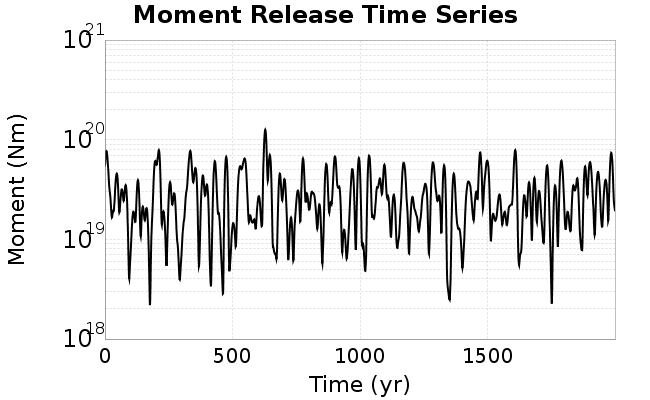

We then compute Welch's power spectral density estimate on the entire time series. Results are plotted below, with a Poisson randomization of the catalog also plotted in a gray line, and the 95% confidence bounds from 200 realizations as a light gray shaded area. Significant deviations outside the Poisson confidence intervals indicate synchronous behaviour.

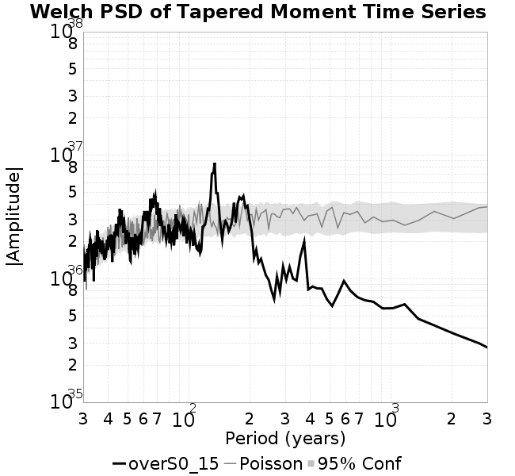

## Input File
*[(top)](#overs0_15)*

```
  A_1 = 0.001
  fA = .1
  B_1 = 0.008
  muSlipAmp_1 = .0
  muSlipInvDist_1 = 1.0
  cohesion = 0.0
  Dc_1 = 1.0000000000000000818e-05
  mu0_1 = 0.6
  ddotStar_1 = 9.9999999999999995475e-07
  ddotAB_1 = 9.9999999999999995475e-07
  alpha_1 = 0.0
  theta0_1 = 200000000
  tau0_1 = 55.1
  sigma0_1 = 100
  sigmaFracPin = .5
  lowSigmaAction = 1
  maxThetaPin = 1.0e13
  ddotEQ_1 = 1
  ddotEQFname = 
  stressOvershootFactor = 0.15
  lameLambda = 30000
  lameMu = 30000
  slowSlip_1 = 0
  nEq = 100000000000
  KZeroFrac = 0
  muPin = 1.0
  tStart = 0
  maxT = 3.16e13
  maxWallTime = 169200
  maxTrans = 1.0000000000000000159e100
  faultFname = UCERF3FM.15km.1km.tri.flt
  outFnameInfix = overS0_15
  writeTau = 2
  writeSigma = 2
  writeSlip = 0
  writeSlipSpeed = 0
  writeState = 0
  writeTheta = 2
  writePED = 1
  writeTransitions = 1
  minDtWrite = 0
  minDtWriteCoseismic = 0
  minDtWriteInterseismic = 0
  minMagWrite = 7.7
  writeStiffness = 0
  stressRateSpecification = 1
  dMu3 = 0.01000000000000000
  initTauFname = 
  initSigmaFname = 
  initThetaFname = 
  initSlipSpeedFname = 
  AFname = 
  BFname =  
  DcFname = 
  mu0Fname = 
  ddotStarFname = 
  ddotABFname = 
  alphaFname = 
  KTauFname = /u/sciteam/gilchris/scratch/stiffness_25a589d/Ktau.25a589d.out
  KSigmaFname = /u/sciteam/gilchris/scratch/stiffness_25a589d/Ksigma.25a589d.out
  tFailFname = 
  tauFailFname = 
  tauDotFname = 
  sigmaDotFname =
  KZeroFname = UCERF3FM.15km.1km.tri.KZero
  pinnedFname =  UCERF3FM.15km.1km.tri.pin
  neighborFname = UCERF3FM.15km.1km.tri.neighbors
  stressRateFname =  
  slowSlipFname = 
  writePatchFname = 
  DEBUG = 0
  ZBrentUpperBracket = 0
  receiverElementAreaFrac = 0.8
  receiverElementIntTol = 1.0e-4
  receiverElementSubdivisionMax = 4
  tgfDist1 = 3
  tgfDist1 = 10
  lowSigmaAction = 1
  highSigmaAction = 0
```
