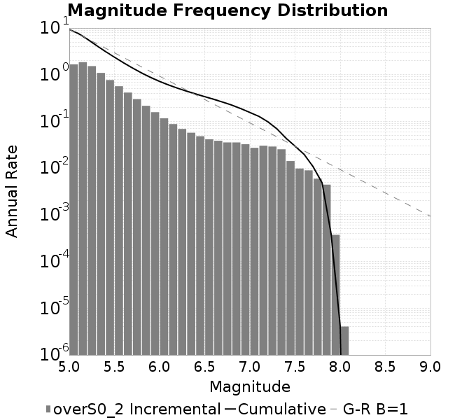
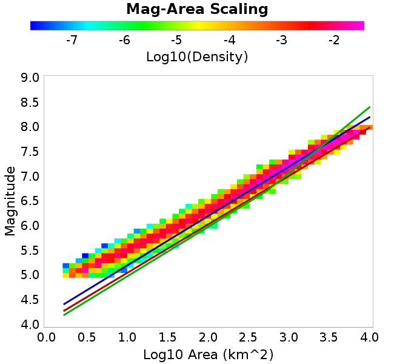

# overS0_2
## Metadata
| **Catalog** | overS0_2 |
|-----|-----|
| **Author** | Jaqcui Gilchrist, 2018/09/27 |
| **Description** | stress overshoot: overshoot=0.2 |
| **Fault/Def Model** | Fault Model 3.1, Geologic |
| **Slip Velocity** | 1.0 m/s |
| **Average Element Area** | 1.35 km^2 |
| **Length** | 9,543,741 events in 498,709 years |
| **Frictional Params** | a=0.001, b=0.008, (b-a)=0.007, ddotEQ=1 |

* [Metadata](#metadata)
* [Plots](#plots)
  * [Magnitude-Frequency Plot](#magnitude-frequency-plot)
  * [Magnitude-Area Plots](#magnitude-area-plots)
  * [Slip-Area Plots](#slip-area-plots)
  * [Rupture Velocity Plots](#rupture-velocity-plots)
  * [Global Interevent-Time Distributions](#global-interevent-time-distributions)
  * [Normalized Fault Interevent-Time Distributions](#normalized-fault-interevent-time-distributions)
  * [Stationarity Plot](#stationarity-plot)
  * [Element/Subsection Interevent Time Comparisons](#elementsubsection-interevent-time-comparisons)
    * [Element Interevent Time Comparisons](#element-interevent-time-comparisons)
    * [Subsection Interevent Time Comparisons](#subsection-interevent-time-comparisons)
  * [Paleo Open Interval Plots](#paleo-open-interval-plots)
    * [Paleo Open Interval Plots, Biasi and Sharer 2019](#paleo-open-interval-plots-biasi-and-sharer-2019)
    * [Paleo Open Interval Plots, UCERF3](#paleo-open-interval-plots-ucerf3)
  * [Moment Release Variability Plots](#moment-release-variability-plots)
* [Input File](#input-file)

## Plots
### Magnitude-Frequency Plot
*[(top)](#overs0_2)*


### Magnitude-Area Plots
*[(top)](#overs0_2)*

| Scatter | 2-D Hist |
|-----|-----|
|  |  |
### Slip-Area Plots
*[(top)](#overs0_2)*

| Scatter | 2-D Hist |
|-----|-----|
|  |  |
### Rupture Velocity Plots
*[(top)](#overs0_2)*

| **Scatter** |  |
|-----|-----|
| **Distance/Velocity** |  |
### Global Interevent-Time Distributions
*[(top)](#overs0_2)*

| **M≥6** | **M≥6.5** | **M≥7** | **M≥7.5** |
|-----|-----|-----|-----|
|  |  |  |  |
### Normalized Fault Interevent-Time Distributions
*[(top)](#overs0_2)*

|  | **M≥6** | **M≥6.5** | **M≥7** | **M≥7.5** |
|-----|-----|-----|-----|-----|
| **Elements** |  |  |  |  |
| **Subsections** |  |  |  |  |
| **Sections** |  |  |  |  |
### Stationarity Plot
*[(top)](#overs0_2)*


### Element/Subsection Interevent Time Comparisons

#### Element Interevent Time Comparisons
*[(top)](#overs0_2)*

| Min Mag | Scatter | 2-D Hist |
|-----|-----|-----|
| **M≥6.0** |  |  |
| **M≥6.5** |  |  |
| **M≥7.0** |  |  |
| **M≥7.5** |  |  |

#### Subsection Interevent Time Comparisons
*[(top)](#overs0_2)*

*Subsections participate in a rupture if at least 20.0 % of its area ruptures*

| Min Mag | Scatter | 2-D Hist |
|-----|-----|-----|
| **M≥6.0** |  |  |
| **M≥6.5** |  |  |
| **M≥7.0** |  |  |
| **M≥7.5** |  |  |

### Paleo Open Interval Plots
*[(top)](#overs0_2)*

#### Paleo Open Interval Plots, Biasi and Sharer 2019
*[(top)](#overs0_2)*

These plots use the 5 paleoseismic sites identified in Biasi & Scharer (2019) on the Hayward, N. SAF, S. SAF, and SJC faults. By default, a rupture is counted at a paleo site if the nearest element (at the surface) slips any amount. We also alternatively apply a probability of detection model. Those results are marked as 'Prob. Filtered'.

**Paleoseismic sites table:**

| **Site Name** | Data MRI (yr) | Data Annual Rate | Catalog MRI (yr) | Catalog Annual Rate | Catalog Occurences | Prob Filtered Catalog MRI (yr) | Prob Filtered Catalog Annual Rate | Prob Filtered Catalog Occurences |
|-----|-----|-----|-----|-----|-----|-----|-----|-----|
| **HOG** | 191.00 | 0.005235602 | 355.99 | 0.0028090894 | 1387 | 359.99 | 0.0027778784 | 1371.58 |
| **FRA** | 119.00 | 0.008403362 | 116.03 | 0.008618159 | 4254 | 121.36 | 0.008240161 | 4067.44 |
| **COA** | 181.00 | 0.005524862 | 171.35 | 0.0058360687 | 2882 | 183.38 | 0.0054530227 | 2692.87 |
| **SCZ** | 106.00 | 0.009433962 | 118.65 | 0.008428063 | 4160 | 136.97 | 0.0073006055 | 3603.45 |
| **TYS** | 329.00 | 0.0030395137 | 324.99 | 0.0030769731 | 1519 | 366.36 | 0.0027295295 | 1347.51 |
| **TOTAL** | 31.61 | 0.0316373 | 34.76 | 0.028767098 | 14202 | 37.74 | 0.026497899 | 13081.72 |

**Paleoseismic Plots:**

|  |  |
|-----|-----|

**Open interval probabilities table:**

| **Open Interval (yr)** | Catalog Probability | Catalog Poisson Probability | Prob. Filtered Catalog Probability | Prob. Filtered Catalog Poisson Probability | Data Poisson Probability |
|-----|-----|-----|-----|-----|-----|
| **10.00** | 0.9715012 | 0.75000834 | 0.9756137 | 0.76722205 | 0.72878754 |
| **20.00** | 0.89750975 | 0.56251246 | 0.9114717 | 0.5886297 | 0.53113127 |
| **30.00** | 0.79239094 | 0.42188904 | 0.8181966 | 0.4516097 | 0.3870819 |
| **40.00** | 0.6744408 | 0.3164203 | 0.7115737 | 0.34648493 | 0.28210047 |
| **50.00** | 0.5564205 | 0.23731785 | 0.6018681 | 0.2658309 | 0.2055913 |
| **60.00** | 0.43358153 | 0.17799036 | 0.4862635 | 0.20395133 | 0.14983238 |
| **70.00** | 0.3216506 | 0.13349426 | 0.37739784 | 0.15647596 | 0.10919597 |
| **80.00** | 0.22620325 | 0.1001218 | 0.27993003 | 0.120051816 | 0.079580665 |
| **90.00** | 0.14899844 | 0.07509218 | 0.19823352 | 0.0921064 | 0.057997398 |
| **100.00** | 0.10047704 | 0.056319762 | 0.14190061 | 0.07066607 | 0.04226778 |
| **110.00** | 0.060501285 | 0.04224029 | 0.09297034 | 0.054216564 | 0.030804234 |
| **120.00** | 0.03039719 | 0.03168057 | 0.052423622 | 0.041596144 | 0.022449743 |
| **130.00** | 0.014933648 | 0.023760691 | 0.028892217 | 0.03191348 | 0.016361093 |
| **140.00** | 0.0052308817 | 0.017820716 | 0.011839178 | 0.024484728 | 0.011923761 |
| **150.00** | 0.0013821186 | 0.013365685 | 0.004451647 | 0.018785223 | 0.008689889 |
| **160.00** | 5.63598E-4 | 0.010024375 | 0.0018196113 | 0.014412438 | 0.0063330824 |
| **170.00** | 3.5757475E-4 | 0.0075183646 | 0.0011285073 | 0.011057541 | 0.0046154717 |
| **180.00** | 0.0 | 0.005638836 | 4.347684E-4 | 0.008483589 | 0.0033636983 |
| **190.00** | 0.0 | 0.004229174 | 2.2162344E-4 | 0.006508797 | 0.0024514215 |
| **200.00** | 0.0 | 0.0031719157 | 7.861688E-5 | 0.0049936925 | 0.0017865654 |
| **210.00** | 0.0 | 0.0023789632 | 4.8829996E-5 | 0.0038312713 | 0.0013020267 |
| **220.00** | 0.0 | 0.0017842422 | 3.067572E-5 | 0.002939436 | 9.489008E-4 |
| **230.00** | 0.0 | 0.0013381965 | 1.3105809E-5 | 0.0022552002 | 6.915471E-4 |
| **240.00** | 0.0 | 0.0010036585 | 0.0 | 0.0017302393 | 5.039909E-4 |

#### Paleo Open Interval Plots, UCERF3
*[(top)](#overs0_2)*

These plots use the full set of UCERF3 paleoseismic sites. By default, a rupture is counted at a paleo site if the nearest element (at the surface) slips any amount. We also alternativeslyapply a probability of detection model. Those results are marked as 'Prob. Filtered'.

**Paleoseismic sites table:**

| **Site Name** | Data MRI (yr) | Data Annual Rate | Catalog MRI (yr) | Catalog Annual Rate | Catalog Occurences | Prob Filtered Catalog MRI (yr) | Prob Filtered Catalog Annual Rate | Prob Filtered Catalog Occurences |
|-----|-----|-----|-----|-----|-----|-----|-----|-----|
| **SSanAndreasBurroFlats** | 205.44 | 0.0048677 | 201.39 | 0.0049655326 | 2452 | 230.88 | 0.00433133 | 2138.72 |
| **SSanAndreasIndio** | 277.37 | 0.0036053 | 168.14 | 0.0059474823 | 2937 | 178.82 | 0.0055921557 | 2761.51 |
| **SSAFMCreek1000Palms** | 261.33 | 0.0038266 | 1681.09 | 5.9485156E-4 | 293 | 2400.13 | 4.1664392E-4 | 204.92 |
| **NSanAndreasFortRoss** | 306.28 | 0.003265 | 183.14 | 0.005460172 | 2696 | 185.98 | 0.005376997 | 2654.93 |
| **NSanAndreasNorthCoast** | 263.87 | 0.0037898 | 173.55 | 0.005762052 | 2845 | 178.62 | 0.0055984245 | 2764.22 |
| **CalaverasfaultNorth** | 618.05 | 0.001618 | 164.78 | 0.0060688066 | 2995 | 237.38 | 0.0042125927 | 2078.74 |
| **ElsinoreTemecula** | 1019.16 | 9.812E-4 | 662.87 | 0.0015085805 | 744 | 690.53 | 0.0014481557 | 714.22 |
| **ElsinoreWhittier** | 3196.93 | 3.128E-4 | 1437.91 | 6.9545227E-4 | 343 | 1533.64 | 6.520428E-4 | 321.48 |
| **SSAFCarrizoBidart** | 114.71 | 0.0087179 | 118.20 | 0.008460012 | 4177 | 122.01 | 0.008196048 | 4046.69 |
| **SanJacintoHogLake** | 311.78 | 0.0032074 | 355.99 | 0.0028090894 | 1387 | 360.12 | 0.0027768833 | 1371.1 |
| **PuenteHills** | 3506.31 | 2.852E-4 | 4726.16 | 2.1158833E-4 | 105 | 5212.61 | 1.9184254E-4 | 95.18 |
| **SanGregorioNorth** | 1019.06 | 9.813E-4 | 376.52 | 0.0026558968 | 1311 | 391.96 | 0.0025513086 | 1259.28 |
| **SanJacintoSuperstition** | 508.26 | 0.0019675 | 1200.57 | 8.329343E-4 | 412 | 1283.89 | 7.788807E-4 | 385.16 |
| **SSanAndreasWrightwood** | 106.04 | 0.0094304 | 150.68 | 0.0066363676 | 3276 | 152.40 | 0.0065615433 | 3239.05 |
| **SSanAndreasPitmanCanyon** | 173.48 | 0.0057643 | 142.92 | 0.0069970614 | 3454 | 156.60 | 0.0063856724 | 3152.2 |
| **SSanAndreasPlungeCreek** | 205.36 | 0.0048695 | 347.26 | 0.0028797216 | 1421 | 431.89 | 0.0023154023 | 1142.3 |
| **FrazierMountianSSAF** | 148.57 | 0.0067307 | 116.03 | 0.008618159 | 4254 | 121.36 | 0.0082401 | 4067.41 |
| **NSanAndreasSantaCruzSeg** | 109.84 | 0.0091041 | 118.65 | 0.008428063 | 4160 | 137.06 | 0.0072961533 | 3601.32 |
| **RodgersCreek** | 325.31 | 0.003074 | 165.14 | 0.006055381 | 2990 | 226.59 | 0.0044132946 | 2179.22 |
| **GreenValleyMasonRoad** | 293.31 | 0.0034094 | 1770.76 | 5.647302E-4 | 279 | 2373.54 | 4.2131153E-4 | 208.09 |
| **HaywardfaultNorth** | 318.34 | 0.0031413 | 360.43 | 0.0027744654 | 1370 | 371.91 | 0.002688844 | 1327.67 |
| **HaywardfaultSouth** | 167.57 | 0.0059677 | 324.99 | 0.0030769731 | 1519 | 366.37 | 0.0027294767 | 1347.52 |
| **Compton** | 2658.16 | 3.762E-4 | 5921.93 | 1.6886376E-4 | 84 | 6572.88 | 1.5214032E-4 | 75.61 |
| **SSanAndreasCoachella** | 178.45 | 0.0056037 | 171.35 | 0.0058360687 | 2882 | 183.45 | 0.0054511703 | 2691.96 |
| **ElsinoreGlenIvy** | 179.12 | 0.0055828 | 561.09 | 0.0017822571 | 880 | 605.60 | 0.0016512533 | 815.24 |
| **GarlockCentralallevents** | 1434.93 | 6.969E-4 | 621.25 | 0.0016096607 | 794 | 632.19 | 0.0015818074 | 780.25 |
| **NSanAndreasAlderCreek** | 869.64 | 0.0011499 | 183.55 | 0.005448016 | 2690 | 186.57 | 0.0053600585 | 2646.56 |
| **SSanAndreasPallettCreek** | 149.30 | 0.006698 | 150.32 | 0.0066525782 | 3284 | 152.11 | 0.0065742116 | 3245.31 |
| **GarlockWesternallevents** | 1230.16 | 8.129E-4 | 812.50 | 0.0012307724 | 608 | 835.50 | 0.0011968855 | 591.23 |
| **ElsinoreFaultJulian** | 3250.98 | 3.076E-4 | 1233.22 | 8.1088644E-4 | 400 | 1258.36 | 7.9468684E-4 | 392.01 |
| **TOTAL** | 9.08 | 0.1101451 | 14.02 | 0.07133896 | 35221 | 15.56 | 0.06425453 | 31723.4 |

**Paleoseismic Plots:**

|  |  |
|-----|-----|

**Open interval probabilities table:**

| **Open Interval (yr)** | Catalog Probability | Catalog Poisson Probability | Prob. Filtered Catalog Probability | Prob. Filtered Catalog Poisson Probability | Data Poisson Probability |
|-----|-----|-----|-----|-----|-----|
| **10.00** | 0.84966725 | 0.48998055 | 0.8727322 | 0.52595204 | 0.33238843 |
| **20.00** | 0.5852074 | 0.24008094 | 0.6348921 | 0.27662554 | 0.110482074 |
| **30.00** | 0.35466647 | 0.11763499 | 0.41220993 | 0.14549176 | 0.036722966 |
| **40.00** | 0.19596724 | 0.057638858 | 0.24471712 | 0.07652169 | 0.012206289 |
| **50.00** | 0.097779706 | 0.02824192 | 0.1342064 | 0.040246736 | 0.004057229 |
| **60.00** | 0.042583328 | 0.01383799 | 0.06653672 | 0.021167852 | 0.001348576 |
| **70.00** | 0.017121982 | 0.0067803464 | 0.030907638 | 0.011133275 | 4.4825108E-4 |
| **80.00** | 0.0072832904 | 0.0033222379 | 0.014232289 | 0.0058555687 | 1.4899348E-4 |
| **90.00** | 0.0020701513 | 0.0016278318 | 0.004826187 | 0.0030797482 | 4.952371E-5 |
| **100.00** | 2.8564417E-4 | 7.9760596E-4 | 0.0016447763 | 0.0016197999 | 1.6461108E-5 |
| **110.00** | 0.0 | 3.9081142E-4 | 4.543976E-4 | 8.51937E-4 | 5.4714824E-6 |
| **120.00** | 0.0 | 1.9148999E-4 | 2.3968714E-4 | 4.48078E-4 | 1.8186574E-6 |
| **130.00** | 0.0 | 9.382637E-5 | 4.48781E-5 | 2.3566752E-4 | 6.045007E-7 |
| **140.00** | 0.0 | 4.5973095E-5 | 3.2264618E-6 | 1.2394981E-4 | 2.0092905E-7 |
| **150.00** | 0.0 | 2.2525923E-5 | 0.0 | 6.5191656E-5 | 6.678649E-8 |

### Moment Release Variability Plots
*[(top)](#overs0_2)*

We first create a tapered moment release time series for the entire catalog. Each event's moment is distributed across a 25 year Hanning (cosine) taper. Here is a plot of a random 2,000 year section of this time series:


We then compute Welch's power spectral density estimate on the entire time series. Results are plotted below, with a Poisson randomization of the catalog also plotted in gray as a control. Significant deviations above the Poisson model indicate synchronization at that period.


## Input File
*[(top)](#overs0_2)*

```
  A_1 = 0.001
  fA = .1
  B_1 = 0.008
  muSlipAmp_1 = .0
  muSlipInvDist_1 = 1.0
  cohesion = 0.0
  Dc_1 = 1.0000000000000000818e-05
  mu0_1 = 0.6
  ddotStar_1 = 9.9999999999999995475e-07
  ddotAB_1 = 9.9999999999999995475e-07
  alpha_1 = 0.0
  theta0_1 = 200000000
  tau0_1 = 55.1
  sigma0_1 = 100
  sigmaFracPin = .5
  lowSigmaAction = 1
  maxThetaPin = 1.0e13
  ddotEQ_1 = 1
  ddotEQFname = 
  stressOvershootFactor = 0.2
  lameLambda = 30000
  lameMu = 30000
  slowSlip_1 = 0
  nEq = 100000000000
  KZeroFrac = 0
  muPin = 1.0
  tStart = 0
  maxT = 3.16e13
  maxWallTime = 169200
  maxTrans = 1.0000000000000000159e100
  faultFname = UCERF3FM.15km.1km.tri.flt
  outFnameInfix = overS0_2
  writeTau = 2
  writeSigma = 2
  writeSlip = 0
  writeSlipSpeed = 0
  writeState = 0
  writeTheta = 2
  writePED = 1
  writeTransitions = 1
  minDtWrite = 0
  minDtWriteCoseismic = 0
  minDtWriteInterseismic = 0
  minMagWrite = 7.7
  writeStiffness = 0
  stressRateSpecification = 1
  dMu3 = 0.01000000000000000
  initTauFname = 
  initSigmaFname = 
  initThetaFname = 
  initSlipSpeedFname = 
  AFname = 
  BFname =  
  DcFname = 
  mu0Fname = 
  ddotStarFname = 
  ddotABFname = 
  alphaFname = 
  KTauFname = /u/sciteam/gilchris/scratch/stiffness_25a589d/Ktau.25a589d.out
  KSigmaFname = /u/sciteam/gilchris/scratch/stiffness_25a589d/Ksigma.25a589d.out
  tFailFname = 
  tauFailFname = 
  tauDotFname = 
  sigmaDotFname =
  KZeroFname = UCERF3FM.15km.1km.tri.KZero
  pinnedFname =  UCERF3FM.15km.1km.tri.pin
  neighborFname = UCERF3FM.15km.1km.tri.neighbors
  stressRateFname =  
  slowSlipFname = 
  writePatchFname = 
  DEBUG = 0
  ZBrentUpperBracket = 0
  receiverElementAreaFrac = 0.8
  receiverElementIntTol = 1.0e-4
  receiverElementSubdivisionMax = 4
  tgfDist1 = 3
  tgfDist1 = 10
  lowSigmaAction = 1
  highSigmaAction = 0
```
