# overS0_25
## Metadata
| **Catalog** | overS0_25 |
|-----|-----|
| **Author** | Jaqcui Gilchrist, 2018/09/27 |
| **Description** | stress overshoot: overshoot=0.25 |
| **Fault/Def Model** | Fault Model 3.1, Geologic |
| **Slip Velocity** | 1.0 m/s |
| **Average Element Area** | 1.35 km^2 |
| **Length** | 9,767,323 events in 519,328 years |
| **Frictional Params** | a=0.001, b=0.008, (b-a)=0.007, ddotEQ=1 |

* [Metadata](#metadata)
* [Plots](#plots)
  * [Magnitude-Frequency Plot](#magnitude-frequency-plot)
  * [Magnitude-Area Plots](#magnitude-area-plots)
  * [Slip-Area Plots](#slip-area-plots)
  * [Rupture Velocity Plots](#rupture-velocity-plots)
  * [Global Interevent-Time Distributions](#global-interevent-time-distributions)
  * [Normalized Fault Interevent-Time Distributions](#normalized-fault-interevent-time-distributions)
  * [Stationarity Plot](#stationarity-plot)
  * [Element/Subsection Interevent Time Comparisons](#elementsubsection-interevent-time-comparisons)
    * [Element Interevent Time Comparisons](#element-interevent-time-comparisons)
    * [Subsection Interevent Time Comparisons](#subsection-interevent-time-comparisons)
  * [Paleo Open Interval Plots](#paleo-open-interval-plots)
    * [Paleo Open Interval Plots, Biasi and Sharer 2019](#paleo-open-interval-plots-biasi-and-sharer-2019)
    * [Paleo Open Interval Plots, UCERF3](#paleo-open-interval-plots-ucerf3)
  * [Moment Release Variability Plots](#moment-release-variability-plots)
* [Input File](#input-file)

## Plots
### Magnitude-Frequency Plot
*[(top)](#overs0_25)*


### Magnitude-Area Plots
*[(top)](#overs0_25)*

| Scatter | 2-D Hist |
|-----|-----|
| 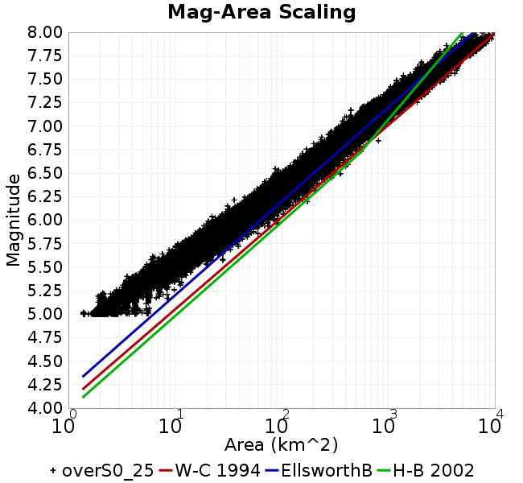 |  |
### Slip-Area Plots
*[(top)](#overs0_25)*

| Scatter | 2-D Hist |
|-----|-----|
|  |  |
### Rupture Velocity Plots
*[(top)](#overs0_25)*

| **Scatter** |  |
|-----|-----|
| **Distance/Velocity** |  |
### Global Interevent-Time Distributions
*[(top)](#overs0_25)*

| **M≥6** | **M≥6.5** | **M≥7** | **M≥7.5** |
|-----|-----|-----|-----|
| 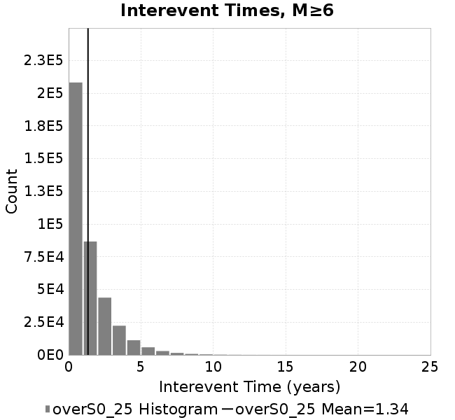 |  | 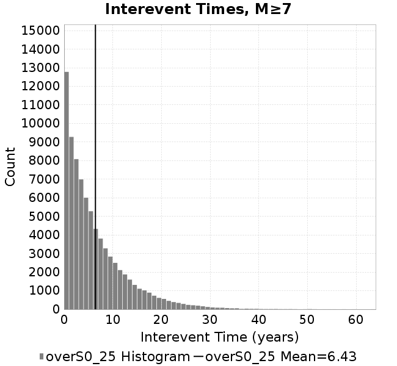 |  |
### Normalized Fault Interevent-Time Distributions
*[(top)](#overs0_25)*

|  | **M≥6** | **M≥6.5** | **M≥7** | **M≥7.5** |
|-----|-----|-----|-----|-----|
| **Elements** |  |  | 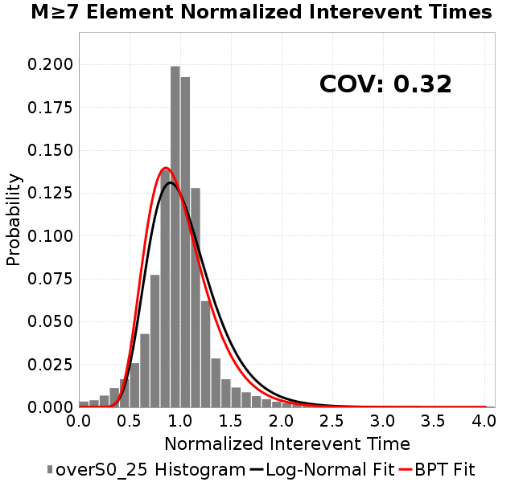 |  |
| **Subsections** | 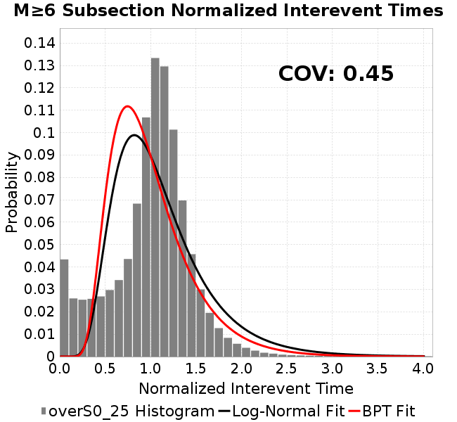 | 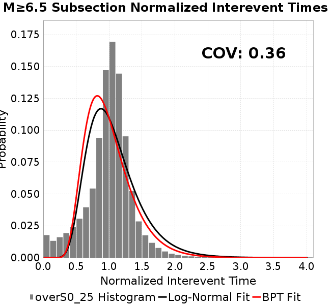 | 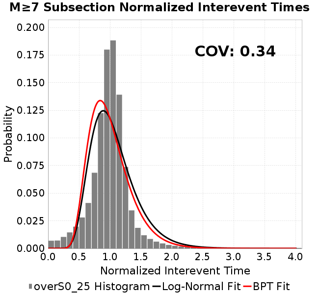 | 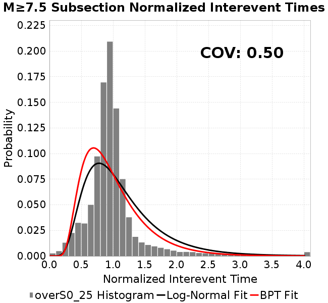 |
| **Sections** |  | 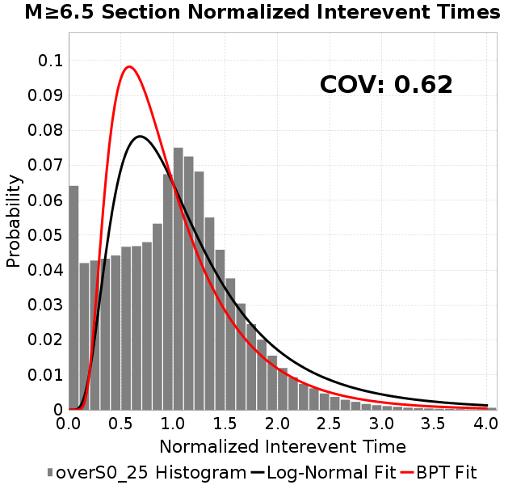 | 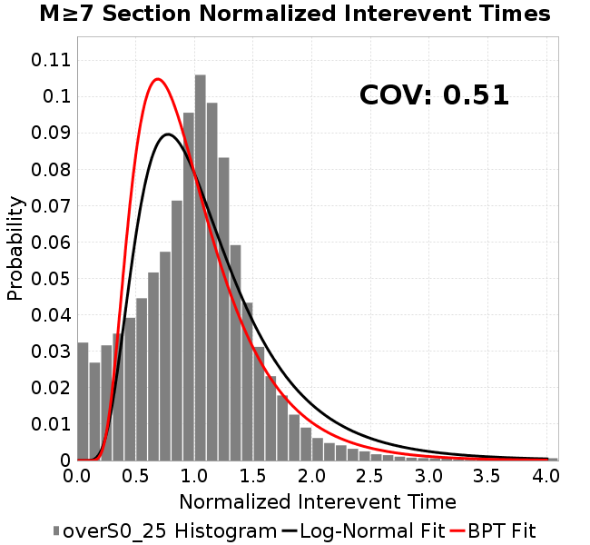 | 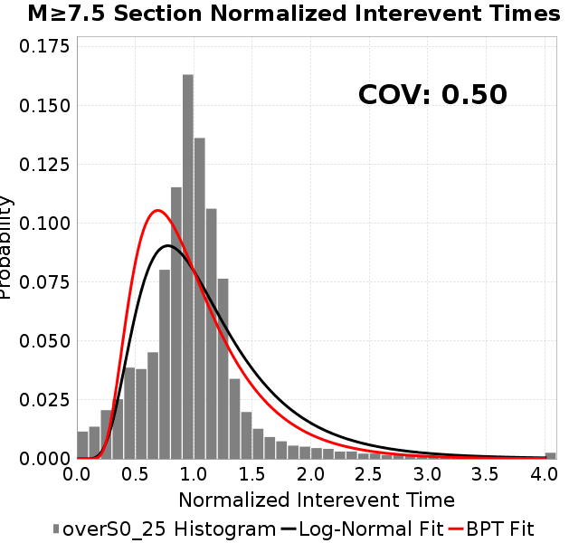 |
### Stationarity Plot
*[(top)](#overs0_25)*

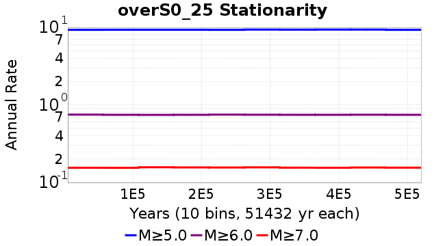
### Element/Subsection Interevent Time Comparisons

#### Element Interevent Time Comparisons
*[(top)](#overs0_25)*

| Min Mag | Scatter | 2-D Hist |
|-----|-----|-----|
| **M≥6.0** | 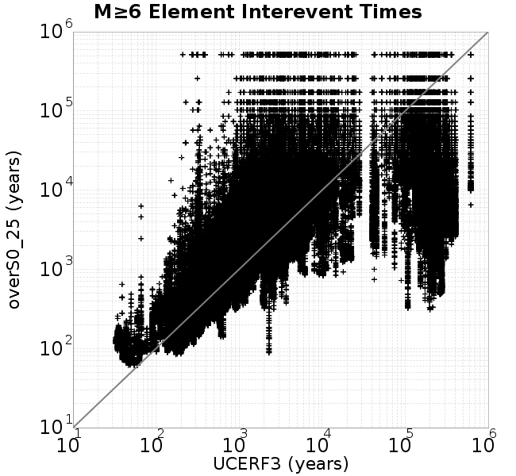 |  |
| **M≥6.5** |  | 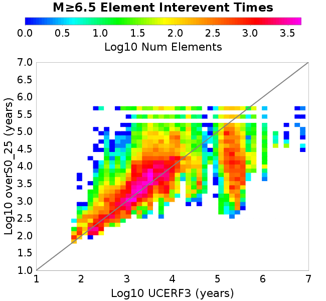 |
| **M≥7.0** | 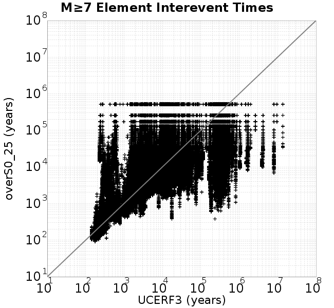 |  |
| **M≥7.5** | 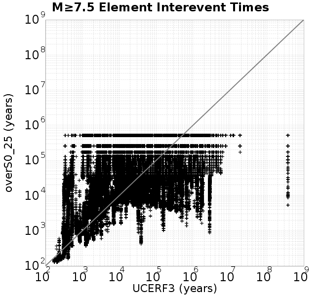 | 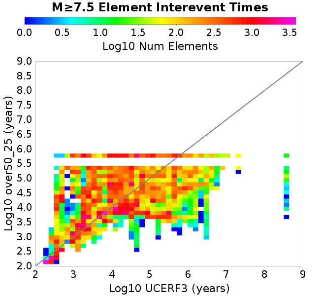 |

#### Subsection Interevent Time Comparisons
*[(top)](#overs0_25)*

*Subsections participate in a rupture if at least 20.0 % of its area ruptures*

| Min Mag | Scatter | 2-D Hist |
|-----|-----|-----|
| **M≥6.0** |  | 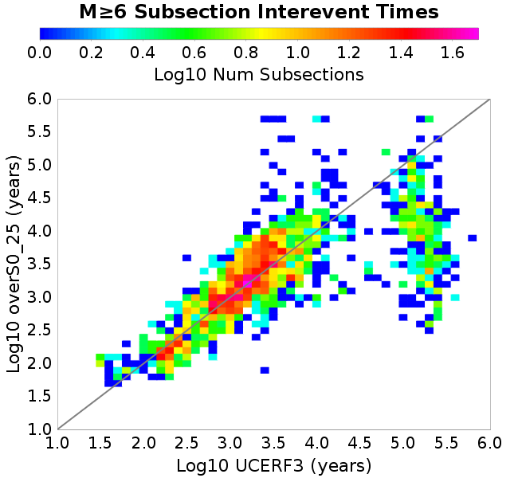 |
| **M≥6.5** | 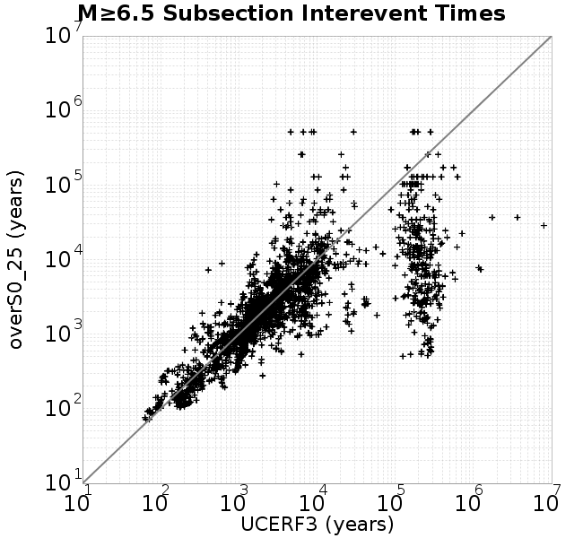 | 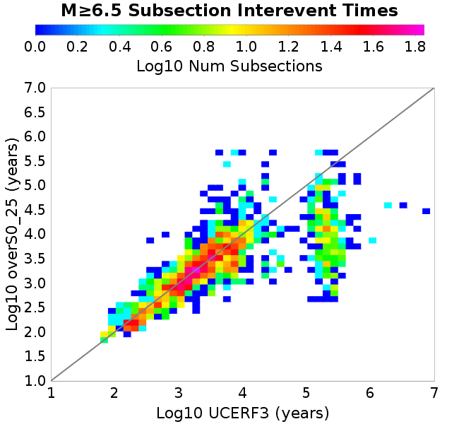 |
| **M≥7.0** | 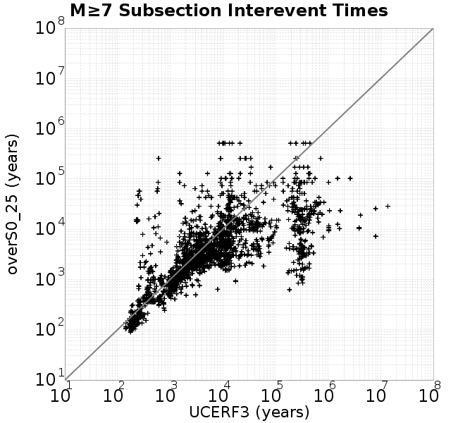 | 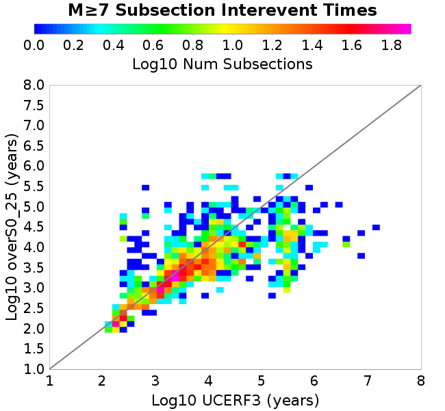 |
| **M≥7.5** | 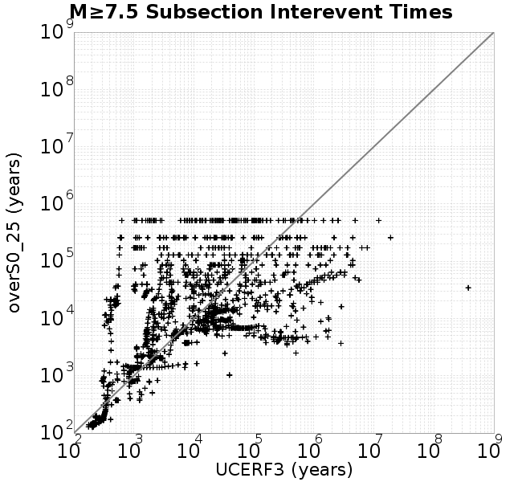 | 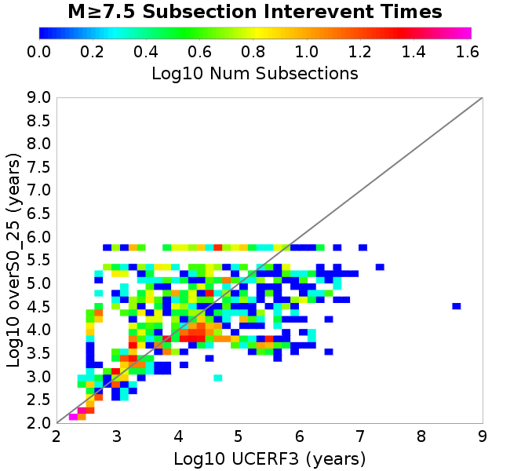 |

### Paleo Open Interval Plots
*[(top)](#overs0_25)*

#### Paleo Open Interval Plots, Biasi and Sharer 2019
*[(top)](#overs0_25)*

These plots use the 5 paleoseismic sites identified in Biasi & Scharer (2019) on the Hayward, N. SAF, S. SAF, and SJC faults. By default, a rupture is counted at a paleo site if the nearest element (at the surface) slips any amount. We also alternatively apply a probability of detection model. Those results are marked as 'Prob. Filtered'.

**Paleoseismic sites table:**

| **Site Name** | Data MRI (yr) | Data Annual Rate | Catalog MRI (yr) | Catalog Annual Rate | Catalog Occurences | Prob Filtered Catalog MRI (yr) | Prob Filtered Catalog Annual Rate | Prob Filtered Catalog Occurences |
|-----|-----|-----|-----|-----|-----|-----|-----|-----|
| **HOG** | 191.00 | 0.005235602 | 358.61 | 0.002788567 | 1435 | 362.64 | 0.0027575311 | 1419.04 |
| **FRA** | 119.00 | 0.008403362 | 114.97 | 0.008697948 | 4473 | 120.17 | 0.008321274 | 4279.3 |
| **COA** | 181.00 | 0.005524862 | 170.08 | 0.0058795246 | 3023 | 182.11 | 0.0054911072 | 2823.34 |
| **SCZ** | 106.00 | 0.009433962 | 118.91 | 0.008409676 | 4324 | 137.25 | 0.0072858185 | 3746.12 |
| **TYS** | 329.00 | 0.0030395137 | 319.17 | 0.0031331654 | 1610 | 361.37 | 0.0027672653 | 1422.01 |
| **TOTAL** | 31.61 | 0.0316373 | 34.60 | 0.0289027 | 14864 | 37.57 | 0.026616573 | 13688.33 |

**Paleoseismic Plots:**

| 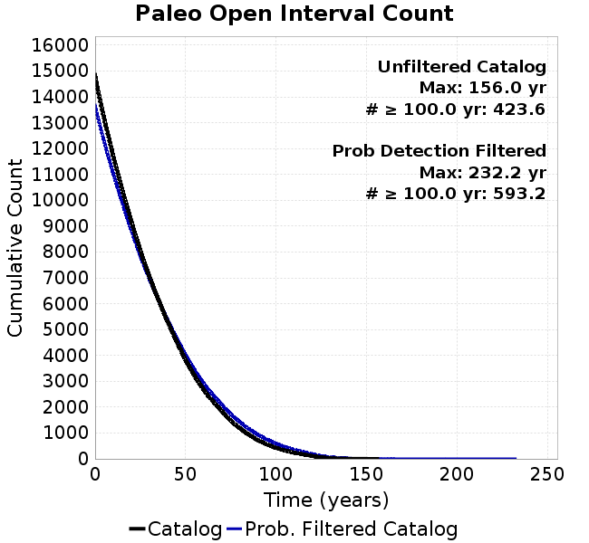 |  |
|-----|-----|

**Open interval probabilities table:**

| **Open Interval (yr)** | Catalog Probability | Catalog Poisson Probability | Prob. Filtered Catalog Probability | Prob. Filtered Catalog Poisson Probability | Data Poisson Probability |
|-----|-----|-----|-----|-----|-----|
| **10.00** | 0.97120756 | 0.74899197 | 0.97542644 | 0.7663121 | 0.72878754 |
| **20.00** | 0.8981779 | 0.560989 | 0.9119273 | 0.58723426 | 0.53113127 |
| **30.00** | 0.7951048 | 0.42017627 | 0.8209384 | 0.45000473 | 0.3870819 |
| **40.00** | 0.67729515 | 0.31470865 | 0.71466804 | 0.34484407 | 0.28210047 |
| **50.00** | 0.5470844 | 0.23571426 | 0.59482926 | 0.2642582 | 0.2055913 |
| **60.00** | 0.425604 | 0.1765481 | 0.47901642 | 0.20250426 | 0.14983238 |
| **70.00** | 0.3211543 | 0.1322331 | 0.37547246 | 0.15518147 | 0.10919597 |
| **80.00** | 0.2254096 | 0.09904154 | 0.27763987 | 0.11891744 | 0.079580665 |
| **90.00** | 0.14862028 | 0.07418132 | 0.19640405 | 0.09112787 | 0.057997398 |
| **100.00** | 0.09371168 | 0.05556121 | 0.13354848 | 0.06983239 | 0.04226778 |
| **110.00** | 0.05567689 | 0.0416149 | 0.08500226 | 0.05351341 | 0.030804234 |
| **120.00** | 0.027857713 | 0.031169228 | 0.048551068 | 0.041007973 | 0.022449743 |
| **130.00** | 0.008380181 | 0.023345502 | 0.019830812 | 0.03142491 | 0.016361093 |
| **140.00** | 0.0016594478 | 0.017485594 | 0.0067375503 | 0.024081288 | 0.011923761 |
| **150.00** | 8.7648816E-4 | 0.01309657 | 0.002950893 | 0.018453782 | 0.008689889 |
| **160.00** | 0.0 | 0.009809226 | 0.0012536132 | 0.0141413575 | 0.0063330824 |
| **170.00** | 0.0 | 0.0073470315 | 5.924801E-4 | 0.010836693 | 0.0046154717 |
| **180.00** | 0.0 | 0.0055028675 | 3.1844218E-4 | 0.00830429 | 0.0033636983 |
| **190.00** | 0.0 | 0.004121604 | 2.0498178E-4 | 0.006363678 | 0.0024514215 |
| **200.00** | 0.0 | 0.0030870482 | 1.2991257E-4 | 0.0048765633 | 0.0017865654 |
| **210.00** | 0.0 | 0.0023121743 | 5.1364354E-5 | 0.0037369695 | 0.0013020267 |
| **220.00** | 0.0 | 0.0017318001 | 3.2330165E-5 | 0.0028636851 | 9.489008E-4 |
| **230.00** | 0.0 | 0.0012971044 | 6.3948496E-6 | 0.0021944765 | 6.915471E-4 |
| **240.00** | 0.0 | 9.715208E-4 | 0.0 | 0.001681654 | 5.039909E-4 |

#### Paleo Open Interval Plots, UCERF3
*[(top)](#overs0_25)*

These plots use the full set of UCERF3 paleoseismic sites. By default, a rupture is counted at a paleo site if the nearest element (at the surface) slips any amount. We also alternativeslyapply a probability of detection model. Those results are marked as 'Prob. Filtered'.

**Paleoseismic sites table:**

| **Site Name** | Data MRI (yr) | Data Annual Rate | Catalog MRI (yr) | Catalog Annual Rate | Catalog Occurences | Prob Filtered Catalog MRI (yr) | Prob Filtered Catalog Annual Rate | Prob Filtered Catalog Occurences |
|-----|-----|-----|-----|-----|-----|-----|-----|-----|
| **SSanAndreasBurroFlats** | 205.44 | 0.0048677 | 198.38 | 0.0050408854 | 2592 | 228.43 | 0.004377675 | 2250.65 |
| **SSanAndreasIndio** | 277.37 | 0.0036053 | 166.66 | 0.0060001505 | 3085 | 177.86 | 0.0056224144 | 2890.8 |
| **SSAFMCreek1000Palms** | 261.33 | 0.0038266 | 1693.06 | 5.906466E-4 | 304 | 2384.71 | 4.1933908E-4 | 215.76 |
| **NSanAndreasFortRoss** | 306.28 | 0.003265 | 180.33 | 0.0055453167 | 2852 | 183.17 | 0.005459406 | 2807.81 |
| **NSanAndreasNorthCoast** | 263.87 | 0.0037898 | 170.47 | 0.0058662486 | 3017 | 176.07 | 0.005679661 | 2921.06 |
| **CalaverasfaultNorth** | 618.05 | 0.001618 | 166.88 | 0.005992458 | 3082 | 239.27 | 0.0041794647 | 2149.4 |
| **ElsinoreTemecula** | 1019.16 | 9.812E-4 | 667.90 | 0.0014972327 | 769 | 695.42 | 0.0014379707 | 738.57 |
| **ElsinoreWhittier** | 3196.93 | 3.128E-4 | 1463.53 | 6.832801E-4 | 351 | 1549.14 | 6.455198E-4 | 331.62 |
| **SSAFCarrizoBidart** | 114.71 | 0.0087179 | 115.85 | 0.008631819 | 4439 | 119.97 | 0.008335469 | 4286.61 |
| **SanJacintoHogLake** | 311.78 | 0.0032074 | 358.61 | 0.002788567 | 1435 | 362.73 | 0.0027569088 | 1418.72 |
| **PuenteHills** | 3506.31 | 2.852E-4 | 4836.71 | 2.0675205E-4 | 106 | 5261.07 | 1.9007522E-4 | 97.2 |
| **SanGregorioNorth** | 1019.06 | 9.813E-4 | 376.71 | 0.0026545522 | 1366 | 391.57 | 0.002553812 | 1314.15 |
| **SanJacintoSuperstition** | 508.26 | 0.0019675 | 1175.22 | 8.5090264E-4 | 438 | 1259.75 | 7.9380546E-4 | 408.59 |
| **SSanAndreasWrightwood** | 106.04 | 0.0094304 | 148.73 | 0.006723794 | 3458 | 150.49 | 0.0066451374 | 3417.55 |
| **SSanAndreasPitmanCanyon** | 173.48 | 0.0057643 | 142.42 | 0.0070213764 | 3611 | 155.01 | 0.0064514023 | 3317.68 |
| **SSanAndreasPlungeCreek** | 205.36 | 0.0048695 | 347.17 | 0.0028804317 | 1481 | 431.88 | 0.0023154586 | 1190.43 |
| **FrazierMountianSSAF** | 148.57 | 0.0067307 | 114.97 | 0.008697948 | 4473 | 120.19 | 0.00832001 | 4278.65 |
| **NSanAndreasSantaCruzSeg** | 109.84 | 0.0091041 | 118.91 | 0.008409676 | 4324 | 137.19 | 0.007289225 | 3747.82 |
| **RodgersCreek** | 325.31 | 0.003074 | 163.57 | 0.006113561 | 3145 | 225.15 | 0.00444157 | 2284.37 |
| **GreenValleyMasonRoad** | 293.31 | 0.0034094 | 1743.43 | 5.73582E-4 | 295 | 2333.41 | 4.285571E-4 | 220.34 |
| **HaywardfaultNorth** | 318.34 | 0.0031413 | 354.01 | 0.0028248022 | 1452 | 365.58 | 0.002735385 | 1406.05 |
| **HaywardfaultSouth** | 167.57 | 0.0059677 | 319.17 | 0.0031331654 | 1610 | 362.21 | 0.0027608557 | 1418.64 |
| **Compton** | 2658.16 | 3.762E-4 | 5671.10 | 1.7633277E-4 | 90 | 6216.25 | 1.608686E-4 | 82.11 |
| **SSanAndreasCoachella** | 178.45 | 0.0056037 | 170.08 | 0.0058795246 | 3023 | 182.02 | 0.00549376 | 2824.68 |
| **ElsinoreGlenIvy** | 179.12 | 0.0055828 | 538.93 | 0.0018555241 | 955 | 585.76 | 0.0017071837 | 878.34 |
| **GarlockCentralallevents** | 1434.93 | 6.969E-4 | 612.35 | 0.0016330458 | 840 | 623.42 | 0.0016040598 | 825.03 |
| **NSanAndreasAlderCreek** | 869.64 | 0.0011499 | 180.14 | 0.005551152 | 2855 | 183.19 | 0.005458744 | 2807.46 |
| **SSanAndreasPallettCreek** | 149.30 | 0.006698 | 148.47 | 0.006735464 | 3464 | 150.26 | 0.0066550965 | 3422.67 |
| **GarlockWesternallevents** | 1230.16 | 8.129E-4 | 791.69 | 0.001263125 | 650 | 814.70 | 0.0012274473 | 631.64 |
| **ElsinoreFaultJulian** | 3250.98 | 3.076E-4 | 1248.21 | 8.011451E-4 | 412 | 1276.29 | 7.835196E-4 | 402.94 |
| **TOTAL** | 9.08 | 0.1101451 | 13.95 | 0.07168464 | 36869 | 15.49 | 0.06456122 | 33205.31 |

**Paleoseismic Plots:**

|  |  |
|-----|-----|

**Open interval probabilities table:**

| **Open Interval (yr)** | Catalog Probability | Catalog Poisson Probability | Prob. Filtered Catalog Probability | Prob. Filtered Catalog Poisson Probability | Data Poisson Probability |
|-----|-----|-----|-----|-----|-----|
| **10.00** | 0.8468361 | 0.48828968 | 0.8706179 | 0.52434146 | 0.33238843 |
| **20.00** | 0.5857266 | 0.2384268 | 0.63584286 | 0.27493396 | 0.110482074 |
| **30.00** | 0.35205346 | 0.11642134 | 0.4095532 | 0.14415927 | 0.036722966 |
| **40.00** | 0.1896028 | 0.05684734 | 0.24118327 | 0.07558868 | 0.012206289 |
| **50.00** | 0.090064175 | 0.027757969 | 0.12770462 | 0.03963428 | 0.004057229 |
| **60.00** | 0.04253787 | 0.0135539295 | 0.06505602 | 0.020781895 | 0.001348576 |
| **70.00** | 0.018866535 | 0.0066182436 | 0.031479053 | 0.0108968085 | 4.4825108E-4 |
| **80.00** | 0.0073487298 | 0.00323162 | 0.014053561 | 0.0057136486 | 1.4899348E-4 |
| **90.00** | 0.0022098613 | 0.0015779667 | 0.005340594 | 0.0029959027 | 4.952371E-5 |
| **100.00** | 6.918626E-4 | 7.705048E-4 | 0.0018900746 | 0.001570876 | 1.6461108E-5 |
| **110.00** | 0.0 | 3.7622955E-4 | 6.775413E-4 | 8.236754E-4 | 5.4714824E-6 |
| **120.00** | 0.0 | 1.8370901E-4 | 2.26123E-4 | 4.3188717E-4 | 1.8186574E-6 |
| **130.00** | 0.0 | 8.970321E-5 | 0.0 | 2.2645634E-4 | 6.045007E-7 |

### Moment Release Variability Plots
*[(top)](#overs0_25)*

We first create a tapered moment release time series for the entire catalog. Each event's moment is distributed across a 25 year Hanning (cosine) taper. Here is a plot of a random 2,000 year section of this time series:


We then compute Welch's power spectral density estimate on the entire time series. Results are plotted below, with a Poisson randomization of the catalog also plotted in a gray line, and the 95% confidence bounds from 200 realizations as a light gray shaded area. Significant deviations outside the Poisson confidence intervals indicate synchronous behaviour.


## Input File
*[(top)](#overs0_25)*

```
  A_1 = 0.001
  fA = .1
  B_1 = 0.008
  muSlipAmp_1 = .0
  muSlipInvDist_1 = 1.0
  cohesion = 0.0
  Dc_1 = 1.0000000000000000818e-05
  mu0_1 = 0.6
  ddotStar_1 = 9.9999999999999995475e-07
  ddotAB_1 = 9.9999999999999995475e-07
  alpha_1 = 0.0
  theta0_1 = 200000000
  tau0_1 = 55.1
  sigma0_1 = 100
  sigmaFracPin = .5
  lowSigmaAction = 1
  maxThetaPin = 1.0e13
  ddotEQ_1 = 1
  ddotEQFname = 
  stressOvershootFactor = 0.25
  lameLambda = 30000
  lameMu = 30000
  slowSlip_1 = 0
  nEq = 100000000000
  KZeroFrac = 0
  muPin = 1.0
  tStart = 0
  maxT = 3.16e13
  maxWallTime = 169200
  maxTrans = 1.0000000000000000159e100
  faultFname = UCERF3FM.15km.1km.tri.flt
  outFnameInfix = overS0_25
  writeTau = 2
  writeSigma = 2
  writeSlip = 0
  writeSlipSpeed = 0
  writeState = 0
  writeTheta = 2
  writePED = 1
  writeTransitions = 1
  minDtWrite = 0
  minDtWriteCoseismic = 0
  minDtWriteInterseismic = 0
  minMagWrite = 7.7
  writeStiffness = 0
  stressRateSpecification = 1
  dMu3 = 0.01000000000000000
  initTauFname = 
  initSigmaFname = 
  initThetaFname = 
  initSlipSpeedFname = 
  AFname = 
  BFname =  
  DcFname = 
  mu0Fname = 
  ddotStarFname = 
  ddotABFname = 
  alphaFname = 
  KTauFname = /u/sciteam/gilchris/scratch/stiffness_25a589d/Ktau.25a589d.out
  KSigmaFname = /u/sciteam/gilchris/scratch/stiffness_25a589d/Ksigma.25a589d.out
  tFailFname = 
  tauFailFname = 
  tauDotFname = 
  sigmaDotFname =
  KZeroFname = UCERF3FM.15km.1km.tri.KZero
  pinnedFname =  UCERF3FM.15km.1km.tri.pin
  neighborFname = UCERF3FM.15km.1km.tri.neighbors
  stressRateFname =  
  slowSlipFname = 
  writePatchFname = 
  DEBUG = 0
  ZBrentUpperBracket = 0
  receiverElementAreaFrac = 0.8
  receiverElementIntTol = 1.0e-4
  receiverElementSubdivisionMax = 4
  tgfDist1 = 3
  tgfDist1 = 10
  lowSigmaAction = 1
  highSigmaAction = 0
```
