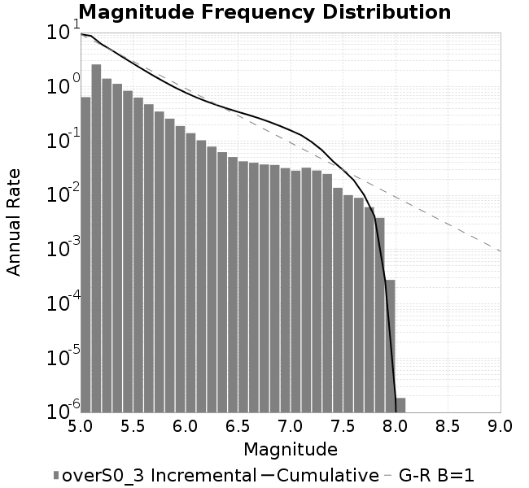
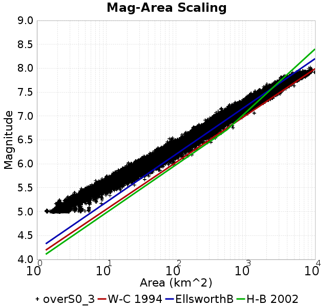
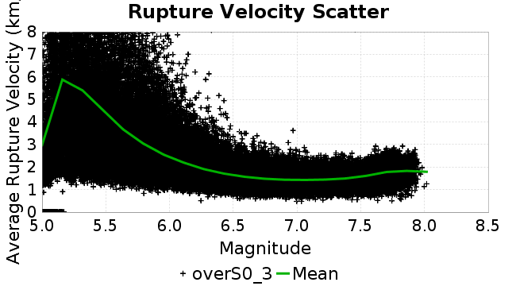
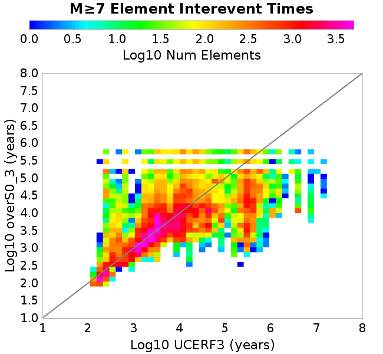
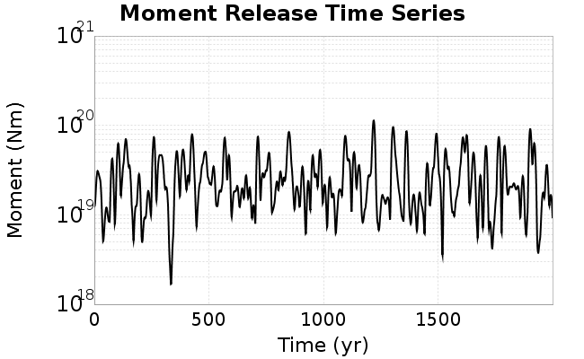
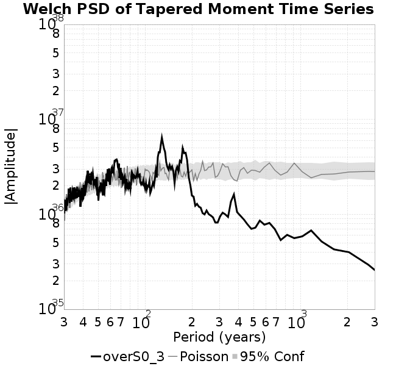

# overS0_3
## Metadata
| **Catalog** | overS0_3 |
|-----|-----|
| **Author** | Jaqcui Gilchrist, 2018/09/27 |
| **Description** | stress overshoot: overshoot=0.3 |
| **Fault/Def Model** | Fault Model 3.1, Geologic |
| **Slip Velocity** | 1.0 m/s |
| **Average Element Area** | 1.35 km^2 |
| **Length** | 10,113,523 events in 548,173 years |
| **Frictional Params** | a=0.001, b=0.008, (b-a)=0.007, ddotEQ=1 |

* [Metadata](#metadata)
* [Plots](#plots)
  * [Magnitude-Frequency Plot](#magnitude-frequency-plot)
  * [Magnitude-Area Plots](#magnitude-area-plots)
  * [Slip-Area Plots](#slip-area-plots)
  * [Rupture Velocity Plots](#rupture-velocity-plots)
  * [Global Interevent-Time Distributions](#global-interevent-time-distributions)
  * [Normalized Fault Interevent-Time Distributions](#normalized-fault-interevent-time-distributions)
  * [Stationarity Plot](#stationarity-plot)
  * [Element/Subsection Interevent Time Comparisons](#elementsubsection-interevent-time-comparisons)
    * [Element Interevent Time Comparisons](#element-interevent-time-comparisons)
    * [Subsection Interevent Time Comparisons](#subsection-interevent-time-comparisons)
  * [Paleo Open Interval Plots](#paleo-open-interval-plots)
    * [Paleo Open Interval Plots, Biasi and Sharer 2019](#paleo-open-interval-plots-biasi-and-sharer-2019)
    * [Paleo Open Interval Plots, UCERF3](#paleo-open-interval-plots-ucerf3)
  * [Moment Release Variability Plots](#moment-release-variability-plots)
* [Input File](#input-file)

## Plots
### Magnitude-Frequency Plot
*[(top)](#overs0_3)*


### Magnitude-Area Plots
*[(top)](#overs0_3)*

| Scatter | 2-D Hist |
|-----|-----|
|  |  |
### Slip-Area Plots
*[(top)](#overs0_3)*

| Scatter | 2-D Hist |
|-----|-----|
|  |  |
### Rupture Velocity Plots
*[(top)](#overs0_3)*

| **Scatter** |  |
|-----|-----|
| **Distance/Velocity** |  |
### Global Interevent-Time Distributions
*[(top)](#overs0_3)*

| **M≥6** | **M≥6.5** | **M≥7** | **M≥7.5** |
|-----|-----|-----|-----|
|  |  |  |  |
### Normalized Fault Interevent-Time Distributions
*[(top)](#overs0_3)*

|  | **M≥6** | **M≥6.5** | **M≥7** | **M≥7.5** |
|-----|-----|-----|-----|-----|
| **Elements** |  |  |  |  |
| **Subsections** |  |  |  |  |
| **Sections** |  |  |  |  |
### Stationarity Plot
*[(top)](#overs0_3)*


### Element/Subsection Interevent Time Comparisons

#### Element Interevent Time Comparisons
*[(top)](#overs0_3)*

| Min Mag | Scatter | 2-D Hist |
|-----|-----|-----|
| **M≥6.0** |  |  |
| **M≥6.5** |  |  |
| **M≥7.0** |  |  |
| **M≥7.5** |  |  |

#### Subsection Interevent Time Comparisons
*[(top)](#overs0_3)*

*Subsections participate in a rupture if at least 20.0 % of its area ruptures*

| Min Mag | Scatter | 2-D Hist |
|-----|-----|-----|
| **M≥6.0** |  |  |
| **M≥6.5** |  |  |
| **M≥7.0** |  |  |
| **M≥7.5** |  |  |

### Paleo Open Interval Plots
*[(top)](#overs0_3)*

#### Paleo Open Interval Plots, Biasi and Sharer 2019
*[(top)](#overs0_3)*

These plots use the 5 paleoseismic sites identified in Biasi & Scharer (2019) on the Hayward, N. SAF, S. SAF, and SJC faults. By default, a rupture is counted at a paleo site if the nearest element (at the surface) slips any amount. We also alternatively apply a probability of detection model. Those results are marked as 'Prob. Filtered'.

**Paleoseismic sites table:**

| **Site Name** | Data MRI (yr) | Data Annual Rate | Catalog MRI (yr) | Catalog Annual Rate | Catalog Occurences | Prob Filtered Catalog MRI (yr) | Prob Filtered Catalog Annual Rate | Prob Filtered Catalog Occurences |
|-----|-----|-----|-----|-----|-----|-----|-----|-----|
| **HOG** | 191.00 | 0.005235602 | 357.07 | 0.0028005806 | 1521 | 361.28 | 0.0027679496 | 1503.28 |
| **FRA** | 119.00 | 0.008403362 | 115.02 | 0.008694097 | 4723 | 119.95 | 0.008337062 | 4529.03 |
| **COA** | 181.00 | 0.005524862 | 163.76 | 0.0061063776 | 3317 | 175.61 | 0.005694402 | 3093.23 |
| **SCZ** | 106.00 | 0.009433962 | 117.81 | 0.008487996 | 4610 | 135.84 | 0.007361869 | 3998.31 |
| **TYS** | 329.00 | 0.0030395137 | 304.78 | 0.003281064 | 1781 | 349.38 | 0.0028622507 | 1553.73 |
| **TOTAL** | 31.61 | 0.0316373 | 34.05 | 0.029368393 | 15952 | 37.01 | 0.02701846 | 14675.6 |

**Paleoseismic Plots:**

|  |  |
|-----|-----|

**Open interval probabilities table:**

| **Open Interval (yr)** | Catalog Probability | Catalog Poisson Probability | Prob. Filtered Catalog Probability | Prob. Filtered Catalog Poisson Probability | Data Poisson Probability |
|-----|-----|-----|-----|-----|-----|
| **10.00** | 0.9701896 | 0.74551207 | 0.9745533 | 0.7632386 | 0.72878754 |
| **20.00** | 0.8940464 | 0.5557883 | 0.9084781 | 0.5825331 | 0.53113127 |
| **30.00** | 0.78726035 | 0.41434687 | 0.8142547 | 0.44461176 | 0.3870819 |
| **40.00** | 0.6619684 | 0.3089006 | 0.7013885 | 0.33934486 | 0.28210047 |
| **50.00** | 0.5370188 | 0.23028912 | 0.5858356 | 0.2590011 | 0.2055913 |
| **60.00** | 0.4128715 | 0.17168333 | 0.46736166 | 0.19767962 | 0.14983238 |
| **70.00** | 0.3126415 | 0.12799199 | 0.36754316 | 0.15087672 | 0.10919597 |
| **80.00** | 0.220288 | 0.09541958 | 0.2716223 | 0.11515494 | 0.079580665 |
| **90.00** | 0.1442906 | 0.071136445 | 0.19110695 | 0.08789069 | 0.057997398 |
| **100.00** | 0.09070344 | 0.05303308 | 0.12923682 | 0.06708156 | 0.04226778 |
| **110.00** | 0.048216958 | 0.039536804 | 0.07721554 | 0.05119924 | 0.030804234 |
| **120.00** | 0.025401475 | 0.029475164 | 0.044076104 | 0.039077234 | 0.022449743 |
| **130.00** | 0.0073386603 | 0.02197409 | 0.018223234 | 0.029825253 | 0.016361093 |
| **140.00** | 5.1372265E-4 | 0.01638195 | 0.00519747 | 0.022763785 | 0.011923761 |
| **150.00** | 0.0 | 0.012212941 | 0.0021740962 | 0.017374199 | 0.008689889 |
| **160.00** | 0.0 | 0.009104895 | 0.0012681813 | 0.013260659 | 0.0063330824 |
| **170.00** | 0.0 | 0.0067878095 | 5.908576E-4 | 0.010121047 | 0.0046154717 |
| **180.00** | 0.0 | 0.0050603943 | 3.2263383E-4 | 0.007724773 | 0.0033636983 |
| **190.00** | 0.0 | 0.003772585 | 1.5669696E-4 | 0.005895845 | 0.0024514215 |
| **200.00** | 0.0 | 0.0028125076 | 5.9907277E-5 | 0.0044999365 | 0.0017865654 |
| **210.00** | 0.0 | 0.0020967585 | 2.8476314E-5 | 0.003434525 | 0.0013020267 |
| **220.00** | 0.0 | 0.0015631587 | 1.615801E-5 | 0.002621362 | 9.489008E-4 |
| **230.00** | 0.0 | 0.0011653537 | 1.14821705E-5 | 0.0020007247 | 6.915471E-4 |
| **240.00** | 0.0 | 8.6878525E-4 | 9.093568E-6 | 0.0015270303 | 5.039909E-4 |
| **250.00** | 0.0 | 6.476899E-4 | 4.6995633E-6 | 0.0011654884 | 3.673023E-4 |
| **260.00** | 0.0 | 4.8286066E-4 | 0.0 | 8.895458E-4 | 2.6768536E-4 |

#### Paleo Open Interval Plots, UCERF3
*[(top)](#overs0_3)*

These plots use the full set of UCERF3 paleoseismic sites. By default, a rupture is counted at a paleo site if the nearest element (at the surface) slips any amount. We also alternativeslyapply a probability of detection model. Those results are marked as 'Prob. Filtered'.

**Paleoseismic sites table:**

| **Site Name** | Data MRI (yr) | Data Annual Rate | Catalog MRI (yr) | Catalog Annual Rate | Catalog Occurences | Prob Filtered Catalog MRI (yr) | Prob Filtered Catalog Annual Rate | Prob Filtered Catalog Occurences |
|-----|-----|-----|-----|-----|-----|-----|-----|-----|
| **SSanAndreasBurroFlats** | 205.44 | 0.0048677 | 194.00 | 0.005154524 | 2800 | 224.59 | 0.0044526053 | 2418.74 |
| **SSanAndreasIndio** | 277.37 | 0.0036053 | 161.23 | 0.006202135 | 3369 | 172.27 | 0.005804767 | 3153.19 |
| **SSAFMCreek1000Palms** | 261.33 | 0.0038266 | 1813.41 | 5.514479E-4 | 299 | 2528.49 | 3.9549277E-4 | 214.32 |
| **NSanAndreasFortRoss** | 306.28 | 0.003265 | 176.84 | 0.0056546913 | 3071 | 179.67 | 0.005565787 | 3022.7 |
| **NSanAndreasNorthCoast** | 263.87 | 0.0037898 | 167.41 | 0.0059733433 | 3244 | 172.67 | 0.0057915035 | 3145.2 |
| **CalaverasfaultNorth** | 618.05 | 0.001618 | 169.70 | 0.005892608 | 3201 | 242.53 | 0.0041231294 | 2239.52 |
| **ElsinoreTemecula** | 1019.16 | 9.812E-4 | 662.11 | 0.0015103165 | 820 | 690.89 | 0.0014474117 | 785.87 |
| **ElsinoreWhittier** | 3196.93 | 3.128E-4 | 1405.49 | 7.114971E-4 | 386 | 1507.23 | 6.6346687E-4 | 359.98 |
| **SSAFCarrizoBidart** | 114.71 | 0.0087179 | 109.90 | 0.009099158 | 4943 | 114.62 | 0.008724451 | 4739.28 |
| **SanJacintoHogLake** | 311.78 | 0.0032074 | 357.07 | 0.0028005806 | 1521 | 361.39 | 0.0027671237 | 1502.82 |
| **PuenteHills** | 3506.31 | 2.852E-4 | 4663.91 | 2.1441228E-4 | 117 | 5119.03 | 1.9534944E-4 | 106.55 |
| **SanGregorioNorth** | 1019.06 | 9.813E-4 | 363.52 | 0.0027509115 | 1495 | 379.32 | 0.0026363125 | 1432.7 |
| **SanJacintoSuperstition** | 508.26 | 0.0019675 | 1165.48 | 8.580156E-4 | 466 | 1246.05 | 8.0253417E-4 | 435.79 |
| **SSanAndreasWrightwood** | 106.04 | 0.0094304 | 146.50 | 0.006825967 | 3708 | 148.30 | 0.006742926 | 3662.82 |
| **SSanAndreasPitmanCanyon** | 173.48 | 0.0057643 | 141.57 | 0.0070635043 | 3837 | 153.31 | 0.0065226182 | 3543.03 |
| **SSanAndreasPlungeCreek** | 205.36 | 0.0048695 | 338.22 | 0.0029566134 | 1606 | 424.45 | 0.0023559637 | 1279.58 |
| **FrazierMountianSSAF** | 148.57 | 0.0067307 | 115.02 | 0.008694097 | 4723 | 119.96 | 0.008336216 | 4528.61 |
| **NSanAndreasSantaCruzSeg** | 109.84 | 0.0091041 | 117.81 | 0.008487996 | 4610 | 135.88 | 0.007359169 | 3996.82 |
| **RodgersCreek** | 325.31 | 0.003074 | 168.06 | 0.005950084 | 3232 | 227.47 | 0.0043961983 | 2388.04 |
| **GreenValleyMasonRoad** | 293.31 | 0.0034094 | 1766.60 | 5.6605786E-4 | 308 | 2378.87 | 4.2036775E-4 | 228.62 |
| **HaywardfaultNorth** | 318.34 | 0.0031413 | 349.47 | 0.0028615014 | 1554 | 361.65 | 0.0027650972 | 1501.67 |
| **HaywardfaultSouth** | 167.57 | 0.0059677 | 304.78 | 0.003281064 | 1781 | 348.76 | 0.0028673185 | 1556.39 |
| **Compton** | 2658.16 | 3.762E-4 | 5774.01 | 1.7318994E-4 | 94 | 6299.04 | 1.5875445E-4 | 86.22 |
| **SSanAndreasCoachella** | 178.45 | 0.0056037 | 163.76 | 0.0061063776 | 3317 | 175.55 | 0.005696483 | 3094.36 |
| **ElsinoreGlenIvy** | 179.12 | 0.0055828 | 535.33 | 0.001868002 | 1015 | 579.86 | 0.0017245662 | 937.12 |
| **GarlockCentralallevents** | 1434.93 | 6.969E-4 | 592.95 | 0.0016864865 | 916 | 606.10 | 0.0016498811 | 896.08 |
| **NSanAndreasAlderCreek** | 869.64 | 0.0011499 | 176.84 | 0.0056546913 | 3071 | 179.97 | 0.0055565354 | 3017.71 |
| **SSanAndreasPallettCreek** | 149.30 | 0.006698 | 146.14 | 0.0068425396 | 3717 | 148.00 | 0.00675679 | 3670.41 |
| **GarlockWesternallevents** | 1230.16 | 8.129E-4 | 763.50 | 0.0013097604 | 712 | 790.52 | 0.0012649853 | 687.66 |
| **ElsinoreFaultJulian** | 3250.98 | 3.076E-4 | 1214.90 | 8.2311337E-4 | 447 | 1241.86 | 8.0524443E-4 | 437.22 |
| **TOTAL** | 9.08 | 0.1101451 | 13.66 | 0.073225394 | 39774 | 15.13 | 0.06611028 | 35909.32 |

**Paleoseismic Plots:**

|  |  |
|-----|-----|

**Open interval probabilities table:**

| **Open Interval (yr)** | Catalog Probability | Catalog Poisson Probability | Prob. Filtered Catalog Probability | Prob. Filtered Catalog Poisson Probability | Data Poisson Probability |
|-----|-----|-----|-----|-----|-----|
| **10.00** | 0.8428015 | 0.48082402 | 0.8662756 | 0.51628166 | 0.33238843 |
| **20.00** | 0.5723852 | 0.23119172 | 0.6217219 | 0.26654673 | 0.110482074 |
| **30.00** | 0.33975682 | 0.111162536 | 0.3961054 | 0.13761318 | 0.036722966 |
| **40.00** | 0.17996013 | 0.053449616 | 0.22856346 | 0.07104716 | 0.012206289 |
| **50.00** | 0.08442897 | 0.025699858 | 0.12001873 | 0.036680344 | 0.004057229 |
| **60.00** | 0.036577903 | 0.012357109 | 0.0590366 | 0.018937388 | 0.001348576 |
| **70.00** | 0.015145009 | 0.005941595 | 0.027459038 | 0.009777025 | 4.4825108E-4 |
| **80.00** | 0.00516333 | 0.0028568613 | 0.011104028 | 0.005047699 | 1.4899348E-4 |
| **90.00** | 0.0013522067 | 0.0013736476 | 0.0037427256 | 0.0026060343 | 4.952371E-5 |
| **100.00** | 6.6488405E-4 | 6.6048274E-4 | 0.0015679741 | 0.0013454476 | 1.6461108E-5 |
| **110.00** | 2.8710198E-4 | 3.1757596E-4 | 5.653293E-4 | 6.946299E-4 | 5.4714824E-6 |
| **120.00** | 0.0 | 1.5269815E-4 | 9.2396E-5 | 3.5862465E-4 | 1.8186574E-6 |
| **130.00** | 0.0 | 7.342093E-5 | 0.0 | 1.8515132E-4 | 6.045007E-7 |

### Moment Release Variability Plots
*[(top)](#overs0_3)*

We first create a tapered moment release time series for the entire catalog. Each event's moment is distributed across a 25 year Hanning (cosine) taper. Here is a plot of a random 2,000 year section of this time series:



We then compute Welch's power spectral density estimate on the entire time series. Results are plotted below, with a Poisson randomization of the catalog also plotted in a gray line, and the 95% confidence bounds from 200 realizations as a light gray shaded area. Significant deviations outside the Poisson confidence intervals indicate synchronous behaviour.



## Input File
*[(top)](#overs0_3)*

```
  A_1 = 0.001
  fA = .1
  B_1 = 0.008
  muSlipAmp_1 = .0
  muSlipInvDist_1 = 1.0
  cohesion = 0.0
  Dc_1 = 1.0000000000000000818e-05
  mu0_1 = 0.6
  ddotStar_1 = 9.9999999999999995475e-07
  ddotAB_1 = 9.9999999999999995475e-07
  alpha_1 = 0.0
  theta0_1 = 200000000
  tau0_1 = 55.1
  sigma0_1 = 100
  sigmaFracPin = .5
  lowSigmaAction = 1
  maxThetaPin = 1.0e13
  ddotEQ_1 = 1
  ddotEQFname = 
  stressOvershootFactor = 0.3
  lameLambda = 30000
  lameMu = 30000
  slowSlip_1 = 0
  nEq = 100000000000
  KZeroFrac = 0
  muPin = 1.0
  tStart = 0
  maxT = 3.16e13
  maxWallTime = 169200
  maxTrans = 1.0000000000000000159e100
  faultFname = UCERF3FM.15km.1km.tri.flt
  outFnameInfix = overS0_3
  writeTau = 2
  writeSigma = 2
  writeSlip = 0
  writeSlipSpeed = 0
  writeState = 0
  writeTheta = 2
  writePED = 1
  writeTransitions = 1
  minDtWrite = 0
  minDtWriteCoseismic = 0
  minDtWriteInterseismic = 0
  minMagWrite = 7.7
  writeStiffness = 0
  stressRateSpecification = 1
  dMu3 = 0.01000000000000000
  initTauFname = 
  initSigmaFname = 
  initThetaFname = 
  initSlipSpeedFname = 
  AFname = 
  BFname =  
  DcFname = 
  mu0Fname = 
  ddotStarFname = 
  ddotABFname = 
  alphaFname = 
  KTauFname = /u/sciteam/gilchris/scratch/stiffness_25a589d/Ktau.25a589d.out
  KSigmaFname = /u/sciteam/gilchris/scratch/stiffness_25a589d/Ksigma.25a589d.out
  tFailFname = 
  tauFailFname = 
  tauDotFname = 
  sigmaDotFname =
  KZeroFname = UCERF3FM.15km.1km.tri.KZero
  pinnedFname =  UCERF3FM.15km.1km.tri.pin
  neighborFname = UCERF3FM.15km.1km.tri.neighbors
  stressRateFname =  
  slowSlipFname = 
  writePatchFname = 
  DEBUG = 0
  ZBrentUpperBracket = 0
  receiverElementAreaFrac = 0.8
  receiverElementIntTol = 1.0e-4
  receiverElementSubdivisionMax = 4
  tgfDist1 = 3
  tgfDist1 = 10
  lowSigmaAction = 1
  highSigmaAction = 0
```
