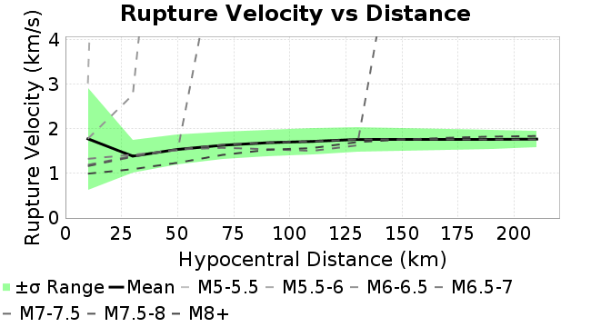
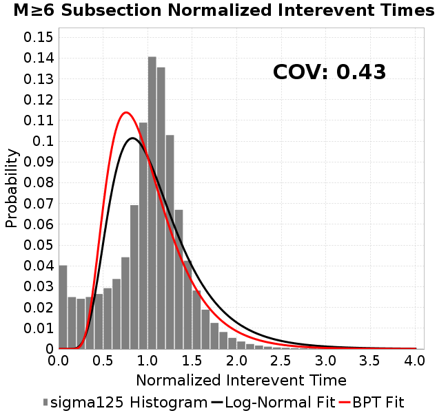
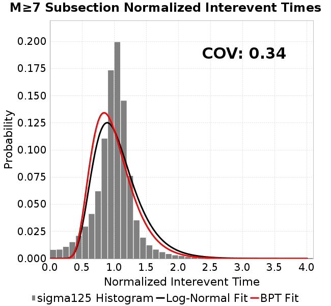

# sigma125
## Metadata
| **Catalog** | sigma125 |
|-----|-----|
| **Author** | Jaqcui Gilchrist, 2018/09/27 |
| **Description** | vary tau/sigma: sigma0=125, tau0=68.75 |
| **Fault/Def Model** | Fault Model 3.1, Geologic |
| **Slip Velocity** | 1.0 m/s |
| **Average Element Area** | 1.35 km^2 |
| **Length** | 8,701,501 events in 553,948 years |
| **Frictional Params** | a=0.001, b=0.008, (b-a)=0.007, ddotEQ=1 |

* [Metadata](#metadata)
* [Plots](#plots)
  * [Magnitude-Frequency Plot](#magnitude-frequency-plot)
  * [Magnitude-Area Plots](#magnitude-area-plots)
  * [Slip-Area Plots](#slip-area-plots)
  * [Rupture Velocity Plots](#rupture-velocity-plots)
  * [Global Interevent-Time Distributions](#global-interevent-time-distributions)
  * [Normalized Fault Interevent-Time Distributions](#normalized-fault-interevent-time-distributions)
  * [Stationarity Plot](#stationarity-plot)
  * [Element/Subsection Interevent Time Comparisons](#elementsubsection-interevent-time-comparisons)
    * [Element Interevent Time Comparisons](#element-interevent-time-comparisons)
    * [Subsection Interevent Time Comparisons](#subsection-interevent-time-comparisons)
  * [Paleo Open Interval Plots](#paleo-open-interval-plots)
    * [Paleo Open Interval Plots, Biasi and Sharer 2019](#paleo-open-interval-plots-biasi-and-sharer-2019)
    * [Paleo Open Interval Plots, UCERF3](#paleo-open-interval-plots-ucerf3)
  * [Moment Release Variability Plots](#moment-release-variability-plots)
* [Input File](#input-file)

## Plots
### Magnitude-Frequency Plot
*[(top)](#sigma125)*


### Magnitude-Area Plots
*[(top)](#sigma125)*

| Scatter | 2-D Hist |
|-----|-----|
|  |  |
### Slip-Area Plots
*[(top)](#sigma125)*

| Scatter | 2-D Hist |
|-----|-----|
|  |  |
### Rupture Velocity Plots
*[(top)](#sigma125)*

| **Scatter** |  |
|-----|-----|
| **Distance/Velocity** |  |
### Global Interevent-Time Distributions
*[(top)](#sigma125)*

| **M≥6** | **M≥6.5** | **M≥7** | **M≥7.5** |
|-----|-----|-----|-----|
|  |  |  |  |
### Normalized Fault Interevent-Time Distributions
*[(top)](#sigma125)*

|  | **M≥6** | **M≥6.5** | **M≥7** | **M≥7.5** |
|-----|-----|-----|-----|-----|
| **Elements** |  |  |  |  |
| **Subsections** |  |  |  |  |
| **Sections** |  |  |  |  |
### Stationarity Plot
*[(top)](#sigma125)*


### Element/Subsection Interevent Time Comparisons

#### Element Interevent Time Comparisons
*[(top)](#sigma125)*

| Min Mag | Scatter | 2-D Hist |
|-----|-----|-----|
| **M≥6.0** |  |  |
| **M≥6.5** |  |  |
| **M≥7.0** |  |  |
| **M≥7.5** |  |  |

#### Subsection Interevent Time Comparisons
*[(top)](#sigma125)*

*Subsections participate in a rupture if at least 20.0 % of its area ruptures*

| Min Mag | Scatter | 2-D Hist |
|-----|-----|-----|
| **M≥6.0** |  |  |
| **M≥6.5** |  |  |
| **M≥7.0** |  |  |
| **M≥7.5** |  |  |

### Paleo Open Interval Plots
*[(top)](#sigma125)*

#### Paleo Open Interval Plots, Biasi and Sharer 2019
*[(top)](#sigma125)*

These plots use the 5 paleoseismic sites identified in Biasi & Scharer (2019) on the Hayward, N. SAF, S. SAF, and SJC faults. By default, a rupture is counted at a paleo site if the nearest element (at the surface) slips any amount. We also alternatively apply a probability of detection model. Those results are marked as 'Prob. Filtered'.

**Paleoseismic sites table:**

| **Site Name** | Data MRI (yr) | Data Annual Rate | Catalog MRI (yr) | Catalog Annual Rate | Catalog Occurences | Prob Filtered Catalog MRI (yr) | Prob Filtered Catalog Annual Rate | Prob Filtered Catalog Occurences |
|-----|-----|-----|-----|-----|-----|-----|-----|-----|
| **HOG** | 191.00 | 0.005235602 | 446.96 | 0.002237348 | 1229 | 451.86 | 0.0022130979 | 1215.69 |
| **FRA** | 119.00 | 0.008403362 | 146.39 | 0.0068311905 | 3750 | 151.24 | 0.006611835 | 3629.48 |
| **COA** | 181.00 | 0.005524862 | 219.77 | 0.0045501147 | 2498 | 230.54 | 0.0043376684 | 2381.4 |
| **SCZ** | 106.00 | 0.009433962 | 149.95 | 0.006668951 | 3661 | 165.05 | 0.0060588787 | 3326 |
| **TYS** | 329.00 | 0.0030395137 | 424.83 | 0.0023538808 | 1293 | 457.22 | 0.0021871093 | 1201.42 |
| **TOTAL** | 31.61 | 0.0316373 | 44.16 | 0.022643916 | 12431 | 46.71 | 0.021406494 | 11751.64 |

**Paleoseismic Plots:**

|  |  |
|-----|-----|

**Open interval probabilities table:**

| **Open Interval (yr)** | Catalog Probability | Catalog Poisson Probability | Prob. Filtered Catalog Probability | Prob. Filtered Catalog Poisson Probability | Data Poisson Probability |
|-----|-----|-----|-----|-----|-----|
| **10.00** | 0.98213327 | 0.7973679 | 0.98407084 | 0.807296 | 0.72878754 |
| **20.00** | 0.93296665 | 0.6357955 | 0.93940514 | 0.6517268 | 0.53113127 |
| **30.00** | 0.86495423 | 0.5069629 | 0.8773457 | 0.5261364 | 0.3870819 |
| **40.00** | 0.7789827 | 0.4042359 | 0.7979907 | 0.42474777 | 0.28210047 |
| **50.00** | 0.68474925 | 0.32232472 | 0.7096219 | 0.34289715 | 0.2055913 |
| **60.00** | 0.58167505 | 0.25701135 | 0.61276734 | 0.2768195 | 0.14983238 |
| **70.00** | 0.48261368 | 0.2049326 | 0.5180043 | 0.22347526 | 0.10919597 |
| **80.00** | 0.38911325 | 0.16340667 | 0.42672798 | 0.18041067 | 0.079580665 |
| **90.00** | 0.3105448 | 0.13029523 | 0.34806994 | 0.1456448 | 0.057997398 |
| **100.00** | 0.24127981 | 0.10389322 | 0.27632725 | 0.11757846 | 0.04226778 |
| **110.00** | 0.17869875 | 0.08284111 | 0.21244419 | 0.09492062 | 0.030804234 |
| **120.00** | 0.12487547 | 0.06605484 | 0.1548876 | 0.07662903 | 0.022449743 |
| **130.00** | 0.08478479 | 0.05267001 | 0.10999185 | 0.06186231 | 0.016361093 |
| **140.00** | 0.05124343 | 0.041997373 | 0.07197205 | 0.04994119 | 0.011923761 |
| **150.00** | 0.028255438 | 0.033487353 | 0.043366846 | 0.04031732 | 0.008689889 |
| **160.00** | 0.011670293 | 0.026701739 | 0.022406545 | 0.03254801 | 0.0063330824 |
| **170.00** | 0.0049156807 | 0.021291109 | 0.010782492 | 0.026275877 | 0.0046154717 |
| **180.00** | 0.0026896955 | 0.016976846 | 0.00580134 | 0.02121241 | 0.0033636983 |
| **190.00** | 0.0010116099 | 0.013536791 | 0.0025550206 | 0.017124692 | 0.0024514215 |
| **200.00** | 6.1499747E-4 | 0.010793802 | 0.0012300868 | 0.013824695 | 0.0017865654 |
| **210.00** | 4.6608472E-4 | 0.00860663 | 7.9486234E-4 | 0.0111606205 | 0.0013020267 |
| **220.00** | 0.0 | 0.0068626506 | 2.1667872E-4 | 0.009009924 | 9.489008E-4 |
| **230.00** | 0.0 | 0.005472057 | 1.3920176E-4 | 0.007273675 | 6.915471E-4 |
| **240.00** | 0.0 | 0.0043632425 | 9.5749565E-5 | 0.0058720084 | 5.039909E-4 |
| **250.00** | 0.0 | 0.0034791091 | 5.764608E-5 | 0.0047404487 | 3.673023E-4 |
| **260.00** | 0.0 | 0.0027741299 | 3.284759E-5 | 0.003826945 | 2.6768536E-4 |
| **270.00** | 0.0 | 0.002212002 | 2.6125937E-5 | 0.0030894773 | 1.9508575E-4 |
| **280.00** | 0.0 | 0.0017637792 | 1.2207543E-5 | 0.0024941226 | 1.4217607E-4 |
| **290.00** | 0.0 | 0.0014063809 | 0.0 | 0.002013495 | 1.0361615E-4 |

#### Paleo Open Interval Plots, UCERF3
*[(top)](#sigma125)*

These plots use the full set of UCERF3 paleoseismic sites. By default, a rupture is counted at a paleo site if the nearest element (at the surface) slips any amount. We also alternativeslyapply a probability of detection model. Those results are marked as 'Prob. Filtered'.

**Paleoseismic sites table:**

| **Site Name** | Data MRI (yr) | Data Annual Rate | Catalog MRI (yr) | Catalog Annual Rate | Catalog Occurences | Prob Filtered Catalog MRI (yr) | Prob Filtered Catalog Annual Rate | Prob Filtered Catalog Occurences |
|-----|-----|-----|-----|-----|-----|-----|-----|-----|
| **SSanAndreasBurroFlats** | 205.44 | 0.0048677 | 259.38 | 0.0038552766 | 2117 | 282.93 | 0.0035344262 | 1940.63 |
| **SSanAndreasIndio** | 277.37 | 0.0036053 | 215.54 | 0.0046394044 | 2547 | 224.30 | 0.0044583105 | 2447.62 |
| **SSAFMCreek1000Palms** | 261.33 | 0.0038266 | 2045.02 | 4.8899365E-4 | 269 | 2689.34 | 3.718387E-4 | 204.44 |
| **NSanAndreasFortRoss** | 306.28 | 0.003265 | 237.49 | 0.0042106723 | 2311 | 240.13 | 0.004164353 | 2285.58 |
| **NSanAndreasNorthCoast** | 263.87 | 0.0037898 | 225.95 | 0.0044257627 | 2429 | 230.01 | 0.0043476573 | 2386.12 |
| **CalaverasfaultNorth** | 618.05 | 0.001618 | 206.29 | 0.004847467 | 2660 | 273.68 | 0.0036539645 | 2004.85 |
| **ElsinoreTemecula** | 1019.16 | 9.812E-4 | 854.40 | 0.0011704118 | 643 | 874.95 | 0.001142921 | 627.9 |
| **ElsinoreWhittier** | 3196.93 | 3.128E-4 | 1901.85 | 5.258028E-4 | 289 | 1961.74 | 5.097503E-4 | 280.15 |
| **SSAFCarrizoBidart** | 114.71 | 0.0087179 | 151.79 | 0.006587907 | 3616 | 154.84 | 0.006458446 | 3544.95 |
| **SanJacintoHogLake** | 311.78 | 0.0032074 | 446.96 | 0.002237348 | 1229 | 451.93 | 0.0022127149 | 1215.47 |
| **PuenteHills** | 3506.31 | 2.852E-4 | 6165.47 | 1.6219365E-4 | 89 | 6582.73 | 1.5191271E-4 | 83.4 |
| **SanGregorioNorth** | 1019.06 | 9.813E-4 | 506.70 | 0.0019735368 | 1083 | 517.10 | 0.0019338557 | 1061.2 |
| **SanJacintoSuperstition** | 508.26 | 0.0019675 | 1502.23 | 6.656778E-4 | 365 | 1572.00 | 6.361315E-4 | 348.78 |
| **SSanAndreasWrightwood** | 106.04 | 0.0094304 | 191.01 | 0.005235303 | 2874 | 193.08 | 0.005179087 | 2843.15 |
| **SSanAndreasPitmanCanyon** | 173.48 | 0.0057643 | 180.46 | 0.00554144 | 3042 | 194.69 | 0.0051364405 | 2819.69 |
| **SSanAndreasPlungeCreek** | 205.36 | 0.0048695 | 454.92 | 0.0021981897 | 1207 | 526.74 | 0.0018984829 | 1042.34 |
| **FrazierMountianSSAF** | 148.57 | 0.0067307 | 146.39 | 0.0068311905 | 3750 | 151.27 | 0.00661063 | 3628.74 |
| **NSanAndreasSantaCruzSeg** | 109.84 | 0.0091041 | 149.95 | 0.006668951 | 3661 | 164.85 | 0.006066271 | 3330.21 |
| **RodgersCreek** | 325.31 | 0.003074 | 206.23 | 0.0048490046 | 2661 | 262.14 | 0.0038148037 | 2093.43 |
| **GreenValleyMasonRoad** | 293.31 | 0.0034094 | 2196.15 | 4.5534314E-4 | 250 | 2721.26 | 3.6747687E-4 | 201.66 |
| **HaywardfaultNorth** | 318.34 | 0.0031413 | 464.75 | 0.0021516879 | 1181 | 472.47 | 0.0021165216 | 1161.67 |
| **HaywardfaultSouth** | 167.57 | 0.0059677 | 424.83 | 0.0023538808 | 1293 | 457.52 | 0.0021856998 | 1200.62 |
| **Compton** | 2658.16 | 3.762E-4 | 7533.54 | 1.3273973E-4 | 72 | 8015.64 | 1.2475606E-4 | 67.66 |
| **SSanAndreasCoachella** | 178.45 | 0.0056037 | 219.77 | 0.0045501147 | 2498 | 230.63 | 0.0043360246 | 2380.5 |
| **ElsinoreGlenIvy** | 179.12 | 0.0055828 | 737.68 | 0.0013556066 | 744 | 777.45 | 0.0012862483 | 705.92 |
| **GarlockCentralallevents** | 1434.93 | 6.969E-4 | 806.51 | 0.001239915 | 681 | 817.17 | 0.0012237385 | 672.12 |
| **NSanAndreasAlderCreek** | 869.64 | 0.0011499 | 237.90 | 0.004203381 | 2307 | 240.67 | 0.0041550407 | 2280.47 |
| **SSanAndreasPallettCreek** | 149.30 | 0.006698 | 191.14 | 0.005231659 | 2872 | 193.09 | 0.0051790564 | 2843.11 |
| **GarlockWesternallevents** | 1230.16 | 8.129E-4 | 1035.94 | 9.6530945E-4 | 529 | 1052.36 | 9.502467E-4 | 520.75 |
| **ElsinoreFaultJulian** | 3250.98 | 3.076E-4 | 1587.92 | 6.2975555E-4 | 345 | 1609.63 | 6.212612E-4 | 340.36 |
| **TOTAL** | 9.08 | 0.1101451 | 17.95 | 0.055715326 | 30585 | 19.40 | 0.05154268 | 28294.36 |

**Paleoseismic Plots:**

|  |  |
|-----|-----|

**Open interval probabilities table:**

| **Open Interval (yr)** | Catalog Probability | Catalog Poisson Probability | Prob. Filtered Catalog Probability | Prob. Filtered Catalog Poisson Probability | Data Poisson Probability |
|-----|-----|-----|-----|-----|-----|
| **10.00** | 0.8984894 | 0.5728375 | 0.9106896 | 0.59724563 | 0.33238843 |
| **20.00** | 0.7017404 | 0.32814273 | 0.73174834 | 0.35670236 | 0.110482074 |
| **30.00** | 0.50470155 | 0.18797246 | 0.5453063 | 0.21303892 | 0.036722966 |
| **40.00** | 0.33523092 | 0.10767766 | 0.37749186 | 0.12723656 | 0.012206289 |
| **50.00** | 0.20705758 | 0.0616818 | 0.2457889 | 0.07599148 | 0.004057229 |
| **60.00** | 0.11889998 | 0.035333645 | 0.14952011 | 0.04538558 | 0.001348576 |
| **70.00** | 0.0647127 | 0.020240435 | 0.087511405 | 0.027106341 | 4.4825108E-4 |
| **80.00** | 0.033548273 | 0.011594479 | 0.04826193 | 0.016189143 | 1.4899348E-4 |
| **90.00** | 0.015532361 | 0.0066417516 | 0.025373204 | 0.009668895 | 4.952371E-5 |
| **100.00** | 0.0061066416 | 0.003804644 | 0.011490756 | 0.0057747057 | 1.6461108E-5 |
| **110.00** | 0.002801524 | 0.0021794427 | 0.005180633 | 0.0034489178 | 5.4714824E-6 |
| **120.00** | 0.0011590587 | 0.0012484664 | 0.0024162638 | 0.002059851 | 1.8186574E-6 |
| **130.00** | 4.790722E-4 | 7.151683E-4 | 6.7483226E-4 | 0.0012302371 | 6.045007E-7 |
| **140.00** | 3.4087972E-4 | 4.0967518E-4 | 4.6280297E-4 | 7.3475373E-4 | 2.0092905E-7 |
| **150.00** | 0.0 | 2.346773E-4 | 1.9729061E-5 | 4.3882846E-4 | 6.678649E-8 |
| **160.00** | 0.0 | 1.3443195E-4 | 7.490871E-6 | 2.6208838E-4 | 2.2199057E-8 |
| **170.00** | 0.0 | 7.700765E-5 | 0.0 | 1.5653114E-4 | 7.37871E-9 |

### Moment Release Variability Plots
*[(top)](#sigma125)*

We first create a tapered moment release time series for the entire catalog. Each event's moment is distributed across a 25 year Hanning (cosine) taper. Here is a plot of a random 2,000 year section of this time series:


We then compute Welch's power spectral density estimate on the entire time series. Results are plotted below, with a Poisson randomization of the catalog also plotted in gray as a control. Significant deviations above the Poisson model indicate synchronization at that period.


## Input File
*[(top)](#sigma125)*

```
  A_1 = 0.001
  fA = .1
  B_1 = 0.008
  muSlipAmp_1 = .0
  muSlipInvDist_1 = 1.0
  cohesion = 0.0
  Dc_1 = 1.0000000000000000818e-05
  mu0_1 = 0.6
  ddotStar_1 = 9.9999999999999995475e-07
  ddotAB_1 = 9.9999999999999995475e-07
  alpha_1 = 0.0
  theta0_1 = 200000000
  tau0_1 = 68.75
  sigma0_1 = 125
  sigmaFracPin = .5
  lowSigmaAction = 1
  maxThetaPin = 1.0e13
  ddotEQ_1 = 1
  ddotEQFname = 
  stressOvershootFactor = 0.10000000000000000555
  lameLambda = 30000
  lameMu = 30000
  slowSlip_1 = 0
  nEq = 100000000000
  KZeroFrac = 0
  muPin = 1.0
  tStart = 0
  maxT = 3.16e13
  maxWallTime = 169200
  maxTrans = 1.0000000000000000159e100
  faultFname = UCERF3FM.15km.1km.tri.flt
  outFnameInfix = sigma125
  writeTau = 2
  writeSigma = 2
  writeSlip = 0
  writeSlipSpeed = 0
  writeState = 0
  writeTheta = 2
  writePED = 1
  writeTransitions = 1
  minDtWrite = 0
  minDtWriteCoseismic = 0
  minDtWriteInterseismic = 0
  minMagWrite = 7.7
  writeStiffness = 0
  stressRateSpecification = 1
  dMu3 = 0.01000000000000000
  initTauFname = 
  initSigmaFname = 
  initThetaFname = 
  initSlipSpeedFname = 
  AFname = 
  BFname =  
  DcFname = 
  mu0Fname = 
  ddotStarFname = 
  ddotABFname = 
  alphaFname = 
  KTauFname = /u/sciteam/gilchris/scratch/stiffness_25a589d/Ktau.25a589d.out
  KSigmaFname = /u/sciteam/gilchris/scratch/stiffness_25a589d/Ksigma.25a589d.out
  tFailFname = 
  tauFailFname = 
  tauDotFname = 
  sigmaDotFname =
  KZeroFname = UCERF3FM.15km.1km.tri.KZero
  pinnedFname =  UCERF3FM.15km.1km.tri.pin
  neighborFname = UCERF3FM.15km.1km.tri.neighbors
  stressRateFname =  
  slowSlipFname = 
  writePatchFname = 
  DEBUG = 0
  ZBrentUpperBracket = 0
  receiverElementAreaFrac = 0.8
  receiverElementIntTol = 1.0e-4
  receiverElementSubdivisionMax = 4
  tgfDist1 = 3
  tgfDist1 = 10
  lowSigmaAction = 1
  highSigmaAction = 0
```
