# sigma150
## Metadata
| **Catalog** | sigma150 |
|-----|-----|
| **Author** | Jaqcui Gilchrist, 2018/09/27 |
| **Description** | vary tau/sigma: sigma0=150, tau0=82.5 |
| **Fault/Def Model** | Fault Model 3.1, Geologic |
| **Slip Velocity** | 1.0 m/s |
| **Average Element Area** | 1.35 km^2 |
| **Length** | 9,297,506 events in 712,584 years |
| **Frictional Params** | a=0.001, b=0.008, (b-a)=0.007, ddotEQ=1 |

* [Metadata](#metadata)
* [Plots](#plots)
  * [Magnitude-Frequency Plot](#magnitude-frequency-plot)
  * [Magnitude-Area Plots](#magnitude-area-plots)
  * [Slip-Area Plots](#slip-area-plots)
  * [Rupture Velocity Plots](#rupture-velocity-plots)
  * [Global Interevent-Time Distributions](#global-interevent-time-distributions)
  * [Normalized Fault Interevent-Time Distributions](#normalized-fault-interevent-time-distributions)
  * [Stationarity Plot](#stationarity-plot)
  * [Element/Subsection Interevent Time Comparisons](#elementsubsection-interevent-time-comparisons)
    * [Element Interevent Time Comparisons](#element-interevent-time-comparisons)
    * [Subsection Interevent Time Comparisons](#subsection-interevent-time-comparisons)
  * [Paleo Open Interval Plots](#paleo-open-interval-plots)
    * [Paleo Open Interval Plots, Biasi and Sharer 2019](#paleo-open-interval-plots-biasi-and-sharer-2019)
    * [Paleo Open Interval Plots, UCERF3](#paleo-open-interval-plots-ucerf3)
  * [Moment Release Variability Plots](#moment-release-variability-plots)
* [Input File](#input-file)

## Plots
### Magnitude-Frequency Plot
*[(top)](#sigma150)*


### Magnitude-Area Plots
*[(top)](#sigma150)*

| Scatter | 2-D Hist |
|-----|-----|
| 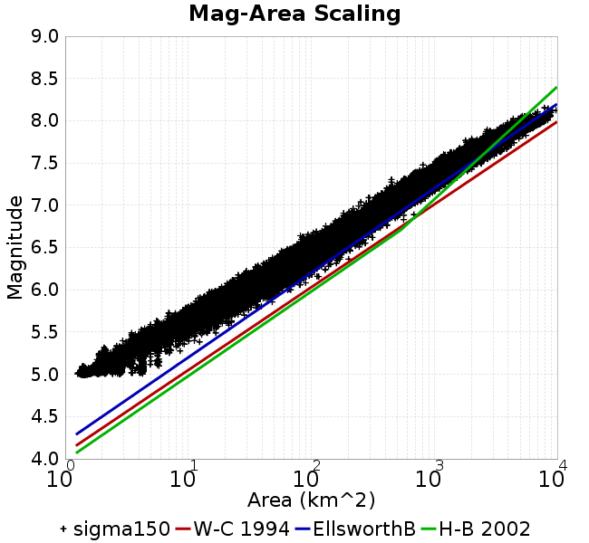 |  |
### Slip-Area Plots
*[(top)](#sigma150)*

| Scatter | 2-D Hist |
|-----|-----|
| 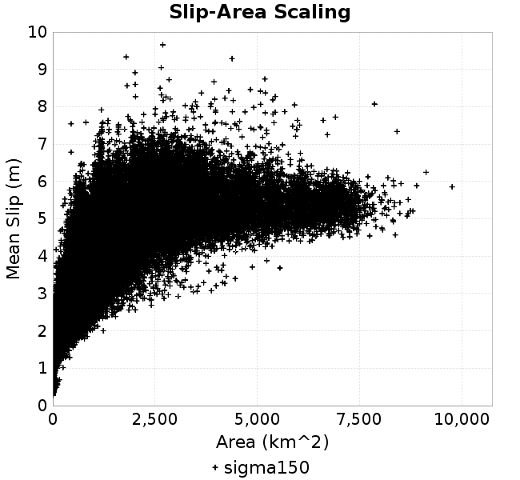 | 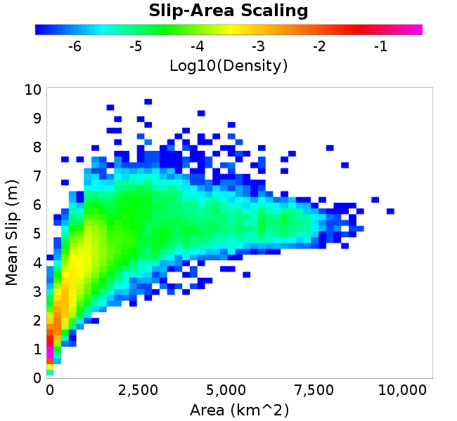 |
### Rupture Velocity Plots
*[(top)](#sigma150)*

| **Scatter** |  |
|-----|-----|
| **Distance/Velocity** |  |
### Global Interevent-Time Distributions
*[(top)](#sigma150)*

| **M≥6** | **M≥6.5** | **M≥7** | **M≥7.5** |
|-----|-----|-----|-----|
| 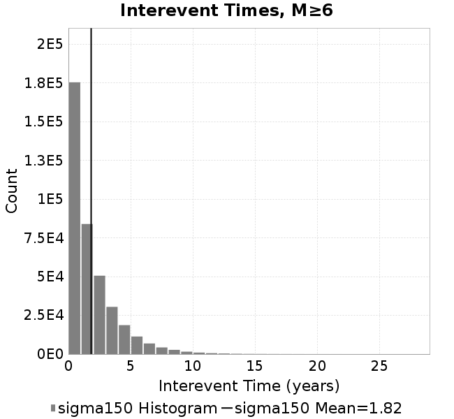 |  |  | 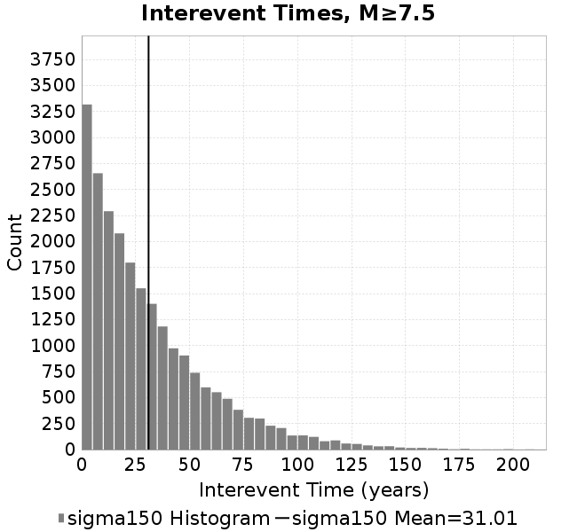 |
### Normalized Fault Interevent-Time Distributions
*[(top)](#sigma150)*

|  | **M≥6** | **M≥6.5** | **M≥7** | **M≥7.5** |
|-----|-----|-----|-----|-----|
| **Elements** |  | 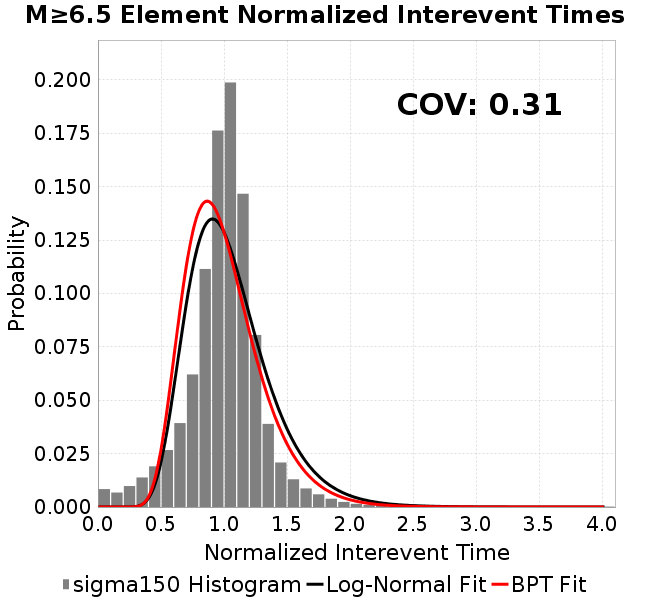 |  | 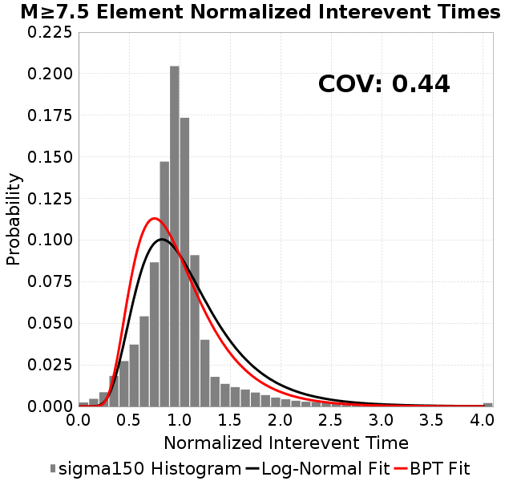 |
| **Subsections** | 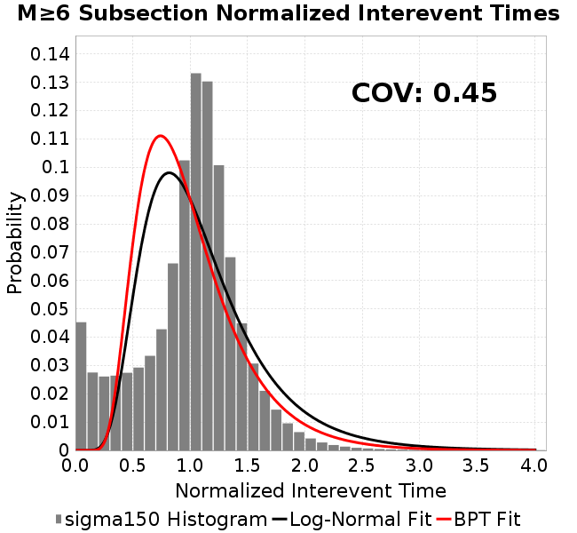 | 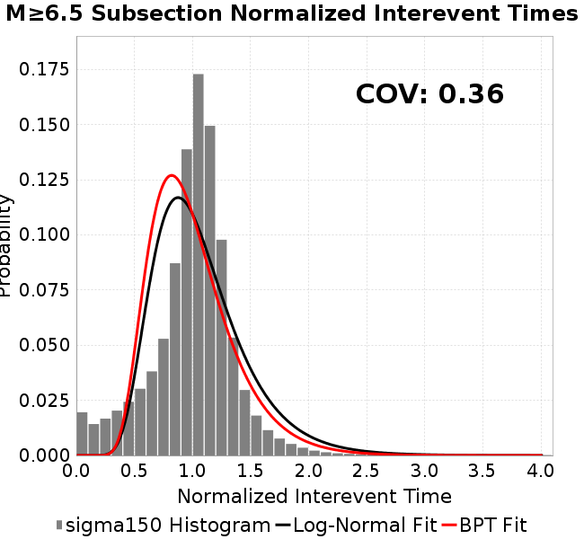 |  | 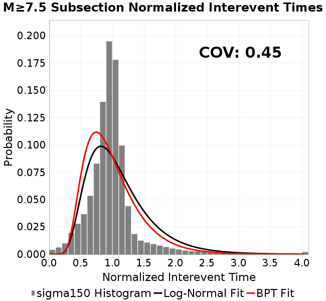 |
| **Sections** | 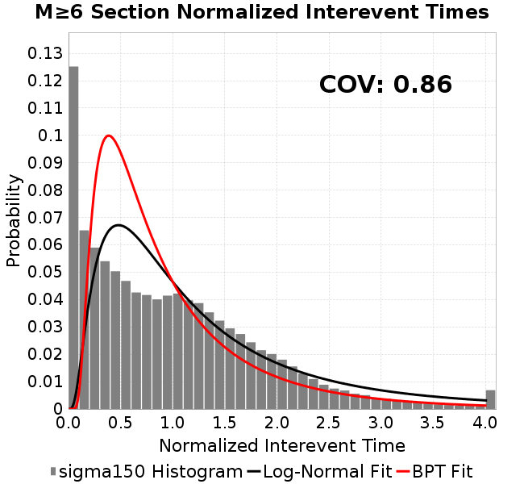 |  | 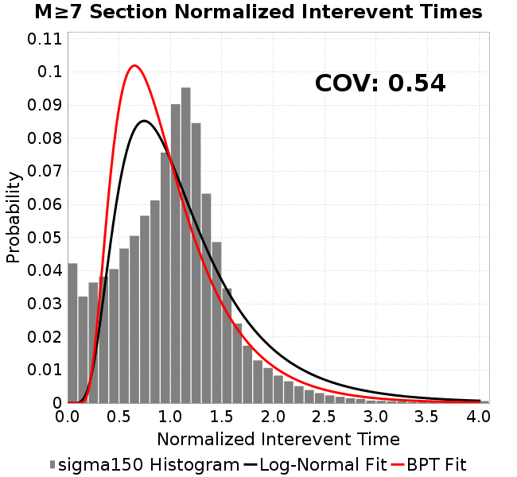 |  |
### Stationarity Plot
*[(top)](#sigma150)*

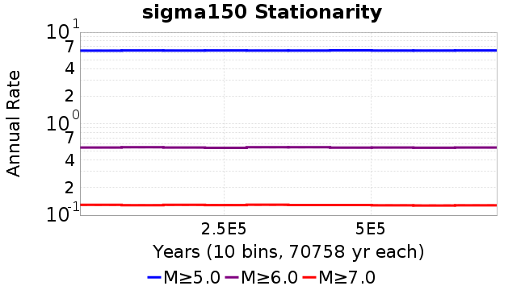
### Element/Subsection Interevent Time Comparisons

#### Element Interevent Time Comparisons
*[(top)](#sigma150)*

| Min Mag | Scatter | 2-D Hist |
|-----|-----|-----|
| **M≥6.0** | 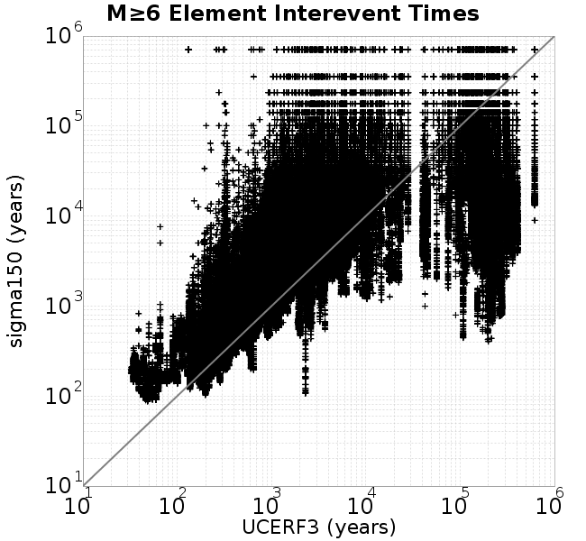 |  |
| **M≥6.5** |  | 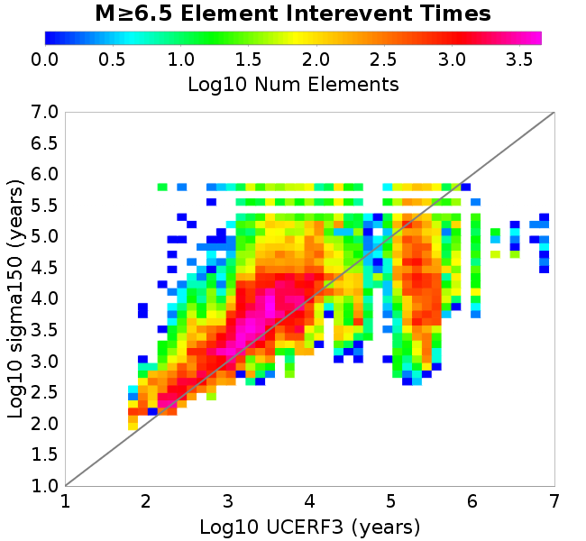 |
| **M≥7.0** | 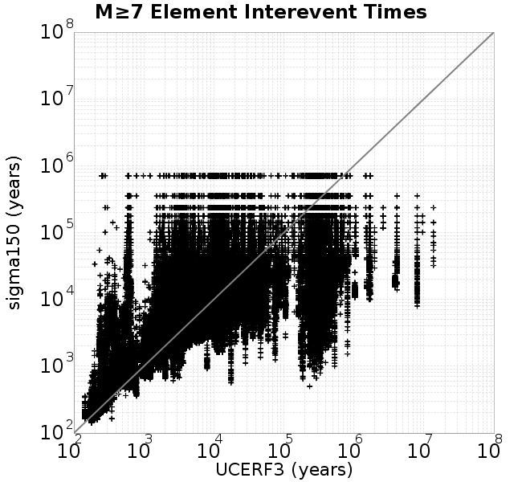 |  |
| **M≥7.5** | 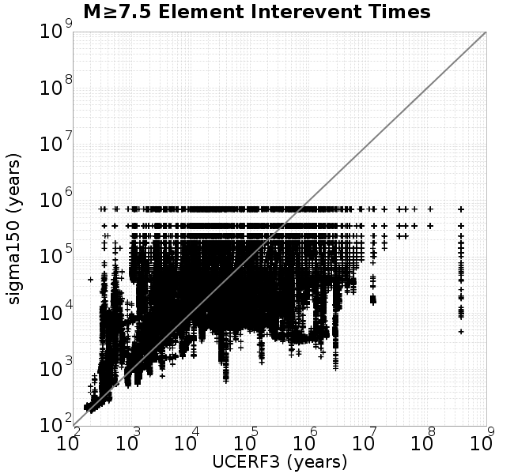 |  |

#### Subsection Interevent Time Comparisons
*[(top)](#sigma150)*

*Subsections participate in a rupture if at least 20.0 % of its area ruptures*

| Min Mag | Scatter | 2-D Hist |
|-----|-----|-----|
| **M≥6.0** |  |  |
| **M≥6.5** |  | 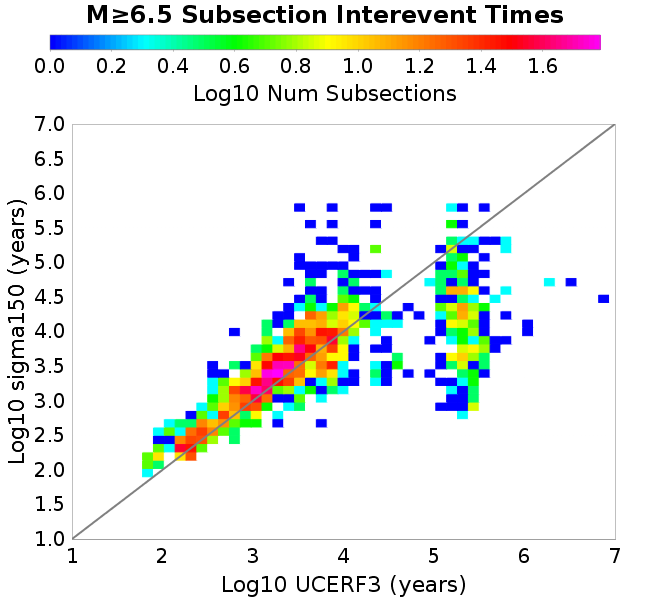 |
| **M≥7.0** | 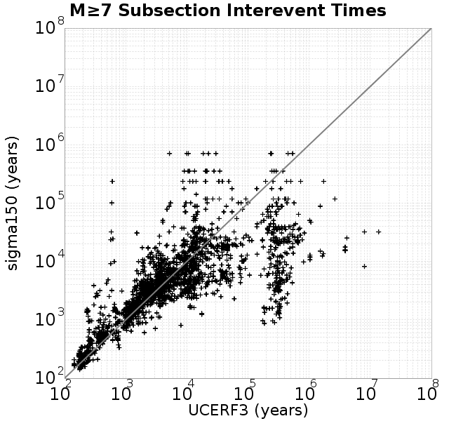 | 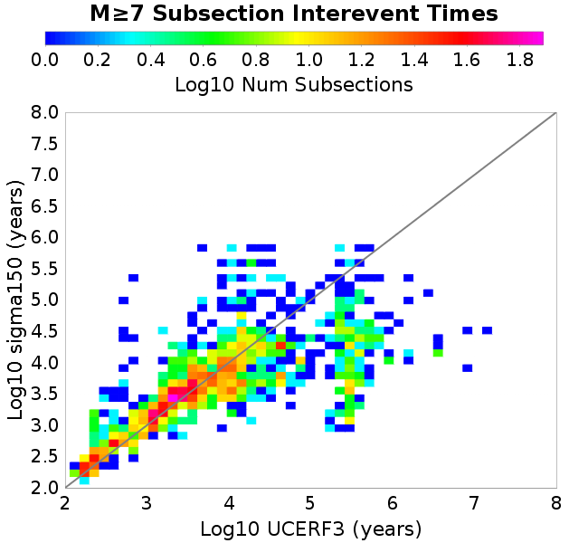 |
| **M≥7.5** |  |  |

### Paleo Open Interval Plots
*[(top)](#sigma150)*

#### Paleo Open Interval Plots, Biasi and Sharer 2019
*[(top)](#sigma150)*

These plots use the 5 paleoseismic sites identified in Biasi & Scharer (2019) on the Hayward, N. SAF, S. SAF, and SJC faults. By default, a rupture is counted at a paleo site if the nearest element (at the surface) slips any amount. We also alternatively apply a probability of detection model. Those results are marked as 'Prob. Filtered'.

**Paleoseismic sites table:**

| **Site Name** | Data MRI (yr) | Data Annual Rate | Catalog MRI (yr) | Catalog Annual Rate | Catalog Occurences | Prob Filtered Catalog MRI (yr) | Prob Filtered Catalog Annual Rate | Prob Filtered Catalog Occurences |
|-----|-----|-----|-----|-----|-----|-----|-----|-----|
| **HOG** | 191.00 | 0.005235602 | 536.86 | 0.0018626797 | 1318 | 542.77 | 0.0018423852 | 1303.63 |
| **FRA** | 119.00 | 0.008403362 | 176.33 | 0.0056711864 | 4013 | 180.71 | 0.005533656 | 3915.69 |
| **COA** | 181.00 | 0.005524862 | 270.27 | 0.0036999676 | 2618 | 280.97 | 0.0035591389 | 2518.39 |
| **SCZ** | 106.00 | 0.009433962 | 181.90 | 0.0054976265 | 3890 | 193.97 | 0.005155487 | 3647.93 |
| **TYS** | 329.00 | 0.0030395137 | 515.96 | 0.0019381293 | 1371 | 542.11 | 0.0018446608 | 1304.91 |
| **TOTAL** | 31.61 | 0.0316373 | 53.56 | 0.01867076 | 13210 | 55.77 | 0.01792958 | 12685.57 |

**Paleoseismic Plots:**

| 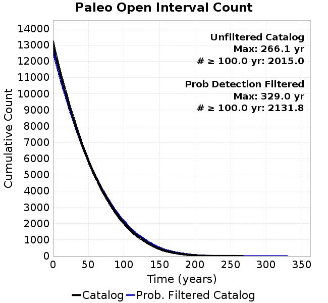 |  |
|-----|-----|

**Open interval probabilities table:**

| **Open Interval (yr)** | Catalog Probability | Catalog Poisson Probability | Prob. Filtered Catalog Probability | Prob. Filtered Catalog Poisson Probability | Data Poisson Probability |
|-----|-----|-----|-----|-----|-----|
| **10.00** | 0.9873971 | 0.8296863 | 0.9884276 | 0.83585864 | 0.72878754 |
| **20.00** | 0.954596 | 0.68837935 | 0.9579426 | 0.69865966 | 0.53113127 |
| **30.00** | 0.90406865 | 0.5711389 | 0.9106477 | 0.5839807 | 0.3870819 |
| **40.00** | 0.8376404 | 0.47386613 | 0.8482648 | 0.4881253 | 0.28210047 |
| **50.00** | 0.76460165 | 0.39316025 | 0.7793091 | 0.40800372 | 0.2055913 |
| **60.00** | 0.6868891 | 0.32619965 | 0.70519 | 0.34103343 | 0.14983238 |
| **70.00** | 0.60718286 | 0.27064338 | 0.62878364 | 0.28505573 | 0.10919597 |
| **80.00** | 0.527093 | 0.22454911 | 0.5510569 | 0.23826629 | 0.079580665 |
| **90.00** | 0.44900987 | 0.18630533 | 0.47452077 | 0.19915693 | 0.057997398 |
| **100.00** | 0.37584108 | 0.15457498 | 0.40269673 | 0.16646704 | 0.04226778 |
| **110.00** | 0.30678138 | 0.12824874 | 0.33277762 | 0.1391429 | 0.030804234 |
| **120.00** | 0.24623874 | 0.10640622 | 0.27101868 | 0.1163038 | 0.022449743 |
| **130.00** | 0.19594757 | 0.088283785 | 0.2191134 | 0.09721353 | 0.016361093 |
| **140.00** | 0.14773092 | 0.07324784 | 0.16887414 | 0.08125677 | 0.011923761 |
| **150.00** | 0.10786471 | 0.060772736 | 0.12635988 | 0.06791917 | 0.008689889 |
| **160.00** | 0.07496349 | 0.050422303 | 0.09084543 | 0.056770824 | 0.0063330824 |
| **170.00** | 0.053482894 | 0.041834693 | 0.0666708 | 0.047452383 | 0.0046154717 |
| **180.00** | 0.035943 | 0.034709673 | 0.04628218 | 0.039663482 | 0.0033636983 |
| **190.00** | 0.022108268 | 0.02879814 | 0.02991639 | 0.033153065 | 0.0024514215 |
| **200.00** | 0.012267524 | 0.023893423 | 0.017762579 | 0.027711274 | 0.0017865654 |
| **210.00** | 0.0059380024 | 0.019824045 | 0.009144486 | 0.023162708 | 0.0013020267 |
| **220.00** | 0.0032624102 | 0.01644774 | 0.0049416223 | 0.019360749 | 9.489008E-4 |
| **230.00** | 0.0015153674 | 0.013646464 | 0.0024411974 | 0.01618285 | 6.915471E-4 |
| **240.00** | 0.0010446709 | 0.011322284 | 0.0012838092 | 0.013526574 | 5.039909E-4 |
| **250.00** | 7.769787E-4 | 0.0093939435 | 0.0011013901 | 0.011306304 | 3.673023E-4 |
| **260.00** | 5.270692E-4 | 0.0077940263 | 6.353228E-4 | 0.009450471 | 2.6768536E-4 |
| **270.00** | 0.0 | 0.006466597 | 2.1678388E-4 | 0.007899257 | 1.9508575E-4 |
| **280.00** | 0.0 | 0.005365247 | 9.86172E-5 | 0.0066026626 | 1.4217607E-4 |
| **290.00** | 0.0 | 0.004451472 | 6.4321226E-5 | 0.0055188923 | 1.0361615E-4 |
| **300.00** | 0.0 | 0.0036933252 | 4.3387103E-5 | 0.004613014 | 7.551416E-5 |
| **310.00** | 0.0 | 0.0030643013 | 3.0896204E-5 | 0.0038558273 | 5.503378E-5 |
| **320.00** | 0.0 | 0.0025424089 | 1.8580462E-5 | 0.0032229265 | 4.0107934E-5 |
| **330.00** | 0.0 | 0.0021094019 | 0.0 | 0.0026939109 | 2.9230163E-5 |

#### Paleo Open Interval Plots, UCERF3
*[(top)](#sigma150)*

These plots use the full set of UCERF3 paleoseismic sites. By default, a rupture is counted at a paleo site if the nearest element (at the surface) slips any amount. We also alternativeslyapply a probability of detection model. Those results are marked as 'Prob. Filtered'.

**Paleoseismic sites table:**

| **Site Name** | Data MRI (yr) | Data Annual Rate | Catalog MRI (yr) | Catalog Annual Rate | Catalog Occurences | Prob Filtered Catalog MRI (yr) | Prob Filtered Catalog Annual Rate | Prob Filtered Catalog Occurences |
|-----|-----|-----|-----|-----|-----|-----|-----|-----|
| **SSanAndreasBurroFlats** | 205.44 | 0.0048677 | 312.87 | 0.0031961957 | 2261 | 332.94 | 0.0030035463 | 2124.71 |
| **SSanAndreasIndio** | 277.37 | 0.0036053 | 264.91 | 0.0037749 | 2671 | 273.11 | 0.0036614637 | 2590.73 |
| **SSAFMCreek1000Palms** | 261.33 | 0.0038266 | 2297.79 | 4.352007E-4 | 308 | 2918.72 | 3.4261617E-4 | 242.38 |
| **NSanAndreasFortRoss** | 306.28 | 0.003265 | 282.95 | 0.0035342246 | 2501 | 286.05 | 0.0034959 | 2473.88 |
| **NSanAndreasNorthCoast** | 263.87 | 0.0037898 | 269.37 | 0.0037123496 | 2627 | 273.60 | 0.0036549703 | 2586.38 |
| **CalaverasfaultNorth** | 618.05 | 0.001618 | 246.67 | 0.0040539647 | 2869 | 306.90 | 0.0032584306 | 2305.99 |
| **ElsinoreTemecula** | 1019.16 | 9.812E-4 | 1034.20 | 9.6693495E-4 | 684 | 1054.46 | 9.4834954E-4 | 670.85 |
| **ElsinoreWhittier** | 3196.93 | 3.128E-4 | 2311.38 | 4.326416E-4 | 306 | 2367.29 | 4.2242455E-4 | 298.75 |
| **SSAFCarrizoBidart** | 114.71 | 0.0087179 | 181.80 | 0.0055005522 | 3893 | 185.06 | 0.0054036286 | 3824.39 |
| **SanJacintoHogLake** | 311.78 | 0.0032074 | 536.86 | 0.0018626797 | 1318 | 542.43 | 0.0018435448 | 1304.44 |
| **PuenteHills** | 3506.31 | 2.852E-4 | 7583.61 | 1.3186339E-4 | 94 | 7936.94 | 1.259931E-4 | 89.69 |
| **SanGregorioNorth** | 1019.06 | 9.813E-4 | 592.70 | 0.0016871926 | 1193 | 603.58 | 0.0016567799 | 1171.5 |
| **SanJacintoSuperstition** | 508.26 | 0.0019675 | 1851.05 | 5.402339E-4 | 383 | 1903.98 | 5.252148E-4 | 372.38 |
| **SSanAndreasWrightwood** | 106.04 | 0.0094304 | 230.42 | 0.004339876 | 3071 | 232.73 | 0.0042967913 | 3040.51 |
| **SSanAndreasPitmanCanyon** | 173.48 | 0.0057643 | 216.26 | 0.0046240175 | 3272 | 229.04 | 0.0043661217 | 3089.53 |
| **SSanAndreasPlungeCreek** | 205.36 | 0.0048695 | 542.48 | 0.0018433776 | 1304 | 606.04 | 0.0016500448 | 1167.3 |
| **FrazierMountianSSAF** | 148.57 | 0.0067307 | 176.33 | 0.0056711864 | 4013 | 180.82 | 0.0055305106 | 3913.46 |
| **NSanAndreasSantaCruzSeg** | 109.84 | 0.0091041 | 181.90 | 0.0054976265 | 3890 | 194.06 | 0.0051530884 | 3646.26 |
| **RodgersCreek** | 325.31 | 0.003074 | 252.48 | 0.00396073 | 2802 | 303.66 | 0.003293113 | 2329.67 |
| **GreenValleyMasonRoad** | 293.31 | 0.0034094 | 2496.84 | 4.005064E-4 | 282 | 2976.66 | 3.3594674E-4 | 236.57 |
| **HaywardfaultNorth** | 318.34 | 0.0031413 | 556.59 | 0.0017966657 | 1271 | 564.64 | 0.0017710272 | 1252.85 |
| **HaywardfaultSouth** | 167.57 | 0.0059677 | 515.96 | 0.0019381293 | 1371 | 542.49 | 0.0018433367 | 1303.94 |
| **Compton** | 2658.16 | 3.762E-4 | 8927.54 | 1.1201299E-4 | 80 | 9330.23 | 1.071785E-4 | 76.56 |
| **SSanAndreasCoachella** | 178.45 | 0.0056037 | 270.27 | 0.0036999676 | 2618 | 281.01 | 0.0035585486 | 2517.95 |
| **ElsinoreGlenIvy** | 179.12 | 0.0055828 | 864.73 | 0.0011564258 | 819 | 902.44 | 0.0011081032 | 784.78 |
| **GarlockCentralallevents** | 1434.93 | 6.969E-4 | 954.50 | 0.0010476738 | 742 | 965.39 | 0.0010358494 | 733.62 |
| **NSanAndreasAlderCreek** | 869.64 | 0.0011499 | 284.20 | 0.003518674 | 2490 | 287.31 | 0.0034805045 | 2463 |
| **SSanAndreasPallettCreek** | 149.30 | 0.006698 | 230.20 | 0.004344117 | 3074 | 232.63 | 0.004298688 | 3041.84 |
| **GarlockWesternallevents** | 1230.16 | 8.129E-4 | 1248.44 | 8.009969E-4 | 567 | 1266.34 | 7.896746E-4 | 558.99 |
| **ElsinoreFaultJulian** | 3250.98 | 3.076E-4 | 1866.24 | 5.358372E-4 | 379 | 1888.56 | 5.295039E-4 | 374.5 |
| **TOTAL** | 9.08 | 0.1101451 | 21.54 | 0.0464221 | 32848 | 22.88 | 0.043710113 | 30929.06 |

**Paleoseismic Plots:**

| 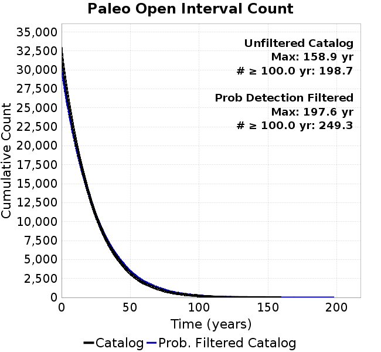 |  |
|-----|-----|

**Open interval probabilities table:**

| **Open Interval (yr)** | Catalog Probability | Catalog Poisson Probability | Prob. Filtered Catalog Probability | Prob. Filtered Catalog Poisson Probability | Data Poisson Probability |
|-----|-----|-----|-----|-----|-----|
| **10.00** | 0.92683583 | 0.6286246 | 0.9340296 | 0.6459061 | 0.33238843 |
| **20.00** | 0.77460194 | 0.39516887 | 0.7932387 | 0.41719472 | 0.110482074 |
| **30.00** | 0.5997177 | 0.24841288 | 0.62713754 | 0.26946864 | 0.036722966 |
| **40.00** | 0.4413174 | 0.15615845 | 0.47302464 | 0.17405143 | 0.012206289 |
| **50.00** | 0.30597612 | 0.09816504 | 0.3379019 | 0.11242089 | 0.004057229 |
| **60.00** | 0.20606384 | 0.061708957 | 0.23467799 | 0.072613336 | 0.001348576 |
| **70.00** | 0.13752462 | 0.03879177 | 0.16108382 | 0.046901397 | 4.4825108E-4 |
| **80.00** | 0.086379364 | 0.02438546 | 0.104232855 | 0.0302939 | 1.4899348E-4 |
| **90.00** | 0.053239908 | 0.0153292995 | 0.0660488 | 0.019567017 | 4.952371E-5 |
| **100.00** | 0.03168314 | 0.009636375 | 0.040274005 | 0.012638455 | 1.6461108E-5 |
| **110.00** | 0.015457074 | 0.0060576624 | 0.021505674 | 0.008163256 | 5.4714824E-6 |
| **120.00** | 0.008071209 | 0.0038079955 | 0.0120172305 | 0.0052726967 | 1.8186574E-6 |
| **130.00** | 0.0042292243 | 0.0023937996 | 0.0066977153 | 0.0034056671 | 6.045007E-7 |
| **140.00** | 0.0025241903 | 0.0015048013 | 0.0036665718 | 0.0021997413 | 2.0092905E-7 |
| **150.00** | 7.9255534E-4 | 9.459551E-4 | 0.0013518793 | 0.0014208263 | 6.678649E-8 |
| **160.00** | 0.0 | 5.946507E-4 | 4.5570478E-4 | 9.1772043E-4 | 2.2199057E-8 |
| **170.00** | 0.0 | 3.7381204E-4 | 1.7078909E-4 | 5.9276127E-4 | 7.37871E-9 |
| **180.00** | 0.0 | 2.3498744E-4 | 1.9933614E-5 | 3.828681E-4 | 2.452598E-9 |
| **190.00** | 0.0 | 1.4771888E-4 | 7.779358E-6 | 2.4729685E-4 | 8.152152E-10 |
| **200.00** | 0.0 | 9.285972E-5 | 0.0 | 1.5973055E-4 | 2.709681E-10 |

### Moment Release Variability Plots
*[(top)](#sigma150)*

We first create a tapered moment release time series for the entire catalog. Each event's moment is distributed across a 25 year Hanning (cosine) taper. Here is a plot of a random 2,000 year section of this time series:


We then compute Welch's power spectral density estimate on the entire time series. Results are plotted below, with a Poisson randomization of the catalog also plotted in gray as a control. Significant deviations above the Poisson model indicate synchronization at that period.


## Input File
*[(top)](#sigma150)*

```
  A_1 = 0.001
  fA = .1
  B_1 = 0.008
  muSlipAmp_1 = .0
  muSlipInvDist_1 = 1.0
  cohesion = 0.0
  Dc_1 = 1.0000000000000000818e-05
  mu0_1 = 0.6
  ddotStar_1 = 9.9999999999999995475e-07
  ddotAB_1 = 9.9999999999999995475e-07
  alpha_1 = 0.0
  theta0_1 = 200000000
  tau0_1 = 82.5
  sigma0_1 = 150
  sigmaFracPin = .5
  lowSigmaAction = 1
  maxThetaPin = 1.0e13
  ddotEQ_1 = 1
  ddotEQFname = 
  stressOvershootFactor = 0.10000000000000000555
  lameLambda = 30000
  lameMu = 30000
  slowSlip_1 = 0
  nEq = 100000000000
  KZeroFrac = 0
  muPin = 1.0
  tStart = 0
  maxT = 3.16e13
  maxWallTime = 169200
  maxTrans = 1.0000000000000000159e100
  faultFname = UCERF3FM.15km.1km.tri.flt
  outFnameInfix = sigma150
  writeTau = 2
  writeSigma = 2
  writeSlip = 0
  writeSlipSpeed = 0
  writeState = 0
  writeTheta = 2
  writePED = 1
  writeTransitions = 1
  minDtWrite = 0
  minDtWriteCoseismic = 0
  minDtWriteInterseismic = 0
  minMagWrite = 7.7
  writeStiffness = 0
  stressRateSpecification = 1
  dMu3 = 0.01000000000000000
  initTauFname = 
  initSigmaFname = 
  initThetaFname = 
  initSlipSpeedFname = 
  AFname = 
  BFname =  
  DcFname = 
  mu0Fname = 
  ddotStarFname = 
  ddotABFname = 
  alphaFname = 
  KTauFname = /u/sciteam/gilchris/scratch/stiffness_25a589d/Ktau.25a589d.out
  KSigmaFname = /u/sciteam/gilchris/scratch/stiffness_25a589d/Ksigma.25a589d.out
  tFailFname = 
  tauFailFname = 
  tauDotFname = 
  sigmaDotFname =
  KZeroFname = UCERF3FM.15km.1km.tri.KZero
  pinnedFname =  UCERF3FM.15km.1km.tri.pin
  neighborFname = UCERF3FM.15km.1km.tri.neighbors
  stressRateFname =  
  slowSlipFname = 
  writePatchFname = 
  DEBUG = 0
  ZBrentUpperBracket = 0
  receiverElementAreaFrac = 0.8
  receiverElementIntTol = 1.0e-4
  receiverElementSubdivisionMax = 4
  tgfDist1 = 3
  tgfDist1 = 10
  lowSigmaAction = 1
  highSigmaAction = 0
```
