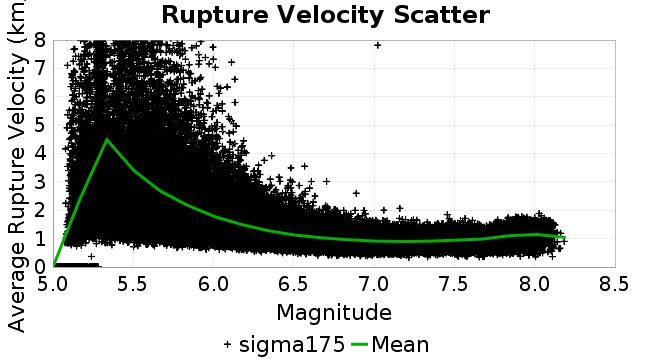

# sigma175
## Metadata
| **Catalog** | sigma175 |
|-----|-----|
| **Author** | Jaqcui Gilchrist, 2018/09/27 |
| **Description** | vary tau/sigma: sigma0=175, tau0=96.25 |
| **Fault/Def Model** | Fault Model 3.1, Geologic |
| **Slip Velocity** | 1.0 m/s |
| **Average Element Area** | 1.35 km^2 |
| **Length** | 9,349,810 events in 838,066 years |
| **Frictional Params** | a=0.001, b=0.008, (b-a)=0.007, ddotEQ=1 |

* [Metadata](#metadata)
* [Plots](#plots)
  * [Magnitude-Frequency Plot](#magnitude-frequency-plot)
  * [Magnitude-Area Plots](#magnitude-area-plots)
  * [Slip-Area Plots](#slip-area-plots)
  * [Rupture Velocity Plots](#rupture-velocity-plots)
  * [Global Interevent-Time Distributions](#global-interevent-time-distributions)
  * [Normalized Fault Interevent-Time Distributions](#normalized-fault-interevent-time-distributions)
  * [Stationarity Plot](#stationarity-plot)
  * [Element/Subsection Interevent Time Comparisons](#elementsubsection-interevent-time-comparisons)
    * [Element Interevent Time Comparisons](#element-interevent-time-comparisons)
    * [Subsection Interevent Time Comparisons](#subsection-interevent-time-comparisons)
  * [Paleo Open Interval Plots](#paleo-open-interval-plots)
    * [Paleo Open Interval Plots, Biasi and Sharer 2019](#paleo-open-interval-plots-biasi-and-sharer-2019)
    * [Paleo Open Interval Plots, UCERF3](#paleo-open-interval-plots-ucerf3)
  * [Moment Release Variability Plots](#moment-release-variability-plots)
* [Input File](#input-file)

## Plots
### Magnitude-Frequency Plot
*[(top)](#sigma175)*


### Magnitude-Area Plots
*[(top)](#sigma175)*

| Scatter | 2-D Hist |
|-----|-----|
|  |  |
### Slip-Area Plots
*[(top)](#sigma175)*

| Scatter | 2-D Hist |
|-----|-----|
|  |  |
### Rupture Velocity Plots
*[(top)](#sigma175)*

| **Scatter** |  |
|-----|-----|
| **Distance/Velocity** |  |
### Global Interevent-Time Distributions
*[(top)](#sigma175)*

| **M≥6** | **M≥6.5** | **M≥7** | **M≥7.5** |
|-----|-----|-----|-----|
|  |  |  |  |
### Normalized Fault Interevent-Time Distributions
*[(top)](#sigma175)*

|  | **M≥6** | **M≥6.5** | **M≥7** | **M≥7.5** |
|-----|-----|-----|-----|-----|
| **Elements** |  |  |  |  |
| **Subsections** |  |  |  |  |
| **Sections** |  |  |  |  |
### Stationarity Plot
*[(top)](#sigma175)*


### Element/Subsection Interevent Time Comparisons

#### Element Interevent Time Comparisons
*[(top)](#sigma175)*

| Min Mag | Scatter | 2-D Hist |
|-----|-----|-----|
| **M≥6.0** |  |  |
| **M≥6.5** |  |  |
| **M≥7.0** |  |  |
| **M≥7.5** |  |  |

#### Subsection Interevent Time Comparisons
*[(top)](#sigma175)*

*Subsections participate in a rupture if at least 20.0 % of its area ruptures*

| Min Mag | Scatter | 2-D Hist |
|-----|-----|-----|
| **M≥6.0** |  |  |
| **M≥6.5** |  |  |
| **M≥7.0** |  |  |
| **M≥7.5** |  |  |

### Paleo Open Interval Plots
*[(top)](#sigma175)*

#### Paleo Open Interval Plots, Biasi and Sharer 2019
*[(top)](#sigma175)*

These plots use the 5 paleoseismic sites identified in Biasi & Scharer (2019) on the Hayward, N. SAF, S. SAF, and SJC faults. By default, a rupture is counted at a paleo site if the nearest element (at the surface) slips any amount. We also alternatively apply a probability of detection model. Those results are marked as 'Prob. Filtered'.

**Paleoseismic sites table:**

| **Site Name** | Data MRI (yr) | Data Annual Rate | Catalog MRI (yr) | Catalog Annual Rate | Catalog Occurences | Prob Filtered Catalog MRI (yr) | Prob Filtered Catalog Annual Rate | Prob Filtered Catalog Occurences |
|-----|-----|-----|-----|-----|-----|-----|-----|-----|
| **HOG** | 191.00 | 0.005235602 | 626.05 | 0.001597314 | 1331 | 632.78 | 0.0015803362 | 1316.85 |
| **FRA** | 119.00 | 0.008403362 | 204.23 | 0.0048963334 | 4079 | 208.26 | 0.0048017087 | 4000.19 |
| **COA** | 181.00 | 0.005524862 | 308.87 | 0.0032375706 | 2697 | 319.10 | 0.0031338455 | 2610.61 |
| **SCZ** | 106.00 | 0.009433962 | 214.57 | 0.004660376 | 3882 | 224.71 | 0.004450102 | 3706.79 |
| **TYS** | 329.00 | 0.0030395137 | 609.22 | 0.0016414435 | 1368 | 632.34 | 0.0015814371 | 1318 |
| **TOTAL** | 31.61 | 0.0316373 | 62.37 | 0.016032288 | 13356 | 64.33 | 0.015544607 | 12949.66 |

**Paleoseismic Plots:**

|  |  |
|-----|-----|

**Open interval probabilities table:**

| **Open Interval (yr)** | Catalog Probability | Catalog Poisson Probability | Prob. Filtered Catalog Probability | Prob. Filtered Catalog Poisson Probability | Data Poisson Probability |
|-----|-----|-----|-----|-----|-----|
| **10.00** | 0.9907181 | 0.8518687 | 0.9913104 | 0.8560332 | 0.72878754 |
| **20.00** | 0.966287 | 0.7256803 | 0.9682466 | 0.7327929 | 0.53113127 |
| **30.00** | 0.92751 | 0.6181843 | 0.9315138 | 0.6272951 | 0.3870819 |
| **40.00** | 0.87739086 | 0.52661186 | 0.8838374 | 0.53698546 | 0.28210047 |
| **50.00** | 0.8176217 | 0.44860417 | 0.8265571 | 0.45967737 | 0.2055913 |
| **60.00** | 0.75407225 | 0.38215184 | 0.7655659 | 0.3934991 | 0.14983238 |
| **70.00** | 0.68053573 | 0.3255432 | 0.69454813 | 0.33684832 | 0.10919597 |
| **80.00** | 0.61145616 | 0.27732006 | 0.62755495 | 0.28835335 | 0.079580665 |
| **90.00** | 0.5408033 | 0.23624027 | 0.5586169 | 0.24684006 | 0.057997398 |
| **100.00** | 0.4731937 | 0.2012457 | 0.49235117 | 0.2113033 | 0.04226778 |
| **110.00** | 0.4094291 | 0.17143491 | 0.42886856 | 0.18088265 | 0.030804234 |
| **120.00** | 0.3461434 | 0.14604004 | 0.36597162 | 0.15484156 | 0.022449743 |
| **130.00** | 0.28763017 | 0.124406934 | 0.30783013 | 0.13254951 | 0.016361093 |
| **140.00** | 0.23730074 | 0.10597837 | 0.25647116 | 0.11346679 | 0.011923761 |
| **150.00** | 0.1943092 | 0.09027965 | 0.212072 | 0.09713134 | 0.008689889 |
| **160.00** | 0.15478286 | 0.07690641 | 0.17116193 | 0.08314766 | 0.0063330824 |
| **170.00** | 0.119055636 | 0.06551416 | 0.13390426 | 0.07117716 | 0.0046154717 |
| **180.00** | 0.08787029 | 0.055809468 | 0.101163015 | 0.060930014 | 0.0033636983 |
| **190.00** | 0.06769487 | 0.047542337 | 0.079323076 | 0.052158117 | 0.0024514215 |
| **200.00** | 0.04376443 | 0.04049983 | 0.05360738 | 0.04464908 | 0.0017865654 |
| **210.00** | 0.028262032 | 0.034500536 | 0.03606745 | 0.0382211 | 0.0013020267 |
| **220.00** | 0.01848315 | 0.029389927 | 0.024523422 | 0.032718528 | 9.489008E-4 |
| **230.00** | 0.011185291 | 0.02503636 | 0.015573836 | 0.028008148 | 6.915471E-4 |
| **240.00** | 0.005329533 | 0.021327691 | 0.008346245 | 0.023975907 | 5.039909E-4 |
| **250.00** | 0.0028472082 | 0.018168392 | 0.0048265117 | 0.020524172 | 3.673023E-4 |
| **260.00** | 0.0013420945 | 0.015477085 | 0.0024941182 | 0.017569374 | 2.6768536E-4 |
| **270.00** | 4.8370642E-4 | 0.013184444 | 0.0011120329 | 0.015039968 | 1.9508575E-4 |
| **280.00** | 0.0 | 0.011231415 | 4.97444E-4 | 0.012874712 | 1.4217607E-4 |
| **290.00** | 0.0 | 0.009567691 | 3.461802E-4 | 0.011021182 | 1.0361615E-4 |
| **300.00** | 0.0 | 0.008150416 | 2.468415E-4 | 0.009434498 | 7.551416E-5 |
| **310.00** | 0.0 | 0.0069430843 | 1.3165285E-4 | 0.008076244 | 5.503378E-5 |
| **320.00** | 0.0 | 0.0059145964 | 6.102966E-5 | 0.006913533 | 4.0107934E-5 |
| **330.00** | 0.0 | 0.0050384593 | 5.1250565E-5 | 0.005918214 | 2.9230163E-5 |
| **340.00** | 0.0 | 0.004292106 | 4.8446953E-5 | 0.005066188 | 2.1302578E-5 |
| **350.00** | 0.0 | 0.0036563107 | 3.1229687E-5 | 0.004336825 | 1.5525055E-5 |
| **360.00** | 0.0 | 0.0031146966 | 2.83271E-5 | 0.0037124665 | 1.1314466E-5 |
| **370.00** | 0.0 | 0.0026533124 | 2.5424511E-5 | 0.0031779946 | 8.245842E-6 |
| **380.00** | 0.0 | 0.0022602738 | 2.1706894E-5 | 0.0027204691 | 6.009467E-6 |
| **390.00** | 0.0 | 0.0019254566 | 9.430408E-6 | 0.002328812 | 4.379625E-6 |
| **400.00** | 0.0 | 0.0016402361 | 7.5896687E-6 | 0.0019935404 | 3.1918162E-6 |
| **410.00** | 0.0 | 0.0013972658 | 5.74893E-6 | 0.0017065369 | 2.3261557E-6 |
| **420.00** | 0.0 | 0.0011902871 | 0.0 | 0.0014608523 | 1.6952735E-6 |

#### Paleo Open Interval Plots, UCERF3
*[(top)](#sigma175)*

These plots use the full set of UCERF3 paleoseismic sites. By default, a rupture is counted at a paleo site if the nearest element (at the surface) slips any amount. We also alternativeslyapply a probability of detection model. Those results are marked as 'Prob. Filtered'.

**Paleoseismic sites table:**

| **Site Name** | Data MRI (yr) | Data Annual Rate | Catalog MRI (yr) | Catalog Annual Rate | Catalog Occurences | Prob Filtered Catalog MRI (yr) | Prob Filtered Catalog Annual Rate | Prob Filtered Catalog Occurences |
|-----|-----|-----|-----|-----|-----|-----|-----|-----|
| **SSanAndreasBurroFlats** | 205.44 | 0.0048677 | 359.89 | 0.0027786146 | 2313 | 377.16 | 0.0026514255 | 2207.17 |
| **SSanAndreasIndio** | 277.37 | 0.0036053 | 302.04 | 0.0033108243 | 2758 | 309.68 | 0.003229149 | 2689.96 |
| **SSAFMCreek1000Palms** | 261.33 | 0.0038266 | 2731.71 | 3.6607118E-4 | 305 | 3285.03 | 3.0441154E-4 | 253.57 |
| **NSanAndreasFortRoss** | 306.28 | 0.003265 | 334.22 | 0.0029920335 | 2492 | 337.75 | 0.0029607662 | 2465.95 |
| **NSanAndreasNorthCoast** | 263.87 | 0.0037898 | 318.01 | 0.003144578 | 2619 | 322.43 | 0.003101474 | 2583.09 |
| **CalaverasfaultNorth** | 618.05 | 0.001618 | 287.77 | 0.0034750572 | 2894 | 339.57 | 0.0029448594 | 2452.43 |
| **ElsinoreTemecula** | 1019.16 | 9.812E-4 | 1207.24 | 8.2833855E-4 | 690 | 1225.39 | 8.160659E-4 | 679.78 |
| **ElsinoreWhittier** | 3196.93 | 3.128E-4 | 2697.55 | 3.707074E-4 | 309 | 2751.83 | 3.63395E-4 | 302.88 |
| **SSAFCarrizoBidart** | 114.71 | 0.0087179 | 217.12 | 0.0046057715 | 3837 | 220.12 | 0.0045430763 | 3784.75 |
| **SanJacintoHogLake** | 311.78 | 0.0032074 | 626.05 | 0.001597314 | 1331 | 632.72 | 0.0015804853 | 1316.96 |
| **PuenteHills** | 3506.31 | 2.852E-4 | 8545.15 | 1.17025425E-4 | 98 | 8867.31 | 1.1277373E-4 | 94.46 |
| **SanGregorioNorth** | 1019.06 | 9.813E-4 | 696.41 | 0.0014359308 | 1196 | 707.35 | 0.0014137261 | 1177.5 |
| **SanJacintoSuperstition** | 508.26 | 0.0019675 | 2123.44 | 4.7093426E-4 | 392 | 2167.02 | 4.6146425E-4 | 384 |
| **SSanAndreasWrightwood** | 106.04 | 0.0094304 | 270.32 | 0.0036992652 | 3082 | 273.10 | 0.0036616793 | 3050.66 |
| **SSanAndreasPitmanCanyon** | 173.48 | 0.0057643 | 250.94 | 0.003985025 | 3320 | 262.62 | 0.0038077908 | 3172.35 |
| **SSanAndreasPlungeCreek** | 205.36 | 0.0048695 | 625.62 | 0.0015984244 | 1331 | 682.77 | 0.0014646319 | 1219.57 |
| **FrazierMountianSSAF** | 148.57 | 0.0067307 | 204.23 | 0.0048963334 | 4079 | 208.28 | 0.004801159 | 3999.72 |
| **NSanAndreasSantaCruzSeg** | 109.84 | 0.0091041 | 214.57 | 0.004660376 | 3882 | 224.74 | 0.004449586 | 3706.38 |
| **RodgersCreek** | 325.31 | 0.003074 | 297.12 | 0.0033656093 | 2803 | 343.97 | 0.0029072699 | 2421.28 |
| **GreenValleyMasonRoad** | 293.31 | 0.0034094 | 3043.27 | 3.2859403E-4 | 274 | 3446.89 | 2.9011635E-4 | 241.72 |
| **HaywardfaultNorth** | 318.34 | 0.0031413 | 652.07 | 0.0015335777 | 1277 | 660.40 | 0.0015142366 | 1260.89 |
| **HaywardfaultSouth** | 167.57 | 0.0059677 | 609.22 | 0.0016414435 | 1368 | 632.77 | 0.0015803571 | 1317.08 |
| **Compton** | 2658.16 | 3.762E-4 | 10906.31 | 9.1690024E-5 | 77 | 11245.77 | 8.8922294E-5 | 74.67 |
| **SSanAndreasCoachella** | 178.45 | 0.0056037 | 308.87 | 0.0032375706 | 2697 | 318.81 | 0.0031366674 | 2612.97 |
| **ElsinoreGlenIvy** | 179.12 | 0.0055828 | 1005.79 | 9.942467E-4 | 828 | 1041.42 | 9.6022425E-4 | 799.67 |
| **GarlockCentralallevents** | 1434.93 | 6.969E-4 | 1126.25 | 8.879015E-4 | 740 | 1139.51 | 8.775679E-4 | 731.35 |
| **NSanAndreasAlderCreek** | 869.64 | 0.0011499 | 332.88 | 0.003004045 | 2502 | 336.53 | 0.002971486 | 2474.84 |
| **SSanAndreasPallettCreek** | 149.30 | 0.006698 | 269.45 | 0.003711272 | 3092 | 272.23 | 0.0036733404 | 3060.39 |
| **GarlockWesternallevents** | 1230.16 | 8.129E-4 | 1436.09 | 6.9633394E-4 | 580 | 1456.95 | 6.8636745E-4 | 571.69 |
| **ElsinoreFaultJulian** | 3250.98 | 3.076E-4 | 2187.06 | 4.5723456E-4 | 381 | 2211.50 | 4.521825E-4 | 376.78 |
| **TOTAL** | 9.08 | 0.1101451 | 25.25 | 0.03960353 | 32991 | 26.46 | 0.037798647 | 31487.3 |

**Paleoseismic Plots:**

|  |  |
|-----|-----|

**Open interval probabilities table:**

| **Open Interval (yr)** | Catalog Probability | Catalog Poisson Probability | Prob. Filtered Catalog Probability | Prob. Filtered Catalog Poisson Probability | Data Poisson Probability |
|-----|-----|-----|-----|-----|-----|
| **10.00** | 0.9445207 | 0.67298293 | 0.9489014 | 0.6852398 | 0.33238843 |
| **20.00** | 0.82239693 | 0.452906 | 0.8343418 | 0.46955356 | 0.110482074 |
| **30.00** | 0.67487395 | 0.304798 | 0.69399005 | 0.32175678 | 0.036722966 |
| **40.00** | 0.52763957 | 0.20512386 | 0.5514519 | 0.22048053 | 0.012206289 |
| **50.00** | 0.4040277 | 0.13804486 | 0.42876512 | 0.15108204 | 0.004057229 |
| **60.00** | 0.2954388 | 0.09290183 | 0.31931967 | 0.10352742 | 0.001348576 |
| **70.00** | 0.20830439 | 0.062521346 | 0.2300017 | 0.070941105 | 4.4825108E-4 |
| **80.00** | 0.147938 | 0.042075798 | 0.16634001 | 0.048611667 | 1.4899348E-4 |
| **90.00** | 0.100518815 | 0.028316295 | 0.115627535 | 0.033310648 | 4.952371E-5 |
| **100.00** | 0.064795755 | 0.019056384 | 0.07668078 | 0.022825781 | 1.6461108E-5 |
| **110.00** | 0.04138574 | 0.01282462 | 0.05024723 | 0.015641132 | 5.4714824E-6 |
| **120.00** | 0.025876824 | 0.008630751 | 0.032410968 | 0.010717927 | 1.8186574E-6 |
| **130.00** | 0.015218082 | 0.005808348 | 0.019161988 | 0.0073443498 | 6.045007E-7 |
| **140.00** | 0.009529912 | 0.0039089187 | 0.012142711 | 0.0050326404 | 2.0092905E-7 |
| **150.00** | 0.00516966 | 0.0026306356 | 0.006925869 | 0.0034485655 | 6.678649E-8 |
| **160.00** | 0.0030800267 | 0.0017703729 | 0.0042265602 | 0.0023630941 | 2.2199057E-8 |
| **170.00** | 0.0021970687 | 0.0011914307 | 0.0028511058 | 0.0016192861 | 7.37871E-9 |
| **180.00** | 7.1079563E-4 | 8.018125E-4 | 0.001032982 | 0.0011095993 | 2.452598E-9 |
| **190.00** | 0.0 | 5.3960615E-4 | 1.6537693E-4 | 7.603416E-4 | 8.152152E-10 |
| **200.00** | 0.0 | 3.6314572E-4 | 5.9736936E-5 | 5.210163E-4 | 2.709681E-10 |
| **210.00** | 0.0 | 2.4439086E-4 | 4.5663488E-5 | 3.5702108E-4 | 9.006666E-11 |
| **220.00** | 0.0 | 1.6447088E-4 | 2.1543707E-5 | 2.4464505E-4 | 2.993712E-11 |
| **230.00** | 0.0 | 1.10686095E-4 | 9.827881E-6 | 1.6764052E-4 | 9.950752E-12 |
| **240.00** | 0.0 | 7.448985E-5 | 0.0 | 1.14873954E-4 | 3.3075149E-12 |

### Moment Release Variability Plots
*[(top)](#sigma175)*

We first create a tapered moment release time series for the entire catalog. Each event's moment is distributed across a 25 year Hanning (cosine) taper. Here is a plot of a random 2,000 year section of this time series:


We then compute Welch's power spectral density estimate on the entire time series. Results are plotted below, with a Poisson randomization of the catalog also plotted in gray as a control. Significant deviations above the Poisson model indicate synchronization at that period.


## Input File
*[(top)](#sigma175)*

```
  A_1 = 0.001
  fA = .1
  B_1 = 0.008
  muSlipAmp_1 = .0
  muSlipInvDist_1 = 1.0
  cohesion = 0.0
  Dc_1 = 1.0000000000000000818e-05
  mu0_1 = 0.6
  ddotStar_1 = 9.9999999999999995475e-07
  ddotAB_1 = 9.9999999999999995475e-07
  alpha_1 = 0.0
  theta0_1 = 200000000
  tau0_1 = 96.25
  sigma0_1 = 175
  sigmaFracPin = .5
  lowSigmaAction = 1
  maxThetaPin = 1.0e13
  ddotEQ_1 = 1
  ddotEQFname = 
  stressOvershootFactor = 0.10000000000000000555
  lameLambda = 30000
  lameMu = 30000
  slowSlip_1 = 0
  nEq = 100000000000
  KZeroFrac = 0
  muPin = 1.0
  tStart = 0
  maxT = 3.16e13
  maxWallTime = 169200
  maxTrans = 1.0000000000000000159e100
  faultFname = UCERF3FM.15km.1km.tri.flt
  outFnameInfix = sigma175
  writeTau = 2
  writeSigma = 2
  writeSlip = 0
  writeSlipSpeed = 0
  writeState = 0
  writeTheta = 2
  writePED = 1
  writeTransitions = 1
  minDtWrite = 0
  minDtWriteCoseismic = 0
  minDtWriteInterseismic = 0
  minMagWrite = 7.7
  writeStiffness = 0
  stressRateSpecification = 1
  dMu3 = 0.01000000000000000
  initTauFname = 
  initSigmaFname = 
  initThetaFname = 
  initSlipSpeedFname = 
  AFname = 
  BFname =  
  DcFname = 
  mu0Fname = 
  ddotStarFname = 
  ddotABFname = 
  alphaFname = 
  KTauFname = /u/sciteam/gilchris/scratch/stiffness_25a589d/Ktau.25a589d.out
  KSigmaFname = /u/sciteam/gilchris/scratch/stiffness_25a589d/Ksigma.25a589d.out
  tFailFname = 
  tauFailFname = 
  tauDotFname = 
  sigmaDotFname =
  KZeroFname = UCERF3FM.15km.1km.tri.KZero
  pinnedFname =  UCERF3FM.15km.1km.tri.pin
  neighborFname = UCERF3FM.15km.1km.tri.neighbors
  stressRateFname =  
  slowSlipFname = 
  writePatchFname = 
  DEBUG = 0
  ZBrentUpperBracket = 0
  receiverElementAreaFrac = 0.8
  receiverElementIntTol = 1.0e-4
  receiverElementSubdivisionMax = 4
  tgfDist1 = 3
  tgfDist1 = 10
  lowSigmaAction = 1
  highSigmaAction = 0
```
