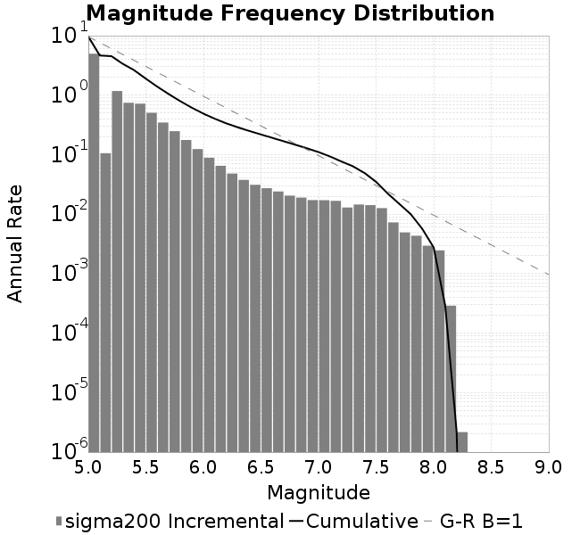
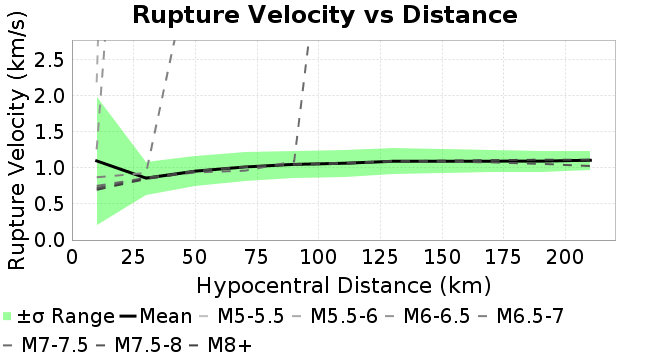
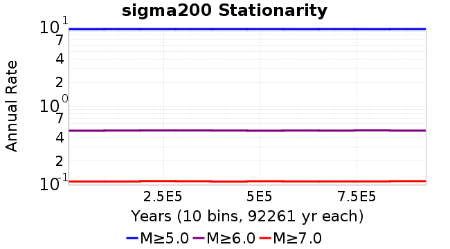
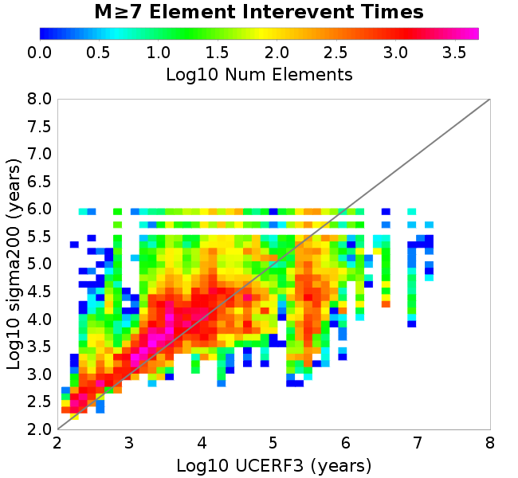
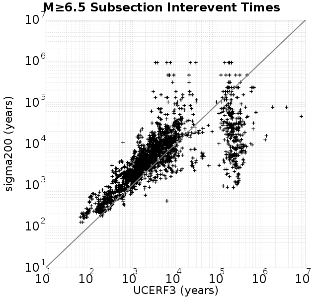
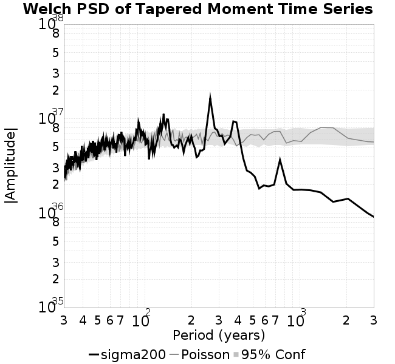

# sigma200
## Metadata
| **Catalog** | sigma200 |
|-----|-----|
| **Author** | Jaqcui Gilchrist, 2018/09/27 |
| **Description** | vary tau/sigma: sigma0=200, tau0=110 |
| **Fault/Def Model** | Fault Model 3.1, Geologic |
| **Slip Velocity** | 1.0 m/s |
| **Average Element Area** | 1.35 km^2 |
| **Length** | 9,048,372 events in 927,617 years |
| **Frictional Params** | a=0.001, b=0.008, (b-a)=0.007, ddotEQ=1 |

* [Metadata](#metadata)
* [Plots](#plots)
  * [Magnitude-Frequency Plot](#magnitude-frequency-plot)
  * [Magnitude-Area Plots](#magnitude-area-plots)
  * [Slip-Area Plots](#slip-area-plots)
  * [Rupture Velocity Plots](#rupture-velocity-plots)
  * [Global Interevent-Time Distributions](#global-interevent-time-distributions)
  * [Normalized Fault Interevent-Time Distributions](#normalized-fault-interevent-time-distributions)
  * [Stationarity Plot](#stationarity-plot)
  * [Element/Subsection Interevent Time Comparisons](#elementsubsection-interevent-time-comparisons)
    * [Element Interevent Time Comparisons](#element-interevent-time-comparisons)
    * [Subsection Interevent Time Comparisons](#subsection-interevent-time-comparisons)
  * [Paleo Open Interval Plots](#paleo-open-interval-plots)
    * [Paleo Open Interval Plots, Biasi and Sharer 2019](#paleo-open-interval-plots-biasi-and-sharer-2019)
    * [Paleo Open Interval Plots, UCERF3](#paleo-open-interval-plots-ucerf3)
  * [Moment Release Variability Plots](#moment-release-variability-plots)
* [Input File](#input-file)

## Plots
### Magnitude-Frequency Plot
*[(top)](#sigma200)*


### Magnitude-Area Plots
*[(top)](#sigma200)*

| Scatter | 2-D Hist |
|-----|-----|
|  |  |
### Slip-Area Plots
*[(top)](#sigma200)*

| Scatter | 2-D Hist |
|-----|-----|
|  |  |
### Rupture Velocity Plots
*[(top)](#sigma200)*

| **Scatter** |  |
|-----|-----|
| **Distance/Velocity** |  |
### Global Interevent-Time Distributions
*[(top)](#sigma200)*

| **M≥6** | **M≥6.5** | **M≥7** | **M≥7.5** |
|-----|-----|-----|-----|
|  |  |  |  |
### Normalized Fault Interevent-Time Distributions
*[(top)](#sigma200)*

|  | **M≥6** | **M≥6.5** | **M≥7** | **M≥7.5** |
|-----|-----|-----|-----|-----|
| **Elements** |  |  |  |  |
| **Subsections** |  |  |  |  |
| **Sections** |  |  |  |  |
### Stationarity Plot
*[(top)](#sigma200)*


### Element/Subsection Interevent Time Comparisons

#### Element Interevent Time Comparisons
*[(top)](#sigma200)*

| Min Mag | Scatter | 2-D Hist |
|-----|-----|-----|
| **M≥6.0** |  |  |
| **M≥6.5** |  |  |
| **M≥7.0** |  |  |
| **M≥7.5** |  |  |

#### Subsection Interevent Time Comparisons
*[(top)](#sigma200)*

*Subsections participate in a rupture if at least 20.0 % of its area ruptures*

| Min Mag | Scatter | 2-D Hist |
|-----|-----|-----|
| **M≥6.0** |  |  |
| **M≥6.5** |  |  |
| **M≥7.0** |  |  |
| **M≥7.5** |  |  |

### Paleo Open Interval Plots
*[(top)](#sigma200)*

#### Paleo Open Interval Plots, Biasi and Sharer 2019
*[(top)](#sigma200)*

These plots use the 5 paleoseismic sites identified in Biasi & Scharer (2019) on the Hayward, N. SAF, S. SAF, and SJC faults. By default, a rupture is counted at a paleo site if the nearest element (at the surface) slips any amount. We also alternatively apply a probability of detection model. Those results are marked as 'Prob. Filtered'.

**Paleoseismic sites table:**

| **Site Name** | Data MRI (yr) | Data Annual Rate | Catalog MRI (yr) | Catalog Annual Rate | Catalog Occurences | Prob Filtered Catalog MRI (yr) | Prob Filtered Catalog Annual Rate | Prob Filtered Catalog Occurences |
|-----|-----|-----|-----|-----|-----|-----|-----|-----|
| **HOG** | 191.00 | 0.005235602 | 715.11 | 0.0013983797 | 1290 | 722.49 | 0.0013841091 | 1276.8 |
| **FRA** | 119.00 | 0.008403362 | 236.03 | 0.0042368183 | 3909 | 239.98 | 0.004167014 | 3844.6 |
| **COA** | 181.00 | 0.005524862 | 352.52 | 0.0028367029 | 2617 | 362.76 | 0.0027566722 | 2543.17 |
| **SCZ** | 106.00 | 0.009433962 | 243.17 | 0.0041123526 | 3794 | 252.18 | 0.0039654765 | 3658.37 |
| **TYS** | 329.00 | 0.0030395137 | 690.81 | 0.0014475757 | 1336 | 712.76 | 0.0014029901 | 1294.82 |
| **TOTAL** | 31.61 | 0.0316373 | 71.26 | 0.014032202 | 12946 | 73.11 | 0.013678441 | 12619.61 |

**Paleoseismic Plots:**

|  |  |
|-----|-----|

**Open interval probabilities table:**

| **Open Interval (yr)** | Catalog Probability | Catalog Poisson Probability | Prob. Filtered Catalog Probability | Prob. Filtered Catalog Poisson Probability | Data Poisson Probability |
|-----|-----|-----|-----|-----|-----|
| **10.00** | 0.99322706 | 0.86907834 | 0.99358743 | 0.8721582 | 0.72878754 |
| **20.00** | 0.972829 | 0.7552971 | 0.974181 | 0.76066 | 0.53113127 |
| **30.00** | 0.9400438 | 0.65641236 | 0.9428773 | 0.66341585 | 0.3870819 |
| **40.00** | 0.9008429 | 0.5704738 | 0.9052244 | 0.5786036 | 0.28210047 |
| **50.00** | 0.8558918 | 0.4957864 | 0.86200446 | 0.5046339 | 0.2055913 |
| **60.00** | 0.8001563 | 0.4308772 | 0.808053 | 0.4401206 | 0.14983238 |
| **70.00** | 0.744802 | 0.37446606 | 0.7544963 | 0.38385484 | 0.10919597 |
| **80.00** | 0.68861914 | 0.32544035 | 0.6998853 | 0.33478215 | 0.079580665 |
| **90.00** | 0.63211167 | 0.28283313 | 0.64450544 | 0.291983 | 0.057997398 |
| **100.00** | 0.5679584 | 0.24580416 | 0.58203155 | 0.2546554 | 0.04226778 |
| **110.00** | 0.50402975 | 0.21362306 | 0.5191233 | 0.2220998 | 0.030804234 |
| **120.00** | 0.44345918 | 0.18565518 | 0.4593668 | 0.19370615 | 0.022449743 |
| **130.00** | 0.3873423 | 0.1613489 | 0.40398946 | 0.16894242 | 0.016361093 |
| **140.00** | 0.33152658 | 0.14022483 | 0.34819624 | 0.14734453 | 0.011923761 |
| **150.00** | 0.2796721 | 0.12186636 | 0.29613912 | 0.12850775 | 0.008689889 |
| **160.00** | 0.23540187 | 0.10591141 | 0.25169575 | 0.112079084 | 0.0063330824 |
| **170.00** | 0.19446656 | 0.092045315 | 0.20964882 | 0.0977507 | 0.0046154717 |
| **180.00** | 0.16231924 | 0.07999459 | 0.1760595 | 0.08525407 | 0.0033636983 |
| **190.00** | 0.1314745 | 0.06952156 | 0.14415215 | 0.07435504 | 0.0024514215 |
| **200.00** | 0.108498685 | 0.060419682 | 0.11964236 | 0.06484936 | 0.0017865654 |
| **210.00** | 0.08312827 | 0.05250944 | 0.09366953 | 0.056558907 | 0.0013020267 |
| **220.00** | 0.061523695 | 0.045634814 | 0.07075769 | 0.049328316 | 9.489008E-4 |
| **230.00** | 0.040841915 | 0.03966023 | 0.048786104 | 0.043022096 | 6.915471E-4 |
| **240.00** | 0.029824253 | 0.034467846 | 0.036157712 | 0.037522078 | 5.039909E-4 |
| **250.00** | 0.023236481 | 0.029955257 | 0.028058948 | 0.03272519 | 3.673023E-4 |
| **260.00** | 0.0145817865 | 0.026033465 | 0.01797276 | 0.028541543 | 2.6768536E-4 |
| **270.00** | 0.009313089 | 0.02262512 | 0.011604759 | 0.024892742 | 1.9508575E-4 |
| **280.00** | 0.0043584714 | 0.019663002 | 0.006006702 | 0.021710409 | 1.4217607E-4 |
| **290.00** | 0.0014744118 | 0.017088689 | 0.0025937834 | 0.018934913 | 1.0361615E-4 |
| **300.00** | 0.0 | 0.014851409 | 8.088899E-4 | 0.01651424 | 7.551416E-5 |
| **310.00** | 0.0 | 0.012907038 | 4.4084853E-4 | 0.01440303 | 5.503378E-5 |
| **320.00** | 0.0 | 0.011217227 | 2.9860623E-4 | 0.012561722 | 4.0107934E-5 |
| **330.00** | 0.0 | 0.009748649 | 1.8954808E-4 | 0.010955809 | 2.9230163E-5 |
| **340.00** | 0.0 | 0.008472339 | 1.1109515E-4 | 0.009555199 | 2.1302578E-5 |
| **350.00** | 0.0 | 0.0073631266 | 8.155228E-5 | 0.008333646 | 1.5525055E-5 |
| **360.00** | 0.0 | 0.006399134 | 6.520061E-5 | 0.0072682574 | 1.1314466E-5 |
| **370.00** | 0.0 | 0.0055613485 | 5.6117406E-5 | 0.006339071 | 8.245842E-6 |
| **380.00** | 0.0 | 0.0048332475 | 5.1558174E-5 | 0.0055286726 | 6.009467E-6 |
| **390.00** | 0.0 | 0.0042004706 | 4.4840603E-5 | 0.0048218775 | 4.379625E-6 |
| **400.00** | 0.0 | 0.0036505382 | 2.7988202E-5 | 0.00420544 | 3.1918162E-6 |
| **410.00** | 0.0 | 0.0031726037 | 8.674903E-6 | 0.0036678093 | 2.3261557E-6 |
| **420.00** | 0.0 | 0.002757241 | 7.783572E-6 | 0.00319891 | 1.6952735E-6 |
| **430.00** | 0.0 | 0.0023962585 | 6.8922423E-6 | 0.0027899558 | 1.2354942E-6 |
| **440.00** | 0.0 | 0.0020825362 | 6.0009115E-6 | 0.0024332828 | 9.004128E-7 |
| **450.00** | 0.0 | 0.0018098871 | 5.1095813E-6 | 0.0021222078 | 6.5620964E-7 |
| **460.00** | 0.0 | 0.0015729337 | 0.0 | 0.0018509009 | 4.782374E-7 |

#### Paleo Open Interval Plots, UCERF3
*[(top)](#sigma200)*

These plots use the full set of UCERF3 paleoseismic sites. By default, a rupture is counted at a paleo site if the nearest element (at the surface) slips any amount. We also alternativeslyapply a probability of detection model. Those results are marked as 'Prob. Filtered'.

**Paleoseismic sites table:**

| **Site Name** | Data MRI (yr) | Data Annual Rate | Catalog MRI (yr) | Catalog Annual Rate | Catalog Occurences | Prob Filtered Catalog MRI (yr) | Prob Filtered Catalog Annual Rate | Prob Filtered Catalog Occurences |
|-----|-----|-----|-----|-----|-----|-----|-----|-----|
| **SSanAndreasBurroFlats** | 205.44 | 0.0048677 | 416.09 | 0.002403307 | 2218 | 431.23 | 0.0023189331 | 2140.14 |
| **SSanAndreasIndio** | 277.37 | 0.0036053 | 344.88 | 0.002899596 | 2675 | 352.21 | 0.0028391932 | 2619.27 |
| **SSAFMCreek1000Palms** | 261.33 | 0.0038266 | 3126.86 | 3.1980954E-4 | 295 | 3586.74 | 2.7880486E-4 | 257.09 |
| **NSanAndreasFortRoss** | 306.28 | 0.003265 | 381.78 | 0.0026193163 | 2417 | 385.73 | 0.0025924726 | 2392.23 |
| **NSanAndreasNorthCoast** | 263.87 | 0.0037898 | 364.43 | 0.0027439941 | 2532 | 369.04 | 0.0027097254 | 2500.34 |
| **CalaverasfaultNorth** | 618.05 | 0.001618 | 329.01 | 0.0030394415 | 2804 | 373.34 | 0.002678506 | 2470.81 |
| **ElsinoreTemecula** | 1019.16 | 9.812E-4 | 1396.99 | 7.158253E-4 | 661 | 1416.36 | 7.0603547E-4 | 651.94 |
| **ElsinoreWhittier** | 3196.93 | 3.128E-4 | 3047.67 | 3.2811903E-4 | 303 | 3109.37 | 3.2160868E-4 | 296.98 |
| **SSAFCarrizoBidart** | 114.71 | 0.0087179 | 247.62 | 0.0040384205 | 3726 | 250.93 | 0.003985178 | 3676.87 |
| **SanJacintoHogLake** | 311.78 | 0.0032074 | 715.11 | 0.0013983797 | 1290 | 722.68 | 0.001383745 | 1276.51 |
| **PuenteHills** | 3506.31 | 2.852E-4 | 10310.73 | 9.698635E-5 | 90 | 10610.20 | 9.4248964E-5 | 87.48 |
| **SanGregorioNorth** | 1019.06 | 9.813E-4 | 798.07 | 0.0012530265 | 1156 | 810.24 | 0.0012341975 | 1138.64 |
| **SanJacintoSuperstition** | 508.26 | 0.0019675 | 2423.19 | 4.1267832E-4 | 381 | 2470.08 | 4.0484488E-4 | 373.77 |
| **SSanAndreasWrightwood** | 106.04 | 0.0094304 | 306.85 | 0.0032589242 | 3007 | 310.04 | 0.0032254332 | 2976.09 |
| **SSanAndreasPitmanCanyon** | 173.48 | 0.0057643 | 287.62 | 0.0034768363 | 3208 | 298.23 | 0.003353092 | 3093.68 |
| **SSanAndreasPlungeCreek** | 205.36 | 0.0048695 | 719.71 | 0.0013894574 | 1282 | 772.45 | 0.0012945791 | 1194.43 |
| **FrazierMountianSSAF** | 148.57 | 0.0067307 | 236.03 | 0.0042368183 | 3909 | 239.96 | 0.0041673975 | 3844.92 |
| **NSanAndreasSantaCruzSeg** | 109.84 | 0.0091041 | 243.17 | 0.0041123526 | 3794 | 252.39 | 0.0039621936 | 3655.4 |
| **RodgersCreek** | 325.31 | 0.003074 | 325.69 | 0.0030703829 | 2833 | 368.33 | 0.002714971 | 2504.67 |
| **GreenValleyMasonRoad** | 293.31 | 0.0034094 | 3573.82 | 2.7981264E-4 | 258 | 3903.66 | 2.5616973E-4 | 236.18 |
| **HaywardfaultNorth** | 318.34 | 0.0031413 | 741.66 | 0.0013483312 | 1244 | 750.48 | 0.0013324827 | 1229.38 |
| **HaywardfaultSouth** | 167.57 | 0.0059677 | 690.81 | 0.0014475757 | 1336 | 712.21 | 0.0014040882 | 1295.86 |
| **Compton** | 2658.16 | 3.762E-4 | 12570.62 | 7.95506E-5 | 74 | 12971.82 | 7.709015E-5 | 71.73 |
| **SSanAndreasCoachella** | 178.45 | 0.0056037 | 352.52 | 0.0028367029 | 2617 | 362.56 | 0.002758162 | 2544.57 |
| **ElsinoreGlenIvy** | 179.12 | 0.0055828 | 1143.72 | 8.7433914E-4 | 807 | 1174.65 | 8.5131696E-4 | 785.76 |
| **GarlockCentralallevents** | 1434.93 | 6.969E-4 | 1291.80 | 7.741153E-4 | 714 | 1306.57 | 7.653645E-4 | 705.94 |
| **NSanAndreasAlderCreek** | 869.64 | 0.0011499 | 383.68 | 0.0026063067 | 2405 | 387.63 | 0.0025797642 | 2380.49 |
| **SSanAndreasPallettCreek** | 149.30 | 0.006698 | 307.16 | 0.0032556718 | 3004 | 310.26 | 0.0032231454 | 2973.99 |
| **GarlockWesternallevents** | 1230.16 | 8.129E-4 | 1676.15 | 5.9660483E-4 | 551 | 1696.76 | 5.893588E-4 | 544.32 |
| **ElsinoreFaultJulian** | 3250.98 | 3.076E-4 | 2485.70 | 4.023009E-4 | 372 | 2512.64 | 3.9798726E-4 | 368 |
| **TOTAL** | 9.08 | 0.1101451 | 28.72 | 0.034814384 | 32118 | 29.85 | 0.033506047 | 30911.03 |

**Paleoseismic Plots:**

|  |  |
|-----|-----|

**Open interval probabilities table:**

| **Open Interval (yr)** | Catalog Probability | Catalog Poisson Probability | Prob. Filtered Catalog Probability | Prob. Filtered Catalog Poisson Probability | Data Poisson Probability |
|-----|-----|-----|-----|-----|-----|
| **10.00** | 0.957531 | 0.7059973 | 0.96027964 | 0.71529484 | 0.33238843 |
| **20.00** | 0.8575137 | 0.4984322 | 0.8657165 | 0.5116467 | 0.110482074 |
| **30.00** | 0.72954947 | 0.3518918 | 0.74320686 | 0.36597824 | 0.036722966 |
| **40.00** | 0.5979086 | 0.24843465 | 0.61617583 | 0.26178235 | 0.012206289 |
| **50.00** | 0.4791423 | 0.17539419 | 0.4993562 | 0.18725155 | 0.004057229 |
| **60.00** | 0.3682657 | 0.12382783 | 0.3893293 | 0.13394007 | 0.001348576 |
| **70.00** | 0.27819178 | 0.08742212 | 0.29804268 | 0.09580664 | 4.4825108E-4 |
| **80.00** | 0.20540757 | 0.06171978 | 0.22351748 | 0.06852999 | 1.4899348E-4 |
| **90.00** | 0.14759356 | 0.043573998 | 0.16259669 | 0.04901915 | 4.952371E-5 |
| **100.00** | 0.10354155 | 0.030763125 | 0.1158465 | 0.035063148 | 1.6461108E-5 |
| **110.00** | 0.072456844 | 0.021718683 | 0.08235227 | 0.025080487 | 5.4714824E-6 |
| **120.00** | 0.047264706 | 0.015333332 | 0.05502947 | 0.017939942 | 1.8186574E-6 |
| **130.00** | 0.03064297 | 0.010825291 | 0.03637829 | 0.012832348 | 6.045007E-7 |
| **140.00** | 0.019789696 | 0.0076426263 | 0.024347346 | 0.009178912 | 2.0092905E-7 |
| **150.00** | 0.013383932 | 0.0053956737 | 0.016530601 | 0.0065656286 | 6.678649E-8 |
| **160.00** | 0.007517307 | 0.003809331 | 0.009655248 | 0.0046963603 | 2.2199057E-8 |
| **170.00** | 0.005547697 | 0.0026893774 | 0.007106545 | 0.0033592822 | 7.37871E-9 |
| **180.00** | 0.0032916933 | 0.0018986932 | 0.0043982747 | 0.0024028772 | 2.452598E-9 |
| **190.00** | 0.0014487825 | 0.0013404723 | 0.0021065513 | 0.0017187656 | 8.152152E-10 |
| **200.00** | 4.27998E-4 | 9.4636984E-4 | 7.135447E-4 | 0.0012294241 | 2.709681E-10 |
| **210.00** | 3.1685518E-4 | 6.6813454E-4 | 5.302173E-4 | 8.7940076E-4 | 9.006666E-11 |
| **220.00** | 0.0 | 4.7170118E-4 | 1.4927701E-4 | 6.290308E-4 | 2.993712E-11 |
| **230.00** | 0.0 | 3.3301977E-4 | 7.9200196E-5 | 4.499425E-4 | 9.950752E-12 |
| **240.00** | 0.0 | 2.3511106E-4 | 6.8916255E-5 | 3.2184154E-4 | 3.3075149E-12 |
| **250.00** | 0.0 | 1.6598777E-4 | 6.3863685E-5 | 2.3021159E-4 | 1.0993797E-12 |
| **260.00** | 0.0 | 1.1718692E-4 | 6.270977E-5 | 1.6466917E-4 | 3.654211E-13 |
| **270.00** | 0.0 | 8.273365E-5 | 6.155586E-5 | 1.17787E-4 | 1.2146175E-13 |
| **280.00** | 0.0 | 5.8409736E-5 | 0.0 | 8.425243E-5 | 4.037248E-14 |

### Moment Release Variability Plots
*[(top)](#sigma200)*

We first create a tapered moment release time series for the entire catalog. Each event's moment is distributed across a 25 year Hanning (cosine) taper. Here is a plot of a random 2,000 year section of this time series:


We then compute Welch's power spectral density estimate on the entire time series. Results are plotted below, with a Poisson randomization of the catalog also plotted in a gray line, and the 95% confidence bounds from 200 realizations as a light gray shaded area. Significant deviations outside the Poisson confidence intervals indicate synchronous behaviour.



## Input File
*[(top)](#sigma200)*

```
  A_1 = 0.001
  fA = .1
  B_1 = 0.008
  muSlipAmp_1 = .0
  muSlipInvDist_1 = 1.0
  cohesion = 0.0
  Dc_1 = 1.0000000000000000818e-05
  mu0_1 = 0.6
  ddotStar_1 = 9.9999999999999995475e-07
  ddotAB_1 = 9.9999999999999995475e-07
  alpha_1 = 0.0
  theta0_1 = 200000000
  tau0_1 = 110
  sigma0_1 = 200
  sigmaFracPin = .5
  lowSigmaAction = 1
  maxThetaPin = 1.0e13
  ddotEQ_1 = 1
  ddotEQFname = 
  stressOvershootFactor = 0.10000000000000000555
  lameLambda = 30000
  lameMu = 30000
  slowSlip_1 = 0
  nEq = 100000000000
  KZeroFrac = 0
  muPin = 1.0
  tStart = 0
  maxT = 3.16e13
  maxWallTime = 169200
  maxTrans = 1.0000000000000000159e100
  faultFname = UCERF3FM.15km.1km.tri.flt
  outFnameInfix = sigma200
  writeTau = 2
  writeSigma = 2
  writeSlip = 0
  writeSlipSpeed = 0
  writeState = 0
  writeTheta = 2
  writePED = 1
  writeTransitions = 1
  minDtWrite = 0
  minDtWriteCoseismic = 0
  minDtWriteInterseismic = 0
  minMagWrite = 7.7
  writeStiffness = 0
  stressRateSpecification = 1
  dMu3 = 0.01000000000000000
  initTauFname = 
  initSigmaFname = 
  initThetaFname = 
  initSlipSpeedFname = 
  AFname = 
  BFname =  
  DcFname = 
  mu0Fname = 
  ddotStarFname = 
  ddotABFname = 
  alphaFname = 
  KTauFname = /u/sciteam/gilchris/scratch/stiffness_25a589d/Ktau.25a589d.out
  KSigmaFname = /u/sciteam/gilchris/scratch/stiffness_25a589d/Ksigma.25a589d.out
  tFailFname = 
  tauFailFname = 
  tauDotFname = 
  sigmaDotFname =
  KZeroFname = UCERF3FM.15km.1km.tri.KZero
  pinnedFname =  UCERF3FM.15km.1km.tri.pin
  neighborFname = UCERF3FM.15km.1km.tri.neighbors
  stressRateFname =  
  slowSlipFname = 
  writePatchFname = 
  DEBUG = 0
  ZBrentUpperBracket = 0
  receiverElementAreaFrac = 0.8
  receiverElementIntTol = 1.0e-4
  receiverElementSubdivisionMax = 4
  tgfDist1 = 3
  tgfDist1 = 10
  lowSigmaAction = 1
  highSigmaAction = 0
```
