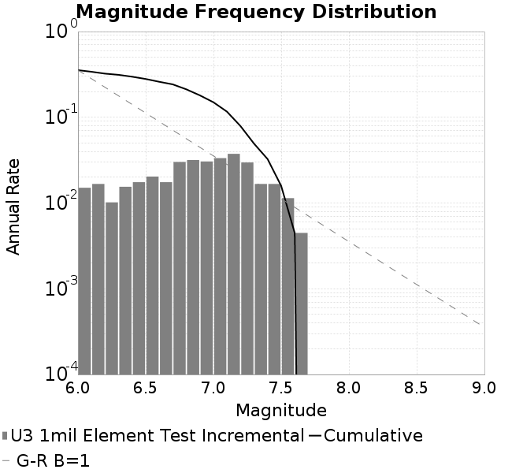
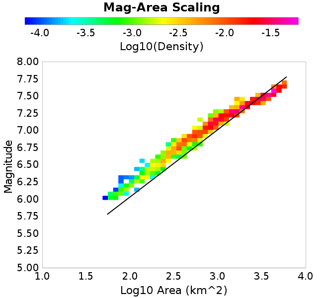
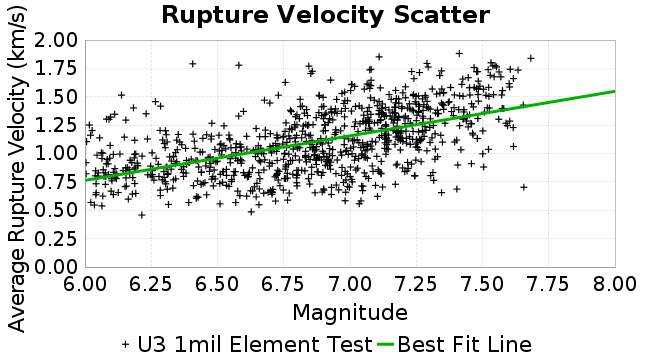
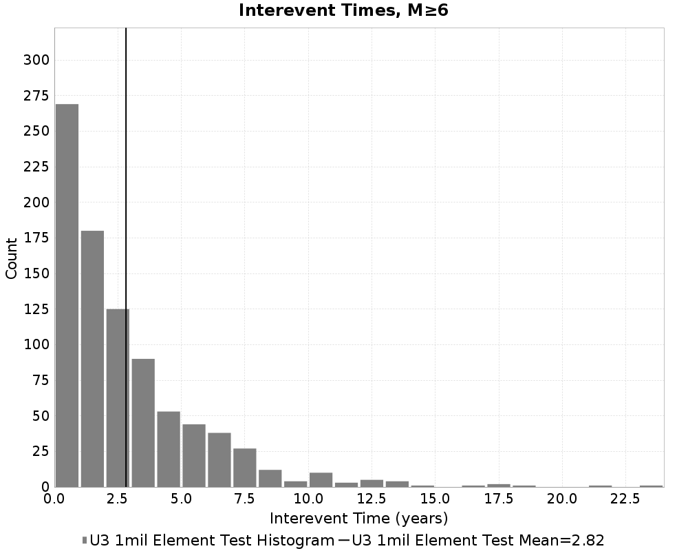
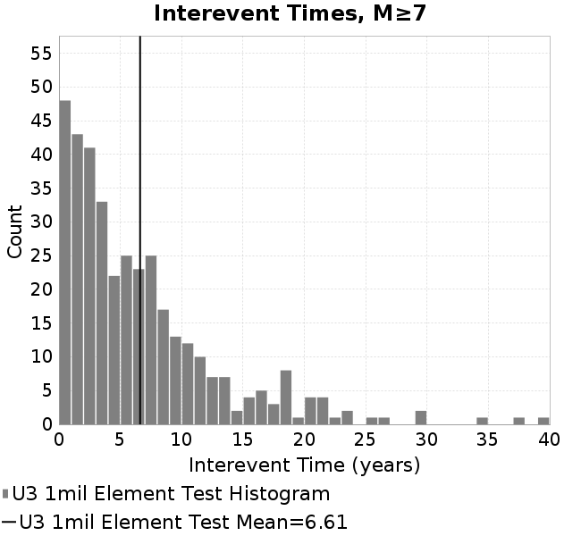
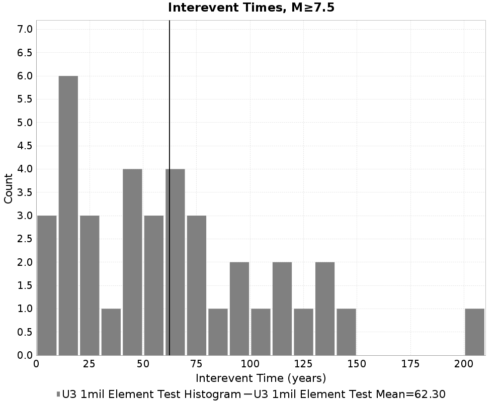

# U3 1mil Element Test
## Metadata
| **Catalog** | U3 1mil Element Test |
|-----|-----|
| **Author** | Jacqui Gilchrist, 2017/09/27 |
| **Description** | Test 1 million element catalog on UCERF3 fault system, ~0.25 km^2 trianglar elements |
| **Fault/Def Model** | Fault Model 3.1, Geologic |
| **Slip Velocity** | 1.0 m/s |
| **Average Element Area** | 0.23 km^2 |
| **Length** | 5,587,999 events in 7,481 years |
| **Frictional Params** | a=0.01, b=0.015, (b-a)=0.005, ddotEQ=1 |

* [Metadata](#metadata)
* [Single Event Comparisons](#single-event-comparisons)
* [Plots](#plots)
  * [Magnitude-Frequency Plot](#magnitude-frequency-plot)
  * [Magnitude-Area Plots](#magnitude-area-plots)
  * [Rupture Velocity Plots](#rupture-velocity-plots)
  * [Interevent-Time Distributions](#interevent-time-distributions)
* [Input File](#input-file)

## Single Event Comparisons
*[(top)](#u3-1mil-element-test)*
* [Event 4099020, M7.35](event_4099020/)

## Plots
### Magnitude-Frequency Plot
*[(top)](#u3-1mil-element-test)*

### Magnitude-Area Plots
*[(top)](#u3-1mil-element-test)*
| Scatter | 2-D Hist |
|-----|-----|
|  |  |
### Rupture Velocity Plots
*[(top)](#u3-1mil-element-test)*
| **Scatter** |  |
|-----|-----|
| **Distance/Velocity** |  |
### Interevent-Time Distributions
*[(top)](#u3-1mil-element-test)*
| **M≥6** | **M≥6.5** | **M≥7** | **M≥7.5** |
|-----|-----|-----|-----|
|  |  |  |  |

## Input File
*[(top)](#u3-1mil-element-test)*

```
  A_1 = 0.010000000000000000208
  fA = 0.10000000000000000555
  B_1 = 0.014999999999999999445
  Dc_1 = 1.0000000000000000818e-05
  mu0_1 = 0.5999999999999999778
  ddotStar_1 = 9.9999999999999995475e-07
  ddotAB_1 = 9.9999999999999995475e-07
  alpha_1 = 0.25
  theta0_1 = 200000000
  tau0_1 = 60
  sigma0_1 = 100
  sigmaFracPin = 0.1
  maxThetaPin = 10000000000
  ddotEQ_1 = 1
  ddotEQFname = 
  stressOvershootFactor = 0.10000000000000000555
  lameLambda = 30000
  lameMu = 30000
  slowSlip_1 = 0
  nEq = 3e20
  tStart = 0
  maxT = 3e12
  faultFname = UCERF3.D3.1.millionElements.flt
  outFnameInfix = UCERF3.D3.1.millionElements1
  writeTau = 0
  writeSigma = 0
  writeSlip = 0
  writeSlipSpeed = 0
  writeState = 0
  writeTheta = 0
  writePED = 1
  writeTransitions = 1
  minDtWrite = 3.15e10
  minDtWriteCoseismic = 0
  minDtWriteInterseismic = 0
  minMagWrite = 7.77
  writeStiffness = 0
  stressRateSpecification = 1
  dMu3 = 0.0010000000000000000208
  initTauFname = 
  initSigmaFname = 
  initThetaFname = 
  initSlipSpeedFname = 
  AFname = 
  BFname = 
  DcFname = 
  mu0Fname = 
  ddotStarFname = 
  ddotABFname = 
  alphaFname = 
  KTauFname = 
  KSigmaFname = 
  tFailFname = 
  tauFailFname = 
  tauDotFname = 
  sigmaDotFname = 
  pinnedFname = 
  neighborFname = neighbors.12
  stressRateFname = 
  slowSlipFname = 
  writePatchFname = 
  DEBUG = 1
  ZBrentUpperBracket = 0
  ZBrentTol = 9.9999999999999995475e-07
  lowSigmaAction = 0
  KZeroFrac = 0.0
  KZeroFname = UCERF3.D3.1.millionElements.KZero0.8
  slipInState1 = 1
  resetStressingRates = 1
```
