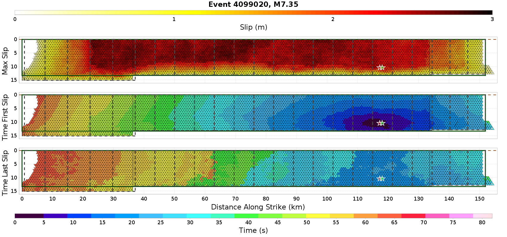
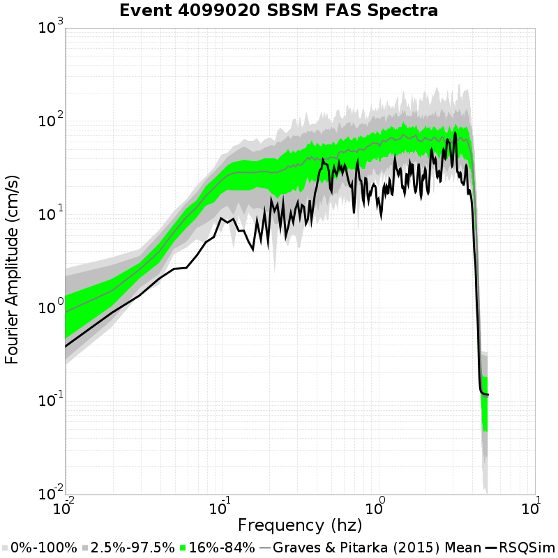

# Event 4099020, M7.35

| Catalog | U3 1mil Element Test |
|-----|-----|
| Author | Jacqui Gilchrist, 2017/09/27 |
| Description | Test 1 million element catalog on UCERF3 fault system, ~0.25 km^2 trianglar elements |
| Fault/Def Model | Fault Model 3.1, Geologic |
| Slim Velocity | 1.0 m/s |
| Average Element Area | 0.23 km^2 |

## Rupture Plots
**Legend**
* Colored, Filled Triangles: RSQSim Elements
* Red Star: RSQSim Hypocenter
* Dark Green Solid Outline: BBP Equivalent Planar Surface
* Green Star: BBP Equivalent Hypocenter
* Dark Gray Dashed Outline: GMPE Surface

### Slip/Time Plot

### Map Plot

## Spectra Plots
## Site USC
*34.0192, -118.286*

| Distance | Actual RSQSim Surface | BBP Equivalent Planar Surface | GMPE Surface |
|-----|-----|-----|-----|
| Horizontal | 60.07 km | 56.61 km | 60.07 km |
| 3-D | 60.07 km | 56.61 km | 60.07 km |

*NOTE: RSQSim ruptures sometimes have elements corupture on faults some distance away, which may cause discrepancies in the table above. Consult the rupture map plot.*
### Fourrier Amplitude Spectra

### RotD50 Spectra

## Site SBSM
*34.064987, -117.29201*

| Distance | Actual RSQSim Surface | BBP Equivalent Planar Surface | GMPE Surface |
|-----|-----|-----|-----|
| Horizontal | 17.50 km | 20.86 km | 20.49 km |
| 3-D | 20.49 km | 20.86 km | 20.49 km |

*NOTE: RSQSim ruptures sometimes have elements corupture on faults some distance away, which may cause discrepancies in the table above. Consult the rupture map plot.*
### Fourrier Amplitude Spectra

### RotD50 Spectra

