# Bruce 2194
## Metadata
| **Catalog** | Bruce 2194 |
|-----|-----|
| **Author** | Bruce Shaw, 2017/07/05 |
| **Description** | Catalog with decent large event scaling and distribution of sizes while not using any of the enhanced frictional weakening terms. |
| **Fault/Def Model** | Fault Model 3.1, Geologic |
| **Slip Velocity** | 1.0 m/s |
| **Average Element Area** | 1.34 km^2 |
| **Length** | 3,665,999 events in 159,579 years |
| **Frictional Params** | a=0.001, b=0.005, (b-a)=0.004, ddotEQ=1 |

* [Metadata](#metadata)
* [Hazard Comparisons](#hazard-comparisons)
* [Multi-Fault Rupture Comparisons](#multi-fault-rupture-comparisons)
* [Plots](#plots)
  * [Magnitude-Frequency Plot](#magnitude-frequency-plot)
  * [Magnitude-Area Plots](#magnitude-area-plots)
  * [Slip-Area Plots](#slip-area-plots)
  * [Rupture Velocity Plots](#rupture-velocity-plots)
  * [Global Interevent-Time Distributions](#global-interevent-time-distributions)
  * [Normalized Fault Interevent-Time Distributions](#normalized-fault-interevent-time-distributions)
  * [Stationarity Plot](#stationarity-plot)
  * [Element/Subsection Interevent Time Comparisons](#elementsubsection-interevent-time-comparisons)
    * [Element Interevent Time Comparisons](#element-interevent-time-comparisons)
    * [Subsection Interevent Time Comparisons](#subsection-interevent-time-comparisons)
* [Input File](#input-file)

## Hazard Comparisons
*[(top)](#bruce-2194)*

* [PGA](hazard_pga/)
* [0.2s SA](hazard_sa_0.2s/)
* [1.0s SA](hazard_sa_1.0s/)
* [10.0s SA](hazard_sa_10.0s/)
* [5.0s SA](hazard_sa_5.0s/)

## Multi-Fault Rupture Comparisons
*[(top)](#bruce-2194)*

[Multi-Fault Rupture Comparisons here](multi_fault/)

## Plots
### Magnitude-Frequency Plot
*[(top)](#bruce-2194)*


### Magnitude-Area Plots
*[(top)](#bruce-2194)*

| Scatter | 2-D Hist |
|-----|-----|
|  |  |
### Slip-Area Plots
*[(top)](#bruce-2194)*

| Scatter | 2-D Hist |
|-----|-----|
| 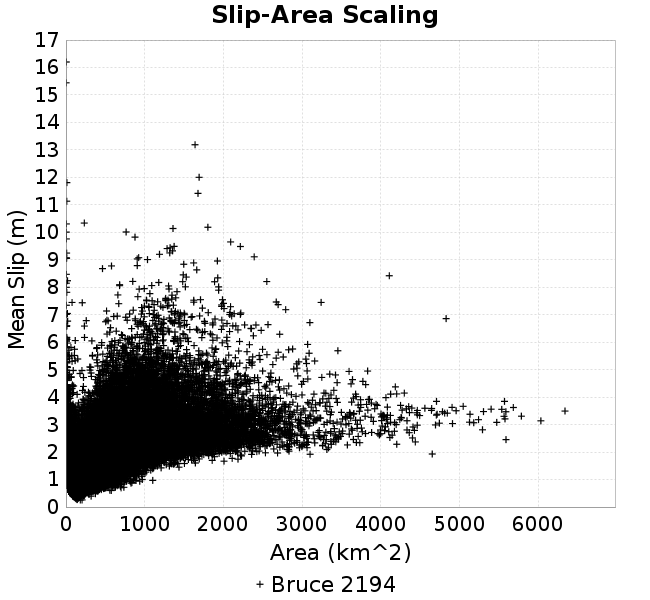 | 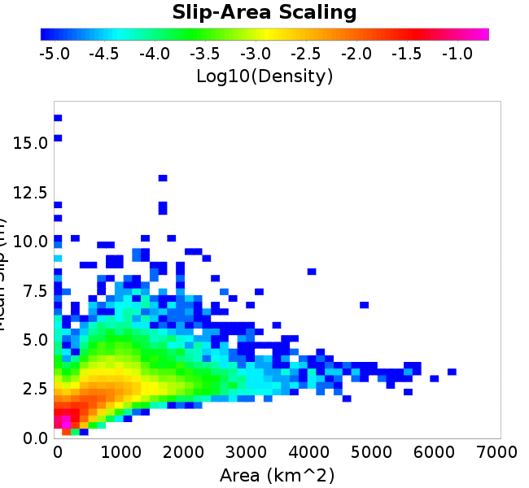 |
### Rupture Velocity Plots
*[(top)](#bruce-2194)*

| **Scatter** |  |
|-----|-----|
| **Distance/Velocity** |  |
### Global Interevent-Time Distributions
*[(top)](#bruce-2194)*

| **M≥6** | **M≥6.5** | **M≥7** | **M≥7.5** |
|-----|-----|-----|-----|
|  |  |  |  |
### Normalized Fault Interevent-Time Distributions
*[(top)](#bruce-2194)*

|  | **M≥6** | **M≥6.5** | **M≥7** | **M≥7.5** |
|-----|-----|-----|-----|-----|
| **Elements** | 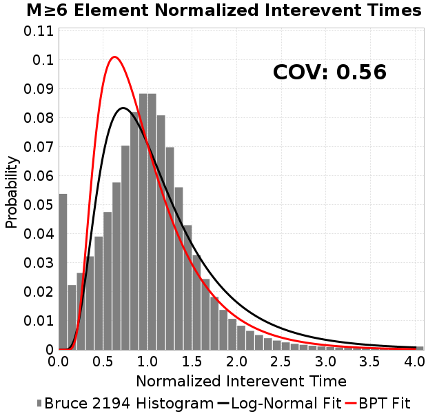 | 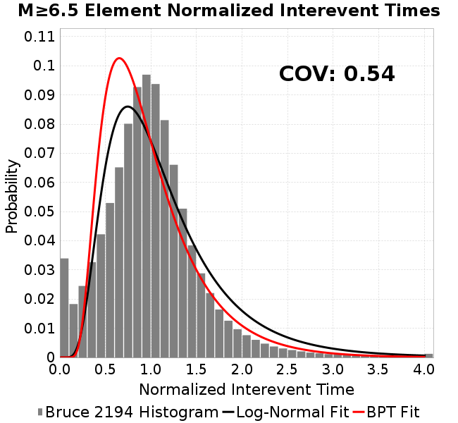 | 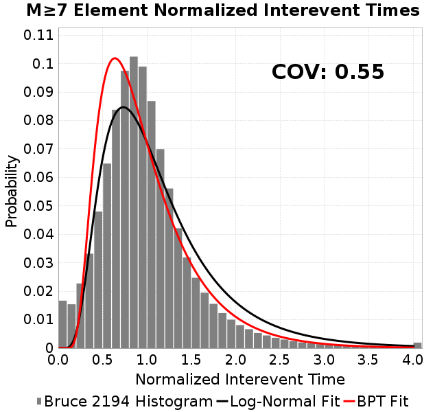 | 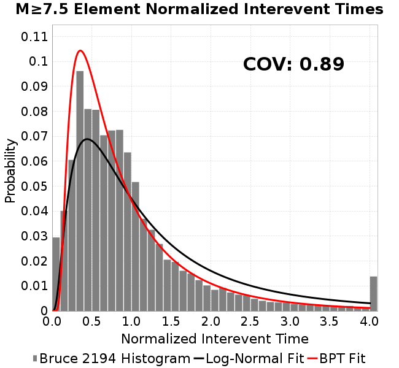 |
| **Subsections** | 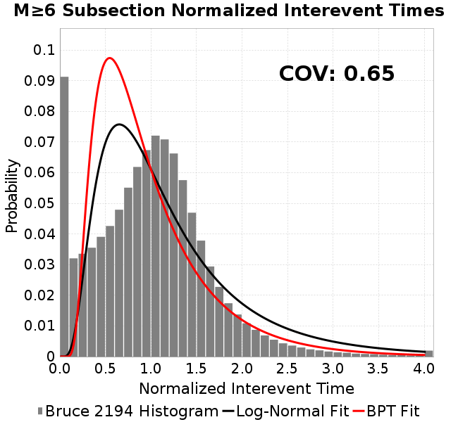 | 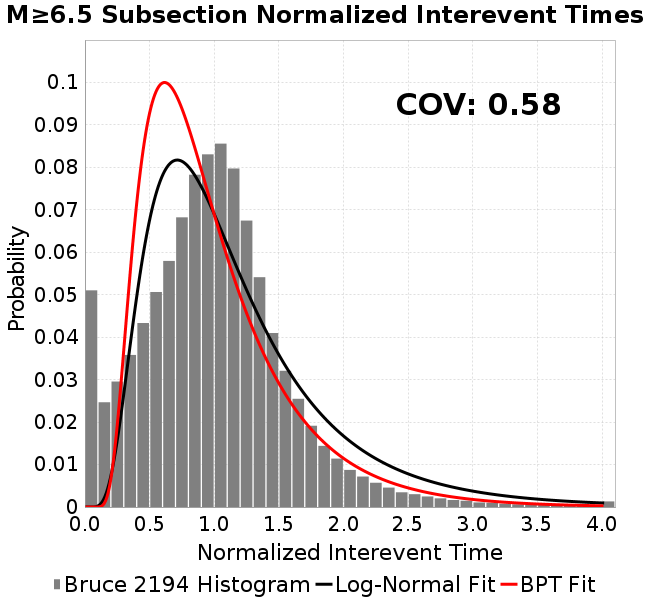 | 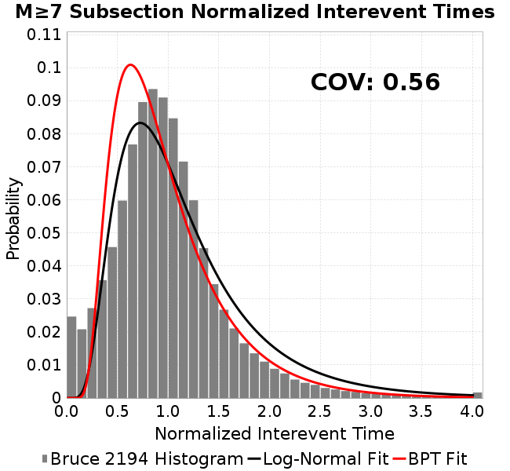 | 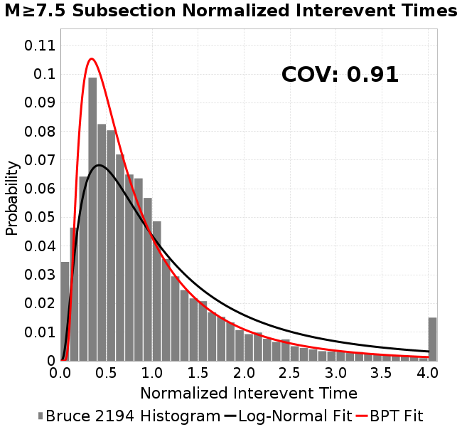 |
| **Sections** | 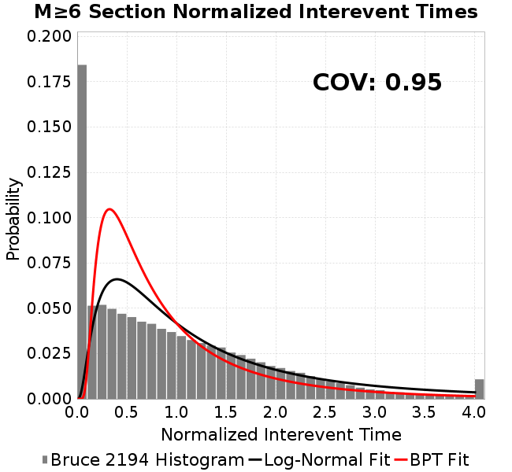 | 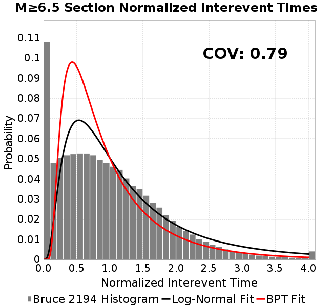 | 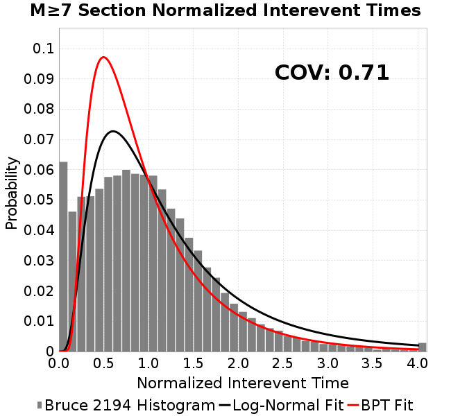 | 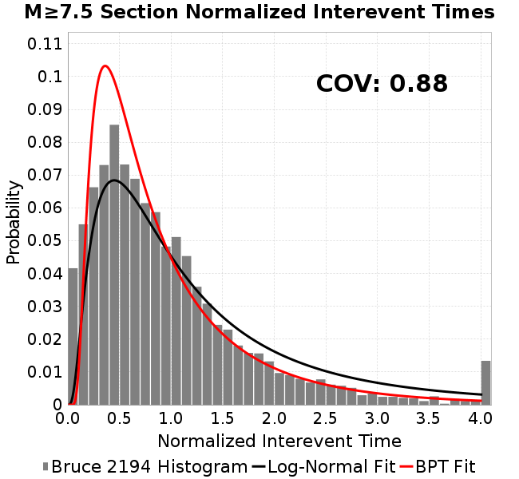 |
### Stationarity Plot
*[(top)](#bruce-2194)*


### Element/Subsection Interevent Time Comparisons

#### Element Interevent Time Comparisons
*[(top)](#bruce-2194)*

| Min Mag | Scatter | 2-D Hist |
|-----|-----|-----|
| **M≥6.0** |  |  |
| **M≥6.5** |  |  |
| **M≥7.0** |  |  |
| **M≥7.5** |  |  |

#### Subsection Interevent Time Comparisons
*[(top)](#bruce-2194)*

*Subsections participate in a rupture if at least 20.0 % of its area ruptures*

| Min Mag | Scatter | 2-D Hist |
|-----|-----|-----|
| **M≥6.0** |  |  |
| **M≥6.5** |  |  |
| **M≥7.0** |  |  |
| **M≥7.5** |  |  |

## Input File
*[(top)](#bruce-2194)*

```
  A_1 = 0.001
  fA = .1
  B_1 = 0.005
  muSlipAmp_1 = 0
  muSlipInvDist_1 = 00
  cohesion = 00
  Dc_1 = 1.0000000000000000818e-05
  mu0_1 = 0.6
  ddotStar_1 = 9.9999999999999995475e-07
  ddotAB_1 = 9.9999999999999995475e-07
  alpha_1 = 0.0
  theta0_1 = 200000000
  tau0_1 = 55
  sigma0_1 = 100
  sigmaFracPin = .5
  lowSigmaAction = 1
  maxThetaPin = 1.0e13
  ddotEQ_1 = 1
  ddotEQFname = 
  stressOvershootFactor = 0.10000000000000000555
  lameLambda = 30000
  lameMu = 30000
  slowSlip_1 = 0
  nEq = 10000000
  KZeroFrac = 0
  KOneFrac =  0
  muPin = 1.0
  tStart = 0
  maxT = 1.0000000000000000159e+100
  maxTransitions = 1.0000000000000000159e+8
  faultFname = zfault_Deepen.in
  outFnameInfix = 
  writeTau = 0
  writeSigma = 0
  writeSlip = 0
  writeSlipSpeed = 0
  writeState = 0
  writeTheta = 0
  writePED = 1
  writeTransitions = 0
  minDtWrite = 0
  minDtWriteCoseismic = 0
  minDtWriteInterseismic = 0
  minMagWrite = 0
  writeStiffness = 0
  stressRateSpecification = 2
  dMu3 = 0.01000000000000000
  initTauFname = 
  initSigmaFname = 
  initThetaFname = 
  initSlipSpeedFname = 
  AFname = 
  BFname =  
  DcFname = 
  mu0Fname = 
  ddotStarFname = 
  ddotABFname = 
  alphaFname = 
  KTauFname = 
  KSigmaFname = 
  tFailFname = 
  tauFailFname = 
  tauDotFname =  tauDotMod.in
  sigmaDotFname =  sigmaDotMod.in
  KZeroFname = zfault_Deepen_KZero.in
  pinnedFname =  
  neighborFname = 
  stressRateFname =  
  slowSlipFname = 
  writePatchFname = 
  DEBUG = 0
  ZBrentUpperBracket = 0
```
