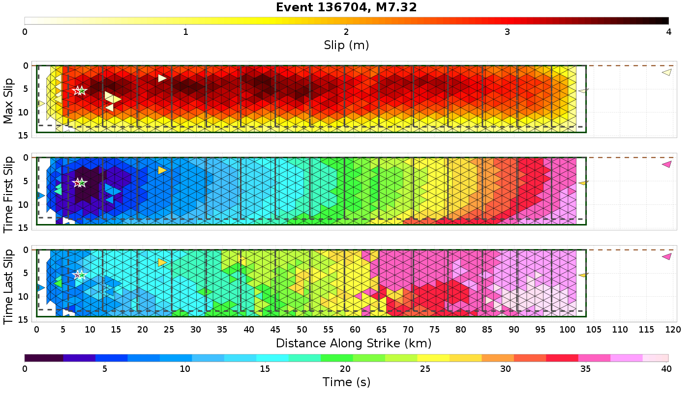
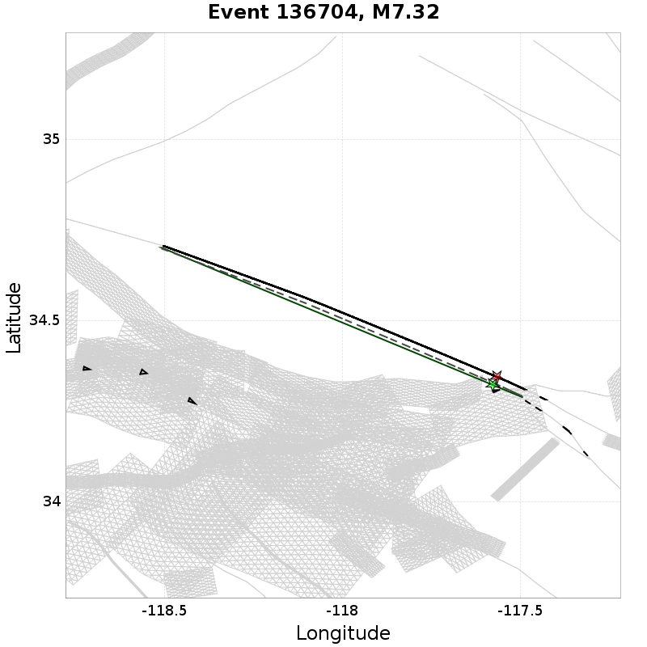
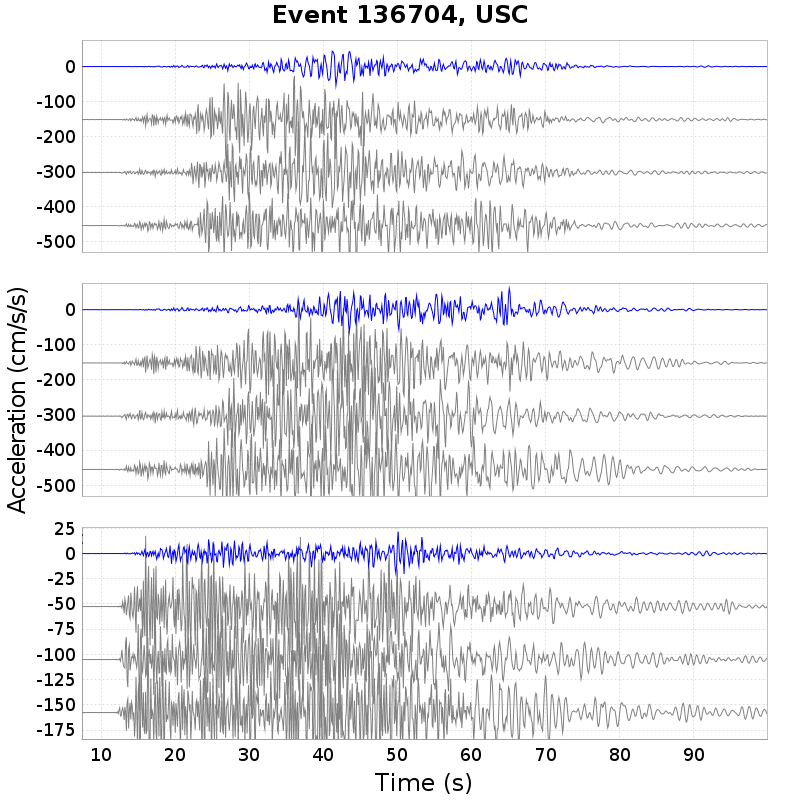
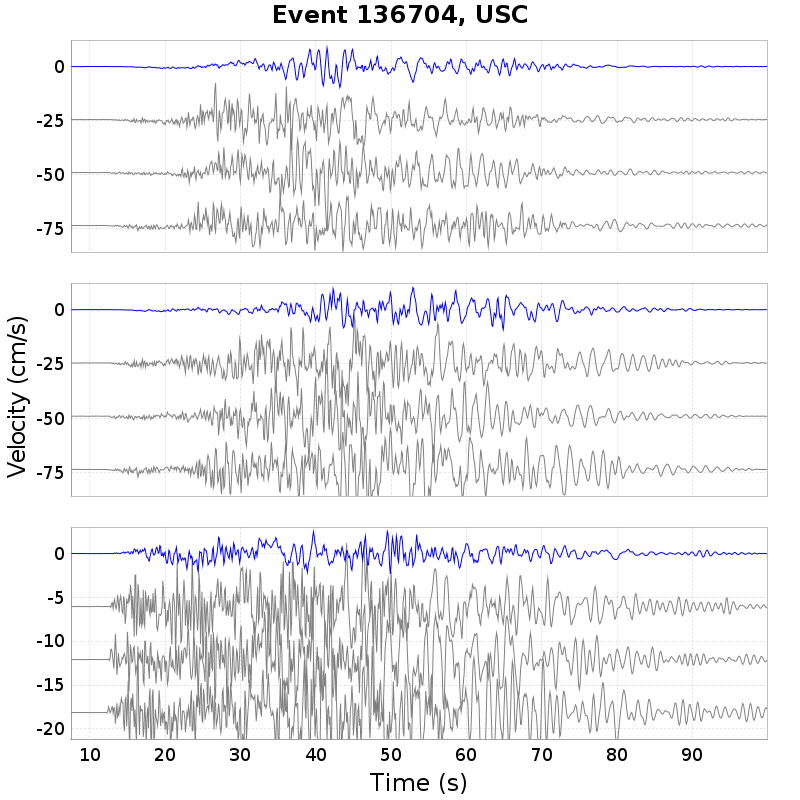
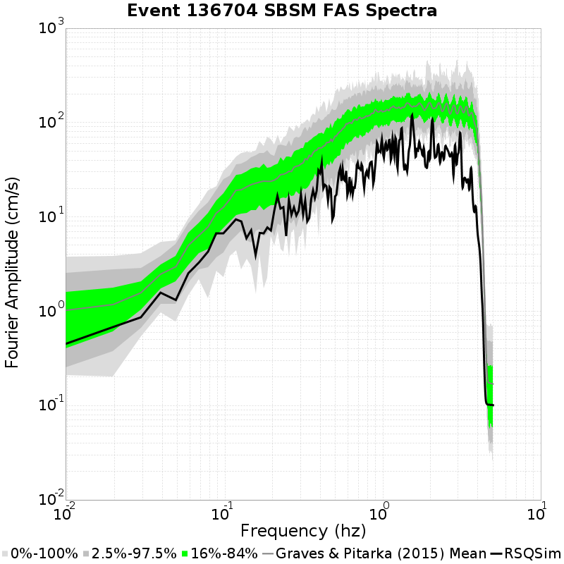
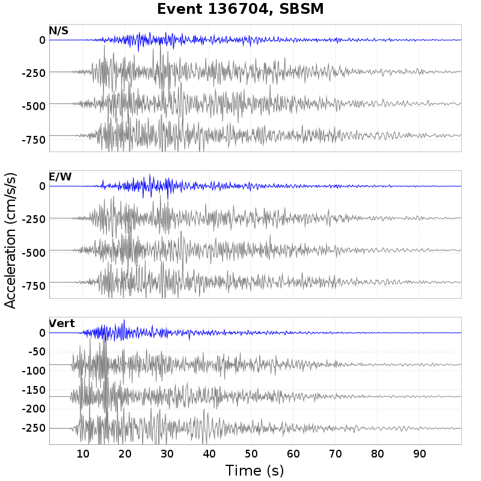
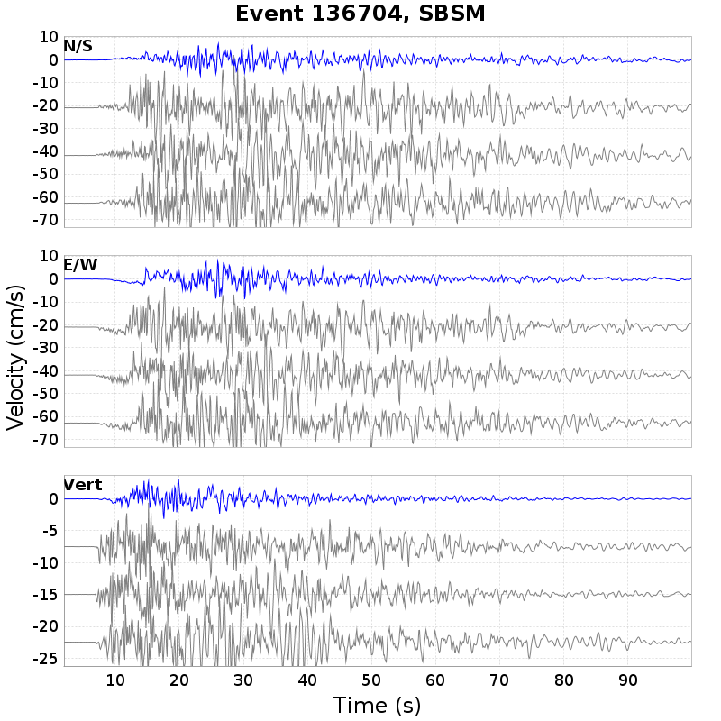

# Event 136704, M7.32

| Catalog | Bruce 2194 Long |
|-----|-----|
| Author | Bruce Shaw (extended by Jacqui Gilchrist), 2017/08/31 |
| Description | Catalog with decent large event scaling and distribution of sizes while not using any of the enhanced frictional weakening terms. |
| Fault/Def Model | Fault Model 3.1, Geologic |
| Slim Velocity | 1.0 m/s |
| Average Element Area | 1.34 km^2 |

## Table Of Contents
* [Rupture Plots](#rupture-plots)
  * [Slip/Time Plot](#sliptime-plot)
  * [Slip/Vel Animation](#slipvel-animation)
  * [Map Plot](#map-plot)
* [Spectra Plots](#spectra-plots)
  * [Site USC](#site-usc)
    * [USC Fourier Amplitude Spectra](#usc-fourier-amplitude-spectra)
    * [USC RotD50 Spectra](#usc-rotd50-spectra)
    * [USC Acceleration Seismograms](#usc-acceleration-seismograms)
    * [USC Velocity Seismograms](#usc-velocity-seismograms)
  * [Site SBSM](#site-sbsm)
    * [SBSM Fourier Amplitude Spectra](#sbsm-fourier-amplitude-spectra)
    * [SBSM RotD50 Spectra](#sbsm-rotd50-spectra)
    * [SBSM Acceleration Seismograms](#sbsm-acceleration-seismograms)
    * [SBSM Velocity Seismograms](#sbsm-velocity-seismograms)
## Rupture Plots
*[(top)](#table-of-contents)*

**Legend**
* Colored, Filled Triangles: RSQSim Elements
* Red Star: RSQSim Hypocenter
* Dark Green Solid Outline: BBP Equivalent Planar Surface
* Green Star: BBP Equivalent Hypocenter
* Dark Gray Dashed Outline: GMPE Surface

### Slip/Time Plot
*[(top)](#table-of-contents)*

### Slip/Vel Animation
*[(top)](#table-of-contents)*

### Map Plot
*[(top)](#table-of-contents)*

## Spectra Plots
*[(top)](#table-of-contents)*

### Site USC
*[(top)](#table-of-contents)*

*Location: 34.0192, -118.286*

| Distance | Actual RSQSim Surface | BBP Equivalent Planar Surface | GMPE Surface |
|-----|-----|-----|-----|
| Horizontal | 30.35 km | 59.14 km | 60.07 km |
| 3-D | 31.04 km | 59.14 km | 60.07 km |

*NOTE: RSQSim ruptures sometimes have a few co-rupturing elements on faults some distance from the main rupture. This may cause discrepancies in the table above, consult rupture map plot.*
#### USC Fourier Amplitude Spectra
*[(top)](#table-of-contents)*

#### USC RotD50 Spectra
*[(top)](#table-of-contents)*

#### USC Acceleration Seismograms
*[(top)](#table-of-contents)*

RSQSim ruptures in blue. Gray seismograms are Graves & Pitarka (2015) comparisons.

#### USC Velocity Seismograms
*[(top)](#table-of-contents)*

RSQSim ruptures in blue. Gray seismograms are Graves & Pitarka (2015) comparisons.

### Site SBSM
*[(top)](#table-of-contents)*

*Location: 34.064987, -117.29201*

| Distance | Actual RSQSim Surface | BBP Equivalent Planar Surface | GMPE Surface |
|-----|-----|-----|-----|
| Horizontal | 6.95 km | 31.03 km | 31.15 km |
| 3-D | 7.45 km | 31.03 km | 31.15 km |

*NOTE: RSQSim ruptures sometimes have a few co-rupturing elements on faults some distance from the main rupture. This may cause discrepancies in the table above, consult rupture map plot.*
#### SBSM Fourier Amplitude Spectra
*[(top)](#table-of-contents)*

#### SBSM RotD50 Spectra
*[(top)](#table-of-contents)*

#### SBSM Acceleration Seismograms
*[(top)](#table-of-contents)*

RSQSim ruptures in blue. Gray seismograms are Graves & Pitarka (2015) comparisons.

#### SBSM Velocity Seismograms
*[(top)](#table-of-contents)*

RSQSim ruptures in blue. Gray seismograms are Graves & Pitarka (2015) comparisons.

