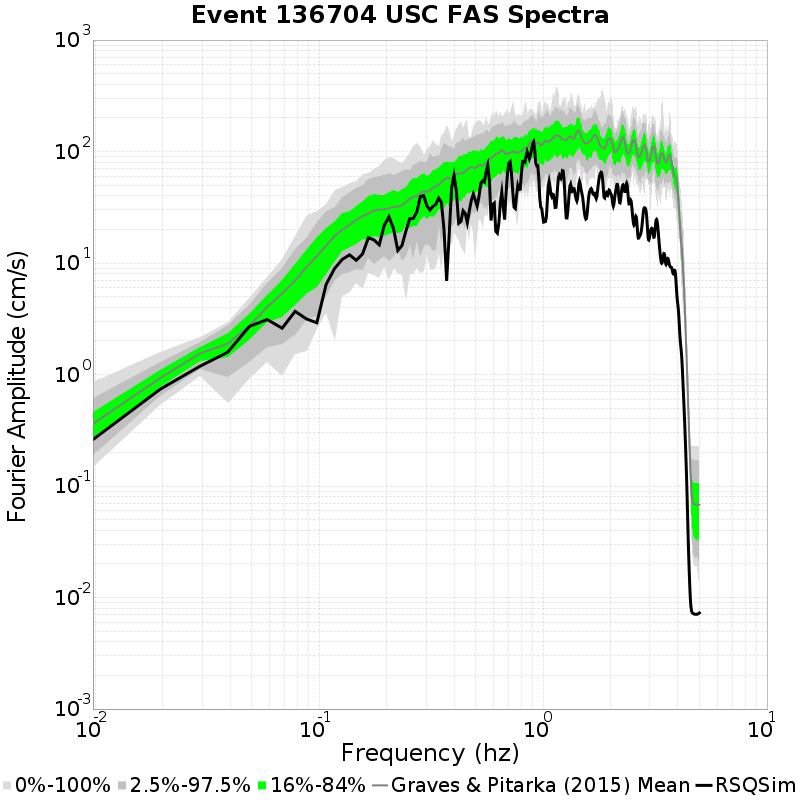
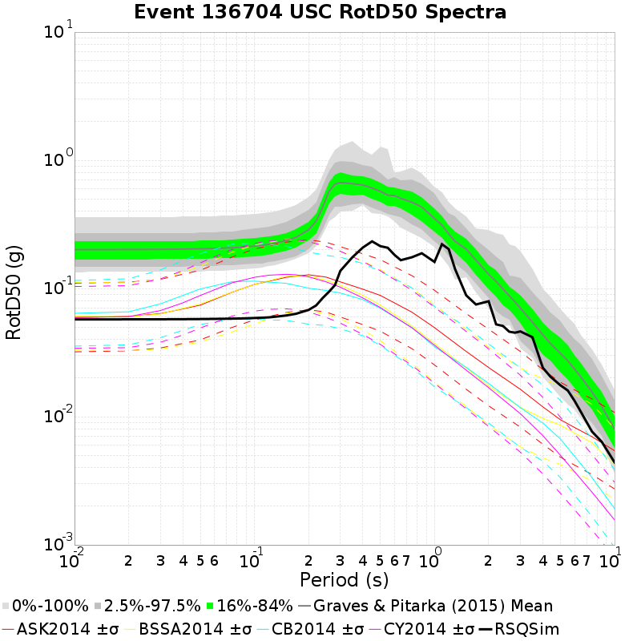
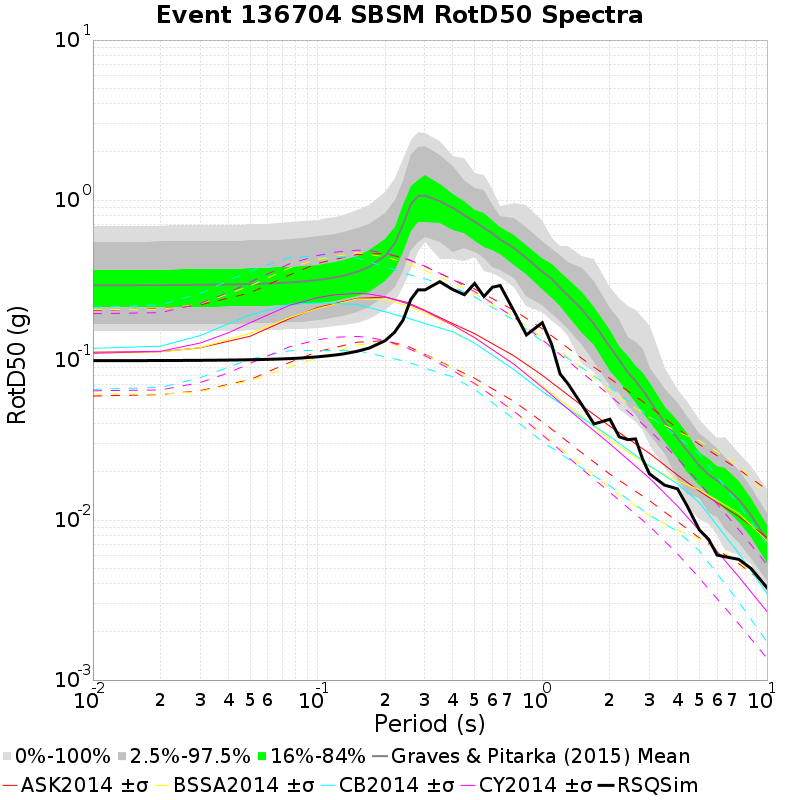

# Event 136704, M7.32

| Catalog | BRUCE 2194 Long |
|-----|-----|
| Author | Bruce Shaw (extended by Jacqui Gilchrist), 2017/08/31 |
| Description | Catalog with decent large event scaling and distribution of sizes while not using any of the enhanced frictional weakening terms. |
| Fault/Def Model | Fault Model 3.1, Geologic |
| Slim Velocity | 1.0 m/s |
| Average Element Area | 1.34 km^2 |

## Rupture Plots
**Legend**
* Colored, Filled Triangles: RSQSim Elements
* Red Star: RSQSim Hypocenter
* Dark Green Solid Outline: BBP Equivalent Planar Surface
* Green Star: BBP Equivalent Hypocenter
* Dark Gray Dashed Outline: GMPE Surface

### Slip/Time Plot

### Map Plot

## Spectra Plots
## Site USC
*34.0192, -118.286*

| Distance | Actual RSQSim Surface | BBP Equivalent Planar Surface | GMPE Surface |
|-----|-----|-----|-----|
| Horizontal | 30.35 km | 59.14 km | 60.07 km |
| 3-D | 31.04 km | 59.14 km | 60.07 km |
*NOTE: RSQSim ruptures sometimes have elements corupture on faults some distance away, which may cause discrepancies in the table above. Consult the rupture map plot.*

### Fourrier Amplitude Spectra

### RotD50 Spectra

## Site SBSM
*34.064987, -117.29201*

| Distance | Actual RSQSim Surface | BBP Equivalent Planar Surface | GMPE Surface |
|-----|-----|-----|-----|
| Horizontal | 6.95 km | 31.03 km | 31.15 km |
| 3-D | 7.45 km | 31.03 km | 31.15 km |
*NOTE: RSQSim ruptures sometimes have elements corupture on faults some distance away, which may cause discrepancies in the table above. Consult the rupture map plot.*

### Fourrier Amplitude Spectra

### RotD50 Spectra

