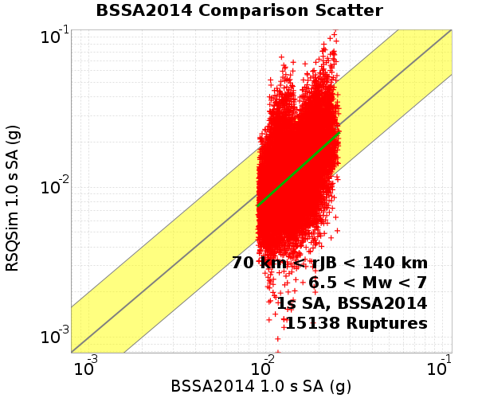
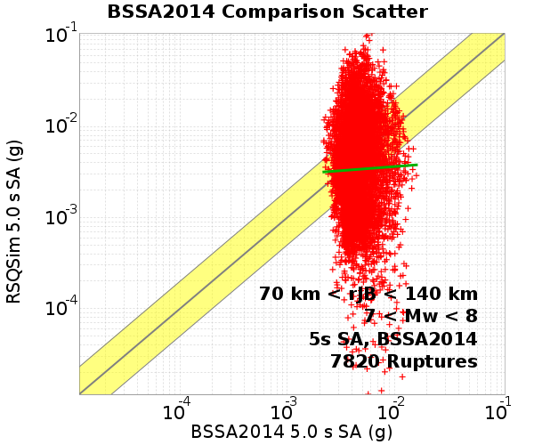
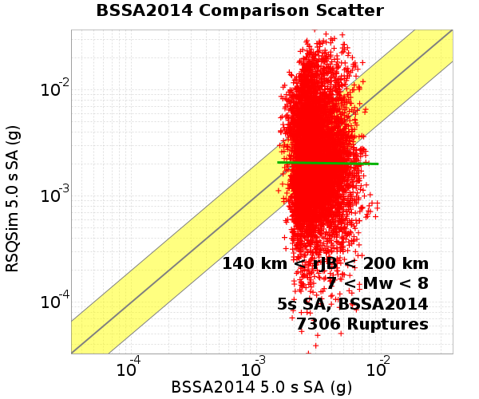
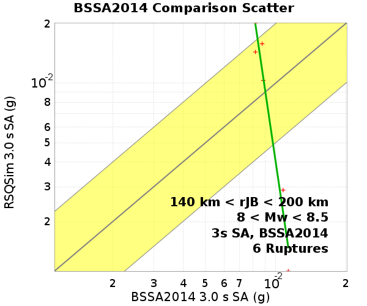
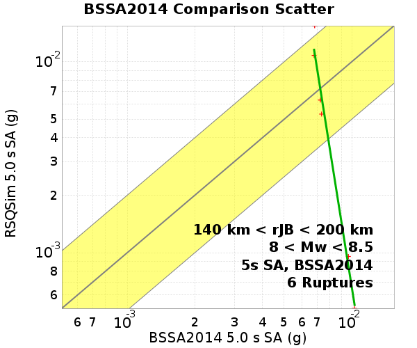

# Bruce 2194 Long BBP/BSSA2014 GMPE Comparisons

**GMPE: Boore, Stewart, Seyhan & Atkinson (2014)**

| Catalog | Bruce 2194 Long |
|-----|-----|
| Author | Bruce Shaw (extended by Jacqui Gilchrist), 2017/08/31 |
| Description | Catalog with decent large event scaling and distribution of sizes while not using any of the enhanced frictional weakening terms. |
| Fault/Def Model | Fault Model 3.1, Geologic |
| Slim Velocity | 1.0 m/s |
| Average Element Area | 1.34 km^2 |

## Table Of Contents
* [Site USC](#site-usc)
  * [USC, 6.5 < Mw < 7](#usc-65--mw--7)
    * [USC, 6.5 < Mw < 7, Scatter Plots](#usc-65--mw--7-scatter-plots)
    * [USC, 6.5 < Mw < 7, Standard Normal Plots](#usc-65--mw--7-standard-normal-plots)
  * [USC, 7 < Mw < 8](#usc-7--mw--8)
    * [USC, 7 < Mw < 8, Scatter Plots](#usc-7--mw--8-scatter-plots)
    * [USC, 7 < Mw < 8, Standard Normal Plots](#usc-7--mw--8-standard-normal-plots)
  * [USC, 8 < Mw < 8.5](#usc-8--mw--85)
    * [USC, 8 < Mw < 8.5, Scatter Plots](#usc-8--mw--85-scatter-plots)
    * [USC, 8 < Mw < 8.5, Standard Normal Plots](#usc-8--mw--85-standard-normal-plots)
* [Site SBSM](#site-sbsm)
  * [SBSM, 6.5 < Mw < 7](#sbsm-65--mw--7)
    * [SBSM, 6.5 < Mw < 7, Scatter Plots](#sbsm-65--mw--7-scatter-plots)
    * [SBSM, 6.5 < Mw < 7, Standard Normal Plots](#sbsm-65--mw--7-standard-normal-plots)
  * [SBSM, 7 < Mw < 8](#sbsm-7--mw--8)
    * [SBSM, 7 < Mw < 8, Scatter Plots](#sbsm-7--mw--8-scatter-plots)
    * [SBSM, 7 < Mw < 8, Standard Normal Plots](#sbsm-7--mw--8-standard-normal-plots)
  * [SBSM, 8 < Mw < 8.5](#sbsm-8--mw--85)
    * [SBSM, 8 < Mw < 8.5, Scatter Plots](#sbsm-8--mw--85-scatter-plots)
    * [SBSM, 8 < Mw < 8.5, Standard Normal Plots](#sbsm-8--mw--85-standard-normal-plots)
## Site USC
*[(top)](#table-of-contents)*

*Location: 34.0192, -118.286*
66200 ruptures within 200.0 km
### USC, 6.5 < Mw < 7
#### USC, 6.5 < Mw < 7, Scatter Plots
*[(top)](#table-of-contents)*

| SA Period | 0 km < rJB < 70 km | 70 km < rJB < 140 km | 140 km < rJB < 200 km |
|-----|-----|-----|-----|
| **1 s** |  |  |  |
| **2 s** |  |  |  |
| **3 s** |  |  |  |
| **5 s** |  |  |  |
| **10 s** |  |  |  |
#### USC, 6.5 < Mw < 7, Standard Normal Plots
*[(top)](#table-of-contents)*

| 0 km < rJB < 70 km | 70 km < rJB < 140 km | 140 km < rJB < 200 km |
|-----|-----|-----|
|  |  |  |
### USC, 7 < Mw < 8
#### USC, 7 < Mw < 8, Scatter Plots
*[(top)](#table-of-contents)*

| SA Period | 0 km < rJB < 70 km | 70 km < rJB < 140 km | 140 km < rJB < 200 km |
|-----|-----|-----|-----|
| **1 s** |  |  |  |
| **2 s** |  |  |  |
| **3 s** |  |  |  |
| **5 s** |  |  |  |
| **10 s** |  |  |  |
#### USC, 7 < Mw < 8, Standard Normal Plots
*[(top)](#table-of-contents)*

| 0 km < rJB < 70 km | 70 km < rJB < 140 km | 140 km < rJB < 200 km |
|-----|-----|-----|
|  |  |  |
### USC, 8 < Mw < 8.5
#### USC, 8 < Mw < 8.5, Scatter Plots
*[(top)](#table-of-contents)*

| SA Period | 0 km < rJB < 70 km | 70 km < rJB < 140 km |
|-----|-----|-----|
| **1 s** |  |  | N/A |
| **2 s** |  |  | N/A |
| **3 s** |  |  | N/A |
| **5 s** |  |  | N/A |
| **10 s** |  |  | N/A |
#### USC, 8 < Mw < 8.5, Standard Normal Plots
*[(top)](#table-of-contents)*

| 0 km < rJB < 70 km | 70 km < rJB < 140 km |
|-----|-----|
|  |  |
## Site SBSM
*[(top)](#table-of-contents)*

*Location: 34.064987, -117.29201*
67441 ruptures within 200.0 km
### SBSM, 6.5 < Mw < 7
#### SBSM, 6.5 < Mw < 7, Scatter Plots
*[(top)](#table-of-contents)*

| SA Period | 0 km < rJB < 70 km | 70 km < rJB < 140 km | 140 km < rJB < 200 km |
|-----|-----|-----|-----|
| **1 s** |  |  |  |
| **2 s** |  |  |  |
| **3 s** |  |  |  |
| **5 s** |  |  |  |
| **10 s** |  |  |  |
#### SBSM, 6.5 < Mw < 7, Standard Normal Plots
*[(top)](#table-of-contents)*

| 0 km < rJB < 70 km | 70 km < rJB < 140 km | 140 km < rJB < 200 km |
|-----|-----|-----|
|  |  |  |
### SBSM, 7 < Mw < 8
#### SBSM, 7 < Mw < 8, Scatter Plots
*[(top)](#table-of-contents)*

| SA Period | 0 km < rJB < 70 km | 70 km < rJB < 140 km | 140 km < rJB < 200 km |
|-----|-----|-----|-----|
| **1 s** |  |  |  |
| **2 s** |  |  |  |
| **3 s** |  |  |  |
| **5 s** |  |  |  |
| **10 s** |  |  |  |
#### SBSM, 7 < Mw < 8, Standard Normal Plots
*[(top)](#table-of-contents)*

| 0 km < rJB < 70 km | 70 km < rJB < 140 km | 140 km < rJB < 200 km |
|-----|-----|-----|
|  |  |  |
### SBSM, 8 < Mw < 8.5
#### SBSM, 8 < Mw < 8.5, Scatter Plots
*[(top)](#table-of-contents)*

| SA Period | 0 km < rJB < 70 km | 70 km < rJB < 140 km | 140 km < rJB < 200 km |
|-----|-----|-----|-----|
| **1 s** |  |  |  |
| **2 s** |  |  |  |
| **3 s** |  |  |  |
| **5 s** |  |  |  |
| **10 s** |  |  |  |
#### SBSM, 8 < Mw < 8.5, Standard Normal Plots
*[(top)](#table-of-contents)*

| 0 km < rJB < 70 km | 70 km < rJB < 140 km | 140 km < rJB < 200 km |
|-----|-----|-----|
|  |  |  |
