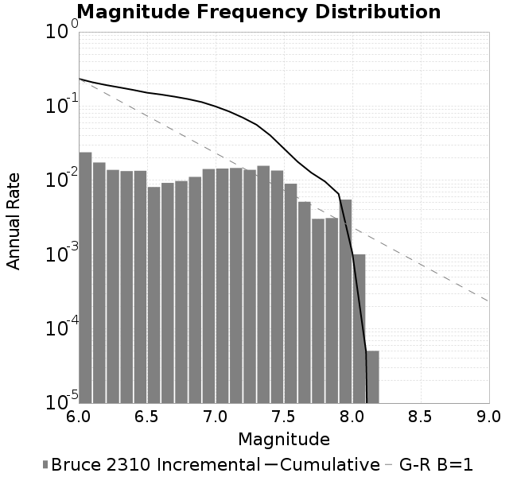
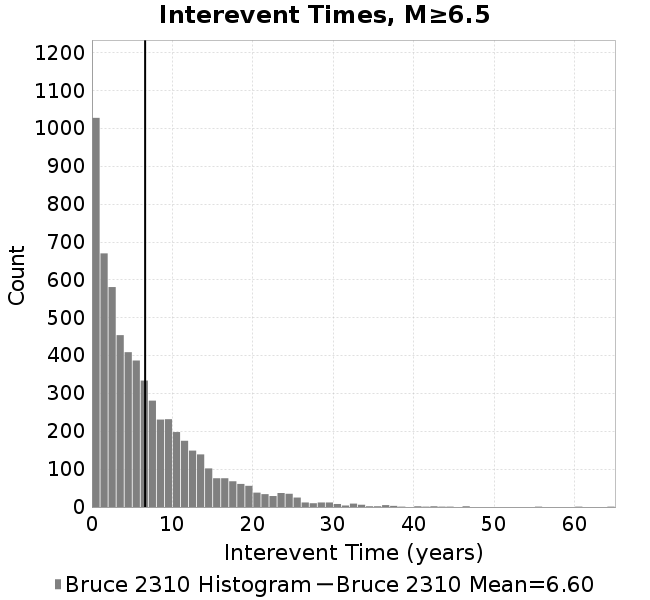

# Bruce 2310
## Metadata
| Catalog | Bruce 2310 |
|-----|-----|
| Author | Bruce Shaw, 2017/10/16 |
| Description | Backslip loading, more refined geometry, projection fix (but all faults surface breaking) |
| Fault/Def Model | Fault Model 3.1, Geologic |
| Slip Velocity | 1.0 m/s |
| Average Element Area | 0.42 km^2 |
| Length | 5,138,499 events in 44,742 years |

* [Metadata](#metadata)
* [Single Event Comparisons](#single-event-comparisons)
* [Full Catalog GMPE Comparisons](#full-catalog-gmpe-comparisons)
* [Magnitude-Frequency Plot](#magnitude-frequency-plot)
* [Magnitude-Area Plots](#magnitude-area-plots)
* [Interevent-Time Distributions](#interevent-time-distributions)

## Single Event Comparisons
* [Event 3802809, M7.48](event_3802809/)

## Full Catalog GMPE Comparisons
* [BSSA2014](gmpe_bbp_comparisons_BSSA2014/)
* [NGAWest_2014_NoIdr](gmpe_bbp_comparisons_NGAWest_2014_NoIdr/)
## Magnitude-Frequency Plot

## Magnitude-Area Plots
| Scatter | 2-D Hist |
|-----|-----|
|  |  |
| **Scatter** |  |
|-----|-----|
| **Distance/Velocity** |  |
## Interevent-Time Distributions
| **M≥6** | **M≥6.5** | **M≥7** | **M≥7.5** |
|-----|-----|-----|-----|
|  |  |  |  |
