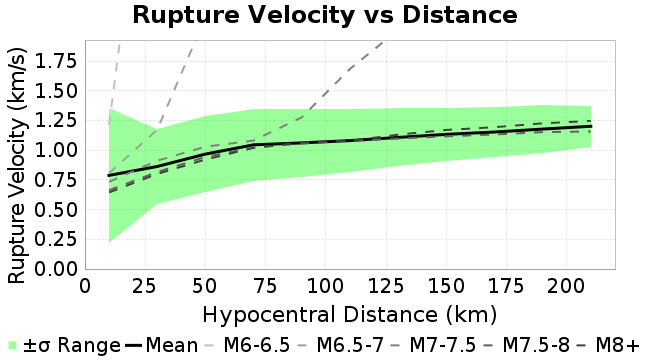
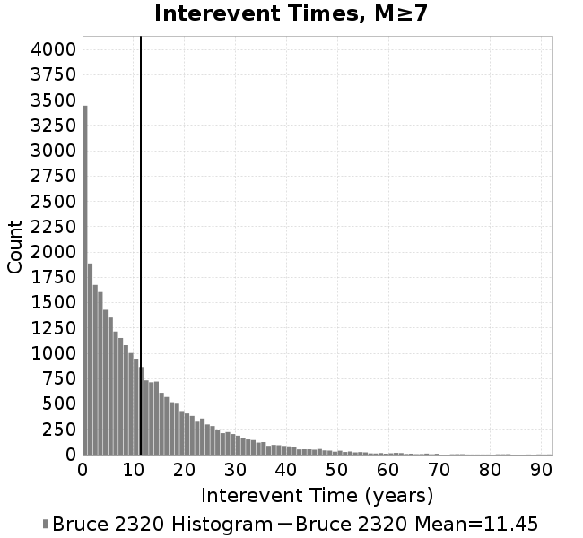

# Bruce 2320
## Metadata
| **Catalog** | Bruce 2320 |
|-----|-----|
| **Author** | Bruce Shaw, 2017/10/17 |
| **Description** | Backslip loading, less refined geometry, projection fix (but all
faults surface breaking), same as rundir2310 but less resolved |
| **Fault/Def Model** | Fault Model 3.1, Geologic |
| **Slip Velocity** | 1.0 m/s |
| **Average Element Area** | 1.35 km^2 |
| **Length** | 9,999,999 events in 320,117 years |
| **Frictional Params** | a=0.001, b=0.01, (b-a)=0.009, ddotEQ=1 |

* [Metadata](#metadata)
* [Single Event Comparisons](#single-event-comparisons)
* [Full Catalog GMPE Comparisons](#full-catalog-gmpe-comparisons)
* [Plots](#plots)
  * [Magnitude-Frequency Plot](#magnitude-frequency-plot)
  * [Magnitude-Area Plots](#magnitude-area-plots)
  * [Rupture Velocity Plots](#rupture-velocity-plots)
  * [Interevent-Time Distributions](#interevent-time-distributions)
* [Input File](#input-file)

## Single Event Comparisons
*[(top)](#bruce-2320)*

* [Event 6195527, M7.52](event_6195527/)

## Full Catalog GMPE Comparisons
*[(top)](#bruce-2320)*

* [BSSA2014](gmpe_bbp_comparisons_BSSA2014/)
* [NGAWest_2014_NoIdr](gmpe_bbp_comparisons_NGAWest_2014_NoIdr/)

## Plots
### Magnitude-Frequency Plot
*[(top)](#bruce-2320)*


### Magnitude-Area Plots
*[(top)](#bruce-2320)*

| Scatter | 2-D Hist |
|-----|-----|
|  |  |
### Rupture Velocity Plots
*[(top)](#bruce-2320)*

| **Scatter** |  |
|-----|-----|
| **Distance/Velocity** |  |
### Interevent-Time Distributions
*[(top)](#bruce-2320)*

| **M≥6** | **M≥6.5** | **M≥7** | **M≥7.5** |
|-----|-----|-----|-----|
|  |  |  |  |

## Input File
*[(top)](#bruce-2320)*

```
  A_1 = 0.001
  fA = .1
  B_1 = 0.01
  muSlipAmp_1 = .0
  muSlipInvDist_1 = 1.0
  cohesion = 0.0
  Dc_1 = 1.0000000000000000818e-05
  mu0_1 = 0.6
  ddotStar_1 = 9.9999999999999995475e-07
  ddotAB_1 = 9.9999999999999995475e-07
  alpha_1 = 0.0
  theta0_1 = 200000000
  tau0_1 = 55
  sigma0_1 = 100
  sigmaFracPin = .5
  lowSigmaAction = 1
  maxThetaPin = 1.0e13
  ddotEQ_1 = 1
  ddotEQFname = 
  stressOvershootFactor = 0.10000000000000000555
  lameLambda = 30000
  lameMu = 30000
  slowSlip_1 = 0
  nEq = 10000000
  KZeroFrac = 0
  KOneFrac =  0
  muPin = 1.0
  tStart = 0
  maxT = 1.0000000000000000159e+100
  maxTransitions = 1.0000000000000000159e+8
  faultFname = zfault_Deepen.in
  outFnameInfix = 
  writeTau = 0
  writeSigma = 0
  writeSlip = 0
  writeSlipSpeed = 0
  writeState = 0
  writeTheta = 0
  writePED = 1
  writeTransitions = 1
  minDtWrite = 0
  minDtWriteCoseismic = 0
  minDtWriteInterseismic = 0
  minMagWrite = 0
  writeStiffness = 0
  stressRateSpecification = 1
  dMu3 = 0.01000000000000000
  initTauFname = 
  initSigmaFname = 
  initThetaFname = 
  initSlipSpeedFname = 
  AFname = 
  BFname =  
  DcFname = 
  mu0Fname = 
  ddotStarFname = 
  ddotABFname = 
  alphaFname = 
  KTauFname = 
  KSigmaFname = 
  tFailFname = 
  tauFailFname = 
  tauDotFname = 
  sigmaDotFname = 
  KZeroFname = zfault_Deepen_KZero.in
  pinnedFname =  
  neighborFname = 
  stressRateFname =  
  slowSlipFname = 
  writePatchFname = 
  DEBUG = 0
  ZBrentUpperBracket = 0
```
