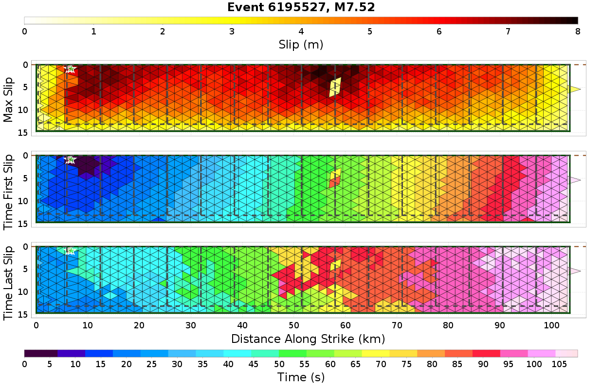
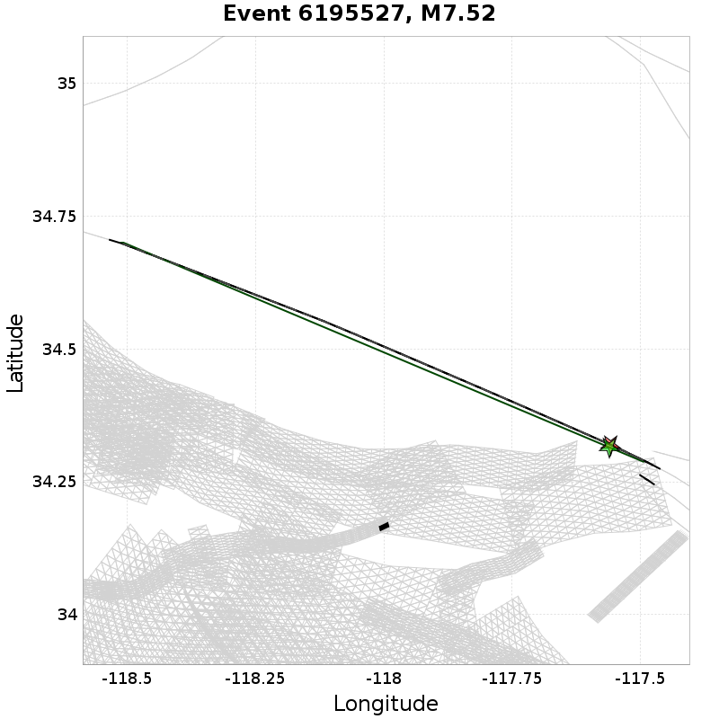
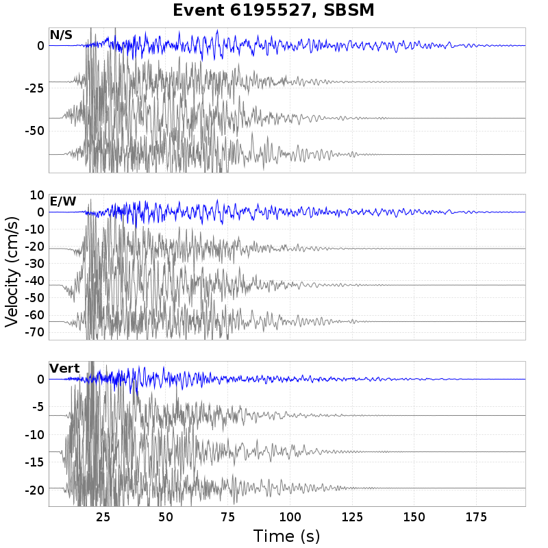
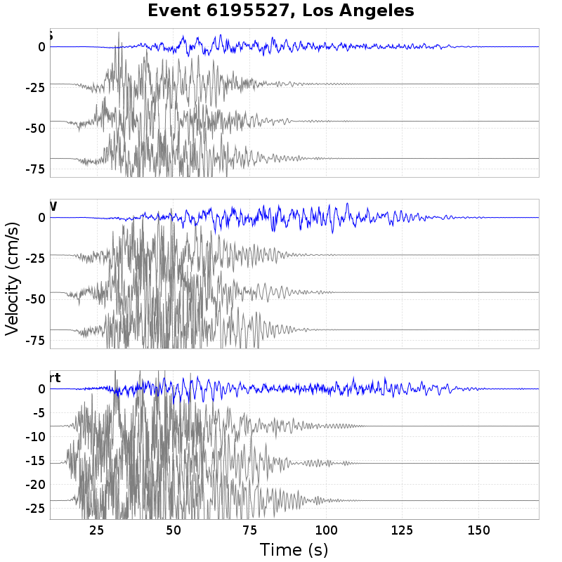
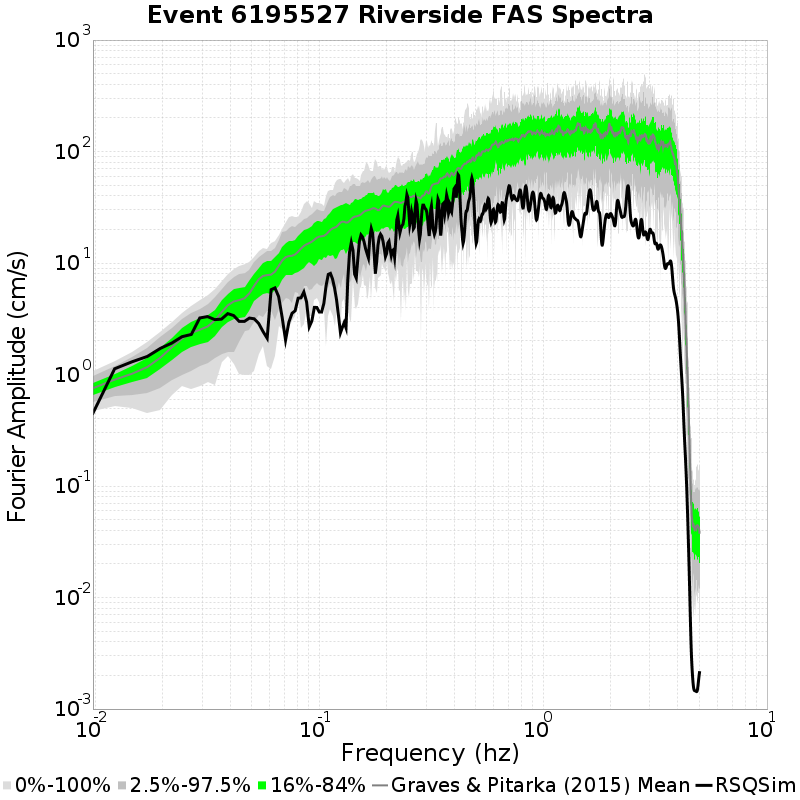
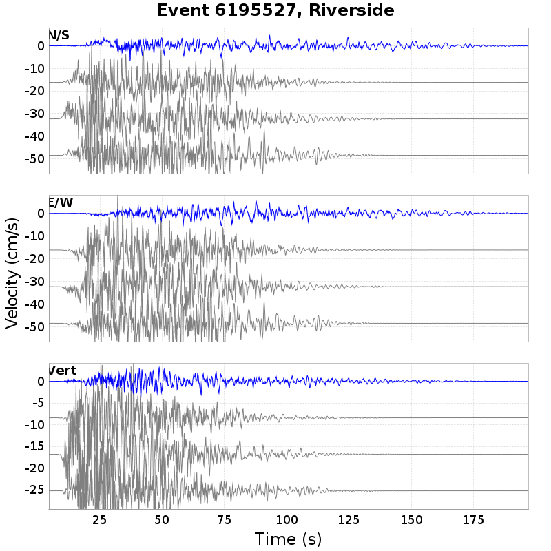
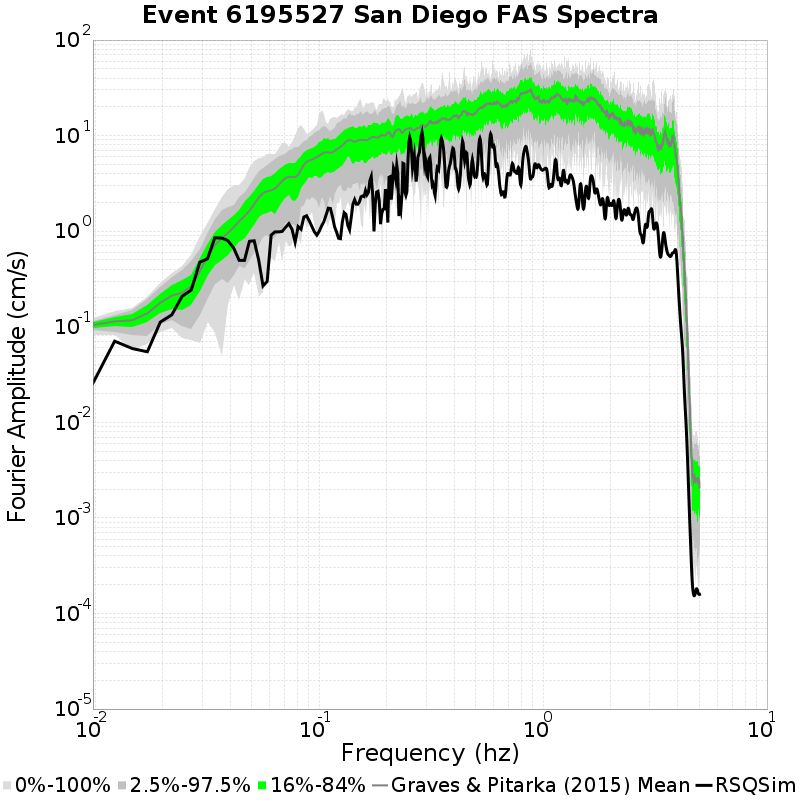
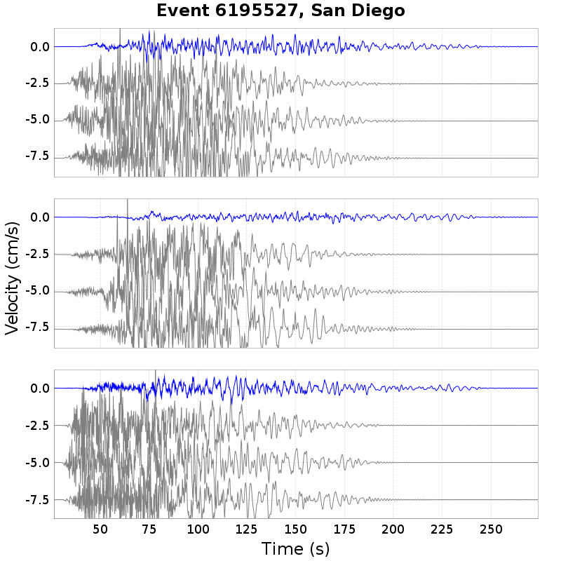
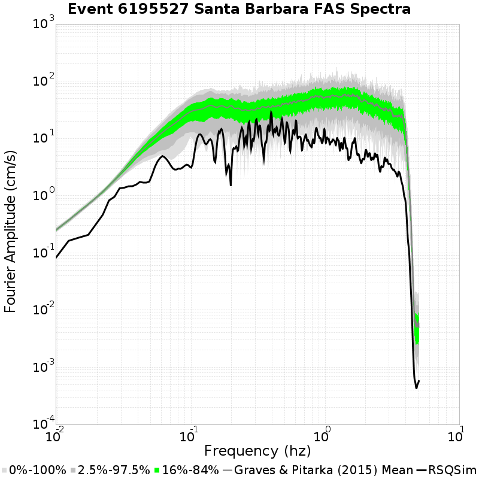
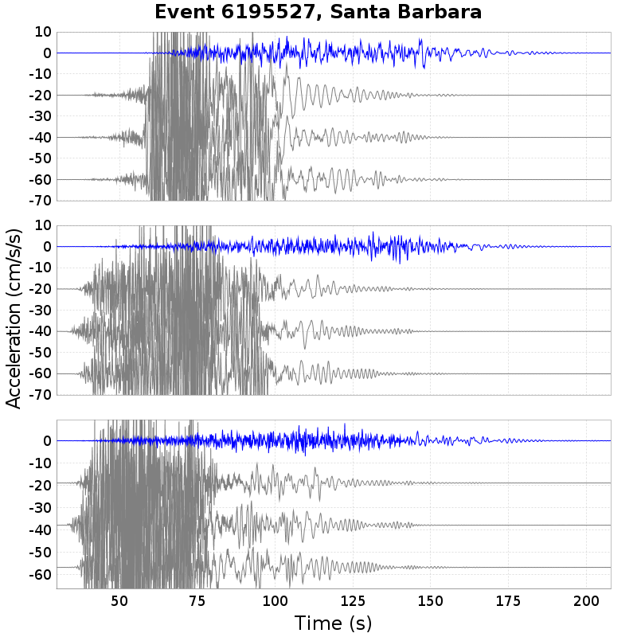

# Event 6195527, M7.52

[Catalog Details](../#bruce-2320)

**Graves & Pitarka (2015) Simulations: 200**

## Table Of Contents
* [Rupture Plots](#rupture-plots)
  * [Slip/Time Plot](#sliptime-plot)
  * [Slip/Vel Animation](#slipvel-animation)
  * [Map Plot](#map-plot)
* [Spectra Plots](#spectra-plots)
  * [Site USC](#site-usc)
    * [USC Fourier Amplitude Spectra](#usc-fourier-amplitude-spectra)
    * [USC RotD50 Spectra](#usc-rotd50-spectra)
    * [USC Acceleration Seismograms](#usc-acceleration-seismograms)
    * [USC Velocity Seismograms](#usc-velocity-seismograms)
  * [Site SBSM](#site-sbsm)
    * [SBSM Fourier Amplitude Spectra](#sbsm-fourier-amplitude-spectra)
    * [SBSM RotD50 Spectra](#sbsm-rotd50-spectra)
    * [SBSM Acceleration Seismograms](#sbsm-acceleration-seismograms)
    * [SBSM Velocity Seismograms](#sbsm-velocity-seismograms)
  * [Site LOS_ANGELE](#site-losangele)
    * [LOS_ANGELE Fourier Amplitude Spectra](#losangele-fourier-amplitude-spectra)
    * [LOS_ANGELE RotD50 Spectra](#losangele-rotd50-spectra)
    * [LOS_ANGELE Acceleration Seismograms](#losangele-acceleration-seismograms)
    * [LOS_ANGELE Velocity Seismograms](#losangele-velocity-seismograms)
  * [Site RIVERSIDE](#site-riverside)
    * [RIVERSIDE Fourier Amplitude Spectra](#riverside-fourier-amplitude-spectra)
    * [RIVERSIDE RotD50 Spectra](#riverside-rotd50-spectra)
    * [RIVERSIDE Acceleration Seismograms](#riverside-acceleration-seismograms)
    * [RIVERSIDE Velocity Seismograms](#riverside-velocity-seismograms)
  * [Site SAN_DIEGO](#site-sandiego)
    * [SAN_DIEGO Fourier Amplitude Spectra](#sandiego-fourier-amplitude-spectra)
    * [SAN_DIEGO RotD50 Spectra](#sandiego-rotd50-spectra)
    * [SAN_DIEGO Acceleration Seismograms](#sandiego-acceleration-seismograms)
    * [SAN_DIEGO Velocity Seismograms](#sandiego-velocity-seismograms)
  * [Site SANTA_BARB](#site-santabarb)
    * [SANTA_BARB Fourier Amplitude Spectra](#santabarb-fourier-amplitude-spectra)
    * [SANTA_BARB RotD50 Spectra](#santabarb-rotd50-spectra)
    * [SANTA_BARB Acceleration Seismograms](#santabarb-acceleration-seismograms)
    * [SANTA_BARB Velocity Seismograms](#santabarb-velocity-seismograms)
## Rupture Plots
*[(top)](#table-of-contents)*

**Legend**
* Colored, Filled Triangles: RSQSim Elements
* Red Star: RSQSim Hypocenter
* Dark Green Solid Outline: BBP Equivalent Planar Surface
* Green Star: BBP Equivalent Hypocenter
* Dark Gray Dashed Outline: GMPE Surface

### Slip/Time Plot
*[(top)](#table-of-contents)*

### Slip/Vel Animation
*[(top)](#table-of-contents)*

[Click here to view Slip/Velocity Animation](resources/rupture_plot_6195527.gif)
### Map Plot
*[(top)](#table-of-contents)*

## Spectra Plots
*[(top)](#table-of-contents)*

### Site USC
*[(top)](#table-of-contents)*

*Location: 34.0192, -118.286*

| Distance | Actual RSQSim Surface | BBP Equivalent Planar Surface | GMPE Surface |
|-----|-----|-----|-----|
| Horizontal | 30.12 km | 59.14 km | 60.07 km |
| 3-D | 30.24 km | 59.14 km | 60.07 km |

*NOTE: RSQSim ruptures sometimes have a few co-rupturing elements on faults some distance from the main rupture. This may cause discrepancies in the table above, consult rupture map plot.*
#### USC Fourier Amplitude Spectra
*[(top)](#table-of-contents)*

#### USC RotD50 Spectra
*[(top)](#table-of-contents)*

#### USC Acceleration Seismograms
*[(top)](#table-of-contents)*

RSQSim ruptures in blue. Gray seismograms are Graves & Pitarka (2015) comparisons.

#### USC Velocity Seismograms
*[(top)](#table-of-contents)*

RSQSim ruptures in blue. Gray seismograms are Graves & Pitarka (2015) comparisons.

### Site SBSM
*[(top)](#table-of-contents)*

*Location: 34.064987, -117.29201*

| Distance | Actual RSQSim Surface | BBP Equivalent Planar Surface | GMPE Surface |
|-----|-----|-----|-----|
| Horizontal | 26.14 km | 31.03 km | 31.15 km |
| 3-D | 29.62 km | 31.03 km | 31.15 km |

*NOTE: RSQSim ruptures sometimes have a few co-rupturing elements on faults some distance from the main rupture. This may cause discrepancies in the table above, consult rupture map plot.*
#### SBSM Fourier Amplitude Spectra
*[(top)](#table-of-contents)*

#### SBSM RotD50 Spectra
*[(top)](#table-of-contents)*

#### SBSM Acceleration Seismograms
*[(top)](#table-of-contents)*

RSQSim ruptures in blue. Gray seismograms are Graves & Pitarka (2015) comparisons.

#### SBSM Velocity Seismograms
*[(top)](#table-of-contents)*

RSQSim ruptures in blue. Gray seismograms are Graves & Pitarka (2015) comparisons.

### Site LOS_ANGELE
*[(top)](#table-of-contents)*

*Location: 34.05, -118.25*

| Distance | Actual RSQSim Surface | BBP Equivalent Planar Surface | GMPE Surface |
|-----|-----|-----|-----|
| Horizontal | 25.53 km | 54.60 km | 55.53 km |
| 3-D | 25.67 km | 54.60 km | 55.53 km |

*NOTE: RSQSim ruptures sometimes have a few co-rupturing elements on faults some distance from the main rupture. This may cause discrepancies in the table above, consult rupture map plot.*
#### LOS_ANGELE Fourier Amplitude Spectra
*[(top)](#table-of-contents)*

#### LOS_ANGELE RotD50 Spectra
*[(top)](#table-of-contents)*

#### LOS_ANGELE Acceleration Seismograms
*[(top)](#table-of-contents)*

RSQSim ruptures in blue. Gray seismograms are Graves & Pitarka (2015) comparisons.

#### LOS_ANGELE Velocity Seismograms
*[(top)](#table-of-contents)*

RSQSim ruptures in blue. Gray seismograms are Graves & Pitarka (2015) comparisons.

### Site RIVERSIDE
*[(top)](#table-of-contents)*

*Location: 33.95, -117.4*

| Distance | Actual RSQSim Surface | BBP Equivalent Planar Surface | GMPE Surface |
|-----|-----|-----|-----|
| Horizontal | 33.58 km | 38.61 km | 38.81 km |
| 3-D | 36.54 km | 38.61 km | 38.81 km |

*NOTE: RSQSim ruptures sometimes have a few co-rupturing elements on faults some distance from the main rupture. This may cause discrepancies in the table above, consult rupture map plot.*
#### RIVERSIDE Fourier Amplitude Spectra
*[(top)](#table-of-contents)*

#### RIVERSIDE RotD50 Spectra
*[(top)](#table-of-contents)*

#### RIVERSIDE Acceleration Seismograms
*[(top)](#table-of-contents)*

RSQSim ruptures in blue. Gray seismograms are Graves & Pitarka (2015) comparisons.

#### RIVERSIDE Velocity Seismograms
*[(top)](#table-of-contents)*

RSQSim ruptures in blue. Gray seismograms are Graves & Pitarka (2015) comparisons.

### Site SAN_DIEGO
*[(top)](#table-of-contents)*

*Location: 32.7, -117.15*

| Distance | Actual RSQSim Surface | BBP Equivalent Planar Surface | GMPE Surface |
|-----|-----|-----|-----|
| Horizontal | 174.49 km | 179.48 km | 179.68 km |
| 3-D | 175.08 km | 179.48 km | 179.68 km |

*NOTE: RSQSim ruptures sometimes have a few co-rupturing elements on faults some distance from the main rupture. This may cause discrepancies in the table above, consult rupture map plot.*
#### SAN_DIEGO Fourier Amplitude Spectra
*[(top)](#table-of-contents)*

#### SAN_DIEGO RotD50 Spectra
*[(top)](#table-of-contents)*

#### SAN_DIEGO Acceleration Seismograms
*[(top)](#table-of-contents)*

RSQSim ruptures in blue. Gray seismograms are Graves & Pitarka (2015) comparisons.

#### SAN_DIEGO Velocity Seismograms
*[(top)](#table-of-contents)*

RSQSim ruptures in blue. Gray seismograms are Graves & Pitarka (2015) comparisons.

### Site SANTA_BARB
*[(top)](#table-of-contents)*

*Location: 34.45, -119.7*

| Distance | Actual RSQSim Surface | BBP Equivalent Planar Surface | GMPE Surface |
|-----|-----|-----|-----|
| Horizontal | 110.32 km | 112.66 km | 112.50 km |
| 3-D | 110.46 km | 112.66 km | 112.50 km |

*NOTE: RSQSim ruptures sometimes have a few co-rupturing elements on faults some distance from the main rupture. This may cause discrepancies in the table above, consult rupture map plot.*
#### SANTA_BARB Fourier Amplitude Spectra
*[(top)](#table-of-contents)*

#### SANTA_BARB RotD50 Spectra
*[(top)](#table-of-contents)*

#### SANTA_BARB Acceleration Seismograms
*[(top)](#table-of-contents)*

RSQSim ruptures in blue. Gray seismograms are Graves & Pitarka (2015) comparisons.

#### SANTA_BARB Velocity Seismograms
*[(top)](#table-of-contents)*

RSQSim ruptures in blue. Gray seismograms are Graves & Pitarka (2015) comparisons.

