# Event 131670, M7.67

[Catalog Details](../#bruce-2336)

**Graves & Pitarka (2015) Simulations: 200**

## Table Of Contents
* [Rupture Plots](#rupture-plots)
  * [Slip/Time Plot](#sliptime-plot)
  * [Slip/Vel Animation](#slipvel-animation)
  * [Map Plot](#map-plot)
  * [Rupture Velocity Plot](#rupture-velocity-plot)
* [Spectra Plots](#spectra-plots)
  * [Site USC](#site-usc)
    * [USC Fourier Amplitude Spectra](#usc-fourier-amplitude-spectra)
    * [USC RotD50 Spectra](#usc-rotd50-spectra)
    * [USC Acceleration Seismograms](#usc-acceleration-seismograms)
    * [USC Velocity Seismograms](#usc-velocity-seismograms)
  * [Site SBSM](#site-sbsm)
    * [SBSM Fourier Amplitude Spectra](#sbsm-fourier-amplitude-spectra)
    * [SBSM RotD50 Spectra](#sbsm-rotd50-spectra)
    * [SBSM Acceleration Seismograms](#sbsm-acceleration-seismograms)
    * [SBSM Velocity Seismograms](#sbsm-velocity-seismograms)
  * [Site Los Angeles](#site-los-angeles)
    * [Los Angeles Fourier Amplitude Spectra](#los-angeles-fourier-amplitude-spectra)
    * [Los Angeles RotD50 Spectra](#los-angeles-rotd50-spectra)
    * [Los Angeles Acceleration Seismograms](#los-angeles-acceleration-seismograms)
    * [Los Angeles Velocity Seismograms](#los-angeles-velocity-seismograms)
  * [Site Riverside](#site-riverside)
    * [Riverside Fourier Amplitude Spectra](#riverside-fourier-amplitude-spectra)
    * [Riverside RotD50 Spectra](#riverside-rotd50-spectra)
    * [Riverside Acceleration Seismograms](#riverside-acceleration-seismograms)
    * [Riverside Velocity Seismograms](#riverside-velocity-seismograms)
  * [Site San Diego](#site-san-diego)
    * [San Diego Fourier Amplitude Spectra](#san-diego-fourier-amplitude-spectra)
    * [San Diego RotD50 Spectra](#san-diego-rotd50-spectra)
    * [San Diego Acceleration Seismograms](#san-diego-acceleration-seismograms)
    * [San Diego Velocity Seismograms](#san-diego-velocity-seismograms)
  * [Site Santa Barbara](#site-santa-barbara)
    * [Santa Barbara Fourier Amplitude Spectra](#santa-barbara-fourier-amplitude-spectra)
    * [Santa Barbara RotD50 Spectra](#santa-barbara-rotd50-spectra)
    * [Santa Barbara Acceleration Seismograms](#santa-barbara-acceleration-seismograms)
    * [Santa Barbara Velocity Seismograms](#santa-barbara-velocity-seismograms)
## Rupture Plots
*[(top)](#table-of-contents)*

**Legend**
* Colored, Filled Triangles: RSQSim Elements
* Red Star: RSQSim Hypocenter
* Dark Green Solid Outline: BBP Equivalent Planar Surface
* Green Star: BBP Equivalent Hypocenter
* Dark Gray Dashed Outline: GMPE Surface

### Slip/Time Plot
*[(top)](#table-of-contents)*

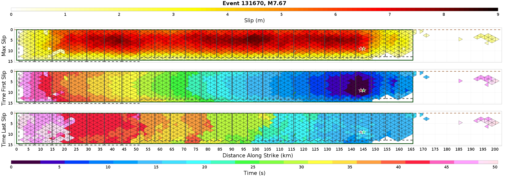
### Slip/Vel Animation
*[(top)](#table-of-contents)*

[Click here to view Slip/Velocity Animation](resources/rupture_plot_131670.gif)
### Map Plot
*[(top)](#table-of-contents)*

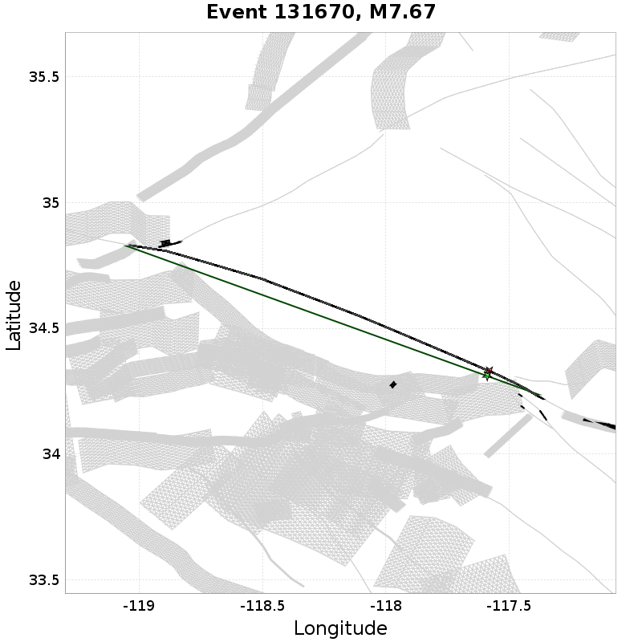
### Rupture Velocity Plot
*[(top)](#table-of-contents)*

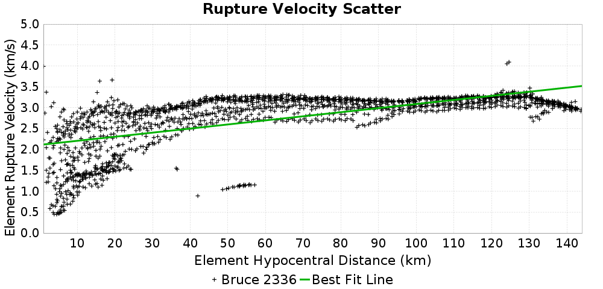

## Spectra Plots
*[(top)](#table-of-contents)*

### Site USC
*[(top)](#table-of-contents)*

*Location: 34.0192, -118.286*

| Distance | Actual RSQSim Surface | BBP Equivalent Planar Surface | GMPE Surface |
|-----|-----|-----|-----|
| Horizontal | 39.65 km | 55.33 km | 60.07 km |
| 3-D | 40.74 km | 55.33 km | 60.07 km |

*NOTE: RSQSim ruptures sometimes have a few co-rupturing elements on faults some distance from the main rupture. This may cause discrepancies in the table above, consult rupture map plot.*
#### USC Fourier Amplitude Spectra
*[(top)](#table-of-contents)*

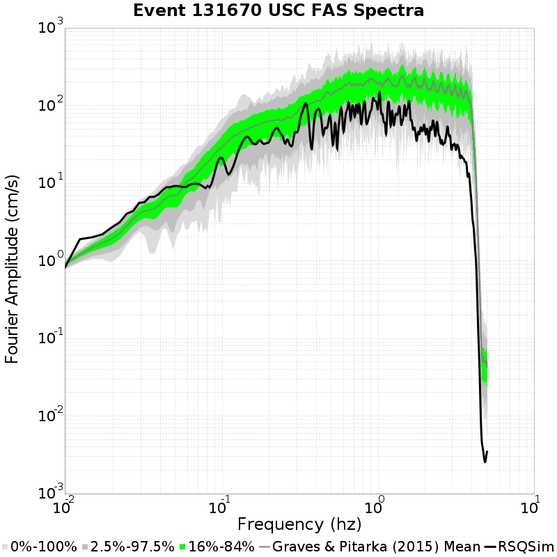
#### USC RotD50 Spectra
*[(top)](#table-of-contents)*

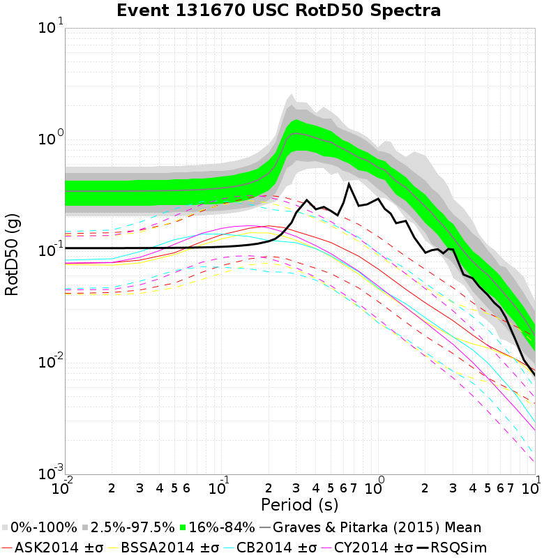
#### USC Acceleration Seismograms
*[(top)](#table-of-contents)*

RSQSim ruptures in blue. Gray seismograms are Graves & Pitarka (2015) comparisons.

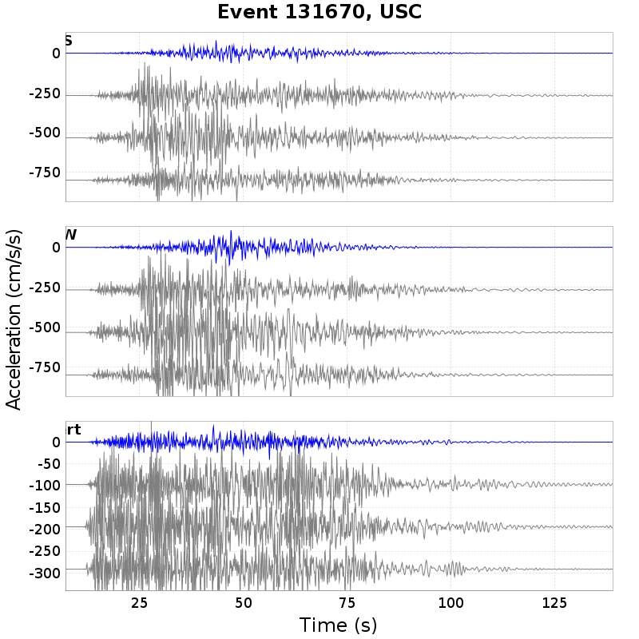
#### USC Velocity Seismograms
*[(top)](#table-of-contents)*

RSQSim ruptures in blue. Gray seismograms are Graves & Pitarka (2015) comparisons.

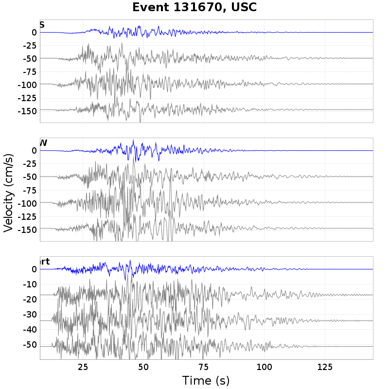
### Site SBSM
*[(top)](#table-of-contents)*

*Location: 34.064987, -117.29201*

| Distance | Actual RSQSim Surface | BBP Equivalent Planar Surface | GMPE Surface |
|-----|-----|-----|-----|
| Horizontal | 9.24 km | 20.94 km | 20.49 km |
| 3-D | 9.63 km | 20.94 km | 20.49 km |

*NOTE: RSQSim ruptures sometimes have a few co-rupturing elements on faults some distance from the main rupture. This may cause discrepancies in the table above, consult rupture map plot.*
#### SBSM Fourier Amplitude Spectra
*[(top)](#table-of-contents)*

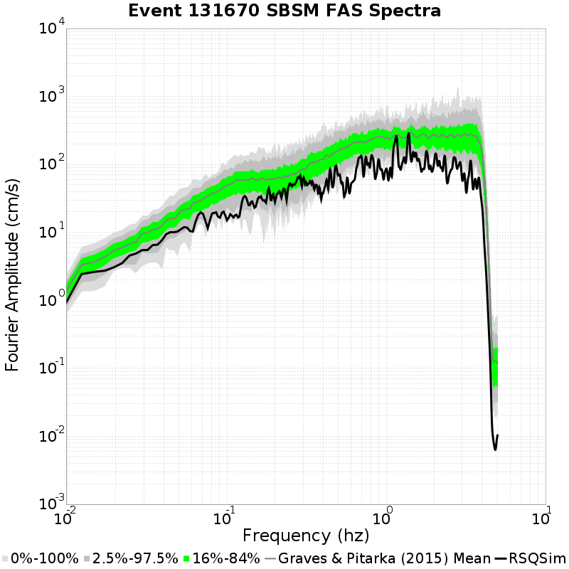
#### SBSM RotD50 Spectra
*[(top)](#table-of-contents)*

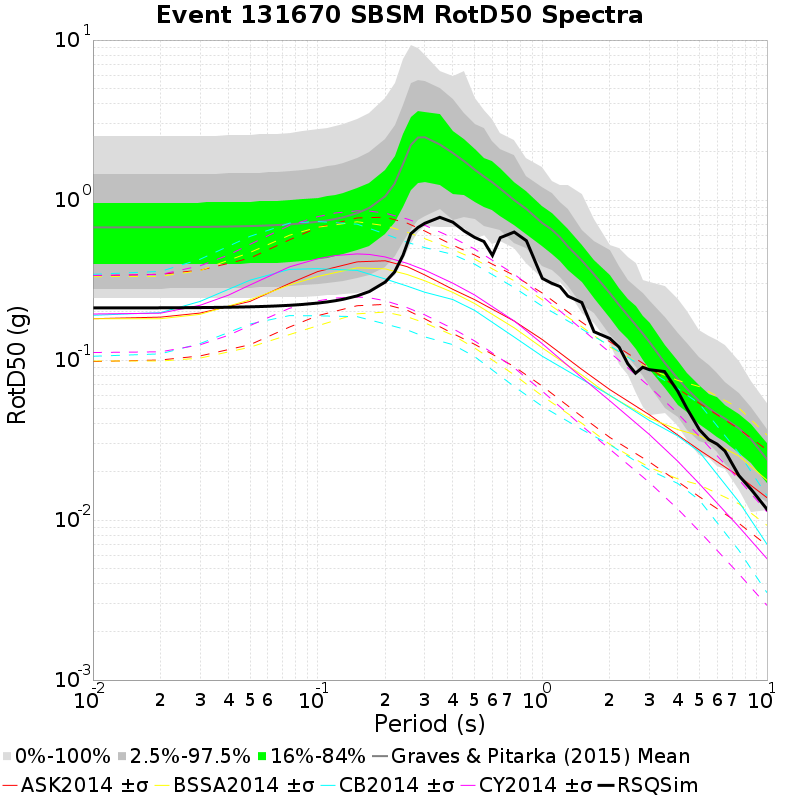
#### SBSM Acceleration Seismograms
*[(top)](#table-of-contents)*

RSQSim ruptures in blue. Gray seismograms are Graves & Pitarka (2015) comparisons.

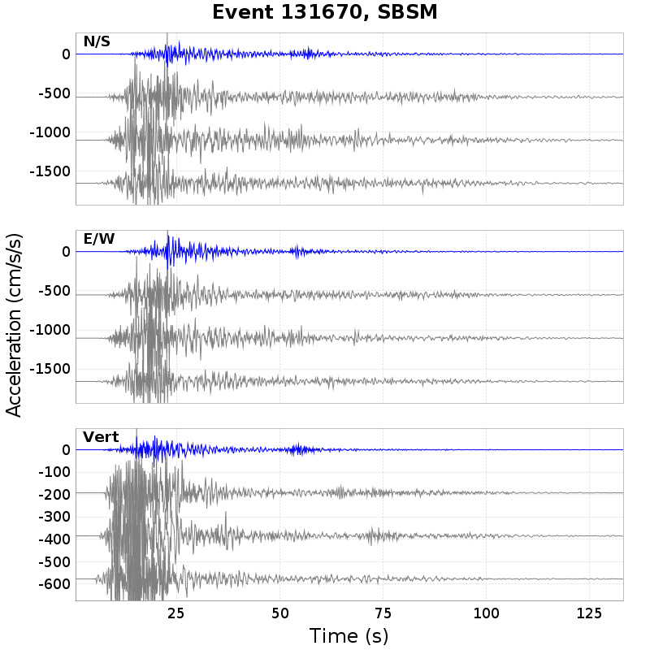
#### SBSM Velocity Seismograms
*[(top)](#table-of-contents)*

RSQSim ruptures in blue. Gray seismograms are Graves & Pitarka (2015) comparisons.

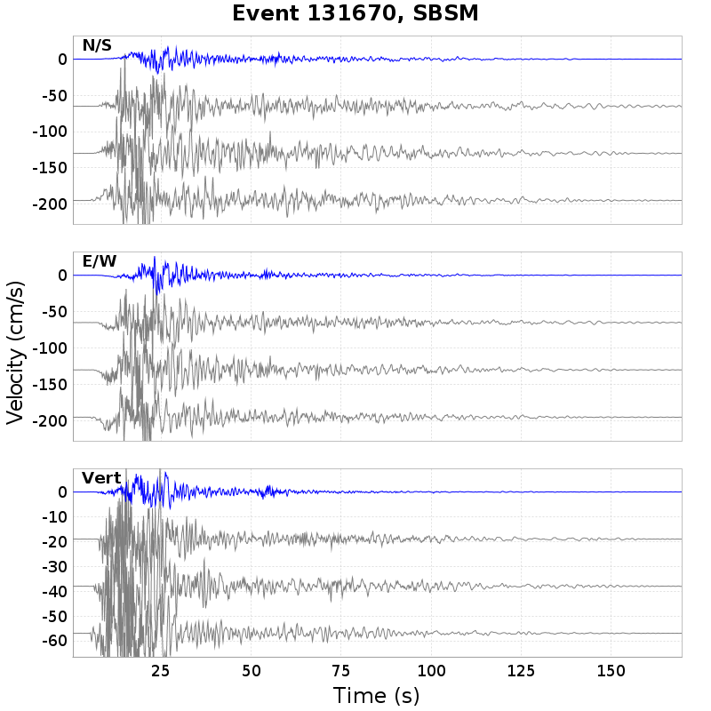
### Site Los Angeles
*[(top)](#table-of-contents)*

*Location: 34.05, -118.25*

| Distance | Actual RSQSim Surface | BBP Equivalent Planar Surface | GMPE Surface |
|-----|-----|-----|-----|
| Horizontal | 34.89 km | 50.88 km | 55.53 km |
| 3-D | 36.12 km | 50.88 km | 55.53 km |

*NOTE: RSQSim ruptures sometimes have a few co-rupturing elements on faults some distance from the main rupture. This may cause discrepancies in the table above, consult rupture map plot.*
#### Los Angeles Fourier Amplitude Spectra
*[(top)](#table-of-contents)*

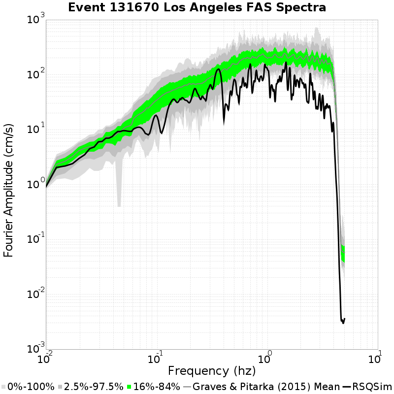
#### Los Angeles RotD50 Spectra
*[(top)](#table-of-contents)*

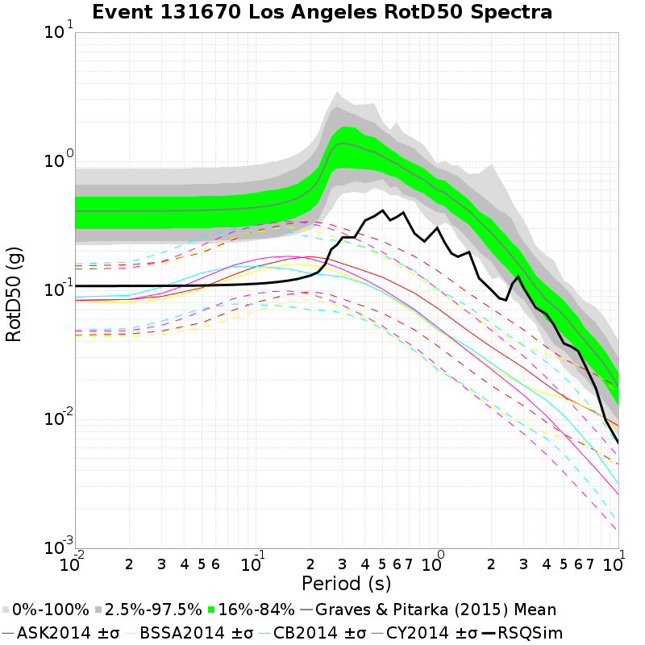
#### Los Angeles Acceleration Seismograms
*[(top)](#table-of-contents)*

RSQSim ruptures in blue. Gray seismograms are Graves & Pitarka (2015) comparisons.

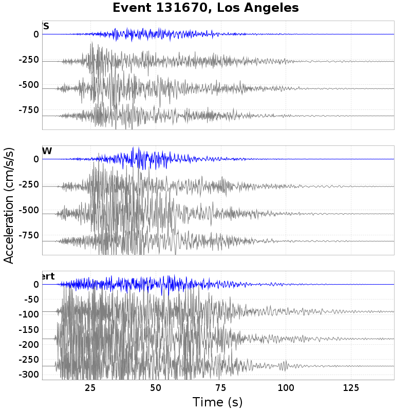
#### Los Angeles Velocity Seismograms
*[(top)](#table-of-contents)*

RSQSim ruptures in blue. Gray seismograms are Graves & Pitarka (2015) comparisons.

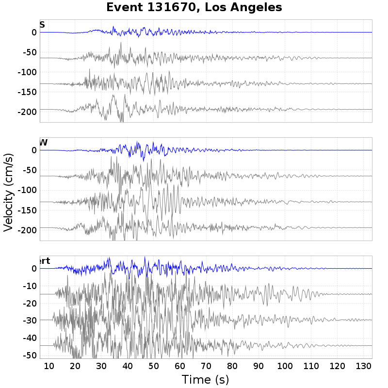
### Site Riverside
*[(top)](#table-of-contents)*

*Location: 33.95, -117.4*

| Distance | Actual RSQSim Surface | BBP Equivalent Planar Surface | GMPE Surface |
|-----|-----|-----|-----|
| Horizontal | 21.00 km | 31.99 km | 31.35 km |
| 3-D | 21.18 km | 31.99 km | 31.35 km |

*NOTE: RSQSim ruptures sometimes have a few co-rupturing elements on faults some distance from the main rupture. This may cause discrepancies in the table above, consult rupture map plot.*
#### Riverside Fourier Amplitude Spectra
*[(top)](#table-of-contents)*

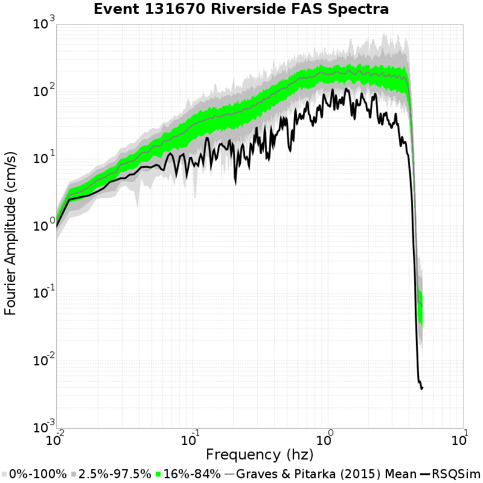
#### Riverside RotD50 Spectra
*[(top)](#table-of-contents)*

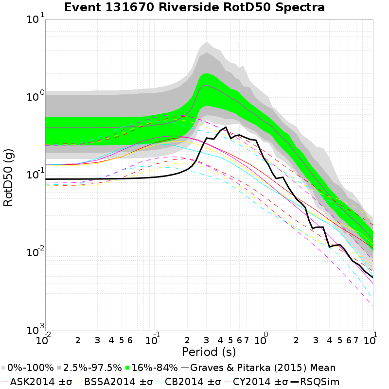
#### Riverside Acceleration Seismograms
*[(top)](#table-of-contents)*

RSQSim ruptures in blue. Gray seismograms are Graves & Pitarka (2015) comparisons.

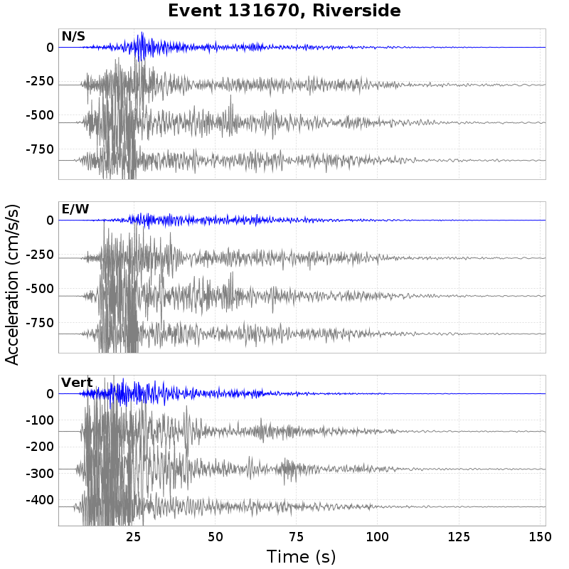
#### Riverside Velocity Seismograms
*[(top)](#table-of-contents)*

RSQSim ruptures in blue. Gray seismograms are Graves & Pitarka (2015) comparisons.

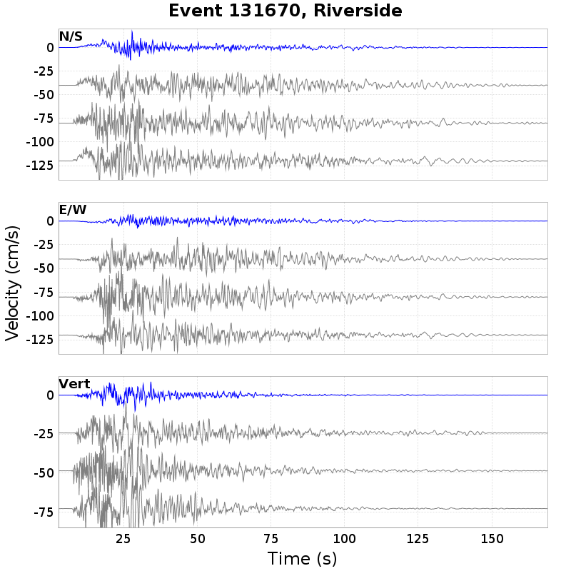
### Site San Diego
*[(top)](#table-of-contents)*

*Location: 32.7, -117.15*

| Distance | Actual RSQSim Surface | BBP Equivalent Planar Surface | GMPE Surface |
|-----|-----|-----|-----|
| Horizontal | 155.53 km | 172.33 km | 171.73 km |
| 3-D | 155.59 km | 172.33 km | 171.73 km |

*NOTE: RSQSim ruptures sometimes have a few co-rupturing elements on faults some distance from the main rupture. This may cause discrepancies in the table above, consult rupture map plot.*
#### San Diego Fourier Amplitude Spectra
*[(top)](#table-of-contents)*

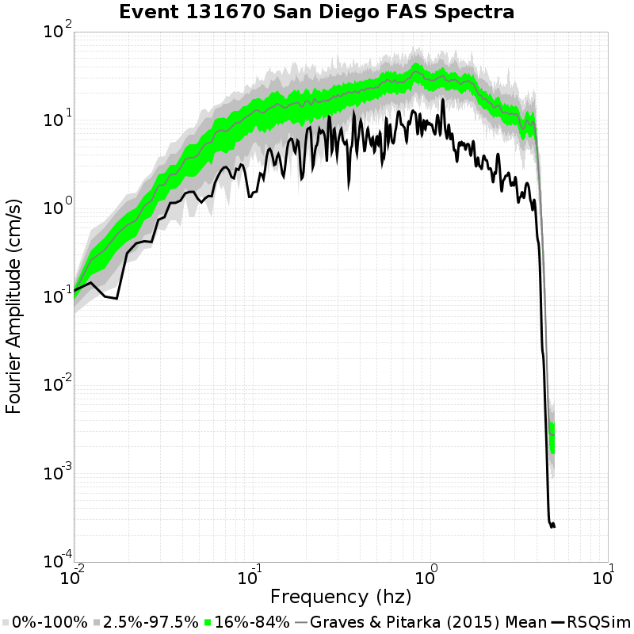
#### San Diego RotD50 Spectra
*[(top)](#table-of-contents)*

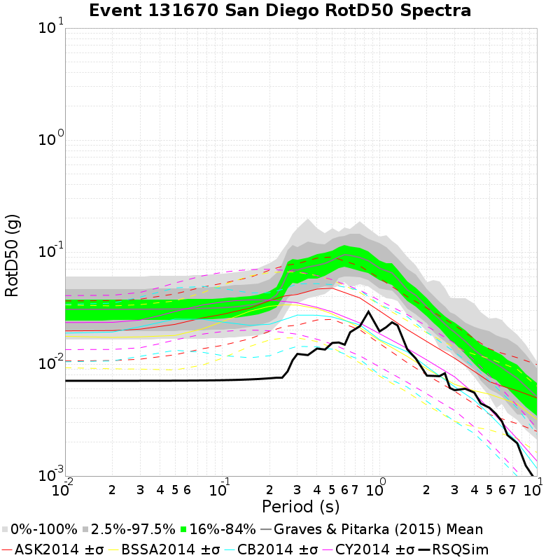
#### San Diego Acceleration Seismograms
*[(top)](#table-of-contents)*

RSQSim ruptures in blue. Gray seismograms are Graves & Pitarka (2015) comparisons.

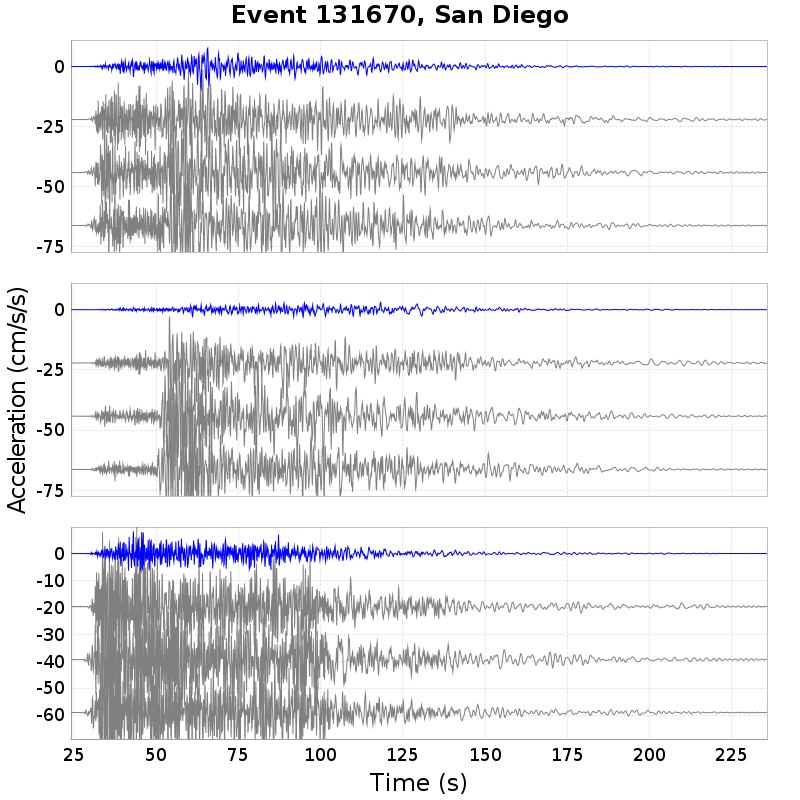
#### San Diego Velocity Seismograms
*[(top)](#table-of-contents)*

RSQSim ruptures in blue. Gray seismograms are Graves & Pitarka (2015) comparisons.

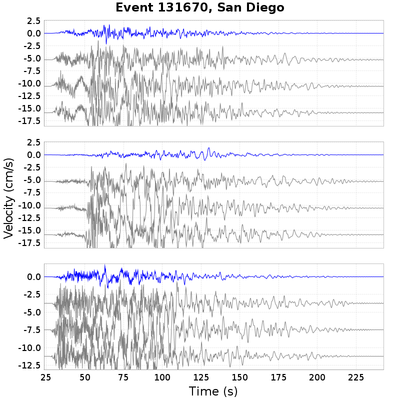
### Site Santa Barbara
*[(top)](#table-of-contents)*

*Location: 34.45, -119.7*

| Distance | Actual RSQSim Surface | BBP Equivalent Planar Surface | GMPE Surface |
|-----|-----|-----|-----|
| Horizontal | 73.82 km | 72.98 km | 73.56 km |
| 3-D | 73.96 km | 72.98 km | 73.56 km |

*NOTE: RSQSim ruptures sometimes have a few co-rupturing elements on faults some distance from the main rupture. This may cause discrepancies in the table above, consult rupture map plot.*
#### Santa Barbara Fourier Amplitude Spectra
*[(top)](#table-of-contents)*

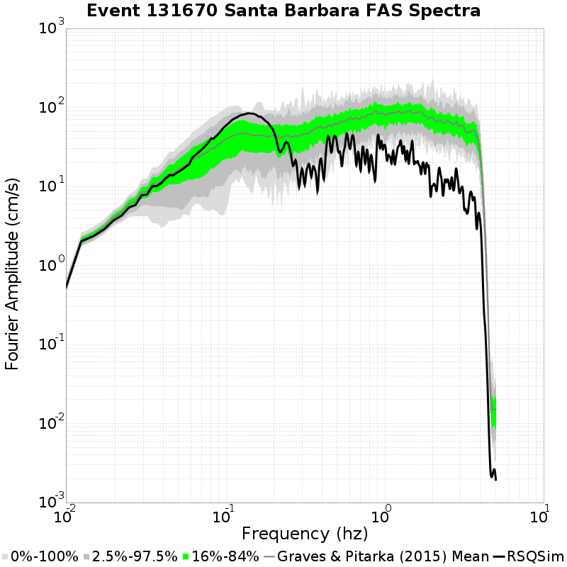
#### Santa Barbara RotD50 Spectra
*[(top)](#table-of-contents)*

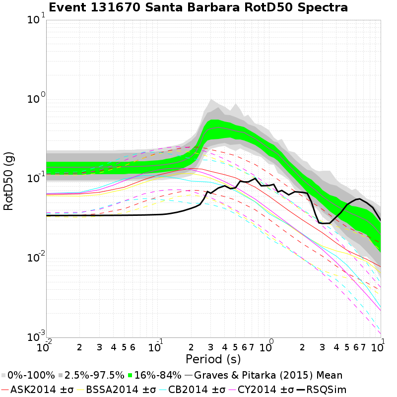
#### Santa Barbara Acceleration Seismograms
*[(top)](#table-of-contents)*

RSQSim ruptures in blue. Gray seismograms are Graves & Pitarka (2015) comparisons.

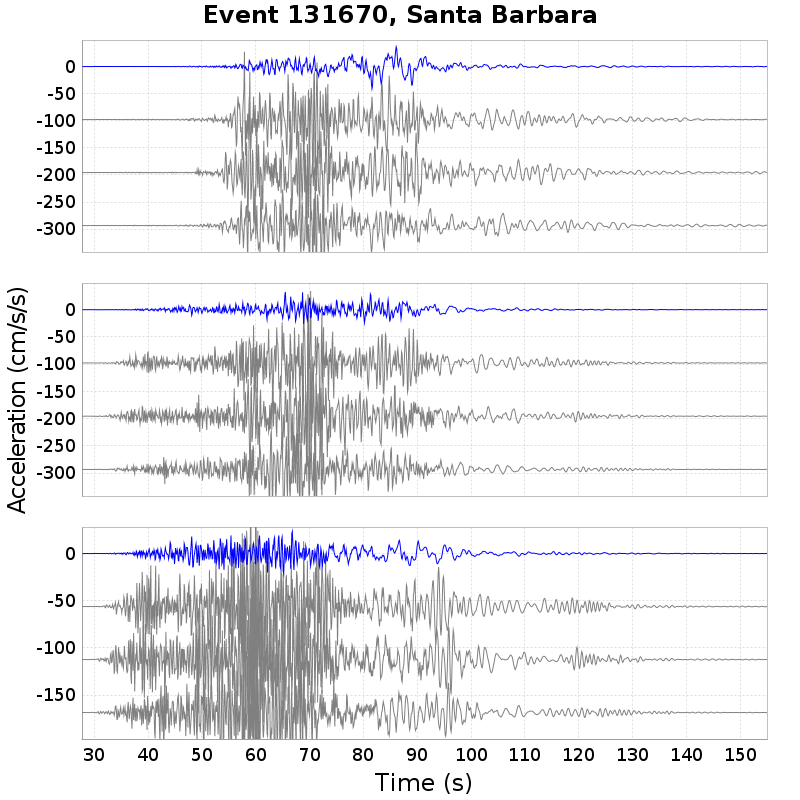
#### Santa Barbara Velocity Seismograms
*[(top)](#table-of-contents)*

RSQSim ruptures in blue. Gray seismograms are Graves & Pitarka (2015) comparisons.

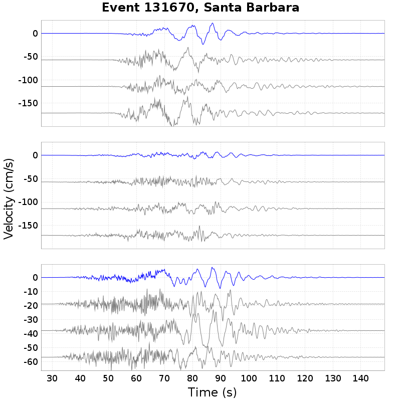
