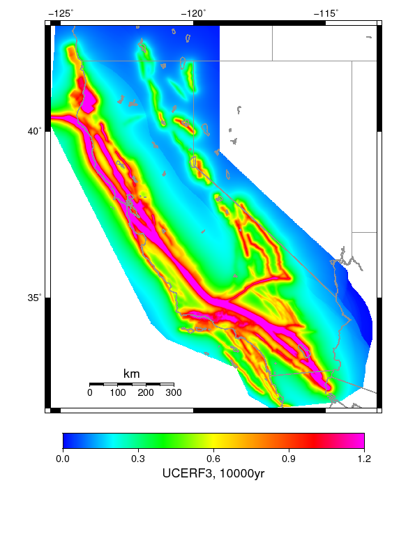

# Hazard Comparisons

*IMT: 1.0s SA (g)*

*Subsections participates in a rupture if at least 20.0 % of its area ruptures*

[Catalog Details](../#bruce-2349)

## Table Of Contents
* [Hazard Maps](#hazard-maps)
* [Histograms](#histograms)
* [0-D Histogram](#0-d-histogram)
* [1-D Histogram](#1-d-histogram)
* [2-D Histograms](#2-d-histograms)
* [Hazard Curves](#hazard-curves)
## Hazard Maps
*[(top)](#table-of-contents)*

| Return Period | RSQSim | UCERF3 | Ratio | Tight Ratio |
|-----|-----|-----|-----|-----|
| **1000 yr** |  |  |  |  |
| **2500 yr** |  |  |  |  |
| **10000 yr** |  |  |  |  |

## Histograms

## 0-D Histogram
*[(top)](#table-of-contents)*

## 1-D Histogram
*[(top)](#table-of-contents)*

## 2-D Histograms
*[(top)](#table-of-contents)*

| Return Period | 2-D Histogram |
|-----|-----|
| **1000 yr** |  |
| **2500 yr** |  |
| **5000 yr** |  |
| **10000 yr** |  |

## Hazard Curves
*[(top)](#table-of-contents)*

|  |  |  |  |
|-----|-----|-----|-----|
|  |  |  |  |
|  |  |  |  |
|  |  |  |  |
|  |  |  |  |
|  |  |  |  |

