# Hazard Clustering Comparisons

* GMPE: Boore, Stewart, Seyhan & Atkinson (2014)
* IMT: PGA

[Catalog Details](../#bruce-2381)

## Table Of Contents
* [50yr Sub-Catalogs](#50yr-sub-catalogs)
  * [50yr Scatters](#50yr-scatters)
  * [50yr Site Fractile Curves](#50yr-site-fractile-curves)
* [1yr Sub-Catalogs](#1yr-sub-catalogs)
  * [1yr Scatters](#1yr-scatters)
  * [1yr Site Fractile Curves](#1yr-site-fractile-curves)
* [1250yr Sub-Catalogs](#1250yr-sub-catalogs)
  * [1250yr Scatters](#1250yr-scatters)
  * [1250yr Site Fractile Curves](#1250yr-site-fractile-curves)
* [1720yr Sub-Catalogs](#1720yr-sub-catalogs)
  * [1720yr Scatters](#1720yr-scatters)
  * [1720yr Site Fractile Curves](#1720yr-site-fractile-curves)
* [Site 2% in 50yr RP Functions](#site-2-in-50yr-rp-functions)
## 50yr Sub-Catalogs
*[(top)](#table-of-contents)*

**9354 sub-catalogs**

| Fractile | Time-Independent Probability |
|-----|-----|
| **0.02** | **4.0E-4** |
| **0.1** | **0.002** |
### 50yr Scatters
*[(top)](#table-of-contents)*

### 50yr Site Fractile Curves
*[(top)](#table-of-contents)*

| Site | Fractile Curve Plot |
|-----|-----|
| **Century City** | 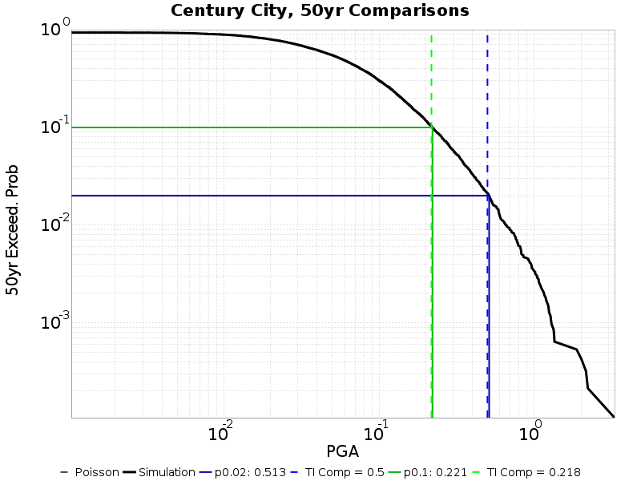 |
| **Concord** |  |
| **Irvine** |  |
| **Long Beach** |  |
| **Los Angeles** | 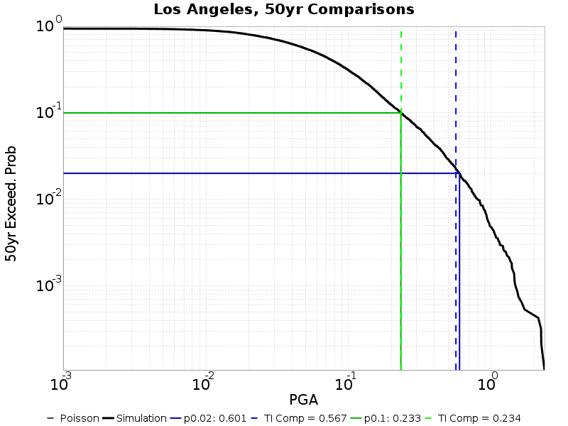 |
| **Monterey** |  |
| **Northridge** | 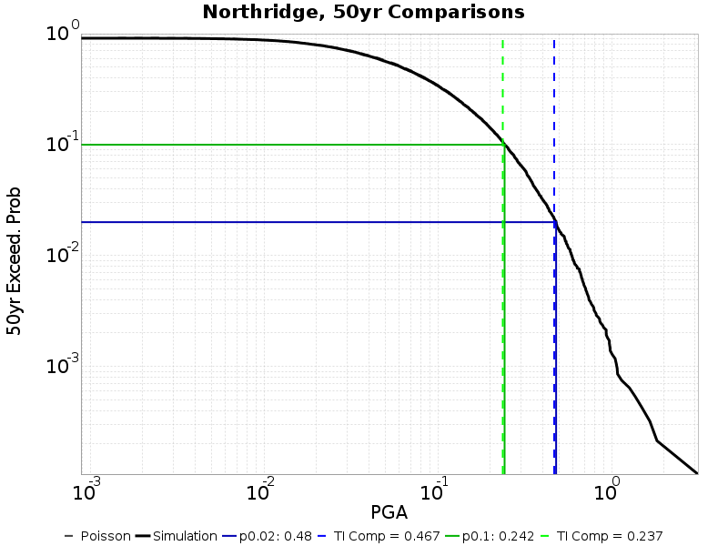 |
| **Oakland** |  |
| **Pasadena** |  |
| **Riverside** |  |
| **Sacramento** |  |
| **San Bernardino** |  |
| **San Diego** |  |
| **San Francisco** |  |
| **San Jose** | 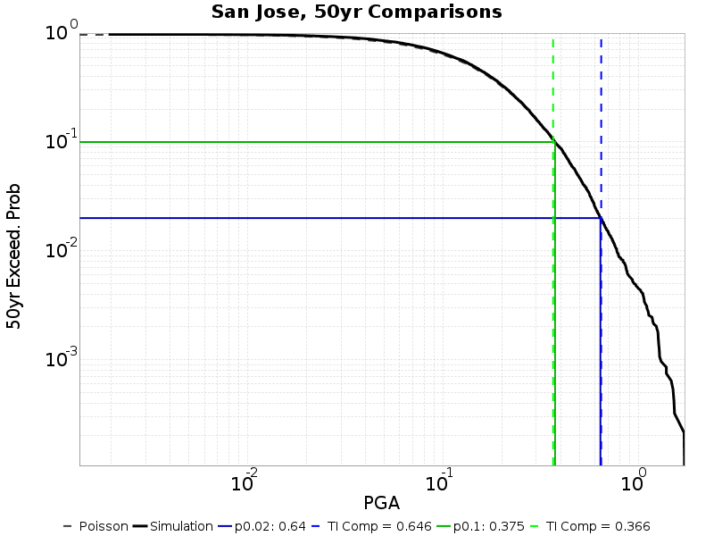 |
| **San Luis Obispo** | 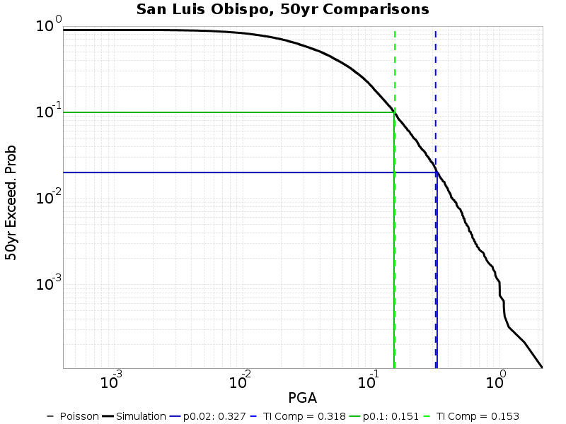 |
| **San Mateo** |  |
| **Santa Barbara** | 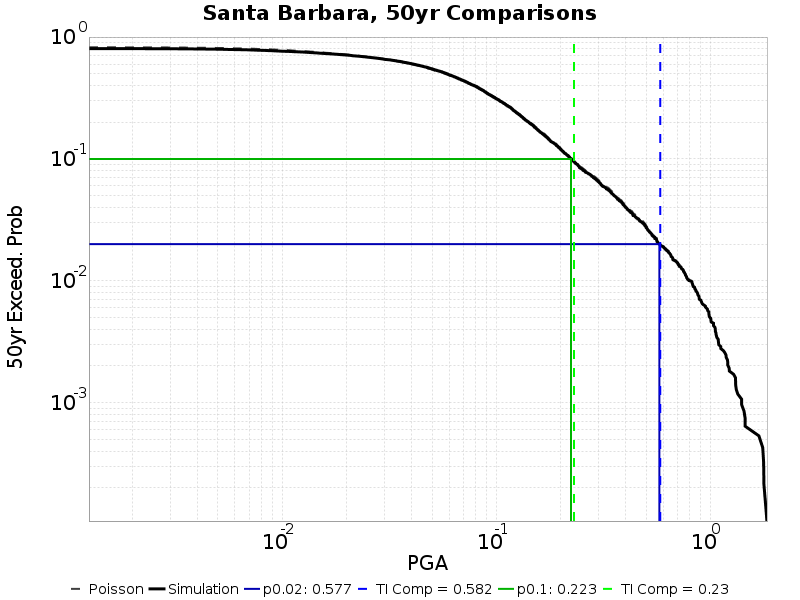 |
| **Santa Cruz** |  |
| **Santa Rosa** |  |
| **USC** |  |
| **Vallejo** | 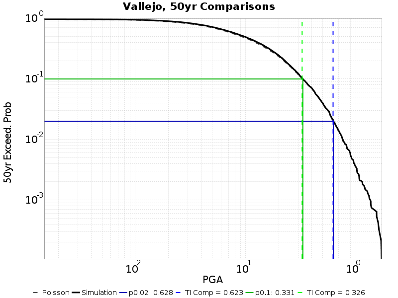 |
| **Ventura** |  |

## 1yr Sub-Catalogs
*[(top)](#table-of-contents)*

**467709 sub-catalogs**

| Fractile | Time-Independent Probability |
|-----|-----|
| **4.0E-4** | **4.0E-4** |
| **0.002** | **0.002** |
### 1yr Scatters
*[(top)](#table-of-contents)*

### 1yr Site Fractile Curves
*[(top)](#table-of-contents)*

| Site | Fractile Curve Plot |
|-----|-----|
| **Century City** | 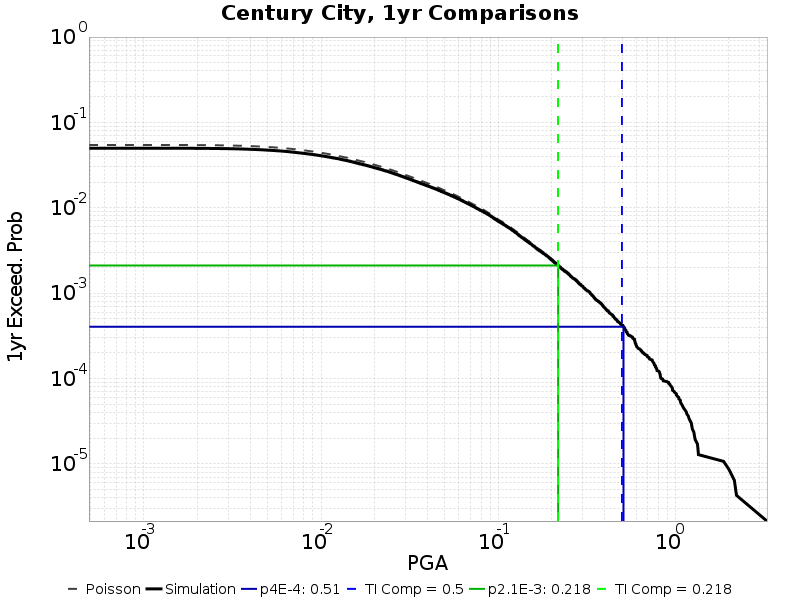 |
| **Concord** |  |
| **Irvine** |  |
| **Long Beach** |  |
| **Los Angeles** |  |
| **Monterey** | 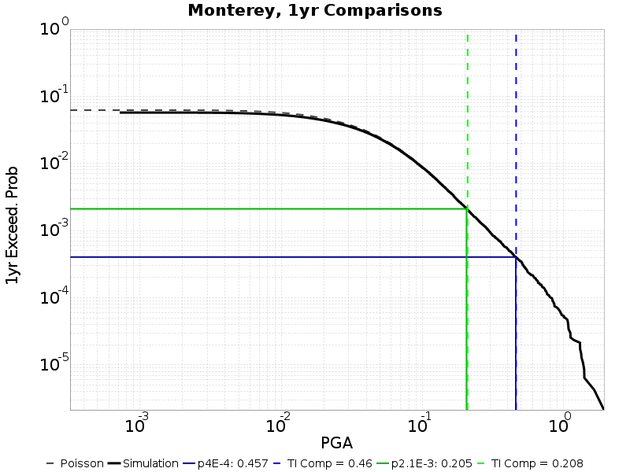 |
| **Northridge** | 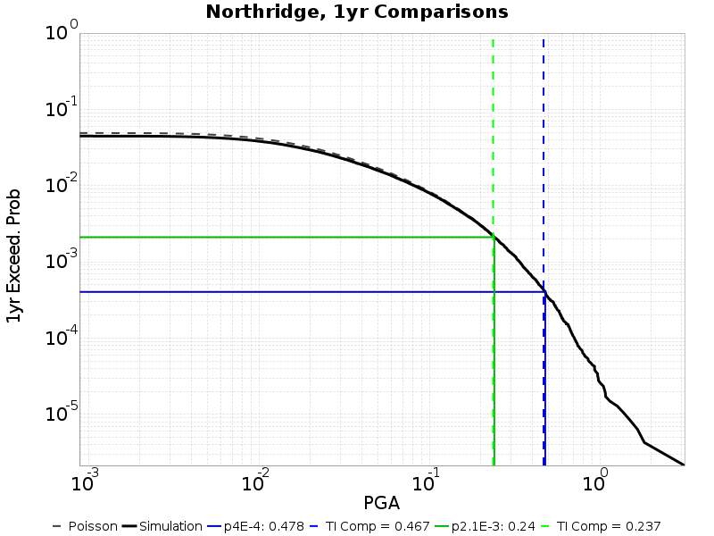 |
| **Oakland** | 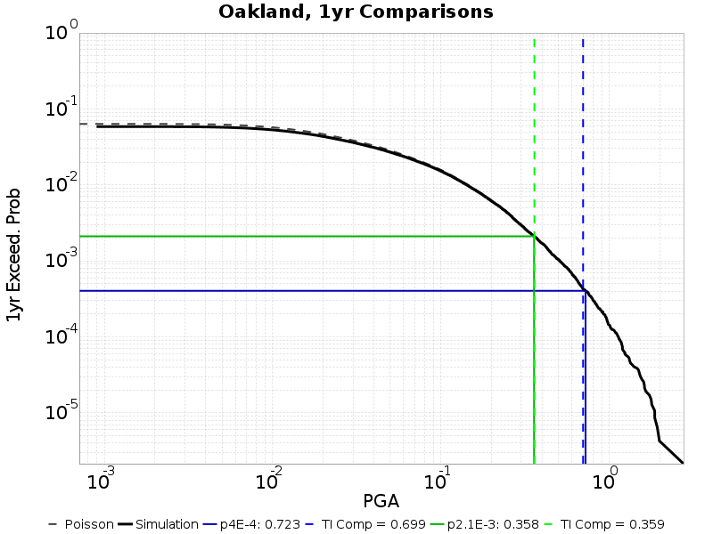 |
| **Pasadena** |  |
| **Riverside** |  |
| **Sacramento** |  |
| **San Bernardino** |  |
| **San Diego** |  |
| **San Francisco** |  |
| **San Jose** |  |
| **San Luis Obispo** | 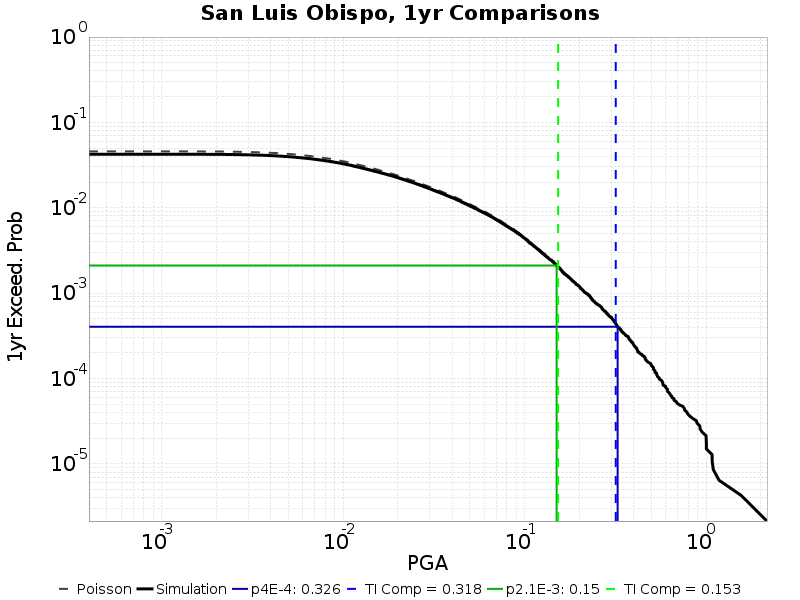 |
| **San Mateo** |  |
| **Santa Barbara** |  |
| **Santa Cruz** |  |
| **Santa Rosa** |  |
| **USC** | 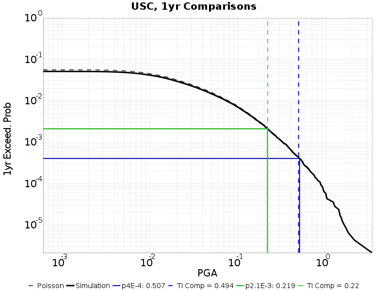 |
| **Vallejo** |  |
| **Ventura** |  |

## 1250yr Sub-Catalogs
*[(top)](#table-of-contents)*

**374 sub-catalogs**

| Fractile | Time-Independent Probability |
|-----|-----|
| **0.5** | **4.0E-4** |
### 1250yr Scatters
*[(top)](#table-of-contents)*

### 1250yr Site Fractile Curves
*[(top)](#table-of-contents)*

| Site | Fractile Curve Plot |
|-----|-----|
| **Century City** |  |
| **Concord** |  |
| **Irvine** |  |
| **Long Beach** |  |
| **Los Angeles** |  |
| **Monterey** |  |
| **Northridge** |  |
| **Oakland** |  |
| **Pasadena** |  |
| **Riverside** |  |
| **Sacramento** |  |
| **San Bernardino** |  |
| **San Diego** |  |
| **San Francisco** |  |
| **San Jose** |  |
| **San Luis Obispo** |  |
| **San Mateo** |  |
| **Santa Barbara** |  |
| **Santa Cruz** |  |
| **Santa Rosa** |  |
| **USC** |  |
| **Vallejo** |  |
| **Ventura** |  |

## 1720yr Sub-Catalogs
*[(top)](#table-of-contents)*

**271 sub-catalogs**

| Fractile | Time-Independent Probability |
|-----|-----|
| **0.5** | **4.0E-4** |
### 1720yr Scatters
*[(top)](#table-of-contents)*

### 1720yr Site Fractile Curves
*[(top)](#table-of-contents)*

| Site | Fractile Curve Plot |
|-----|-----|
| **Century City** |  |
| **Concord** |  |
| **Irvine** |  |
| **Long Beach** |  |
| **Los Angeles** |  |
| **Monterey** |  |
| **Northridge** |  |
| **Oakland** |  |
| **Pasadena** |  |
| **Riverside** |  |
| **Sacramento** |  |
| **San Bernardino** |  |
| **San Diego** |  |
| **San Francisco** |  |
| **San Jose** |  |
| **San Luis Obispo** |  |
| **San Mateo** |  |
| **Santa Barbara** |  |
| **Santa Cruz** |  |
| **Santa Rosa** |  |
| **USC** |  |
| **Vallejo** |  |
| **Ventura** |  |

## Site 2% in 50yr RP Functions
*[(top)](#table-of-contents)*

**Time Independent Probability Level: 4.0E-4**

| Site | Fractile Curve Plot |
|-----|-----|
| **Century City** |  |
| **Concord** | 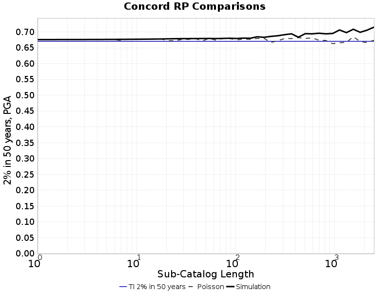 |
| **Irvine** |  |
| **Long Beach** |  |
| **Los Angeles** | 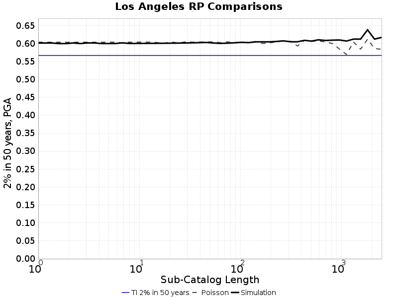 |
| **Monterey** | 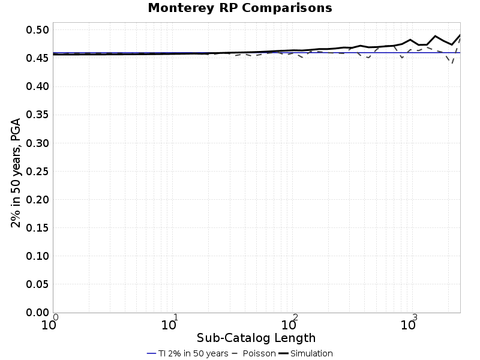 |
| **Northridge** |  |
| **Oakland** | 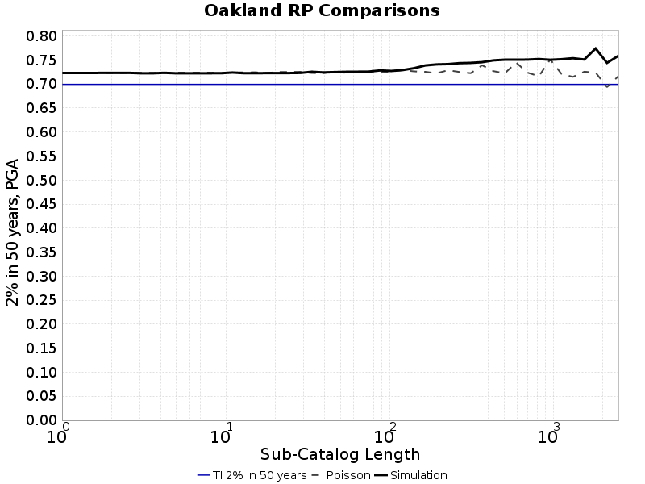 |
| **Pasadena** |  |
| **Riverside** |  |
| **Sacramento** |  |
| **San Bernardino** |  |
| **San Diego** | 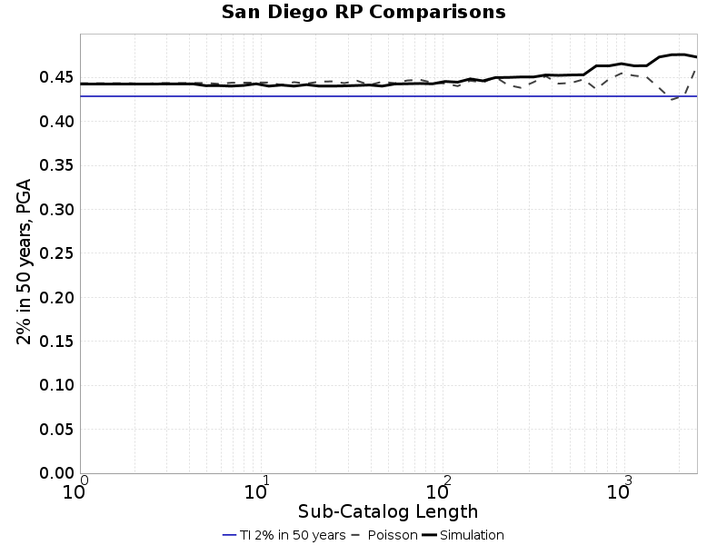 |
| **San Francisco** |  |
| **San Jose** |  |
| **San Luis Obispo** |  |
| **San Mateo** |  |
| **Santa Barbara** |  |
| **Santa Cruz** |  |
| **Santa Rosa** |  |
| **USC** |  |
| **Vallejo** |  |
| **Ventura** |  |

