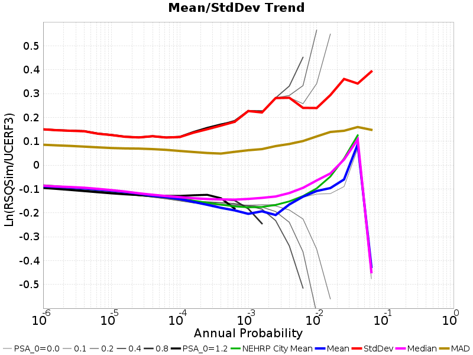
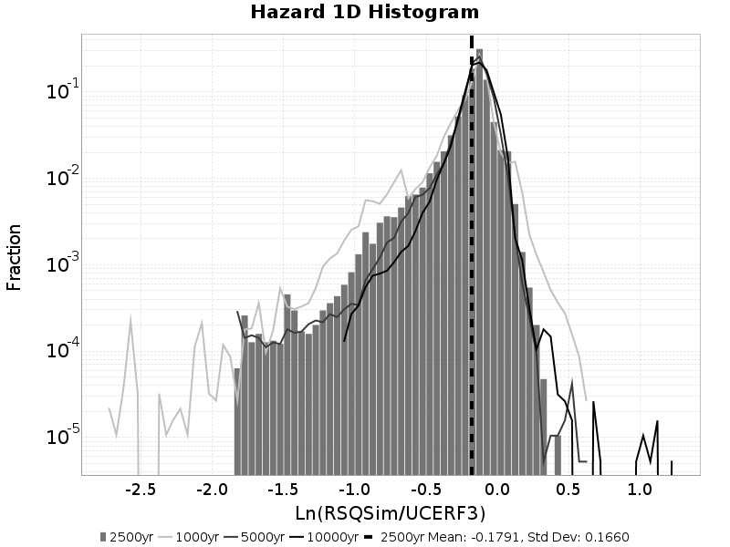
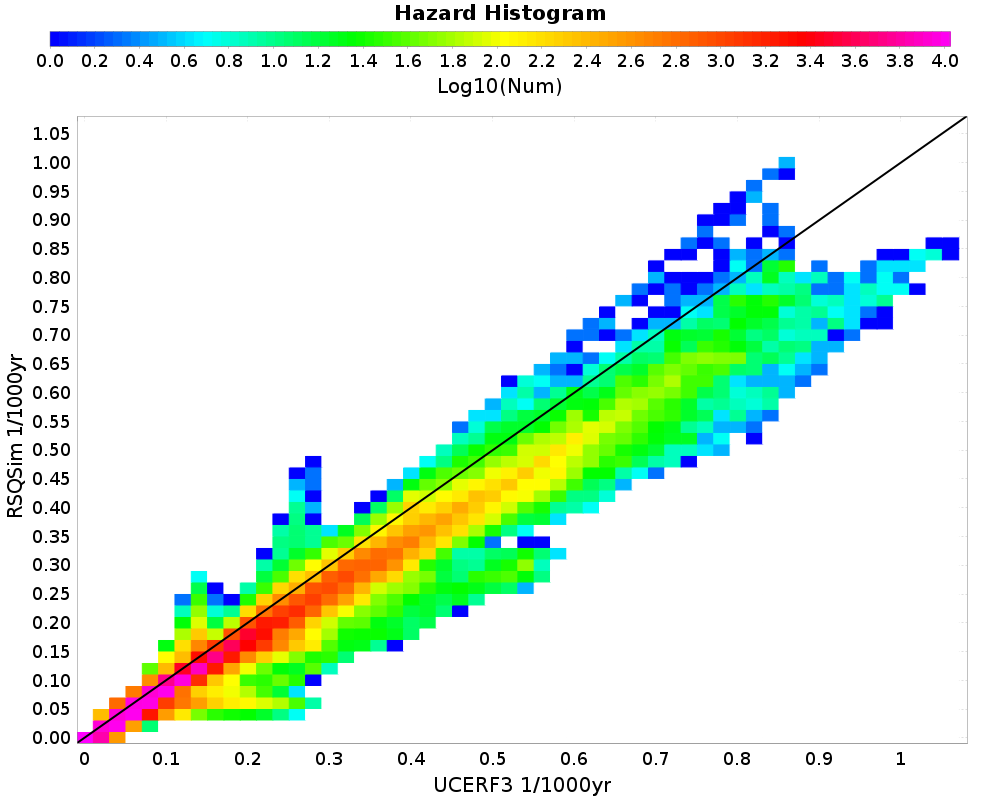
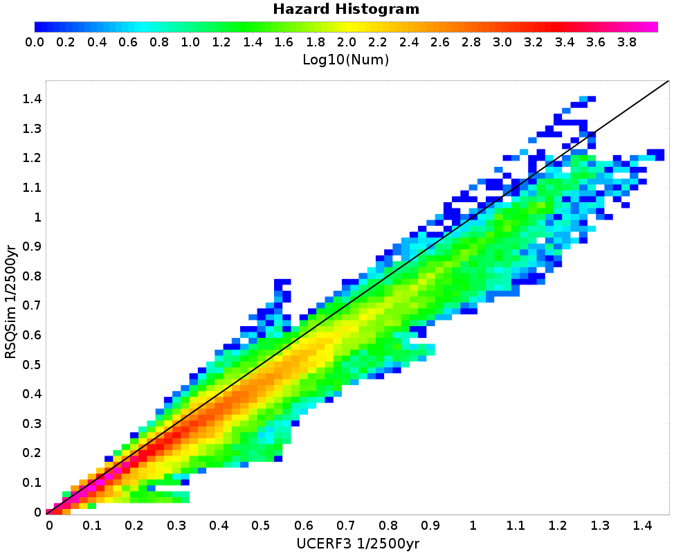
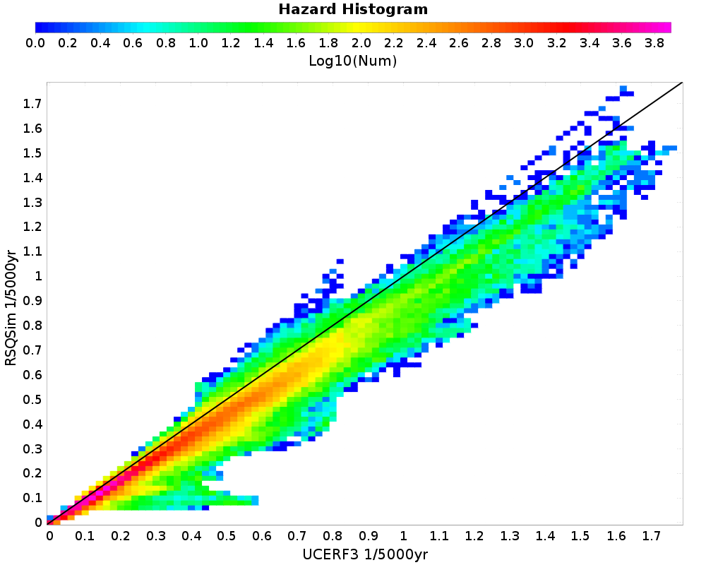
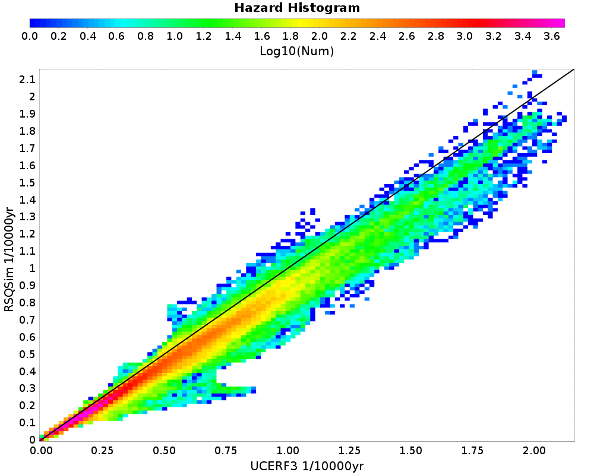

# Hazard Comparisons

*IMT: 1.0s SA (g)*

*Subsections participates in a rupture if at least 20.0 % of its area ruptures*

[Catalog Details](../#bruce-2381)

## Table Of Contents
* [Histograms](#histograms)
* [0-D Histogram](#0-d-histogram)
* [1-D Histogram](#1-d-histogram)
* [2-D Histograms](#2-d-histograms)
## Histograms

## 0-D Histogram
*[(top)](#table-of-contents)*

## 1-D Histogram
*[(top)](#table-of-contents)*

## 2-D Histograms
*[(top)](#table-of-contents)*

| Return Period | 2-D Histogram |
|-----|-----|
| **1000 yr** |  |
| **2500 yr** |  |
| **5000 yr** |  |
| **10000 yr** |  |

